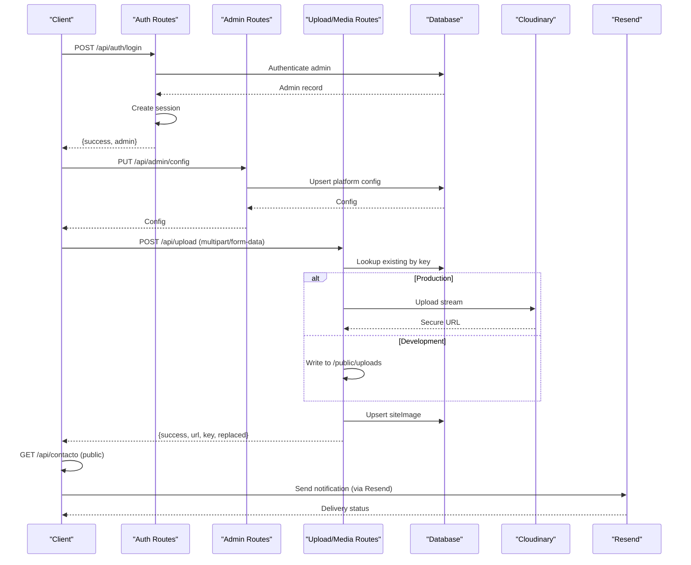
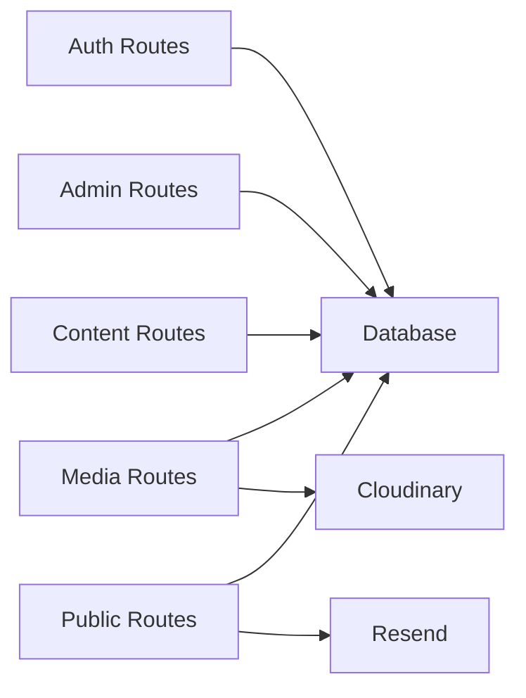

# API Reference

<cite>
**Referenced Files in This Document**
- [route.ts](file://src/app/api/route.ts)
- [route.ts](file://src/app/api/admin/config/route.ts)
- [route.ts](file://src/app/api/admin/images/route.ts)
- [route.ts](file://src/app/api/admin/media/route.ts)
- [route.ts](file://src/app/api/auth/check/route.ts)
- [route.ts](file://src/app/api/auth/login/route.ts)
- [route.ts](file://src/app/api/auth/logout/route.ts)
- [route.ts](file://src/app/api/auth/reset-password/route.ts)
- [route.ts](file://src/app/api/servicios/route.ts)
- [route.ts](file://src/app/api/noticias/route.ts)
- [route.ts](file://src/app/api/about/route.ts)
- [route.ts](file://src/app/api/contacto/route.ts)
- [route.ts](file://src/app/api/upload/route.ts)
- [route.ts](file://src/app/api/imagenes/route.ts)
- [route.ts](file://src/app/api/legal/route.ts)
- [route.ts](file://src/app/api/carrusel/route.ts)
</cite>

## Table of Contents
1. [Introduction](#introduction)
2. [Project Structure](#project-structure)
3. [Core Components](#core-components)
4. [Architecture Overview](#architecture-overview)
5. [Detailed Component Analysis](#detailed-component-analysis)
6. [Dependency Analysis](#dependency-analysis)
7. [Performance Considerations](#performance-considerations)
8. [Troubleshooting Guide](#troubleshooting-guide)
9. [Conclusion](#conclusion)
10. [Appendices](#appendices)

## Introduction
This document provides a comprehensive API reference for the GreenAxis platform. It covers administrative endpoints, authentication routes, media management, content management, and public endpoints. For each endpoint, you will find HTTP methods, URL patterns, request/response schemas, authentication requirements, parameter validation, error handling strategies, and rate limiting policies. Security considerations, integration examples, client implementation guidelines, common use cases, and performance optimization tips are also included.

## Project Structure
The API is organized under Next.js App Router conventions. Each route group corresponds to a functional area:
- Administrative configuration and media management
- Authentication lifecycle
- Content management for services, news, about page, legal pages, and carousel
- Public endpoints for contact submissions and uploads

```mermaid
graph TB
subgraph "Public"
contacto["/api/contacto"]
upload["/api/upload"]
imagenes["/api/imagenes"]
end
subgraph "Admin"
admin_config["/api/admin/config"]
admin_images["/api/admin/images"]
admin_media["/api/admin/media"]
end
subgraph "Auth"
auth_check["/api/auth/check"]
auth_login["/api/auth/login"]
auth_logout["/api/auth/logout"]
auth_reset["/api/auth/reset-password"]
end
subgraph "Content"
servicios["/api/servicios"]
noticias["/api/noticias"]
about["/api/about"]
legal["/api/legal"]
carrusel["/api/carrusel"]
end
api_root["/api"]
api_root --> contacto
api_root --> upload
api_root --> imagenes
api_root --> admin_config
api_root --> admin_images
api_root --> admin_media
api_root --> auth_check
api_root --> auth_login
api_root --> auth_logout
api_root --> auth_reset
api_root --> servicios
api_root --> noticias
api_root --> about
api_root --> legal
api_root --> carrusel
```

**Diagram sources**
- [route.ts:1-302](file://src/app/api/contacto/route.ts#L1-L302)
- [route.ts:1-452](file://src/app/api/upload/route.ts#L1-L452)
- [route.ts:1-15](file://src/app/api/imagenes/route.ts#L1-L15)
- [route.ts:1-120](file://src/app/api/admin/config/route.ts#L1-L120)
- [route.ts:1-73](file://src/app/api/admin/images/route.ts#L1-L73)
- [route.ts:1-150](file://src/app/api/admin/media/route.ts#L1-L150)
- [route.ts:1-21](file://src/app/api/auth/check/route.ts#L1-L21)
- [route.ts:1-91](file://src/app/api/auth/login/route.ts#L1-L91)
- [route.ts:1-13](file://src/app/api/auth/logout/route.ts#L1-L13)
- [route.ts:1-262](file://src/app/api/auth/reset-password/route.ts#L1-L262)
- [route.ts:1-161](file://src/app/api/servicios/route.ts#L1-L161)
- [route.ts:1-229](file://src/app/api/noticias/route.ts#L1-L229)
- [route.ts:1-148](file://src/app/api/about/route.ts#L1-L148)
- [route.ts:1-89](file://src/app/api/legal/route.ts#L1-L89)
- [route.ts:1-122](file://src/app/api/carrusel/route.ts#L1-L122)

**Section sources**
- [route.ts:1-5](file://src/app/api/route.ts#L1-L5)

## Core Components
- Authentication: Session-based admin authentication with cookie-based sessions and rate-limiting safeguards.
- Media Management: Upload, replace, list, and delete media with duplicate detection and Cloudinary integration in production.
- Content Management: CRUD for services, news, about page, legal pages, and carousel slides with slug generation and cache revalidation.
- Public APIs: Contact form submission with rate limiting and email notifications via Resend; public image listing.

**Section sources**
- [route.ts:1-21](file://src/app/api/auth/check/route.ts#L1-L21)
- [route.ts:1-91](file://src/app/api/auth/login/route.ts#L1-L91)
- [route.ts:1-452](file://src/app/api/upload/route.ts#L1-L452)
- [route.ts:1-161](file://src/app/api/servicios/route.ts#L1-L161)
- [route.ts:1-229](file://src/app/api/noticias/route.ts#L1-L229)
- [route.ts:1-148](file://src/app/api/about/route.ts#L1-L148)
- [route.ts:1-89](file://src/app/api/legal/route.ts#L1-L89)
- [route.ts:1-122](file://src/app/api/carrusel/route.ts#L1-L122)
- [route.ts:1-302](file://src/app/api/contacto/route.ts#L1-L302)

## Architecture Overview
The API follows a layered architecture:
- Route handlers implement HTTP endpoints and enforce authentication.
- Data access uses a database client to interact with the Prisma-managed schema.
- Production-specific integrations include Cloudinary for media storage and Resend for transactional emails.
- Cache revalidation triggers Next.js ISR updates after admin operations.

**Diagram sources**
- [route.ts:1-91](file://src/app/api/auth/login/route.ts#L1-L91)
- [route.ts:1-120](file://src/app/api/admin/config/route.ts#L1-L120)
- [route.ts:1-452](file://src/app/api/upload/route.ts#L1-L452)
- [route.ts:1-302](file://src/app/api/contacto/route.ts#L1-L302)

## Detailed Component Analysis

### Authentication Endpoints
- Base path: /api/auth/*
- Authentication requirement: None for check; session required for protected routes.

Endpoints:
- GET /api/auth/check
  - Purpose: Verify current admin session.
  - Auth: Optional; returns authenticated flag and admin info if present.
  - Responses:
    - 200 OK: { authenticated: boolean, admin?: { id, email, name } }
    - 500 Internal Server Error: { error }

- POST /api/auth/login
  - Purpose: Admin login with rate limiting.
  - Auth: None.
  - Body:
    - email: string (required)
    - password: string (required)
  - Validation:
    - Email format check.
    - Rate limiting: Max 5 attempts per IP within 15 minutes; returns remaining lockout minutes on failure.
  - Responses:
    - 200 OK: { success: true, admin: { id, email, name } }
    - 400 Bad Request: { error }
    - 401 Unauthorized: { error, attempts? }
    - 429 Too Many Requests: { error, locked: true }
    - 500 Internal Server Error: { error }

- POST /api/auth/logout
  - Purpose: Destroy admin session.
  - Auth: Required.
  - Responses:
    - 200 OK: { success: true }
    - 500 Internal Server Error: { error }

- GET /api/auth/reset-password?token=...
  - Purpose: Validate reset token.
  - Auth: None.
  - Query:
    - token: string (required)
  - Responses:
    - 200 OK: { valid: true, email } or { valid: false, error }
    - 400 Bad Request: { error }
    - 500 Internal Server Error: { error }

- POST /api/auth/reset-password
  - Purpose: Request password reset; sends email with a token.
  - Auth: None.
  - Body:
    - email: string (required, validated)
  - Rate limiting: Prevents frequent tokens within 5 minutes.
  - Responses:
    - 200 OK: { success: true, message }
    - 400 Bad Request: { error }
    - 500 Internal Server Error: { error }

- PUT /api/auth/reset-password
  - Purpose: Complete password reset using token.
  - Auth: None.
  - Body:
    - token: string (required)
    - password: string (min length 8)
  - Responses:
    - 200 OK: { success: true, message }
    - 400 Bad Request: { error }
    - 500 Internal Server Error: { error }

Security considerations:
- Rate limiting for brute-force protection on login and reset requests.
- Timing attack mitigation by delaying invalid credential responses.
- Tokens are hashed before storage; URLs carry plaintext tokens for email delivery.

**Section sources**
- [route.ts:1-21](file://src/app/api/auth/check/route.ts#L1-L21)
- [route.ts:1-91](file://src/app/api/auth/login/route.ts#L1-L91)
- [route.ts:1-13](file://src/app/api/auth/logout/route.ts#L1-L13)
- [route.ts:1-262](file://src/app/api/auth/reset-password/route.ts#L1-L262)

### Administrative Endpoints
- Base path: /api/admin/*

- GET /api/admin/config
  - Purpose: Retrieve platform configuration; auto-creates defaults if missing.
  - Auth: Required.
  - Responses:
    - 200 OK: Platform configuration object
    - 401 Unauthorized: { error }
    - 500 Internal Server Error: { error }

- PUT /api/admin/config
  - Purpose: Update platform configuration.
  - Auth: Required.
  - Body: Configuration fields (strings, booleans, nested content).
  - Responses:
    - 200 OK: Updated configuration
    - 401 Unauthorized: { error }
    - 500 Internal Server Error: { error }

- GET /api/admin/images
  - Purpose: List all site images.
  - Auth: Required.
  - Responses:
    - 200 OK: Array of images
    - 401 Unauthorized: { error }
    - 500 Internal Server Error: { error }

- DELETE /api/admin/images?id={id}
  - Purpose: Delete an image by ID; removes physical file and DB record.
  - Auth: Required.
  - Query:
    - id: string (required)
  - Responses:
    - 200 OK: { success: true }
    - 400 Bad Request: { error }
    - 404 Not Found: { error }
    - 401 Unauthorized: { error }
    - 500 Internal Server Error: { error }

- GET /api/admin/media
  - Purpose: Paginated media listing with filters and usage count.
  - Auth: Required.
  - Query:
    - page: number (default 1)
    - limit: number (default 50, min 1, max 100)
    - category: string (optional)
    - search: string (optional)
    - type: 'image'|'video'|'audio' (optional)
  - Responses:
    - 200 OK: { items[], pagination: { page, limit, total, totalPages, hasMore } }
    - 400 Bad Request: { error }
    - 401 Unauthorized: { error }
    - 500 Internal Server Error: { error }

Security considerations:
- All endpoints require admin session.
- Media deletion removes files from disk or Cloudinary depending on environment.

**Section sources**
- [route.ts:1-120](file://src/app/api/admin/config/route.ts#L1-L120)
- [route.ts:1-73](file://src/app/api/admin/images/route.ts#L1-L73)
- [route.ts:1-150](file://src/app/api/admin/media/route.ts#L1-L150)

### Media Management Endpoints
- Base path: /api/upload and /api/admin/media

- POST /api/upload
  - Purpose: Upload or replace media with duplicate detection and Cloudinary integration.
  - Auth: Required.
  - Body (multipart/form-data):
    - file: File (required)
    - key: string (recommended for replacement)
    - fixedKey: string (optional)
    - label: string (optional)
    - category: string (optional)
    - skipDuplicateCheck: 'true' to bypass duplicate checks
  - Validation:
    - Allowed MIME types: images (JPG, PNG, WebP, GIF, SVG), videos (MP4, WebM, MOV), audio (MP3, WAV, OGG, M4A).
    - Size limits vary by environment and file type.
    - Duplicate detection by normalized filename unless skipped.
  - Behavior:
    - In production: uploads to Cloudinary; replaces old Cloudinary asset if key matches.
    - In development: writes to /public/uploads; replaces old file if key matches.
  - Responses:
    - 200 OK: { success: true, url, fileName, key, replaced: boolean }
    - 400 Bad Request: { error }
    - 401 Unauthorized: { error }
    - 500 Internal Server Error: { error, details? }

- DELETE /api/upload?key={key}|&url={url}
  - Purpose: Delete uploaded media by key or URL.
  - Auth: Required.
  - Query:
    - key: string (optional)
    - url: string (optional)
  - Behavior:
    - Deletes from Cloudinary (production) or filesystem (development).
  - Responses:
    - 200 OK: { success: true }
    - 400 Bad Request: { error }
    - 401 Unauthorized: { error }
    - 500 Internal Server Error: { error }

- GET /api/imagenes
  - Purpose: Public listing of all site images.
  - Auth: None.
  - Responses:
    - 200 OK: Array of images
    - 500 Internal Server Error: { error }

Integration examples:
- Replace an existing asset by passing the same key to POST /api/upload.
- Use skipDuplicateCheck=true to bypass duplicate detection when intentionally replacing.

**Section sources**
- [route.ts:1-452](file://src/app/api/upload/route.ts#L1-L452)
- [route.ts:1-15](file://src/app/api/imagenes/route.ts#L1-L15)

### Content Management Endpoints
- Base path: /api/servicios, /api/noticias, /api/about, /api/legal, /api/carrusel

- Services
  - GET /api/servicios
    - Purpose: List services ordered by sort key.
    - Auth: None.
    - Responses:
      - 200 OK: Array of services
      - 500 Internal Server Error: { error }

  - POST /api/servicios
    - Purpose: Create a service; generates slug if not provided.
    - Auth: Required.
    - Body: Service fields including title, slug, description, content, blocks, icon, imageUrl, order, active, featured.
    - Responses:
      - 200 OK: Created service
      - 400 Bad Request: { error }
      - 401 Unauthorized: { error }
      - 500 Internal Server Error: { error }

  - PUT /api/servicios
    - Purpose: Update a service; regenerates slug if requested.
    - Auth: Required.
    - Body: Service fields including id; optional regenerateSlug to update slug.
    - Responses:
      - 200 OK: Updated service
      - 400 Bad Request: { error }
      - 401 Unauthorized: { error }
      - 500 Internal Server Error: { error }

  - DELETE /api/servicios?id={id}
    - Purpose: Delete a service.
    - Auth: Required.
    - Query:
      - id: string (required)
    - Responses:
      - 200 OK: { success: true }
      - 400 Bad Request: { error }
      - 401 Unauthorized: { error }
      - 500 Internal Server Error: { error }

- News
  - GET /api/noticias
    - Purpose: Retrieve news list with pagination or single article by slug.
    - Auth: None (public) or Required (admin listing).
    - Query:
      - slug: string (optional)
      - page: number (optional)
      - limit: number (optional)
    - Responses:
      - 200 OK: Array (public) or { news[], total, pages, currentPage } (admin)
      - 400 Bad Request: { error }
      - 500 Internal Server Error: { error }

  - POST /api/noticias
    - Purpose: Create a news item; sets publishedAt if published=true.
    - Auth: Required.
    - Body: News fields including title, slug, excerpt, content, imageUrl, author, published, featured, publishedAt, blocks.
    - Responses:
      - 200 OK: Created news
      - 400 Bad Request: { error }
      - 401 Unauthorized: { error }
      - 500 Internal Server Error: { error }

  - PUT /api/noticias
    - Purpose: Update a news item; handles slug regeneration and publishedAt transitions.
    - Auth: Required.
    - Body: News fields including id; optional regenerateSlug and publishedAt.
    - Responses:
      - 200 OK: Updated news
      - 400 Bad Request: { error }
      - 401 Unauthorized: { error }
      - 500 Internal Server Error: { error }

  - DELETE /api/noticias?id={id}
    - Purpose: Delete a news item.
    - Auth: Required.
    - Query:
      - id: string (required)
    - Responses:
      - 200 OK: { success: true }
      - 400 Bad Request: { error }
      - 401 Unauthorized: { error }
      - 500 Internal Server Error: { error }

- About Page
  - GET /api/about
    - Purpose: Retrieve or initialize about page content.
    - Auth: None.
    - Responses:
      - 200 OK: About page content
      - 500 Internal Server Error: { error }

  - PUT /api/about
    - Purpose: Update about page content.
    - Auth: Required.
    - Body: About page fields including hero, history, mission, vision, values, team, stats, certifications, location.
    - Responses:
      - 200 OK: Updated about page
      - 400 Bad Request: { error }
      - 401 Unauthorized: { error }
      - 500 Internal Server Error: { error }

- Legal Pages
  - GET /api/legal?slug={slug}
    - Purpose: Retrieve legal page by slug or list all.
    - Auth: None.
    - Query:
      - slug: string (optional)
    - Responses:
      - 200 OK: Single page or array of pages
      - 500 Internal Server Error: { error }

  - PUT /api/legal
    - Purpose: Upsert a legal page by slug.
    - Auth: Required.
    - Body: { slug, title, content, blocks, manualDate }
    - Responses:
      - 200 OK: Saved page
      - 400 Bad Request: { error }
      - 401 Unauthorized: { error }
      - 500 Internal Server Error: { error }

- Carousel
  - GET /api/carrusel
    - Purpose: Retrieve carousel slides ordered by order field.
    - Auth: None.
    - Responses:
      - 200 OK: Array of slides
      - 500 Internal Server Error: { error }

  - POST /api/carrusel
    - Purpose: Create a carousel slide.
    - Auth: Required.
    - Body: Slide fields including title, subtitle, description, imageUrl, buttons, animations, gradient, order, active.
    - Responses:
      - 200 OK: Created slide
      - 400 Bad Request: { error }
      - 401 Unauthorized: { error }
      - 500 Internal Server Error: { error }

  - PUT /api/carrusel
    - Purpose: Update a carousel slide.
    - Auth: Required.
    - Body: Slide fields including id.
    - Responses:
      - 200 OK: Updated slide
      - 400 Bad Request: { error }
      - 401 Unauthorized: { error }
      - 500 Internal Server Error: { error }

  - DELETE /api/carrusel?id={id}
    - Purpose: Delete a carousel slide.
    - Auth: Required.
    - Query:
      - id: string (required)
    - Responses:
      - 200 OK: { success: true }
      - 400 Bad Request: { error }
      - 401 Unauthorized: { error }
      - 500 Internal Server Error: { error }

**Section sources**
- [route.ts:1-161](file://src/app/api/servicios/route.ts#L1-L161)
- [route.ts:1-229](file://src/app/api/noticias/route.ts#L1-L229)
- [route.ts:1-148](file://src/app/api/about/route.ts#L1-L148)
- [route.ts:1-89](file://src/app/api/legal/route.ts#L1-L89)
- [route.ts:1-122](file://src/app/api/carrusel/route.ts#L1-L122)

### Public Endpoints
- Base path: /api/contacto, /api/upload (public GET), /api/imagenes (public GET)

- POST /api/contacto
  - Purpose: Submit contact form with rate limiting and optional admin notification.
  - Auth: None.
  - Body:
    - name: string (required, min length 2)
    - email: string (required, valid format)
    - phone: string (optional, validated)
    - company: string (optional)
    - subject: string (optional)
    - message: string (required, min length 10)
    - consent: boolean (required)
  - Rate limiting: Max 5 messages per IP per hour.
  - Responses:
    - 200 OK: { success: true, id }
    - 400 Bad Request: { error }
    - 429 Too Many Requests: { error }
    - 500 Internal Server Error: { error }

- GET /api/contacto
  - Purpose: Admin-only retrieval of all contact messages.
  - Auth: Required.
  - Responses:
    - 200 OK: Array of messages
    - 401 Unauthorized: { error }
    - 500 Internal Server Error: { error }

- PUT /api/contacto
  - Purpose: Mark a message as read/unread (admin).
  - Auth: Required.
  - Body:
    - id: string (required)
    - read: boolean (required)
  - Responses:
    - 200 OK: Updated message
    - 400 Bad Request: { error }
    - 401 Unauthorized: { error }
    - 500 Internal Server Error: { error }

- DELETE /api/contacto?id={id}
  - Purpose: Delete a contact message (admin).
  - Auth: Required.
  - Query:
      - id: string (required)
  - Responses:
    - 200 OK: { success: true }
    - 400 Bad Request: { error }
    - 401 Unauthorized: { error }
    - 500 Internal Server Error: { error }

- GET /api/upload
  - Purpose: Public listing of uploaded media (useful for previews).
  - Auth: None.
  - Responses:
    - 200 OK: Array of media records
    - 500 Internal Server Error: { error }

- GET /api/imagenes
  - Purpose: Public listing of all site images.
  - Auth: None.
  - Responses:
    - 200 OK: Array of images
    - 500 Internal Server Error: { error }

Security considerations:
- Contact form validates inputs and sanitizes data.
- Rate limiting protects against abuse.
- Admin-only endpoints require session-based authentication.

**Section sources**
- [route.ts:1-302](file://src/app/api/contacto/route.ts#L1-L302)
- [route.ts:1-452](file://src/app/api/upload/route.ts#L1-L452)
- [route.ts:1-15](file://src/app/api/imagenes/route.ts#L1-L15)

## Dependency Analysis
- Authentication depends on session management and admin verification utilities.
- Media endpoints depend on database access and environment-specific storage (Cloudinary or filesystem).
- Content endpoints depend on database access and Next.js cache revalidation.
- Public endpoints depend on Resend for notifications and database access for persisted messages.

**Diagram sources**
- [route.ts:1-91](file://src/app/api/auth/login/route.ts#L1-L91)
- [route.ts:1-452](file://src/app/api/upload/route.ts#L1-L452)
- [route.ts:1-302](file://src/app/api/contacto/route.ts#L1-L302)

**Section sources**
- [route.ts:1-91](file://src/app/api/auth/login/route.ts#L1-L91)
- [route.ts:1-452](file://src/app/api/upload/route.ts#L1-L452)
- [route.ts:1-302](file://src/app/api/contacto/route.ts#L1-L302)

## Performance Considerations
- Use pagination for media and news listings to avoid large payloads.
- Prefer Cloudinary in production for scalable media delivery and transformations.
- Leverage cache revalidation after admin updates to keep content fresh efficiently.
- Minimize payload sizes by selecting only required fields in queries where possible.
- Batch operations for bulk updates when feasible.

[No sources needed since this section provides general guidance]

## Troubleshooting Guide
Common issues and resolutions:
- Authentication failures:
  - Ensure session cookies are enabled and not blocked by browser policies.
  - Verify admin credentials and rate-limit lockout windows.
- Upload errors:
  - Confirm MIME type and size limits match allowed values.
  - Check Cloudinary configuration variables in production.
  - Review duplicate detection and normalization logic if replacements fail.
- Database errors:
  - Validate Prisma schema and migrations.
  - Inspect error logs for constraint violations or missing records.
- Email delivery:
  - Confirm Resend API key and sender configuration.
  - Check spam/junk folders for reset/password emails.

**Section sources**
- [route.ts:357-391](file://src/app/api/upload/route.ts#L357-L391)
- [route.ts:1-262](file://src/app/api/auth/reset-password/route.ts#L1-L262)
- [route.ts:224-228](file://src/app/api/contacto/route.ts#L224-L228)

## Conclusion
This API reference consolidates all GreenAxis endpoints with clear specifications for authentication, request/response formats, validation, and operational policies. Use the provided guidelines to integrate securely and efficiently, and consult the troubleshooting section for common issues.

[No sources needed since this section summarizes without analyzing specific files]

## Appendices

### Authentication Requirements
- Admin session required for:
  - /api/admin/*
  - /api/auth/reset-password (PUT)
  - /api/servicios/*
  - /api/noticias/*
  - /api/about/*
  - /api/legal/*
  - /api/carrusel/*
  - /api/admin/media/*
  - /api/admin/images/*
  - /api/upload/*
  - /api/contacto (GET, PUT, DELETE)

- No session required for:
  - /api/auth/check
  - /api/auth/login
  - /api/auth/reset-password (GET, POST)
  - /api/servicios (GET)
  - /api/noticias (GET)
  - /api/about (GET)
  - /api/legal (GET)
  - /api/carrusel (GET)
  - /api/contacto (POST)
  - /api/upload (GET)
  - /api/imagenes (GET)

### Rate Limiting Policies
- Login endpoint:
  - Max 5 attempts per IP within 15 minutes.
  - Returns remaining lockout minutes on failure.
- Contact form endpoint:
  - Max 5 submissions per IP per hour.
  - Returns remaining lockout minutes on failure.

### Error Handling Strategy
- Standardized error responses include an error message and appropriate HTTP status codes.
- Some endpoints return contextual details in development mode for debugging.

### Client Implementation Guidelines
- Use multipart/form-data for file uploads.
- Maintain session cookies for admin endpoints.
- Implement retry with exponential backoff for transient failures.
- Validate inputs on the client side to reduce server errors.

### Common Use Cases
- Admin dashboard:
  - Update platform configuration via /api/admin/config.
  - Manage media via /api/admin/media and /api/upload.
  - Edit content via /api/servicios, /api/noticias, /api/about, /api/legal, /api/carrusel.
- Public website:
  - Fetch services, news, about, legal, and carousel content.
  - Submit contact forms via /api/contacto.

[No sources needed since this section provides general guidance]