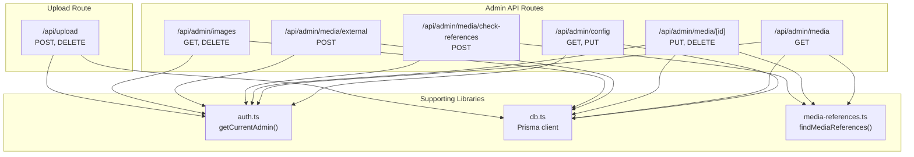
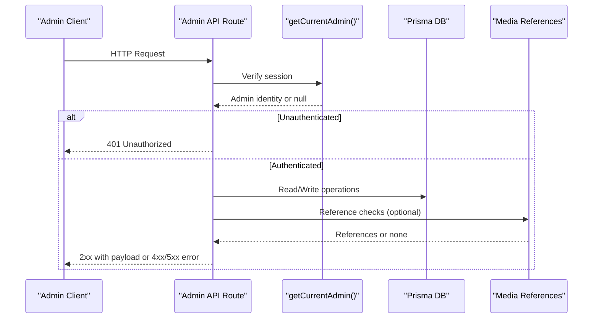
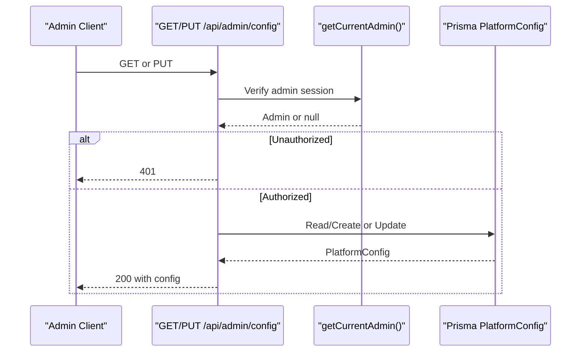
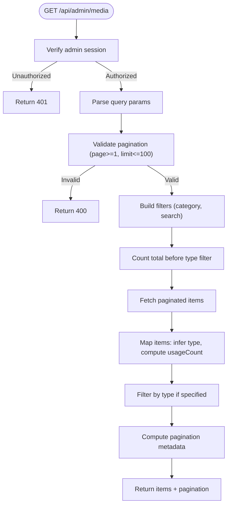
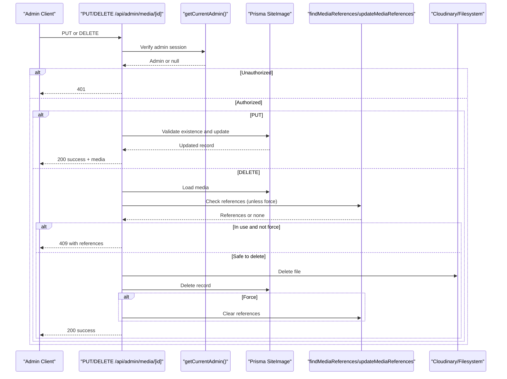
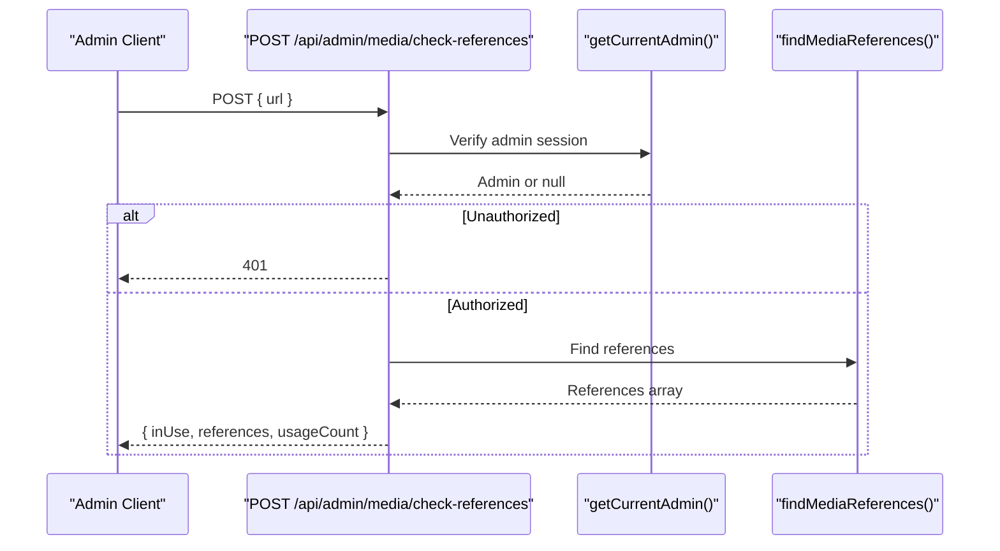
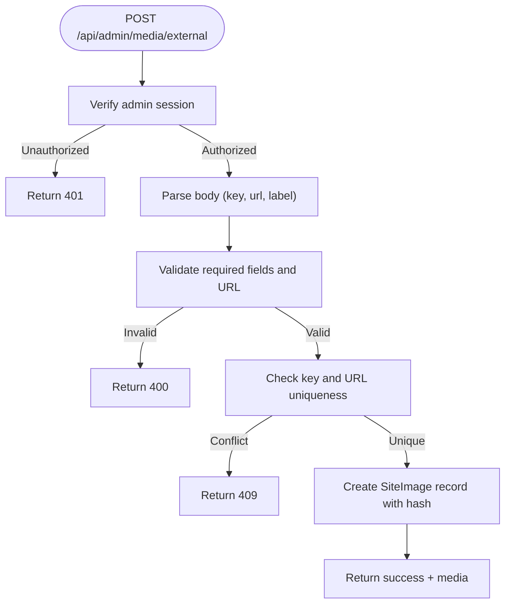
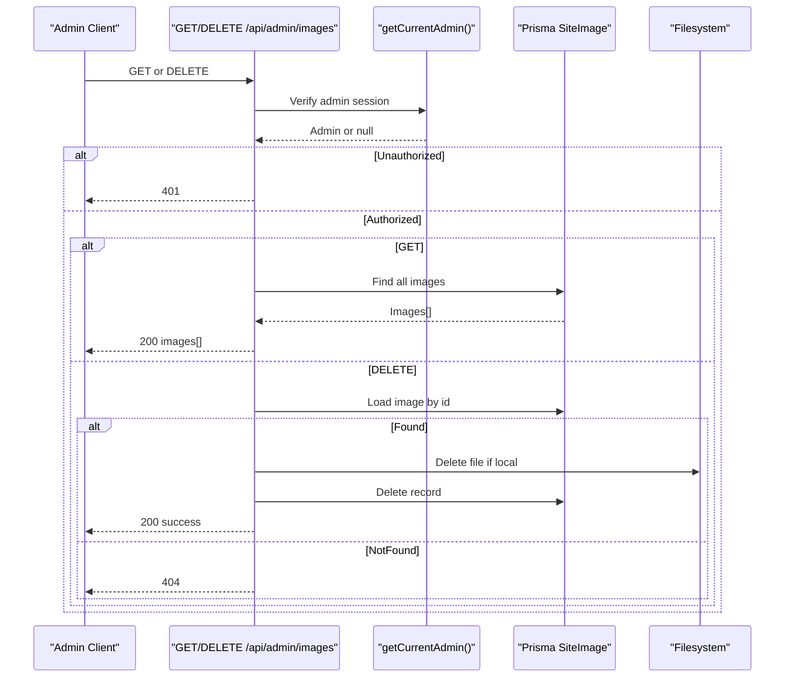
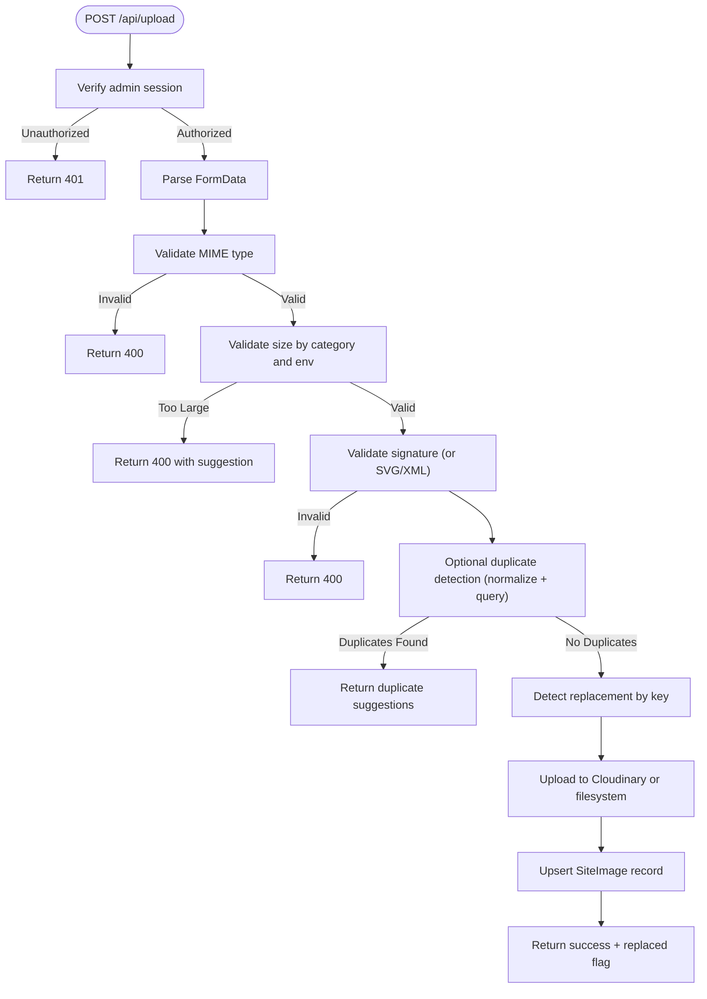
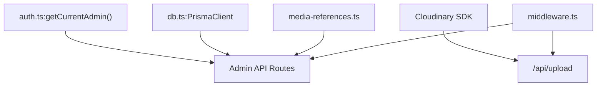

# Administrative API

<cite>
**Referenced Files in This Document**
- [route.ts](file://src/app/api/admin/config/route.ts)
- [route.ts](file://src/app/api/admin/media/route.ts)
- [route.ts](file://src/app/api/admin/media/[id]/route.ts)
- [route.ts](file://src/app/api/admin/media/check-references/route.ts)
- [route.ts](file://src/app/api/admin/media/external/route.ts)
- [route.ts](file://src/app/api/admin/images/route.ts)
- [route.ts](file://src/app/api/upload/route.ts)
- [media-references.ts](file://src/lib/media-references.ts)
- [auth.ts](file://src/lib/auth.ts)
- [db.ts](file://src/lib/db.ts)
- [schema.prisma](file://prisma/schema.prisma)
- [middleware.ts](file://src/middleware.ts)
- [test-media-endpoint.js](file://test-media-endpoint.js)
- [test-upload-duplicate-detection.js](file://test-upload-duplicate-detection.js)
</cite>

## Table of Contents
1. [Introduction](#introduction)
2. [Project Structure](#project-structure)
3. [Core Components](#core-components)
4. [Architecture Overview](#architecture-overview)
5. [Detailed Component Analysis](#detailed-component-analysis)
6. [Dependency Analysis](#dependency-analysis)
7. [Performance Considerations](#performance-considerations)
8. [Troubleshooting Guide](#troubleshooting-guide)
9. [Conclusion](#conclusion)
10. [Appendices](#appendices)

## Introduction
This document provides comprehensive API documentation for the administrative endpoints used by the CMS system. It covers configuration management, media library operations, image management, and reference checking. For each endpoint, it specifies HTTP methods, request/response schemas, authentication requirements, authorization levels, parameter validation, error handling, supported formats, file size limits, and security restrictions. It also documents media upload handling, duplicate detection mechanisms, reference tracking, external media integration, and bulk operations. Examples of administrative workflows and integration patterns are included to support content management tasks.

## Project Structure
The administrative APIs are implemented as Next.js App Router API routes under src/app/api/admin. Supporting utilities include authentication helpers, database access, and media reference scanning. The media upload endpoint is located under src/app/api/upload.

**Diagram sources**
- [route.ts:12-119](file://src/app/api/admin/config/route.ts#L12-L119)
- [route.ts:37-149](file://src/app/api/admin/media/route.ts#L37-L149)
- [route.ts:125-319](file://src/app/api/admin/media/[id]/route.ts#L125-L319)
- [route.ts:37-85](file://src/app/api/admin/media/check-references/route.ts#L37-L85)
- [route.ts:16-114](file://src/app/api/admin/media/external/route.ts#L16-L114)
- [route.ts:10-72](file://src/app/api/admin/images/route.ts#L10-L72)
- [route.ts:150-392](file://src/app/api/upload/route.ts#L150-L392)
- [auth.ts:156-169](file://src/lib/auth.ts#L156-L169)
- [db.ts:14-21](file://src/lib/db.ts#L14-L21)
- [media-references.ts:65-181](file://src/lib/media-references.ts#L65-L181)

**Section sources**
- [route.ts:12-119](file://src/app/api/admin/config/route.ts#L12-L119)
- [route.ts:37-149](file://src/app/api/admin/media/route.ts#L37-L149)
- [route.ts:125-319](file://src/app/api/admin/media/[id]/route.ts#L125-L319)
- [route.ts:37-85](file://src/app/api/admin/media/check-references/route.ts#L37-L85)
- [route.ts:16-114](file://src/app/api/admin/media/external/route.ts#L16-L114)
- [route.ts:10-72](file://src/app/api/admin/images/route.ts#L10-L72)
- [route.ts:150-392](file://src/app/api/upload/route.ts#L150-L392)
- [auth.ts:156-169](file://src/lib/auth.ts#L156-L169)
- [db.ts:14-21](file://src/lib/db.ts#L14-L21)
- [media-references.ts:65-181](file://src/lib/media-references.ts#L65-L181)

## Core Components
- Authentication and Authorization
  - All administrative endpoints require an authenticated admin session via getCurrentAdmin().
  - Unauthorized requests receive 401 responses.
- Media Library
  - Centralized storage for images, videos, and audio via SiteImage model.
  - Reference tracking across PlatformConfig, News, CarouselSlide, LegalPage, and AboutPage.
- Upload Pipeline
  - Supports image, video, and audio uploads with MIME validation and size limits.
  - Automatic duplicate detection based on normalized filenames.
  - Replacement detection via fixedKey parameter.
  - Storage abstraction: Cloudinary in production, local filesystem in development.
- Reference Checking
  - Validates usage of a media URL across content areas.
  - Provides edit links for each reference.

**Section sources**
- [auth.ts:156-169](file://src/lib/auth.ts#L156-L169)
- [media-references.ts:65-181](file://src/lib/media-references.ts#L65-L181)
- [route.ts:150-392](file://src/app/api/upload/route.ts#L150-L392)
- [schema.prisma:120-135](file://prisma/schema.prisma#L120-L135)

## Architecture Overview
The administrative API follows a layered architecture:
- HTTP Layer: Next.js App Router routes define endpoints and handle routing.
- Authentication Layer: getCurrentAdmin verifies sessions and enforces admin-only access.
- Business Logic Layer: Handlers implement CRUD operations, validation, and orchestration.
- Persistence Layer: Prisma ORM interacts with the underlying database.
- Utility Layer: Media reference scanning and Cloudinary integration.

**Diagram sources**
- [route.ts:37-149](file://src/app/api/admin/media/route.ts#L37-L149)
- [route.ts:125-319](file://src/app/api/admin/media/[id]/route.ts#L125-L319)
- [route.ts:37-85](file://src/app/api/admin/media/check-references/route.ts#L37-L85)
- [auth.ts:156-169](file://src/lib/auth.ts#L156-L169)
- [media-references.ts:65-181](file://src/lib/media-references.ts#L65-L181)
- [db.ts:14-21](file://src/lib/db.ts#L14-L21)

## Detailed Component Analysis

### Configuration Management: /api/admin/config
- Methods
  - GET: Retrieve platform configuration, creating defaults if none exists.
  - PUT: Update platform configuration with partial updates.
- Authentication
  - Requires admin session; unauthorized returns 401.
- Request Schema (PUT)
  - Fields include site branding, contact info, social links, WhatsApp settings, SEO, and theme colors.
  - Empty strings and undefined values are converted to null for persistence.
- Response Schema (GET/PUT)
  - Full PlatformConfig object with computed timestamps.
- Validation
  - No explicit runtime validation; relies on Prisma schema constraints.
- Error Handling
  - 401 for unauthorized, 500 for internal errors.
- Notes
  - On update, cache is revalidated to reflect changes.

**Diagram sources**
- [route.ts:12-119](file://src/app/api/admin/config/route.ts#L12-L119)
- [auth.ts:156-169](file://src/lib/auth.ts#L156-L169)
- [db.ts:14-21](file://src/lib/db.ts#L14-L21)

**Section sources**
- [route.ts:12-119](file://src/app/api/admin/config/route.ts#L12-L119)
- [schema.prisma:16-78](file://prisma/schema.prisma#L16-L78)

### Media Library: /api/admin/media
- Method
  - GET: List media with pagination, filtering, and usage counts.
- Authentication
  - Requires admin session; unauthorized returns 401.
- Query Parameters
  - page (number, default: 1): Page number (min 1).
  - limit (number, default: 50, max 100): Items per page.
  - category (string, optional): Filter by category.
  - search (string, optional): Search by label.
  - type (string, optional): Filter by type (image, video, audio).
- Response Schema
  - items: Array of media entries with id, key, label, description, url, category, type, usageCount, createdAt, updatedAt.
  - pagination: page, limit, total, totalPages, hasMore.
- Validation
  - Rejects invalid pagination parameters (page < 1 or limit < 1 or limit > 100).
- Processing Logic
  - Determines type from URL extension.
  - Calculates usageCount by scanning references; errors are logged but do not fail the request.
- Error Handling
  - 400 for invalid parameters, 500 for internal errors.

**Diagram sources**
- [route.ts:37-149](file://src/app/api/admin/media/route.ts#L37-L149)
- [media-references.ts:65-181](file://src/lib/media-references.ts#L65-L181)

**Section sources**
- [route.ts:37-149](file://src/app/api/admin/media/route.ts#L37-L149)
- [media-references.ts:65-181](file://src/lib/media-references.ts#L65-L181)

### Media Item Operations: /api/admin/media/[id]
- Methods
  - PUT: Update media metadata (label, description, category, alt).
  - DELETE: Delete media file with reference safety checks.
- Authentication
  - Requires admin session; unauthorized returns 401.
- PUT Request Body
  - At least one of label, description, category, alt must be provided.
- PUT Response
  - success flag and updated media object.
- DELETE Query Parameters
  - force (boolean, default: false): If true, deletes even if referenced; references are cleared afterward.
- DELETE Processing
  - If not force, checks references; if in use, returns references without deleting.
  - Deletes file from Cloudinary (production) or filesystem (development).
  - On force, clears references across content tables.
- Error Handling
  - 400 for invalid input, 404 for not found, 500 for internal errors.

**Diagram sources**
- [route.ts:125-319](file://src/app/api/admin/media/[id]/route.ts#L125-L319)
- [media-references.ts:65-181](file://src/lib/media-references.ts#L65-L181)
- [media-references.ts:190-333](file://src/lib/media-references.ts#L190-L333)

**Section sources**
- [route.ts:125-319](file://src/app/api/admin/media/[id]/route.ts#L125-L319)
- [media-references.ts:65-181](file://src/lib/media-references.ts#L65-L181)
- [media-references.ts:190-333](file://src/lib/media-references.ts#L190-L333)

### Reference Checking: /api/admin/media/check-references
- Method
  - POST: Check where a media URL is used.
- Authentication
  - Requires admin session; unauthorized returns 401.
- Request Body
  - url (string, required): Media URL to check.
- Response Schema
  - inUse (boolean): True if referenced.
  - references (array): Each reference includes table, id, field, displayName, editUrl.
  - usageCount (number): Total number of references.
- Validation
  - Rejects missing or empty URL; returns 400.
- Error Handling
  - 500 for internal errors.

**Diagram sources**
- [route.ts:37-85](file://src/app/api/admin/media/check-references/route.ts#L37-L85)
- [media-references.ts:65-181](file://src/lib/media-references.ts#L65-L181)

**Section sources**
- [route.ts:37-85](file://src/app/api/admin/media/check-references/route.ts#L37-L85)
- [media-references.ts:65-181](file://src/lib/media-references.ts#L65-L181)

### External Media Registration: /api/admin/media/external
- Method
  - POST: Register an external media URL in the library.
- Authentication
  - Requires admin session; unauthorized returns 401.
- Request Body
  - key (string, required): Unique identifier for the media.
  - url (string, required): External URL of the media file.
  - label (string, required): Display name for the media.
  - description (string, optional): Description.
  - category (string, optional): Category (defaults to general).
- Validation
  - Rejects missing required fields; returns 400.
  - Validates URL format; returns 400 on invalid URL.
  - Ensures key and URL uniqueness; returns 409 on conflict.
- Response
  - success flag and created media object with id, key, url, label, description, category, timestamps.
- Error Handling
  - 400/409 for validation conflicts, 500 for internal errors.

**Diagram sources**
- [route.ts:16-114](file://src/app/api/admin/media/external/route.ts#L16-L114)
- [schema.prisma:120-135](file://prisma/schema.prisma#L120-L135)

**Section sources**
- [route.ts:16-114](file://src/app/api/admin/media/external/route.ts#L16-L114)
- [schema.prisma:120-135](file://prisma/schema.prisma#L120-L135)

### Image Management: /api/admin/images
- Methods
  - GET: List all SiteImage records ordered by creation date.
  - DELETE: Remove a single image by id; deletes physical file and database record.
- Authentication
  - Requires admin session; unauthorized returns 401.
- DELETE Query Parameters
  - id (string, required): Identifier of the image to delete.
- Processing
  - Deletes file from local filesystem if URL starts with /uploads/.
  - Removes SiteImage record from database.
  - Revalidates cache to reflect removal.
- Error Handling
  - 400 for missing id, 404 for not found, 500 for internal errors.

**Diagram sources**
- [route.ts:10-72](file://src/app/api/admin/images/route.ts#L10-L72)
- [auth.ts:156-169](file://src/lib/auth.ts#L156-L169)
- [db.ts:14-21](file://src/lib/db.ts#L14-L21)

**Section sources**
- [route.ts:10-72](file://src/app/api/admin/images/route.ts#L10-L72)
- [db.ts:14-21](file://src/lib/db.ts#L14-L21)

### Media Upload Handling: /api/upload
- Method
  - POST: Upload images, videos, and audio with validation and duplicate detection.
  - DELETE: Delete uploaded files by key or URL.
- Authentication
  - Requires admin session; unauthorized returns 401.
- POST Supported Formats and Limits
  - Images: jpeg, png, webp, gif, svg+xml.
  - Videos: mp4, webm, mov, avi.
  - Audio: mp3, wav, ogg, m4a.
  - Size limits:
    - Development: 5MB images, 50MB videos, 20MB audio.
    - Production (Vercel): 5MB images, 25MB videos, 15MB audio.
- POST Request Body (FormData)
  - file (required): Binary file.
  - key (string, optional): Target key for replacement detection.
  - fixedKey (string, optional): Use for replacement scenarios.
  - label (string, optional): Display label.
  - category (string, optional): Target category.
  - skipDuplicateCheck (boolean, default: false): Bypass duplicate detection.
- POST Processing
  - Validates MIME type and file signature.
  - Optional duplicate detection using normalized filenames.
  - Stores in Cloudinary (production) or filesystem (development).
  - Updates or creates SiteImage record with URL and metadata.
  - Returns replaced flag when replacing existing key.
- POST Response
  - success flag, url, fileName, key, replaced (boolean).
  - On duplicates: success=false, duplicate={ exists: true, suggestions }, message.
- DELETE Query Parameters
  - key (string, optional): Delete by key.
  - url (string, optional): Delete by URL (file only, no DB record).
- DELETE Processing
  - Deletes from Cloudinary or filesystem depending on environment and URL.
- Error Handling
  - 400 for invalid input, 401 for unauthorized, 500 for internal errors.

**Diagram sources**
- [route.ts:150-392](file://src/app/api/upload/route.ts#L150-L392)
- [schema.prisma:120-135](file://prisma/schema.prisma#L120-L135)

**Section sources**
- [route.ts:150-392](file://src/app/api/upload/route.ts#L150-L392)
- [schema.prisma:120-135](file://prisma/schema.prisma#L120-L135)

## Dependency Analysis
- Authentication
  - All admin endpoints depend on getCurrentAdmin() for session verification.
- Persistence
  - Prisma client (db.ts) provides typed database access.
  - SiteImage model stores media metadata and URLs.
- Media References
  - findMediaReferences scans PlatformConfig, News, CarouselSlide, LegalPage, AboutPage for URL usage.
  - updateMediaReferences replaces URLs in content structures.
- External Dependencies
  - Cloudinary SDK for production storage.
  - Next.js middleware applies security headers globally.

**Diagram sources**
- [auth.ts:156-169](file://src/lib/auth.ts#L156-L169)
- [db.ts:14-21](file://src/lib/db.ts#L14-L21)
- [media-references.ts:65-181](file://src/lib/media-references.ts#L65-L181)
- [route.ts:150-392](file://src/app/api/upload/route.ts#L150-L392)
- [middleware.ts:4-44](file://src/middleware.ts#L4-L44)

**Section sources**
- [auth.ts:156-169](file://src/lib/auth.ts#L156-L169)
- [db.ts:14-21](file://src/lib/db.ts#L14-L21)
- [media-references.ts:65-181](file://src/lib/media-references.ts#L65-L181)
- [route.ts:150-392](file://src/app/api/upload/route.ts#L150-L392)
- [middleware.ts:4-44](file://src/middleware.ts#L4-L44)

## Performance Considerations
- Pagination
  - Media listing supports page and limit with a cap of 100 per page to prevent heavy queries.
- Reference Checks
  - Reference counting is computed per item; consider caching results for frequently accessed URLs.
- Storage
  - Production uses Cloudinary; ensure proper resource types and public ids to avoid extra deletion attempts.
- Validation
  - MIME and signature checks occur before upload; keep these efficient to minimize latency.

[No sources needed since this section provides general guidance]

## Troubleshooting Guide
- Authentication Failures
  - Symptom: 401 Unauthorized on admin endpoints.
  - Cause: Missing or expired admin session cookie.
  - Resolution: Log in as admin and retry.
- Invalid Parameters
  - Symptom: 400 Bad Request on media listing with invalid pagination.
  - Cause: page < 1 or limit < 1 or limit > 100.
  - Resolution: Adjust query parameters accordingly.
- Duplicate Uploads
  - Symptom: Response indicates duplicate with suggestions.
  - Cause: Similar normalized filename detected.
  - Resolution: Use fixedKey for replacement or rename the file.
- File Deletion Blocked
  - Symptom: 409 Conflict when deleting media.
  - Cause: Media is referenced in content.
  - Resolution: Use force=true to delete and clear references, or update content to remove references.
- Upload Size Limits
  - Symptom: 400 error indicating file too large.
  - Cause: Exceeds environment-specific limits.
  - Resolution: Reduce file size or use Cloudinary for larger assets.

**Section sources**
- [route.ts:54-60](file://src/app/api/admin/media/route.ts#L54-L60)
- [route.ts:176-200](file://src/app/api/upload/route.ts#L176-L200)
- [route.ts:251-280](file://src/app/api/admin/media/[id]/route.ts#L251-L280)
- [route.ts:190-200](file://src/app/api/upload/route.ts#L190-L200)

## Conclusion
The administrative API provides a robust foundation for managing configuration, media, and references within the CMS. It enforces strict authentication, validates inputs, and integrates with Cloudinary for scalable media storage. Reference tracking ensures content integrity, while upload handling includes duplicate detection and replacement logic. The documented endpoints and workflows enable efficient content management operations.

[No sources needed since this section summarizes without analyzing specific files]

## Appendices

### API Definitions

- Configuration Management
  - GET /api/admin/config
    - Auth: Admin session required
    - Response: PlatformConfig object
  - PUT /api/admin/config
    - Auth: Admin session required
    - Request: Partial PlatformConfig fields
    - Response: Updated PlatformConfig object

- Media Library
  - GET /api/admin/media
    - Auth: Admin session required
    - Query: page, limit, category, search, type
    - Response: { items[], pagination }

- Media Item
  - PUT /api/admin/media/[id]
    - Auth: Admin session required
    - Request: { label?, description?, category?, alt? }
    - Response: { success, media }
  - DELETE /api/admin/media/[id]?force=true
    - Auth: Admin session required
    - Query: force (boolean)
    - Response: { success, deleted, message[, references] }

- Reference Checking
  - POST /api/admin/media/check-references
    - Auth: Admin session required
    - Request: { url }
    - Response: { inUse, references, usageCount }

- External Media
  - POST /api/admin/media/external
    - Auth: Admin session required
    - Request: { key, url, label, description?, category? }
    - Response: { success, media }

- Image Management
  - GET /api/admin/images
    - Auth: Admin session required
    - Response: SiteImage[]
  - DELETE /api/admin/images?id=...
    - Auth: Admin session required
    - Query: id
    - Response: { success }

- Upload
  - POST /api/upload
    - Auth: Admin session required
    - FormData: file, key, fixedKey, label, category, skipDuplicateCheck
    - Response: { success, url, fileName, key, replaced } or duplicate suggestions
  - DELETE /api/upload?key=... or /api/upload?url=...
    - Auth: Admin session required
    - Query: key or url
    - Response: { success }

**Section sources**
- [route.ts:12-119](file://src/app/api/admin/config/route.ts#L12-L119)
- [route.ts:37-149](file://src/app/api/admin/media/route.ts#L37-L149)
- [route.ts:125-319](file://src/app/api/admin/media/[id]/route.ts#L125-L319)
- [route.ts:37-85](file://src/app/api/admin/media/check-references/route.ts#L37-L85)
- [route.ts:16-114](file://src/app/api/admin/media/external/route.ts#L16-L114)
- [route.ts:10-72](file://src/app/api/admin/images/route.ts#L10-L72)
- [route.ts:150-392](file://src/app/api/upload/route.ts#L150-L392)

### Administrative Workflows and Examples
- Bulk Media Import
  - Use external registration to add remote assets to the library.
  - Update content to reference the registered URLs.
- Duplicate Prevention
  - Before uploading, optionally check references to avoid accidental duplication.
  - Use skipDuplicateCheck only when intentionally overriding safeguards.
- Replacement Workflow
  - Provide fixedKey during upload to replace an existing asset.
  - Verify references are updated automatically; use force delete if necessary.
- Batch Operations
  - Combine external registration with reference updates to manage multiple assets efficiently.

[No sources needed since this section provides general guidance]