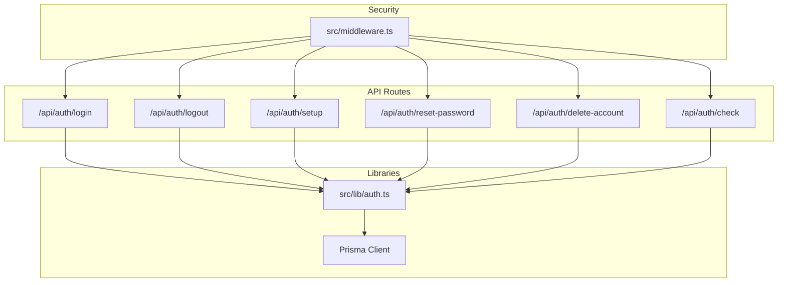
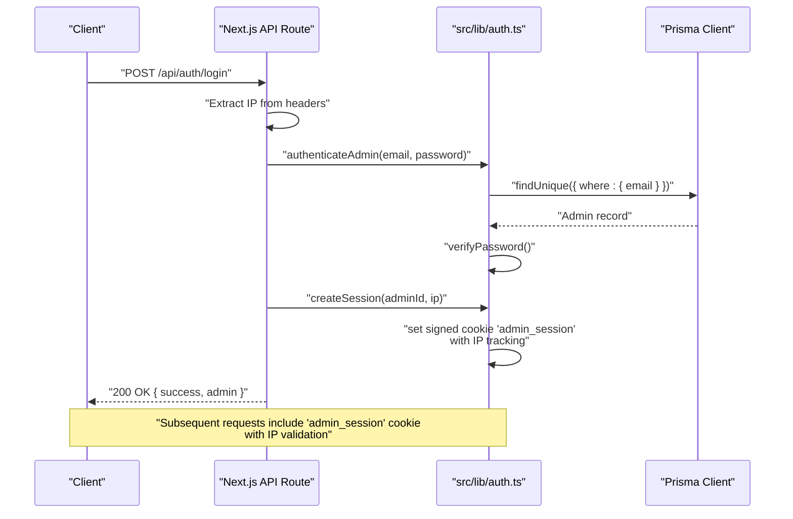
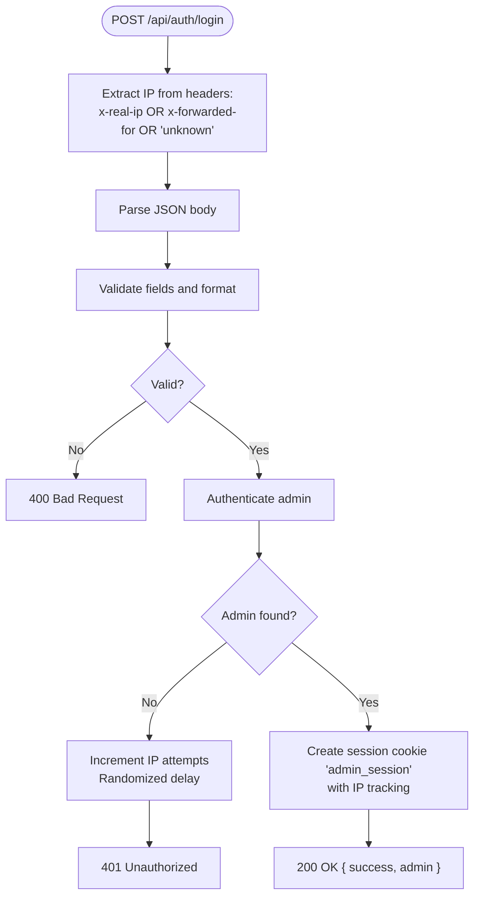
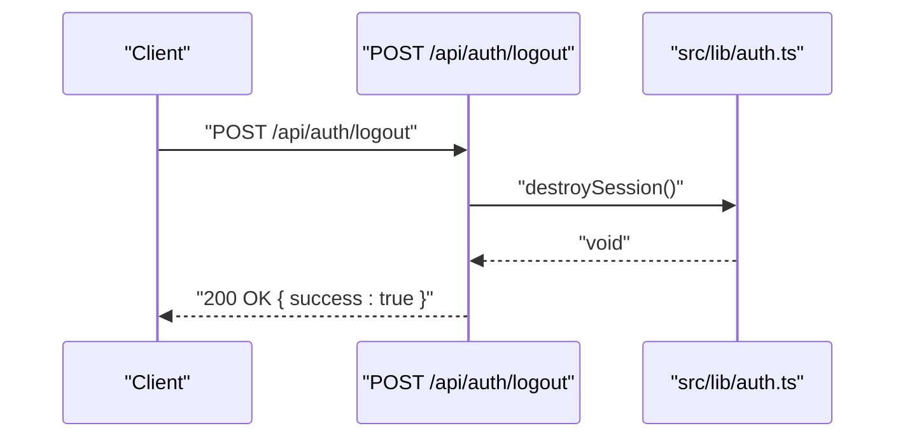
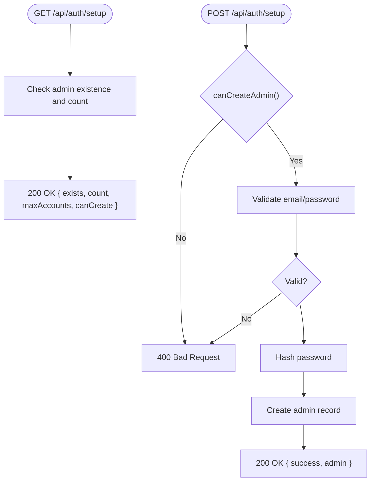
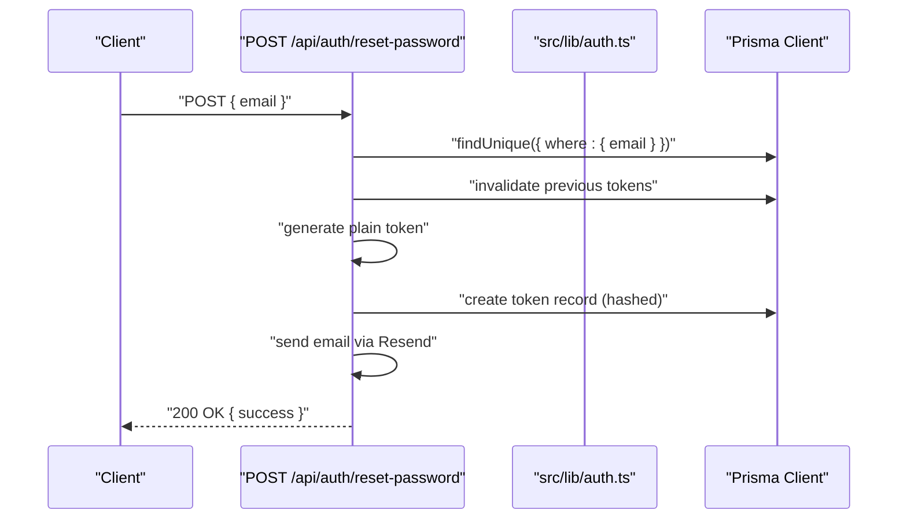
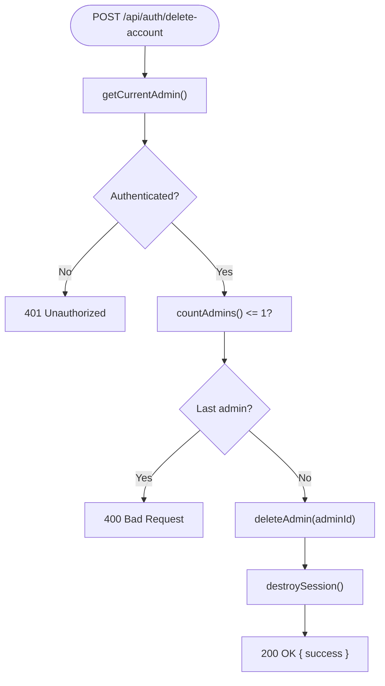
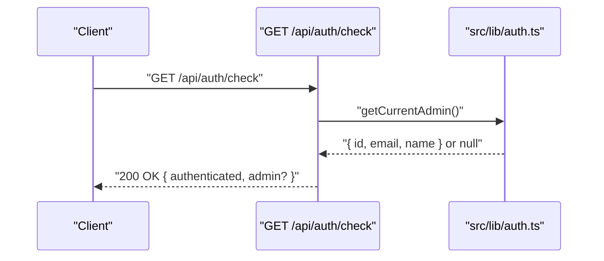
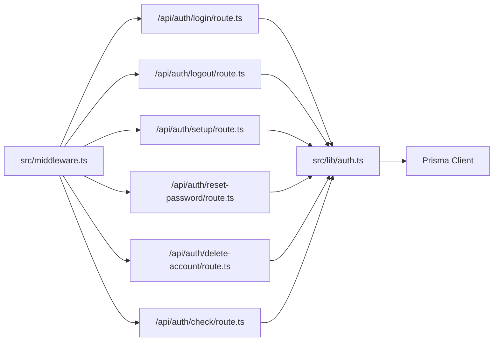

# Authentication API

<cite>
**Referenced Files in This Document**
- [login/route.ts](file://src/app/api/auth/login/route.ts)
- [logout/route.ts](file://src/app/api/auth/logout/route.ts)
- [setup/route.ts](file://src/app/api/auth/setup/route.ts)
- [reset-password/route.ts](file://src/app/api/auth/reset-password/route.ts)
- [delete-account/route.ts](file://src/app/api/auth/delete-account/route.ts)
- [check/route.ts](file://src/app/api/auth/check/route.ts)
- [auth.ts](file://src/lib/auth.ts)
- [schema.prisma](file://prisma/schema.prisma)
- [middleware.ts](file://src/middleware.ts)
- [package.json](file://package.json)
- [custom.db.sql](file://db/custom.db.sql)
- [recuperar-clave/page.tsx](file://src/app/portal-interno/recuperar-clave/page.tsx)
- [restablecer/page.tsx](file://src/app/portal-interno/restablecer/page.tsx)
</cite>

## Update Summary
**Changes Made**
- Updated login endpoint documentation to reflect enhanced IP address handling and security validation
- Added comprehensive IP address extraction logic and security monitoring capabilities
- Enhanced session creation with IP address tracking for improved security monitoring
- Updated security considerations to include IP-based session validation and hijacking detection
- Revised authentication flow diagrams to show IP address processing

## Table of Contents
1. [Introduction](#introduction)
2. [Project Structure](#project-structure)
3. [Core Components](#core-components)
4. [Architecture Overview](#architecture-overview)
5. [Detailed Component Analysis](#detailed-component-analysis)
6. [Dependency Analysis](#dependency-analysis)
7. [Performance Considerations](#performance-considerations)
8. [Troubleshooting Guide](#troubleshooting-guide)
9. [Conclusion](#conclusion)
10. [Appendices](#appendices)

## Introduction
This document provides comprehensive API documentation for the authentication endpoints used by administrators in the GreenAxis project. It covers all authentication-related HTTP endpoints, including login, logout, account setup, password reset, account deletion, and session check. For each endpoint, you will find HTTP methods, request/response schemas, authentication requirements, session token handling, and security considerations. It also documents validation rules, error response formats, status codes, authentication flow, session management, CSRF protection, and rate limiting policies. Practical client implementation examples and troubleshooting guidance are included to help developers integrate and maintain the authentication system effectively.

**Updated** Enhanced with improved IP address handling and security validation for comprehensive session monitoring and protection against session hijacking attacks.

## Project Structure
The authentication endpoints are implemented as Next.js App Router API routes under the path `/src/app/api/auth/<endpoint>/route.ts`. Supporting logic resides in the shared authentication library (`src/lib/auth.ts`). The database schema is defined in Prisma (`prisma/schema.prisma`) and includes the `Admin` and `PasswordResetToken` models. Security headers are applied globally via middleware (`src/middleware.ts`).

**Diagram sources**
- [login/route.ts:1-91](file://src/app/api/auth/login/route.ts#L1-L91)
- [logout/route.ts:1-13](file://src/app/api/auth/logout/route.ts#L1-L13)
- [setup/route.ts:1-63](file://src/app/api/auth/setup/route.ts#L1-L63)
- [reset-password/route.ts:1-262](file://src/app/api/auth/reset-password/route.ts#L1-L262)
- [delete-account/route.ts:1-43](file://src/app/api/auth/delete-account/route.ts#L1-L43)
- [check/route.ts:1-21](file://src/app/api/auth/check/route.ts#L1-L21)
- [auth.ts:1-175](file://src/lib/auth.ts#L1-L175)
- [middleware.ts:1-58](file://src/middleware.ts#L1-L58)

**Section sources**
- [login/route.ts:1-91](file://src/app/api/auth/login/route.ts#L1-L91)
- [logout/route.ts:1-13](file://src/app/api/auth/logout/route.ts#L1-L13)
- [setup/route.ts:1-63](file://src/app/api/auth/setup/route.ts#L1-L63)
- [reset-password/route.ts:1-262](file://src/app/api/auth/reset-password/route.ts#L1-L262)
- [delete-account/route.ts:1-43](file://src/app/api/auth/delete-account/route.ts#L1-L43)
- [check/route.ts:1-21](file://src/app/api/auth/check/route.ts#L1-L21)
- [auth.ts:1-175](file://src/lib/auth.ts#L1-L175)
- [middleware.ts:1-58](file://src/middleware.ts#L1-L58)

## Core Components
- Authentication Library (`src/lib/auth.ts`): Implements password hashing/verification, session creation/verification/destruction, admin CRUD operations, and helpers for admin counts and limits.
- Database Schema (`prisma/schema.prisma`): Defines the `Admin` and `PasswordResetToken` models used by authentication flows.
- Middleware (`src/middleware.ts`): Applies global security headers to all responses.

Key responsibilities:
- Session management via a signed cookie named `admin_session`.
- Rate limiting for login attempts with IP-based tracking.
- Password reset workflow with token generation, storage, and verification.
- Account setup with configurable maximum accounts.
- Enhanced security monitoring with IP address tracking and session validation.

**Updated** Enhanced with comprehensive IP address handling for security monitoring and protection against session hijacking attacks.

**Section sources**
- [auth.ts:1-175](file://src/lib/auth.ts#L1-L175)
- [schema.prisma:157-175](file://prisma/schema.prisma#L157-L175)
- [middleware.ts:1-58](file://src/middleware.ts#L1-L58)

## Architecture Overview
The authentication system follows a layered architecture with enhanced security monitoring:
- Presentation Layer: Next.js API routes handle HTTP requests and responses.
- Application Layer: Shared authentication library encapsulates business logic with IP address tracking.
- Data Access Layer: Prisma client interacts with the SQLite database.

**Updated** Enhanced with IP address extraction and session creation with IP tracking for comprehensive security monitoring.

**Diagram sources**
- [login/route.ts:9-90](file://src/app/api/auth/login/route.ts#L9-L90)
- [auth.ts:26-50](file://src/lib/auth.ts#L26-L50)
- [auth.ts:158-164](file://src/lib/auth.ts#L158-L164)

## Detailed Component Analysis

### Endpoint: POST /api/auth/login
- Purpose: Authenticate an administrator and establish a session with enhanced IP address handling and security validation.
- Request body:
  - email: string (required, validated as email format)
  - password: string (required)
- Response body:
  - success: boolean
  - admin: object with id, email, name
- Status codes:
  - 200 OK on successful login
  - 400 Bad Request for missing/invalid fields
  - 401 Unauthorized for invalid credentials
  - 429 Too Many Requests during lockout window
  - 500 Internal Server Error for unexpected errors
- Authentication requirements: None (this is the login endpoint)
- Session token handling: Sets a signed HTTP-only cookie named `admin_session` with expiry after 7 days, including IP address tracking.
- Security considerations:
  - Email format validation prevents malformed inputs.
  - Rate limiting tracks failed attempts per IP and locks out after 5 attempts for 15 minutes.
  - Enhanced IP address extraction from multiple sources: `x-real-ip`, `x-forwarded-for`, fallback to 'unknown'.
  - IP address stored in session cookie for session validation and hijacking detection.
  - Timing attack mitigation with randomized delay on failure.
  - Cookie attributes: httpOnly, secure (in production), sameSite strict, path '/'.
- Parameter validation rules:
  - email: required and must match email regex
  - password: required
- Error response format: `{ error: string, locked?: boolean, attempts?: number }`

**Updated** Enhanced with comprehensive IP address handling from multiple sources and IP tracking in session cookies for improved security monitoring.

**Updated** Enhanced with IP address extraction and session creation with IP tracking for comprehensive security monitoring.

**Diagram sources**
- [login/route.ts:9-90](file://src/app/api/auth/login/route.ts#L9-L90)
- [auth.ts:26-50](file://src/lib/auth.ts#L26-L50)

**Section sources**
- [login/route.ts:1-91](file://src/app/api/auth/login/route.ts#L1-L91)
- [auth.ts:26-50](file://src/lib/auth.ts#L26-L50)

### Endpoint: POST /api/auth/logout
- Purpose: Terminate the current administrator session.
- Request body: None
- Response body:
  - success: boolean
- Status codes:
  - 200 OK on successful logout
  - 500 Internal Server Error for unexpected errors
- Authentication requirements: Requires an active session (cookie present)
- Session token handling: Deletes the `admin_session` cookie.
- Security considerations:
  - Logout clears the session cookie server-side.
- Error response format: `{ error: string }`

**Diagram sources**
- [logout/route.ts:1-13](file://src/app/api/auth/logout/route.ts#L1-L13)
- [auth.ts:92-95](file://src/lib/auth.ts#L92-L95)

**Section sources**
- [logout/route.ts:1-13](file://src/app/api/auth/logout/route.ts#L1-L13)
- [auth.ts:92-95](file://src/lib/auth.ts#L92-L95)

### Endpoint: GET/POST /api/auth/setup
- Purpose: Check administrative setup state and create the initial administrator account.
- GET:
  - Response body:
    - exists: boolean (true if any admin exists)
    - count: number (current admin count)
    - maxAccounts: number (maximum allowed accounts)
    - canCreate: boolean (true if another admin can be created)
  - Status codes: 200 OK, 500 Internal Server Error
- POST:
  - Request body:
    - email: string (required)
    - password: string (required, minimum 8 characters)
    - name: string (optional)
  - Response body:
    - success: boolean
    - message: string
    - admin: object with id, email
  - Status codes:
    - 200 OK on success
    - 400 Bad Request for validation or limit exceeded
    - 500 Internal Server Error for unexpected errors
- Authentication requirements: None (initial setup)
- Session token handling: Not applicable
- Security considerations:
  - Password strength enforced (minimum 8 characters).
  - Maximum accounts controlled by environment variable `MAX_ADMIN_ACCOUNTS`.
- Error response format: `{ error: string }`

**Diagram sources**
- [setup/route.ts:4-21](file://src/app/api/auth/setup/route.ts#L4-L21)
- [setup/route.ts:23-62](file://src/app/api/auth/setup/route.ts#L23-L62)
- [auth.ts:117-121](file://src/lib/auth.ts#L117-L121)
- [auth.ts:143-155](file://src/lib/auth.ts#L143-L155)

**Section sources**
- [setup/route.ts:1-63](file://src/app/api/auth/setup/route.ts#L1-L63)
- [auth.ts:117-121](file://src/lib/auth.ts#L117-L121)
- [auth.ts:143-155](file://src/lib/auth.ts#L143-L155)

### Endpoint: POST/GET/PUT /api/auth/reset-password
- Purpose: Manage password reset workflow.
- POST (request reset):
  - Request body:
    - email: string (required, validated as email format)
  - Response body:
    - success: boolean
    - message: string
  - Status codes:
    - 200 OK (always returns success for privacy)
    - 400 Bad Request for invalid email
    - 500 Internal Server Error for unexpected errors
  - Security considerations:
    - Validates email format.
    - Checks for recent tokens to avoid spam.
    - Invalidates previous unused tokens.
    - Sends email via Resend API with HTML template.
- GET (verify token):
  - Query parameter:
    - token: string (required)
  - Response body:
    - valid: boolean
    - email: string (present when valid)
    - error: string (present when invalid)
  - Status codes:
    - 200 OK
    - 400 Bad Request for missing token
    - 500 Internal Server Error for unexpected errors
  - Security considerations:
    - Token is hashed before storage and comparison.
    - Expiration enforced (1 hour).
- PUT (reset password):
  - Request body:
    - token: string (required)
    - password: string (required, minimum 8 characters)
  - Response body:
    - success: boolean
    - message: string
  - Status codes:
    - 200 OK on success
    - 400 Bad Request for invalid token or weak password
    - 500 Internal Server Error for unexpected errors
  - Security considerations:
    - Validates token and expiration.
    - Hashes new password with bcrypt.
    - Marks token as used after reset.

**Diagram sources**
- [reset-password/route.ts:105-185](file://src/app/api/auth/reset-password/route.ts#L105-L185)
- [reset-password/route.ts:188-213](file://src/app/api/auth/reset-password/route.ts#L188-L213)
- [reset-password/route.ts:216-261](file://src/app/api/auth/reset-password/route.ts#L216-L261)

**Section sources**
- [reset-password/route.ts:1-262](file://src/app/api/auth/reset-password/route.ts#L1-L262)
- [schema.prisma:168-175](file://prisma/schema.prisma#L168-L175)

### Endpoint: POST /api/auth/delete-account
- Purpose: Delete the authenticated administrator account.
- Request body: None
- Response body:
  - success: boolean
  - message: string
- Status codes:
  - 200 OK on success
  - 400 Bad Request if attempting to delete the last admin
  - 401 Unauthorized if not authenticated
  - 500 Internal Server Error for unexpected errors
- Authentication requirements: Requires an active session
- Session token handling: Destroys the session after deletion.
- Security considerations:
  - Prevents deletion of the last administrator.
- Error response format: `{ error: string }`

**Diagram sources**
- [delete-account/route.ts:4-42](file://src/app/api/auth/delete-account/route.ts#L4-L42)
- [auth.ts:167-174](file://src/lib/auth.ts#L167-L174)
- [auth.ts:124-140](file://src/lib/auth.ts#L124-L140)
- [auth.ts:92-95](file://src/lib/auth.ts#L92-L95)

**Section sources**
- [delete-account/route.ts:1-43](file://src/app/api/auth/delete-account/route.ts#L1-L43)
- [auth.ts:124-140](file://src/lib/auth.ts#L124-L140)
- [auth.ts:167-174](file://src/lib/auth.ts#L167-L174)
- [auth.ts:92-95](file://src/lib/auth.ts#L92-L95)

### Endpoint: GET /api/auth/check
- Purpose: Check if the current user is authenticated.
- Request body: None
- Response body:
  - authenticated: boolean
  - admin: object with id, email, name (only present when authenticated)
- Status codes:
  - 200 OK
- Authentication requirements: None (returns current state)
- Session token handling: Reads the `admin_session` cookie.
- Security considerations:
  - Returns false if session is expired or invalid.
  - Enhanced security validation checks IP address and user agent consistency.
- Error response format: `{ authenticated: false }` (silent error handling)

**Updated** Enhanced with IP address and user agent validation for comprehensive session security monitoring.

**Diagram sources**
- [check/route.ts:4-20](file://src/app/api/auth/check/route.ts#L4-L20)
- [auth.ts:167-174](file://src/lib/auth.ts#L167-L174)

**Section sources**
- [check/route.ts:1-21](file://src/app/api/auth/check/route.ts#L1-L21)
- [auth.ts:167-174](file://src/lib/auth.ts#L167-L174)

## Dependency Analysis
- API routes depend on the authentication library for:
  - Authentication and session management with IP address tracking
  - Admin CRUD operations
  - Password hashing/verification
- The authentication library depends on:
  - Prisma client for database operations
  - Environment variables for configuration (e.g., `MAX_ADMIN_ACCOUNTS`)
- Global security headers are applied by middleware to all routes.

**Diagram sources**
- [login/route.ts:1-2](file://src/app/api/auth/login/route.ts#L1-L2)
- [logout/route.ts:1-2](file://src/app/api/auth/logout/route.ts#L1-L2)
- [setup/route.ts:1-2](file://src/app/api/auth/setup/route.ts#L1-L2)
- [reset-password/route.ts:1-2](file://src/app/api/auth/reset-password/route.ts#L1-L2)
- [delete-account/route.ts:1-2](file://src/app/api/auth/delete-account/route.ts#L1-L2)
- [check/route.ts:1-2](file://src/app/api/auth/check/route.ts#L1-L2)
- [auth.ts:1-4](file://src/lib/auth.ts#L1-L4)
- [middleware.ts:1-44](file://src/middleware.ts#L1-L44)

**Section sources**
- [auth.ts:1-175](file://src/lib/auth.ts#L1-L175)
- [schema.prisma:157-175](file://prisma/schema.prisma#L157-L175)
- [middleware.ts:1-58](file://src/middleware.ts#L1-L58)

## Performance Considerations
- Session cookie is HTTP-only and secure (in production), reducing exposure and overhead.
- Rate limiting for login uses an in-memory Map with IP-based tracking; consider persistence for multi-instance deployments.
- Password hashing uses bcrypt with a fixed salt round configuration.
- Email delivery for password reset relies on external Resend API; ensure proper retry/backoff in production.
- Enhanced IP address extraction adds minimal overhead but provides significant security benefits.
- Session validation includes IP and user agent checks for comprehensive security monitoring.

**Updated** Enhanced with performance considerations for IP address handling and security validation.

## Troubleshooting Guide
Common issues and resolutions:
- Login failures:
  - Symptom: 401 Unauthorized with remaining attempts.
  - Cause: Invalid credentials or rate limit lockout.
  - Resolution: Wait for lockout window or correct credentials.
- Rate limit reached:
  - Symptom: 429 Too Many Requests.
  - Cause: Multiple failed attempts from the same IP.
  - Resolution: Wait for lockout period to expire.
- IP address detection issues:
  - Symptom: IP appears as 'unknown' in logs.
  - Cause: Missing or incorrect proxy headers.
  - Resolution: Configure reverse proxy to set `x-real-ip` or `x-forwarded-for` headers.
- Session hijacking detected:
  - Symptom: Session automatically invalidated with IP mismatch warning.
  - Cause: Client IP changed or session stolen.
  - Resolution: User must re-authenticate; investigate potential security breach.
- Password reset email not received:
  - Symptom: 200 OK but no email.
  - Cause: Missing or invalid Resend configuration.
  - Resolution: Verify `RESEND_API_KEY` and `RESEND_FROM_EMAIL` environment variables.
- Token invalid/expired:
  - Symptom: 400 Bad Request or valid=false.
  - Cause: Token mismatch, used, or expired (>1 hour).
  - Resolution: Request a new reset link.
- Cannot delete last admin:
  - Symptom: 400 Bad Request.
  - Cause: Attempting to delete the only admin.
  - Resolution: Create another admin first.

**Updated** Enhanced with troubleshooting guidance for IP address handling and session security validation.

**Section sources**
- [login/route.ts:16-33](file://src/app/api/auth/login/route.ts#L16-L33)
- [login/route.ts:54-74](file://src/app/api/auth/login/route.ts#L54-L74)
- [auth.ts:73-83](file://src/lib/auth.ts#L73-L83)
- [reset-password/route.ts:105-185](file://src/app/api/auth/reset-password/route.ts#L105-L185)
- [reset-password/route.ts:188-213](file://src/app/api/auth/reset-password/route.ts#L188-L213)
- [reset-password/route.ts:216-261](file://src/app/api/auth/reset-password/route.ts#L216-L261)
- [delete-account/route.ts:14-20](file://src/app/api/auth/delete-account/route.ts#L14-L20)

## Conclusion
The authentication API provides a secure, stateless-like session model using signed cookies, robust password handling, and a complete password reset workflow. It enforces strong validation, rate limiting, and sensible defaults for account limits. The enhanced IP address handling and security validation provide comprehensive session monitoring and protection against session hijacking attacks. The provided client examples demonstrate practical integration patterns for password reset flows. For production deployments, consider persisting rate-limit state and ensuring environment variables are properly configured.

**Updated** Enhanced conclusion reflecting the improved security features and IP address handling capabilities.

## Appendices

### API Definitions

- POST /api/auth/login
  - Request: { email: string, password: string }
  - Response: { success: boolean, admin: { id: string, email: string, name: string? } }
  - Errors: 400, 401, 429, 500
  - Security: IP address extraction, rate limiting per IP, session validation

- POST /api/auth/logout
  - Request: None
  - Response: { success: boolean }
  - Errors: 500

- GET /api/auth/setup
  - Response: { exists: boolean, count: number, maxAccounts: number, canCreate: boolean }
  - Errors: 500

- POST /api/auth/setup
  - Request: { email: string, password: string, name?: string }
  - Response: { success: boolean, message: string, admin: { id: string, email: string } }
  - Errors: 400, 500

- POST /api/auth/reset-password
  - Request: { email: string }
  - Response: { success: boolean, message: string }
  - Errors: 400, 500

- GET /api/auth/reset-password
  - Query: token (string)
  - Response: { valid: boolean, email?: string, error?: string }
  - Errors: 400, 500

- PUT /api/auth/reset-password
  - Request: { token: string, password: string }
  - Response: { success: boolean, message: string }
  - Errors: 400, 500

- POST /api/auth/delete-account
  - Request: None
  - Response: { success: boolean, message: string }
  - Errors: 400, 401, 500

- GET /api/auth/check
  - Response: { authenticated: boolean, admin?: { id: string, email: string, name: string? } }
  - Errors: None (returns false on error)
  - Security: IP and user agent validation

**Updated** Enhanced API definitions with security considerations and IP address handling details.

### Session Management Details
- Cookie name: `admin_session`
- Attributes: httpOnly, secure (in production), sameSite strict, path '/', expiry 7 days
- Retrieval: Verified by `verifySession()`; expired sessions are destroyed automatically
- Destruction: `destroySession()` removes the cookie
- Enhanced security: IP address and user agent tracking for session validation
- IP validation: Compares stored IP with current request IP to detect hijacking attempts

**Updated** Enhanced session management details with IP address tracking and validation capabilities.

**Section sources**
- [auth.ts:26-50](file://src/lib/auth.ts#L26-L50)
- [auth.ts:53-89](file://src/lib/auth.ts#L53-L89)
- [auth.ts:92-95](file://src/lib/auth.ts#L92-L95)

### Security Headers Applied Globally
- X-Frame-Options: DENY
- X-Content-Type-Options: nosniff
- X-XSS-Protection: 1; mode=block
- Referrer-Policy: strict-origin-when-cross-origin
- Permissions-Policy: camera=(), microphone=(), geolocation=()
- Strict-Transport-Security: max-age=31536000; includeSubDomains; preload
- Content-Security-Policy: Permissive policy suitable for corporate sites

**Section sources**
- [middleware.ts:8-41](file://src/middleware.ts#L8-L41)

### Client Implementation Examples
- Password reset initiation:
  - Example path: [recuperar-clave/page.tsx:24-43](file://src/app/portal-interno/recuperar-clave/page.tsx#L24-L43)
- Password reset verification and submission:
  - Example path: [restablecer/page.tsx:34-90](file://src/app/portal-interno/restablecer/page.tsx#L34-L90)

**Section sources**
- [recuperar-clave/page.tsx:1-150](file://src/app/portal-interno/recuperar-clave/page.tsx#L1-L150)
- [restablecer/page.tsx:1-259](file://src/app/portal-interno/restablecer/page.tsx#L1-L259)

### Database Models Used by Authentication
- Admin: id, email, password, name, role, status, timestamps
- PasswordResetToken: id, email, token (hashed), expiresAt, used, timestamps

**Section sources**
- [schema.prisma:157-175](file://prisma/schema.prisma#L157-L175)
- [custom.db.sql:34-44](file://db/custom.db.sql#L34-L44)
- [custom.db.sql:105-113](file://db/custom.db.sql#L105-L113)

### Enhanced IP Address Handling
- IP Extraction Sources: `x-real-ip` (primary), `x-forwarded-for` (fallback), 'unknown' (default)
- Session Storage: IP address stored in session cookie for validation
- Security Monitoring: Real-time IP validation during session verification
- Protection: Automatic session destruction on IP mismatch to prevent hijacking

**New** Comprehensive IP address handling and security validation capabilities.

**Section sources**
- [login/route.ts:11-14](file://src/app/api/auth/login/route.ts#L11-L14)
- [auth.ts:35-41](file://src/lib/auth.ts#L35-L41)
- [auth.ts:73-77](file://src/lib/auth.ts#L73-L77)