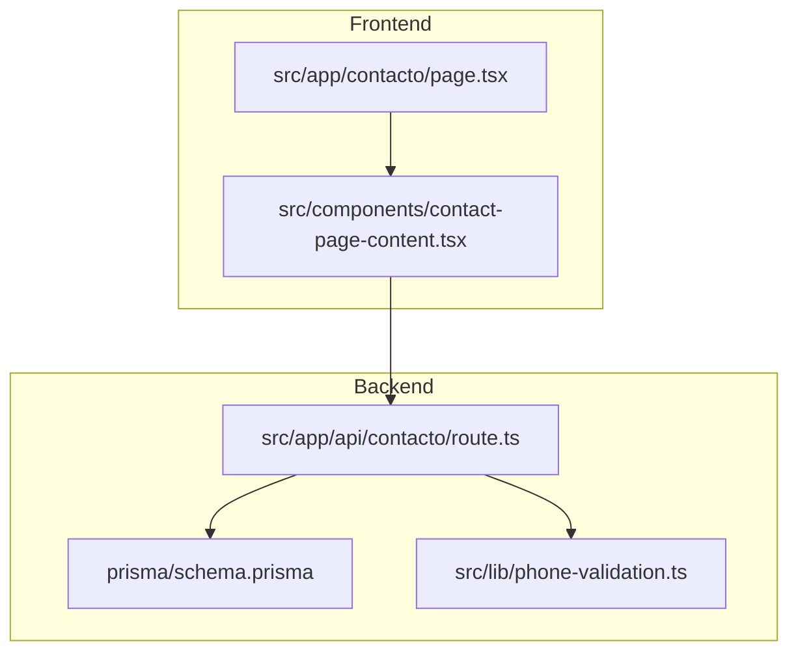
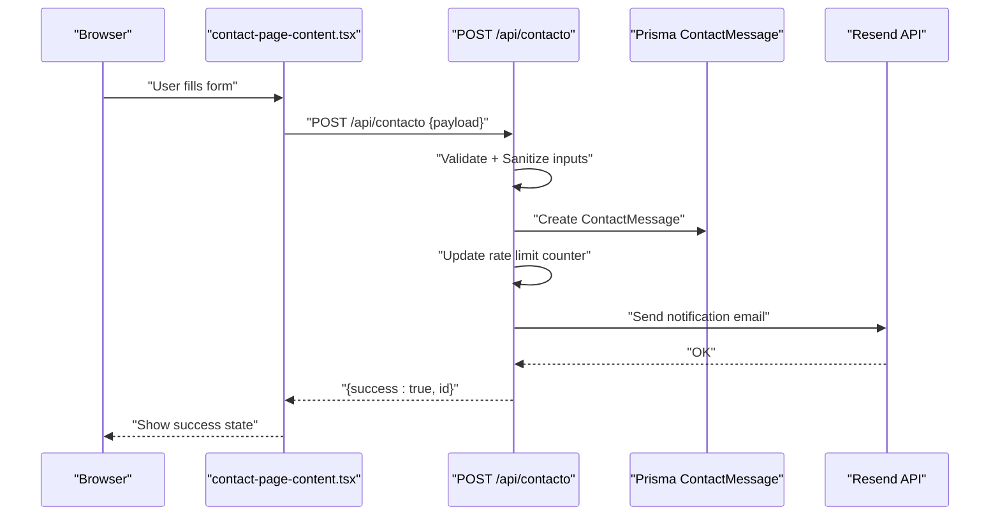
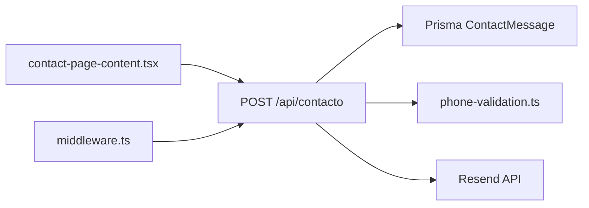

# Contact & Public API

<cite>
**Referenced Files in This Document**
- [route.ts](file://src/app/api/contacto/route.ts)
- [contact-page-content.tsx](file://src/components/contact-page-content.tsx)
- [page.tsx](file://src/app/contacto/page.tsx)
- [phone-validation.ts](file://src/lib/phone-validation.ts)
- [schema.prisma](file://prisma/schema.prisma)
- [middleware.ts](file://src/middleware.ts)
</cite>

## Table of Contents
1. [Introduction](#introduction)
2. [Project Structure](#project-structure)
3. [Core Components](#core-components)
4. [Architecture Overview](#architecture-overview)
5. [Detailed Component Analysis](#detailed-component-analysis)
6. [Dependency Analysis](#dependency-analysis)
7. [Performance Considerations](#performance-considerations)
8. [Troubleshooting Guide](#troubleshooting-guide)
9. [Conclusion](#conclusion)
10. [Appendices](#appendices)

## Introduction
This document describes the public contact form API endpoint and its integration with the frontend. It covers the HTTP endpoint, request/response schemas, validation rules, rate limiting, security controls, and client-side integration patterns. It also provides troubleshooting guidance for common integration issues.

## Project Structure
The contact form functionality spans a frontend page, a client-side form component, and a backend API route. Supporting utilities include phone validation helpers and the Prisma database schema.

**Diagram sources**
- [page.tsx:1-20](file://src/app/contacto/page.tsx#L1-L20)
- [contact-page-content.tsx:1-414](file://src/components/contact-page-content.tsx#L1-L414)
- [route.ts:1-302](file://src/app/api/contacto/route.ts#L1-L302)
- [phone-validation.ts:1-113](file://src/lib/phone-validation.ts#L1-L113)
- [schema.prisma:172-185](file://prisma/schema.prisma#L172-L185)

**Section sources**
- [page.tsx:1-20](file://src/app/contacto/page.tsx#L1-L20)
- [contact-page-content.tsx:1-414](file://src/components/contact-page-content.tsx#L1-L414)
- [route.ts:1-302](file://src/app/api/contacto/route.ts#L1-L302)
- [phone-validation.ts:1-113](file://src/lib/phone-validation.ts#L1-L113)
- [schema.prisma:172-185](file://prisma/schema.prisma#L172-L185)

## Core Components
- Public API endpoint: POST /api/contacto
- Optional administrative endpoints: GET, PUT, DELETE (admin-only)
- Frontend page and form: renders contact form and submits to the API
- Validation utilities: phone number validation and sanitization
- Persistence: ContactMessage model stored in the database

Key behaviors:
- Request validation and sanitization occur server-side
- Rate limiting is enforced per client IP
- On successful submission, a notification email is sent to the configured admin email
- Administrative endpoints allow listing, marking as read, and deleting messages

**Section sources**
- [route.ts:137-301](file://src/app/api/contacto/route.ts#L137-L301)
- [contact-page-content.tsx:73-147](file://src/components/contact-page-content.tsx#L73-L147)
- [phone-validation.ts:48-112](file://src/lib/phone-validation.ts#L48-L112)
- [schema.prisma:172-185](file://prisma/schema.prisma#L172-L185)

## Architecture Overview
The following sequence diagram shows the end-to-end flow for a successful contact form submission.

**Diagram sources**
- [contact-page-content.tsx:103-115](file://src/components/contact-page-content.tsx#L103-L115)
- [route.ts:137-229](file://src/app/api/contacto/route.ts#L137-L229)

## Detailed Component Analysis

### Public Endpoint: POST /api/contacto
- Purpose: Accept contact form submissions from the public
- Authentication: None required for submission
- Rate limiting: Per-IP sliding window (5 requests per hour)
- Request body fields:
  - name: string, required, minimum length 2
  - email: string, required, valid email format
  - phone: string, optional; if present, must pass phone validation
  - company: string, optional
  - subject: string, optional
  - message: string, required, minimum length 10
  - consent: boolean, required, must be true
- Response:
  - Success: { success: true, id: string }
  - Validation errors: { error: string }, status 400
  - Rate-limited: { error: string }, status 429
  - Internal errors: { error: string }, status 500

Validation and sanitization:
- Basic trimming and length limits applied to all string fields
- Email validated with a regex pattern
- Phone number validation supports multiple countries and requires a country prefix
- Consent flag is mandatory

Rate limiting:
- Tracks attempts per IP in memory
- Enforces a maximum of 5 messages per hour
- Returns a human-readable message indicating remaining minutes

Security:
- Uses secure headers via middleware
- Email notifications are sent via a dedicated provider API
- IP-based rate limiting helps mitigate abuse

Administrative endpoints (GET/PUT/DELETE):
- GET: Lists all messages (admin-only)
- PUT: Updates a message’s read status (admin-only)
- DELETE: Removes a message (admin-only)
- Requires admin authentication

**Section sources**
- [route.ts:137-301](file://src/app/api/contacto/route.ts#L137-L301)
- [phone-validation.ts:48-112](file://src/lib/phone-validation.ts#L48-L112)
- [middleware.ts:8-43](file://src/middleware.ts#L8-L43)

### Frontend Integration: Contact Page and Form
- The page renders a contact form component
- The form collects name, email, optional phone (with country code), optional company, optional subject, required message, and consent
- On submit, it posts to /api/contacto
- On success, clears the form and shows a success message
- On error, displays a toast with the returned error message

Client-side phone validation:
- Country dropdown selects a country code
- Local validation hints and checks are performed before submission

**Section sources**
- [page.tsx:1-20](file://src/app/contacto/page.tsx#L1-L20)
- [contact-page-content.tsx:26-147](file://src/components/contact-page-content.tsx#L26-L147)
- [phone-validation.ts:75-112](file://src/lib/phone-validation.ts#L75-L112)

### Data Model: ContactMessage
- Fields: id, name, email, phone, company, subject, message, consent, read, createdAt
- Consent defaults to false in the model but is enforced as true during submission
- Read defaults to false and can be toggled via admin PUT endpoint

**Section sources**
- [schema.prisma:172-185](file://prisma/schema.prisma#L172-L185)

### Phone Validation Utility
- Supports multiple countries and validates digit counts per country
- Provides hints for expected formats
- Two validation modes:
  - validatePhone: validates a given phone against a specified country code
  - validateFullPhone: detects country code from the phone string and validates

**Section sources**
- [phone-validation.ts:13-112](file://src/lib/phone-validation.ts#L13-L112)

## Dependency Analysis

**Diagram sources**
- [contact-page-content.tsx:103-115](file://src/components/contact-page-content.tsx#L103-L115)
- [route.ts:1-302](file://src/app/api/contacto/route.ts#L1-L302)
- [phone-validation.ts:1-113](file://src/lib/phone-validation.ts#L1-L113)
- [schema.prisma:172-185](file://prisma/schema.prisma#L172-L185)
- [middleware.ts:1-58](file://src/middleware.ts#L1-L58)

**Section sources**
- [route.ts:1-302](file://src/app/api/contacto/route.ts#L1-L302)
- [contact-page-content.tsx:1-414](file://src/components/contact-page-content.tsx#L1-L414)
- [phone-validation.ts:1-113](file://src/lib/phone-validation.ts#L1-L113)
- [schema.prisma:172-185](file://prisma/schema.prisma#L172-L185)
- [middleware.ts:1-58](file://src/middleware.ts#L1-L58)

## Performance Considerations
- Rate limiting is enforced in-memory and does not persist across process restarts. For production deployments with multiple instances, consider a distributed store (e.g., Redis) to maintain consistent limits.
- Email delivery depends on external provider availability and latency; consider adding retry/backoff and monitoring.
- Database writes are synchronous; ensure database performance is adequate for expected load.

[No sources needed since this section provides general guidance]

## Troubleshooting Guide
Common issues and resolutions:
- Validation errors:
  - Name too short or missing: ensure at least 2 characters
  - Invalid email format: ensure a proper email address
  - Message too short: ensure at least 10 characters
  - Consent not accepted: ensure the consent checkbox is selected
  - Phone number invalid: ensure the number includes a valid country code and matches the expected digit count for that region
- Rate limiting:
  - Too many requests: wait for the hourly lockout to expire (feedback indicates remaining minutes)
- Network or CORS issues:
  - Verify the frontend can reach /api/contacto from the same origin/same site policy
- Email notifications not received:
  - Confirm platform configuration includes a notification email and that the provider credentials are set
- Admin endpoints failing:
  - Ensure admin authentication is established before accessing GET/PUT/DELETE

**Section sources**
- [route.ts:166-188](file://src/app/api/contacto/route.ts#L166-L188)
- [route.ts:144-160](file://src/app/api/contacto/route.ts#L144-L160)
- [contact-page-content.tsx:76-97](file://src/components/contact-page-content.tsx#L76-L97)

## Conclusion
The contact form API provides a straightforward, validated, and rate-limited submission mechanism with optional administrative capabilities. The frontend integrates seamlessly by posting to /api/contacto, while the backend ensures data quality, security, and optional admin visibility.

[No sources needed since this section summarizes without analyzing specific files]

## Appendices

### API Definition: POST /api/contacto
- Method: POST
- Content-Type: application/json
- Request body schema:
  - name: string, required
  - email: string, required
  - phone: string, optional
  - company: string, optional
  - subject: string, optional
  - message: string, required
  - consent: boolean, required (must be true)
- Success response: { success: true, id: string }
- Error responses:
  - Validation failure: { error: string }, status 400
  - Rate-limited: { error: string }, status 429
  - Internal error: { error: string }, status 500

**Section sources**
- [route.ts:137-229](file://src/app/api/contacto/route.ts#L137-L229)

### Administrative Endpoints
- GET /api/contacto: List all messages (admin-only)
- PUT /api/contacto: Update read status (admin-only)
- DELETE /api/contacto?id=...: Delete a message (admin-only)

**Section sources**
- [route.ts:231-301](file://src/app/api/contacto/route.ts#L231-L301)

### Client Implementation Examples
- HTML/JavaScript fetch example:
  - Submit a POST request to /api/contacto with the required fields
  - Handle response.ok to detect success; otherwise parse JSON error message
- React example:
  - Use the provided form component to collect inputs and submit to /api/contacto
  - Clear the form and show success state upon success

**Section sources**
- [contact-page-content.tsx:73-147](file://src/components/contact-page-content.tsx#L73-L147)
- [route.ts:137-229](file://src/app/api/contacto/route.ts#L137-L229)

### Security Considerations
- Secure headers are applied globally via middleware
- Rate limiting reduces abuse potential
- Email notifications are sent via a dedicated provider API
- Consent requirement aligns with data protection expectations

**Section sources**
- [middleware.ts:8-43](file://src/middleware.ts#L8-L43)
- [route.ts:132-160](file://src/app/api/contacto/route.ts#L132-L160)