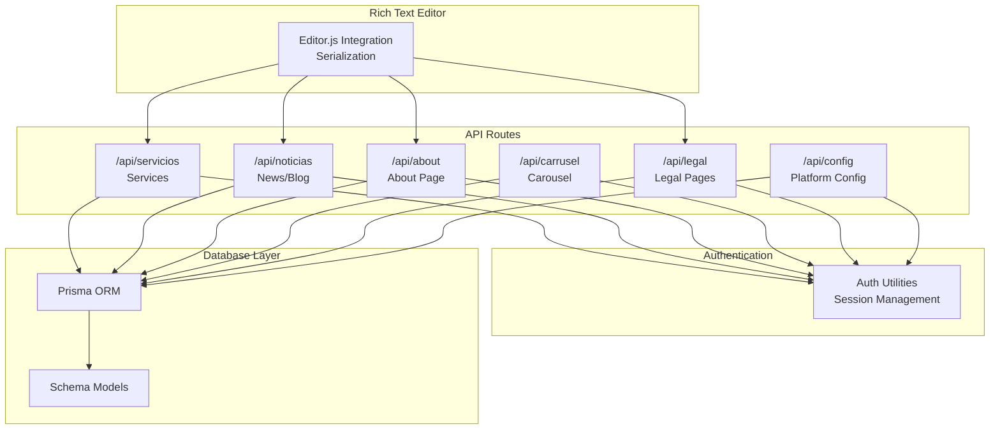
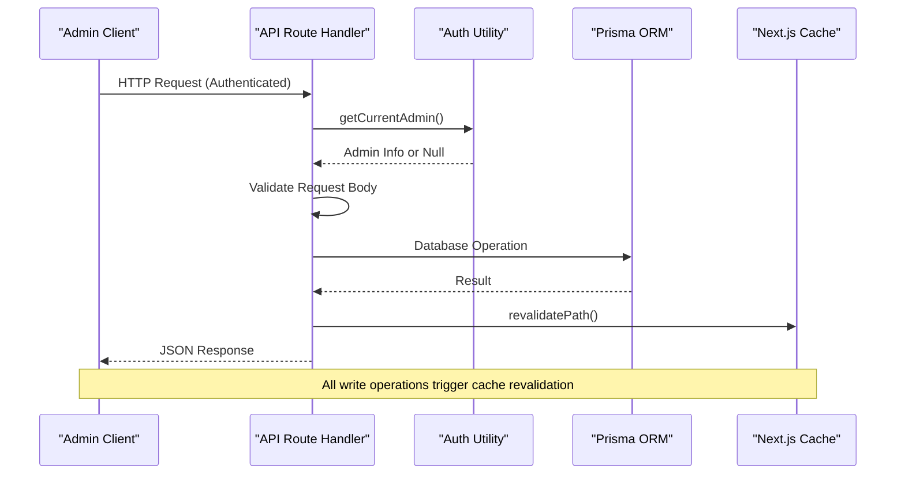
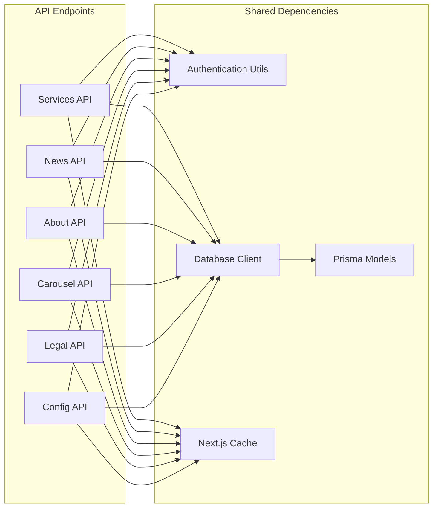
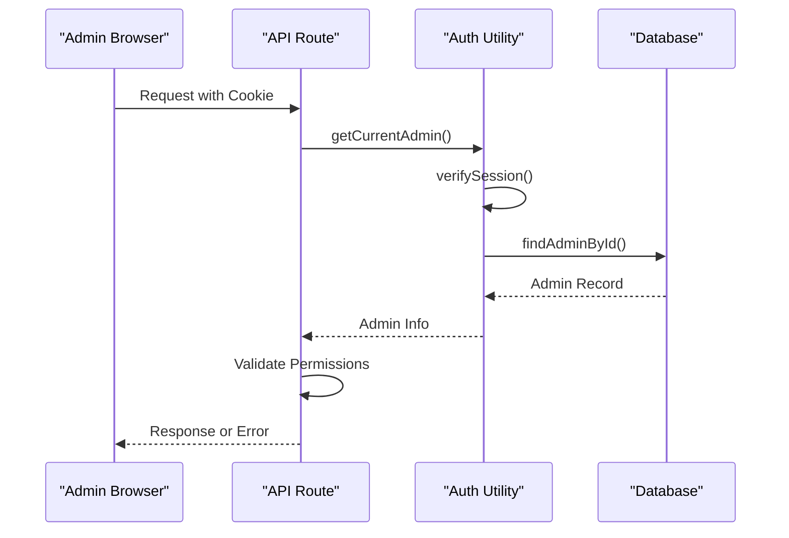

# Content Management API

<cite>
**Referenced Files in This Document**
- [servicios/route.ts](file://src/app/api/servicios/route.ts)
- [noticias/route.ts](file://src/app/api/noticias/route.ts)
- [about/route.ts](file://src/app/api/about/route.ts)
- [carrusel/route.ts](file://src/app/api/carrusel/route.ts)
- [legal/route.ts](file://src/app/api/legal/route.ts)
- [config/route.ts](file://src/app/api/config/route.ts)
- [auth.ts](file://src/lib/auth.ts)
- [db.ts](file://src/lib/db.ts)
- [schema.prisma](file://prisma/schema.prisma)
- [editor-js.tsx](file://src/components/editor-js.tsx)
- [layout.tsx](file://src/app/admin/layout.tsx)
</cite>

## Table of Contents
1. [Introduction](#introduction)
2. [Project Structure](#project-structure)
3. [Core Components](#core-components)
4. [Architecture Overview](#architecture-overview)
5. [Detailed Component Analysis](#detailed-component-analysis)
6. [Dependency Analysis](#dependency-analysis)
7. [Performance Considerations](#performance-considerations)
8. [Troubleshooting Guide](#troubleshooting-guide)
9. [Conclusion](#conclusion)

## Introduction
This document provides comprehensive API documentation for the content management endpoints of the Green Axis environmental services platform. It covers service management, news/blog operations, about page content, carousel management, legal pages, and platform configuration. The documentation includes HTTP methods, CRUD operations, request/response schemas, content validation rules, rich text handling with Editor.js serialization, slug generation, SEO metadata management, and content versioning. Authentication requirements, authorization levels, and content approval workflows are documented with practical examples and error handling guidance.

## Project Structure
The content management API is implemented using Next.js App Router API routes located under `src/app/api/`. Each endpoint corresponds to a specific content type and follows REST conventions. The backend uses Prisma ORM with a SQLite/Turso database, and authentication is handled via secure session cookies.



**Diagram sources**
- [servicios/route.ts:1-161](file://src/app/api/servicios/route.ts#L1-L161)
- [noticias/route.ts:1-229](file://src/app/api/noticias/route.ts#L1-L229)
- [about/route.ts:1-148](file://src/app/api/about/route.ts#L1-L148)
- [carrusel/route.ts:1-122](file://src/app/api/carrusel/route.ts#L1-L122)
- [legal/route.ts:1-89](file://src/app/api/legal/route.ts#L1-L89)
- [config/route.ts:1-60](file://src/app/api/config/route.ts#L1-L60)
- [auth.ts:1-170](file://src/lib/auth.ts#L1-L170)
- [db.ts:1-21](file://src/lib/db.ts#L1-L21)
- [schema.prisma:1-277](file://prisma/schema.prisma#L1-L277)

**Section sources**
- [servicios/route.ts:1-161](file://src/app/api/servicios/route.ts#L1-L161)
- [noticias/route.ts:1-229](file://src/app/api/noticias/route.ts#L1-L229)
- [about/route.ts:1-148](file://src/app/api/about/route.ts#L1-L148)
- [carrusel/route.ts:1-122](file://src/app/api/carrusel/route.ts#L1-L122)
- [legal/route.ts:1-89](file://src/app/api/legal/route.ts#L1-L89)
- [config/route.ts:1-60](file://src/app/api/config/route.ts#L1-L60)
- [auth.ts:1-170](file://src/lib/auth.ts#L1-L170)
- [db.ts:1-21](file://src/lib/db.ts#L1-L21)
- [schema.prisma:1-277](file://prisma/schema.prisma#L1-L277)

## Core Components
The content management API consists of six primary endpoints, each handling a specific content type:

### Authentication and Authorization
All write operations require administrative authentication. The system uses secure session cookies with 7-day expiration and validates sessions on each request. The authentication utilities provide password hashing, session creation/verification, and admin verification.

### Data Persistence
Prisma ORM manages all database operations with strong typing and automatic migrations. The schema defines models for services, news, about page, carousel slides, legal pages, and platform configuration.

### Rich Text Content
Editor.js integration enables structured content editing with block-based serialization. Content is stored as JSON blocks with support for images, videos, audio, lists, quotes, and formatted text.

**Section sources**
- [auth.ts:1-170](file://src/lib/auth.ts#L1-L170)
- [db.ts:1-21](file://src/lib/db.ts#L1-L21)
- [schema.prisma:1-277](file://prisma/schema.prisma#L1-L277)
- [editor-js.tsx:1-850](file://src/components/editor-js.tsx#L1-L850)

## Architecture Overview
The API follows a layered architecture with clear separation of concerns:



**Diagram sources**
- [servicios/route.ts:29-71](file://src/app/api/servicios/route.ts#L29-L71)
- [noticias/route.ts:54-111](file://src/app/api/noticias/route.ts#L54-L111)
- [about/route.ts:62-147](file://src/app/api/about/route.ts#L62-L147)
- [carrusel/route.ts:18-52](file://src/app/api/carrusel/route.ts#L18-L52)
- [legal/route.ts:47-88](file://src/app/api/legal/route.ts#L47-L88)
- [config/route.ts:30-60](file://src/app/api/config/route.ts#L30-L60)

## Detailed Component Analysis

### Service Management API (/api/servicios)
Handles CRUD operations for services offered by the company.

#### Authentication Requirements
- All operations require admin authentication
- Session validation performed via `getCurrentAdmin()`

#### HTTP Methods and Endpoints
- GET `/api/servicios` - Retrieve all services ordered by display priority
- POST `/api/servicios` - Create new service with automatic slug generation
- PUT `/api/servicios` - Update existing service with slug validation
- DELETE `/api/servicios?id={id}` - Delete service by ID

#### Request/Response Schemas
**Request Body (POST/PUT):**
- `title`: string (required)
- `description`: string (optional)
- `content`: string (optional)
- `blocks`: JSON string (optional) - Editor.js serialized content
- `icon`: string (optional)
- `imageUrl`: string (optional)
- `order`: number (default: 0)
- `active`: boolean (default: true)
- `featured`: boolean (default: false)
- `slug`: string (optional) - Auto-generated if omitted
- `regenerateSlug`: boolean (optional) - Force slug regeneration

**Response Body:**
Service object with all fields plus timestamps and unique ID

#### Slug Generation and Validation
Automatic slug generation converts title to URL-friendly format:
- Lowercase conversion
- Diacritic removal
- Special character replacement with hyphens
- Duplicate detection with timestamp suffix

#### Rich Text Content Handling
Supports Editor.js block serialization for complex content layouts with:
- Images with captions
- Videos and audio embedding
- Lists and quotes
- Formatted text blocks

#### Content Versioning and Caching
- Automatic Next.js cache revalidation on all write operations
- Revalidation targets affected routes (`/servicios`, `/`, and specific slug route)

#### Example Operations
**Create Service:**
```javascript
// POST /api/servicios
{
  "title": "Environmental Consulting",
  "description": "Expert consulting services",
  "blocks": "[{\"type\":\"paragraph\",\"data\":{\"text\":\"Consulting content\"}}]",
  "icon": "users",
  "imageUrl": "/images/service1.jpg",
  "order": 1,
  "active": true,
  "featured": false
}
```

**Update Service:**
```javascript
// PUT /api/servicios
{
  "id": "service-id",
  "title": "Updated Title",
  "regenerateSlug": true,
  "blocks": "[{\"type\":\"paragraph\",\"data\":{\"text\":\"Updated content\"}}]"
}
```

**Delete Service:**
```javascript
// DELETE /api/servicios?id=service-id
```

**Section sources**
- [servicios/route.ts:1-161](file://src/app/api/servicios/route.ts#L1-L161)
- [schema.prisma:80-96](file://prisma/schema.prisma#L80-L96)

### News/Blog API (/api/noticias)
Manages news articles and blog posts with rich content capabilities.

#### Authentication Requirements
- Admin authentication required for all operations

#### HTTP Methods and Endpoints
- GET `/api/noticias` - Retrieve paginated news list
- GET `/api/noticias?slug={slug}` - Retrieve specific news article
- POST `/api/noticias` - Create new news article
- PUT `/api/noticias` - Update existing news article
- DELETE `/api/noticias?id={id}` - Delete news article

#### Advanced Features
**Pagination:** Supports page and limit parameters for admin interface
**Publication Management:** Separate published flag with automatic timestamp setting
**Featured Content:** Dedicated field for highlighting articles
**Cover Image Options:** Control over cover image display in content

#### Publication Workflow
- Published flag controls visibility
- Automatic `publishedAt` timestamp when published
- Support for manual publication date specification
- Unpublishing clears the publication timestamp

#### Request/Response Schemas
**Request Body (POST/PUT):**
- `title`: string (required)
- `excerpt`: string (optional)
- `content`: string (required)
- `blocks`: JSON string (optional) - Editor.js serialized content
- `imageUrl`: string (optional)
- `author`: string (optional)
- `published`: boolean (default: false)
- `featured`: boolean (default: true)
- `publishedAt`: string (optional) - ISO date for manual scheduling
- `regenerateSlug`: boolean (optional) - Force slug regeneration

**Response Body:**
News object with all fields including publication status and timestamps

#### Example Operations
**Create Published Article:**
```javascript
// POST /api/noticias
{
  "title": "New Environmental Initiative",
  "excerpt": "Brief summary",
  "content": "Full article content",
  "blocks": "[{\"type\":\"paragraph\",\"data\":{\"text\":\"Article content\"}}]",
  "published": true,
  "featured": true,
  "publishedAt": "2024-01-15T10:00:00Z"
}
```

**Retrieve Specific Article:**
```javascript
// GET /api/noticias?slug=new-environmental-initiative
```

**Section sources**
- [noticias/route.ts:1-229](file://src/app/api/noticias/route.ts#L1-L229)
- [schema.prisma:98-118](file://prisma/schema.prisma#L98-L118)

### About Page API (/api/about)
Manages the complete "Who We Are" page content with extensive customization options.

#### Authentication Requirements
- Admin authentication required for updates

#### HTTP Methods and Endpoints
- GET `/api/about` - Retrieve current about page configuration
- PUT `/api/about` - Update about page content

#### Content Structure
The about page supports comprehensive content sections:

**Hero Section:**
- `heroTitle`: Main headline
- `heroSubtitle`: Subtitle text
- `heroImageUrl`: Background image

**Company Information:**
- `historyTitle` and `historyContent`: Company history with rich text
- `missionTitle` and `missionContent`: Mission statement
- `visionTitle` and `visionContent`: Vision statement

**Values and Team:**
- `valuesTitle` and `valuesContent`: JSON array of values with icons
- `teamTitle`, `teamEnabled`, and `teamMembers`: JSON array of team members

**Why Choose Us:**
- `whyChooseTitle` and `whyChooseContent`: JSON array of benefits

**Call-to-Action:**
- `ctaTitle`, `ctaSubtitle`, `ctaButtonText`, `ctaButtonUrl`

**Statistics and Certifications:**
- `statsEnabled` and `statsContent`: JSON array of statistics
- `certificationsEnabled` and `certificationsContent`: JSON array of certifications

#### Request/Response Schemas
**Request Body (PUT):**
Complete about page object with any combination of fields

**Response Body:**
Full about page configuration with defaults applied if missing

#### Default Content Management
On first access, the system automatically creates default content with:
- Company branding information
- Standard values and benefits sections
- Statistics placeholders
- Default call-to-action buttons

#### Example Operations
**Update About Content:**
```javascript
// PUT /api/about
{
  "heroTitle": "Our Environmental Commitment",
  "heroSubtitle": "Sustainable solutions for a better tomorrow",
  "missionContent": "We provide innovative environmental solutions...",
  "valuesContent": "[{\"title\":\"Sustainability\",\"description\":\"Environmentally responsible practices\",\"icon\":\"Leaf\"}]",
  "statsEnabled": true,
  "statsContent": "[{\"value\":\"500+\",\"label\":\"Happy Clients\",\"icon\":\"Users\"}]"
}
```

**Section sources**
- [about/route.ts:1-148](file://src/app/api/about/route.ts#L1-L148)
- [schema.prisma:224-276](file://prisma/schema.prisma#L224-L276)

### Carousel Management API (/api/carrusel)
Controls the main hero carousel with advanced customization options.

#### Authentication Requirements
- Admin authentication required for all operations

#### HTTP Methods and Endpoints
- GET `/api/carrusel` - Retrieve all carousel slides ordered by priority
- POST `/api/carrusel` - Create new carousel slide
- PUT `/api/carrusel` - Update existing slide
- DELETE `/api/carrusel?id={id}` - Delete slide

#### Slide Configuration Options
**Visual Elements:**
- `title`: Primary headline
- `subtitle`: Secondary text
- `description`: Detailed description
- `imageUrl`: Background image URL

**Interactive Elements:**
- `buttonText` and `buttonUrl`: Primary action button
- `linkUrl`: Full slide clickable area

**Visual Customization:**
- `gradientEnabled`: Toggle gradient overlay
- `animationEnabled`: Enable zoom animation
- `gradientColor`: Hex color code for gradient

**Display Settings:**
- `order`: Display priority
- `active`: Visibility toggle

#### Request/Response Schemas
**Request Body (POST/PUT):**
- `title`: string (optional)
- `subtitle`: string (optional)
- `description`: string (optional)
- `imageUrl`: string (required)
- `buttonText`: string (optional)
- `buttonUrl`: string (optional)
- `linkUrl`: string (optional)
- `gradientEnabled`: boolean (default: true)
- `animationEnabled`: boolean (default: true)
- `gradientColor`: string (optional)
- `order`: number (default: 0)
- `active`: boolean (default: true)

**Response Body:**
Complete carousel slide object with generated ID

#### Example Operations
**Create Carousel Slide:**
```javascript
// POST /api/carrusel
{
  "title": "Sustainable Solutions",
  "subtitle": "Innovative environmental services",
  "description": "Discover our cutting-edge solutions",
  "imageUrl": "/images/carousel1.jpg",
  "buttonText": "Learn More",
  "buttonUrl": "/services",
  "gradientEnabled": true,
  "animationEnabled": true,
  "order": 1,
  "active": true
}
```

**Section sources**
- [carrusel/route.ts:1-122](file://src/app/api/carrusel/route.ts#L1-L122)
- [schema.prisma:137-158](file://prisma/schema.prisma#L137-L158)

### Legal Pages API (/api/legal)
Manages legal documents like Terms of Service and Privacy Policy with rich text support.

#### Authentication Requirements
- Admin authentication required for updates

#### HTTP Methods and Endpoints
- GET `/api/legal` - Retrieve all legal pages
- GET `/api/legal?slug={slug}` - Retrieve specific legal page
- PUT `/api/legal` - Create or update legal page (upsert operation)

#### Legal Page Features
**Content Management:**
- `slug`: Unique identifier (e.g., "terminos", "privacidad")
- `title`: Page title
- `content`: Markdown content (fallback)
- `blocks`: Editor.js JSON serialization (preferred)
- `manualDate`: Manual last update date string

**Selective Field Retrieval:**
GET without slug returns minimal fields for listing, while GET with slug returns full content.

#### Upsert Operation
The PUT endpoint performs an upsert operation:
- Creates new page if slug doesn't exist
- Updates existing page if slug exists
- Maintains content integrity across updates

#### Request/Response Schemas
**Request Body (PUT):**
- `slug`: string (required)
- `title`: string (required)
- `content`: string (optional, defaults to empty)
- `blocks`: JSON string (optional)
- `manualDate`: string (optional)

**Response Body:**
Full legal page object with all fields

#### Example Operations
**Update Privacy Policy:**
```javascript
// PUT /api/legal
{
  "slug": "privacidad",
  "title": "Privacy Policy",
  "content": "Privacy policy content...",
  "blocks": "[{\"type\":\"paragraph\",\"data\":{\"text\":\"Privacy content\"}}]",
  "manualDate": "January 2024"
}
```

**Retrieve Terms Page:**
```javascript
// GET /api/legal?slug=terminos
```

**Section sources**
- [legal/route.ts:1-89](file://src/app/api/legal/route.ts#L1-L89)
- [schema.prisma:160-170](file://prisma/schema.prisma#L160-L170)

### Platform Configuration API (/api/config)
Manages global platform settings and brand configuration.

#### Authentication Requirements
- Admin authentication required for updates

#### HTTP Methods and Endpoints
- GET `/api/config` - Retrieve current platform configuration
- PUT `/api/config` - Update platform configuration

#### Configuration Categories
**Basic Information:**
- `siteName`: Website name
- `siteSlogan`: Tagline
- `siteDescription`: SEO description
- `siteUrl`: Public website URL

**Contact Information:**
- `companyName`, `companyAddress`, `companyPhone`, `companyEmail`
- `notificationEmail`: Contact form notifications recipient

**Social Media:**
- `facebookUrl`, `instagramUrl`, `twitterUrl`, `linkedinUrl`, `tiktokUrl`, `youtubeUrl`

**Brand Assets:**
- `logoUrl`, `faviconUrl`
- `primaryColor`: Theme color

**WhatsApp Integration:**
- `whatsappNumber`: Phone number
- `whatsappMessage`: Default message
- `whatsappShowBubble`: Toggle floating button

**SEO and Analytics:**
- `metaKeywords`: Comma-separated keywords
- `googleAnalytics`: Analytics ID
- `googleMapsEmbed`: Embed code for location map

#### Default Configuration
On first access, the system creates default configuration with:
- Company branding defaults
- WhatsApp integration preset
- Basic SEO settings

#### Request/Response Schemas
**Request Body (PUT):**
Any subset of configuration fields to update

**Response Body:**
Complete platform configuration object

#### Example Operations
**Update Brand Settings:**
```javascript
// PUT /api/config
{
  "siteName": "Green Axis Environmental Services",
  "siteDescription": "Leading environmental services in Colombia",
  "logoUrl": "/images/logo.png",
  "primaryColor": "#6BBE45",
  "whatsappMessage": "Hello! I'd like information about your services.",
  "whatsappShowBubble": true
}
```

**Retrieve Current Configuration:**
```javascript
// GET /api/config
```

**Section sources**
- [config/route.ts:1-60](file://src/app/api/config/route.ts#L1-L60)
- [schema.prisma:15-78](file://prisma/schema.prisma#L15-L78)

## Dependency Analysis
The API components share common dependencies and patterns:



**Diagram sources**
- [auth.ts:1-170](file://src/lib/auth.ts#L1-L170)
- [db.ts:1-21](file://src/lib/db.ts#L1-L21)
- [schema.prisma:1-277](file://prisma/schema.prisma#L1-L277)

### Authentication Flow


**Diagram sources**
- [auth.ts:155-170](file://src/lib/auth.ts#L155-L170)
- [layout.tsx:1-18](file://src/app/admin/layout.tsx#L1-L18)

**Section sources**
- [auth.ts:1-170](file://src/lib/auth.ts#L1-L170)
- [layout.tsx:1-18](file://src/app/admin/layout.tsx#L1-L18)

## Performance Considerations
The API implements several performance optimizations:

### Database Optimization
- **Connection Pooling**: Prisma manages efficient database connections
- **Query Optimization**: Direct model queries with selective field retrieval
- **Indexing**: Unique constraints on slugs for fast lookups
- **Batch Operations**: Combined queries for pagination scenarios

### Caching Strategy
- **Automatic Revalidation**: Cache invalidation on all write operations
- **Selective Revalidation**: Targeted cache clearing for specific routes
- **Edge Computing**: Turso database with edge replicas for low latency

### Content Delivery
- **Editor.js Serialization**: Efficient JSON storage for rich content
- **Image Optimization**: Cloudinary integration for automatic optimization
- **Lazy Loading**: Deferred loading of heavy components

## Troubleshooting Guide

### Authentication Issues
**Common Problems:**
- Session expiration (7-day limit)
- Missing or invalid cookies
- Multiple admin accounts exceeding limits

**Solutions:**
- Clear browser cookies and re-authenticate
- Verify admin account status
- Check MAX_ADMIN_ACCOUNTS environment variable

### Content Validation Errors
**Slug Conflicts:**
- Automatic duplicate detection with timestamp suffix
- Manual slug override available
- Unique constraint enforcement

**Rich Text Content Issues:**
- Editor.js JSON validation
- Block structure validation
- Media reference cleanup

### Database Connectivity
**Common Issues:**
- Turso database connection failures
- Migration errors
- Prisma client initialization problems

**Solutions:**
- Verify DATABASE_URL and TURSO credentials
- Run Prisma migrations
- Check network connectivity to Turso

### Error Response Patterns
All endpoints follow consistent error response patterns:
```javascript
{
  "error": "Descriptive error message",
  "code": "ERROR_CODE" // Optional
}
```

**Common Status Codes:**
- 400: Bad Request (validation errors)
- 401: Unauthorized (authentication required)
- 404: Not Found (resource not found)
- 500: Internal Server Error (server issues)

**Section sources**
- [servicios/route.ts:23-26](file://src/app/api/servicios/route.ts#L23-L26)
- [noticias/route.ts:48-51](file://src/app/api/noticias/route.ts#L48-L51)
- [about/route.ts:55-58](file://src/app/api/about/route.ts#L55-L58)
- [carrusel/route.ts:12-15](file://src/app/api/carrusel/route.ts#L12-L15)
- [legal/route.ts:41-44](file://src/app/api/legal/route.ts#L41-L44)
- [config/route.ts:24-27](file://src/app/api/config/route.ts#L24-L27)

## Conclusion
The Content Management API provides a comprehensive, secure, and scalable solution for managing all content types in the Green Axis platform. Built with modern technologies including Next.js, Prisma, and Editor.js, it offers rich text editing capabilities, robust authentication, and efficient content delivery. The API's design emphasizes developer productivity through consistent patterns, comprehensive error handling, and automatic cache management. Future enhancements could include granular permission systems, content approval workflows, and advanced media management features.