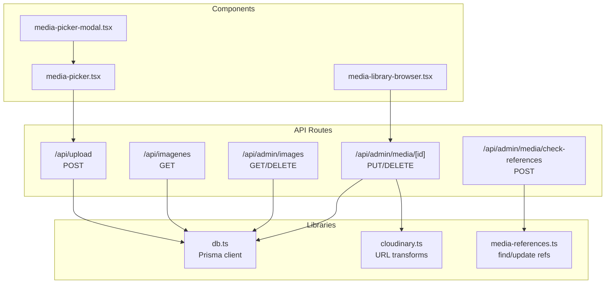
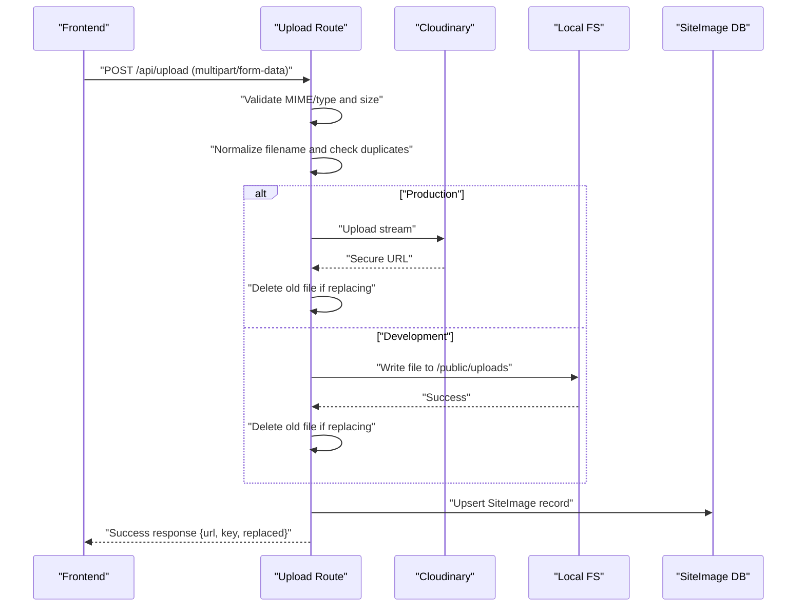
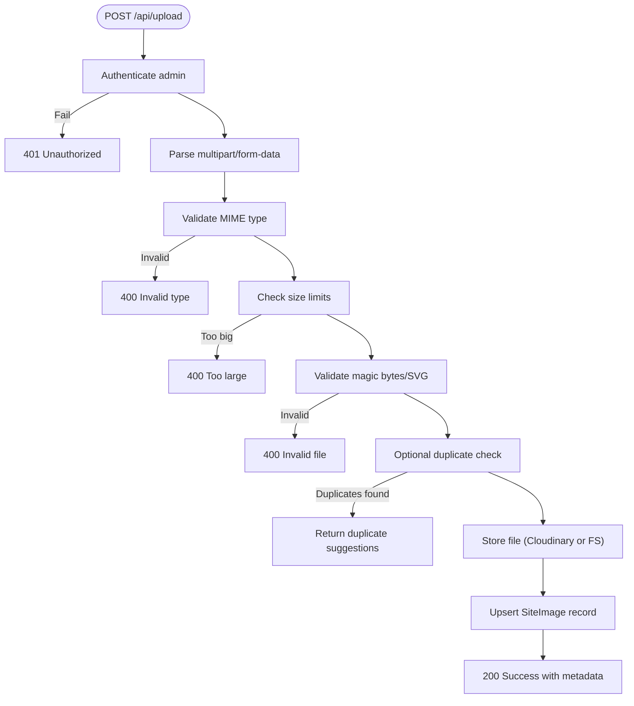
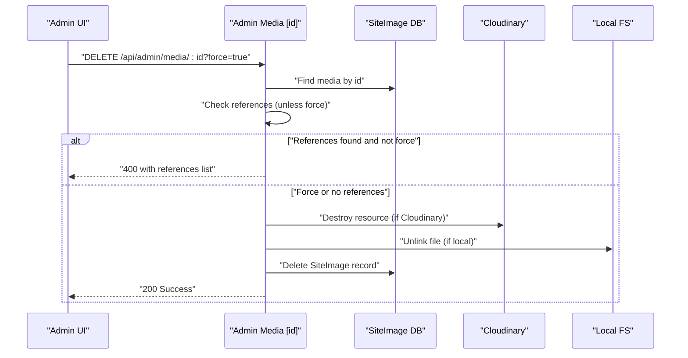
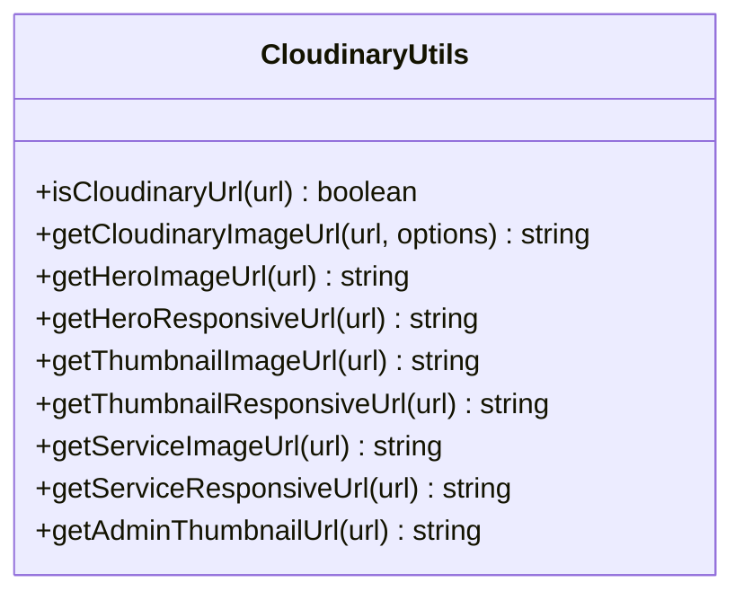
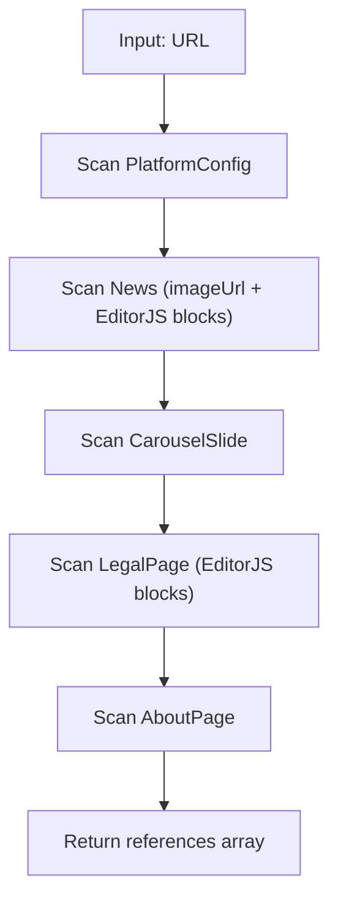
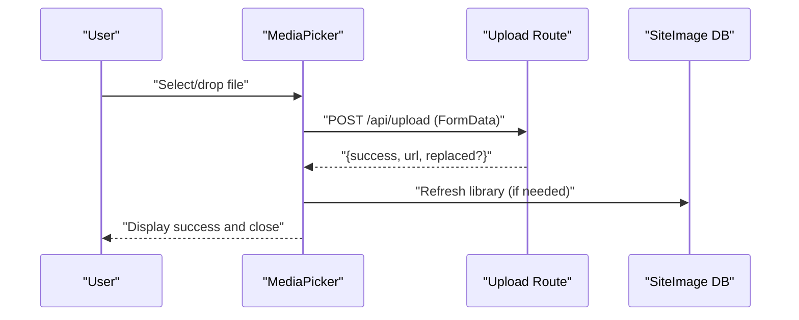
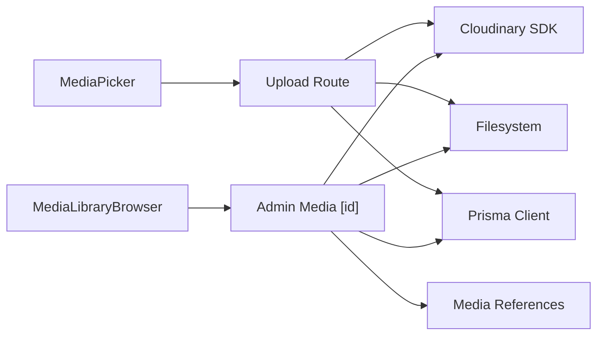

# Media Upload API

<cite>
**Referenced Files in This Document**
- [route.ts](file://src/app/api/upload/route.ts)
- [route.ts](file://src/app/api/imagenes/route.ts)
- [route.ts](file://src/app/api/admin/images/route.ts)
- [route.ts](file://src/app/api/admin/media/[id]/route.ts)
- [route.ts](file://src/app/api/admin/media/check-references/route.ts)
- [cloudinary.ts](file://src/lib/cloudinary.ts)
- [media-references.ts](file://src/lib/media-references.ts)
- [media-library-browser.tsx](file://src/components/media-library-browser.tsx)
- [media-picker.tsx](file://src/components/media-picker.tsx)
- [media-picker-modal.tsx](file://src/components/media-picker-modal.tsx)
- [db.ts](file://src/lib/db.ts)
</cite>

## Table of Contents
1. [Introduction](#introduction)
2. [Project Structure](#project-structure)
3. [Core Components](#core-components)
4. [Architecture Overview](#architecture-overview)
5. [Detailed Component Analysis](#detailed-component-analysis)
6. [Dependency Analysis](#dependency-analysis)
7. [Performance Considerations](#performance-considerations)
8. [Troubleshooting Guide](#troubleshooting-guide)
9. [Conclusion](#conclusion)
10. [Appendices](#appendices)

## Introduction
This document provides comprehensive API documentation for media upload and management endpoints. It covers:
- File upload operations via multipart/form-data
- Image gallery retrieval
- Cloudinary integration for production deployments
- File validation, size limits, and supported formats
- Duplicate detection and reference tracking
- Error handling and security considerations
- Frontend integration patterns for media-rich applications

## Project Structure
The media system spans API routes, database utilities, Cloudinary helpers, and React components for browsing and uploading media.

**Diagram sources**
- [route.ts:150-392](file://src/app/api/upload/route.ts#L150-L392)
- [route.ts:4-14](file://src/app/api/imagenes/route.ts#L4-L14)
- [route.ts:10-25](file://src/app/api/admin/images/route.ts#L10-L25)
- [route.ts:125-319](file://src/app/api/admin/media/[id]/route.ts#L125-L319)
- [route.ts:37-85](file://src/app/api/admin/media/check-references/route.ts#L37-L85)
- [cloudinary.ts:32-119](file://src/lib/cloudinary.ts#L32-L119)
- [media-references.ts:65-181](file://src/lib/media-references.ts#L65-L181)
- [media-library-browser.tsx:97-136](file://src/components/media-library-browser.tsx#L97-L136)
- [media-picker.tsx:201-316](file://src/components/media-picker.tsx#L201-L316)
- [media-picker-modal.tsx:40-67](file://src/components/media-picker-modal.tsx#L40-L67)

**Section sources**
- [route.ts:1-452](file://src/app/api/upload/route.ts#L1-L452)
- [route.ts:1-15](file://src/app/api/imagenes/route.ts#L1-L15)
- [route.ts:1-73](file://src/app/api/admin/images/route.ts#L1-L73)
- [route.ts:1-320](file://src/app/api/admin/media/[id]/route.ts#L1-L320)
- [route.ts:1-86](file://src/app/api/admin/media/check-references/route.ts#L1-L86)
- [cloudinary.ts:1-119](file://src/lib/cloudinary.ts#L1-L119)
- [media-references.ts:1-334](file://src/lib/media-references.ts#L1-L334)
- [media-library-browser.tsx:1-362](file://src/components/media-library-browser.tsx#L1-L362)
- [media-picker.tsx:1-754](file://src/components/media-picker.tsx#L1-L754)
- [media-picker-modal.tsx:1-70](file://src/components/media-picker-modal.tsx#L1-L70)
- [db.ts:1-21](file://src/lib/db.ts#L1-L21)

## Core Components
- Upload endpoint: Validates, stores, and records media; integrates Cloudinary in production; supports duplicate detection and replacement.
- Gallery retrieval: Lists all media ordered by creation date.
- Admin gallery: Lists media for administrators with caching revalidation.
- Media management: Updates metadata and deletes files with reference checks.
- Reference checker: Scans platform tables to find where a media URL is used.
- Cloudinary helpers: Optimizes Cloudinary URLs with automatic format, quality, and width transformations.
- Media picker: Frontend component for browsing and uploading media with progress and duplicate warnings.

**Section sources**
- [route.ts:150-392](file://src/app/api/upload/route.ts#L150-L392)
- [route.ts:4-14](file://src/app/api/imagenes/route.ts#L4-L14)
- [route.ts:10-25](file://src/app/api/admin/images/route.ts#L10-L25)
- [route.ts:125-319](file://src/app/api/admin/media/[id]/route.ts#L125-L319)
- [route.ts:37-85](file://src/app/api/admin/media/check-references/route.ts#L37-L85)
- [cloudinary.ts:32-119](file://src/lib/cloudinary.ts#L32-L119)
- [media-picker.tsx:201-316](file://src/components/media-picker.tsx#L201-L316)

## Architecture Overview
The upload pipeline validates files, optionally detects duplicates, stores them in Cloudinary or the local filesystem depending on environment, updates the database, and returns metadata. Deletion operations remove files from storage and the database, with safeguards against orphaned references.

**Diagram sources**
- [route.ts:150-392](file://src/app/api/upload/route.ts#L150-L392)
- [db.ts:1-21](file://src/lib/db.ts#L1-L21)

**Section sources**
- [route.ts:150-392](file://src/app/api/upload/route.ts#L150-L392)
- [db.ts:1-21](file://src/lib/db.ts#L1-L21)

## Detailed Component Analysis

### Upload Endpoint: /api/upload
- Method: POST
- Purpose: Accepts multipart/form-data with a file and optional metadata; validates, stores, and records the media.
- Authentication: Requires admin session.
- Supported fields:
  - file: Required File object
  - key: Optional string to identify the media
  - fixedKey: Optional override for replacement detection
  - label: Optional display label
  - category: Optional category
  - skipDuplicateCheck: Optional flag to bypass duplicate detection
- Validation rules:
  - Allowed MIME types: images (JPEG, PNG, WEBP, GIF, SVG), videos (MP4, WEBM, MOV, AVI), audio (MP3, WAV, OGG, M4A)
  - Magic-byte verification for non-SVG images
  - Size limits:
    - Images: 5 MB (dev), 5 MB (prod)
    - Videos: 50 MB (dev), 25 MB (prod)
    - Audio: 20 MB (dev), 15 MB (prod)
- Storage:
  - Production: Cloudinary upload stream; replaces old file if key matches
  - Development: Writes to /public/uploads; replaces old file if path matches
- Response:
  - On success: {success, url, fileName, key, replaced}
  - On duplicate detection: {success: false, duplicate: {exists, suggestions}, message}
  - On error: {error, details?}

**Diagram sources**
- [route.ts:150-392](file://src/app/api/upload/route.ts#L150-L392)

**Section sources**
- [route.ts:150-392](file://src/app/api/upload/route.ts#L150-L392)

### Image Gallery Retrieval: /api/imagenes
- Method: GET
- Purpose: Returns all media entries ordered by creation date.
- Response: Array of media objects.

**Section sources**
- [route.ts:4-14](file://src/app/api/imagenes/route.ts#L4-L14)

### Admin Gallery: /api/admin/images
- Method: GET
- Purpose: Returns all media entries ordered by creation date (admin-only).
- Method: DELETE
- Purpose: Deletes a media by ID and removes the physical file if present.
- Response: Success on completion.

**Section sources**
- [route.ts:10-25](file://src/app/api/admin/images/route.ts#L10-L25)
- [route.ts:28-73](file://src/app/api/admin/images/route.ts#L28-L73)

### Media Management: /api/admin/media/[id]
- Method: PUT
  - Updates label, description, category, alt for a media item.
  - Requires at least one field.
- Method: DELETE
  - Deletes a media item with reference checks.
  - Optional force flag to delete regardless of usage.
  - Safeguards:
    - Checks references across platform tables
    - Attempts to delete from Cloudinary or filesystem
    - Optionally clears references when forced

**Diagram sources**
- [route.ts:220-319](file://src/app/api/admin/media/[id]/route.ts#L220-L319)

**Section sources**
- [route.ts:125-319](file://src/app/api/admin/media/[id]/route.ts#L125-L319)

### Reference Checking: /api/admin/media/check-references
- Method: POST
- Purpose: Checks where a given media URL is used across platform tables.
- Request body: { url: string }
- Response: { inUse: boolean, references: [...], usageCount: number }

**Section sources**
- [route.ts:37-85](file://src/app/api/admin/media/check-references/route.ts#L37-L85)

### Cloudinary Integration and Optimization
- Configuration:
  - Uses CLOUDINARY_URL if present; otherwise reads individual env vars.
  - Secure uploads enabled.
- URL Transformations:
  - Automatic format, quality, and width
  - Helpers for hero, thumbnail, service, and admin thumbnail sizes
  - Responsive variants for Next.js Image

**Diagram sources**
- [cloudinary.ts:32-119](file://src/lib/cloudinary.ts#L32-L119)

**Section sources**
- [cloudinary.ts:1-119](file://src/lib/cloudinary.ts#L1-L119)

### Reference Tracking Utilities
- Extracts media URLs from EditorJS blocks
- Scans multiple tables for references
- Updates references when a URL is replaced/deleted

**Diagram sources**
- [media-references.ts:65-181](file://src/lib/media-references.ts#L65-L181)

**Section sources**
- [media-references.ts:1-334](file://src/lib/media-references.ts#L1-L334)

### Frontend Integration Patterns
- MediaLibraryBrowser: Infinite-scroll grid with search and category filters; paginated via query params.
- MediaPicker: Unified picker with tabs for library and upload; drag-and-drop support; progress tracking; duplicate suggestion dialog.
- MediaPickerModal: Dialog wrapper around MediaPicker.

**Diagram sources**
- [media-picker.tsx:201-316](file://src/components/media-picker.tsx#L201-L316)
- [route.ts:150-392](file://src/app/api/upload/route.ts#L150-L392)

**Section sources**
- [media-library-browser.tsx:97-136](file://src/components/media-library-browser.tsx#L97-L136)
- [media-picker.tsx:201-316](file://src/components/media-picker.tsx#L201-L316)
- [media-picker-modal.tsx:40-67](file://src/components/media-picker-modal.tsx#L40-L67)

## Dependency Analysis
- Upload endpoint depends on:
  - Authentication guard
  - Cloudinary SDK (production)
  - Local filesystem (development)
  - Prisma client for SiteImage
- Admin media endpoints depend on:
  - Authentication guard
  - Cloudinary SDK
  - Filesystem utilities
  - Reference utilities
- Frontend components depend on:
  - API routes for data and uploads
  - Cloudinary helpers for URL optimization

**Diagram sources**
- [route.ts:1-40](file://src/app/api/upload/route.ts#L1-L40)
- [route.ts:1-26](file://src/app/api/admin/media/[id]/route.ts#L1-L26)
- [media-references.ts:1-334](file://src/lib/media-references.ts#L1-L334)
- [media-picker.tsx:201-316](file://src/components/media-picker.tsx#L201-L316)
- [media-library-browser.tsx:120-136](file://src/components/media-library-browser.tsx#L120-L136)

**Section sources**
- [route.ts:1-40](file://src/app/api/upload/route.ts#L1-L40)
- [route.ts:1-26](file://src/app/api/admin/media/[id]/route.ts#L1-L26)
- [media-references.ts:1-334](file://src/lib/media-references.ts#L1-L334)
- [media-picker.tsx:201-316](file://src/components/media-picker.tsx#L201-L316)
- [media-library-browser.tsx:120-136](file://src/components/media-library-browser.tsx#L120-L136)

## Performance Considerations
- Production storage via Cloudinary reduces server load and improves CDN delivery.
- Magic-byte validation prevents malicious content while maintaining minimal overhead.
- Duplicate detection avoids redundant storage; consider indexing normalized filenames for scalability.
- Frontend uses infinite scroll with pagination to reduce memory usage.

## Troubleshooting Guide
Common issues and resolutions:
- Invalid file type or corrupted file:
  - Verify MIME type and magic bytes validation.
  - Ensure SVG content starts with expected markers.
- File too large:
  - Respect environment-specific size limits.
  - For large files, upload directly to Cloudinary and use the URL.
- Duplicate detection:
  - Review suggestions and reuse existing media to avoid redundancy.
- Upload failures:
  - Check Cloudinary credentials and network connectivity.
  - Inspect detailed error messages in development.
- Deletion failures:
  - Confirm file exists in storage; Cloudinary deletion attempts are resilient and logged.

**Section sources**
- [route.ts:170-211](file://src/app/api/upload/route.ts#L170-L211)
- [route.ts:357-391](file://src/app/api/upload/route.ts#L357-L391)
- [route.ts:72-113](file://src/app/api/admin/media/[id]/route.ts#L72-L113)

## Conclusion
The media upload and management system provides a robust, environment-aware solution for handling images, videos, and audio. It integrates seamlessly with Cloudinary in production, offers strong validation and duplicate detection, and includes comprehensive reference tracking to prevent orphaned assets. The frontend components enable efficient browsing and uploading workflows for media-rich applications.

## Appendices

### API Definitions

- POST /api/upload
  - Content-Type: multipart/form-data
  - Fields:
    - file: File (required)
    - key: String (optional)
    - fixedKey: String (optional)
    - label: String (optional)
    - category: String (optional)
    - skipDuplicateCheck: Boolean string "true" (optional)
  - Success: 200 {success, url, fileName, key, replaced}
  - Duplicate: 200 {success: false, duplicate: {exists, suggestions}, message}
  - Errors: 400 (invalid type/size/invalid), 401 (unauthorized), 500 (server error)

- GET /api/imagenes
  - Success: 200 [media list]

- GET /api/admin/images
  - Success: 200 [media list]

- DELETE /api/admin/images?id=...
  - Success: 200 {success}

- PUT /api/admin/media/[id]
  - Body: {label?, description?, category?, alt?}
  - Success: 200 {success, media}

- DELETE /api/admin/media/[id]?force=true
  - Success: 200 {success, deleted, message}
  - In use: 400 {success: false, message, references}

- POST /api/admin/media/check-references
  - Body: {url: string}
  - Success: 200 {inUse, references, usageCount}

**Section sources**
- [route.ts:150-392](file://src/app/api/upload/route.ts#L150-L392)
- [route.ts:4-14](file://src/app/api/imagenes/route.ts#L4-L14)
- [route.ts:10-73](file://src/app/api/admin/images/route.ts#L10-L73)
- [route.ts:125-319](file://src/app/api/admin/media/[id]/route.ts#L125-L319)
- [route.ts:37-85](file://src/app/api/admin/media/check-references/route.ts#L37-L85)

### Security Considerations
- Admin authentication is enforced for protected endpoints.
- MIME and magic-byte validation reduces risk of executable content.
- Cloudinary provides scalable, secure storage with built-in transformations.
- Reference checks prevent accidental deletion of in-use assets; use force mode cautiously.
- For virus scanning and content filtering, integrate upstream Cloudinary security features or add backend scanning layers.