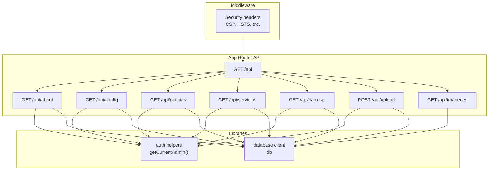
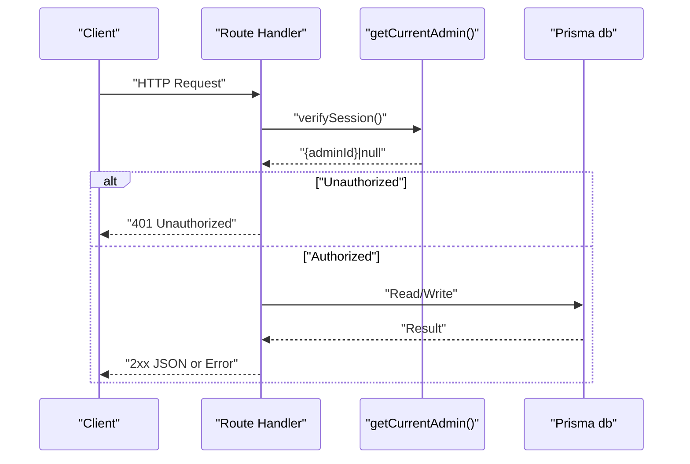
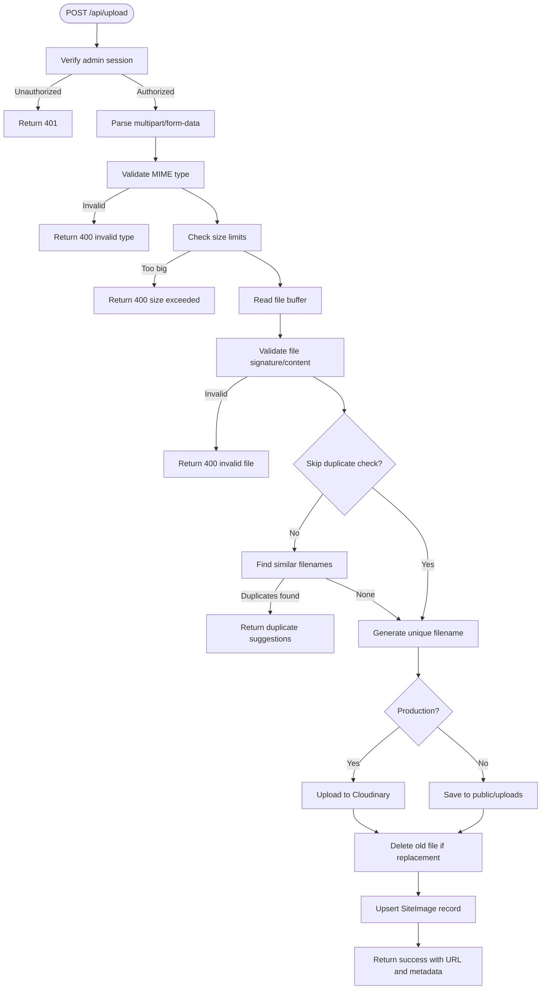
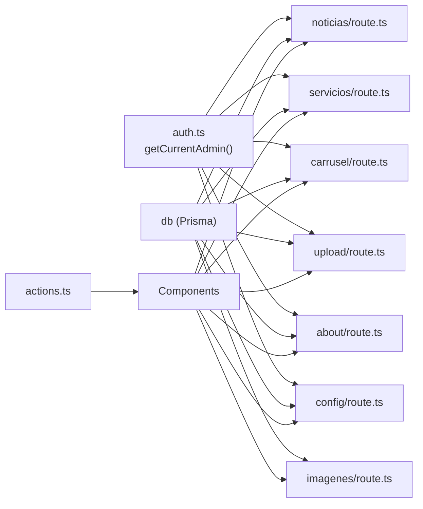

# API Routes Design

<cite>
**Referenced Files in This Document**
- [src/app/api/route.ts](file://src/app/api/route.ts)
- [src/app/api/about/route.ts](file://src/app/api/about/route.ts)
- [src/app/api/upload/route.ts](file://src/app/api/upload/route.ts)
- [src/app/api/carrusel/route.ts](file://src/app/api/carrusel/route.ts)
- [src/app/api/config/route.ts](file://src/app/api/config/route.ts)
- [src/app/api/noticias/route.ts](file://src/app/api/noticias/route.ts)
- [src/app/api/servicios/route.ts](file://src/app/api/servicios/route.ts)
- [src/app/api/imagenes/route.ts](file://src/app/api/imagenes/route.ts)
- [src/lib/actions.ts](file://src/lib/actions.ts)
- [src/lib/auth.ts](file://src/lib/auth.ts)
- [src/middleware.ts](file://src/middleware.ts)
</cite>

## Table of Contents
1. [Introduction](#introduction)
2. [Project Structure](#project-structure)
3. [Core Components](#core-components)
4. [Architecture Overview](#architecture-overview)
5. [Detailed Component Analysis](#detailed-component-analysis)
6. [Dependency Analysis](#dependency-analysis)
7. [Performance Considerations](#performance-considerations)
8. [Troubleshooting Guide](#troubleshooting-guide)
9. [Conclusion](#conclusion)

## Introduction
This document describes the API routes design for the GreenAxis Next.js application. It focuses on the App Router API pattern, request/response handling, server action integration, and endpoint organization by feature areas (admin, auth, content management). It also documents HTTP method usage, URL routing patterns, parameter handling, request validation, error handling strategies, response formatting standards, authentication requirements for protected endpoints, CORS configuration, examples of CRUD operations, file uploads, and media management, as well as performance optimization techniques and rate limiting considerations.

## Project Structure
The API follows the Next.js App Router convention with route handlers under src/app/api. Feature-specific endpoints are grouped by domain (e.g., about, config, noticias, servicios, carrusel, upload, imagenes). Authentication is enforced via a session cookie verified by a helper that checks the current admin session. Middleware applies security headers globally.

**Diagram sources**
- [src/app/api/route.ts:1-5](file://src/app/api/route.ts#L1-L5)
- [src/app/api/about/route.ts:1-148](file://src/app/api/about/route.ts#L1-L148)
- [src/app/api/config/route.ts:1-60](file://src/app/api/config/route.ts#L1-L60)
- [src/app/api/noticias/route.ts:1-229](file://src/app/api/noticias/route.ts#L1-L229)
- [src/app/api/servicios/route.ts:1-161](file://src/app/api/servicios/route.ts#L1-L161)
- [src/app/api/carrusel/route.ts:1-122](file://src/app/api/carrusel/route.ts#L1-L122)
- [src/app/api/upload/route.ts:1-452](file://src/app/api/upload/route.ts#L1-L452)
- [src/app/api/imagenes/route.ts:1-15](file://src/app/api/imagenes/route.ts#L1-L15)
- [src/lib/auth.ts:1-170](file://src/lib/auth.ts#L1-L170)
- [src/middleware.ts:1-58](file://src/middleware.ts#L1-L58)

**Section sources**
- [src/app/api/route.ts:1-5](file://src/app/api/route.ts#L1-L5)
- [src/middleware.ts:1-58](file://src/middleware.ts#L1-L58)

## Core Components
- Authentication and session management:
  - Session cookie name, duration, and secure flags are configured.
  - Current admin verification returns either null or an admin identifier.
  - Logout deletes the session cookie.
- Database access:
  - Shared Prisma client is used across API routes for database operations.
- Action utilities:
  - Server-side functions encapsulate platform configuration, content retrieval, and media queries for reuse in components and routes.

Key responsibilities:
- Enforce admin-only access for write operations.
- Validate and sanitize inputs.
- Return structured JSON responses with appropriate HTTP status codes.
- Revalidate Next.js cache after mutations to keep ISR/SWA content fresh.

**Section sources**
- [src/lib/auth.ts:1-170](file://src/lib/auth.ts#L1-L170)
- [src/lib/actions.ts:1-136](file://src/lib/actions.ts#L1-L136)

## Architecture Overview
The API architecture centers on:
- Route handlers per feature area.
- Centralized authentication via getCurrentAdmin().
- Database operations through Prisma.
- Global security headers via middleware.
- Optional Cloudinary integration for production file storage.

**Diagram sources**
- [src/app/api/noticias/route.ts:54-110](file://src/app/api/noticias/route.ts#L54-L110)
- [src/app/api/servicios/route.ts:29-70](file://src/app/api/servicios/route.ts#L29-L70)
- [src/app/api/upload/route.ts:150-190](file://src/app/api/upload/route.ts#L150-L190)
- [src/lib/auth.ts:49-71](file://src/lib/auth.ts#L49-L71)

## Detailed Component Analysis

### Root API Endpoint
- Path: GET /api
- Purpose: Basic health/status endpoint returning a simple JSON message.
- Response: 200 OK with message payload.

**Section sources**
- [src/app/api/route.ts:1-5](file://src/app/api/route.ts#L1-L5)

### About Page Management (Admin)
- Paths:
  - GET /api/about: Returns the “Quiénes Somos” page content, creating defaults if missing.
  - PUT /api/about: Updates the page content; requires admin session.
- Parameters:
  - Query: none.
  - Body: Full content object (hero, history, mission, vision, values, team, stats, certifications, location, CTA).
- Validation:
  - Admin session required; otherwise 401.
- Responses:
  - 200 OK on success; 500 on internal error.
- Side effects:
  - Revalidates cache for home and about pages.

**Section sources**
- [src/app/api/about/route.ts:6-59](file://src/app/api/about/route.ts#L6-L59)
- [src/app/api/about/route.ts:61-147](file://src/app/api/about/route.ts#L61-L147)

### Platform Configuration (Admin)
- Paths:
  - GET /api/config: Returns platform-wide settings, creating defaults if missing.
  - PUT /api/config: Updates platform settings; requires admin session.
- Parameters:
  - Query: none.
  - Body: siteName, siteSlogan, siteDescription, whatsappMessage, whatsappShowBubble.
- Validation:
  - Admin session required; otherwise 401.
- Responses:
  - 200 OK on success; 404 if config does not exist; 500 on error.
- Side effects:
  - Uses force-dynamic to bypass caching for config reads.

**Section sources**
- [src/app/api/config/route.ts:5-28](file://src/app/api/config/route.ts#L5-L28)
- [src/app/api/config/route.ts:30-59](file://src/app/api/config/route.ts#L30-L59)

### News Management (Admin)
- Paths:
  - GET /api/noticias?slug=... or ?page=&limit=: Paginated news for admin; optional slug fetch.
  - POST /api/noticias: Creates a news item; requires admin session.
  - PUT /api/noticias: Updates a news item; requires admin session.
  - DELETE /api/noticias?id=: Deletes a news item; requires admin session.
- Parameters:
  - Query: slug (optional), page (optional), limit (optional).
  - Body: title, slug (optional), excerpt, content, imageUrl, author, published, featured, publishedAt, blocks, regenerateSlug (optional).
- Validation:
  - Admin session required; otherwise 401.
  - Slug generation and uniqueness enforcement.
  - Published date handling with UTC normalization.
- Responses:
  - 200 OK on success; 400/404/500 on error.
- Side effects:
  - Revalidates cache for home, news list, and individual news pages.

**Section sources**
- [src/app/api/noticias/route.ts:16-51](file://src/app/api/noticias/route.ts#L16-L51)
- [src/app/api/noticias/route.ts:54-111](file://src/app/api/noticias/route.ts#L54-L111)
- [src/app/api/noticias/route.ts:113-198](file://src/app/api/noticias/route.ts#L113-L198)
- [src/app/api/noticias/route.ts:200-228](file://src/app/api/noticias/route.ts#L200-L228)

### Services Management (Admin)
- Paths:
  - GET /api/servicios: Returns ordered active services.
  - POST /api/servicios: Creates a service; requires admin session.
  - PUT /api/servicios: Updates a service; requires admin session.
  - DELETE /api/servicios?id=: Deletes a service; requires admin session.
- Parameters:
  - Query: none.
  - Body: title, slug (optional), description, content, blocks, icon, imageUrl, order, active, featured, regenerateSlug (optional).
- Validation:
  - Admin session required; otherwise 401.
  - Slug generation and uniqueness enforcement.
- Responses:
  - 200 OK on success; 400/404/500 on error.
- Side effects:
  - Revalidates cache for home, services list, and individual service pages.

**Section sources**
- [src/app/api/servicios/route.ts:16-27](file://src/app/api/servicios/route.ts#L16-L27)
- [src/app/api/servicios/route.ts:29-71](file://src/app/api/servicios/route.ts#L29-L71)
- [src/app/api/servicios/route.ts:73-130](file://src/app/api/servicios/route.ts#L73-L130)
- [src/app/api/servicios/route.ts:132-160](file://src/app/api/servicios/route.ts#L132-L160)

### Carousel Management (Admin)
- Paths:
  - GET /api/carrusel: Returns carousel slides ordered by position.
  - POST /api/carrusel: Creates a slide; requires admin session.
  - PUT /api/carrusel: Updates a slide; requires admin session.
  - DELETE /api/carrusel?id=: Deletes a slide; requires admin session.
- Parameters:
  - Query: none.
  - Body: title, subtitle, description, imageUrl, buttonText, buttonUrl, linkUrl, gradientEnabled, animationEnabled, gradientColor, order, active.
- Validation:
  - Admin session required; otherwise 401.
- Responses:
  - 200 OK on success; 400/500 on error.
- Side effects:
  - Revalidates cache for home page.

**Section sources**
- [src/app/api/carrusel/route.ts:6-16](file://src/app/api/carrusel/route.ts#L6-L16)
- [src/app/api/carrusel/route.ts:18-52](file://src/app/api/carrusel/route.ts#L18-L52)
- [src/app/api/carrusel/route.ts:54-93](file://src/app/api/carrusel/route.ts#L54-L93)
- [src/app/api/carrusel/route.ts:95-121](file://src/app/api/carrusel/route.ts#L95-L121)

### Media Upload and Deletion (Admin)
- Paths:
  - POST /api/upload: Uploads a file; requires admin session.
  - DELETE /api/upload?key=... or &url=...: Deletes a file by key or URL; requires admin session.
- Parameters:
  - POST:
    - multipart/form-data with file (required), key (optional), fixedKey (optional), label (optional), category (optional), skipDuplicateCheck (optional).
  - DELETE:
    - key or url (at least one).
- Validation:
  - Admin session required; otherwise 401.
  - MIME type whitelist and magic-byte validation for images; flexible validation for videos/audio.
  - Size limits differ by environment and media type.
  - Duplicate detection by normalized filename unless skipDuplicateCheck is true.
  - Replacement detection by fixedKey or key; old file deletion handled accordingly.
- Storage:
  - Production (Vercel): Cloudinary upload and delete.
  - Development: Local filesystem under public/uploads with graceful cleanup.
- Responses:
  - 200 OK with upload result; 400/500 on error with detailed messages.
- Side effects:
  - Database record creation/update; cache revalidation for affected pages.

**Diagram sources**
- [src/app/api/upload/route.ts:150-392](file://src/app/api/upload/route.ts#L150-L392)

**Section sources**
- [src/app/api/upload/route.ts:150-190](file://src/app/api/upload/route.ts#L150-L190)
- [src/app/api/upload/route.ts:190-244](file://src/app/api/upload/route.ts#L190-L244)
- [src/app/api/upload/route.ts:245-324](file://src/app/api/upload/route.ts#L245-L324)
- [src/app/api/upload/route.ts:325-357](file://src/app/api/upload/route.ts#L325-L357)
- [src/app/api/upload/route.ts:394-451](file://src/app/api/upload/route.ts#L394-L451)

### Media Library Listing
- Path: GET /api/imagenes
- Purpose: Returns all site images ordered by creation date.
- Parameters: none.
- Responses: 200 OK with array of images; 500 on error.

**Section sources**
- [src/app/api/imagenes/route.ts:4-14](file://src/app/api/imagenes/route.ts#L4-L14)

### Authentication and Authorization
- Session cookie:
  - Name, HttpOnly, Secure, SameSite strict, expiry, and path configured.
  - Session token generated securely and stored in cookie.
- Verification:
  - Parses cookie, checks expiry, and returns admin identifier or null.
- Destruction:
  - Deletes session cookie on logout.
- Protected endpoints:
  - All write operations (POST/PUT/DELETE) on admin-managed resources require a valid session.

**Section sources**
- [src/lib/auth.ts:25-47](file://src/lib/auth.ts#L25-L47)
- [src/lib/auth.ts:49-71](file://src/lib/auth.ts#L49-L71)
- [src/lib/auth.ts:74-77](file://src/lib/auth.ts#L74-L77)
- [src/lib/auth.ts:136-169](file://src/lib/auth.ts#L136-L169)

### Request Validation and Error Handling
- Validation patterns:
  - Admin session check at the top of write routes.
  - Input parsing via request.json() or formData().
  - Whitelisted MIME types and magic-byte checks for uploads.
  - Slug generation and uniqueness enforcement for content items.
- Error handling:
  - Structured JSON error responses with appropriate HTTP status codes.
  - Environment-aware error details (development only).
  - Logging of detailed errors for diagnostics.

**Section sources**
- [src/app/api/noticias/route.ts:54-110](file://src/app/api/noticias/route.ts#L54-L110)
- [src/app/api/servicios/route.ts:29-70](file://src/app/api/servicios/route.ts#L29-L70)
- [src/app/api/upload/route.ts:150-190](file://src/app/api/upload/route.ts#L150-L190)
- [src/app/api/upload/route.ts:357-391](file://src/app/api/upload/route.ts#L357-L391)

### Response Formatting Standards
- Success responses:
  - Return JSON objects with resource data or operation results.
  - For uploads, include URL, fileName, key, and replaced flag.
- Error responses:
  - Return JSON with error field and optional details.
  - Status codes: 400 for bad requests, 401 for unauthorized, 404 for not found, 500 for server errors.
- Pagination:
  - News endpoint returns news array, total, pages, and currentPage.

**Section sources**
- [src/app/api/noticias/route.ts:42-47](file://src/app/api/noticias/route.ts#L42-L47)
- [src/app/api/upload/route.ts:350-356](file://src/app/api/upload/route.ts#L350-L356)
- [src/app/api/upload/route.ts:387-390](file://src/app/api/upload/route.ts#L387-L390)

### CORS Configuration
- The project applies global security headers via middleware but does not explicitly configure CORS headers in the API route handlers.
- Recommendation:
  - Add Access-Control-Allow-Origin and related headers in middleware or per-route if cross-origin requests are expected.

**Section sources**
- [src/middleware.ts:8-43](file://src/middleware.ts#L8-L43)

### Server Actions Integration
- Server actions are implemented in src/lib/actions.ts and encapsulate database queries for platform configuration, services, news, images, carousels, legal pages, contact messages, and social feed configurations.
- These actions can be invoked from client components using Next.js server actions to perform database operations without exposing API routes.

**Section sources**
- [src/lib/actions.ts:1-136](file://src/lib/actions.ts#L1-L136)

## Dependency Analysis

**Diagram sources**
- [src/lib/auth.ts:49-71](file://src/lib/auth.ts#L49-L71)
- [src/app/api/noticias/route.ts:1-229](file://src/app/api/noticias/route.ts#L1-L229)
- [src/app/api/servicios/route.ts:1-161](file://src/app/api/servicios/route.ts#L1-L161)
- [src/app/api/carrusel/route.ts:1-122](file://src/app/api/carrusel/route.ts#L1-L122)
- [src/app/api/upload/route.ts:1-452](file://src/app/api/upload/route.ts#L1-L452)
- [src/app/api/about/route.ts:1-148](file://src/app/api/about/route.ts#L1-L148)
- [src/app/api/config/route.ts:1-60](file://src/app/api/config/route.ts#L1-L60)
- [src/app/api/imagenes/route.ts:1-15](file://src/app/api/imagenes/route.ts#L1-L15)
- [src/lib/actions.ts:1-136](file://src/lib/actions.ts#L1-L136)

**Section sources**
- [src/lib/auth.ts:1-170](file://src/lib/auth.ts#L1-L170)
- [src/lib/actions.ts:1-136](file://src/lib/actions.ts#L1-L136)

## Performance Considerations
- Caching and revalidation:
  - Mutations trigger revalidatePath to refresh ISR/SWA content after updates.
- Database efficiency:
  - Use of skip/take for pagination; concurrent queries for data and total count.
- File uploads:
  - Environment-aware size limits; production uses Cloudinary for scalable storage and CDN delivery.
- Recommendations:
  - Implement rate limiting at middleware or reverse proxy level.
  - Add Redis-backed caching for frequently accessed read endpoints.
  - Consider database indexes for slug lookups and paginated queries.
  - Offload heavy tasks to background jobs if needed.

[No sources needed since this section provides general guidance]

## Troubleshooting Guide
- Authentication failures:
  - Ensure admin session cookie is present, not expired, and matches expected structure.
  - Verify NODE_ENV and cookie security flags align with deployment.
- Upload errors:
  - Check MIME type whitelist and file size limits.
  - Validate file signatures for images; inspect logs for Cloudinary or filesystem errors.
  - Confirm Cloudinary credentials and production environment flags.
- Database errors:
  - Review Prisma client errors and schema migrations.
- Cache stale content:
  - Confirm revalidatePath calls after mutations.

**Section sources**
- [src/lib/auth.ts:49-71](file://src/lib/auth.ts#L49-L71)
- [src/app/api/upload/route.ts:357-391](file://src/app/api/upload/route.ts#L357-L391)
- [src/app/api/noticias/route.ts:102-104](file://src/app/api/noticias/route.ts#L102-L104)

## Conclusion
The GreenAxis API leverages Next.js App Router to organize feature-based endpoints with a consistent admin-protected pattern. Authentication is centralized via session verification, while database operations are performed through Prisma. File uploads integrate Cloudinary in production and local storage in development, with robust validation and duplicate detection. Response formatting and error handling follow standardized patterns, and cache revalidation ensures content freshness. For production hardening, consider adding explicit CORS configuration, rate limiting, and caching strategies.