# Authentication System

<cite>
**Referenced Files in This Document**
- [auth.ts](file://src/lib/auth.ts)
- [middleware.ts](file://src/middleware.ts)
- [login/route.ts](file://src/app/api/auth/login/route.ts)
- [logout/route.ts](file://src/app/api/auth/logout/route.ts)
- [check/route.ts](file://src/app/api/auth/check/route.ts)
- [reset-password/route.ts](file://src/app/api/auth/reset-password/route.ts)
- [setup/route.ts](file://src/app/api/auth/setup/route.ts)
- [delete-account/route.ts](file://src/app/api/auth/delete-account/route.ts)
- [schema.prisma](file://prisma/schema.prisma)
- [db.ts](file://src/lib/db.ts)
- [recuperar-clave/page.tsx](file://src/app/portal-interno/recuperar-clave/page.tsx)
- [restablecer/page.tsx](file://src/app/portal-interno/restablecer/page.tsx)
- [package.json](file://package.json)
</cite>

## Table of Contents
1. [Introduction](#introduction)
2. [Project Structure](#project-structure)
3. [Core Components](#core-components)
4. [Architecture Overview](#architecture-overview)
5. [Detailed Component Analysis](#detailed-component-analysis)
6. [Dependency Analysis](#dependency-analysis)
7. [Performance Considerations](#performance-considerations)
8. [Troubleshooting Guide](#troubleshooting-guide)
9. [Conclusion](#conclusion)

## Introduction
This document describes the authentication system for GreenAxis, focusing on bcrypt-based password hashing, session management via secure cookies, and authentication middleware integration. It explains login/logout workflows, token generation and validation, password reset functionality, account setup procedures, and security measures including rate limiting. It also covers authentication state management, protected route enforcement, and user permission handling, along with cookie security configurations and integration patterns.

## Project Structure
The authentication system spans several layers:
- API routes under src/app/api/auth handle authentication operations (login, logout, check, reset-password, setup, delete-account).
- Shared authentication utilities live in src/lib/auth.ts, including bcrypt hashing, session creation/verification/destruction, and admin account management.
- Middleware in src/middleware.ts applies security headers to all non-static routes.
- Frontend pages under src/app/portal-interno implement password reset UI flows.
- Database models in prisma/schema.prisma define Admin and PasswordResetToken entities.

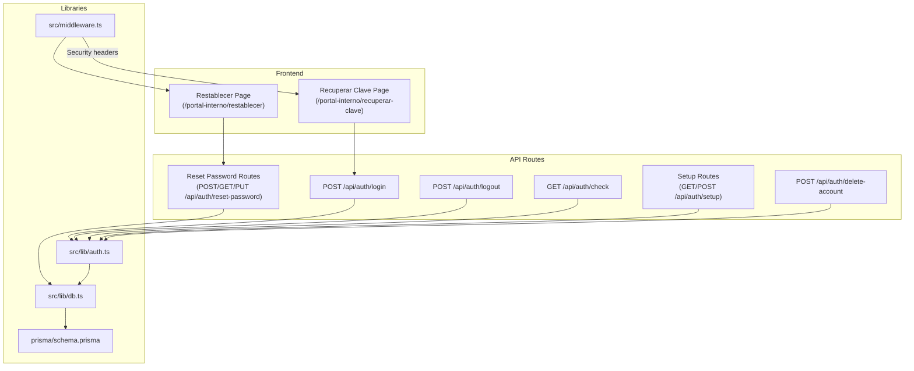

**Diagram sources**
- [login/route.ts:1-91](file://src/app/api/auth/login/route.ts#L1-L91)
- [logout/route.ts:1-13](file://src/app/api/auth/logout/route.ts#L1-L13)
- [check/route.ts:1-21](file://src/app/api/auth/check/route.ts#L1-L21)
- [reset-password/route.ts:1-262](file://src/app/api/auth/reset-password/route.ts#L1-L262)
- [setup/route.ts:1-63](file://src/app/api/auth/setup/route.ts#L1-L63)
- [delete-account/route.ts:1-43](file://src/app/api/auth/delete-account/route.ts#L1-L43)
- [auth.ts:1-170](file://src/lib/auth.ts#L1-L170)
- [middleware.ts:1-58](file://src/middleware.ts#L1-L58)
- [db.ts:1-21](file://src/lib/db.ts#L1-L21)
- [schema.prisma:200-222](file://prisma/schema.prisma#L200-L222)
- [recuperar-clave/page.tsx:1-150](file://src/app/portal-interno/recuperar-clave/page.tsx#L1-L150)
- [restablecer/page.tsx:1-259](file://src/app/portal-interno/restablecer/page.tsx#L1-L259)

**Section sources**
- [auth.ts:1-170](file://src/lib/auth.ts#L1-L170)
- [middleware.ts:1-58](file://src/middleware.ts#L1-L58)
- [login/route.ts:1-91](file://src/app/api/auth/login/route.ts#L1-L91)
- [logout/route.ts:1-13](file://src/app/api/auth/logout/route.ts#L1-L13)
- [check/route.ts:1-21](file://src/app/api/auth/check/route.ts#L1-L21)
- [reset-password/route.ts:1-262](file://src/app/api/auth/reset-password/route.ts#L1-L262)
- [setup/route.ts:1-63](file://src/app/api/auth/setup/route.ts#L1-L63)
- [delete-account/route.ts:1-43](file://src/app/api/auth/delete-account/route.ts#L1-L43)
- [schema.prisma:200-222](file://prisma/schema.prisma#L200-L222)
- [db.ts:1-21](file://src/lib/db.ts#L1-L21)
- [recuperar-clave/page.tsx:1-150](file://src/app/portal-interno/recuperar-clave/page.tsx#L1-L150)
- [restablecer/page.tsx:1-259](file://src/app/portal-interno/restablecer/page.tsx#L1-L259)

## Core Components
- bcrypt-based password hashing and verification for secure credential storage and comparison.
- Session management using a signed cookie with httpOnly, secure, sameSite strict, and expiration controls.
- Rate limiting for login attempts per IP address.
- Password reset workflow with token generation, email delivery via Resend, and secure token validation.
- Account setup and deletion with limits and safety checks.
- Authentication state retrieval for protected routes and UI hydration.

Key implementation references:
- Hashing and verification: [hashPassword:11-18](file://src/lib/auth.ts#L11-L18), [verifyPassword:16-18](file://src/lib/auth.ts#L16-L18)
- Session creation and cookie configuration: [createSession:26-47](file://src/lib/auth.ts#L26-L47)
- Session verification and destruction: [verifySession:50-71](file://src/lib/auth.ts#L50-L71), [destroySession:74-77](file://src/lib/auth.ts#L74-L77)
- Admin operations: [createAdmin:122-134](file://src/lib/auth.ts#L122-L134), [authenticateAdmin:137-153](file://src/lib/auth.ts#L137-L153), [getCurrentAdmin:156-169](file://src/lib/auth.ts#L156-L169)
- Rate-limited login: [login POST:9-91](file://src/app/api/auth/login/route.ts#L9-L91)
- Password reset: [reset-password routes:105-262](file://src/app/api/auth/reset-password/route.ts#L105-L262)
- Setup and deletion: [setup routes:4-63](file://src/app/api/auth/setup/route.ts#L4-L63), [delete-account route:4-43](file://src/app/api/auth/delete-account/route.ts#L4-L43)

**Section sources**
- [auth.ts:1-170](file://src/lib/auth.ts#L1-L170)
- [login/route.ts:1-91](file://src/app/api/auth/login/route.ts#L1-L91)
- [reset-password/route.ts:1-262](file://src/app/api/auth/reset-password/route.ts#L1-L262)
- [setup/route.ts:1-63](file://src/app/api/auth/setup/route.ts#L1-L63)
- [delete-account/route.ts:1-43](file://src/app/api/auth/delete-account/route.ts#L1-L43)

## Architecture Overview
The authentication system integrates frontend UI, API routes, shared auth utilities, and database models. Security headers are applied globally via middleware. Sessions are stored in a signed cookie with strict attributes. Password resets use a time-bound token stored hashed in the database and emailed as a plaintext token.

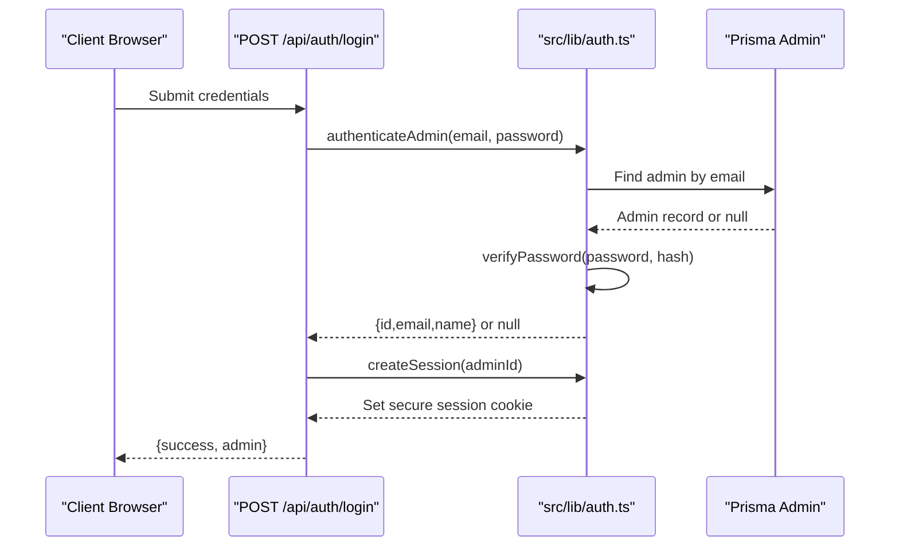

**Diagram sources**
- [login/route.ts:9-91](file://src/app/api/auth/login/route.ts#L9-L91)
- [auth.ts:137-153](file://src/lib/auth.ts#L137-L153)
- [auth.ts:26-47](file://src/lib/auth.ts#L26-L47)
- [schema.prisma:200-211](file://prisma/schema.prisma#L200-L211)

**Section sources**
- [login/route.ts:1-91](file://src/app/api/auth/login/route.ts#L1-L91)
- [auth.ts:1-170](file://src/lib/auth.ts#L1-L170)
- [schema.prisma:200-211](file://prisma/schema.prisma#L200-L211)

## Detailed Component Analysis

### Password Hashing and Verification
- Uses bcryptjs with configurable salt rounds for hashing and comparing passwords.
- Hashing occurs during admin creation and password reset.
- Verification is used during login to validate credentials.

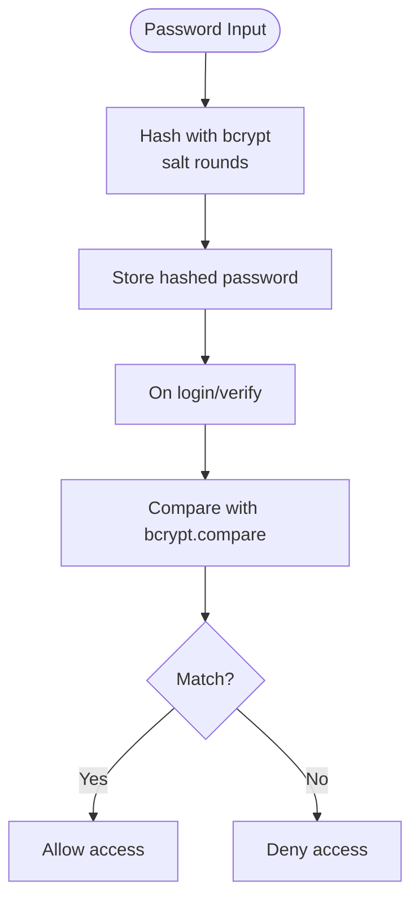

**Diagram sources**
- [auth.ts:11-18](file://src/lib/auth.ts#L11-L18)
- [reset-password/route.ts:242-248](file://src/app/api/auth/reset-password/route.ts#L242-L248)

**Section sources**
- [auth.ts:11-18](file://src/lib/auth.ts#L11-L18)
- [reset-password/route.ts:242-248](file://src/app/api/auth/reset-password/route.ts#L242-L248)

### Session Management with Secure Cookies
- Session token generation uses cryptographically secure randomness.
- Session cookie is httpOnly, secure (HTTPS-only in production), sameSite strict, path '/', and expires after a fixed duration.
- Session verification parses the cookie, validates expiration, and clears expired sessions automatically.
- Logout destroys the session cookie.

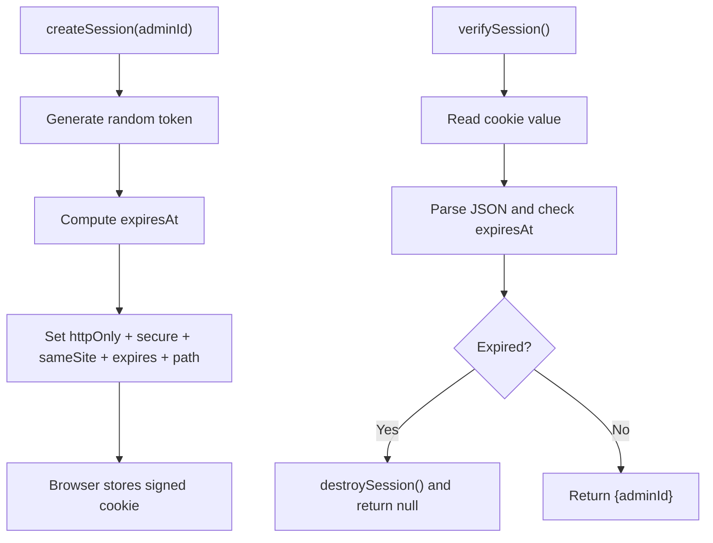

**Diagram sources**
- [auth.ts:21-47](file://src/lib/auth.ts#L21-L47)
- [auth.ts:50-71](file://src/lib/auth.ts#L50-L71)
- [auth.ts:74-77](file://src/lib/auth.ts#L74-L77)

**Section sources**
- [auth.ts:21-77](file://src/lib/auth.ts#L21-L77)

### Authentication Middleware Integration
- Global security headers are applied to all non-static routes via middleware, including CSP, HSTS, X-Frame-Options, X-Content-Type-Options, X-XSS-Protection, Referrer-Policy, and Permissions-Policy.
- These headers complement cookie security and protect against common web vulnerabilities.

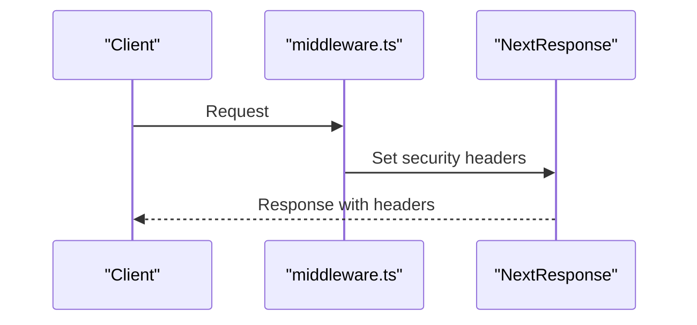

**Diagram sources**
- [middleware.ts:8-44](file://src/middleware.ts#L8-L44)

**Section sources**
- [middleware.ts:1-58](file://src/middleware.ts#L1-L58)

### Login Workflow
- Validates presence and format of email.
- Applies rate limiting per IP with memory map tracking attempts and lockout windows.
- On successful authentication, creates a session and returns admin info.
- On failure, increments attempts and returns a randomized delay to mitigate timing attacks.

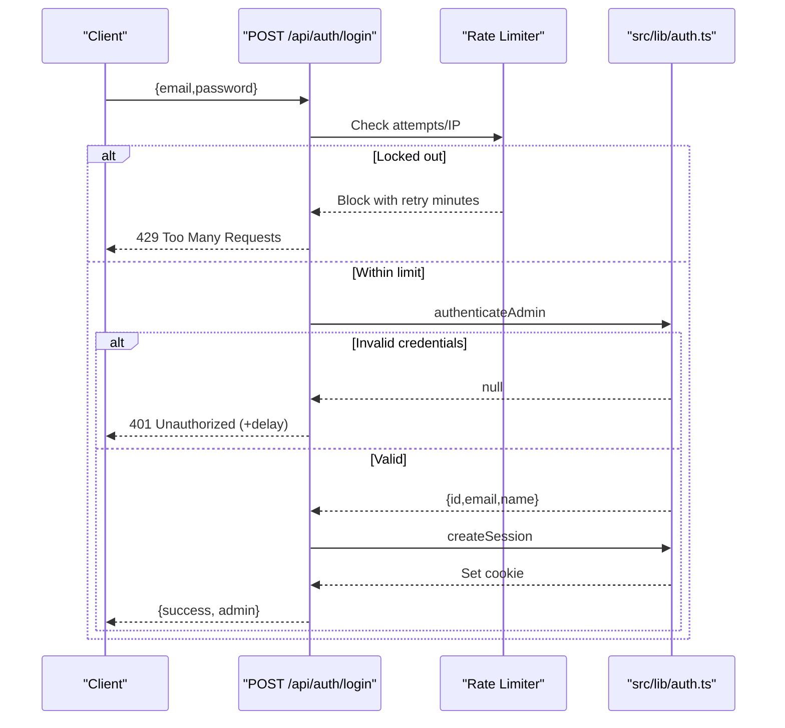

**Diagram sources**
- [login/route.ts:9-91](file://src/app/api/auth/login/route.ts#L9-L91)
- [auth.ts:137-153](file://src/lib/auth.ts#L137-L153)
- [auth.ts:26-47](file://src/lib/auth.ts#L26-L47)

**Section sources**
- [login/route.ts:1-91](file://src/app/api/auth/login/route.ts#L1-L91)

### Logout Workflow
- Destroys the session cookie and responds with success.

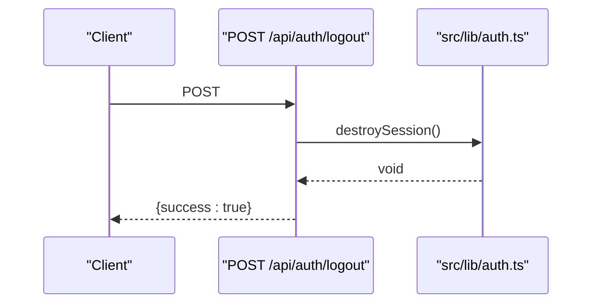

**Diagram sources**
- [logout/route.ts:4-12](file://src/app/api/auth/logout/route.ts#L4-L12)
- [auth.ts:74-77](file://src/lib/auth.ts#L74-L77)

**Section sources**
- [logout/route.ts:1-13](file://src/app/api/auth/logout/route.ts#L1-L13)
- [auth.ts:74-77](file://src/lib/auth.ts#L74-L77)

### Protected Route Enforcement and Authentication State
- The check endpoint retrieves the current admin from the session for UI hydration and protected route guards.
- Frontend pages use this endpoint to determine authentication state.

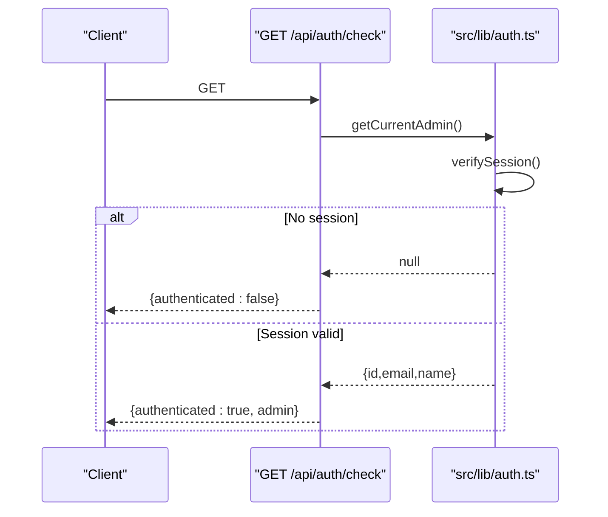

**Diagram sources**
- [check/route.ts:4-20](file://src/app/api/auth/check/route.ts#L4-L20)
- [auth.ts:156-169](file://src/lib/auth.ts#L156-L169)

**Section sources**
- [check/route.ts:1-21](file://src/app/api/auth/check/route.ts#L1-L21)
- [auth.ts:156-169](file://src/lib/auth.ts#L156-L169)

### Password Reset Functionality
- Request: Validates email, prevents abuse by rate-limiting recent tokens, invalidates unused previous tokens, generates a plaintext token, hashes it for storage, sets expiry, and sends an email via Resend.
- Verify: Hashes the received token and checks validity and expiry.
- Reset: Hashes the new password, updates admin password, marks token as used.

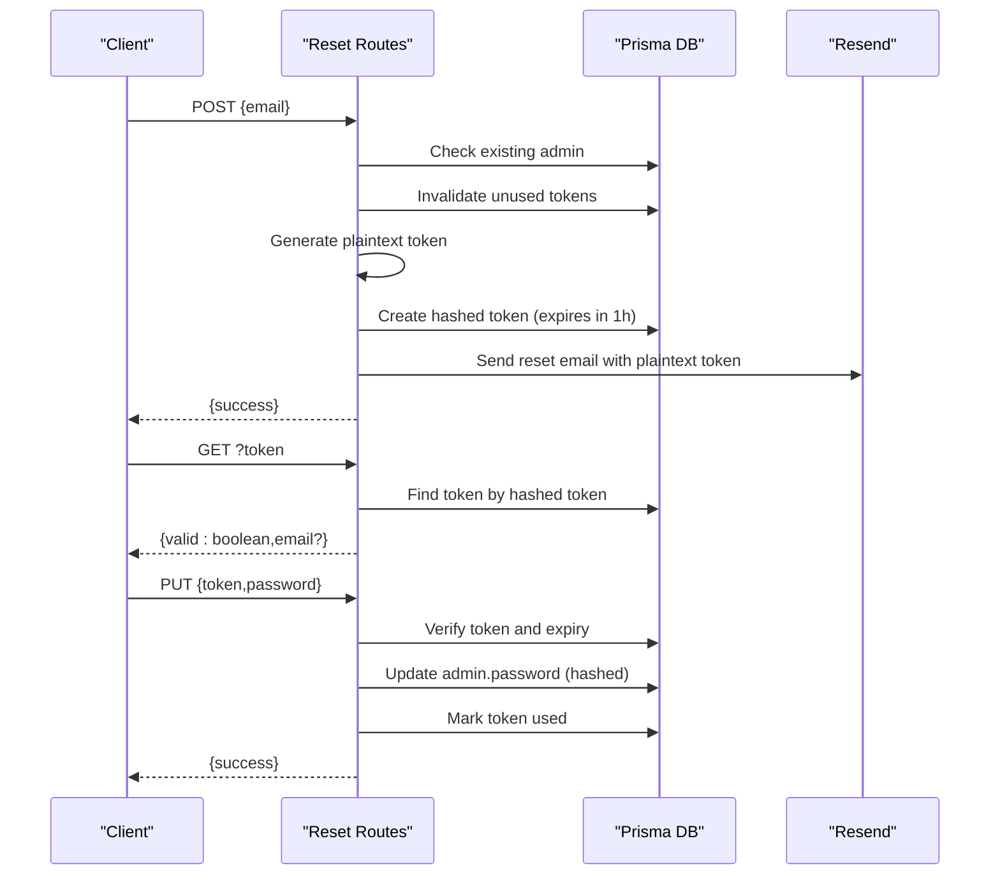

**Diagram sources**
- [reset-password/route.ts:105-262](file://src/app/api/auth/reset-password/route.ts#L105-L262)
- [schema.prisma:213-222](file://prisma/schema.prisma#L213-L222)

**Section sources**
- [reset-password/route.ts:1-262](file://src/app/api/auth/reset-password/route.ts#L1-L262)
- [schema.prisma:213-222](file://prisma/schema.prisma#L213-L222)

### Account Setup Procedures
- Setup GET returns whether admin accounts exist, current count, max allowed, and whether another admin can be created.
- Setup POST validates inputs, enforces password length, checks account limits, and creates the admin with a hashed password.

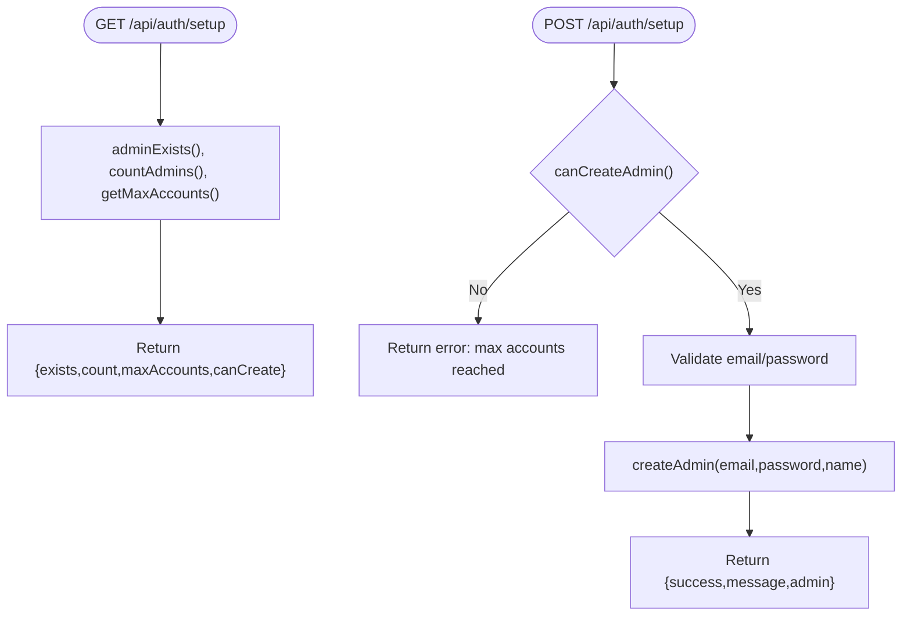

**Diagram sources**
- [setup/route.ts:4-63](file://src/app/api/auth/setup/route.ts#L4-L63)
- [auth.ts:96-100](file://src/lib/auth.ts#L96-L100)
- [auth.ts:122-134](file://src/lib/auth.ts#L122-L134)

**Section sources**
- [setup/route.ts:1-63](file://src/app/api/auth/setup/route.ts#L1-L63)
- [auth.ts:96-100](file://src/lib/auth.ts#L96-L100)
- [auth.ts:122-134](file://src/lib/auth.ts#L122-L134)

### Account Deletion
- Requires being authenticated; prevents deletion of the last admin; deletes the admin and destroys the session.

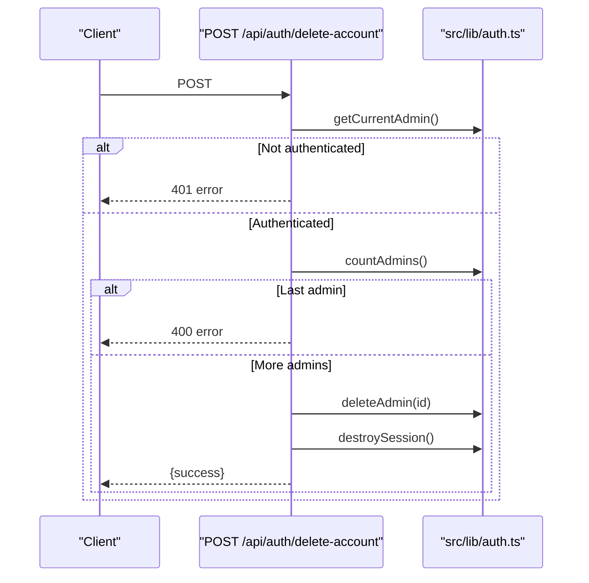

**Diagram sources**
- [delete-account/route.ts:4-43](file://src/app/api/auth/delete-account/route.ts#L4-L43)
- [auth.ts:103-119](file://src/lib/auth.ts#L103-L119)
- [auth.ts:74-77](file://src/lib/auth.ts#L74-L77)

**Section sources**
- [delete-account/route.ts:1-43](file://src/app/api/auth/delete-account/route.ts#L1-L43)
- [auth.ts:103-119](file://src/lib/auth.ts#L103-L119)
- [auth.ts:74-77](file://src/lib/auth.ts#L74-L77)

### Authentication State Management and Protected Routes
- Frontend pages call the check endpoint to hydrate authentication state.
- The middleware applies security headers globally, complementing cookie security.
- Protected routes should rely on the check endpoint and session verification to enforce access.

References:
- [check/route.ts:4-20](file://src/app/api/auth/check/route.ts#L4-L20)
- [middleware.ts:8-44](file://src/middleware.ts#L8-L44)

**Section sources**
- [check/route.ts:1-21](file://src/app/api/auth/check/route.ts#L1-L21)
- [middleware.ts:1-58](file://src/middleware.ts#L1-L58)

### User Permission Handling
- Admin model includes role and status fields suitable for permission handling. Implement route-level checks using the current admin context retrieved from the session.

References:
- [schema.prisma:206-207](file://prisma/schema.prisma#L206-L207)

**Section sources**
- [schema.prisma:200-211](file://prisma/schema.prisma#L200-L211)

### Integration with NextAuth Patterns and Cookie Security
- While NextAuth is present in dependencies, the current implementation uses a custom cookie-based session pattern. Cookie security follows NextAuth best practices: httpOnly, secure (conditional), sameSite strict, path '/', and explicit expiration.
- NextAuth is imported but not configured in the analyzed files; the system relies on custom auth utilities.

References:
- [package.json:80-80](file://package.json#L80-L80)
- [auth.ts:38-44](file://src/lib/auth.ts#L38-L44)

**Section sources**
- [package.json:1-116](file://package.json#L1-L116)
- [auth.ts:38-44](file://src/lib/auth.ts#L38-L44)

## Dependency Analysis
- API routes depend on src/lib/auth.ts for authentication logic and on Prisma models for persistence.
- Frontend pages depend on API routes for authentication operations.
- Middleware applies security headers globally.

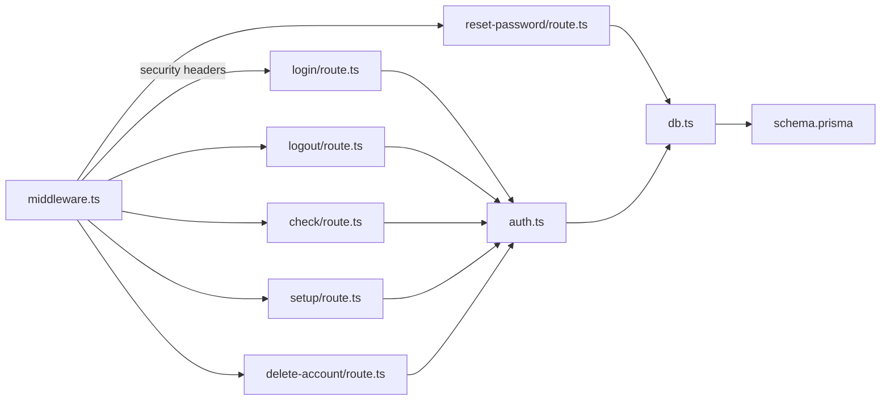

**Diagram sources**
- [login/route.ts:1-91](file://src/app/api/auth/login/route.ts#L1-L91)
- [logout/route.ts:1-13](file://src/app/api/auth/logout/route.ts#L1-L13)
- [check/route.ts:1-21](file://src/app/api/auth/check/route.ts#L1-L21)
- [reset-password/route.ts:1-262](file://src/app/api/auth/reset-password/route.ts#L1-L262)
- [setup/route.ts:1-63](file://src/app/api/auth/setup/route.ts#L1-L63)
- [delete-account/route.ts:1-43](file://src/app/api/auth/delete-account/route.ts#L1-L43)
- [auth.ts:1-170](file://src/lib/auth.ts#L1-L170)
- [db.ts:1-21](file://src/lib/db.ts#L1-L21)
- [schema.prisma:200-222](file://prisma/schema.prisma#L200-L222)
- [middleware.ts:1-58](file://src/middleware.ts#L1-L58)

**Section sources**
- [login/route.ts:1-91](file://src/app/api/auth/login/route.ts#L1-L91)
- [logout/route.ts:1-13](file://src/app/api/auth/logout/route.ts#L1-L13)
- [check/route.ts:1-21](file://src/app/api/auth/check/route.ts#L1-L21)
- [reset-password/route.ts:1-262](file://src/app/api/auth/reset-password/route.ts#L1-L262)
- [setup/route.ts:1-63](file://src/app/api/auth/setup/route.ts#L1-L63)
- [delete-account/route.ts:1-43](file://src/app/api/auth/delete-account/route.ts#L1-L43)
- [auth.ts:1-170](file://src/lib/auth.ts#L1-L170)
- [db.ts:1-21](file://src/lib/db.ts#L1-L21)
- [schema.prisma:200-222](file://prisma/schema.prisma#L200-L222)
- [middleware.ts:1-58](file://src/middleware.ts#L1-L58)

## Performance Considerations
- bcrypt hashing uses a moderate cost factor suitable for development; adjust salt rounds based on production hardware.
- Rate limiter uses an in-memory Map; consider a distributed store for multi-instance deployments.
- Session cookie size is small; keep additional session data server-side if needed.
- Email delivery to Resend is synchronous; consider queueing for higher throughput.

## Troubleshooting Guide
Common issues and resolutions:
- Login fails with invalid credentials: Ensure email format is valid and password meets minimum length; verify bcrypt comparison is working.
- Rate limit lockout: After repeated failures, clients receive a lockout message; wait for the lockout window to expire.
- Session not persisting: Confirm cookie attributes match environment (secure flag in production), sameSite strict, and correct path '/'.
- Password reset email not received: Verify Resend API key and sender configuration; check server logs for errors.
- Cannot delete last admin: The system prevents removal of the final administrator; create another admin first.
- Protected route access denied: Ensure the check endpoint returns authenticated true and the client maintains the session cookie.

**Section sources**
- [login/route.ts:16-33](file://src/app/api/auth/login/route.ts#L16-L33)
- [login/route.ts:54-74](file://src/app/api/auth/login/route.ts#L54-L74)
- [auth.ts:38-44](file://src/lib/auth.ts#L38-L44)
- [reset-password/route.ts:24-102](file://src/app/api/auth/reset-password/route.ts#L24-L102)
- [delete-account/route.ts:14-20](file://src/app/api/auth/delete-account/route.ts#L14-L20)
- [check/route.ts:4-20](file://src/app/api/auth/check/route.ts#L4-L20)

## Conclusion
GreenAxis implements a robust, cookie-based authentication system with bcrypt hashing, secure session cookies, and practical security measures such as rate limiting and CSP/HSTS headers. The password reset flow leverages hashed tokens and email delivery, while setup and deletion endpoints enforce account limits and safety. The system is structured to integrate with frontend pages and protected routes through clear API endpoints and middleware-driven security headers.