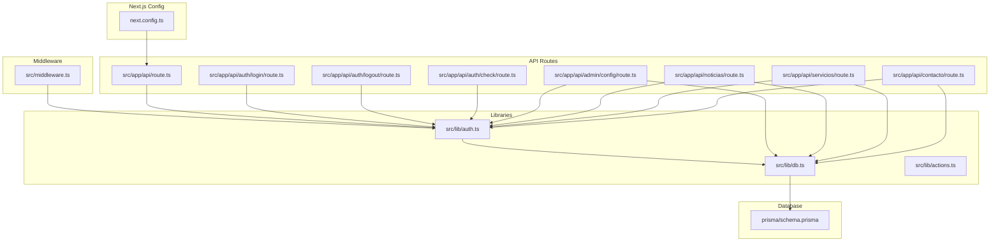
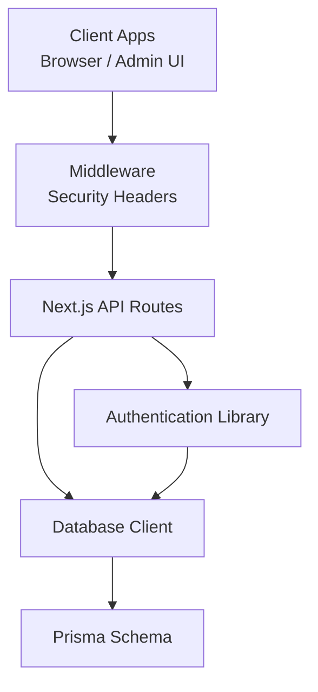
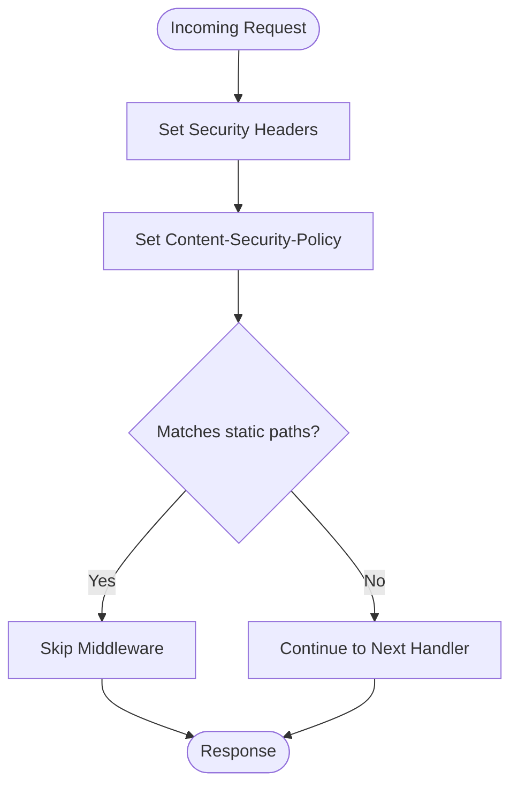
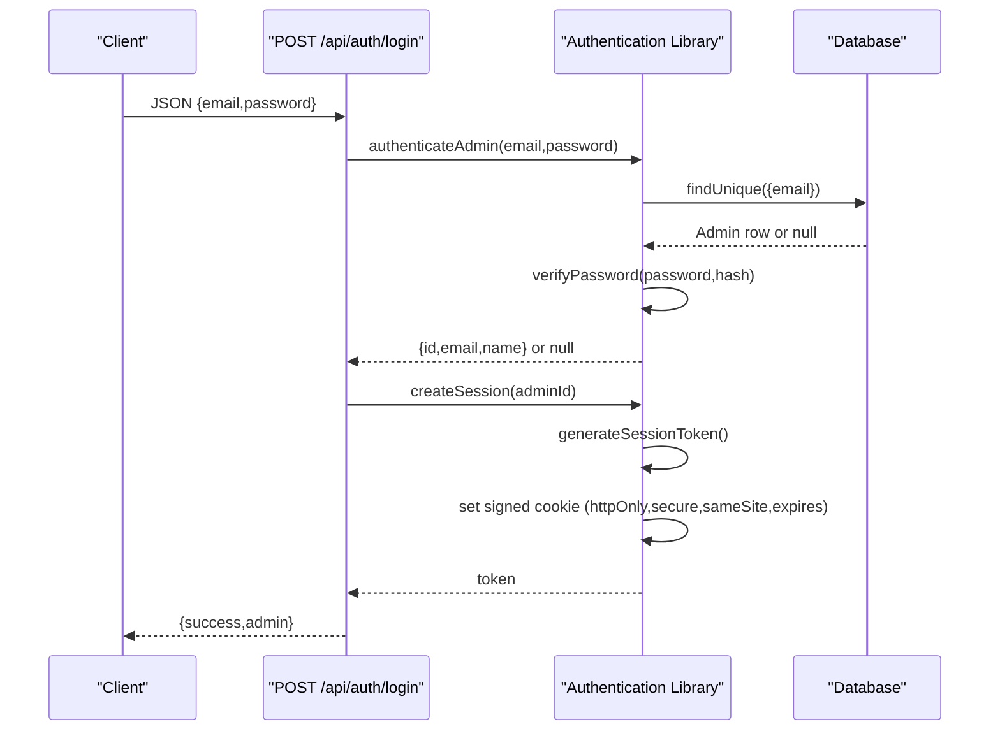
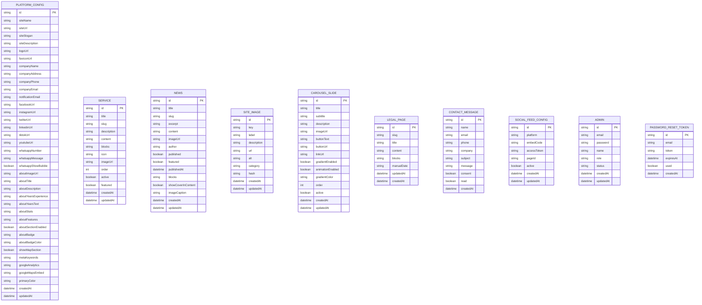
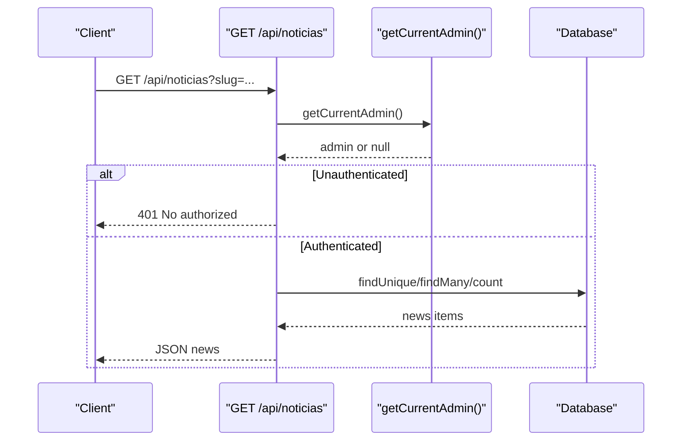
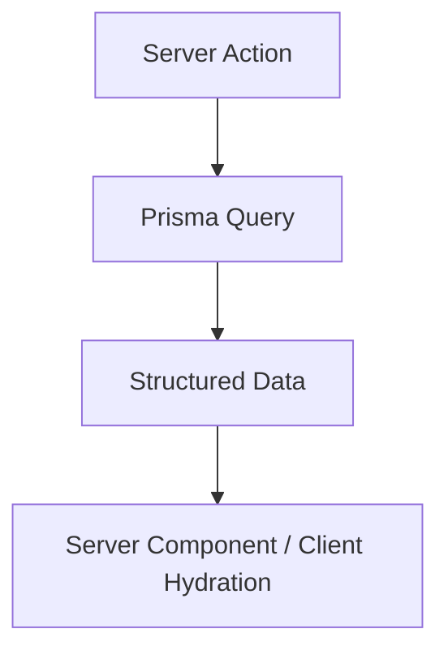
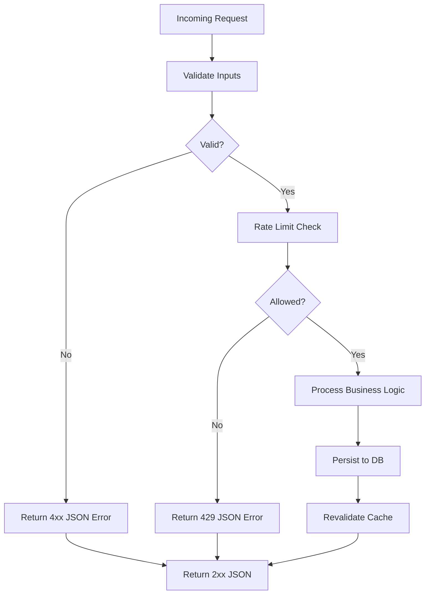
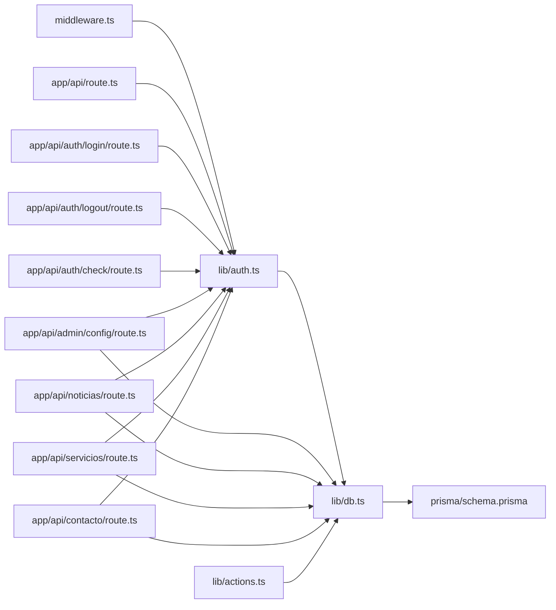

# Backend Architecture

<cite>
**Referenced Files in This Document**
- [middleware.ts](file://src/middleware.ts)
- [next.config.ts](file://next.config.ts)
- [db.ts](file://src/lib/db.ts)
- [auth.ts](file://src/lib/auth.ts)
- [actions.ts](file://src/lib/actions.ts)
- [route.ts](file://src/app/api/route.ts)
- [login.route.ts](file://src/app/api/auth/login/route.ts)
- [logout.route.ts](file://src/app/api/auth/logout/route.ts)
- [check.route.ts](file://src/app/api/auth/check/route.ts)
- [admin-config.route.ts](file://src/app/api/admin/config/route.ts)
- [noticias.route.ts](file://src/app/api/noticias/route.ts)
- [servicios.route.ts](file://src/app/api/servicios/route.ts)
- [contacto.route.ts](file://src/app/api/contacto/route.ts)
- [schema.prisma](file://prisma/schema.prisma)
</cite>

## Table of Contents
1. [Introduction](#introduction)
2. [Project Structure](#project-structure)
3. [Core Components](#core-components)
4. [Architecture Overview](#architecture-overview)
5. [Detailed Component Analysis](#detailed-component-analysis)
6. [Dependency Analysis](#dependency-analysis)
7. [Performance Considerations](#performance-considerations)
8. [Troubleshooting Guide](#troubleshooting-guide)
9. [Conclusion](#conclusion)

## Introduction
This document describes the backend architecture of GreenAxis, focusing on Next.js API routes, server actions, middleware, authentication, data fetching, caching, and security. It explains how server-side rendering and data persistence are implemented, along with integration patterns for external services such as email delivery and media storage.

## Project Structure
The backend is organized around Next.js App Router API routes under src/app/api, with shared libraries for authentication, database access, and server actions. Middleware applies security headers globally, while next.config.ts defines image optimization and cache headers for static assets.



**Diagram sources**
- [middleware.ts:1-58](file://src/middleware.ts#L1-L58)
- [next.config.ts:1-46](file://next.config.ts#L1-L46)
- [auth.ts:1-170](file://src/lib/auth.ts#L1-L170)
- [db.ts:1-21](file://src/lib/db.ts#L1-L21)
- [actions.ts:1-136](file://src/lib/actions.ts#L1-L136)
- [route.ts:1-5](file://src/app/api/route.ts#L1-L5)
- [login.route.ts:1-91](file://src/app/api/auth/login/route.ts#L1-L91)
- [logout.route.ts:1-13](file://src/app/api/auth/logout/route.ts#L1-L13)
- [check.route.ts:1-21](file://src/app/api/auth/check/route.ts#L1-L21)
- [admin-config.route.ts:1-120](file://src/app/api/admin/config/route.ts#L1-L120)
- [noticias.route.ts:1-229](file://src/app/api/noticias/route.ts#L1-L229)
- [servicios.route.ts:1-161](file://src/app/api/servicios/route.ts#L1-L161)
- [contacto.route.ts:1-302](file://src/app/api/contacto/route.ts#L1-L302)
- [schema.prisma:1-277](file://prisma/schema.prisma#L1-L277)

**Section sources**
- [middleware.ts:1-58](file://src/middleware.ts#L1-L58)
- [next.config.ts:1-46](file://next.config.ts#L1-L46)
- [db.ts:1-21](file://src/lib/db.ts#L1-L21)
- [auth.ts:1-170](file://src/lib/auth.ts#L1-L170)
- [actions.ts:1-136](file://src/lib/actions.ts#L1-L136)
- [route.ts:1-5](file://src/app/api/route.ts#L1-L5)
- [login.route.ts:1-91](file://src/app/api/auth/login/route.ts#L1-L91)
- [logout.route.ts:1-13](file://src/app/api/auth/logout/route.ts#L1-L13)
- [check.route.ts:1-21](file://src/app/api/auth/check/route.ts#L1-L21)
- [admin-config.route.ts:1-120](file://src/app/api/admin/config/route.ts#L1-L120)
- [noticias.route.ts:1-229](file://src/app/api/noticias/route.ts#L1-L229)
- [servicios.route.ts:1-161](file://src/app/api/servicios/route.ts#L1-L161)
- [contacto.route.ts:1-302](file://src/app/api/contacto/route.ts#L1-L302)
- [schema.prisma:1-277](file://prisma/schema.prisma#L1-L277)

## Core Components
- Middleware: Applies strict security headers and CSP, and restricts matching to non-static routes.
- Authentication library: Implements bcrypt password hashing, session creation/verification/deletion via signed cookie, and admin account helpers.
- Database client: Prisma with LibSQL/Turso adapter, configured via environment variables.
- Server actions: Data-fetching utilities for platform configuration, services, news, images, carousel, legal pages, contact messages, and social feed configs.
- API routes: Admin configuration, news, services, contact, and auth endpoints with request validation, rate limiting, and cache revalidation.

**Section sources**
- [middleware.ts:1-58](file://src/middleware.ts#L1-L58)
- [auth.ts:1-170](file://src/lib/auth.ts#L1-L170)
- [db.ts:1-21](file://src/lib/db.ts#L1-L21)
- [actions.ts:1-136](file://src/lib/actions.ts#L1-L136)
- [admin-config.route.ts:1-120](file://src/app/api/admin/config/route.ts#L1-L120)
- [noticias.route.ts:1-229](file://src/app/api/noticias/route.ts#L1-L229)
- [servicios.route.ts:1-161](file://src/app/api/servicios/route.ts#L1-L161)
- [contacto.route.ts:1-302](file://src/app/api/contacto/route.ts#L1-L302)
- [login.route.ts:1-91](file://src/app/api/auth/login/route.ts#L1-L91)
- [logout.route.ts:1-13](file://src/app/api/auth/logout/route.ts#L1-L13)
- [check.route.ts:1-21](file://src/app/api/auth/check/route.ts#L1-L21)

## Architecture Overview
The backend follows a layered architecture:
- Presentation: Next.js App Router API routes handle HTTP requests and responses.
- Application: Shared libraries encapsulate authentication, database access, and server actions.
- Persistence: Prisma ORM with LibSQL/Turso adapter manages schema-defined models.



**Diagram sources**
- [middleware.ts:1-58](file://src/middleware.ts#L1-L58)
- [auth.ts:1-170](file://src/lib/auth.ts#L1-L170)
- [db.ts:1-21](file://src/lib/db.ts#L1-L21)
- [schema.prisma:1-277](file://prisma/schema.prisma#L1-L277)

## Detailed Component Analysis

### Middleware and Security Headers
- Applies X-Frame-Options, X-Content-Type-Options, X-XSS-Protection, Referrer-Policy, Permissions-Policy, and Strict-Transport-Security.
- Sets a permissive Content-Security-Policy suitable for corporate sites with analytics and Cloudinary resources.
- Excludes static assets and image optimization endpoints from middleware processing.



**Diagram sources**
- [middleware.ts:1-58](file://src/middleware.ts#L1-L58)

**Section sources**
- [middleware.ts:1-58](file://src/middleware.ts#L1-L58)

### Authentication System
- Password hashing and verification using bcrypt with configurable salt rounds.
- Session management via signed cookie with httpOnly, secure, strict SameSite, and expiration.
- Session verification parses cookie payload, checks expiry, and clears expired sessions.
- Admin helpers: existence check, counting admins, max accounts enforcement, deletion guard, creation, authentication, and current admin retrieval.



**Diagram sources**
- [login.route.ts:1-91](file://src/app/api/auth/login/route.ts#L1-L91)
- [auth.ts:1-170](file://src/lib/auth.ts#L1-L170)

**Section sources**
- [auth.ts:1-170](file://src/lib/auth.ts#L1-L170)
- [login.route.ts:1-91](file://src/app/api/auth/login/route.ts#L1-L91)
- [logout.route.ts:1-13](file://src/app/api/auth/logout/route.ts#L1-L13)
- [check.route.ts:1-21](file://src/app/api/auth/check/route.ts#L1-L21)

### Database Layer and Data Models
- Prisma client initialized with LibSQL adapter using Turso variables.
- Models define platform configuration, services, news, site images, carousel slides, legal pages, contact messages, social feed configs, admins, and password reset tokens.
- Actions provide server-side data fetching for frontend rendering.



**Diagram sources**
- [schema.prisma:1-277](file://prisma/schema.prisma#L1-L277)

**Section sources**
- [db.ts:1-21](file://src/lib/db.ts#L1-L21)
- [actions.ts:1-136](file://src/lib/actions.ts#L1-L136)
- [schema.prisma:1-277](file://prisma/schema.prisma#L1-L277)

### API Endpoint Organization and Patterns
- Root health check endpoint returns a simple JSON message.
- Admin configuration endpoint supports GET (with lazy initialization) and PUT (with cache revalidation).
- News endpoint supports GET (single by slug or paginated list), POST (create), PUT (update), and DELETE.
- Services endpoint supports GET, POST, PUT, and DELETE with slug generation and uniqueness handling.
- Contact endpoint supports POST (form submission with rate limiting and sanitization), GET (admin-only), PUT (mark read), and DELETE (admin-only).
- Auth endpoints support login (rate-limited), logout, and session check.



**Diagram sources**
- [noticias.route.ts:1-229](file://src/app/api/noticias/route.ts#L1-L229)
- [auth.ts:155-169](file://src/lib/auth.ts#L155-L169)

**Section sources**
- [route.ts:1-5](file://src/app/api/route.ts#L1-L5)
- [admin-config.route.ts:1-120](file://src/app/api/admin/config/route.ts#L1-L120)
- [noticias.route.ts:1-229](file://src/app/api/noticias/route.ts#L1-L229)
- [servicios.route.ts:1-161](file://src/app/api/servicios/route.ts#L1-L161)
- [contacto.route.ts:1-302](file://src/app/api/contacto/route.ts#L1-L302)
- [login.route.ts:1-91](file://src/app/api/auth/login/route.ts#L1-L91)
- [logout.route.ts:1-13](file://src/app/api/auth/logout/route.ts#L1-L13)
- [check.route.ts:1-21](file://src/app/api/auth/check/route.ts#L1-L21)

### Server Actions and Data Fetching
- Server actions encapsulate data retrieval for platform configuration, services, news, images, carousel, legal pages, contact messages, and social feed configs.
- They leverage Prisma queries and return structured data for use in server components and client components via hydration.



**Diagram sources**
- [actions.ts:1-136](file://src/lib/actions.ts#L1-L136)
- [db.ts:1-21](file://src/lib/db.ts#L1-L21)

**Section sources**
- [actions.ts:1-136](file://src/lib/actions.ts#L1-L136)

### Caching and Revalidation
- Admin configuration updates trigger cache revalidation for the root layout to reflect new settings.
- News and services updates invalidate related pages and the home page after create/update/delete operations.
- Static asset caching headers are configured for uploaded media to improve performance.

```mermaid
flowchart TD
Write["Write Operation"] --> Revalidate["revalidatePath(path, "page"| "layout")"]
Revalidate --> Invalidate["Invalidate Cache"]
Invalidate --> Fresh["Next Request Builds Fresh Cache"]
```

**Diagram sources**
- [admin-config.route.ts:111-112](file://src/app/api/admin/config/route.ts#L111-L112)
- [noticias.route.ts:102-104](file://src/app/api/noticias/route.ts#L102-L104)
- [servicios.route.ts:62-64](file://src/app/api/servicios/route.ts#L62-L64)
- [next.config.ts:29-42](file://next.config.ts#L29-L42)

**Section sources**
- [admin-config.route.ts:111-112](file://src/app/api/admin/config/route.ts#L111-L112)
- [noticias.route.ts:102-104](file://src/app/api/noticias/route.ts#L102-L104)
- [servicios.route.ts:62-64](file://src/app/api/servicios/route.ts#L62-L64)
- [next.config.ts:29-42](file://next.config.ts#L29-L42)

### Request Validation, Rate Limiting, and Error Management
- Login endpoint validates email format, enforces rate limiting per IP, delays invalid attempts, and returns appropriate HTTP status codes.
- Contact endpoint validates inputs, sanitizes data, enforces rate limiting per IP, persists messages, and optionally sends admin notifications via external API.
- Error handling consistently logs errors and returns structured JSON responses with appropriate status codes.



**Diagram sources**
- [login.route.ts:16-33](file://src/app/api/auth/login/route.ts#L16-L33)
- [contacto.route.ts:137-229](file://src/app/api/contacto/route.ts#L137-L229)

**Section sources**
- [login.route.ts:1-91](file://src/app/api/auth/login/route.ts#L1-L91)
- [contacto.route.ts:1-302](file://src/app/api/contacto/route.ts#L1-L302)

### Security Middleware, CORS, and Vulnerability Protection
- Security headers and CSP applied globally by middleware.
- Authentication enforced via session verification in admin-only endpoints.
- Rate limiting implemented in login and contact endpoints to mitigate brute force and spam.
- Input validation and sanitization reduce injection risks.
- Cookie security flags (httpOnly, secure, sameSite) protect session integrity.

**Section sources**
- [middleware.ts:1-58](file://src/middleware.ts#L1-L58)
- [login.route.ts:1-91](file://src/app/api/auth/login/route.ts#L1-L91)
- [contacto.route.ts:1-302](file://src/app/api/contacto/route.ts#L1-L302)
- [auth.ts:25-77](file://src/lib/auth.ts#L25-L77)

### Integration Patterns with External Services
- Email notifications for contact submissions integrate with an external email API using environment credentials.
- Image optimization uses a custom loader with Cloudinary and remote patterns configured in next.config.ts.
- Media uploads and references are managed through dedicated API endpoints and schema models.

**Section sources**
- [contacto.route.ts:6-130](file://src/app/api/contacto/route.ts#L6-L130)
- [next.config.ts:11-28](file://next.config.ts#L11-L28)

## Dependency Analysis
The following diagram shows key dependencies among backend components:



**Diagram sources**
- [middleware.ts:1-58](file://src/middleware.ts#L1-L58)
- [auth.ts:1-170](file://src/lib/auth.ts#L1-L170)
- [db.ts:1-21](file://src/lib/db.ts#L1-L21)
- [schema.prisma:1-277](file://prisma/schema.prisma#L1-L277)
- [route.ts:1-5](file://src/app/api/route.ts#L1-L5)
- [login.route.ts:1-91](file://src/app/api/auth/login/route.ts#L1-L91)
- [logout.route.ts:1-13](file://src/app/api/auth/logout/route.ts#L1-L13)
- [check.route.ts:1-21](file://src/app/api/auth/check/route.ts#L1-L21)
- [admin-config.route.ts:1-120](file://src/app/api/admin/config/route.ts#L1-L120)
- [noticias.route.ts:1-229](file://src/app/api/noticias/route.ts#L1-L229)
- [servicios.route.ts:1-161](file://src/app/api/servicios/route.ts#L1-L161)
- [contacto.route.ts:1-302](file://src/app/api/contacto/route.ts#L1-L302)
- [actions.ts:1-136](file://src/lib/actions.ts#L1-L136)

**Section sources**
- [middleware.ts:1-58](file://src/middleware.ts#L1-L58)
- [auth.ts:1-170](file://src/lib/auth.ts#L1-L170)
- [db.ts:1-21](file://src/lib/db.ts#L1-L21)
- [schema.prisma:1-277](file://prisma/schema.prisma#L1-L277)
- [route.ts:1-5](file://src/app/api/route.ts#L1-L5)
- [login.route.ts:1-91](file://src/app/api/auth/login/route.ts#L1-L91)
- [logout.route.ts:1-13](file://src/app/api/auth/logout/route.ts#L1-L13)
- [check.route.ts:1-21](file://src/app/api/auth/check/route.ts#L1-L21)
- [admin-config.route.ts:1-120](file://src/app/api/admin/config/route.ts#L1-L120)
- [noticias.route.ts:1-229](file://src/app/api/noticias/route.ts#L1-L229)
- [servicios.route.ts:1-161](file://src/app/api/servicios/route.ts#L1-L161)
- [contacto.route.ts:1-302](file://src/app/api/contacto/route.ts#L1-L302)
- [actions.ts:1-136](file://src/lib/actions.ts#L1-L136)

## Performance Considerations
- Use server actions to fetch data server-side and avoid unnecessary client-server round trips.
- Leverage cache revalidation strategically after write operations to balance freshness and performance.
- Configure image optimization and CDN patterns to minimize bandwidth and latency.
- Keep rate limiting thresholds reasonable to prevent abuse while maintaining usability.

## Troubleshooting Guide
- Authentication failures: Verify session cookie presence, expiry, and httpOnly/secure flags. Confirm bcrypt rounds and hashing flow.
- Database connectivity: Ensure Turso environment variables are set and Prisma client initializes correctly.
- Cache issues: Confirm revalidatePath calls occur after mutations and that Next.js cache is enabled.
- Email notifications: Validate external API keys and network reachability for outbound emails.
- Middleware exclusions: Ensure static paths are excluded from middleware to avoid unnecessary overhead.

**Section sources**
- [auth.ts:25-77](file://src/lib/auth.ts#L25-L77)
- [db.ts:1-21](file://src/lib/db.ts#L1-L21)
- [admin-config.route.ts:111-112](file://src/app/api/admin/config/route.ts#L111-L112)
- [contacto.route.ts:6-130](file://src/app/api/contacto/route.ts#L6-L130)
- [middleware.ts:46-57](file://src/middleware.ts#L46-L57)

## Conclusion
GreenAxis employs a clean, modular backend leveraging Next.js API routes, a robust authentication system with secure session management, and a Prisma-driven data layer. Security is enforced through middleware-provided headers and CSP, while rate limiting and input validation mitigate common threats. Server actions and cache revalidation optimize data fetching and rendering performance, and integration with external services enables scalable content and communication workflows.