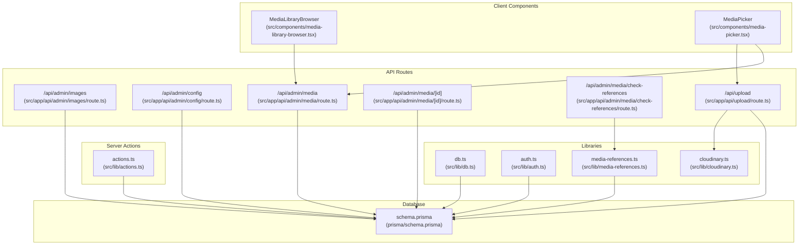
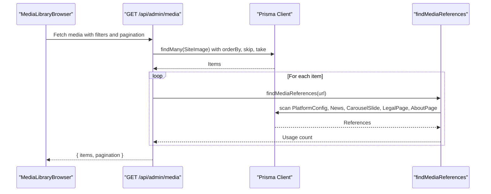
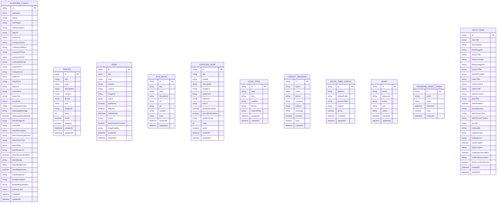
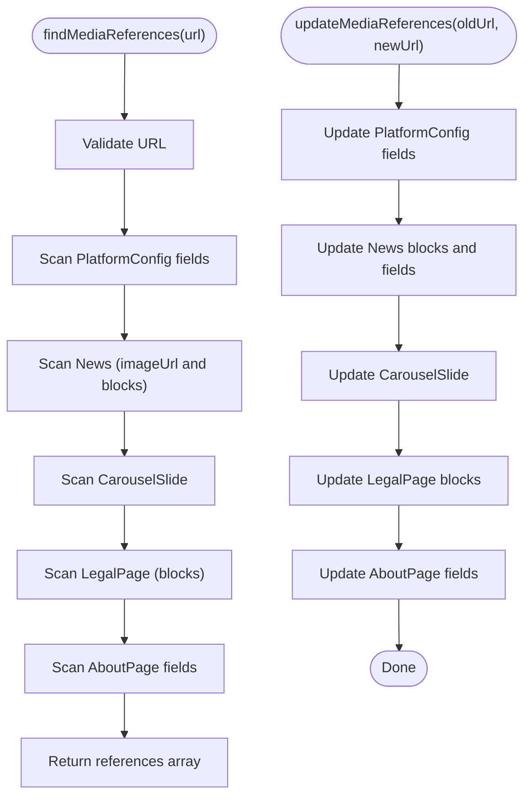
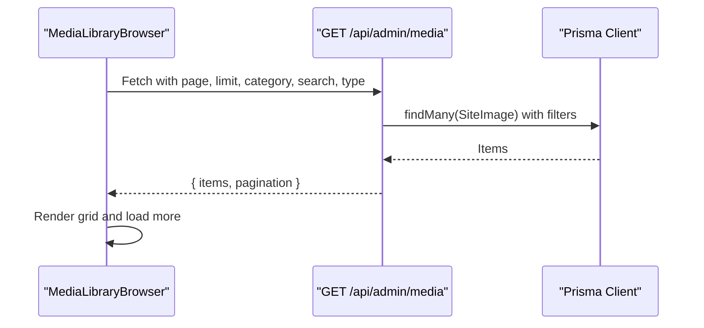
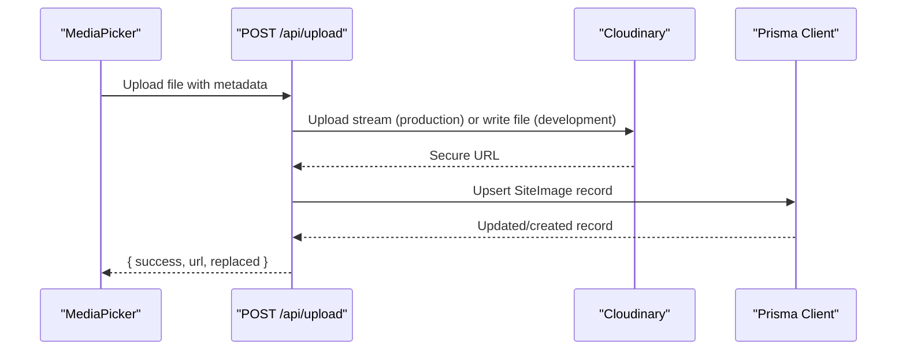
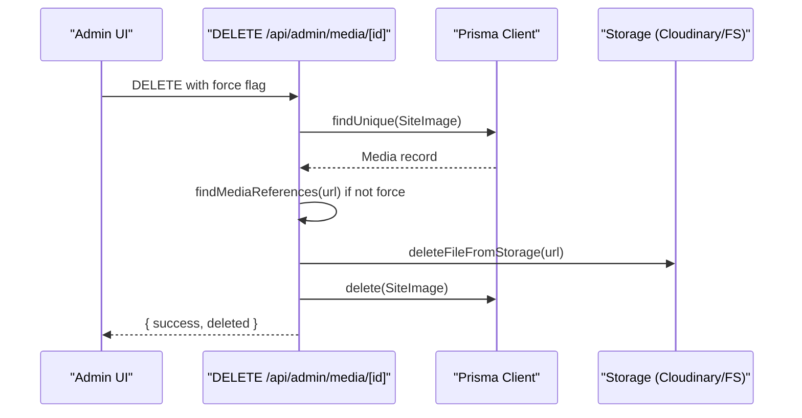
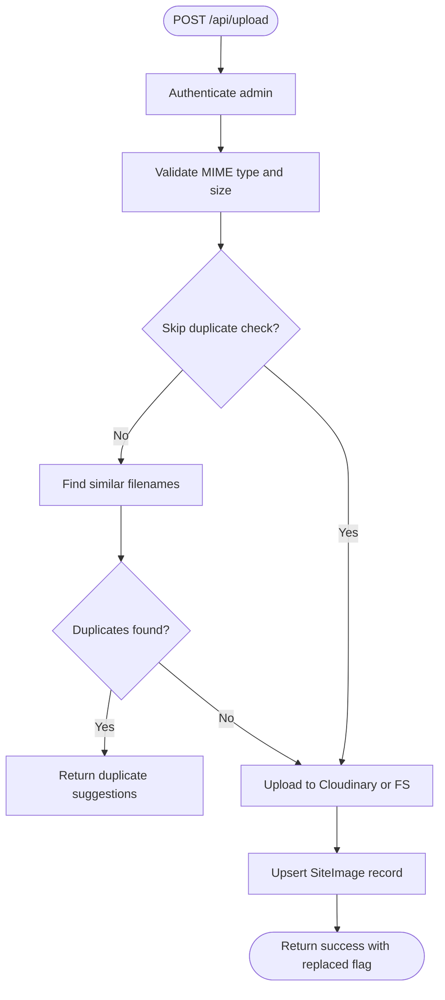
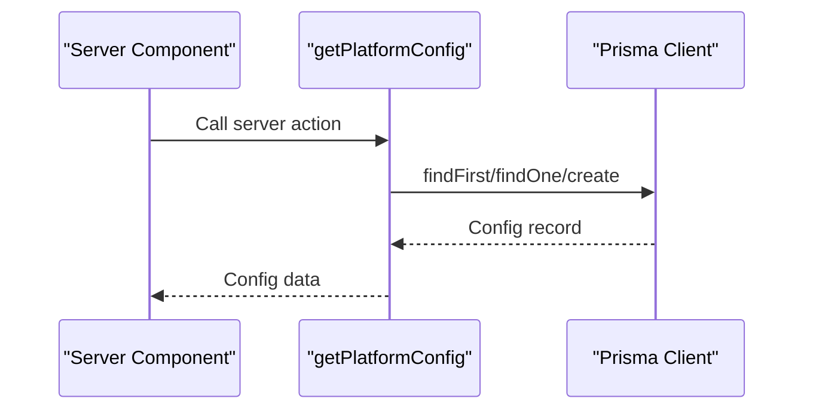
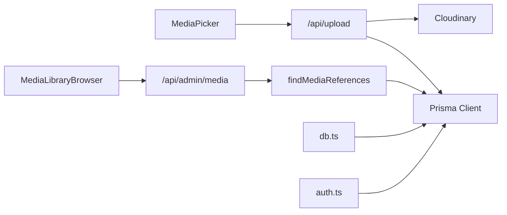

# Data Fetching Patterns

<cite>
**Referenced Files in This Document**
- [db.ts](file://src/lib/db.ts)
- [schema.prisma](file://prisma/schema.prisma)
- [cloudinary.ts](file://src/lib/cloudinary.ts)
- [media-references.ts](file://src/lib/media-references.ts)
- [actions.ts](file://src/lib/actions.ts)
- [auth.ts](file://src/lib/auth.ts)
- [media-library-browser.tsx](file://src/components/media-library-browser.tsx)
- [media-picker.tsx](file://src/components/media-picker.tsx)
- [route.ts](file://src/app/api/admin/images/route.ts)
- [route.ts](file://src/app/api/admin/config/route.ts)
- [route.ts](file://src/app/api/admin/media/route.ts)
- [route.ts](file://src/app/api/admin/media/[id]/route.ts)
- [route.ts](file://src/app/api/admin/media/check-references/route.ts)
- [route.ts](file://src/app/api/upload/route.ts)
- [route.ts](file://src/app/api/route.ts)
- [package.json](file://package.json)
</cite>

## Table of Contents
1. [Introduction](#introduction)
2. [Project Structure](#project-structure)
3. [Core Components](#core-components)
4. [Architecture Overview](#architecture-overview)
5. [Detailed Component Analysis](#detailed-component-analysis)
6. [Dependency Analysis](#dependency-analysis)
7. [Performance Considerations](#performance-considerations)
8. [Troubleshooting Guide](#troubleshooting-guide)
9. [Conclusion](#conclusion)

## Introduction
This document explains the data fetching patterns implemented in the GreenAxis backend. It covers server actions, Prisma client usage, database query patterns, caching and revalidation, media reference checking, duplicate detection, file management workflows, error handling, validation strategies, and response formatting. It also documents integrations with Cloudinary and the Turso database via LibSQL, and provides guidance on performance optimization, query optimization, and data consistency.

## Project Structure
The backend follows a Next.js App Router structure with API routes under src/app/api, shared libraries under src/lib, and UI components under src/components. Data access is centralized through a Prisma client configured to use LibSQL/Turso.

**Diagram sources**
- [media-library-browser.tsx:97-136](file://src/components/media-library-browser.tsx#L97-L136)
- [media-picker.tsx:149-196](file://src/components/media-picker.tsx#L149-L196)
- [actions.ts:6-22](file://src/lib/actions.ts#L6-L22)
- [route.ts:10-25](file://src/app/api/admin/images/route.ts#L10-L25)
- [route.ts:12-39](file://src/app/api/admin/config/route.ts#L12-L39)
- [route.ts:37-149](file://src/app/api/admin/media/route.ts#L37-L149)
- [route.ts:125-319](file://src/app/api/admin/media/[id]/route.ts#L125-L319)
- [route.ts:37-85](file://src/app/api/admin/media/check-references/route.ts#L37-L85)
- [route.ts:150-392](file://src/app/api/upload/route.ts#L150-L392)
- [db.ts:1-21](file://src/lib/db.ts#L1-L21)
- [cloudinary.ts:1-119](file://src/lib/cloudinary.ts#L1-L119)
- [media-references.ts:65-181](file://src/lib/media-references.ts#L65-L181)
- [schema.prisma:1-277](file://prisma/schema.prisma#L1-L277)

**Section sources**
- [db.ts:1-21](file://src/lib/db.ts#L1-L21)
- [schema.prisma:1-277](file://prisma/schema.prisma#L1-L277)
- [cloudinary.ts:1-119](file://src/lib/cloudinary.ts#L1-L119)
- [media-references.ts:1-334](file://src/lib/media-references.ts#L1-L334)
- [actions.ts:1-136](file://src/lib/actions.ts#L1-L136)
- [auth.ts:1-170](file://src/lib/auth.ts#L1-L170)
- [media-library-browser.tsx:1-362](file://src/components/media-library-browser.tsx#L1-L362)
- [media-picker.tsx:1-754](file://src/components/media-picker.tsx#L1-L754)
- [route.ts:1-73](file://src/app/api/admin/images/route.ts#L1-L73)
- [route.ts:1-120](file://src/app/api/admin/config/route.ts#L1-L120)
- [route.ts:1-150](file://src/app/api/admin/media/route.ts#L1-L150)
- [route.ts:1-320](file://src/app/api/admin/media/[id]/route.ts#L1-L320)
- [route.ts:1-86](file://src/app/api/admin/media/check-references/route.ts#L1-L86)
- [route.ts:1-452](file://src/app/api/upload/route.ts#L1-L452)
- [route.ts:1-5](file://src/app/api/route.ts#L1-L5)
- [package.json:1-116](file://package.json#L1-L116)

## Core Components
- Prisma client configured with LibSQL adapter for Turso database connectivity.
- Media reference utilities for scanning and updating references across content models.
- Cloudinary integration for URL transformation and asset storage.
- Authentication utilities for admin session verification.
- Server action functions for fetching domain data.
- API routes for media listing, single-item operations, reference checks, uploads, and admin configuration.

**Section sources**
- [db.ts:1-21](file://src/lib/db.ts#L1-L21)
- [media-references.ts:65-181](file://src/lib/media-references.ts#L65-L181)
- [cloudinary.ts:1-119](file://src/lib/cloudinary.ts#L1-L119)
- [auth.ts:156-170](file://src/lib/auth.ts#L156-L170)
- [actions.ts:6-22](file://src/lib/actions.ts#L6-L22)
- [route.ts:37-149](file://src/app/api/admin/media/route.ts#L37-L149)
- [route.ts:125-319](file://src/app/api/admin/media/[id]/route.ts#L125-L319)
- [route.ts:37-85](file://src/app/api/admin/media/check-references/route.ts#L37-L85)
- [route.ts:150-392](file://src/app/api/upload/route.ts#L150-L392)
- [route.ts:12-39](file://src/app/api/admin/config/route.ts#L12-L39)

## Architecture Overview
The system integrates UI components with server actions and API routes. Data retrieval uses Prisma queries with pagination and filtering. Media operations leverage Cloudinary in production and local filesystem in development. Reference integrity is enforced through media reference scanning and updates.

**Diagram sources**
- [media-library-browser.tsx:97-136](file://src/components/media-library-browser.tsx#L97-L136)
- [route.ts:37-149](file://src/app/api/admin/media/route.ts#L37-L149)
- [media-references.ts:65-181](file://src/lib/media-references.ts#L65-L181)

**Section sources**
- [media-library-browser.tsx:97-136](file://src/components/media-library-browser.tsx#L97-L136)
- [route.ts:37-149](file://src/app/api/admin/media/route.ts#L37-L149)
- [media-references.ts:65-181](file://src/lib/media-references.ts#L65-L181)

## Detailed Component Analysis

### Prisma Client and Database Schema
- The Prisma client is initialized with a LibSQL adapter pointing to Turso. It logs queries and is globally cached to avoid multiple instances.
- The schema defines models for platform configuration, services, news, site images, carousel slides, legal pages, contact messages, social feed configurations, admins, password reset tokens, and about page content.

**Diagram sources**
- [schema.prisma:16-277](file://prisma/schema.prisma#L16-L277)

**Section sources**
- [db.ts:1-21](file://src/lib/db.ts#L1-L21)
- [schema.prisma:1-277](file://prisma/schema.prisma#L1-L277)

### Media Reference Utilities
- Extracts media URLs from EditorJS blocks JSON.
- Scans multiple models for references to a given URL and returns structured references.
- Updates references across models and EditorJS blocks, replacing URLs safely.

**Diagram sources**
- [media-references.ts:65-181](file://src/lib/media-references.ts#L65-L181)
- [media-references.ts:190-333](file://src/lib/media-references.ts#L190-L333)

**Section sources**
- [media-references.ts:21-56](file://src/lib/media-references.ts#L21-L56)
- [media-references.ts:65-181](file://src/lib/media-references.ts#L65-L181)
- [media-references.ts:190-333](file://src/lib/media-references.ts#L190-L333)

### Media Library Browser (Client)
- Implements infinite scroll pagination, search, and category filtering.
- Fetches media from the admin media API endpoint and displays usage counts.

**Diagram sources**
- [media-library-browser.tsx:97-136](file://src/components/media-library-browser.tsx#L97-L136)
- [route.ts:37-149](file://src/app/api/admin/media/route.ts#L37-L149)

**Section sources**
- [media-library-browser.tsx:97-136](file://src/components/media-library-browser.tsx#L97-L136)
- [route.ts:37-149](file://src/app/api/admin/media/route.ts#L37-L149)

### Media Picker (Client)
- Provides a unified interface to select from library or upload new files.
- Handles duplicate detection warnings and progress tracking during uploads.

**Diagram sources**
- [media-picker.tsx:201-316](file://src/components/media-picker.tsx#L201-L316)
- [route.ts:150-392](file://src/app/api/upload/route.ts#L150-L392)
- [cloudinary.ts:1-119](file://src/lib/cloudinary.ts#L1-L119)

**Section sources**
- [media-picker.tsx:201-316](file://src/components/media-picker.tsx#L201-L316)
- [route.ts:150-392](file://src/app/api/upload/route.ts#L150-L392)
- [cloudinary.ts:1-119](file://src/lib/cloudinary.ts#L1-L119)

### Admin Media API
- GET lists media with pagination, filtering, and usage calculation.
- PUT updates media metadata.
- DELETE deletes media with reference checks and storage cleanup.

**Diagram sources**
- [route.ts:220-319](file://src/app/api/admin/media/[id]/route.ts#L220-L319)
- [media-references.ts:65-181](file://src/lib/media-references.ts#L65-L181)

**Section sources**
- [route.ts:37-149](file://src/app/api/admin/media/route.ts#L37-L149)
- [route.ts:125-319](file://src/app/api/admin/media/[id]/route.ts#L125-L319)
- [route.ts:37-85](file://src/app/api/admin/media/check-references/route.ts#L37-L85)

### Upload Workflow
- Validates MIME types and sizes, performs duplicate detection, uploads to Cloudinary in production or writes to filesystem in development, and updates the database record.

**Diagram sources**
- [route.ts:150-392](file://src/app/api/upload/route.ts#L150-L392)
- [cloudinary.ts:1-119](file://src/lib/cloudinary.ts#L1-L119)

**Section sources**
- [route.ts:150-392](file://src/app/api/upload/route.ts#L150-L392)
- [cloudinary.ts:1-119](file://src/lib/cloudinary.ts#L1-L119)

### Server Actions
- Provide server-side data fetching for platform configuration, services, news, site images, carousel slides, legal pages, contact messages, and social feed configurations.

**Diagram sources**
- [actions.ts:6-22](file://src/lib/actions.ts#L6-L22)

**Section sources**
- [actions.ts:6-22](file://src/lib/actions.ts#L6-L22)
- [actions.ts:25-37](file://src/lib/actions.ts#L25-L37)
- [actions.ts:47-65](file://src/lib/actions.ts#L47-L65)
- [actions.ts:82-93](file://src/lib/actions.ts#L82-L93)
- [actions.ts:96-108](file://src/lib/actions.ts#L96-L108)
- [actions.ts:111-120](file://src/lib/actions.ts#L111-L120)
- [actions.ts:123-127](file://src/lib/actions.ts#L123-L127)
- [actions.ts:130-134](file://src/lib/actions.ts#L130-L134)

### Authentication Utilities
- Manage admin sessions, verify credentials, and enforce access control on protected routes.

**Section sources**
- [auth.ts:156-170](file://src/lib/auth.ts#L156-L170)
- [route.ts:10-25](file://src/app/api/admin/images/route.ts#L10-L25)
- [route.ts:12-39](file://src/app/api/admin/config/route.ts#L12-L39)
- [route.ts:37-42](file://src/app/api/admin/media/route.ts#L37-L42)
- [route.ts:125-133](file://src/app/api/admin/media/[id]/route.ts#L125-L133)
- [route.ts:37-42](file://src/app/api/admin/media/check-references/route.ts#L37-L42)

## Dependency Analysis
- The Prisma client depends on the LibSQL adapter and Turso environment variables.
- Media operations depend on Cloudinary SDK for production and Node filesystem APIs for development.
- UI components depend on API routes for data and Cloudinary utilities for URL transformation.

**Diagram sources**
- [media-picker.tsx:201-316](file://src/components/media-picker.tsx#L201-L316)
- [media-library-browser.tsx:97-136](file://src/components/media-library-browser.tsx#L97-L136)
- [route.ts:37-149](file://src/app/api/admin/media/route.ts#L37-L149)
- [media-references.ts:65-181](file://src/lib/media-references.ts#L65-L181)
- [route.ts:150-392](file://src/app/api/upload/route.ts#L150-L392)
- [db.ts:1-21](file://src/lib/db.ts#L1-L21)
- [cloudinary.ts:1-119](file://src/lib/cloudinary.ts#L1-L119)

**Section sources**
- [package.json:33-36](file://package.json#L33-L36)
- [db.ts:1-21](file://src/lib/db.ts#L1-L21)
- [cloudinary.ts:1-119](file://src/lib/cloudinary.ts#L1-L119)
- [media-references.ts:65-181](file://src/lib/media-references.ts#L65-L181)
- [route.ts:37-149](file://src/app/api/admin/media/route.ts#L37-L149)
- [route.ts:150-392](file://src/app/api/upload/route.ts#L150-L392)

## Performance Considerations
- Pagination and filtering: The media listing endpoint uses skip/take with explicit limits and calculates approximate totals when type filtering is applied.
- Parallelization: Server actions use Promise.all for concurrent counts and queries where appropriate.
- Caching and revalidation: Admin configuration and image deletion trigger cache revalidation to keep rendered pages up-to-date.
- Storage efficiency: Cloudinary transformations are applied via URL manipulation to optimize delivery without storing multiple variants.
- File size limits: Environment-aware limits reduce payload sizes and improve reliability.

[No sources needed since this section provides general guidance]

## Troubleshooting Guide
- Authentication failures: Protected routes return unauthorized responses when admin session is missing or invalid.
- Validation errors: Upload route validates MIME types, sizes, and file signatures; returns descriptive errors for invalid inputs.
- Reference conflicts: Media deletion checks references and refuses deletion unless forced; provides structured reference details.
- Storage errors: Deletion attempts are handled gracefully with warnings; partial cleanup continues even if storage operations fail.
- Database errors: Server actions and API routes wrap operations with try/catch and return standardized error responses.

**Section sources**
- [auth.ts:156-170](file://src/lib/auth.ts#L156-L170)
- [route.ts:10-25](file://src/app/api/admin/images/route.ts#L10-L25)
- [route.ts:252-280](file://src/app/api/admin/media/[id]/route.ts#L252-L280)
- [route.ts:170-211](file://src/app/api/upload/route.ts#L170-L211)
- [route.ts:292-300](file://src/app/api/upload/route.ts#L292-L300)
- [route.ts:313-323](file://src/app/api/upload/route.ts#L313-L323)

## Conclusion
GreenAxis implements robust data fetching patterns centered on Prisma and Next.js App Router. The system ensures data consistency through media reference checks, supports scalable media workflows with Cloudinary and local storage, and maintains performance via pagination, parallel queries, and cache revalidation. The documented APIs and utilities provide clear patterns for extending functionality while preserving reliability and user experience.