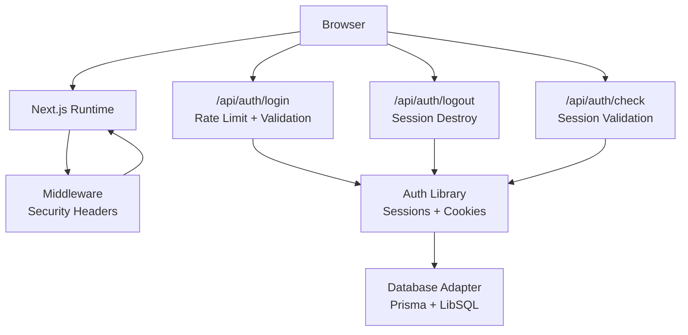
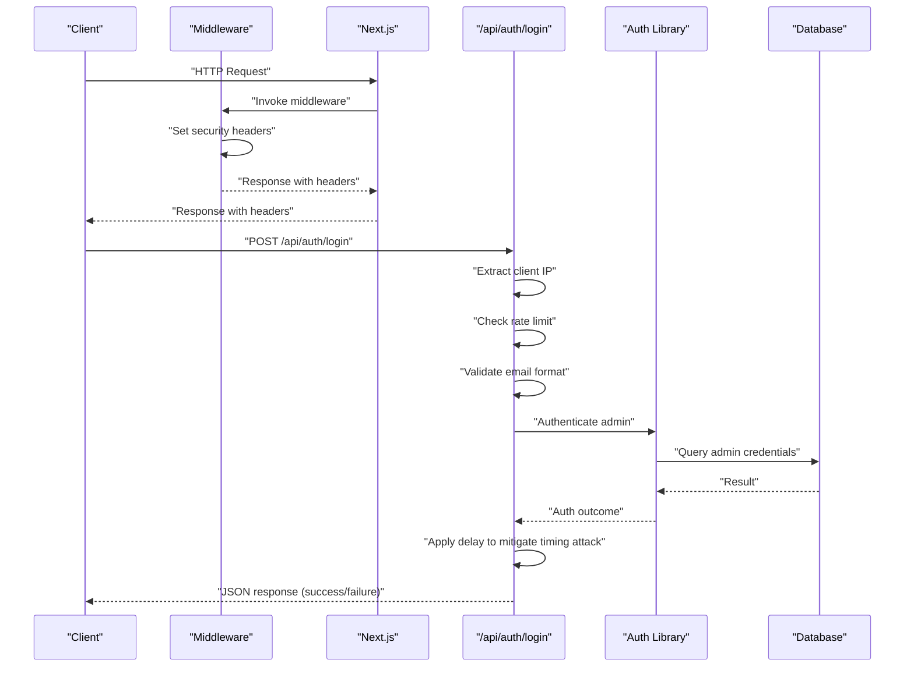
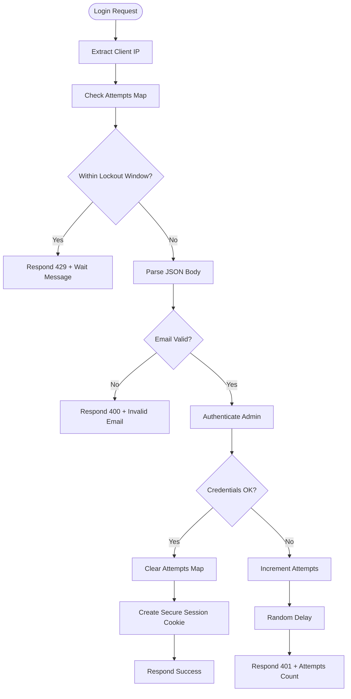
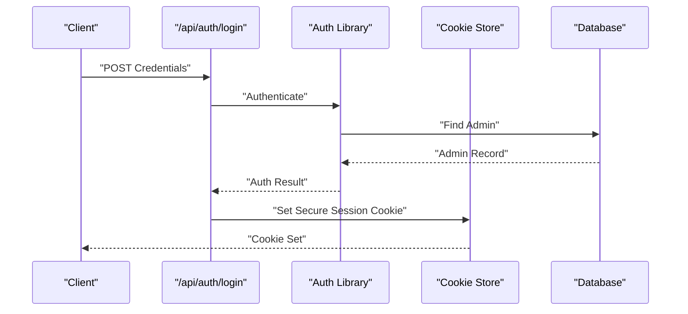
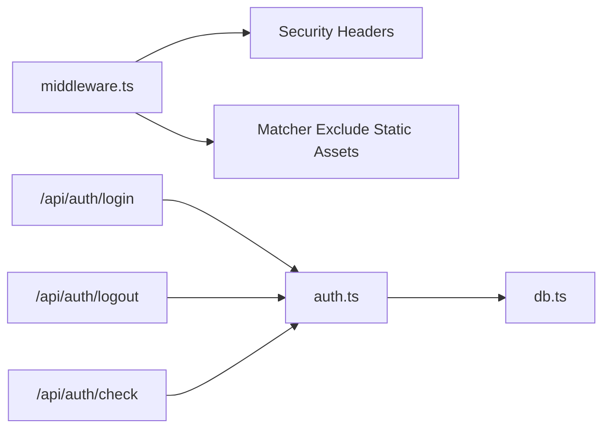

# Security Middleware

<cite>
**Referenced Files in This Document**
- [middleware.ts](file://src/middleware.ts)
- [next.config.ts](file://next.config.ts)
- [auth.ts](file://src/lib/auth.ts)
- [login.route.ts](file://src/app/api/auth/login/route.ts)
- [logout.route.ts](file://src/app/api/auth/logout/route.ts)
- [check.route.ts](file://src/app/api/auth/check/route.ts)
- [db.ts](file://src/lib/db.ts)
- [package.json](file://package.json)
</cite>

## Table of Contents
1. [Introduction](#introduction)
2. [Project Structure](#project-structure)
3. [Core Components](#core-components)
4. [Architecture Overview](#architecture-overview)
5. [Detailed Component Analysis](#detailed-component-analysis)
6. [Dependency Analysis](#dependency-analysis)
7. [Performance Considerations](#performance-considerations)
8. [Troubleshooting Guide](#troubleshooting-guide)
9. [Conclusion](#conclusion)
10. [Appendices](#appendices)

## Introduction
This document provides comprehensive security middleware documentation for GreenAxis. It explains the implementation of security headers (X-Frame-Options, X-Content-Type-Options, X-XSS-Protection, Strict-Transport-Security, Referrer-Policy, Permissions-Policy), Content-Security-Policy configuration for resource loading and frame ancestor control, middleware matcher exclusions for static assets and Next.js internal routes, and the authentication and rate-limiting protections in place. It also covers CORS policy considerations, cross-site request protection, request sanitization, vulnerability mitigations, best practices, compliance guidance, customization tips, and monitoring recommendations.

## Project Structure
GreenAxis applies security headers globally via Next.js middleware and augments authentication security with per-route handlers. The middleware sets robust headers and excludes static assets and Next.js internals from processing. Authentication endpoints implement rate limiting, input validation, and secure session handling.

**Diagram sources**
- [middleware.ts:1-58](file://src/middleware.ts#L1-L58)
- [login.route.ts:1-91](file://src/app/api/auth/login/route.ts#L1-L91)
- [logout.route.ts:1-13](file://src/app/api/auth/logout/route.ts#L1-L13)
- [check.route.ts:1-21](file://src/app/api/auth/check/route.ts#L1-L21)
- [auth.ts:1-170](file://src/lib/auth.ts#L1-L170)
- [db.ts:1-21](file://src/lib/db.ts#L1-L21)

**Section sources**
- [middleware.ts:1-58](file://src/middleware.ts#L1-L58)
- [next.config.ts:1-46](file://next.config.ts#L1-L46)

## Core Components
- Security Headers Middleware: Applies X-Frame-Options, X-Content-Type-Options, X-XSS-Protection, Referrer-Policy, Permissions-Policy, Strict-Transport-Security, and Content-Security-Policy to all requests except excluded paths.
- Middleware Matcher: Excludes static assets and Next.js internal routes from header injection.
- Authentication Layer: Secure session creation with HttpOnly, Secure, SameSite strict cookies; session verification and destruction.
- Rate Limiting: Login endpoint implements in-memory rate limiting with IP-based tracking and lockout windows.
- Request Validation: Email format validation and controlled error responses to prevent information leakage.
- Database Access: Uses Prisma with LibSQL adapter for secure persistence.

**Section sources**
- [middleware.ts:1-58](file://src/middleware.ts#L1-L58)
- [auth.ts:1-170](file://src/lib/auth.ts#L1-L170)
- [login.route.ts:1-91](file://src/app/api/auth/login/route.ts#L1-L91)
- [db.ts:1-21](file://src/lib/db.ts#L1-L21)

## Architecture Overview
The security architecture combines middleware-level hardening with per-route protections. Middleware ensures baseline headers for dynamic routes while excluding static assets. Authentication endpoints enforce rate limits and sanitize inputs. Sessions are stored in HttpOnly cookies with secure attributes.

**Diagram sources**
- [middleware.ts:1-58](file://src/middleware.ts#L1-L58)
- [login.route.ts:1-91](file://src/app/api/auth/login/route.ts#L1-L91)
- [auth.ts:136-153](file://src/lib/auth.ts#L136-L153)
- [db.ts:1-21](file://src/lib/db.ts#L1-L21)

## Detailed Component Analysis

### Security Headers Implementation
- X-Frame-Options: Blocks clickjacking by preventing the page from being embedded in frames.
- X-Content-Type-Options: Prevents MIME sniffing to reduce drive-by download risks.
- X-XSS-Protection: Legacy XSS filtering mode set to block.
- Referrer-Policy: Limits referrer information for cross-origin requests.
- Permissions-Policy: Restricts sensitive browser features (camera, microphone, geolocation).
- Strict-Transport-Security: Enforces HTTPS with subdomain inclusion and preload hints.
- Content-Security-Policy: Defines allowed sources for scripts, styles, images, fonts, connections, frames, media, and frame ancestors. Frame ancestors are restricted to none for administrative pages.

These headers are applied uniformly to all matched routes via middleware.

**Section sources**
- [middleware.ts:8-44](file://src/middleware.ts#L8-L44)

### Content-Security-Policy Configuration
- Default source restricted to self.
- Script sources include self, inline and eval (for legacy compatibility), and trusted analytics domains.
- Style sources include self and inline.
- Images, fonts, and media sources include self, data, blob, Cloudinary CDN, and HTTPS origins.
- Connect-src allows self and analytics endpoints.
- Frame-src permits self and Google embeds.
- Media-src includes Cloudinary, blob, data, and HTTPS.
- Frame-ancestors set to none to prevent embedding.

This policy balances functionality with security, enabling corporate analytics and media while restricting risky sources.

**Section sources**
- [middleware.ts:27-41](file://src/middleware.ts#L27-L41)

### Middleware Matcher Configuration
- Excludes Next.js static assets (_next/static), image optimization (_next/image), and favicon.ico.
- Applies security headers to all other routes.

This prevents unnecessary header injection on static resources and improves performance.

**Section sources**
- [middleware.ts:46-58](file://src/middleware.ts#L46-L58)

### CORS Policy and Cross-Site Request Protection
- The middleware does not set explicit CORS headers. Cross-origin behavior follows Next.js defaults.
- To enable CORS, configure origin validation and credentials handling at the application level or via a dedicated CORS middleware.
- For production, restrict Allowed-Origin to trusted domains and avoid wildcard usage.

[No sources needed since this section provides general guidance]

### Rate Limiting Strategies
- Login endpoint implements in-memory rate limiting keyed by client IP.
- Tracks attempt count and last attempt time.
- Lockout period is enforced after exceeding maximum attempts.
- On lockout, responds with a 429 status and a message indicating remaining wait time.
- On invalid credentials, increments attempts and introduces a random delay to mitigate timing attacks.

**Diagram sources**
- [login.route.ts:4-91](file://src/app/api/auth/login/route.ts#L4-L91)

**Section sources**
- [login.route.ts:4-91](file://src/app/api/auth/login/route.ts#L4-L91)

### Request Sanitization and Validation
- Validates presence of email and password.
- Validates email format using a regex pattern.
- Returns structured error messages without leaking sensitive details.
- On authentication failure, introduces a randomized delay to reduce timing attack effectiveness.

**Section sources**
- [login.route.ts:35-74](file://src/app/api/auth/login/route.ts#L35-L74)

### Authentication and Session Management
- Secure session creation with HttpOnly, Secure, SameSite strict, and fixed path.
- Session cookie includes admin identifier, token, and expiration timestamp.
- Session verification parses cookie, checks expiration, and clears expired sessions.
- Logout destroys the session cookie.
- Current admin retrieval uses verified session data.

**Diagram sources**
- [login.route.ts:79-85](file://src/app/api/auth/login/route.ts#L79-L85)
- [auth.ts:25-47](file://src/lib/auth.ts#L25-L47)
- [auth.ts:136-153](file://src/lib/auth.ts#L136-L153)
- [db.ts:1-21](file://src/lib/db.ts#L1-L21)

**Section sources**
- [auth.ts:25-77](file://src/lib/auth.ts#L25-L77)
- [login.route.ts:79-85](file://src/app/api/auth/login/route.ts#L79-L85)
- [logout.route.ts:4-12](file://src/app/api/auth/logout/route.ts#L4-L12)
- [check.route.ts:4-20](file://src/app/api/auth/check/route.ts#L4-L20)

### Database Access Security
- Uses Prisma with LibSQL adapter configured via environment variables.
- Ensures database connectivity and logging are scoped appropriately.

**Section sources**
- [db.ts:1-21](file://src/lib/db.ts#L1-L21)

## Dependency Analysis
Security headers are injected by middleware across the application. Authentication endpoints depend on the auth library and database adapter. The middleware matcher ensures headers are not applied to static assets, reducing overhead.

**Diagram sources**
- [middleware.ts:1-58](file://src/middleware.ts#L1-L58)
- [login.route.ts:1-91](file://src/app/api/auth/login/route.ts#L1-L91)
- [logout.route.ts:1-13](file://src/app/api/auth/logout/route.ts#L1-L13)
- [check.route.ts:1-21](file://src/app/api/auth/check/route.ts#L1-L21)
- [auth.ts:1-170](file://src/lib/auth.ts#L1-L170)
- [db.ts:1-21](file://src/lib/db.ts#L1-L21)

**Section sources**
- [middleware.ts:1-58](file://src/middleware.ts#L1-L58)
- [auth.ts:1-170](file://src/lib/auth.ts#L1-L170)
- [db.ts:1-21](file://src/lib/db.ts#L1-L21)

## Performance Considerations
- Middleware applies headers to all non-excluded routes; ensure matcher exclusions remain minimal to avoid missing static resources.
- Rate limiting uses an in-memory Map; for clustered deployments, replace with a distributed store (e.g., Redis) to maintain consistent limits across instances.
- Randomized delays mitigate timing attacks but add latency; tune delay range based on acceptable UX thresholds.
- Keep CSP restrictive to minimize render-blocking due to blocked resources.

[No sources needed since this section provides general guidance]

## Troubleshooting Guide
- If static assets fail to load, verify the middleware matcher excludes the correct paths and that the headers are not interfering with asset delivery.
- If login attempts are unexpectedly throttled, confirm client IP headers are correctly forwarded by proxies/load balancers.
- If sessions do not persist, check cookie attributes (Secure, SameSite, Path) and ensure HTTPS in production.
- If CSP blocks legitimate resources, review the policy directives and adjust allowed hosts for scripts, styles, images, and media.

**Section sources**
- [middleware.ts:46-58](file://src/middleware.ts#L46-L58)
- [login.route.ts:11-14](file://src/app/api/auth/login/route.ts#L11-L14)
- [auth.ts:38-44](file://src/lib/auth.ts#L38-L44)

## Conclusion
GreenAxis implements strong baseline security through middleware-provided headers and robust authentication controls. The middleware matcher optimizes performance by excluding static assets. The login endpoint includes rate limiting, input validation, and anti-timing measures. For production hardening, consider adding explicit CORS configuration, migrating rate limiting to a distributed store, and continuously auditing CSP to align with evolving resource needs.

[No sources needed since this section summarizes without analyzing specific files]

## Appendices

### Security Header Reference
- X-Frame-Options: Denies framing to prevent clickjacking.
- X-Content-Type-Options: Disables MIME sniffing.
- X-XSS-Protection: Legacy XSS filter in block mode.
- Referrer-Policy: Limits referrer data for cross-origin requests.
- Permissions-Policy: Restricts sensitive device features.
- Strict-Transport-Security: Enforces HTTPS with subdomains and preload hints.
- Content-Security-Policy: Controls resource loading and frame ancestors.

**Section sources**
- [middleware.ts:8-44](file://src/middleware.ts#L8-L44)

### CORS Guidance
- Configure allowed origins explicitly (avoid wildcards).
- Set credentials policy according to application needs.
- Apply CORS at the framework level or via a dedicated middleware.

[No sources needed since this section provides general guidance]

### Environment Variables and Secrets
- Database connection uses environment variables for LibSQL; ensure secrets are managed securely in deployment environments.
- Consider adding environment variables for rate limiting thresholds and lockout durations.

**Section sources**
- [db.ts:5-8](file://src/lib/db.ts#L5-L8)

### Monitoring Security Events
- Log failed login attempts with IP and timestamps.
- Track CSP violations via reporting endpoints.
- Monitor authentication check failures and session anomalies.

[No sources needed since this section provides general guidance]