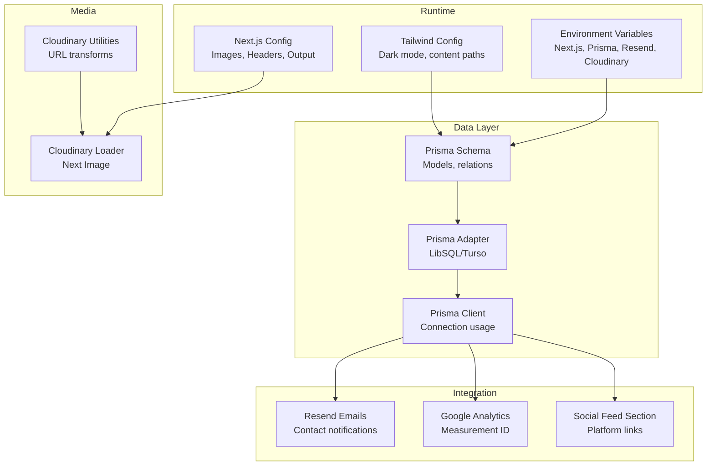
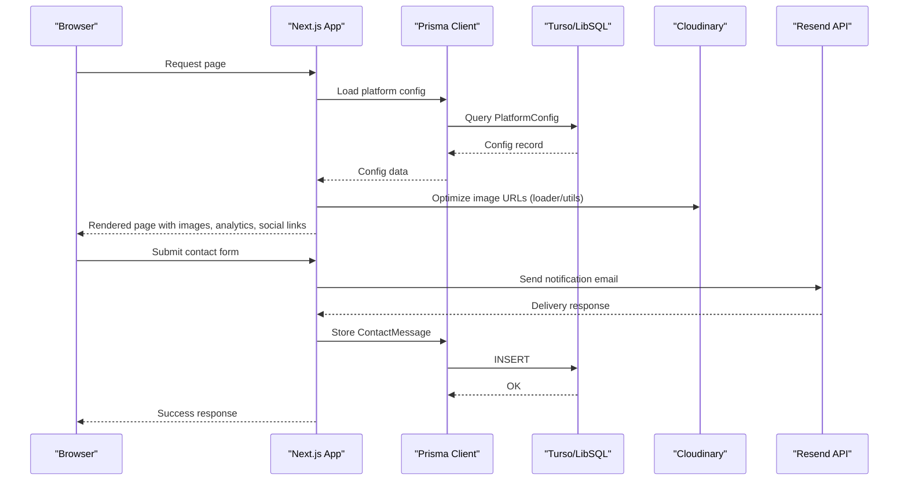
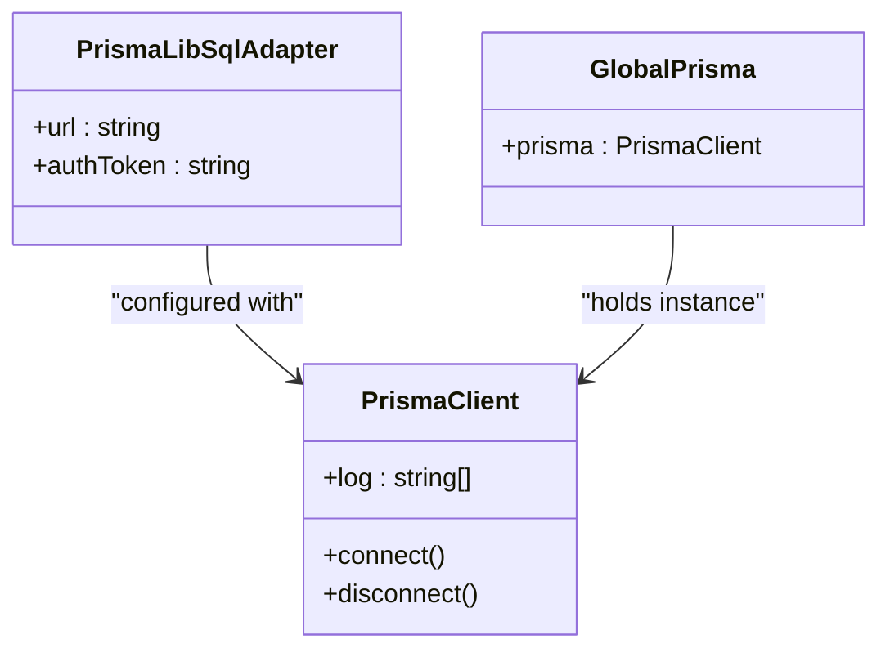
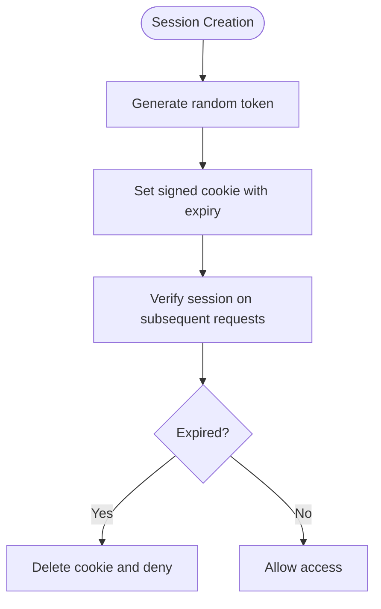
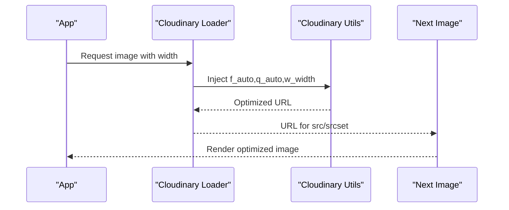
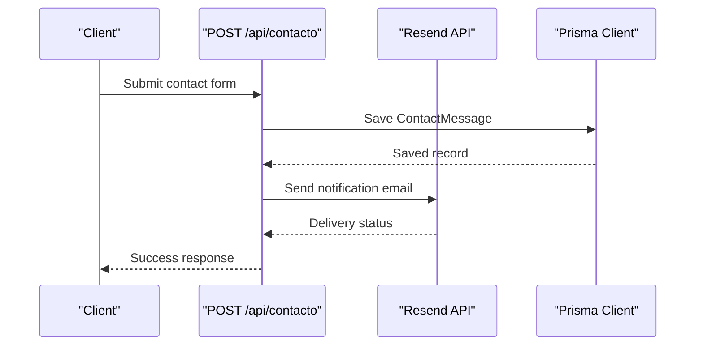
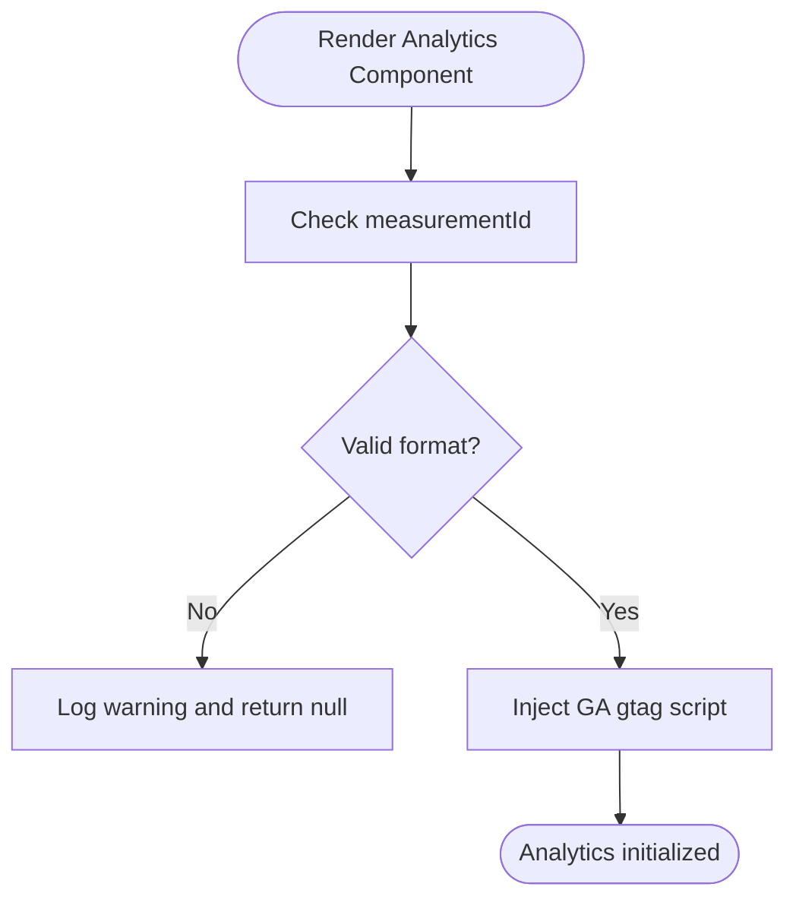
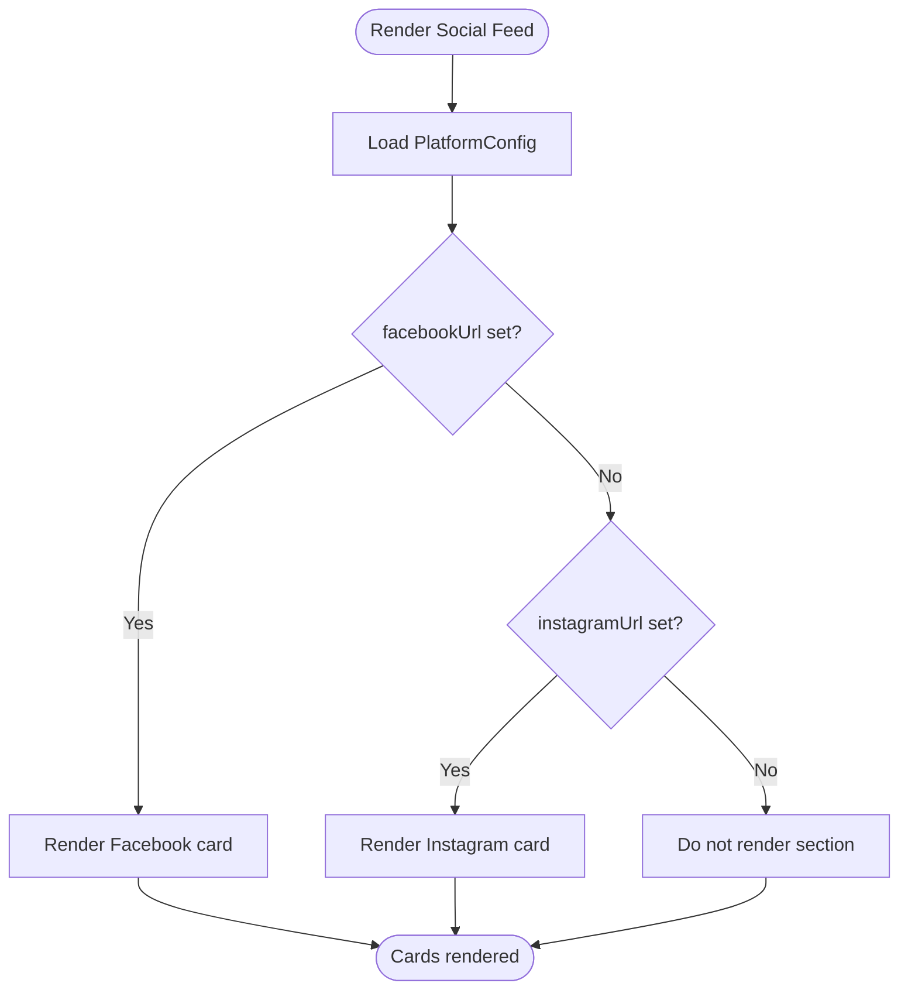
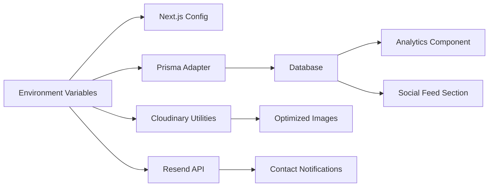

# Configuration Guide

<cite>
**Referenced Files in This Document**
- [package.json](file://package.json)
- [next.config.ts](file://next.config.ts)
- [tailwind.config.ts](file://tailwind.config.ts)
- [prisma/schema.prisma](file://prisma/schema.prisma)
- [src/lib/db.ts](file://src/lib/db.ts)
- [src/lib/auth.ts](file://src/lib/auth.ts)
- [src/lib/cloudinary.ts](file://src/lib/cloudinary.ts)
- [src/lib/cloudinary-loader.ts](file://src/lib/cloudinary-loader.ts)
- [src/app/api/contacto/route.ts](file://src/app/api/contacto/route.ts)
- [src/components/google-analytics.tsx](file://src/components/google-analytics.tsx)
- [src/components/social-feed-section.tsx](file://src/components/social-feed-section.tsx)
- [src/app/layout.tsx](file://src/app/layout.tsx)
- [src/lib/actions.ts](file://src/lib/actions.ts)
</cite>

## Table of Contents
1. [Introduction](#introduction)
2. [Project Structure](#project-structure)
3. [Core Components](#core-components)
4. [Architecture Overview](#architecture-overview)
5. [Detailed Component Analysis](#detailed-component-analysis)
6. [Dependency Analysis](#dependency-analysis)
7. [Performance Considerations](#performance-considerations)
8. [Troubleshooting Guide](#troubleshooting-guide)
9. [Conclusion](#conclusion)
10. [Appendices](#appendices)

## Introduction
This guide documents how to configure and deploy GreenAxis with a focus on environment variables, database connectivity using Turso/LibSQL via Prisma, media optimization with Cloudinary, email notifications via Resend, analytics integration, and operational best practices. It also covers performance tuning for Next.js and Tailwind CSS, environment-specific settings, and security considerations for production.

## Project Structure
The configuration touches several areas:
- Environment variables consumed by runtime code
- Next.js configuration for image optimization and caching
- Prisma schema and adapter configuration for LibSQL/Turso
- Authentication and session management
- Media pipeline using Cloudinary
- Email delivery via Resend
- Analytics injection and social feed rendering

**Diagram sources**
- [next.config.ts:1-46](file://next.config.ts#L1-L46)
- [tailwind.config.ts:1-65](file://tailwind.config.ts#L1-L65)
- [prisma/schema.prisma:1-277](file://prisma/schema.prisma#L1-L277)
- [src/lib/db.ts:1-21](file://src/lib/db.ts#L1-L21)
- [src/lib/cloudinary.ts:1-119](file://src/lib/cloudinary.ts#L1-L119)
- [src/lib/cloudinary-loader.ts:1-59](file://src/lib/cloudinary-loader.ts#L1-L59)
- [src/app/api/contacto/route.ts:1-302](file://src/app/api/contacto/route.ts#L1-L302)
- [src/components/google-analytics.tsx:1-42](file://src/components/google-analytics.tsx#L1-L42)
- [src/components/social-feed-section.tsx:1-107](file://src/components/social-feed-section.tsx#L1-L107)

**Section sources**
- [next.config.ts:1-46](file://next.config.ts#L1-L46)
- [tailwind.config.ts:1-65](file://tailwind.config.ts#L1-L65)
- [prisma/schema.prisma:1-277](file://prisma/schema.prisma#L1-L277)
- [src/lib/db.ts:1-21](file://src/lib/db.ts#L1-L21)
- [src/lib/cloudinary.ts:1-119](file://src/lib/cloudinary.ts#L1-L119)
- [src/lib/cloudinary-loader.ts:1-59](file://src/lib/cloudinary-loader.ts#L1-L59)
- [src/app/api/contacto/route.ts:1-302](file://src/app/api/contacto/route.ts#L1-L302)
- [src/components/google-analytics.tsx:1-42](file://src/components/google-analytics.tsx#L1-L42)
- [src/components/social-feed-section.tsx:1-107](file://src/components/social-feed-section.tsx#L1-L107)

## Core Components
- Turso/LibSQL database connection via Prisma adapter
- Prisma ORM schema with models for configuration, content, media, and administration
- Cloudinary integration for image optimization and responsive loading
- Resend email integration for contact notifications
- Google Analytics integration via a dedicated component
- Authentication and session management with cookie-based sessions

**Section sources**
- [src/lib/db.ts:1-21](file://src/lib/db.ts#L1-L21)
- [prisma/schema.prisma:1-277](file://prisma/schema.prisma#L1-L277)
- [src/lib/cloudinary.ts:1-119](file://src/lib/cloudinary.ts#L1-L119)
- [src/app/api/contacto/route.ts:1-302](file://src/app/api/contacto/route.ts#L1-L302)
- [src/components/google-analytics.tsx:1-42](file://src/components/google-analytics.tsx#L1-L42)
- [src/lib/auth.ts:1-170](file://src/lib/auth.ts#L1-L170)

## Architecture Overview
The configuration centers around environment-driven runtime behavior. Next.js reads environment variables to configure image optimization and caching. Prisma connects to Turso/LibSQL using an adapter configured from environment variables. Cloudinary utilities and loader transform and serve images efficiently. Resend sends contact notifications using API credentials from environment variables. Analytics and social feed components render based on platform configuration stored in the database.

**Diagram sources**
- [src/app/layout.tsx:19-54](file://src/app/layout.tsx#L19-L54)
- [src/lib/actions.ts:5-22](file://src/lib/actions.ts#L5-L22)
- [src/lib/db.ts:14-21](file://src/lib/db.ts#L14-L21)
- [src/lib/cloudinary-loader.ts:10-58](file://src/lib/cloudinary-loader.ts#L10-L58)
- [src/lib/cloudinary.ts:32-83](file://src/lib/cloudinary.ts#L32-L83)
- [src/app/api/contacto/route.ts:22-130](file://src/app/api/contacto/route.ts#L22-L130)

## Detailed Component Analysis

### Database Configuration: Turso/LibSQL Adapter and Prisma
- Prisma datasource uses SQLite provider with DATABASE_URL from environment.
- The LibSQL adapter is configured with TURSO_DATABASE_URL and TURSO_AUTH_TOKEN.
- Prisma Client is instantiated globally in development to avoid reconnect overhead.
- Models define platform configuration, content, media, and administrative entities.

**Diagram sources**
- [src/lib/db.ts:4-19](file://src/lib/db.ts#L4-L19)
- [prisma/schema.prisma:9-13](file://prisma/schema.prisma#L9-L13)

**Section sources**
- [src/lib/db.ts:1-21](file://src/lib/db.ts#L1-L21)
- [prisma/schema.prisma:1-277](file://prisma/schema.prisma#L1-L277)

### Environment Variables Setup
- Turso/LibSQL
  - TURSO_DATABASE_URL: Connection string to Turso database
  - TURSO_AUTH_TOKEN: Authentication token for Turso
- Cloudinary
  - CLOUDINARY_URL: Cloudinary account URL (protocol required)
  - CLOUDINARY_ACCOUNT_URL: Alternative account URL variant
  - CLOUDINARY_API_PROXY: Optional proxy for API requests
- Resend
  - RESEND_API_KEY: API key for Resend
  - RESEND_FROM_EMAIL: Sender email address for notifications
- Next.js
  - NEXT_PUBLIC_SITE_URL: Public site URL for metadata and analytics
- Application
  - MAX_ADMIN_ACCOUNTS: Maximum allowed admin accounts
  - NODE_ENV: Controls cookie security flags and logging

Notes:
- The project does not currently use Vercel Blob; environment variables for Vercel Blob are not required unless blob storage is integrated.
- The project uses a custom Cloudinary loader and utilities; CLOUDINARY_URL is the primary configuration.

**Section sources**
- [src/lib/db.ts:5-8](file://src/lib/db.ts#L5-L8)
- [src/lib/cloudinary-loader.ts:10-58](file://src/lib/cloudinary-loader.ts#L10-L58)
- [src/lib/cloudinary.ts:32-83](file://src/lib/cloudinary.ts#L32-L83)
- [src/app/api/contacto/route.ts:6-8](file://src/app/api/contacto/route.ts#L6-L8)
- [src/lib/auth.ts:90-93](file://src/lib/auth.ts#L90-L93)
- [next.config.ts:14-27](file://next.config.ts#L14-L27)

### Authentication Configuration
- Sessions are cookie-based with configurable duration and expiration.
- Cookie flags adjust for production (secure, sameSite strict).
- Password hashing uses bcrypt with a salt factor.
- Admin account limits are enforced via environment variable.

**Diagram sources**
- [src/lib/auth.ts:25-77](file://src/lib/auth.ts#L25-L77)

**Section sources**
- [src/lib/auth.ts:1-170](file://src/lib/auth.ts#L1-L170)

### Cloudinary CDN Configuration
- Custom loader for Next.js Image injects automatic format, quality, and width transformations.
- Utility functions optimize Cloudinary URLs with format, quality, and width parameters.
- Remote patterns in Next.js config allow Cloudinary and Unsplash domains.

**Diagram sources**
- [src/lib/cloudinary-loader.ts:10-58](file://src/lib/cloudinary-loader.ts#L10-L58)
- [src/lib/cloudinary.ts:32-83](file://src/lib/cloudinary.ts#L32-L83)
- [next.config.ts:11-28](file://next.config.ts#L11-L28)

**Section sources**
- [src/lib/cloudinary-loader.ts:1-59](file://src/lib/cloudinary-loader.ts#L1-L59)
- [src/lib/cloudinary.ts:1-119](file://src/lib/cloudinary.ts#L1-L119)
- [next.config.ts:11-28](file://next.config.ts#L11-L28)

### Resend Email Integration
- Contact form submissions trigger a notification email sent via Resend API.
- Email sender and API key are read from environment variables.
- HTML email templates are constructed server-side and sent asynchronously.

**Diagram sources**
- [src/app/api/contacto/route.ts:137-229](file://src/app/api/contacto/route.ts#L137-L229)

**Section sources**
- [src/app/api/contacto/route.ts:1-302](file://src/app/api/contacto/route.ts#L1-L302)

### Google Analytics Integration
- A component conditionally injects Google Analytics script when a valid Measurement ID is provided.
- Validates Measurement ID format and logs warnings for invalid values.

**Diagram sources**
- [src/components/google-analytics.tsx:9-41](file://src/components/google-analytics.tsx#L9-L41)

**Section sources**
- [src/components/google-analytics.tsx:1-42](file://src/components/google-analytics.tsx#L1-L42)

### Social Media Feed Configuration
- Social links are rendered conditionally based on platform configuration.
- Supports Facebook and Instagram links; displays cards with branding and CTAs.

**Diagram sources**
- [src/components/social-feed-section.tsx:16-106](file://src/components/social-feed-section.tsx#L16-L106)
- [src/lib/actions.ts:5-22](file://src/lib/actions.ts#L5-L22)

**Section sources**
- [src/components/social-feed-section.tsx:1-107](file://src/components/social-feed-section.tsx#L1-L107)
- [src/lib/actions.ts:129-134](file://src/lib/actions.ts#L129-L134)

## Dependency Analysis
- Next.js depends on environment variables for image optimization and caching policies.
- Prisma depends on Turso/LibSQL adapter configuration for connectivity.
- Cloudinary utilities depend on environment-provided account URLs.
- Resend integration depends on API key and sender configuration.
- Analytics and social components depend on platform configuration stored in the database.

**Diagram sources**
- [next.config.ts:11-28](file://next.config.ts#L11-L28)
- [src/lib/db.ts:5-8](file://src/lib/db.ts#L5-L8)
- [src/lib/cloudinary.ts:32-83](file://src/lib/cloudinary.ts#L32-L83)
- [src/app/api/contacto/route.ts:6-8](file://src/app/api/contacto/route.ts#L6-L8)
- [src/components/google-analytics.tsx:9-41](file://src/components/google-analytics.tsx#L9-L41)
- [src/components/social-feed-section.tsx:16-106](file://src/components/social-feed-section.tsx#L16-L106)

**Section sources**
- [next.config.ts:1-46](file://next.config.ts#L1-L46)
- [src/lib/db.ts:1-21](file://src/lib/db.ts#L1-L21)
- [src/lib/cloudinary.ts:1-119](file://src/lib/cloudinary.ts#L1-L119)
- [src/app/api/contacto/route.ts:1-302](file://src/app/api/contacto/route.ts#L1-L302)
- [src/components/google-analytics.tsx:1-42](file://src/components/google-analytics.tsx#L1-L42)
- [src/components/social-feed-section.tsx:1-107](file://src/components/social-feed-section.tsx#L1-L107)

## Performance Considerations
- Next.js
  - Standalone output reduces container size and improves cold start characteristics.
  - Custom image loader with automatic format and quality reduces bandwidth and CPU.
  - Remote patterns restrict allowed hosts to trusted CDNs.
  - Cache headers for uploads improve asset caching.
- Tailwind CSS
  - Content paths limit scanned files for efficient purging.
  - Dark mode class enables efficient theme switching.
- Database
  - Global Prisma client instance avoids repeated initialization in development.
  - Use connection pooling appropriate to hosting environment; monitor Turso limits.
- Media
  - Cloudinary transformations reduce payload sizes and leverage modern codecs.
  - Responsive image generation via loader minimizes over-fetching.

**Section sources**
- [next.config.ts:5, 11-28, 29-42](file://next.config.ts#L5,L11-L28,L29-L42)
- [tailwind.config.ts:6-10, 5, 62](file://tailwind.config.ts#L6-L10,L5,L62)
- [src/lib/db.ts:10-21](file://src/lib/db.ts#L10-L21)
- [src/lib/cloudinary-loader.ts:10-35](file://src/lib/cloudinary-loader.ts#L10-L35)

## Troubleshooting Guide
- Turso/LibSQL connection
  - Ensure TURSO_DATABASE_URL and TURSO_AUTH_TOKEN are set and valid.
  - Confirm Prisma datasource provider and URL resolution.
- Cloudinary
  - Verify CLOUDINARY_URL starts with the required protocol.
  - Confirm Next.js remote patterns include Cloudinary and Unsplash.
  - Check that images passed to the loader/utilities are Cloudinary URLs.
- Resend
  - Validate RESEND_API_KEY and RESEND_FROM_EMAIL.
  - Inspect network errors and response codes when sending emails.
- Analytics
  - Measurement ID must match the expected format; invalid IDs are ignored.
- Authentication
  - Ensure cookie security flags align with environment (secure in production).
  - Check session expiration and renewal behavior.
- Rate limiting
  - The contact endpoint applies in-memory rate limiting per IP; consider persistence for production.

**Section sources**
- [src/lib/db.ts:5-8](file://src/lib/db.ts#L5-L8)
- [src/lib/cloudinary.ts:11-13](file://src/lib/cloudinary.ts#L11-L13)
- [next.config.ts:14-27](file://next.config.ts#L14-L27)
- [src/app/api/contacto/route.ts:6-8](file://src/app/api/contacto/route.ts#L6-L8)
- [src/components/google-analytics.tsx:14-19](file://src/components/google-analytics.tsx#L14-L19)
- [src/lib/auth.ts:38-44](file://src/lib/auth.ts#L38-L44)

## Conclusion
GreenAxis integrates Turso/LibSQL via Prisma, optimizes media with Cloudinary, delivers notifications with Resend, and renders analytics and social content dynamically from the database. Correctly setting environment variables and understanding the runtime behavior of each component ensures reliable operation across environments.

## Appendices

### Environment Variables Reference
- Turso/LibSQL
  - TURSO_DATABASE_URL: Turso database connection string
  - TURSO_AUTH_TOKEN: Turso authentication token
- Cloudinary
  - CLOUDINARY_URL: Cloudinary account URL (with protocol)
  - CLOUDINARY_ACCOUNT_URL: Cloudinary account URL variant
  - CLOUDINARY_API_PROXY: Optional API proxy
- Resend
  - RESEND_API_KEY: Resend API key
  - RESEND_FROM_EMAIL: Sender email address
- Next.js
  - NEXT_PUBLIC_SITE_URL: Public site URL for metadata
- Application
  - MAX_ADMIN_ACCOUNTS: Maximum admin accounts
  - NODE_ENV: Environment flag affecting cookies and logging

**Section sources**
- [src/lib/db.ts:5-8](file://src/lib/db.ts#L5-L8)
- [src/lib/cloudinary.ts:32-83](file://src/lib/cloudinary.ts#L32-L83)
- [src/app/api/contacto/route.ts:6-8](file://src/app/api/contacto/route.ts#L6-L8)
- [src/lib/auth.ts:90-93](file://src/lib/auth.ts#L90-L93)
- [next.config.ts:14-27](file://next.config.ts#L14-L27)