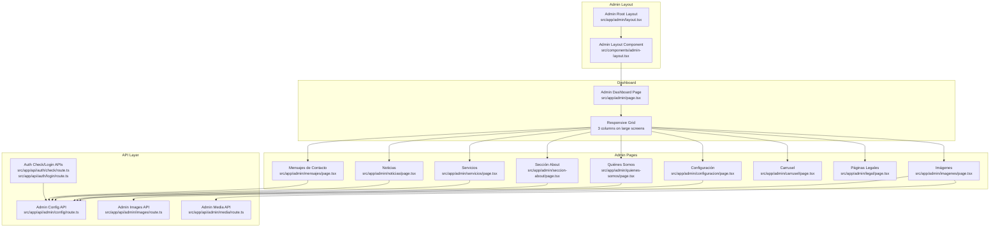
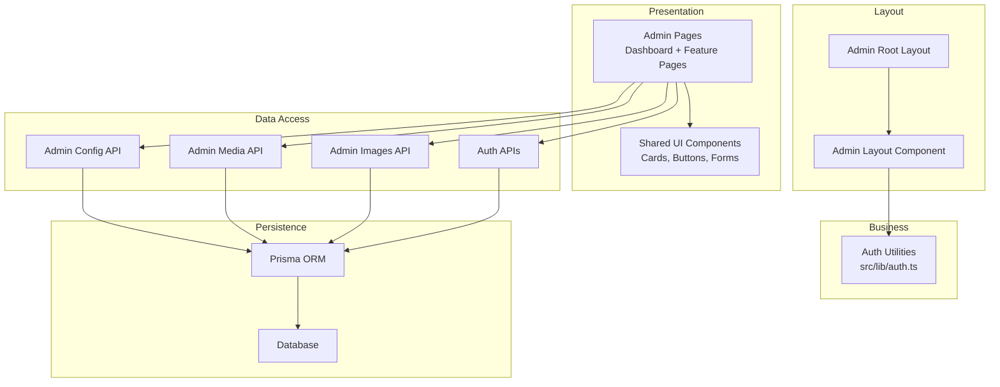
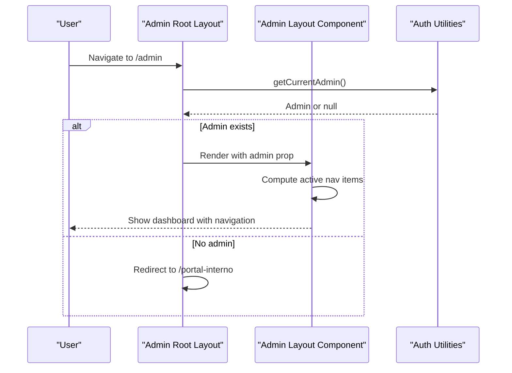
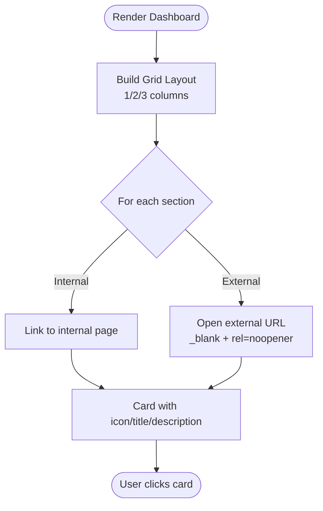
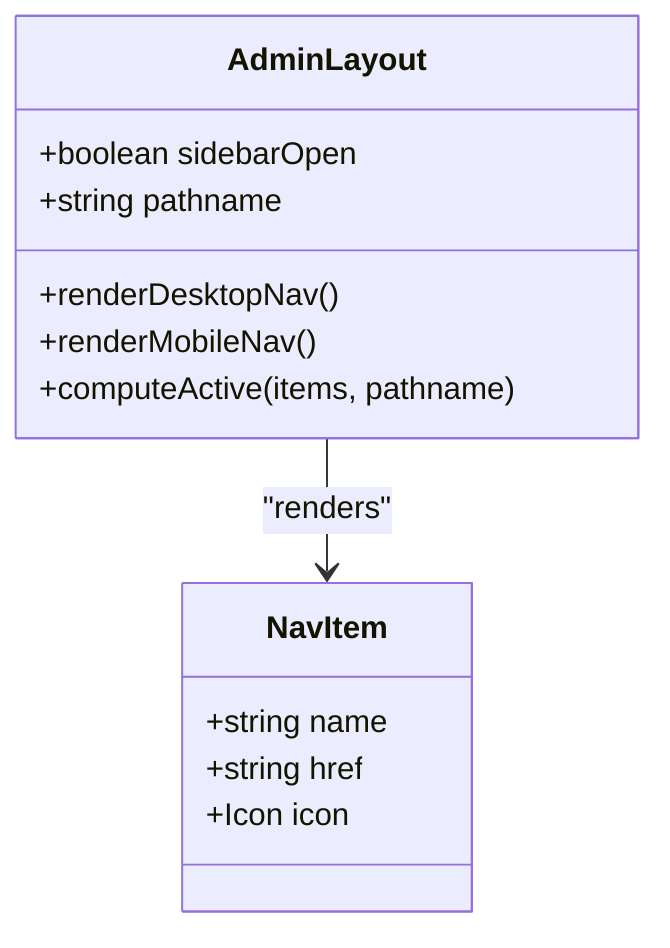
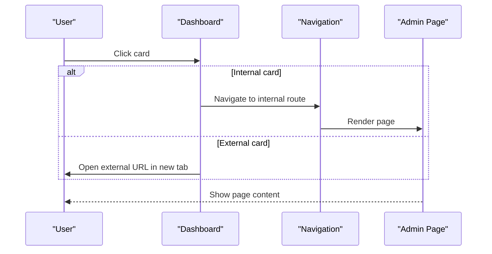
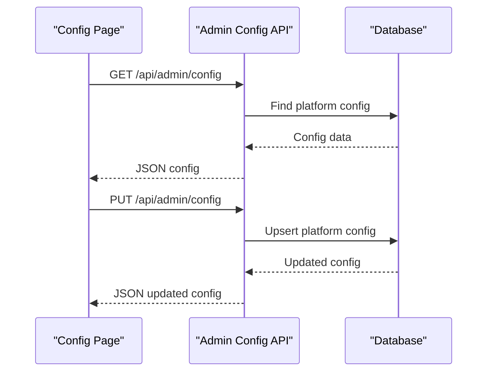
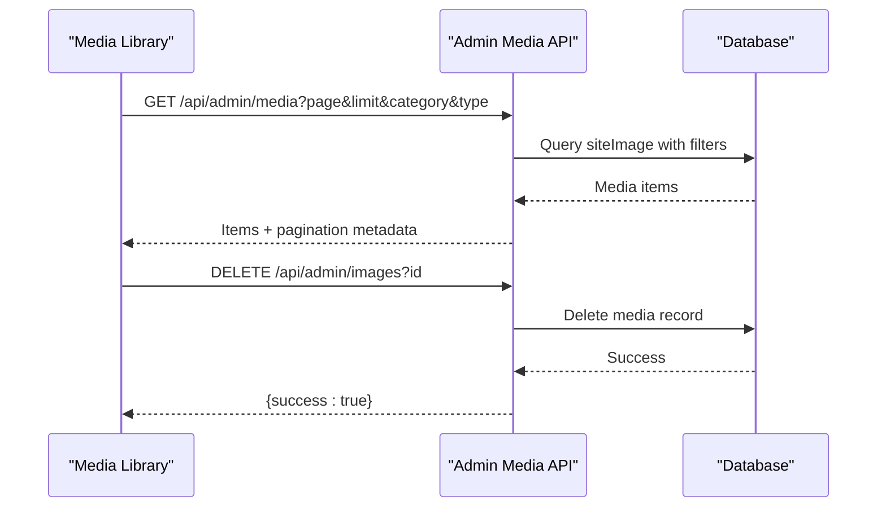
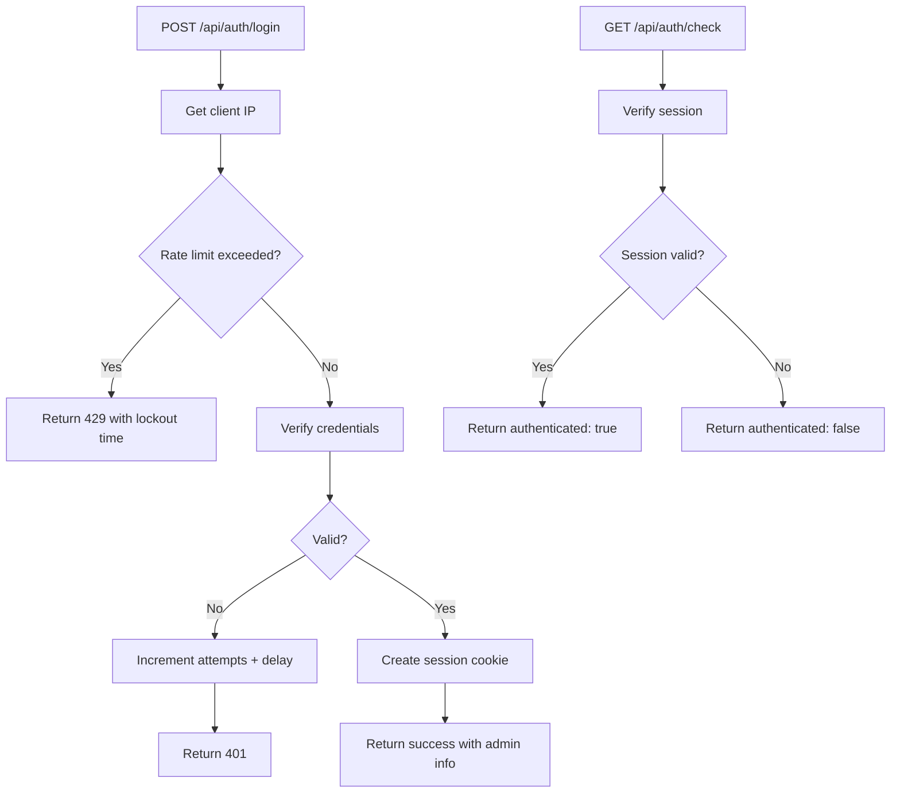
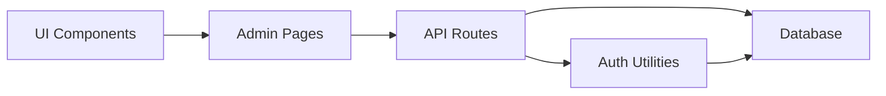

# Admin Dashboard

<cite>
**Referenced Files in This Document**
- [src/app/admin/layout.tsx](file://src/app/admin/layout.tsx)
- [src/app/admin/page.tsx](file://src/app/admin/page.tsx)
- [src/components/admin-layout.tsx](file://src/components/admin-layout.tsx)
- [src/lib/auth.ts](file://src/lib/auth.ts)
- [src/app/admin/configuracion/page.tsx](file://src/app/admin/configuracion/page.tsx)
- [src/app/admin/servicios/page.tsx](file://src/app/admin/servicios/page.tsx)
- [src/app/admin/noticias/page.tsx](file://src/app/admin/noticias/page.tsx)
- [src/app/admin/imagenes/page.tsx](file://src/app/admin/imagenes/page.tsx)
- [src/app/admin/carrusel/page.tsx](file://src/app/admin/carrusel/page.tsx)
- [src/app/admin/legal/page.tsx](file://src/app/admin/legal/page.tsx)
- [src/app/admin/mensajes/page.tsx](file://src/app/admin/mensajes/page.tsx)
- [src/app/admin/quienes-somos/page.tsx](file://src/app/admin/quienes-somos/page.tsx)
- [src/app/admin/seccion-about/page.tsx](file://src/app/admin/seccion-about/page.tsx)
- [src/app/api/admin/config/route.ts](file://src/app/api/admin/config/route.ts)
- [src/app/api/admin/images/route.ts](file://src/app/api/admin/images/route.ts)
- [src/app/api/admin/media/route.ts](file://src/app/api/admin/media/route.ts)
- [src/app/api/auth/check/route.ts](file://src/app/api/auth/check/route.ts)
- [src/app/api/auth/login/route.ts](file://src/app/api/auth/login/route.ts)
</cite>

## Table of Contents
1. [Introduction](#introduction)
2. [Project Structure](#project-structure)
3. [Core Components](#core-components)
4. [Architecture Overview](#architecture-overview)
5. [Detailed Component Analysis](#detailed-component-analysis)
6. [Dependency Analysis](#dependency-analysis)
7. [Performance Considerations](#performance-considerations)
8. [Troubleshooting Guide](#troubleshooting-guide)
9. [Conclusion](#conclusion)

## Introduction
This document describes the GreenAxis admin dashboard system, focusing on the dashboard layout structure, navigation menu organization, administrative section cards, grid-based section layout, responsive design, and external link handling. It also explains the admin navigation pattern, section categorization, and the user experience flow from the dashboard to specific administrative areas.

## Project Structure
The admin system is organized around a root admin layout that wraps all administrative pages. The main dashboard page presents administrative section cards arranged in a responsive grid. Each administrative area is implemented as a dedicated page under the admin route, with supporting API routes for data persistence and media management.

**Diagram sources**
- [src/app/admin/layout.tsx:1-18](file://src/app/admin/layout.tsx#L1-L18)
- [src/components/admin-layout.tsx:61-384](file://src/components/admin-layout.tsx#L61-L384)
- [src/app/admin/page.tsx:84-120](file://src/app/admin/page.tsx#L84-L120)
- [src/app/admin/configuracion/page.tsx:45-449](file://src/app/admin/configuracion/page.tsx#L45-L449)
- [src/app/admin/quienes-somos/page.tsx:83-536](file://src/app/admin/quienes-somos/page.tsx#L83-L536)
- [src/app/admin/seccion-about/page.tsx:44-447](file://src/app/admin/seccion-about/page.tsx#L44-L447)
- [src/app/admin/servicios/page.tsx:91-627](file://src/app/admin/servicios/page.tsx#L91-L627)
- [src/app/admin/noticias/page.tsx:38-487](file://src/app/admin/noticias/page.tsx#L38-L487)
- [src/app/admin/imagenes/page.tsx:54-578](file://src/app/admin/imagenes/page.tsx#L54-L578)
- [src/app/admin/carrusel/page.tsx:39-499](file://src/app/admin/carrusel/page.tsx#L39-L499)
- [src/app/admin/legal/page.tsx:79-310](file://src/app/admin/legal/page.tsx#L79-L310)
- [src/app/admin/mensajes/page.tsx:31-299](file://src/app/admin/mensajes/page.tsx#L31-L299)
- [src/app/api/admin/config/route.ts:12-120](file://src/app/api/admin/config/route.ts#L12-L120)
- [src/app/api/admin/images/route.ts:9-73](file://src/app/api/admin/images/route.ts#L9-L73)
- [src/app/api/admin/media/route.ts:26-150](file://src/app/api/admin/media/route.ts#L26-L150)
- [src/app/api/auth/check/route.ts:1-21](file://src/app/api/auth/check/route.ts#L1-L21)
- [src/app/api/auth/login/route.ts:1-91](file://src/app/api/auth/login/route.ts#L1-L91)

**Section sources**
- [src/app/admin/layout.tsx:1-18](file://src/app/admin/layout.tsx#L1-L18)
- [src/components/admin-layout.tsx:61-384](file://src/components/admin-layout.tsx#L61-L384)
- [src/app/admin/page.tsx:84-120](file://src/app/admin/page.tsx#L84-L120)

## Core Components
- Admin Root Layout: Wraps child pages and enforces admin authentication, redirecting unauthorized users to the internal portal.
- Admin Layout Component: Provides desktop and mobile navigation, active state highlighting, theme toggle, logout, and account deletion flow.
- Admin Dashboard Page: Renders administrative section cards with icons, titles, descriptions, and links (including external links).
- Responsive Grid: Uses CSS grid with responsive breakpoints to arrange cards in 1 column on small screens, 2 on medium, and 3 on large screens.
- Navigation Pattern: Static navigation items with active state detection based on current path; includes desktop sidebar and mobile slide-out menu.
- External Link Handling: Cards with external flag open in new tabs with appropriate security attributes; external media registration supported via modal.

**Section sources**
- [src/app/admin/layout.tsx:1-18](file://src/app/admin/layout.tsx#L1-L18)
- [src/components/admin-layout.tsx:48-59](file://src/components/admin-layout.tsx#L48-L59)
- [src/components/admin-layout.tsx:156-178](file://src/components/admin-layout.tsx#L156-L178)
- [src/app/admin/page.tsx:94-116](file://src/app/admin/page.tsx#L94-L116)
- [src/app/admin/page.tsx:17-82](file://src/app/admin/page.tsx#L17-L82)

## Architecture Overview
The admin dashboard follows a layered architecture:
- Presentation Layer: Next.js app router pages and shared UI components.
- Layout Layer: Admin root layout and reusable admin layout component.
- Business Logic: Authentication helpers and page-specific state management.
- Data Access: API routes for configuration, media, and authentication checks.
- Persistence: Prisma-backed database operations within API handlers.

**Diagram sources**
- [src/app/admin/layout.tsx:1-18](file://src/app/admin/layout.tsx#L1-L18)
- [src/components/admin-layout.tsx:61-384](file://src/components/admin-layout.tsx#L61-L384)
- [src/lib/auth.ts:156-170](file://src/lib/auth.ts#L156-L170)
- [src/app/api/admin/config/route.ts:12-120](file://src/app/api/admin/config/route.ts#L12-L120)
- [src/app/api/admin/media/route.ts:26-150](file://src/app/api/admin/media/route.ts#L26-L150)
- [src/app/api/admin/images/route.ts:9-73](file://src/app/api/admin/images/route.ts#L9-L73)
- [src/app/api/auth/check/route.ts:1-21](file://src/app/api/auth/check/route.ts#L1-L21)
- [src/app/api/auth/login/route.ts:1-91](file://src/app/api/auth/login/route.ts#L1-L91)

## Detailed Component Analysis

### Dashboard Layout and Navigation
- Root Layout: Validates admin session and renders the shared admin layout wrapper.
- Admin Layout Component: Implements desktop sidebar and mobile slide-out menu with active link highlighting, theme toggle, logout, and account deletion confirmation dialog.
- Navigation Items: Static list of navigation items mapped to routes; active state computed from current path.
- Responsive Behavior: Desktop uses a fixed sidebar; mobile uses an overlay with animated slide-in menu.

**Diagram sources**
- [src/app/admin/layout.tsx:1-18](file://src/app/admin/layout.tsx#L1-L18)
- [src/lib/auth.ts:156-170](file://src/lib/auth.ts#L156-L170)
- [src/components/admin-layout.tsx:61-384](file://src/components/admin-layout.tsx#L61-L384)

**Section sources**
- [src/app/admin/layout.tsx:1-18](file://src/app/admin/layout.tsx#L1-L18)
- [src/components/admin-layout.tsx:48-59](file://src/components/admin-layout.tsx#L48-L59)
- [src/components/admin-layout.tsx:156-178](file://src/components/admin-layout.tsx#L156-L178)

### Administrative Section Cards
- Card Grid: Responsive grid layout with 1 column on small, 2 on medium, 3 on large screens.
- Card Structure: Each card displays an icon, title, and description; links to respective admin pages.
- External Links: Special card for external support opens in a new tab with security attributes.
- Color Coding: Each card has a distinct color class for visual differentiation.

**Diagram sources**
- [src/app/admin/page.tsx:94-116](file://src/app/admin/page.tsx#L94-L116)
- [src/app/admin/page.tsx:17-82](file://src/app/admin/page.tsx#L17-L82)

**Section sources**
- [src/app/admin/page.tsx:84-120](file://src/app/admin/page.tsx#L84-L120)
- [src/app/admin/page.tsx:17-82](file://src/app/admin/page.tsx#L17-L82)

### Admin Navigation Pattern and Section Categorization
- Navigation Categories:
  - General: Configuration, About Section, Company Page
  - Content: Services, News/Blog
  - Media: Image Library, Carousel
  - Legal: Terms & Conditions, Privacy Policy
  - Communication: Contact Messages
- Active State Detection: Compares current path with navigation item href; supports nested paths.
- Desktop vs Mobile: Desktop shows persistent sidebar; mobile uses slide-out menu with overlay.

**Diagram sources**
- [src/components/admin-layout.tsx:48-59](file://src/components/admin-layout.tsx#L48-L59)
- [src/components/admin-layout.tsx:156-178](file://src/components/admin-layout.tsx#L156-L178)

**Section sources**
- [src/components/admin-layout.tsx:48-59](file://src/components/admin-layout.tsx#L48-L59)
- [src/components/admin-layout.tsx:156-178](file://src/components/admin-layout.tsx#L156-L178)

### User Experience Flow: From Dashboard to Administrative Areas
- Dashboard to Internal Area: Clicking a card navigates to the corresponding admin page.
- External Support Card: Opens external URL in a new tab with security attributes.
- Navigation Consistency: Active navigation item remains highlighted across page transitions.
- Mobile Access: Slide-out menu provides quick access to all administrative areas.

**Diagram sources**
- [src/app/admin/page.tsx:98-114](file://src/app/admin/page.tsx#L98-L114)
- [src/components/admin-layout.tsx:156-178](file://src/components/admin-layout.tsx#L156-L178)

**Section sources**
- [src/app/admin/page.tsx:98-114](file://src/app/admin/page.tsx#L98-L114)
- [src/components/admin-layout.tsx:156-178](file://src/components/admin-layout.tsx#L156-L178)

### Configuration Management
- Purpose: Centralized platform configuration including branding, contact, social networks, WhatsApp, footer, SEO, and About section settings.
- Data Model: Single record with numerous fields covering all configuration areas.
- Operations: Fetch and update configuration via API endpoint; triggers cache revalidation.

**Diagram sources**
- [src/app/admin/configuracion/page.tsx:45-449](file://src/app/admin/configuracion/page.tsx#L45-L449)
- [src/app/api/admin/config/route.ts:12-120](file://src/app/api/admin/config/route.ts#L12-L120)

**Section sources**
- [src/app/admin/configuracion/page.tsx:45-449](file://src/app/admin/configuracion/page.tsx#L45-L449)
- [src/app/api/admin/config/route.ts:12-120](file://src/app/api/admin/config/route.ts#L12-L120)

### Media Library and External Media Registration
- Media Listing: Paginated retrieval of media with category and type filters; calculates usage count via reference lookup.
- Image Management: Lists, uploads, deletes, and previews images, videos, and audio files; supports drag-and-drop upload.
- External Media: Modal allows registering external URLs; integrates with media picker components.

**Diagram sources**
- [src/app/admin/imagenes/page.tsx:54-578](file://src/app/admin/imagenes/page.tsx#L54-L578)
- [src/app/api/admin/media/route.ts:26-150](file://src/app/api/admin/media/route.ts#L26-L150)
- [src/app/api/admin/images/route.ts:9-73](file://src/app/api/admin/images/route.ts#L9-L73)

**Section sources**
- [src/app/admin/imagenes/page.tsx:54-578](file://src/app/admin/imagenes/page.tsx#L54-L578)
- [src/app/api/admin/media/route.ts:26-150](file://src/app/api/admin/media/route.ts#L26-L150)
- [src/app/api/admin/images/route.ts:9-73](file://src/app/api/admin/images/route.ts#L9-L73)

### Authentication and Security
- Session Management: Secure cookie-based sessions with expiration and verification.
- Rate Limiting: Login attempts tracked per IP with lockout period.
- Protected Routes: Admin endpoints require valid session; unauthorized requests receive 401.

**Diagram sources**
- [src/app/api/auth/login/route.ts:1-91](file://src/app/api/auth/login/route.ts#L1-L91)
- [src/app/api/auth/check/route.ts:1-21](file://src/app/api/auth/check/route.ts#L1-L21)
- [src/lib/auth.ts:25-77](file://src/lib/auth.ts#L25-L77)

**Section sources**
- [src/app/api/auth/login/route.ts:1-91](file://src/app/api/auth/login/route.ts#L1-L91)
- [src/app/api/auth/check/route.ts:1-21](file://src/app/api/auth/check/route.ts#L1-L21)
- [src/lib/auth.ts:25-77](file://src/lib/auth.ts#L25-L77)

## Dependency Analysis
The admin system exhibits clear separation of concerns:
- UI components depend on shared UI primitives and icons.
- Pages depend on API routes for data operations.
- API routes depend on authentication utilities and database access.
- Authentication utilities encapsulate session and password operations.

**Diagram sources**
- [src/app/admin/configuracion/page.tsx:45-449](file://src/app/admin/configuracion/page.tsx#L45-L449)
- [src/app/api/admin/config/route.ts:12-120](file://src/app/api/admin/config/route.ts#L12-L120)
- [src/lib/auth.ts:156-170](file://src/lib/auth.ts#L156-L170)

**Section sources**
- [src/app/admin/configuracion/page.tsx:45-449](file://src/app/admin/configuracion/page.tsx#L45-L449)
- [src/app/api/admin/config/route.ts:12-120](file://src/app/api/admin/config/route.ts#L12-L120)
- [src/lib/auth.ts:156-170](file://src/lib/auth.ts#L156-L170)

## Performance Considerations
- Responsive Grid: Efficient CSS grid with minimal JavaScript; responsive breakpoints reduce layout thrashing.
- Lazy Loading: Images and media are loaded on demand; consider implementing lazy loading for large media lists.
- API Pagination: Media library uses pagination to limit payload sizes; maintain reasonable limits.
- Cache Revalidation: Configuration updates trigger cache revalidation to keep frontend consistent.
- Mobile Navigation: Overlay and transform animations are hardware-accelerated; avoid heavy computations in render.

## Troubleshooting Guide
- Unauthorized Access: Root layout redirects unauthenticated users to the internal portal; verify session cookie presence and validity.
- Navigation Highlights: Active state depends on exact or prefix match; ensure route paths align with navigation items.
- External Links: Verify external cards include the external flag and target attributes; confirm new tab opens with security attributes.
- Media Upload Issues: Check file size limits and accepted types; review error messages for oversized or unsupported files.
- API Errors: Inspect API responses for 401 (unauthorized), 400 (invalid parameters), and 500 (server errors) statuses.

**Section sources**
- [src/app/admin/layout.tsx:10-17](file://src/app/admin/layout.tsx#L10-L17)
- [src/components/admin-layout.tsx:156-178](file://src/components/admin-layout.tsx#L156-L178)
- [src/app/admin/page.tsx:98-103](file://src/app/admin/page.tsx#L98-L103)
- [src/app/admin/imagenes/page.tsx:84-159](file://src/app/admin/imagenes/page.tsx#L84-L159)
- [src/app/api/admin/media/route.ts:54-60](file://src/app/api/admin/media/route.ts#L54-L60)

## Conclusion
The GreenAxis admin dashboard provides a structured, responsive, and secure administrative interface. The dashboard layout, navigation, and section cards offer intuitive access to diverse administrative capabilities, while the underlying API layer ensures robust data management and media handling. The design emphasizes usability across devices and clear pathways from the dashboard to specialized administrative areas.