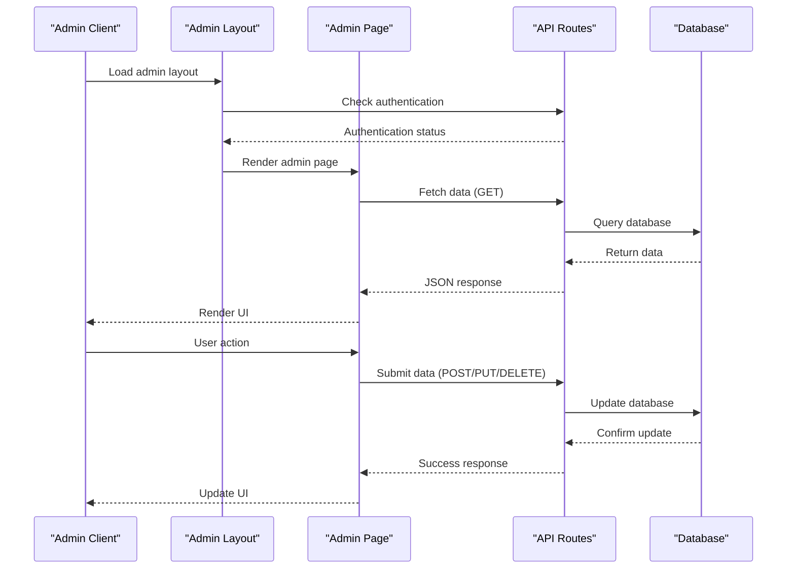
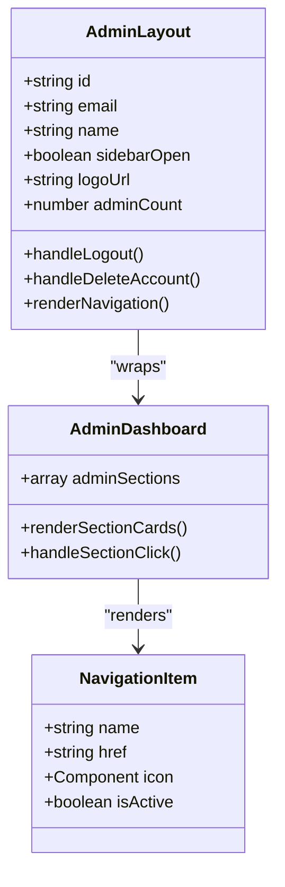
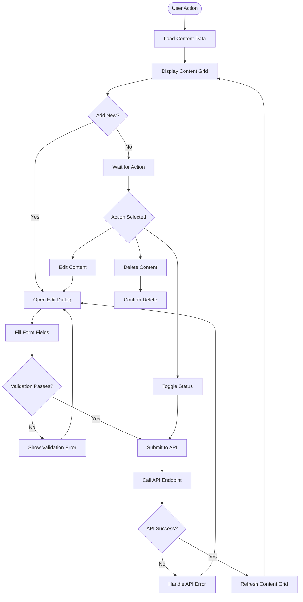
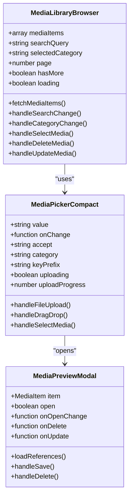
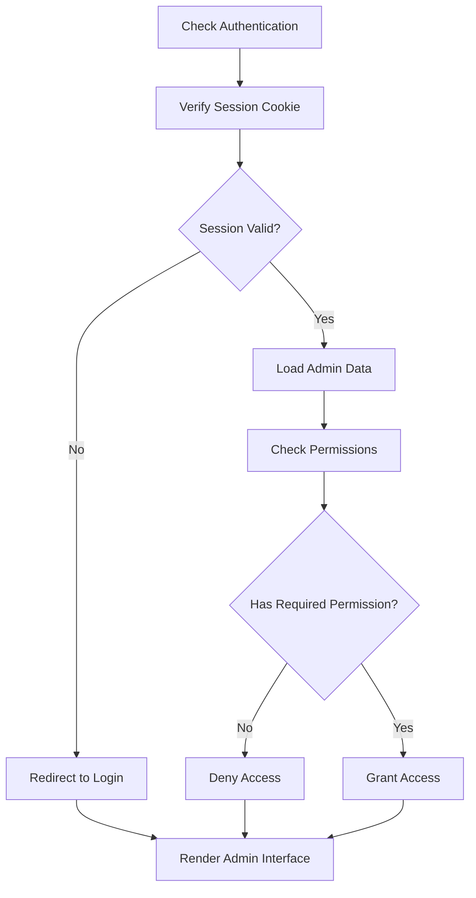
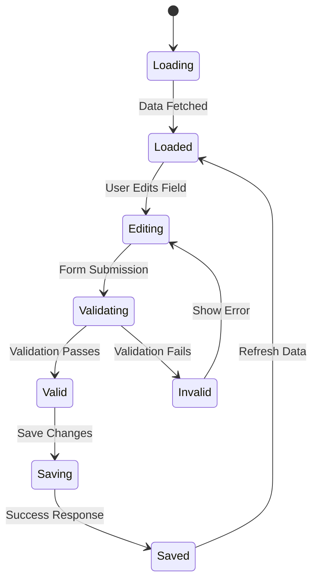
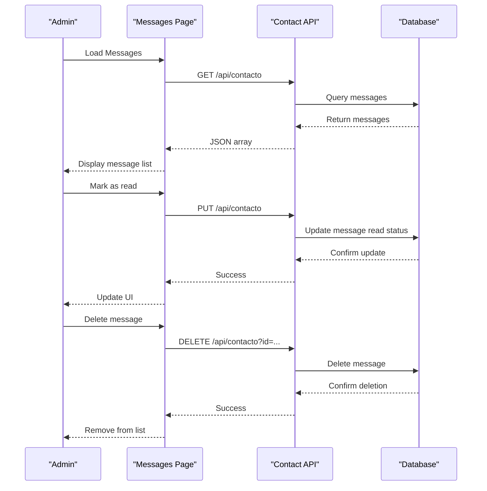
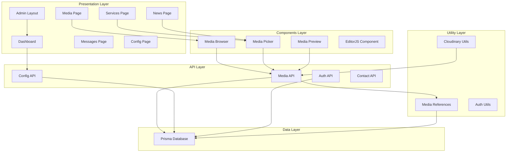

# Administrative Features

<cite>
**Referenced Files in This Document**
- [Admin Root Layout](file://src/app/admin/layout.tsx)
- [Admin Layout Component](file://src/components/admin-layout.tsx)
- [Admin Dashboard](file://src/app/admin/page.tsx)
- [Services Admin Page](file://src/app/admin/servicios/page.tsx)
- [News Admin Page](file://src/app/admin/noticias/page.tsx)
- [Messages Admin Page](file://src/app/admin/mensajes/page.tsx)
- [Configuration Admin Page](file://src/app/admin/configuracion/page.tsx)
- [Media Library Admin Page](file://src/app/admin/imagenes/page.tsx)
- [Admin Config API Route](file://src/app/api/admin/config/route.ts)
- [Admin Media API Route](file://src/app/api/admin/media/route.ts)
- [Media Library Browser Component](file://src/components/media-library-browser.tsx)
- [Media Picker Compact Component](file://src/components/media-picker-compact.tsx)
- [Media Preview Modal Component](file://src/components/media-preview-modal.tsx)
- [Media References Utility](file://src/lib/media-references.ts)
- [Cloudinary Utilities](file://src/lib/cloudinary.ts)
- [Authentication Utilities](file://src/lib/auth.ts)
- [Auth Check API Route](file://src/app/api/auth/check/route.ts)
- [Auth Setup API Route](file://src/app/api/auth/setup/route.ts)
</cite>

## Table of Contents
1. [Introduction](#introduction)
2. [Project Structure](#project-structure)
3. [Core Components](#core-components)
4. [Architecture Overview](#architecture-overview)
5. [Detailed Component Analysis](#detailed-component-analysis)
6. [Dependency Analysis](#dependency-analysis)
7. [Performance Considerations](#performance-considerations)
8. [Security Considerations](#security-considerations)
9. [Troubleshooting Guide](#troubleshooting-guide)
10. [Conclusion](#conclusion)

## Introduction
This document provides comprehensive documentation for the administrative features of GreenAxis, focusing on the admin dashboard design, content management workflows, media library capabilities, user management, configuration settings, and contact message management. It explains the administrative workflow, security considerations, and integration patterns between admin components, including implementation details for drag-and-drop reordering, bulk operations, and content validation mechanisms.

## Project Structure
The administrative interface follows a structured Next.js app directory approach with dedicated admin pages and shared components. The admin area is protected and requires authentication, with a centralized layout component managing navigation, branding, and user actions.

```mermaid
graph TB
subgraph "Admin Pages"
AdminDashboard["Admin Dashboard<br/>src/app/admin/page.tsx"]
ServicesPage["Services Management<br/>src/app/admin/servicios/page.tsx"]
NewsPage["News Management<br/>src/app/admin/noticias/page.tsx"]
MessagesPage["Contact Messages<br/>src/app/admin/mensajes/page.tsx"]
ConfigPage["Configuration<br/>src/app/admin/configuracion/page.tsx"]
MediaPage["Media Library<br/>src/app/admin/imagenes/page.tsx"]
end
subgraph "Shared Components"
AdminLayout["Admin Layout<br/>src/components/admin-layout.tsx"]
MediaPicker["Media Picker Compact<br/>src/components/media-picker-compact.tsx"]
MediaBrowser["Media Library Browser<br/>src/components/media-library-browser.tsx"]
MediaPreview["Media Preview Modal<br/>src/components/media-preview-modal.tsx"]
end
subgraph "API Routes"
ConfigAPI["Admin Config API<br/>src/app/api/admin/config/route.ts"]
MediaAPI["Admin Media API<br/>src/app/api/admin/media/route.ts"]
AuthCheck["Auth Check API<br/>src/app/api/auth/check/route.ts"]
AuthSetup["Auth Setup API<br/>src/app/api/auth/setup/route.ts"]
end
AdminLayout --> AdminDashboard
AdminLayout --> ServicesPage
AdminLayout --> NewsPage
AdminLayout --> MessagesPage
AdminLayout --> ConfigPage
AdminLayout --> MediaPage
ServicesPage --> MediaPicker
NewsPage --> MediaPicker
MediaPage --> MediaBrowser
AdminDashboard --> ConfigAPI
ServicesPage --> ConfigAPI
NewsPage --> ConfigAPI
MessagesPage --> ConfigAPI
MediaPage --> MediaAPI
AdminLayout --> AuthCheck
AdminLayout --> AuthSetup
```

**Diagram sources**
- [Admin Root Layout:1-18](file://src/app/admin/layout.tsx#L1-L18)
- [Admin Layout Component:61-384](file://src/components/admin-layout.tsx#L61-L384)
- [Admin Dashboard:84-120](file://src/app/admin/page.tsx#L84-L120)
- [Services Admin Page:91-627](file://src/app/admin/servicios/page.tsx#L91-L627)
- [News Admin Page:38-487](file://src/app/admin/noticias/page.tsx#L38-L487)
- [Messages Admin Page:31-299](file://src/app/admin/mensajes/page.tsx#L31-L299)
- [Configuration Admin Page:45-449](file://src/app/admin/configuracion/page.tsx#L45-L449)
- [Media Library Admin Page:54-578](file://src/app/admin/imagenes/page.tsx#L54-L578)
- [Admin Config API Route:12-120](file://src/app/api/admin/config/route.ts#L12-L120)
- [Admin Media API Route:37-150](file://src/app/api/admin/media/route.ts#L37-L150)
- [Auth Check API Route:4-21](file://src/app/api/auth/check/route.ts#L4-L21)
- [Auth Setup API Route:4-63](file://src/app/api/auth/setup/route.ts#L4-L63)

**Section sources**
- [Admin Root Layout:1-18](file://src/app/admin/layout.tsx#L1-L18)
- [Admin Layout Component:61-384](file://src/components/admin-layout.tsx#L61-L384)
- [Admin Dashboard:84-120](file://src/app/admin/page.tsx#L84-L120)

## Core Components
The administrative system consists of several key components working together to provide a cohesive management experience:

### Admin Layout and Navigation
The admin layout provides a responsive navigation system with:
- Persistent sidebar for desktop and collapsible sidebar for mobile
- Dynamic logo loading from configuration
- Admin account management with logout and account deletion
- Theme switching capability
- Active navigation highlighting

### Media Management System
A comprehensive media management solution supporting:
- Drag-and-drop file uploads with progress tracking
- Media library browsing with filtering and search
- External media URL registration
- Usage reference tracking across content
- Bulk operations for media management

### Content Management Interfaces
Specialized interfaces for managing different content types:
- Services management with rich content editing
- News/blog management with advanced editor
- Configuration management for platform-wide settings
- Contact message monitoring and response

**Section sources**
- [Admin Layout Component:61-384](file://src/components/admin-layout.tsx#L61-L384)
- [Media Library Admin Page:54-578](file://src/app/admin/imagenes/page.tsx#L54-L578)
- [Services Admin Page:91-627](file://src/app/admin/servicios/page.tsx#L91-L627)
- [News Admin Page:38-487](file://src/app/admin/noticias/page.tsx#L38-L487)

## Architecture Overview
The administrative architecture follows a client-server pattern with clear separation of concerns:

**Diagram sources**
- [Admin Root Layout:5-17](file://src/app/admin/layout.tsx#L5-L17)
- [Admin Layout Component:98-128](file://src/components/admin-layout.tsx#L98-L128)
- [Admin Config API Route:12-39](file://src/app/api/admin/config/route.ts#L12-L39)
- [Auth Check API Route:4-21](file://src/app/api/auth/check/route.ts#L4-L21)

The architecture ensures:
- Centralized authentication enforcement
- Consistent data validation and sanitization
- Efficient media handling with Cloudinary integration
- Comprehensive reference tracking for media assets

## Detailed Component Analysis

### Admin Dashboard Design and Layout
The admin dashboard serves as the central hub for accessing all administrative functions:

**Diagram sources**
- [Admin Layout Component:37-46](file://src/components/admin-layout.tsx#L37-L46)
- [Admin Dashboard:17-82](file://src/app/admin/page.tsx#L17-L82)

The dashboard features:
- Responsive grid layout for admin sections
- Color-coded section cards with descriptive icons
- External link support for additional resources
- Consistent styling with Tailwind CSS utilities

**Section sources**
- [Admin Dashboard:84-120](file://src/app/admin/page.tsx#L84-L120)
- [Admin Layout Component:48-59](file://src/components/admin-layout.tsx#L48-L59)

### Content Management System for Services and News
Both services and news management share similar patterns but serve different content types:

**Diagram sources**
- [Services Admin Page:117-176](file://src/app/admin/servicios/page.tsx#L117-L176)
- [News Admin Page:66-81](file://src/app/admin/noticias/page.tsx#L66-L81)

Key features include:
- Rich content editing with EditorJS
- Media integration through media picker components
- Bulk operations (activate/deactivate, feature/unfeature)
- Real-time validation and feedback
- Responsive design for all screen sizes

**Section sources**
- [Services Admin Page:91-627](file://src/app/admin/servicios/page.tsx#L91-L627)
- [News Admin Page:38-487](file://src/app/admin/noticias/page.tsx#L38-L487)

### Media Library Browser Implementation
The media library provides comprehensive file management capabilities:

**Diagram sources**
- [Media Library Browser Component:69-362](file://src/components/media-library-browser.tsx#L69-L362)
- [Media Picker Compact Component:94-691](file://src/components/media-picker-compact.tsx#L94-L691)
- [Media Preview Modal Component:97-516](file://src/components/media-preview-modal.tsx#L97-L516)

Advanced features include:
- Infinite scroll pagination with intersection observer
- Debounced search with 300ms delay
- Category-based filtering system
- Drag-and-drop upload with progress tracking
- Duplicate detection and resolution
- External media URL registration
- Usage reference tracking across content

**Section sources**
- [Media Library Browser Component:69-362](file://src/components/media-library-browser.tsx#L69-L362)
- [Media Picker Compact Component:94-691](file://src/components/media-picker-compact.tsx#L94-L691)
- [Media Preview Modal Component:97-516](file://src/components/media-preview-modal.tsx#L97-L516)

### User Management and Permission Systems
The authentication and authorization system provides robust security:

**Diagram sources**
- [Authentication Utilities:50-77](file://src/lib/auth.ts#L50-L77)
- [Auth Check API Route:4-21](file://src/app/api/auth/check/route.ts#L4-L21)
- [Admin Root Layout:10-14](file://src/app/admin/layout.tsx#L10-L14)

Security features include:
- Session-based authentication with expiration
- Password hashing using bcrypt
- Admin account limits and creation controls
- Protected route enforcement
- Secure cookie configuration

**Section sources**
- [Authentication Utilities:1-170](file://src/lib/auth.ts#L1-L170)
- [Auth Check API Route:1-21](file://src/app/api/auth/check/route.ts#L1-L21)
- [Auth Setup API Route:1-63](file://src/app/api/auth/setup/route.ts#L1-L63)

### Configuration Settings Interface
The configuration system manages platform-wide settings:

**Diagram sources**
- [Configuration Admin Page:45-95](file://src/app/admin/configuracion/page.tsx#L45-L95)
- [Admin Config API Route:41-119](file://src/app/api/admin/config/route.ts#L41-L119)

The configuration interface supports:
- Multi-tab organization (General, Contact, Social, WhatsApp, Footer, SEO)
- Real-time validation and feedback
- Media integration for logos and favicons
- SEO optimization settings
- Analytics integration

**Section sources**
- [Configuration Admin Page:45-449](file://src/app/admin/configuracion/page.tsx#L45-L449)
- [Admin Config API Route:12-120](file://src/app/api/admin/config/route.ts#L12-L120)

### Contact Message Management
The contact message management system provides comprehensive message handling:

**Diagram sources**
- [Messages Admin Page:31-88](file://src/app/admin/mensajes/page.tsx#L31-L88)
- [Admin Config API Route:12-39](file://src/app/api/admin/config/route.ts#L12-L39)

Features include:
- Real-time message status tracking
- Unread message indicators
- Bulk operations (mark as read, delete)
- Contact information display
- Consent tracking for data protection

**Section sources**
- [Messages Admin Page:31-299](file://src/app/admin/mensajes/page.tsx#L31-L299)

## Dependency Analysis
The administrative system exhibits well-structured dependencies with clear separation of concerns:

**Diagram sources**
- [Media References Utility:65-181](file://src/lib/media-references.ts#L65-L181)
- [Cloudinary Utilities:32-119](file://src/lib/cloudinary.ts#L32-L119)
- [Admin Media API Route:37-150](file://src/app/api/admin/media/route.ts#L37-L150)

Key dependency characteristics:
- **Low coupling**: Components communicate primarily through props and API calls
- **High cohesion**: Related functionality is grouped within specific modules
- **Clear boundaries**: Presentation, business logic, and data access layers are distinct
- **Testability**: Utilities and components can be tested independently

**Section sources**
- [Media References Utility:1-334](file://src/lib/media-references.ts#L1-L334)
- [Cloudinary Utilities:1-119](file://src/lib/cloudinary.ts#L1-L119)

## Performance Considerations
The administrative system implements several performance optimization strategies:

### Media Optimization
- **Lazy loading**: Images in media grids are loaded on demand
- **Cloudinary integration**: Automatic format and quality optimization
- **Responsive URLs**: Different optimizations for various screen sizes
- **Progressive enhancement**: Fallbacks for unsupported browsers

### Data Loading Strategies
- **Pagination**: API endpoints support configurable pagination
- **Infinite scroll**: Media library uses intersection observers for efficient loading
- **Debounced search**: 300ms delay prevents excessive API calls
- **Selective loading**: Media picker loads only recent items (4 items)

### Caching and Revalidation
- **Server-side caching**: Prisma queries utilize database-level caching
- **Client-side caching**: Component state manages loading states efficiently
- **Cache invalidation**: API responses trigger appropriate cache updates

### Bundle Optimization
- **Code splitting**: Route-based code splitting reduces initial bundle size
- **Dynamic imports**: Heavy components are imported on demand
- **Tree shaking**: Unused code is eliminated during build process

## Security Considerations
The administrative system implements comprehensive security measures:

### Authentication and Authorization
- **Session-based authentication**: Secure, HttpOnly cookies with expiration
- **Password hashing**: bcrypt with 12 rounds for password security
- **Rate limiting**: Protection against brute force attacks
- **CSRF protection**: SameSite cookies and secure headers

### Data Validation and Sanitization
- **Input validation**: Strict validation for all user inputs
- **Content sanitization**: EditorJS content is properly sanitized
- **File validation**: MIME type checking and size limits for uploads
- **SQL injection prevention**: Prisma ORM provides built-in protection

### Media Security
- **URL validation**: External media URLs are validated and sanitized
- **Access control**: Media operations require proper authentication
- **Reference tracking**: Prevents orphaned media references
- **Usage monitoring**: Tracks media usage across content

### Audit and Monitoring
- **Activity logging**: User actions are tracked for audit purposes
- **Error monitoring**: Comprehensive error handling and reporting
- **Security headers**: Proper HTTP security headers are configured
- **Secure defaults**: Production environment uses strict security settings

**Section sources**
- [Authentication Utilities:1-170](file://src/lib/auth.ts#L1-L170)
- [Media References Utility:1-334](file://src/lib/media-references.ts#L1-L334)

## Troubleshooting Guide
Common issues and their solutions:

### Authentication Issues
- **Problem**: Users redirected to login page
- **Solution**: Check session cookie validity and network connectivity
- **Prevention**: Implement proper error handling for authentication failures

### Media Upload Problems
- **Problem**: Uploads fail with "file too large" errors
- **Solution**: Verify file size limits and browser compatibility
- **Alternative**: Use Cloudinary Console for large file uploads

### API Communication Errors
- **Problem**: Network errors when fetching data
- **Solution**: Check network connectivity and API endpoint availability
- **Debugging**: Use browser developer tools to inspect API responses

### Performance Issues
- **Problem**: Slow page loading or media library performance
- **Solution**: Clear browser cache and check internet connection
- **Optimization**: Consider upgrading hosting plan for better performance

### Content Validation Errors
- **Problem**: Forms reject valid content
- **Solution**: Check required fields and format requirements
- **Guidance**: Review validation messages for specific requirements

**Section sources**
- [Media Picker Compact Component:175-290](file://src/components/media-picker-compact.tsx#L175-L290)
- [Media Library Browser Component:131-136](file://src/components/media-library-browser.tsx#L131-L136)

## Conclusion
The GreenAxis administrative system provides a comprehensive, secure, and user-friendly interface for managing website content. Its modular architecture, robust security measures, and performance optimizations create a solid foundation for content management operations. The system's emphasis on media handling, real-time validation, and comprehensive reference tracking demonstrates careful consideration of modern web application requirements.

The implementation showcases best practices in React development, Next.js routing, and database management while maintaining accessibility and performance standards. The administrative features are designed to be intuitive for content editors while providing the power and flexibility needed for complex content management scenarios.

Future enhancements could include additional automation features, expanded media formats, and enhanced collaboration capabilities for team-based content management workflows.