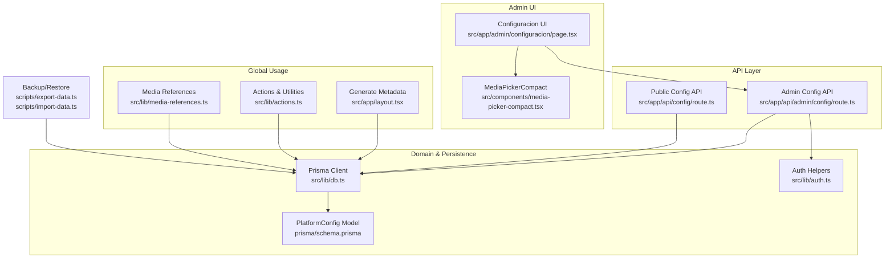
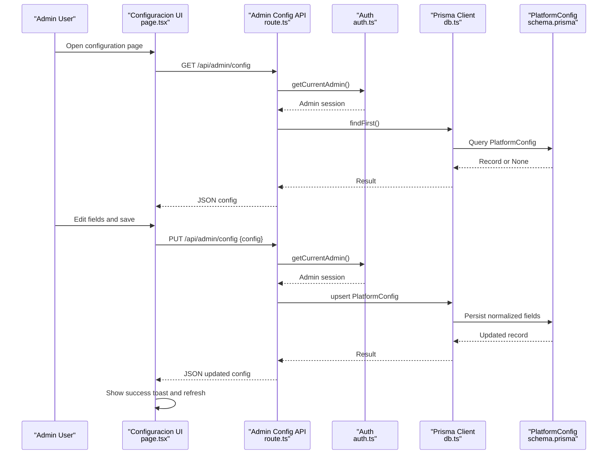
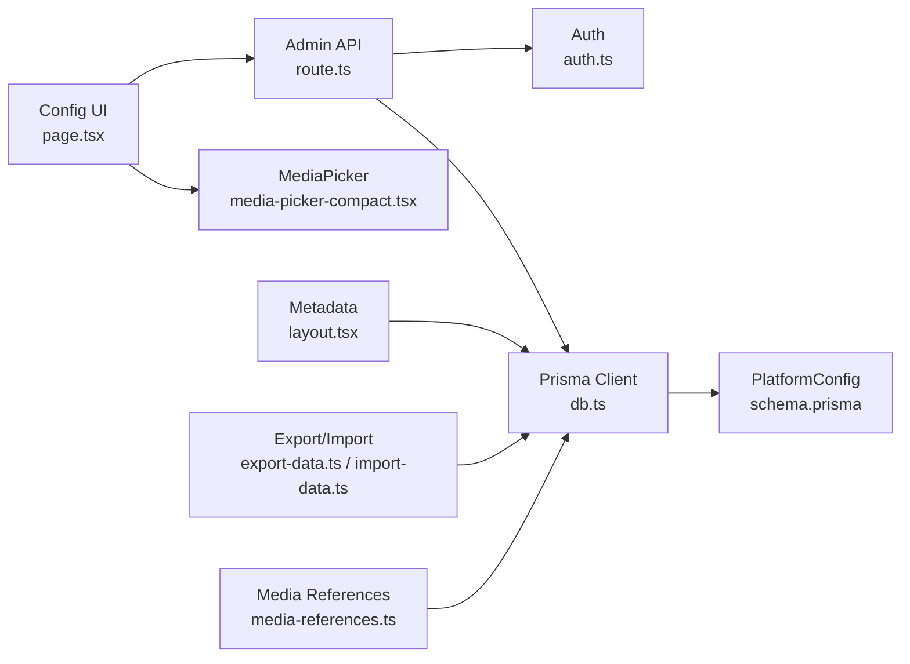

# Configuration & Settings

<cite>
**Referenced Files in This Document**
- [page.tsx](file://src/app/admin/configuracion/page.tsx)
- [route.ts](file://src/app/api/admin/config/route.ts)
- [route.ts](file://src/app/api/config/route.ts)
- [schema.prisma](file://prisma/schema.prisma)
- [db.ts](file://src/lib/db.ts)
- [auth.ts](file://src/lib/auth.ts)
- [layout.tsx](file://src/app/layout.tsx)
- [media-picker-compact.tsx](file://src/components/media-picker-compact.tsx)
- [export-data.ts](file://scripts/export-data.ts)
- [import-data.ts](file://scripts/import-data.ts)
- [actions.ts](file://src/lib/actions.ts)
- [media-references.ts](file://src/lib/media-references.ts)
</cite>

## Table of Contents
1. [Introduction](#introduction)
2. [Project Structure](#project-structure)
3. [Core Components](#core-components)
4. [Architecture Overview](#architecture-overview)
5. [Detailed Component Analysis](#detailed-component-analysis)
6. [Dependency Analysis](#dependency-analysis)
7. [Performance Considerations](#performance-considerations)
8. [Troubleshooting Guide](#troubleshooting-guide)
9. [Conclusion](#conclusion)
10. [Appendices](#appendices)

## Introduction
This document explains the configuration and settings management system for GreenAxis. It covers the platform configuration interface, the configuration API endpoints, data validation and persistence, global settings management, configuration backup and restore, and how the configuration integrates with database models and the user interface for updates.

## Project Structure
The configuration system spans UI, API routes, database models, and utility scripts:
- Admin UI for editing configuration: [page.tsx](file://src/app/admin/configuracion/page.tsx)
- Admin API endpoints for reading/updating configuration: [route.ts](file://src/app/api/admin/config/route.ts)
- Public API endpoint for reading configuration: [route.ts](file://src/app/api/config/route.ts)
- Database model definition: [schema.prisma](file://prisma/schema.prisma)
- Database client initialization: [db.ts](file://src/lib/db.ts)
- Authentication helpers: [auth.ts](file://src/lib/auth.ts)
- Global metadata generation using configuration: [layout.tsx](file://src/app/layout.tsx)
- Media picker used in configuration UI: [media-picker-compact.tsx](file://src/components/media-picker-compact.tsx)
- Backup and restore scripts: [export-data.ts](file://scripts/export-data.ts), [import-data.ts](file://scripts/import-data.ts)
- Utility actions and media reference utilities: [actions.ts](file://src/lib/actions.ts), [media-references.ts](file://src/lib/media-references.ts)

**Diagram sources**
- [page.tsx:1-449](file://src/app/admin/configuracion/page.tsx#L1-L449)
- [route.ts:1-120](file://src/app/api/admin/config/route.ts#L1-L120)
- [route.ts:1-60](file://src/app/api/config/route.ts#L1-L60)
- [schema.prisma:16-78](file://prisma/schema.prisma#L16-L78)
- [db.ts:1-21](file://src/lib/db.ts#L1-L21)
- [auth.ts:1-170](file://src/lib/auth.ts#L1-L170)
- [layout.tsx:1-80](file://src/app/layout.tsx#L1-L80)
- [media-picker-compact.tsx:1-691](file://src/components/media-picker-compact.tsx#L1-L691)
- [export-data.ts:1-62](file://scripts/export-data.ts#L1-L62)
- [import-data.ts:1-82](file://scripts/import-data.ts#L1-L82)
- [actions.ts:1-136](file://src/lib/actions.ts#L1-L136)
- [media-references.ts:1-334](file://src/lib/media-references.ts#L1-L334)

**Section sources**
- [page.tsx:1-449](file://src/app/admin/configuracion/page.tsx#L1-L449)
- [route.ts:1-120](file://src/app/api/admin/config/route.ts#L1-L120)
- [route.ts:1-60](file://src/app/api/config/route.ts#L1-L60)
- [schema.prisma:16-78](file://prisma/schema.prisma#L16-L78)
- [db.ts:1-21](file://src/lib/db.ts#L1-L21)
- [auth.ts:1-170](file://src/lib/auth.ts#L1-L170)
- [layout.tsx:1-80](file://src/app/layout.tsx#L1-L80)
- [media-picker-compact.tsx:1-691](file://src/components/media-picker-compact.tsx#L1-L691)
- [export-data.ts:1-62](file://scripts/export-data.ts#L1-L62)
- [import-data.ts:1-82](file://scripts/import-data.ts#L1-L82)
- [actions.ts:1-136](file://src/lib/actions.ts#L1-L136)
- [media-references.ts:1-334](file://src/lib/media-references.ts#L1-L334)

## Core Components
- Platform configuration model: Defines all configuration fields persisted in the database, including branding, contact info, social links, SEO, and UI preferences.
- Admin configuration UI: A tabbed interface allowing administrators to edit site-wide settings and pick media assets via the media picker.
- Admin API: Handles GET and PUT requests for configuration with admin authentication and data normalization.
- Public configuration API: Provides read-only access to configuration for public pages.
- Global metadata generation: Uses configuration to build dynamic site metadata.
- Backup and restore: Export/import scripts capture configuration along with other domain data.

**Section sources**
- [schema.prisma:16-78](file://prisma/schema.prisma#L16-L78)
- [page.tsx:15-43](file://src/app/admin/configuracion/page.tsx#L15-L43)
- [route.ts:12-119](file://src/app/api/admin/config/route.ts#L12-L119)
- [route.ts:7-59](file://src/app/api/config/route.ts#L7-L59)
- [layout.tsx:20-54](file://src/app/layout.tsx#L20-L54)
- [export-data.ts:28-38](file://scripts/export-data.ts#L28-L38)
- [import-data.ts:18-23](file://scripts/import-data.ts#L18-L23)

## Architecture Overview
The configuration system follows a layered architecture:
- UI layer: React client-side component renders the configuration form and handles user interactions.
- API layer: Next.js route handlers manage admin-only configuration reads and writes.
- Domain and persistence layer: Prisma model defines the schema; database client connects to either local SQLite or remote Turso via LibSQL.
- Global usage layer: Configuration is consumed by metadata generation and other parts of the application.

**Diagram sources**
- [page.tsx:54-91](file://src/app/admin/configuracion/page.tsx#L54-L91)
- [route.ts:12-119](file://src/app/api/admin/config/route.ts#L12-L119)
- [auth.ts:156-169](file://src/lib/auth.ts#L156-L169)
- [db.ts:1-21](file://src/lib/db.ts#L1-L21)
- [schema.prisma:16-78](file://prisma/schema.prisma#L16-L78)

## Detailed Component Analysis

### Platform Configuration Model
The PlatformConfig model defines all configuration fields persisted in the database. It includes:
- Basic site info: siteName, siteUrl, siteSlogan, siteDescription, logoUrl, faviconUrl
- Contact info: companyName, companyAddress, companyPhone, companyEmail, notificationEmail
- Social media: facebookUrl, instagramUrl, twitterUrl, linkedinUrl, tiktokUrl, youtubeUrl
- Footer: footerText, socialText
- WhatsApp: whatsappNumber, whatsappMessage, whatsappShowBubble
- About section: aboutImageUrl, aboutTitle, aboutDescription, aboutYearsExperience, aboutYearsText, aboutStats, aboutFeatures, aboutSectionEnabled, aboutBadge, aboutBadgeColor
- Map section: showMapSection
- SEO and analytics: metaKeywords, googleAnalytics, googleMapsEmbed
- Theming: primaryColor

Default values are defined at the model level for robust initial states.

**Section sources**
- [schema.prisma:16-78](file://prisma/schema.prisma#L16-L78)

### Admin Configuration UI
The configuration page is a client-side React component that:
- Loads configuration via GET /api/admin/config
- Presents grouped settings in tabs: General, Contact, Social, WhatsApp, Footer, SEO
- Supports media selection via MediaPickerCompact for logo, favicon, and about image
- Saves changes via PUT /api/admin/config with optimistic updates and toast feedback

Field updates are handled by a generic updateConfig handler that modifies the local state and persists on save.

**Section sources**
- [page.tsx:45-449](file://src/app/admin/configuracion/page.tsx#L45-L449)
- [media-picker-compact.tsx:94-106](file://src/components/media-picker-compact.tsx#L94-L106)

### Admin Configuration API
The admin API enforces authentication and performs:
- GET: Returns the single PlatformConfig record, creating defaults if none exists
- PUT: Normalizes incoming data (empty string to null), merges with defaults, upserts the record, and revalidates the root layout cache

It uses getCurrentAdmin for authorization and revalidatePath to invalidate cached metadata after updates.

**Section sources**
- [route.ts:12-119](file://src/app/api/admin/config/route.ts#L12-L119)
- [auth.ts:156-169](file://src/lib/auth.ts#L156-L169)

### Public Configuration API
The public API provides read-only access to configuration for rendering public pages. It returns the PlatformConfig record, creating defaults if needed.

**Section sources**
- [route.ts:7-59](file://src/app/api/config/route.ts#L7-L59)

### Global Settings Management and Metadata
Configuration is used to generate dynamic metadata for the site, including title, description, and icons. This ensures branding and SEO metadata reflect the latest configuration.

**Section sources**
- [layout.tsx:20-54](file://src/app/layout.tsx#L20-L54)

### Data Validation and Persistence
Validation and normalization occur in the admin API:
- emptyToNull helper converts empty strings to null for optional fields
- Defaults are applied for required fields during creation
- Upsert pattern ensures a single configuration record exists
- Database client supports both local SQLite and remote Turso via LibSQL adapter

**Section sources**
- [route.ts:6-10](file://src/app/api/admin/config/route.ts#L6-L10)
- [route.ts:95-109](file://src/app/api/admin/config/route.ts#L95-L109)
- [db.ts:1-21](file://src/lib/db.ts#L1-L21)

### Configuration Backup and Restore
Backup and restore are implemented via scripts that export and import domain data including PlatformConfig:
- Export script collects PlatformConfig and other domain collections, writing a JSON file timestamped with the export time
- Import script loads the exported data and inserts it into the target database using createMany with skipDuplicates

These scripts support both local SQLite and Turso environments.

**Section sources**
- [export-data.ts:24-59](file://scripts/export-data.ts#L24-L59)
- [import-data.ts:12-73](file://scripts/import-data.ts#L12-L73)

### Settings Inheritance Patterns
Settings are centralized in the PlatformConfig model. There is no explicit inheritance between multiple configuration records; instead:
- A single configuration record is maintained
- Defaults are enforced at the model and API levels
- Public pages consume the configuration directly without additional inheritance logic

**Section sources**
- [schema.prisma:16-78](file://prisma/schema.prisma#L16-L78)
- [route.ts:19-32](file://src/app/api/admin/config/route.ts#L19-L32)
- [route.ts:8-21](file://src/app/api/config/route.ts#L8-L21)

### Integration with Database Models and Media References
- The PlatformConfig model is the source of truth for all configuration fields
- Media references scanning and updates are supported across multiple tables, including PlatformConfig, enabling safe deletion/replacement of media assets
- MediaPickerCompact integrates with the media library and upload pipeline to populate configuration fields

**Section sources**
- [schema.prisma:16-78](file://prisma/schema.prisma#L16-L78)
- [media-references.ts:65-181](file://src/lib/media-references.ts#L65-L181)
- [media-references.ts:190-333](file://src/lib/media-references.ts#L190-L333)
- [media-picker-compact.tsx:132-170](file://src/components/media-picker-compact.tsx#L132-L170)

## Dependency Analysis
The configuration system exhibits clear separation of concerns:
- UI depends on API endpoints and the MediaPicker component
- API depends on authentication helpers and the database client
- Database client depends on Prisma and the adapter configuration
- Global usage (metadata generation) depends on the database client and model
- Backup/restore scripts depend on Prisma and environment variables

**Diagram sources**
- [page.tsx:1-449](file://src/app/admin/configuracion/page.tsx#L1-L449)
- [route.ts:1-120](file://src/app/api/admin/config/route.ts#L1-L120)
- [auth.ts:1-170](file://src/lib/auth.ts#L1-L170)
- [db.ts:1-21](file://src/lib/db.ts#L1-L21)
- [schema.prisma:16-78](file://prisma/schema.prisma#L16-L78)
- [layout.tsx:1-80](file://src/app/layout.tsx#L1-L80)
- [media-picker-compact.tsx:1-691](file://src/components/media-picker-compact.tsx#L1-L691)
- [export-data.ts:1-62](file://scripts/export-data.ts#L1-L62)
- [import-data.ts:1-82](file://scripts/import-data.ts#L1-L82)
- [media-references.ts:1-334](file://src/lib/media-references.ts#L1-L334)

**Section sources**
- [page.tsx:1-449](file://src/app/admin/configuracion/page.tsx#L1-L449)
- [route.ts:1-120](file://src/app/api/admin/config/route.ts#L1-L120)
- [auth.ts:1-170](file://src/lib/auth.ts#L1-L170)
- [db.ts:1-21](file://src/lib/db.ts#L1-L21)
- [schema.prisma:16-78](file://prisma/schema.prisma#L16-L78)
- [layout.tsx:1-80](file://src/app/layout.tsx#L1-L80)
- [media-picker-compact.tsx:1-691](file://src/components/media-picker-compact.tsx#L1-L691)
- [export-data.ts:1-62](file://scripts/export-data.ts#L1-L62)
- [import-data.ts:1-82](file://scripts/import-data.ts#L1-L82)
- [media-references.ts:1-334](file://src/lib/media-references.ts#L1-L334)

## Performance Considerations
- The admin UI fetches configuration once on mount and updates synchronously on save, minimizing network overhead
- The public API uses force-dynamic to avoid caching sensitive configuration data
- MediaPickerCompact optimizes library loading by retrieving only a small subset of recent items
- Database operations leverage Prisma’s efficient upsert pattern and default values to reduce branching logic

[No sources needed since this section provides general guidance]

## Troubleshooting Guide
Common issues and resolutions:
- Unauthorized access to admin endpoints: Ensure admin session is present and valid; verify getCurrentAdmin returns an admin user
- Empty string vs null fields: The admin API normalizes empty strings to null; confirm UI sends appropriate values
- Missing configuration record: APIs create defaults if none exists; check database connectivity and environment variables
- Cache not updating after changes: The admin API revalidates the root layout; verify revalidatePath is invoked and Next.js cache is cleared
- Backup/restore failures: Confirm environment variables for Turso are set correctly and the export file exists

**Section sources**
- [auth.ts:156-169](file://src/lib/auth.ts#L156-L169)
- [route.ts:6-10](file://src/app/api/admin/config/route.ts#L6-L10)
- [route.ts:19-32](file://src/app/api/admin/config/route.ts#L19-L32)
- [route.ts:111-112](file://src/app/api/admin/config/route.ts#L111-L112)
- [export-data.ts:9-22](file://scripts/export-data.ts#L9-L22)
- [import-data.ts:5-10](file://scripts/import-data.ts#L5-L10)

## Conclusion
GreenAxis centralizes platform configuration in a single, strongly typed model with robust defaults and normalization. The admin UI provides a comprehensive interface for managing branding, contact info, social links, SEO, and UI preferences, while the API enforces authentication and persistence. Global metadata generation and backup/restore scripts further integrate configuration into the platform lifecycle.

[No sources needed since this section summarizes without analyzing specific files]

## Appendices

### API Endpoints Summary
- GET /api/admin/config
  - Purpose: Retrieve the single PlatformConfig record; creates defaults if missing
  - Authentication: Admin required
  - Response: PlatformConfig object
- PUT /api/admin/config
  - Purpose: Update PlatformConfig; normalizes empty strings to null; upserts record; revalidates root layout
  - Authentication: Admin required
  - Body: Partial PlatformConfig fields
  - Response: Updated PlatformConfig object
- GET /api/config
  - Purpose: Public read access to PlatformConfig; creates defaults if missing
  - Response: PlatformConfig object

**Section sources**
- [route.ts:12-119](file://src/app/api/admin/config/route.ts#L12-L119)
- [route.ts:7-59](file://src/app/api/config/route.ts#L7-L59)

### Configuration Fields Overview
- Basic site info: siteName, siteUrl, siteSlogan, siteDescription, logoUrl, faviconUrl
- Contact info: companyName, companyAddress, companyPhone, companyEmail, notificationEmail
- Social media: facebookUrl, instagramUrl, twitterUrl, linkedinUrl, tiktokUrl, youtubeUrl
- Footer: footerText, socialText
- WhatsApp: whatsappNumber, whatsappMessage, whatsappShowBubble
- About section: aboutImageUrl, aboutTitle, aboutDescription, aboutYearsExperience, aboutYearsText, aboutStats, aboutFeatures, aboutSectionEnabled, aboutBadge, aboutBadgeColor
- Map section: showMapSection
- SEO and analytics: metaKeywords, googleAnalytics, googleMapsEmbed
- Theming: primaryColor

**Section sources**
- [schema.prisma:16-78](file://prisma/schema.prisma#L16-L78)