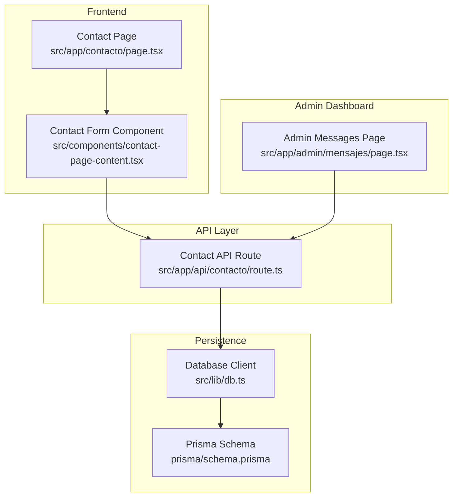
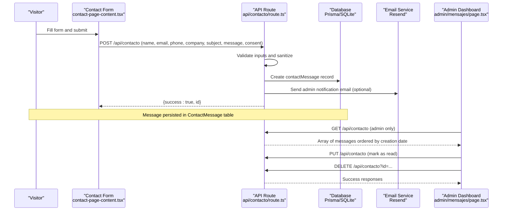
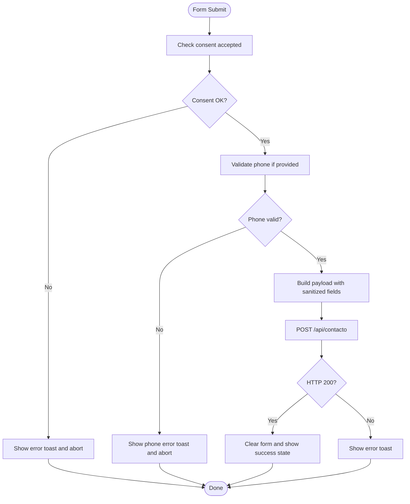
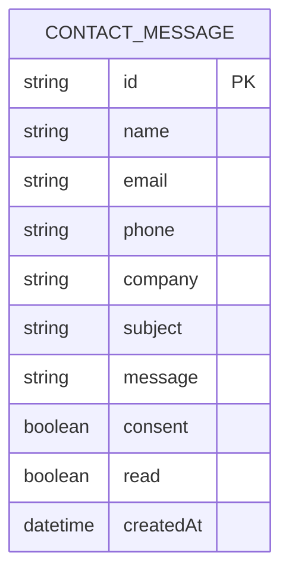
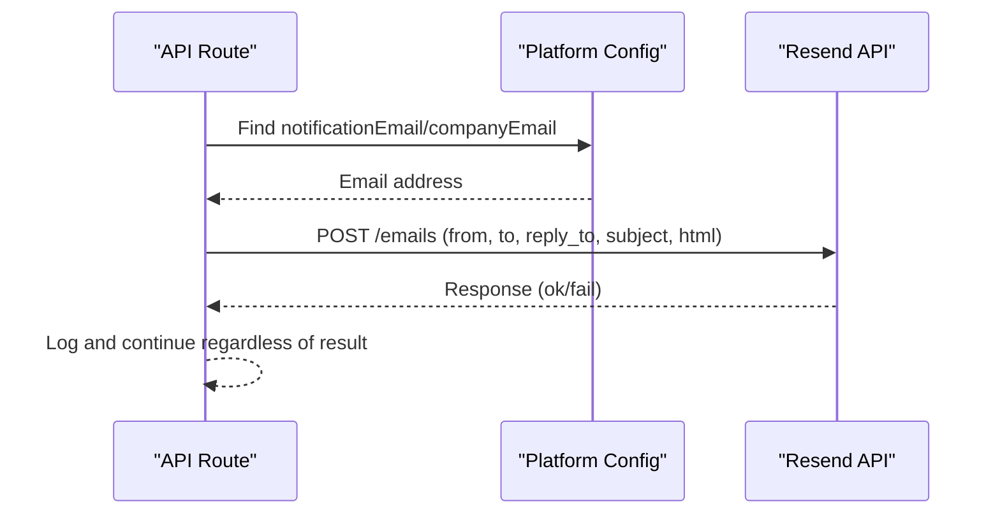
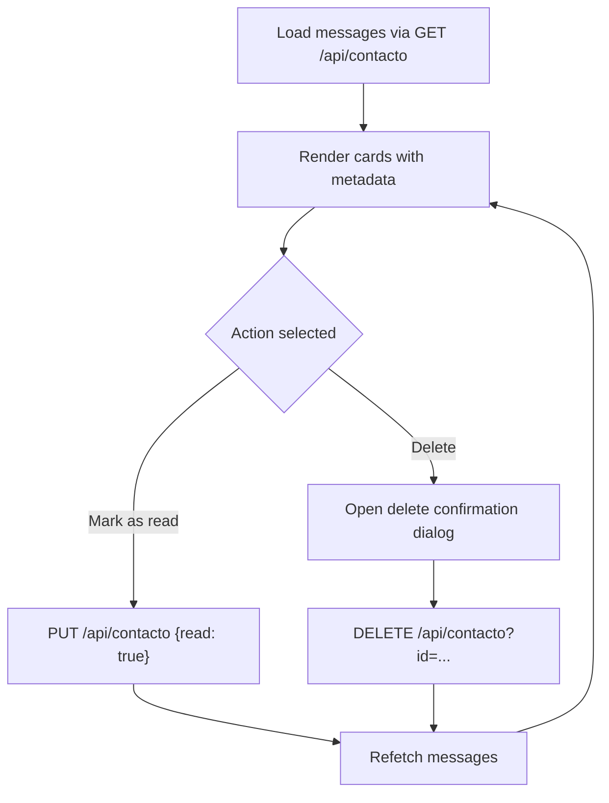
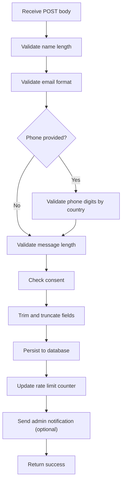
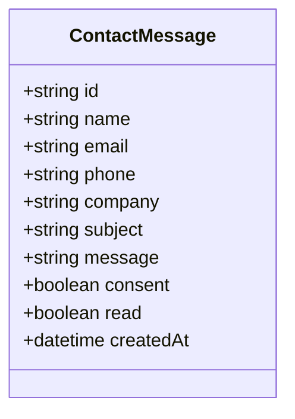
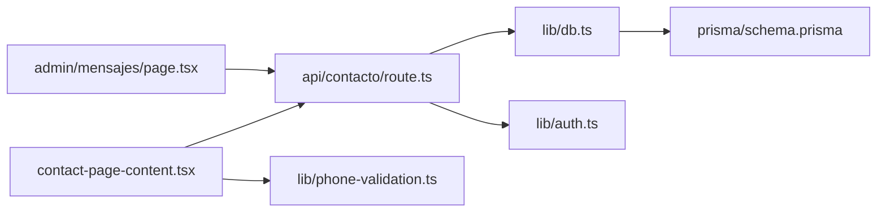

# Contact Messages Management

<cite>
**Referenced Files in This Document**
- [page.tsx](file://src/app/admin/mensajes/page.tsx)
- [route.ts](file://src/app/api/contacto/route.ts)
- [contact-page-content.tsx](file://src/components/contact-page-content.tsx)
- [schema.prisma](file://prisma/schema.prisma)
- [db.ts](file://src/lib/db.ts)
- [page.tsx](file://src/app/contacto/page.tsx)
- [phone-validation.ts](file://src/lib/phone-validation.ts)
- [auth.ts](file://src/lib/auth.ts)
- [actions.ts](file://src/lib/actions.ts)
</cite>

## Table of Contents
1. [Introduction](#introduction)
2. [Project Structure](#project-structure)
3. [Core Components](#core-components)
4. [Architecture Overview](#architecture-overview)
5. [Detailed Component Analysis](#detailed-component-analysis)
6. [Dependency Analysis](#dependency-analysis)
7. [Performance Considerations](#performance-considerations)
8. [Troubleshooting Guide](#troubleshooting-guide)
9. [Conclusion](#conclusion)

## Introduction
This document describes the contact messages management system, covering the contact form integration, message persistence, notification workflows, administrative viewing and management, and the underlying data model. It explains how visitor-submitted messages are validated, stored, and surfaced to administrators, along with the email notification mechanism and basic rate limiting safeguards.

## Project Structure
The contact messages system spans three main areas:
- Frontend contact page with form and submission handling
- API endpoints for CRUD operations and notifications
- Administrative dashboard for viewing, marking as read, and deleting messages

**Diagram sources**
- [page.tsx:1-20](file://src/app/contacto/page.tsx#L1-L20)
- [contact-page-content.tsx:1-414](file://src/components/contact-page-content.tsx#L1-L414)
- [route.ts:1-302](file://src/app/api/contacto/route.ts#L1-L302)
- [schema.prisma:172-185](file://prisma/schema.prisma#L172-L185)
- [db.ts:1-21](file://src/lib/db.ts#L1-L21)
- [page.tsx:1-299](file://src/app/admin/mensajes/page.tsx#L1-L299)

**Section sources**
- [page.tsx:1-20](file://src/app/contacto/page.tsx#L1-L20)
- [contact-page-content.tsx:1-414](file://src/components/contact-page-content.tsx#L1-L414)
- [route.ts:1-302](file://src/app/api/contacto/route.ts#L1-L302)
- [schema.prisma:172-185](file://prisma/schema.prisma#L172-L185)
- [db.ts:1-21](file://src/lib/db.ts#L1-L21)
- [page.tsx:1-299](file://src/app/admin/mensajes/page.tsx#L1-L299)

## Core Components
- Contact form component handles user input, client-side validation, submission, and success feedback.
- API route validates inputs, persists messages, enforces rate limits, and sends admin notifications via email.
- Prisma schema defines the ContactMessage model with fields for name, email, phone, company, subject, message, consent, read status, and timestamps.
- Admin page lists messages, supports marking as read, deletion, and displays metadata like creation date and consent.

Key responsibilities:
- Input sanitization and validation
- Persistence to SQLite via Prisma
- Notification delivery to configured admin email
- Rate limiting to prevent abuse
- Admin-only access controls for listing, updating, and deleting

**Section sources**
- [contact-page-content.tsx:73-147](file://src/components/contact-page-content.tsx#L73-L147)
- [route.ts:137-229](file://src/app/api/contacto/route.ts#L137-L229)
- [schema.prisma:172-185](file://prisma/schema.prisma#L172-L185)
- [page.tsx:31-88](file://src/app/admin/mensajes/page.tsx#L31-L88)

## Architecture Overview
The system follows a clean separation of concerns:
- Client-side form posts to the contact API endpoint
- API validates inputs, stores the message, and optionally emails an admin notification
- Admin dashboard fetches messages via authenticated endpoints and performs read/update/delete operations

**Diagram sources**
- [contact-page-content.tsx:73-147](file://src/components/contact-page-content.tsx#L73-L147)
- [route.ts:137-229](file://src/app/api/contacto/route.ts#L137-L229)
- [schema.prisma:172-185](file://prisma/schema.prisma#L172-L185)
- [page.tsx:37-88](file://src/app/admin/mensajes/page.tsx#L37-L88)

## Detailed Component Analysis

### Contact Form Integration
The contact form captures:
- Personal information: name, email, optional phone and company
- Optional subject and message
- Consent acceptance for data processing
- Country code selection for phone validation

Submission flow:
- Validates consent and phone format (if present)
- Sends a POST request to the contact API
- On success, clears the form and shows a success state
- Uses toast notifications for errors

**Diagram sources**
- [contact-page-content.tsx:73-147](file://src/components/contact-page-content.tsx#L73-L147)
- [phone-validation.ts:48-112](file://src/lib/phone-validation.ts#L48-L112)

**Section sources**
- [contact-page-content.tsx:26-147](file://src/components/contact-page-content.tsx#L26-L147)
- [phone-validation.ts:48-112](file://src/lib/phone-validation.ts#L48-L112)

### Message Persistence and Data Model
The ContactMessage model stores:
- Identity: id (UUID)
- Personal: name, email, phone (optional), company (optional)
- Content: subject (optional), message
- Compliance: consent (Boolean)
- Status: read (Boolean, default false)
- Timestamps: createdAt

Persistence:
- Created via Prisma client in the API route
- Ordered newest-first when retrieved
- Admin-only access for listing, updating, and deleting

**Diagram sources**
- [schema.prisma:172-185](file://prisma/schema.prisma#L172-L185)

**Section sources**
- [schema.prisma:172-185](file://prisma/schema.prisma#L172-L185)
- [route.ts:200-206](file://src/app/api/contacto/route.ts#L200-L206)
- [route.ts:238-243](file://src/app/api/contacto/route.ts#L238-L243)

### Notification System
When a message is saved, the system attempts to notify the configured admin email address:
- Retrieves notification email from platform configuration
- Sends an HTML email via Resend API with a styled template
- Includes sender details, subject, and message content
- Reply-To is set to the visitor's email

**Diagram sources**
- [route.ts:215-222](file://src/app/api/contacto/route.ts#L215-L222)
- [route.ts:36-130](file://src/app/api/contacto/route.ts#L36-L130)

**Section sources**
- [route.ts:6-14](file://src/app/api/contacto/route.ts#L6-L14)
- [route.ts:215-222](file://src/app/api/contacto/route.ts#L215-L222)
- [route.ts:36-130](file://src/app/api/contacto/route.ts#L36-L130)

### Administrative Management Interface
The admin page provides:
- Loading state and empty state
- List of messages with sender info, subject, message preview, consent, and creation date
- Unread indicator and count summary
- Actions: mark as read, delete with confirmation dialog
- Uses toast notifications for feedback

**Diagram sources**
- [page.tsx:37-88](file://src/app/admin/mensajes/page.tsx#L37-L88)
- [route.ts:250-275](file://src/app/api/contacto/route.ts#L250-L275)
- [route.ts:277-301](file://src/app/api/contacto/route.ts#L277-L301)

**Section sources**
- [page.tsx:31-299](file://src/app/admin/mensajes/page.tsx#L31-L299)
- [route.ts:231-248](file://src/app/api/contacto/route.ts#L231-L248)
- [route.ts:250-275](file://src/app/api/contacto/route.ts#L250-L275)
- [route.ts:277-301](file://src/app/api/contacto/route.ts#L277-L301)

### Validation, Sanitization, and Rate Limiting
Input validation and sanitization:
- Name: required, minimum length
- Email: required and valid format
- Phone: optional but validated against country-specific rules
- Message: required, minimum length
- Consent: required
- Sanitization trims and truncates fields to safe lengths

Rate limiting:
- In-memory tracking per IP
- Maximum requests threshold within a lockout window
- Returns a user-friendly message when exceeded

**Diagram sources**
- [route.ts:166-188](file://src/app/api/contacto/route.ts#L166-L188)
- [route.ts:190-198](file://src/app/api/contacto/route.ts#L190-L198)
- [route.ts:132-160](file://src/app/api/contacto/route.ts#L132-L160)
- [route.ts:208-213](file://src/app/api/contacto/route.ts#L208-L213)

**Section sources**
- [route.ts:11-19](file://src/app/api/contacto/route.ts#L11-L19)
- [route.ts:166-188](file://src/app/api/contacto/route.ts#L166-L188)
- [route.ts:132-160](file://src/app/api/contacto/route.ts#L132-L160)

### Class Model: ContactMessage

**Diagram sources**
- [schema.prisma:172-185](file://prisma/schema.prisma#L172-L185)

**Section sources**
- [schema.prisma:172-185](file://prisma/schema.prisma#L172-L185)

## Dependency Analysis
- The contact form depends on the API route for submission and on phone validation utilities for client-side checks.
- The API route depends on Prisma for persistence and on the database client configuration.
- The admin page depends on the API route for listing, updating, and deleting messages.
- Authentication utilities support admin-only access for sensitive operations.

**Diagram sources**
- [contact-page-content.tsx:1-414](file://src/components/contact-page-content.tsx#L1-L414)
- [route.ts:1-302](file://src/app/api/contacto/route.ts#L1-L302)
- [db.ts:1-21](file://src/lib/db.ts#L1-L21)
- [schema.prisma:1-277](file://prisma/schema.prisma#L1-L277)
- [page.tsx:1-299](file://src/app/admin/mensajes/page.tsx#L1-L299)
- [phone-validation.ts:1-113](file://src/lib/phone-validation.ts#L1-L113)
- [auth.ts:1-170](file://src/lib/auth.ts#L1-L170)

**Section sources**
- [contact-page-content.tsx:1-414](file://src/components/contact-page-content.tsx#L1-L414)
- [route.ts:1-302](file://src/app/api/contacto/route.ts#L1-L302)
- [db.ts:1-21](file://src/lib/db.ts#L1-L21)
- [schema.prisma:1-277](file://prisma/schema.prisma#L1-L277)
- [page.tsx:1-299](file://src/app/admin/mensajes/page.tsx#L1-L299)
- [phone-validation.ts:1-113](file://src/lib/phone-validation.ts#L1-L113)
- [auth.ts:1-170](file://src/lib/auth.ts#L1-L170)

## Performance Considerations
- Rate limiting is in-memory and does not persist across processes; consider a distributed store for production scale.
- Database queries are straightforward; ordering by creation date is efficient with proper indexing.
- Email delivery is asynchronous and does not block the API response.
- Client-side rendering of message lists is acceptable for moderate volumes; pagination could be considered for very large datasets.

## Troubleshooting Guide
Common issues and resolutions:
- Submission errors: Check validation messages and ensure consent is accepted and phone format matches the selected country code.
- Database errors: Verify Prisma client initialization and database connectivity.
- Email failures: Confirm Resend API key and from address are configured; review network connectivity and rate limits.
- Admin access denied: Ensure admin session is established and verified before accessing admin endpoints.
- Rate limit exceeded: Wait for the lockout period to expire or reduce submission frequency.

**Section sources**
- [contact-page-content.tsx:73-147](file://src/components/contact-page-content.tsx#L73-L147)
- [route.ts:137-229](file://src/app/api/contacto/route.ts#L137-L229)
- [route.ts:231-301](file://src/app/api/contacto/route.ts#L231-L301)
- [auth.ts:155-169](file://src/lib/auth.ts#L155-L169)

## Conclusion
The contact messages management system provides a robust pipeline from form submission to admin oversight. It emphasizes input validation, sanitization, and compliance with consent requirements, while offering a streamlined admin interface for managing messages. The integration with an email service ensures timely notifications, and built-in rate limiting helps protect the system from abuse. For production deployments, consider enhancing rate limiting storage, adding pagination for large message volumes, and implementing administrative response workflows if future requirements demand outbound replies.