# About Us Page Management

<cite>
**Referenced Files in This Document**
- [schema.prisma](file://prisma/schema.prisma)
- [route.ts](file://src/app/api/about/route.ts)
- [route.ts](file://src/app/api/admin/config/route.ts)
- [page.tsx](file://src/app/admin/quienes-somos/page.tsx)
- [page.tsx](file://src/app/admin/seccion-about/page.tsx)
- [page.tsx](file://src/app/quienes-somos/page.tsx)
- [about-page-content.tsx](file://src/components/about-page-content.tsx)
- [about-section.tsx](file://src/components/about-section.tsx)
- [media-picker-compact.tsx](file://src/components/media-picker-compact.tsx)
- [public-layout.tsx](file://src/components/public-layout.tsx)
- [actions.ts](file://src/lib/actions.ts)
- [db.ts](file://src/lib/db.ts)
- [auth.ts](file://src/lib/auth.ts)
</cite>

## Table of Contents
1. [Introduction](#introduction)
2. [Project Structure](#project-structure)
3. [Core Components](#core-components)
4. [Architecture Overview](#architecture-overview)
5. [Detailed Component Analysis](#detailed-component-analysis)
6. [Dependency Analysis](#dependency-analysis)
7. [Performance Considerations](#performance-considerations)
8. [Troubleshooting Guide](#troubleshooting-guide)
9. [Conclusion](#conclusion)

## Introduction
This document describes the About Us page management system, which provides a dual-interface approach for managing company information across two distinct contexts: the main About Us page (/quienes-somos) and the dedicated About section within the public landing page. The system supports rich content editing for company information, mission statements, vision statements, core values, team introductions, statistics, and location information. It integrates seamlessly with the public display while maintaining strict administrative controls and content validation.

## Project Structure
The About Us system spans several key areas:
- Database schema defining both the main AboutPage model and PlatformConfig model
- API routes for fetching/updating About content and platform-wide configuration
- Admin pages for managing About content and About section settings
- Public presentation components rendering the About content on the public website
- Media picker component enabling image selection and upload with duplicate detection
- Authentication and caching mechanisms ensuring secure, efficient content delivery

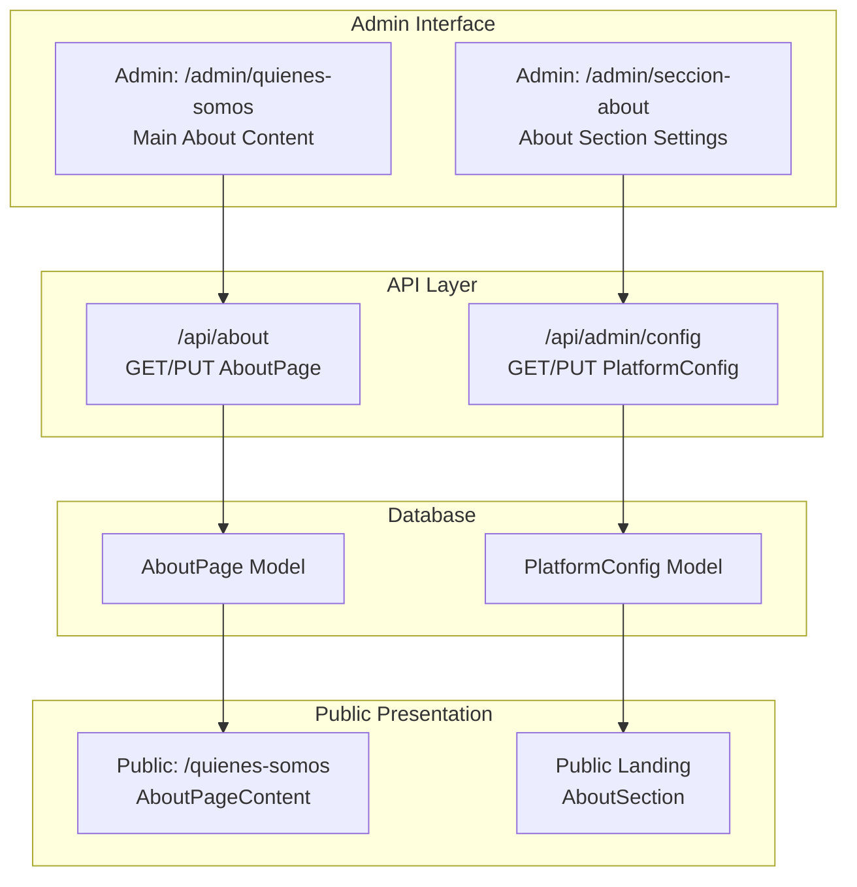

**Diagram sources**
- [route.ts:1-148](file://src/app/api/about/route.ts#L1-L148)
- [route.ts:1-120](file://src/app/api/admin/config/route.ts#L1-L120)
- [schema.prisma:224-276](file://prisma/schema.prisma#L224-L276)
- [page.tsx:1-536](file://src/app/admin/quienes-somos/page.tsx#L1-L536)
- [page.tsx:1-447](file://src/app/admin/seccion-about/page.tsx#L1-L447)
- [page.tsx:1-39](file://src/app/quienes-somos/page.tsx#L1-L39)
- [about-page-content.tsx:1-385](file://src/components/about-page-content.tsx#L1-L385)
- [about-section.tsx:1-169](file://src/components/about-section.tsx#L1-L169)

**Section sources**
- [schema.prisma:1-277](file://prisma/schema.prisma#L1-L277)
- [route.ts:1-148](file://src/app/api/about/route.ts#L1-L148)
- [route.ts:1-120](file://src/app/api/admin/config/route.ts#L1-L120)
- [page.tsx:1-536](file://src/app/admin/quienes-somos/page.tsx#L1-L536)
- [page.tsx:1-447](file://src/app/admin/seccion-about/page.tsx#L1-L447)
- [page.tsx:1-39](file://src/app/quienes-somos/page.tsx#L1-L39)
- [about-page-content.tsx:1-385](file://src/components/about-page-content.tsx#L1-L385)
- [about-section.tsx:1-169](file://src/components/about-section.tsx#L1-L169)

## Core Components
The system comprises two complementary management interfaces:

### Main About Content Management
The primary interface manages the complete About Us page content, including hero section, history, mission/vision, values, statistics, team, certifications, location, and call-to-action. It supports:
- Rich content editing for long-form text
- Structured lists for values, statistics, and "why choose us" items
- Team member management with photos and biographies
- Toggle controls for optional sections
- Media integration via the compact media picker

### About Section Management
The secondary interface controls the About section displayed on the public landing page, including:
- Main title, description, and image
- Experience badge configuration
- Feature highlights and statistics
- Location visibility toggle
- Integration with platform-wide contact information

Both interfaces serialize structured content as JSON strings stored in dedicated database fields, enabling flexible content composition while maintaining strong typing in the admin UI.

**Section sources**
- [page.tsx:15-68](file://src/app/admin/quienes-somos/page.tsx#L15-L68)
- [page.tsx:15-28](file://src/app/admin/seccion-about/page.tsx#L15-L28)
- [schema.prisma:224-276](file://prisma/schema.prisma#L224-L276)

## Architecture Overview
The system follows a layered architecture with clear separation between administration, API, persistence, and presentation:

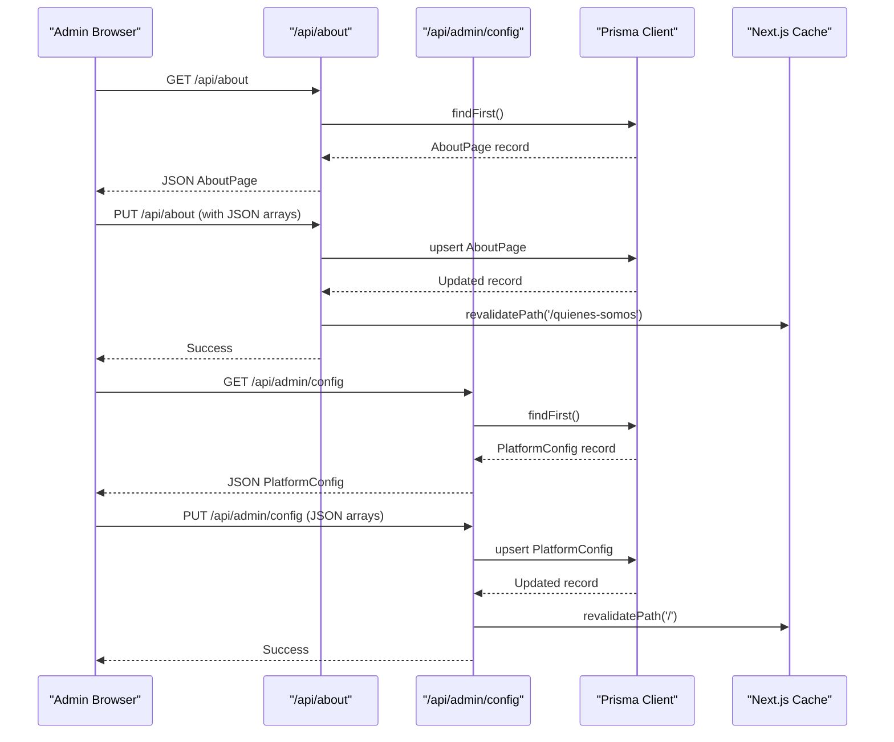

**Diagram sources**
- [route.ts:6-59](file://src/app/api/about/route.ts#L6-L59)
- [route.ts:61-147](file://src/app/api/about/route.ts#L61-L147)
- [route.ts:12-39](file://src/app/api/admin/config/route.ts#L12-L39)
- [route.ts:41-119](file://src/app/api/admin/config/route.ts#L41-L119)

**Section sources**
- [route.ts:1-148](file://src/app/api/about/route.ts#L1-L148)
- [route.ts:1-120](file://src/app/api/admin/config/route.ts#L1-L120)
- [db.ts:1-21](file://src/lib/db.ts#L1-L21)

## Detailed Component Analysis

### Database Schema and Models
The system defines two primary models that support the dual-management approach:

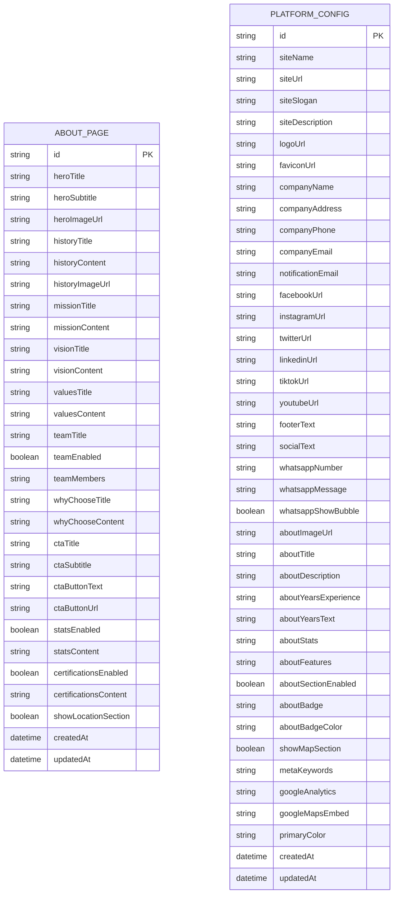

**Diagram sources**
- [schema.prisma:224-276](file://prisma/schema.prisma#L224-L276)
- [schema.prisma:16-78](file://prisma/schema.prisma#L16-L78)

**Section sources**
- [schema.prisma:224-276](file://prisma/schema.prisma#L224-L276)

### API Endpoints

#### About Content API
The `/api/about` endpoint provides complete CRUD operations for the main About Us page content:

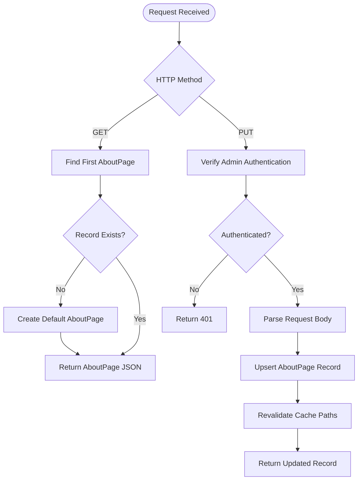

**Diagram sources**
- [route.ts:6-59](file://src/app/api/about/route.ts#L6-L59)
- [route.ts:61-147](file://src/app/api/about/route.ts#L61-L147)
- [auth.ts:155-169](file://src/lib/auth.ts#L155-L169)

#### Platform Configuration API
The `/api/admin/config` endpoint manages the About section settings for the public landing page:

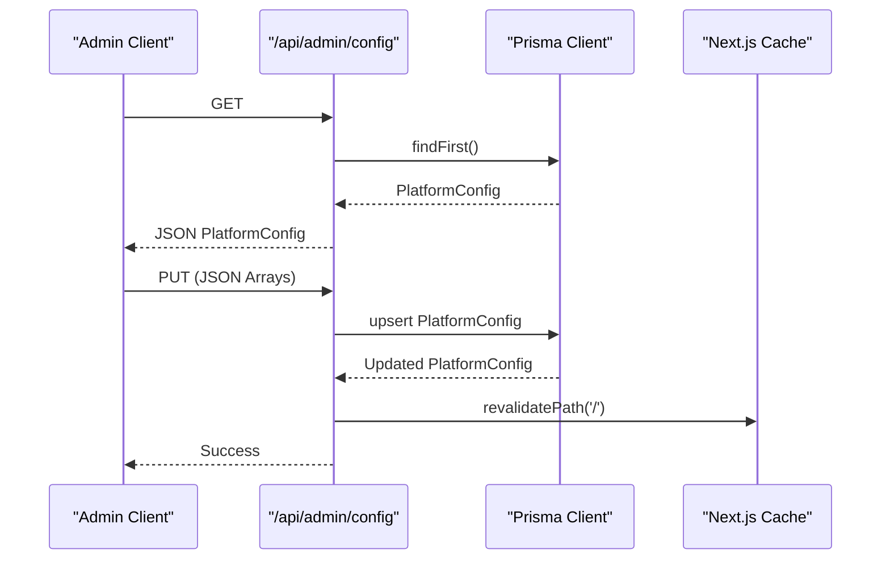

**Diagram sources**
- [route.ts:12-39](file://src/app/api/admin/config/route.ts#L12-L39)
- [route.ts:41-119](file://src/app/api/admin/config/route.ts#L41-L119)

**Section sources**
- [route.ts:1-148](file://src/app/api/about/route.ts#L1-L148)
- [route.ts:1-120](file://src/app/api/admin/config/route.ts#L1-L120)

### Admin Interfaces

#### Main About Content Editor
The main admin interface (/admin/quienes-somos) provides comprehensive editing capabilities:

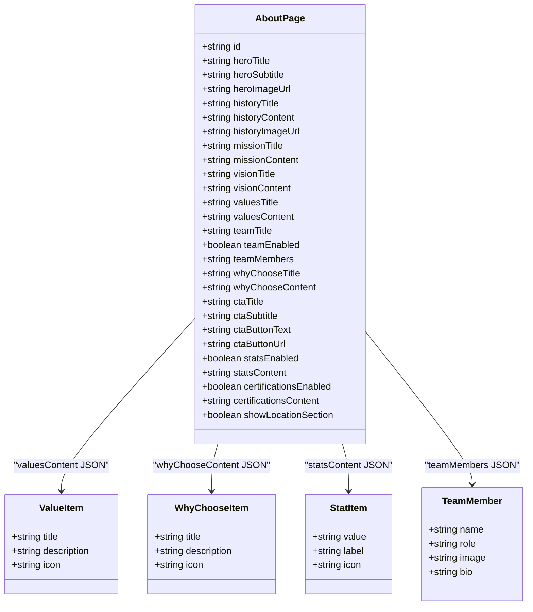

**Diagram sources**
- [page.tsx:15-68](file://src/app/admin/quienes-somos/page.tsx#L15-L68)

The interface organizes content into logical tabs covering hero, history, mission/vision, values, statistics, "why choose us", team, location, and call-to-action sections. Each tab supports:
- Text inputs for titles and descriptions
- Rich text areas for long-form content
- Media picker integration for images
- Toggle switches for optional sections
- Structured list editors for repeatable content

#### About Section Editor
The secondary admin interface (/admin/seccion-about) focuses on the About section for the public landing page:

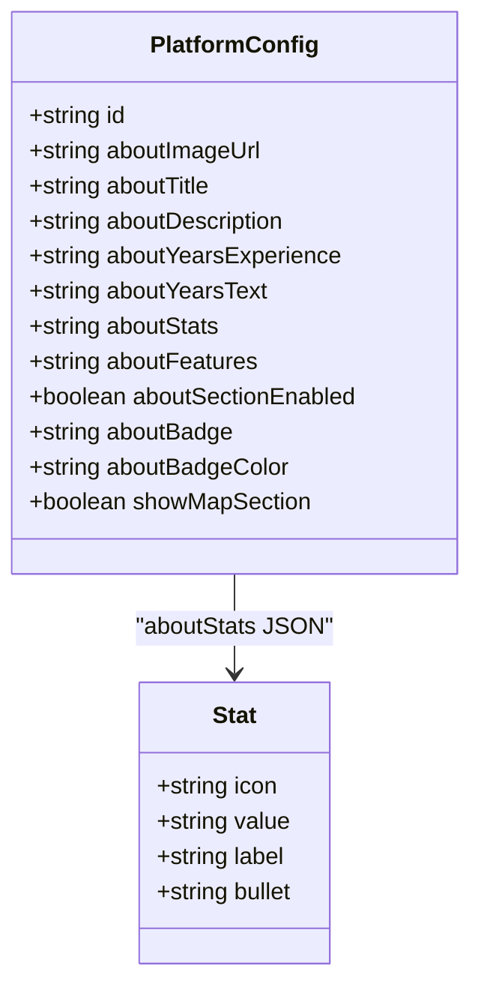

**Diagram sources**
- [page.tsx:15-35](file://src/app/admin/seccion-about/page.tsx#L15-L35)

**Section sources**
- [page.tsx:1-536](file://src/app/admin/quienes-somos/page.tsx#L1-L536)
- [page.tsx:1-447](file://src/app/admin/seccion-about/page.tsx#L1-L447)

### Public Presentation Components

#### About Page Content Renderer
The public presentation component renders the complete About Us page:

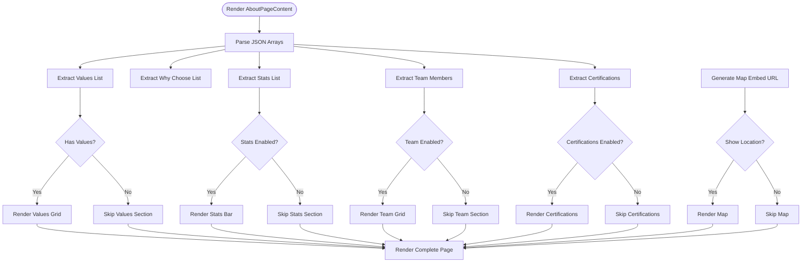

**Diagram sources**
- [about-page-content.tsx:58-99](file://src/components/about-page-content.tsx#L58-L99)

#### About Section Renderer
The landing page About section renderer integrates with platform configuration:

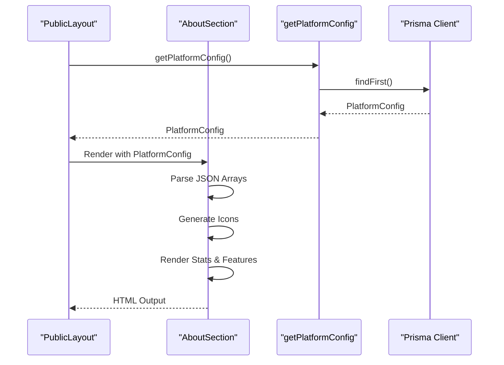

**Diagram sources**
- [about-section.tsx:32-81](file://src/components/about-section.tsx#L32-L81)
- [public-layout.tsx:10-21](file://src/components/public-layout.tsx#L10-L21)
- [actions.ts:6-22](file://src/lib/actions.ts#L6-L22)

**Section sources**
- [about-page-content.tsx:1-385](file://src/components/about-page-content.tsx#L1-L385)
- [about-section.tsx:1-169](file://src/components/about-section.tsx#L1-L169)
- [public-layout.tsx:1-55](file://src/components/public-layout.tsx#L1-L55)

### Media Integration
The system uses a compact media picker component that supports:
- Drag-and-drop file uploads
- Duplicate detection with suggestion system
- Category-based filtering
- Size validation and progress tracking
- Integration with Cloudinary URLs

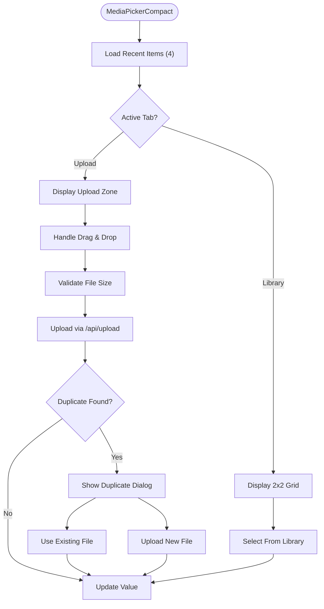

**Diagram sources**
- [media-picker-compact.tsx:122-170](file://src/components/media-picker-compact.tsx#L122-L170)
- [media-picker-compact.tsx:175-290](file://src/components/media-picker-compact.tsx#L175-L290)
- [media-picker-compact.tsx:307-357](file://src/components/media-picker-compact.tsx#L307-L357)

**Section sources**
- [media-picker-compact.tsx:1-691](file://src/components/media-picker-compact.tsx#L1-L691)

### Content Serialization and Validation
Content is serialized using JSON strings stored in database fields. The system implements robust validation patterns:

- **JSON Parsing**: All content arrays are parsed safely with try/catch fallbacks
- **Default Values**: Missing or invalid JSON falls back to sensible defaults
- **Type Safety**: Frontend TypeScript interfaces enforce structure during editing
- **Database Constraints**: Prisma models define field types and defaults
- **Admin Authentication**: All updates require verified admin sessions

**Section sources**
- [about-page-content.tsx:66-84](file://src/components/about-page-content.tsx#L66-L84)
- [page.tsx:104-115](file://src/app/admin/quienes-somos/page.tsx#L104-L115)
- [page.tsx:62-100](file://src/app/admin/seccion-about/page.tsx#L62-L100)

## Dependency Analysis
The system exhibits clean separation of concerns with minimal coupling:

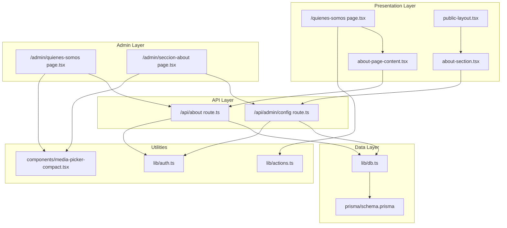

**Diagram sources**
- [page.tsx:1-39](file://src/app/quienes-somos/page.tsx#L1-L39)
- [about-page-content.tsx:1-385](file://src/components/about-page-content.tsx#L1-L385)
- [about-section.tsx:1-169](file://src/components/about-section.tsx#L1-L169)
- [page.tsx:1-536](file://src/app/admin/quienes-somos/page.tsx#L1-L536)
- [page.tsx:1-447](file://src/app/admin/seccion-about/page.tsx#L1-L447)
- [route.ts:1-148](file://src/app/api/about/route.ts#L1-L148)
- [route.ts:1-120](file://src/app/api/admin/config/route.ts#L1-L120)
- [db.ts:1-21](file://src/lib/db.ts#L1-L21)
- [auth.ts:1-170](file://src/lib/auth.ts#L1-L170)
- [actions.ts:1-136](file://src/lib/actions.ts#L1-L136)

**Section sources**
- [schema.prisma:1-277](file://prisma/schema.prisma#L1-L277)
- [route.ts:1-148](file://src/app/api/about/route.ts#L1-L148)
- [route.ts:1-120](file://src/app/api/admin/config/route.ts#L1-L120)

## Performance Considerations
The system implements several performance optimizations:

- **Database Efficiency**: Single query per page load with selective field retrieval
- **Media Loading**: Compact media picker loads only 4 recent items for performance
- **Caching**: Automatic cache revalidation on content updates
- **Lazy Loading**: Map iframe uses lazy loading attributes
- **Image Optimization**: Next.js Image component with responsive sizing
- **JSON Parsing**: Efficient parsing with fallbacks to minimize errors

## Troubleshooting Guide

### Common Issues and Solutions

#### Authentication Problems
- **Symptom**: 401 Unauthorized when accessing admin endpoints
- **Cause**: Expired or missing admin session
- **Solution**: Re-authenticate through the admin portal

#### Content Not Updating
- **Symptom**: Changes not reflected on public pages
- **Cause**: Cache not invalidated
- **Solution**: Wait for automatic cache revalidation or manually refresh

#### JSON Parsing Errors
- **Symptom**: Missing or corrupted content sections
- **Cause**: Malformed JSON in database fields
- **Solution**: Use admin interface to re-enter content; system automatically falls back to defaults

#### Media Upload Failures
- **Symptom**: Upload errors or duplicate warnings
- **Cause**: File size limits or duplicates detected
- **Solution**: Use suggested existing files or adjust file size

**Section sources**
- [auth.ts:50-71](file://src/lib/auth.ts#L50-L71)
- [route.ts:138-140](file://src/app/api/about/route.ts#L138-L140)
- [media-picker-compact.tsx:177-187](file://src/components/media-picker-compact.tsx#L177-L187)
- [about-page-content.tsx:66-84](file://src/components/about-page-content.tsx#L66-L84)

## Conclusion
The About Us page management system provides a robust, dual-interface solution for content management across both the main About Us page and the public landing page About section. Its architecture balances flexibility with security, offering administrators comprehensive editing capabilities while ensuring reliable public presentation. The system's JSON-based serialization approach enables rich content composition, while the media integration and caching mechanisms provide excellent performance characteristics. The clear separation between admin, API, and presentation layers ensures maintainability and scalability for future enhancements.