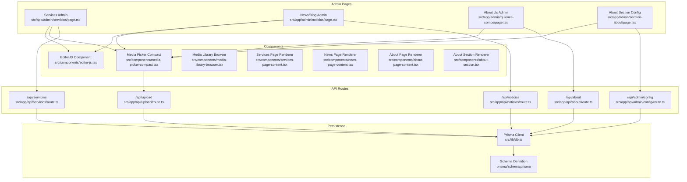
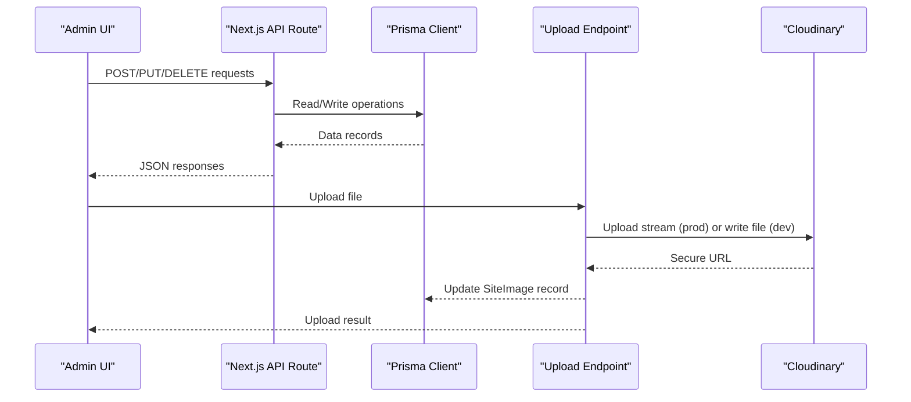
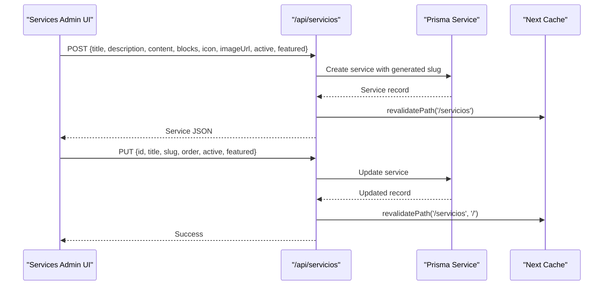
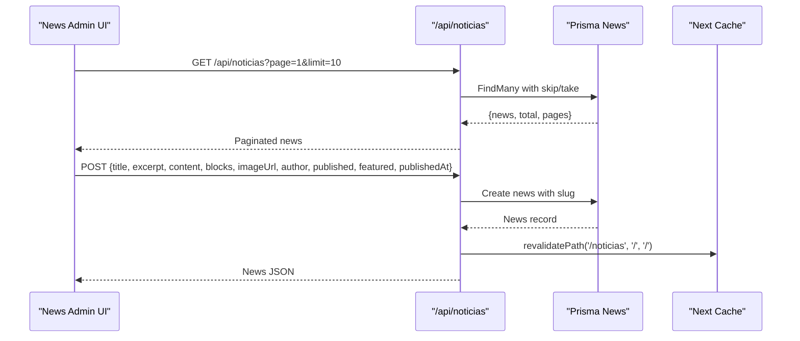
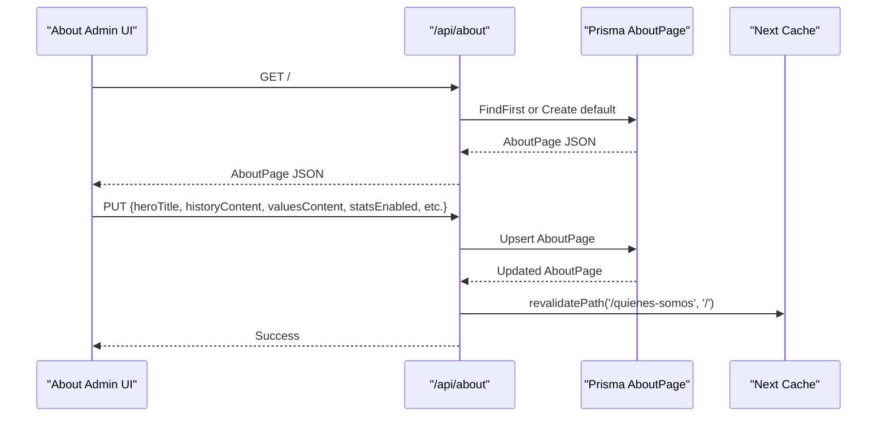
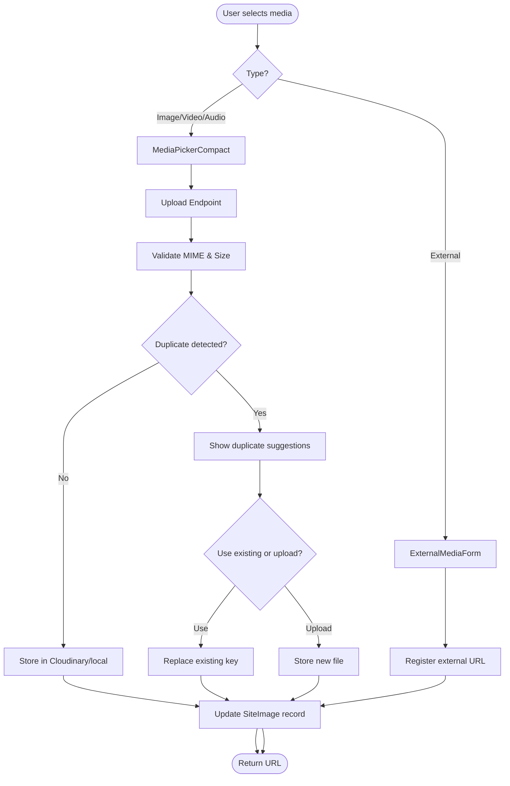
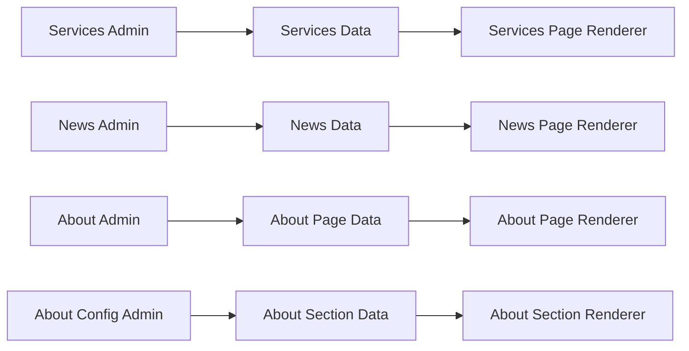
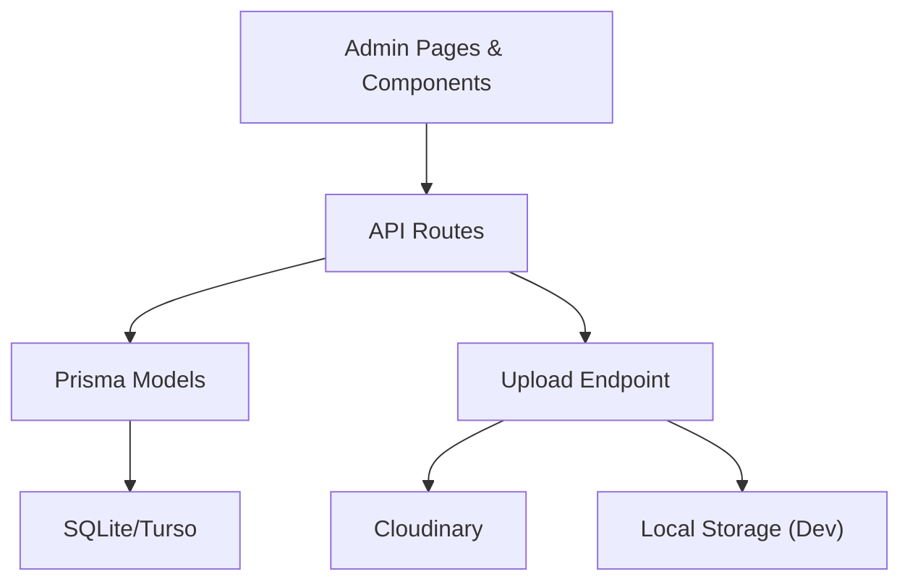

# Content Management System

<cite>
**Referenced Files in This Document**
- [servicios/page.tsx](file://src/app/admin/servicios/page.tsx)
- [noticias/page.tsx](file://src/app/admin/noticias/page.tsx)
- [quienes-somos/page.tsx](file://src/app/admin/quienes-somos/page.tsx)
- [seccion-about/page.tsx](file://src/app/admin/seccion-about/page.tsx)
- [services-page-content.tsx](file://src/components/services-page-content.tsx)
- [news-page-content.tsx](file://src/components/news-page-content.tsx)
- [about-page-content.tsx](file://src/components/about-page-content.tsx)
- [about-section.tsx](file://src/components/about-section.tsx)
- [editor-js.tsx](file://src/components/editor-js.tsx)
- [media-picker-compact.tsx](file://src/components/media-picker-compact.tsx)
- [media-library-browser.tsx](file://src/components/media-library-browser.tsx)
- [servicios/route.ts](file://src/app/api/servicios/route.ts)
- [noticias/route.ts](file://src/app/api/noticias/route.ts)
- [about/route.ts](file://src/app/api/about/route.ts)
- [admin/config/route.ts](file://src/app/api/admin/config/route.ts)
- [upload/route.ts](file://src/app/api/upload/route.ts)
- [db.ts](file://src/lib/db.ts)
- [schema.prisma](file://prisma/schema.prisma)
</cite>

## Table of Contents
1. [Introduction](#introduction)
2. [Project Structure](#project-structure)
3. [Core Components](#core-components)
4. [Architecture Overview](#architecture-overview)
5. [Detailed Component Analysis](#detailed-component-analysis)
6. [Dependency Analysis](#dependency-analysis)
7. [Performance Considerations](#performance-considerations)
8. [Troubleshooting Guide](#troubleshooting-guide)
9. [Conclusion](#conclusion)

## Introduction
This document describes the content management system within GreenAxis, focusing on three primary areas: services management, news/blog management, and the "About Us" page management. It covers CRUD operations, rich text editing capabilities, publishing workflows, content organization, drag-and-drop reordering, content validation, and persistence mechanisms. The system leverages Next.js App Router APIs, Prisma ORM with a SQLite/Turso backend, and a custom media management pipeline integrated with Cloudinary.

## Project Structure
The CMS is organized around three main administrative pages:
- Services management: CRUD for services with rich text content, ordering, and toggles for active/featured states.
- News/blog management: Rich text editing, publishing workflow, pagination, and media integration.
- About Us management: Comprehensive page builder with sections for hero, history, mission/vision, values, statistics, team, location, and CTA.

UI components include:
- Editor.js integration for rich content editing with extensive tool support.
- Media picker components for selecting and uploading images, videos, and audio.
- Public-facing content renderers for services, news, and about pages.

**Diagram sources**
- [servicios/page.tsx:1-627](file://src/app/admin/servicios/page.tsx#L1-L627)
- [noticias/page.tsx:1-487](file://src/app/admin/noticias/page.tsx#L1-L487)
- [quienes-somos/page.tsx:1-536](file://src/app/admin/quienes-somos/page.tsx#L1-L536)
- [seccion-about/page.tsx:1-447](file://src/app/admin/seccion-about/page.tsx#L1-L447)
- [editor-js.tsx:1-850](file://src/components/editor-js.tsx#L1-L850)
- [media-picker-compact.tsx:1-691](file://src/components/media-picker-compact.tsx#L1-L691)
- [media-library-browser.tsx:1-362](file://src/components/media-library-browser.tsx#L1-L362)
- [services-page-content.tsx:1-358](file://src/components/services-page-content.tsx#L1-L358)
- [news-page-content.tsx:1-185](file://src/components/news-page-content.tsx#L1-L185)
- [about-page-content.tsx:1-385](file://src/components/about-page-content.tsx#L1-L385)
- [about-section.tsx:1-169](file://src/components/about-section.tsx#L1-L169)
- [servicios/route.ts:1-161](file://src/app/api/servicios/route.ts#L1-L161)
- [noticias/route.ts:1-229](file://src/app/api/noticias/route.ts#L1-L229)
- [about/route.ts:1-148](file://src/app/api/about/route.ts#L1-L148)
- [admin/config/route.ts:1-120](file://src/app/api/admin/config/route.ts#L1-L120)
- [upload/route.ts:1-452](file://src/app/api/upload/route.ts#L1-L452)
- [db.ts:1-21](file://src/lib/db.ts#L1-L21)
- [schema.prisma:1-277](file://prisma/schema.prisma#L1-L277)

**Section sources**
- [servicios/page.tsx:1-627](file://src/app/admin/servicios/page.tsx#L1-L627)
- [noticias/page.tsx:1-487](file://src/app/admin/noticias/page.tsx#L1-L487)
- [quienes-somos/page.tsx:1-536](file://src/app/admin/quienes-somos/page.tsx#L1-L536)
- [seccion-about/page.tsx:1-447](file://src/app/admin/seccion-about/page.tsx#L1-L447)
- [editor-js.tsx:1-850](file://src/components/editor-js.tsx#L1-L850)
- [media-picker-compact.tsx:1-691](file://src/components/media-picker-compact.tsx#L1-L691)
- [media-library-browser.tsx:1-362](file://src/components/media-library-browser.tsx#L1-L362)
- [services-page-content.tsx:1-358](file://src/components/services-page-content.tsx#L1-L358)
- [news-page-content.tsx:1-185](file://src/components/news-page-content.tsx#L1-L185)
- [about-page-content.tsx:1-385](file://src/components/about-page-content.tsx#L1-L385)
- [about-section.tsx:1-169](file://src/components/about-section.tsx#L1-L169)
- [servicios/route.ts:1-161](file://src/app/api/servicios/route.ts#L1-L161)
- [noticias/route.ts:1-229](file://src/app/api/noticias/route.ts#L1-L229)
- [about/route.ts:1-148](file://src/app/api/about/route.ts#L1-L148)
- [admin/config/route.ts:1-120](file://src/app/api/admin/config/route.ts#L1-L120)
- [upload/route.ts:1-452](file://src/app/api/upload/route.ts#L1-L452)
- [db.ts:1-21](file://src/lib/db.ts#L1-L21)
- [schema.prisma:1-277](file://prisma/schema.prisma#L1-L277)

## Core Components
- Rich Text Editor: EditorJS with localized tools, color/mark highlight, lists, quotes, embedded media, and local video/audio support. Includes a helper to convert EditorJS JSON to plain text for summaries and SEO metadata.
- Media Management: Two complementary components—compact picker optimized for small forms and a full library browser with search, filtering, infinite scroll, and external media registration. Uploads integrate with Cloudinary in production and local storage in development, with duplicate detection and replacement logic.
- Services Admin: CRUD interface with rich content, icon selection, image upload, active/featured toggles, and automatic slug generation with uniqueness handling.
- News/Blog Admin: Rich content editing, publishing workflow (draft/published), featured flag, pagination, and media integration.
- About Us Admin: Multi-section page builder with JSON-backed content for values, statistics, team, and certifications; plus configuration for the landing page "About" section.
- Public Renderers: Components that render services, news, and about pages from persisted content, including responsive image handling and structured content rendering.

**Section sources**
- [editor-js.tsx:1-850](file://src/components/editor-js.tsx#L1-L850)
- [media-picker-compact.tsx:1-691](file://src/components/media-picker-compact.tsx#L1-L691)
- [media-library-browser.tsx:1-362](file://src/components/media-library-browser.tsx#L1-L362)
- [servicios/page.tsx:1-627](file://src/app/admin/servicios/page.tsx#L1-L627)
- [noticias/page.tsx:1-487](file://src/app/admin/noticias/page.tsx#L1-L487)
- [quienes-somos/page.tsx:1-536](file://src/app/admin/quienes-somos/page.tsx#L1-L536)
- [seccion-about/page.tsx:1-447](file://src/app/admin/seccion-about/page.tsx#L1-L447)
- [services-page-content.tsx:1-358](file://src/components/services-page-content.tsx#L1-L358)
- [news-page-content.tsx:1-185](file://src/components/news-page-content.tsx#L1-L185)
- [about-page-content.tsx:1-385](file://src/components/about-page-content.tsx#L1-L385)
- [about-section.tsx:1-169](file://src/components/about-section.tsx#L1-L169)

## Architecture Overview
The system follows a layered architecture:
- Presentation Layer: Next.js App Router pages and shared UI components.
- Business Logic Layer: API routes implementing CRUD and workflow logic.
- Persistence Layer: Prisma ORM with LibSQL adapter connecting to a SQLite/Turso database.
- Media Pipeline: Cloudinary integration for production uploads with fallback to local storage in development.

**Diagram sources**
- [servicios/route.ts:1-161](file://src/app/api/servicios/route.ts#L1-L161)
- [noticias/route.ts:1-229](file://src/app/api/noticias/route.ts#L1-L229)
- [about/route.ts:1-148](file://src/app/api/about/route.ts#L1-L148)
- [admin/config/route.ts:1-120](file://src/app/api/admin/config/route.ts#L1-L120)
- [upload/route.ts:1-452](file://src/app/api/upload/route.ts#L1-L452)
- [db.ts:1-21](file://src/lib/db.ts#L1-L21)

## Detailed Component Analysis

### Services Management Interface
The services admin page provides a comprehensive CRUD interface:
- Data Model: Service includes title, slug, description, content (markdown fallback), blocks (EditorJS JSON), icon, image URL, order, active, and featured flags.
- Operations:
  - Create: Generates slug from title, ensures uniqueness, persists order, and triggers cache revalidation.
  - Update: Supports slug regeneration, order updates, and toggling active/featured states.
  - Delete: Removes service and revalidates relevant paths.
- Rich Text Editing: Uses EditorJS with tools for paragraphs, headings, lists, quotes, images, embedded media, and color/mark highlighting.
- Validation: Frontend checks for required title; backend validates presence and handles slug uniqueness.
- Ordering: Automatic ascending order by order field; UI supports drag-and-drop reordering (visual cues present).
- Media Integration: Uses MediaPickerCompact for optional image upload with size/format hints.

**Diagram sources**
- [servicios/page.tsx:134-176](file://src/app/admin/servicios/page.tsx#L134-L176)
- [servicios/route.ts:29-130](file://src/app/api/servicios/route.ts#L29-L130)
- [schema.prisma:80-96](file://prisma/schema.prisma#L80-L96)

**Section sources**
- [servicios/page.tsx:1-627](file://src/app/admin/servicios/page.tsx#L1-L627)
- [servicios/route.ts:1-161](file://src/app/api/servicios/route.ts#L1-L161)
- [schema.prisma:80-96](file://prisma/schema.prisma#L80-L96)

### News/Blog Management System
The news admin page manages rich content articles with a robust publishing workflow:
- Data Model: News includes title, slug, excerpt, content, image URL, author, published flag, featured flag, publishedAt timestamp, and EditorJS blocks.
- Operations:
  - Create: Slug generation with uniqueness, optional publishedAt date handling, and cache revalidation.
  - Update: Supports slug regeneration, publishedAt lifecycle, and cache revalidation per slug.
  - Delete: Removes article and revalidates paths.
- Publishing Workflow: Draft vs published state with featured flag; date handling supports setting/unsetting publication timestamps.
- Pagination: Admin endpoint supports pagination for listing articles.
- Rich Text Editing: Full EditorJS integration with media tools and embedded content.
- Validation: Frontend requires title; backend validates presence and handles slug conflicts.

**Diagram sources**
- [noticias/page.tsx:66-81](file://src/app/admin/noticias/page.tsx#L66-L81)
- [noticias/route.ts:16-52](file://src/app/api/noticias/route.ts#L16-L52)
- [schema.prisma:98-118](file://prisma/schema.prisma#L98-L118)

**Section sources**
- [noticias/page.tsx:1-487](file://src/app/admin/noticias/page.tsx#L1-L487)
- [noticias/route.ts:1-229](file://src/app/api/noticias/route.ts#L1-L229)
- [schema.prisma:98-118](file://prisma/schema.prisma#L98-L118)

### About Us Page Management
The About Us admin provides a comprehensive page builder:
- Data Model: AboutPage stores hero, history, mission/vision, values, team, why-choose, stats, certifications, and location visibility.
- Operations:
  - GET: Returns existing AboutPage or seeds default content on first access.
  - PUT: Updates all sections with JSON serialization for arrays and toggles for visibility.
- Landing Page Configuration: Dedicated config page for the "About" section on the homepage, including stats, features, badges, and map visibility.
- Validation: JSON parsing with safe defaults; frontend validation for required fields.

**Diagram sources**
- [quienes-somos/page.tsx:97-122](file://src/app/admin/quienes-somos/page.tsx#L97-L122)
- [about/route.ts:6-59](file://src/app/api/about/route.ts#L6-L59)
- [seccion-about/page.tsx:55-108](file://src/app/admin/seccion-about/page.tsx#L55-L108)
- [schema.prisma:224-276](file://prisma/schema.prisma#L224-L276)

**Section sources**
- [quienes-somos/page.tsx:1-536](file://src/app/admin/quienes-somos/page.tsx#L1-L536)
- [about/route.ts:1-148](file://src/app/api/about/route.ts#L1-L148)
- [seccion-about/page.tsx:1-447](file://src/app/admin/seccion-about/page.tsx#L1-L447)
- [schema.prisma:224-276](file://prisma/schema.prisma#L224-L276)

### Rich Text Editing and Media Management
- EditorJS Integration: Fully localized tools with support for headings, lists, quotes, images, embedded media, color/mark highlighting, and strikethrough. Provides conversion helpers to plain text for summaries and SEO.
- Media Picker: Compact picker optimized for small forms with library browsing, upload, drag-and-drop, duplicate detection, and external media registration. Full library browser supports search, filtering, infinite scroll, and detailed previews.
- Upload Pipeline: Validates MIME types, enforces size limits per type and environment, detects duplicates, replaces existing files by key, and integrates with Cloudinary in production or local storage in development.

**Diagram sources**
- [editor-js.tsx:185-227](file://src/components/editor-js.tsx#L185-L227)
- [media-picker-compact.tsx:175-290](file://src/components/media-picker-compact.tsx#L175-L290)
- [media-library-browser.tsx:97-136](file://src/components/media-library-browser.tsx#L97-L136)
- [upload/route.ts:150-392](file://src/app/api/upload/route.ts#L150-L392)
- [schema.prisma:120-135](file://prisma/schema.prisma#L120-L135)

**Section sources**
- [editor-js.tsx:1-850](file://src/components/editor-js.tsx#L1-L850)
- [media-picker-compact.tsx:1-691](file://src/components/media-picker-compact.tsx#L1-L691)
- [media-library-browser.tsx:1-362](file://src/components/media-library-browser.tsx#L1-L362)
- [upload/route.ts:1-452](file://src/app/api/upload/route.ts#L1-L452)
- [schema.prisma:120-135](file://prisma/schema.prisma#L120-L135)

### Content Organization and Rendering
- Services: Renders hero, featured services, and detailed service cards with responsive images and content parsing.
- News: Renders a paginated grid of articles with excerpts, dates, and author information.
- About: Renders comprehensive sections including hero, history, mission/vision, values, statistics, team, certifications, location, and CTA.
- About Section (homepage): Renders the "About" section on the landing page with stats, features, and map visibility.

**Diagram sources**
- [services-page-content.tsx:51-355](file://src/components/services-page-content.tsx#L51-L355)
- [news-page-content.tsx:31-184](file://src/components/news-page-content.tsx#L31-L184)
- [about-page-content.tsx:58-384](file://src/components/about-page-content.tsx#L58-L384)
- [about-section.tsx:32-168](file://src/components/about-section.tsx#L32-L168)

**Section sources**
- [services-page-content.tsx:1-358](file://src/components/services-page-content.tsx#L1-L358)
- [news-page-content.tsx:1-185](file://src/components/news-page-content.tsx#L1-L185)
- [about-page-content.tsx:1-385](file://src/components/about-page-content.tsx#L1-L385)
- [about-section.tsx:1-169](file://src/components/about-section.tsx#L1-L169)

## Dependency Analysis
The system exhibits clear separation of concerns:
- UI components depend on shared EditorJS and Media components.
- API routes encapsulate business logic and enforce authentication.
- Prisma models define the domain schema and relationships.
- Media pipeline integrates with Cloudinary and maintains a SiteImage registry.

**Diagram sources**
- [db.ts:1-21](file://src/lib/db.ts#L1-L21)
- [schema.prisma:1-277](file://prisma/schema.prisma#L1-L277)
- [upload/route.ts:1-452](file://src/app/api/upload/route.ts#L1-L452)

**Section sources**
- [db.ts:1-21](file://src/lib/db.ts#L1-L21)
- [schema.prisma:1-277](file://prisma/schema.prisma#L1-L277)
- [upload/route.ts:1-452](file://src/app/api/upload/route.ts#L1-L452)

## Performance Considerations
- Pagination: News admin uses server-side pagination to limit payload sizes.
- Optimized Library Loading: Compact media picker loads only a subset of recent items to reduce initial load.
- Infinite Scroll: Media library browser uses intersection observer for efficient loading.
- Cache Revalidation: API routes trigger cache invalidation on create/update/delete to ensure fresh content delivery.
- File Size Limits: Upload endpoint enforces strict size limits per media type and environment to prevent oversized payloads.

[No sources needed since this section provides general guidance]

## Troubleshooting Guide
Common issues and resolutions:
- Authentication Errors: API routes require admin authentication; unauthorized requests return 401.
- Slug Conflicts: Services and news enforce unique slugs; backend appends timestamp suffix when duplicates are detected.
- Upload Failures: Validate MIME type and size; Cloudinary configuration errors surface detailed messages; local development uploads are limited by file system constraints.
- Media Replacement: Uploading a file with an existing key replaces the previous file and updates the database record.
- Duplicate Detection: Upload endpoint suggests existing files with similar names; choose to reuse or upload a new copy.

**Section sources**
- [servicios/route.ts:30-34](file://src/app/api/servicios/route.ts#L30-L34)
- [noticias/route.ts:55-58](file://src/app/api/noticias/route.ts#L55-L58)
- [about/route.ts:62-66](file://src/app/api/about/route.ts#L62-L66)
- [admin/config/route.ts:42-46](file://src/app/api/admin/config/route.ts#L42-L46)
- [upload/route.ts:150-243](file://src/app/api/upload/route.ts#L150-L243)

## Conclusion
GreenAxis employs a modular, API-driven content management system with rich text editing, robust media handling, and comprehensive admin interfaces for services, news/blog, and the About Us page. The architecture balances developer productivity with scalability, leveraging Next.js App Router, Prisma ORM, and Cloudinary for production-grade media storage. The system emphasizes content validation, user-friendly editing experiences, and efficient rendering for public consumption.

[No sources needed since this section summarizes without analyzing specific files]