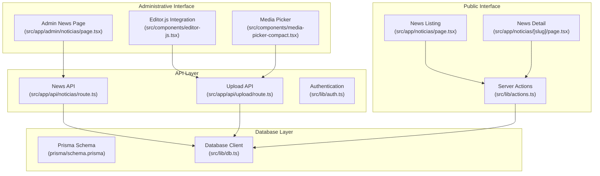
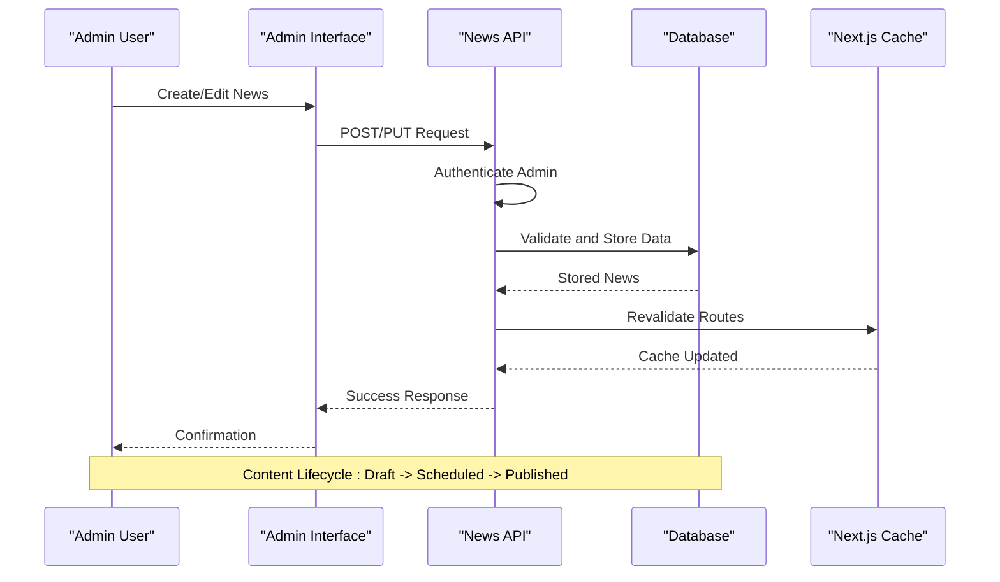
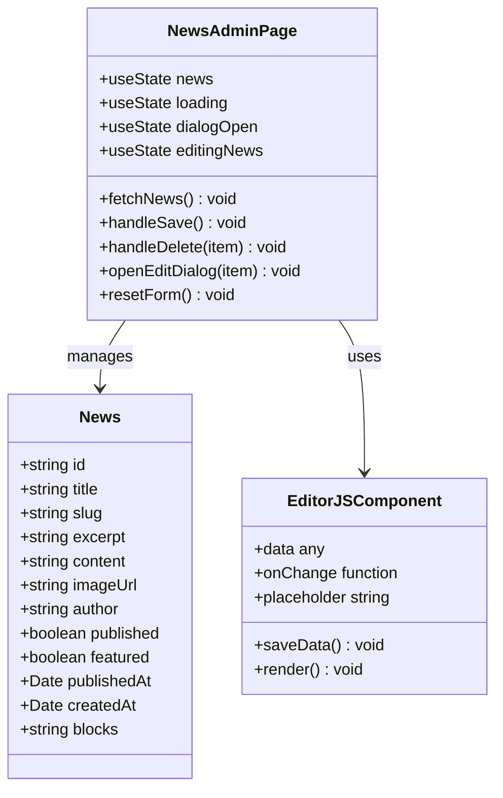
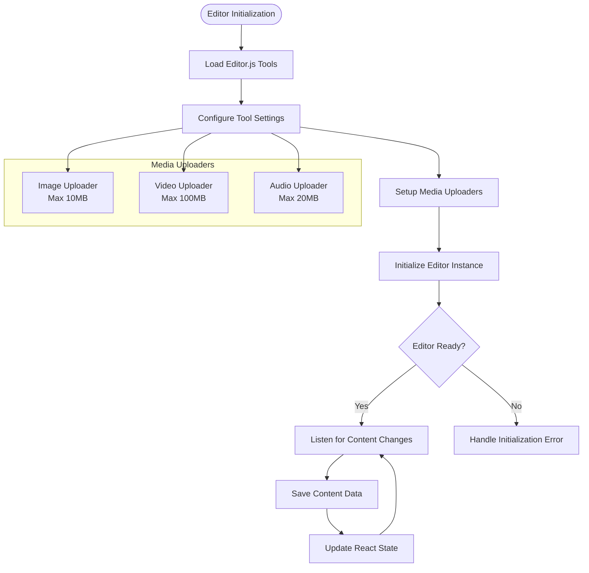
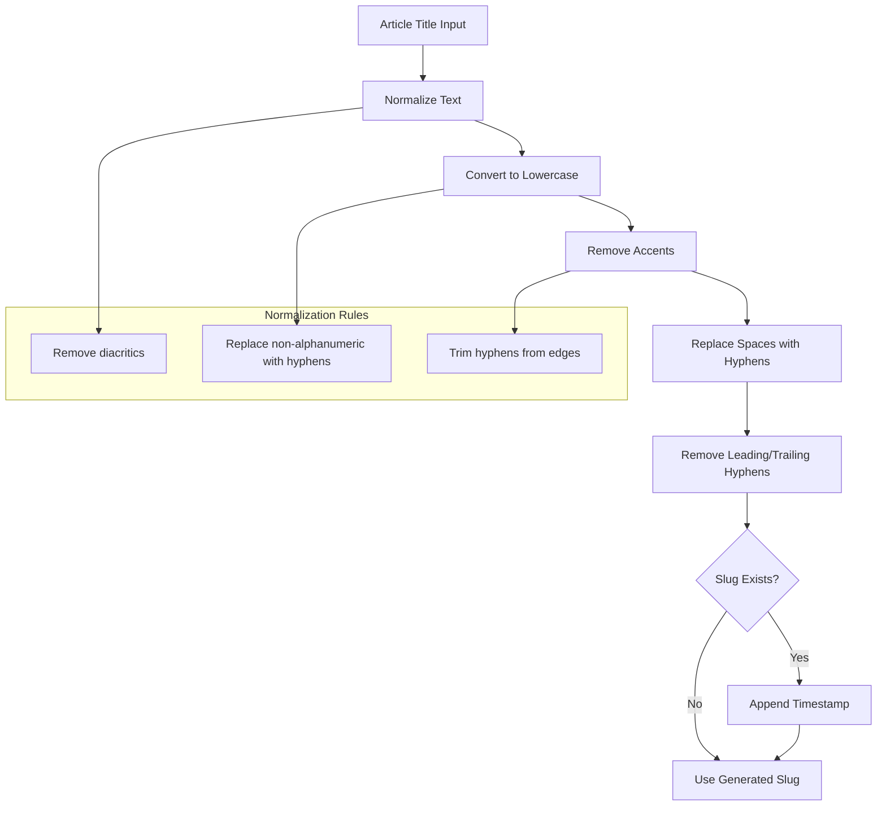
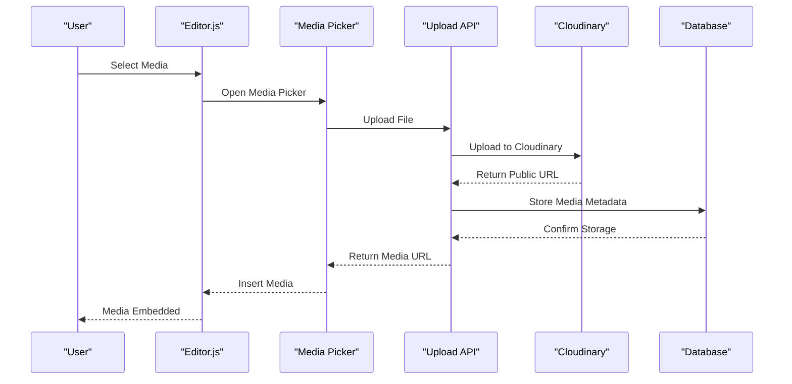
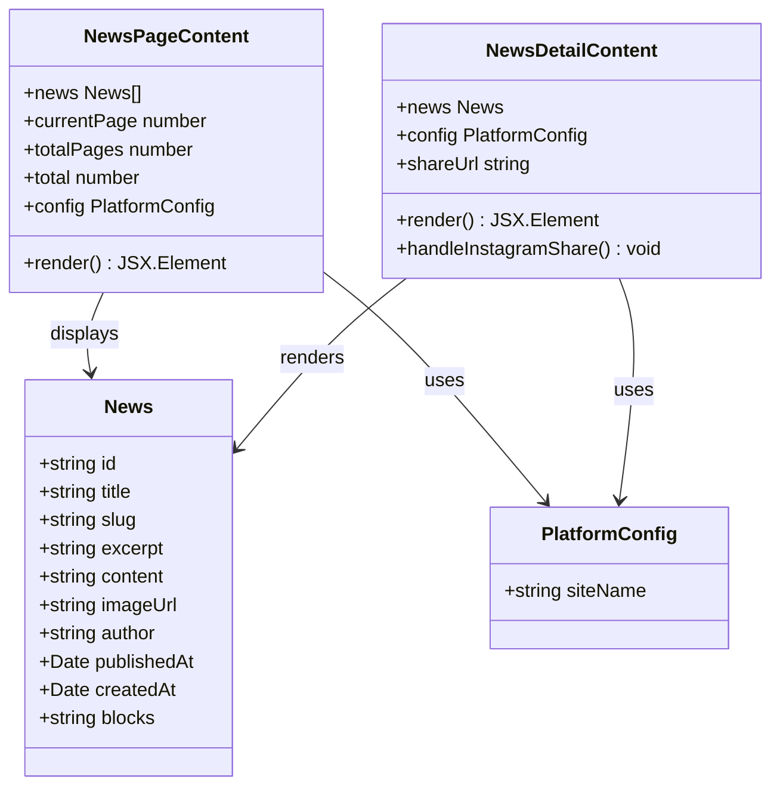
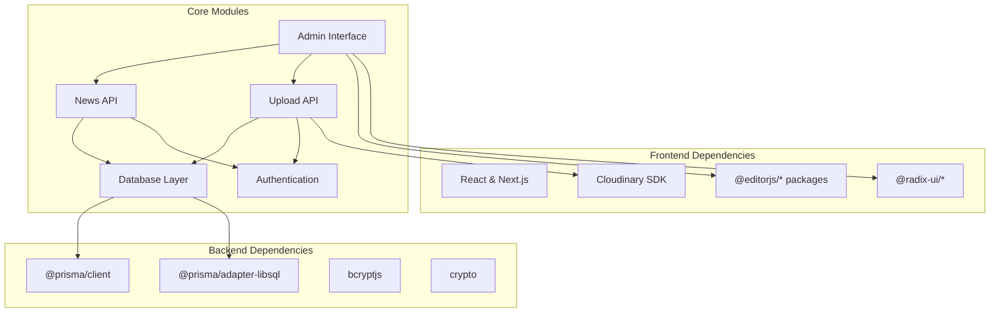

# News/Blog Management System

<cite>
**Referenced Files in This Document**
- [src/app/admin/noticias/page.tsx](file://src/app/admin/noticias/page.tsx)
- [src/app/api/noticias/route.ts](file://src/app/api/noticias/route.ts)
- [src/components/editor-js.tsx](file://src/components/editor-js.tsx)
- [src/components/news-page-content.tsx](file://src/components/news-page-content.tsx)
- [src/components/news-detail-content.tsx](file://src/components/news-detail-content.tsx)
- [src/lib/actions.ts](file://src/lib/actions.ts)
- [src/lib/db.ts](file://src/lib/db.ts)
- [prisma/schema.prisma](file://prisma/schema.prisma)
- [src/app/noticias/page.tsx](file://src/app/noticias/page.tsx)
- [src/app/noticias/[slug]/page.tsx](file://src/app/noticias/[slug]/page.tsx)
- [src/lib/auth.ts](file://src/lib/auth.ts)
- [src/app/api/upload/route.ts](file://src/app/api/upload/route.ts)
- [src/components/media-picker-compact.tsx](file://src/components/media-picker-compact.tsx)
- [src/components/editor-js-header-tools.ts](file://src/components/editor-js-header-tools.ts)
</cite>

## Table of Contents
1. [Introduction](#introduction)
2. [Project Structure](#project-structure)
3. [Core Components](#core-components)
4. [Architecture Overview](#architecture-overview)
5. [Detailed Component Analysis](#detailed-component-analysis)
6. [Dependency Analysis](#dependency-analysis)
7. [Performance Considerations](#performance-considerations)
8. [Troubleshooting Guide](#troubleshooting-guide)
9. [Conclusion](#conclusion)

## Introduction
This document provides comprehensive documentation for the news/blog management system within the administrative interface. It covers the complete content lifecycle from creation to publication, including draft management, scheduling, and content organization. The system integrates Editor.js for rich text editing, supports media embedding, and provides robust content formatting options. The documentation details the news listing interface with filtering, search functionality, and bulk operations. It explains the slug generation system for URL-friendly permalinks, content preview capabilities, and the relationship between news articles and the public-facing news page. Implementation specifics for content validation, image handling, and the API endpoints used for data persistence are included.

## Project Structure
The news/blog management system spans several key areas:
- Administrative interface for content creation and management
- Rich text editor integration with media support
- Public-facing news listing and detail pages
- Database schema for news content storage
- Authentication and authorization for administrative access
- Media upload and management infrastructure

**Diagram sources**
- [src/app/admin/noticias/page.tsx:1-487](file://src/app/admin/noticias/page.tsx#L1-L487)
- [src/app/api/noticias/route.ts:1-229](file://src/app/api/noticias/route.ts#L1-L229)
- [src/components/editor-js.tsx:1-850](file://src/components/editor-js.tsx#L1-L850)
- [prisma/schema.prisma:98-118](file://prisma/schema.prisma#L98-L118)

**Section sources**
- [src/app/admin/noticias/page.tsx:1-487](file://src/app/admin/noticias/page.tsx#L1-L487)
- [src/app/api/noticias/route.ts:1-229](file://src/app/api/noticias/route.ts#L1-L229)
- [prisma/schema.prisma:98-118](file://prisma/schema.prisma#L98-L118)

## Core Components
The system consists of several interconnected components that work together to provide a comprehensive news/blog management solution:

### Administrative News Management Interface
The main administrative interface provides a comprehensive dashboard for managing news articles, featuring:
- Article listing with pagination and status indicators
- Rich text editor with advanced formatting capabilities
- Media management integration
- Draft/scheduled publishing workflows
- Bulk operations and quick actions

### Rich Text Editor Integration
The system integrates Editor.js with custom tools and configurations:
- Custom header tools (H1-H4) with specialized icons
- Media embedding capabilities for images, videos, and audio
- Advanced formatting options including colors, markers, and text effects
- Real-time content validation and conversion

### Public News Presentation
The public-facing interface displays news articles with:
- Responsive grid layout for article listings
- Detailed article pages with rich content rendering
- Social sharing capabilities
- SEO optimization with metadata generation

### Database Schema
The Prisma schema defines the News model with comprehensive fields:
- Basic content fields (title, slug, excerpt, content)
- Rich content support (blocks JSON for Editor.js)
- Publication and scheduling fields
- Media and metadata fields
- Timestamps for tracking changes

**Section sources**
- [src/app/admin/noticias/page.tsx:23-36](file://src/app/admin/noticias/page.tsx#L23-L36)
- [src/components/editor-js.tsx:344-575](file://src/components/editor-js.tsx#L344-L575)
- [prisma/schema.prisma:98-118](file://prisma/schema.prisma#L98-L118)

## Architecture Overview
The news/blog management system follows a layered architecture with clear separation of concerns:

**Diagram sources**
- [src/app/api/noticias/route.ts:54-111](file://src/app/api/noticias/route.ts#L54-L111)
- [src/lib/auth.ts:156-169](file://src/lib/auth.ts#L156-L169)

The architecture ensures:
- Secure administrative access through authentication
- Efficient content storage and retrieval
- Automatic cache invalidation for real-time updates
- Scalable media handling with Cloudinary integration

## Detailed Component Analysis

### News Administration Interface
The administrative interface serves as the central hub for content management:

**Diagram sources**
- [src/app/admin/noticias/page.tsx:23-36](file://src/app/admin/noticias/page.tsx#L23-L36)
- [src/app/admin/noticias/page.tsx:344-575](file://src/app/admin/noticias/page.tsx#L344-L575)

Key features include:
- Real-time content validation with error feedback
- Rich text editing with live preview
- Media integration through the media picker
- Status indicators for draft/published states
- Pagination for efficient content browsing

**Section sources**
- [src/app/admin/noticias/page.tsx:38-139](file://src/app/admin/noticias/page.tsx#L38-L139)
- [src/app/admin/noticias/page.tsx:166-201](file://src/app/admin/noticias/page.tsx#L166-L201)

### Rich Text Editor Implementation
The Editor.js integration provides comprehensive content creation capabilities:

**Diagram sources**
- [src/components/editor-js.tsx:380-557](file://src/components/editor-js.tsx#L380-L557)
- [src/components/editor-js.tsx:185-227](file://src/components/editor-js.tsx#L185-L227)

The editor supports:
- Custom header tools (H1-H4) with specialized rendering
- Media embedding from both uploads and URLs
- Advanced formatting options (colors, markers, lists)
- Real-time content validation and conversion
- Responsive design for various screen sizes

**Section sources**
- [src/components/editor-js.tsx:406-522](file://src/components/editor-js.tsx#L406-L522)
- [src/components/editor-js-header-tools.ts:14-61](file://src/components/editor-js-header-tools.ts#L14-L61)

### Slug Generation System
The system implements intelligent slug generation for URL-friendly permalinks:

**Diagram sources**
- [src/app/api/noticias/route.ts:6-14](file://src/app/api/noticias/route.ts#L6-L14)

The slug generation process ensures:
- URL-friendly formatting (lowercase, hyphen-separated)
- Automatic uniqueness through timestamp appending
- Character normalization for international content
- Consistent permalink structure

**Section sources**
- [src/app/api/noticias/route.ts:64-73](file://src/app/api/noticias/route.ts#L64-L73)
- [src/app/api/noticias/route.ts:139-152](file://src/app/api/noticias/route.ts#L139-L152)

### Media Management Integration
The system provides comprehensive media management capabilities:

**Diagram sources**
- [src/components/media-picker-compact.tsx:175-290](file://src/components/media-picker-compact.tsx#L175-L290)
- [src/app/api/upload/route.ts:272-324](file://src/app/api/upload/route.ts#L272-L324)

Key media management features:
- Support for images, videos, and audio files
- Automatic Cloudinary integration in production
- Local development file system storage
- Duplicate detection and prevention
- Responsive image optimization

**Section sources**
- [src/components/media-picker-compact.tsx:132-170](file://src/components/media-picker-compact.tsx#L132-L170)
- [src/app/api/upload/route.ts:150-200](file://src/app/api/upload/route.ts#L150-L200)

### Public News Presentation
The public-facing interface provides an optimized reading experience:

**Diagram sources**
- [src/components/news-page-content.tsx:31-184](file://src/components/news-page-content.tsx#L31-L184)
- [src/components/news-detail-content.tsx:52-279](file://src/components/news-detail-content.tsx#L52-L279)

The public interface features:
- Responsive grid layout for article listings
- Detailed article pages with rich content rendering
- Social sharing integration (Facebook, Twitter, WhatsApp, Instagram, LinkedIn)
- SEO optimization with structured metadata
- Pagination for efficient browsing

**Section sources**
- [src/components/news-page-content.tsx:31-184](file://src/components/news-page-content.tsx#L31-L184)
- [src/components/news-detail-content.tsx:52-279](file://src/components/news-detail-content.tsx#L52-L279)

## Dependency Analysis
The system exhibits well-structured dependencies with clear separation of concerns:

**Diagram sources**
- [src/lib/db.ts:1-21](file://src/lib/db.ts#L1-L21)
- [src/lib/auth.ts:1-170](file://src/lib/auth.ts#L1-L170)

Key dependency characteristics:
- **Low coupling**: Components communicate through well-defined APIs
- **High cohesion**: Related functionality is grouped within modules
- **Clear boundaries**: Frontend and backend responsibilities are separated
- **External integrations**: Cloudinary and Prisma provide specialized functionality

**Section sources**
- [src/lib/db.ts:1-21](file://src/lib/db.ts#L1-L21)
- [src/lib/auth.ts:1-170](file://src/lib/auth.ts#L1-L170)

## Performance Considerations
The system incorporates several performance optimizations:

### Database Optimization
- **Pagination**: News listings use pagination to limit data transfer
- **Selective queries**: Only required fields are fetched for listing views
- **Indexing**: Unique constraints on slugs for fast lookups
- **Connection pooling**: Prisma client configured for efficient database access

### Caching Strategy
- **Automatic cache revalidation**: Next.js cache is invalidated on content changes
- **Static generation**: Public pages leverage Next.js static generation where possible
- **Edge caching**: Production deployment benefits from CDN caching

### Media Optimization
- **Lazy loading**: Images use native lazy loading for improved performance
- **Responsive sizing**: Cloudinary integration provides responsive image delivery
- **Compression**: Automatic compression through Cloudinary in production

### Frontend Performance
- **Code splitting**: Editor.js and other heavy dependencies are dynamically imported
- **Virtualization**: Media picker uses virtualized lists for large libraries
- **Efficient state management**: React state updates are optimized for minimal re-renders

## Troubleshooting Guide

### Common Issues and Solutions

#### Authentication Problems
**Issue**: Admin users unable to access the news management interface
**Solution**: Verify session cookie validity and admin account existence
- Check authentication middleware implementation
- Validate session expiration and token generation
- Ensure admin accounts are properly created

#### Media Upload Failures
**Issue**: Media uploads failing with validation errors
**Solution**: Review file type validation and size limits
- Verify MIME type detection and allowed file types
- Check file size limits for different environments
- Ensure Cloudinary configuration is correct in production

#### Slug Generation Conflicts
**Issue**: Duplicate slugs causing conflicts
**Solution**: Implement proper slug conflict resolution
- Verify timestamp-based slug appending logic
- Check database uniqueness constraints
- Test slug generation with special characters

#### Content Rendering Issues
**Issue**: Rich text content not displaying correctly
**Solution**: Validate Editor.js data structure and rendering logic
- Ensure blocks JSON is properly formatted
- Verify rendering functions for different block types
- Check CSS styling for content presentation

**Section sources**
- [src/lib/auth.ts:50-71](file://src/lib/auth.ts#L50-L71)
- [src/app/api/upload/route.ts:80-111](file://src/app/api/upload/route.ts#L80-L111)
- [src/app/api/noticias/route.ts:64-73](file://src/app/api/noticias/route.ts#L64-L73)

### Debugging Tools and Techniques
- **Console logging**: Comprehensive error logging throughout the system
- **Database inspection**: Prisma client logs for query debugging
- **Network monitoring**: API endpoint testing and validation
- **Browser developer tools**: Frontend debugging and performance profiling

## Conclusion
The news/blog management system provides a comprehensive solution for content management with strong emphasis on user experience, performance, and scalability. The system successfully integrates rich text editing capabilities with robust media management, while maintaining clean separation of concerns between administrative and public interfaces. The implementation demonstrates best practices in modern web development, including proper authentication, efficient database design, and scalable media handling. The modular architecture ensures maintainability and extensibility for future enhancements.

The system's strength lies in its seamless integration of powerful editing capabilities with intuitive administrative workflows, providing content creators with the tools they need to produce engaging, well-structured content while ensuring optimal performance and user experience for end users.