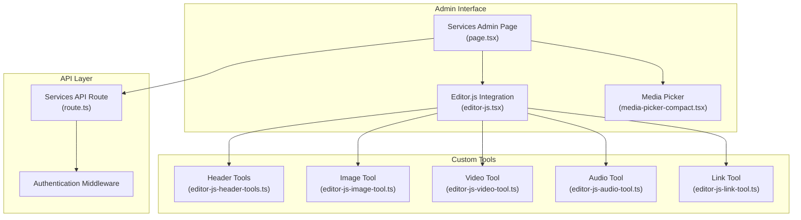
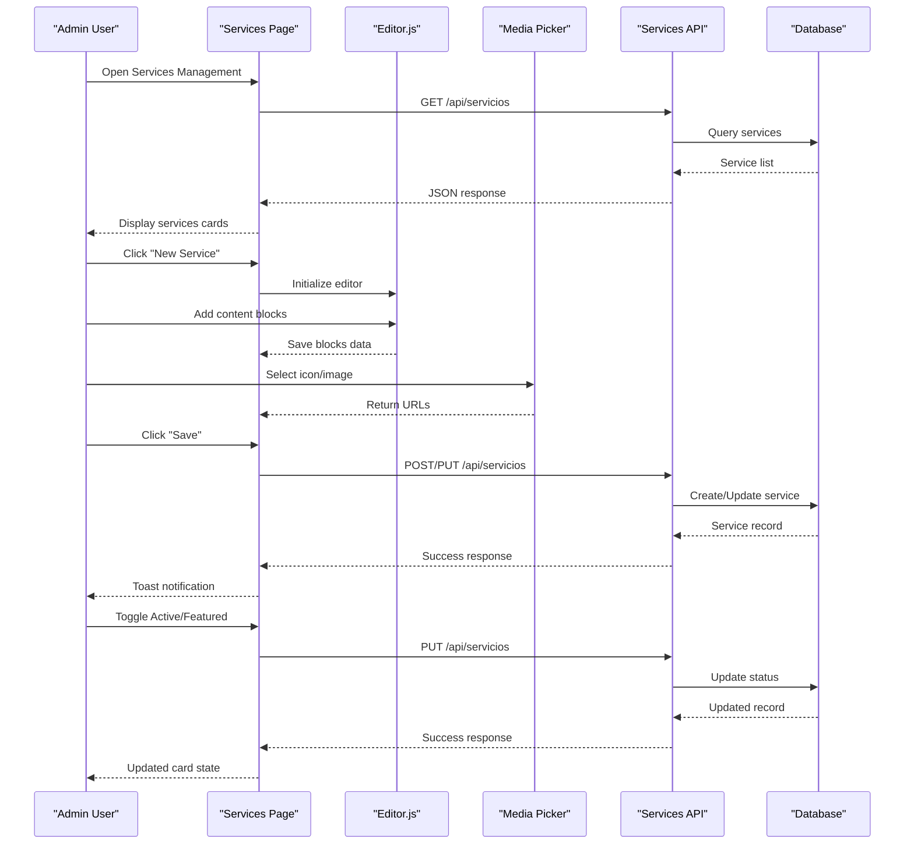
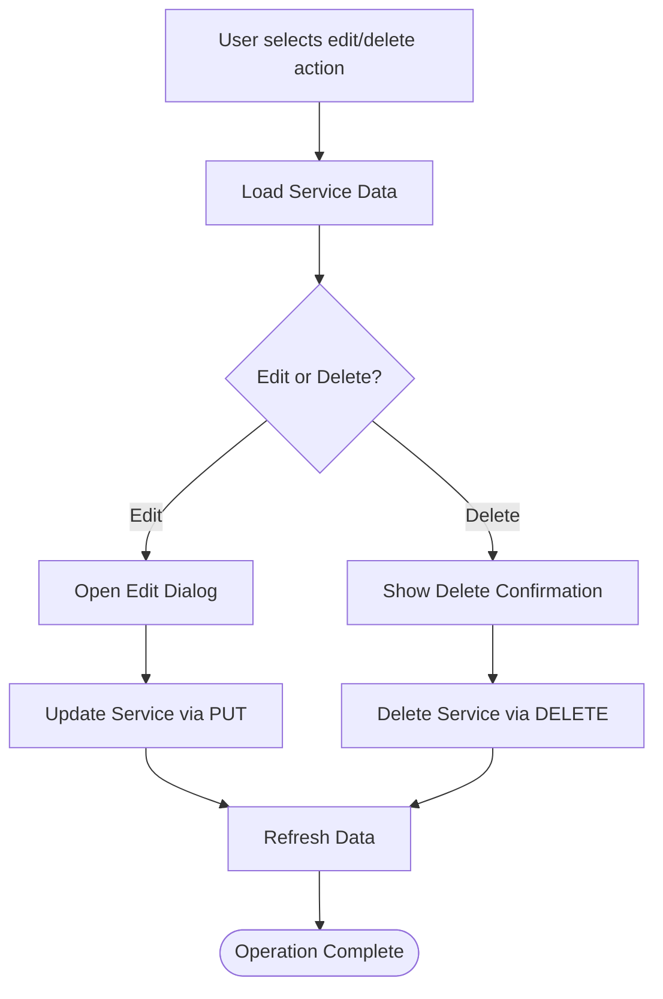
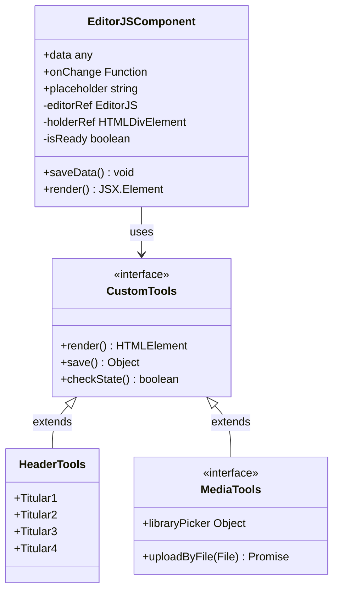
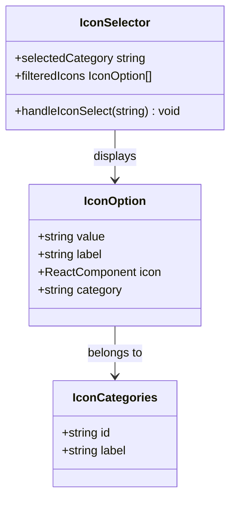
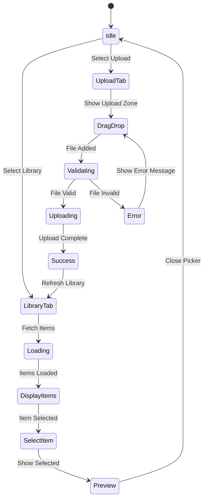
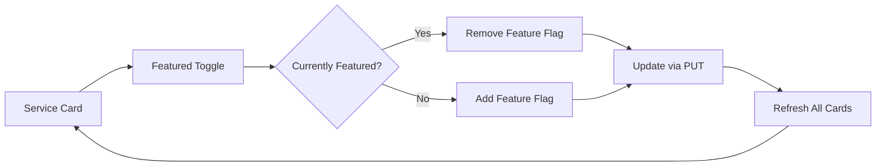
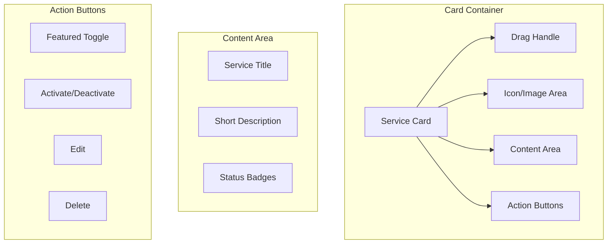

# Services Management Interface

<cite>
**Referenced Files in This Document**
- [page.tsx](file://src/app/admin/servicios/page.tsx)
- [route.ts](file://src/app/api/servicios/route.ts)
- [editor-js.tsx](file://src/components/editor-js.tsx)
- [media-picker-compact.tsx](file://src/components/media-picker-compact.tsx)
- [editor-js-header-tools.ts](file://src/components/editor-js-header-tools.ts)
- [editor-js-image-tool.ts](file://src/components/editor-js-image-tool.ts)
- [editor-js-video-tool.ts](file://src/components/editor-js-video-tool.ts)
- [editor-js-audio-tool.ts](file://src/components/editor-js-audio-tool.ts)
- [editor-js-link-tool.ts](file://src/components/editor-js-link-tool.ts)
</cite>

## Table of Contents
1. [Introduction](#introduction)
2. [Project Structure](#project-structure)
3. [Core Components](#core-components)
4. [Architecture Overview](#architecture-overview)
5. [Detailed Component Analysis](#detailed-component-analysis)
6. [Dependency Analysis](#dependency-analysis)
7. [Performance Considerations](#performance-considerations)
8. [Troubleshooting Guide](#troubleshooting-guide)
9. [Conclusion](#conclusion)

## Introduction
This document provides comprehensive documentation for the Services Management Interface in GreenAxis. It covers the complete CRUD operations for services, rich text editing with Editor.js, icon selection with categorization, media upload capabilities, service status management, and the responsive card-based UI. Implementation details include slug generation, content validation, and backend API integration.

## Project Structure
The Services Management Interface is implemented as a Next.js client-side page with integrated components and API routes:



**Diagram sources**
- [page.tsx:1-627](file://src/app/admin/servicios/page.tsx#L1-L627)
- [route.ts:1-161](file://src/app/api/servicios/route.ts#L1-L161)
- [editor-js.tsx:1-850](file://src/components/editor-js.tsx#L1-L850)

**Section sources**
- [page.tsx:1-627](file://src/app/admin/servicios/page.tsx#L1-L627)
- [route.ts:1-161](file://src/app/api/servicios/route.ts#L1-L161)

## Core Components

### Services Admin Page
The main administrative interface for managing services, featuring:
- Complete CRUD operations with modal dialogs
- Rich text editor integration with Editor.js
- Icon selection with category filtering
- Media upload capabilities
- Status toggles for activation and featured services
- Responsive card-based layout

### Editor.js Integration
Advanced WYSIWYG editor supporting:
- Block-based content structure with serialization
- Multiple content types (text, headers, lists, quotes)
- Media embedding (images, videos, audio)
- Inline formatting and links
- Dark mode support

### Media Management
Comprehensive media handling system:
- Drag-and-drop upload interface
- Library browsing with thumbnail previews
- Duplicate detection and resolution
- Size validation and progress tracking
- Cloudinary integration

**Section sources**
- [page.tsx:77-89](file://src/app/admin/servicios/page.tsx#L77-L89)
- [editor-js.tsx:344-575](file://src/components/editor-js.tsx#L344-L575)
- [media-picker-compact.tsx:94-691](file://src/components/media-picker-compact.tsx#L94-L691)

## Architecture Overview



**Diagram sources**
- [page.tsx:113-220](file://src/app/admin/servicios/page.tsx#L113-L220)
- [route.ts:29-130](file://src/app/api/servicios/route.ts#L29-L130)

## Detailed Component Analysis

### Service CRUD Operations

#### Creation Workflow
The service creation process follows a structured flow:

```mermaid
flowchart TD
Start([User clicks "New Service"]) --> InitForm["Initialize Form State"]
InitForm --> LoadEditor["Load Editor.js Instance"]
LoadEditor --> AddContent["Add Content Blocks"]
AddContent --> SelectIcon["Select Service Icon"]
SelectIcon --> UploadImage["Upload Service Image"]
UploadImage --> ValidateForm["Validate Form Fields"]
ValidateForm --> FormValid{"Form Valid?"}
FormValid --> |No| ShowError["Show Validation Error"]
FormValid --> |Yes| PrepareData["Prepare Request Data"]
PrepareData --> GenerateSlug["Generate Slug from Title"]
GenerateSlug --> SendRequest["Send POST Request"]
SendRequest --> Success["Show Success Toast"]
Success --> RefreshList["Refresh Services List"]
ShowError --> WaitAction["Wait for User Action"]
WaitAction --> InitForm
```

**Diagram sources**
- [page.tsx:134-176](file://src/app/admin/servicios/page.tsx#L134-L176)
- [route.ts:29-71](file://src/app/api/servicios/route.ts#L29-L71)

#### Update and Deletion Operations
Service updates and deletions share common patterns:



**Diagram sources**
- [page.tsx:178-193](file://src/app/admin/servicios/page.tsx#L178-L193)
- [route.ts:73-130](file://src/app/api/servicios/route.ts#L73-L130)

**Section sources**
- [page.tsx:134-193](file://src/app/admin/servicios/page.tsx#L134-L193)
- [route.ts:29-130](file://src/app/api/servicios/route.ts#L29-L130)

### Rich Text Editor Integration

#### Editor.js Configuration
The Editor.js integration provides a comprehensive content editing experience:



**Diagram sources**
- [editor-js.tsx:344-575](file://src/components/editor-js.tsx#L344-L575)
- [editor-js-header-tools.ts:14-211](file://src/components/editor-js-header-tools.ts#L14-L211)

#### Block-Based Content Structure
The editor supports structured content through block-based architecture:

| Block Type | Purpose | Configuration |
|------------|---------|---------------|
| Paragraph | Standard text content | Inline formatting |
| Header | Hierarchical headings | Levels 1-4 |
| List | Ordered/unordered lists | Style customization |
| Quote | Blockquotes with citations | Caption support |
| Image | Embedded media with captions | Upload + library picker |
| Video | Local video embedding | Upload + library picker |
| Audio | Audio file embedding | Upload + library picker |
| Embed | External content embedding | Social media support |

**Section sources**
- [editor-js.tsx:400-525](file://src/components/editor-js.tsx#L400-L525)
- [editor-js-header-tools.ts:14-211](file://src/components/editor-js-header-tools.ts#L14-L211)

### Icon Selection System

#### Categorized Icon Management
The icon system provides organized selection with category filtering:



**Diagram sources**
- [page.tsx:29-56](file://src/app/admin/servicios/page.tsx#L29-L56)
- [page.tsx:270-273](file://src/app/admin/servicios/page.tsx#L270-L273)

#### Available Categories and Icons
The system provides five distinct categories with curated icon sets:

| Category | Icons | Purpose |
|----------|-------|---------|
| Nature | Leaf, TreePine, Sun, Mountain, Flower2, Bird, Bug | Environmental themes |
| Water | Droplets, CloudRain, Waves, Droplet | Aquatic resources |
| Air | Wind, CloudSun | Atmospheric conditions |
| Management | Recycle, Tractor | Waste and agricultural management |
| Infrastructure | Building2, Landmark, Factory | Urban and industrial facilities |

**Section sources**
- [page.tsx:29-56](file://src/app/admin/servicios/page.tsx#L29-L56)

### Media Upload Capabilities

#### Media Picker Architecture
The media picker provides a streamlined interface for content creators:



**Diagram sources**
- [media-picker-compact.tsx:122-170](file://src/components/media-picker-compact.tsx#L122-L170)
- [media-picker-compact.tsx:175-290](file://src/components/media-picker-compact.tsx#L175-L290)

#### Upload Validation and Processing
The media upload system implements comprehensive validation:

| Validation Step | Criteria | Limits |
|----------------|----------|--------|
| File Size | Individual file validation | 5MB default, configurable |
| File Type | MIME type checking | Image, video, audio support |
| Duplicate Detection | Similar file identification | Automatic suggestion system |
| Category Assignment | Automatic categorization | Based on file extension |
| Progress Tracking | Real-time upload feedback | Percentage completion |

**Section sources**
- [media-picker-compact.tsx:175-290](file://src/components/media-picker-compact.tsx#L175-L290)

### Service Status Management

#### Featured Services Toggle
The featured service system allows highlighting premium offerings:



**Diagram sources**
- [page.tsx:208-219](file://src/app/admin/servicios/page.tsx#L208-L219)

#### Activation/Deactivation System
Service activation controls visibility and accessibility:

| Status | Visual Indicator | Impact |
|--------|------------------|---------|
| Active | Green check icon | Visible in listings |
| Inactive | Grayed out appearance | Hidden from public |
| Featured | Amber star badge | Premium positioning |

**Section sources**
- [page.tsx:195-206](file://src/app/admin/servicios/page.tsx#L195-L206)

### Responsive Card-Based Interface

#### Card Layout Design
The interface employs a responsive card-based design optimized for admin workflows:



**Diagram sources**
- [page.tsx:330-405](file://src/app/admin/servicios/page.tsx#L330-L405)

#### Responsive Behavior
The interface adapts seamlessly across device sizes:
- Mobile: Stacked layout with touch-friendly controls
- Tablet: Two-column grid with reduced spacing
- Desktop: Multi-column grid with full feature set
- Large screens: Optimized for 4K displays with enhanced readability

**Section sources**
- [page.tsx:329-421](file://src/app/admin/servicios/page.tsx#L329-L421)

## Dependency Analysis

### Component Dependencies

```mermaid
graph TD
ServicesPage["Services Admin Page"] --> EditorJS["Editor.js Component"]
ServicesPage --> MediaPicker["Media Picker"]
ServicesPage --> APIRoute["Services API Route"]
EditorJS --> HeaderTools["Header Tools"]
EditorJS --> ImageTool["Image Tool"]
EditorJS --> VideoTool["Video Tool"]
EditorJS --> AudioTool["Audio Tool"]
EditorJS --> LinkTool["Link Tool"]
MediaPicker --> UploadAPI["Upload API"]
MediaPicker --> LibraryAPI["Library API"]
APIRoute --> Database["Prisma Database"]
APIRoute --> Auth["Authentication"]
subgraph "External Dependencies"
EditorJS --> "@editorjs/*"
MediaPicker --> "Cloudinary"
ServicesPage --> "Lucide Icons"
end
```

**Diagram sources**
- [page.tsx:1-26](file://src/app/admin/servicios/page.tsx#L1-L26)
- [editor-js.tsx:380-396](file://src/components/editor-js.tsx#L380-L396)

### Data Flow Dependencies

The system maintains clear data flow boundaries:

1. **Presentation Layer**: React components manage UI state and user interactions
2. **Business Logic**: Service operations coordinate with API endpoints
3. **Data Access**: Prisma ORM handles database operations
4. **Authentication**: Admin session validation for protected operations

**Section sources**
- [page.tsx:113-128](file://src/app/admin/servicios/page.tsx#L113-L128)
- [route.ts:30-34](file://src/app/api/servicios/route.ts#L30-L34)

## Performance Considerations

### Optimization Strategies
The implementation incorporates several performance optimizations:

#### Lazy Loading
- Editor.js initialized only when needed
- Media picker components loaded on demand
- API calls debounced during rapid interactions

#### Memory Management
- Proper cleanup of Editor.js instances
- Unsubscribed event listeners
- Efficient state updates with React hooks

#### Network Optimization
- Batch API requests where possible
- Efficient caching strategies
- Minimal payload sizes for service lists

### Scalability Factors
- Database indexing on frequently queried fields
- Pagination for large media libraries
- CDN integration for media assets
- Rate limiting for API endpoints

## Troubleshooting Guide

### Common Issues and Solutions

#### Editor.js Initialization Failures
**Symptoms**: Editor fails to load or throws initialization errors
**Causes**: Missing dependencies, script loading conflicts
**Solutions**: 
- Verify Editor.js and plugin installations
- Check for conflicting script loaders
- Ensure proper async/await patterns

#### Media Upload Problems
**Symptoms**: Uploads fail or show timeout errors
**Causes**: Network issues, file size limits, browser compatibility
**Solutions**:
- Check network connectivity and CORS settings
- Verify file size and type restrictions
- Test with different browsers and file formats

#### Authentication Errors
**Symptoms**: API requests return unauthorized status
**Causes**: Session expiration, missing permissions
**Solutions**:
- Implement automatic session refresh
- Redirect to login on 401 responses
- Clear stale authentication tokens

**Section sources**
- [editor-js.tsx:540-543](file://src/components/editor-js.tsx#L540-L543)
- [media-picker-compact.tsx:277-290](file://src/components/media-picker-compact.tsx#L277-L290)
- [route.ts:30-34](file://src/app/api/servicios/route.ts#L30-L34)

## Conclusion
The Services Management Interface in GreenAxis provides a comprehensive solution for content administrators to manage service offerings effectively. The implementation combines modern React patterns with robust backend APIs, delivering a seamless experience for creating, editing, and organizing service content. The rich text editor integration, media management capabilities, and responsive design ensure efficient administration across all device types.

Key strengths of the implementation include:
- Complete CRUD functionality with intuitive UI
- Advanced content editing with block-based structure
- Comprehensive media handling with validation
- Responsive design optimized for admin workflows
- Secure authentication and authorization
- Performance optimizations for large datasets

The modular architecture supports future enhancements and maintains clean separation of concerns, making it maintainable and extensible for evolving requirements.