# Services Management Interface

<cite>
**Referenced Files in This Document**
- [page.tsx](file://src/app/admin/servicios/page.tsx)
- [route.ts](file://src/app/api/servicios/route.ts)
- [editor-js.tsx](file://src/components/editor-js.tsx)
- [media-picker-compact.tsx](file://src/components/media-picker-compact.tsx)
- [editor-js-header-tools.ts](file://src/components/editor-js-header-tools.ts)
- [editor-js-image-tool.ts](file://src/components/editor-js-image-tool.ts)
- [editor-js-video-tool.ts](file://src/components/editor-js-video-tool.ts)
- [editor-js-audio-tool.ts](file://src/components/editor-js-audio-tool.ts)
- [editor-js-link-tool.ts](file://src/components/editor-js-link-tool.ts)
- [schema.prisma](file://prisma/schema.prisma)
</cite>

## Update Summary
**Changes Made**
- Enhanced dual-editor system documentation with separate short and full content editors
- Updated slug generation section to reflect manual customization and automatic generation capabilities
- Added comprehensive dual-description management documentation
- Updated service data model to include new shortBlocks field
- Enhanced API documentation for dual-content handling

## Table of Contents
1. [Introduction](#introduction)
2. [Project Structure](#project-structure)
3. [Core Components](#core-components)
4. [Architecture Overview](#architecture-overview)
5. [Detailed Component Analysis](#detailed-component-analysis)
6. [Dependency Analysis](#dependency-analysis)
7. [Performance Considerations](#performance-considerations)
8. [Troubleshooting Guide](#troubleshooting-guide)
9. [Conclusion](#conclusion)

## Introduction
This document provides comprehensive documentation for the Services Management Interface in GreenAxis. It covers the complete CRUD operations for services, rich text editing with Editor.js, icon selection with categorization, media upload capabilities, service status management, and the responsive card-based UI. **Updated** to reflect the enhanced dual-editor system for short and full content, improved slug generation with manual customization, and new dual-description management capabilities.

## Project Structure
The Services Management Interface is implemented as a Next.js client-side page with integrated components and API routes:

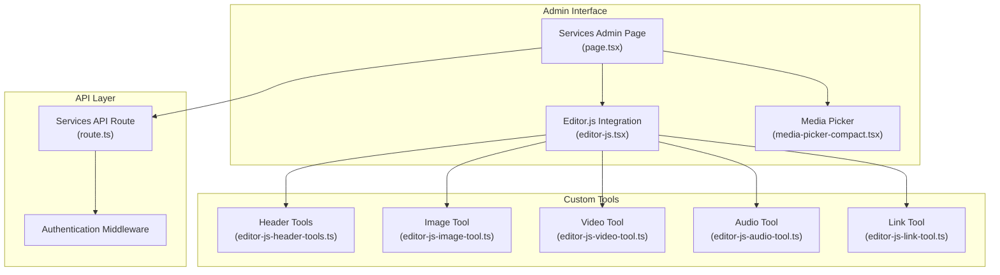

**Diagram sources**
- [page.tsx:1-729](file://src/app/admin/servicios/page.tsx#L1-L729)
- [route.ts:1-163](file://src/app/api/servicios/route.ts#L1-L163)
- [editor-js.tsx:1-850](file://src/components/editor-js.tsx#L1-L850)

**Section sources**
- [page.tsx:1-729](file://src/app/admin/servicios/page.tsx#L1-L729)
- [route.ts:1-163](file://src/app/api/servicios/route.ts#L1-L163)

## Core Components

### Services Admin Page
The main administrative interface for managing services, featuring:
- Complete CRUD operations with modal dialogs
- **Enhanced dual-editor system** with separate short and full content editors
- **Improved slug generation** with manual customization and automatic regeneration
- **Dual-description management** for list views and detail pages
- Icon selection with category filtering
- Media upload capabilities
- Status toggles for activation and featured services
- Responsive card-based layout

### Dual-Editor System
**Updated** The interface now features a sophisticated dual-editor system:

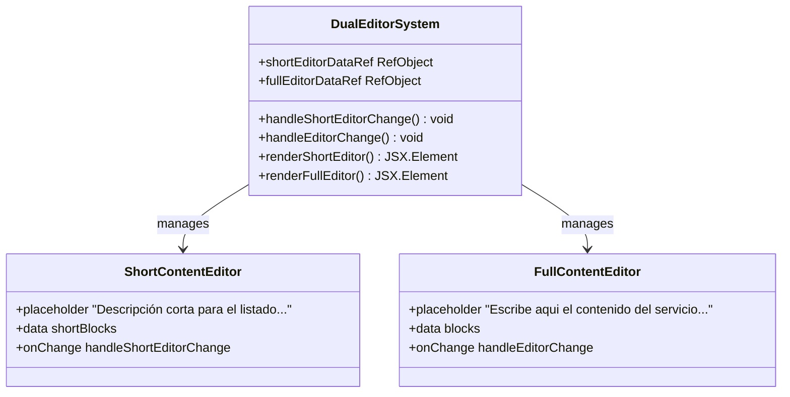

**Diagram sources**
- [page.tsx:112-154](file://src/app/admin/servicios/page.tsx#L112-L154)
- [page.tsx:551-580](file://src/app/admin/servicios/page.tsx#L551-L580)

### Enhanced Slug Generation
**Updated** The slug generation system now supports both manual customization and automatic generation:

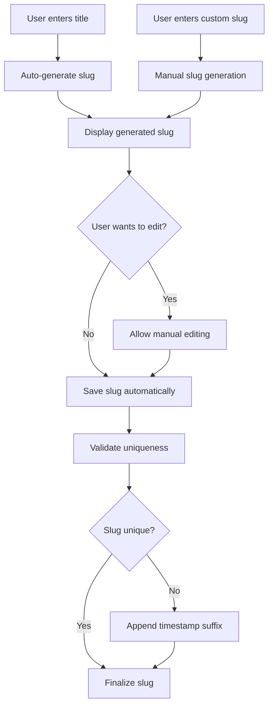

**Diagram sources**
- [page.tsx:58-65](file://src/app/admin/servicios/page.tsx#L58-L65)
- [page.tsx:508-529](file://src/app/admin/servicios/page.tsx#L508-L529)

### Dual-Description Management
**Updated** The system now manages two types of descriptions:

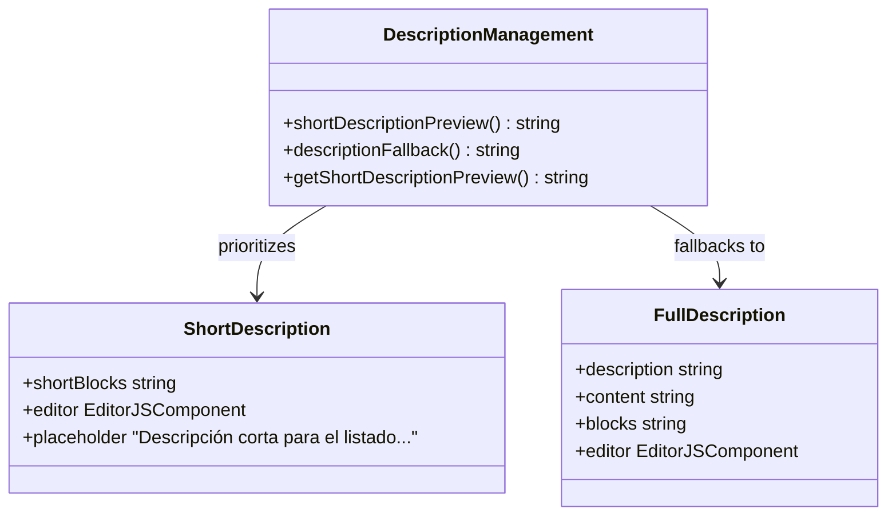

**Diagram sources**
- [page.tsx:77-89](file://src/app/admin/servicios/page.tsx#L77-L89)
- [page.tsx:540-556](file://src/app/admin/servicios/page.tsx#L540-L556)

### Editor.js Integration
Advanced WYSIWYG editor supporting:
- Block-based content structure with serialization
- Multiple content types (text, headers, lists, quotes)
- Media embedding (images, videos, audio)
- Inline formatting and links
- Dark mode support

### Media Management
Comprehensive media handling system:
- Drag-and-drop upload interface
- Library browsing with thumbnail previews
- Duplicate detection and resolution
- Size validation and progress tracking
- Cloudinary integration

**Section sources**
- [page.tsx:112-154](file://src/app/admin/servicios/page.tsx#L112-L154)
- [page.tsx:58-65](file://src/app/admin/servicios/page.tsx#L58-L65)
- [page.tsx:77-89](file://src/app/admin/servicios/page.tsx#L77-L89)
- [editor-js.tsx:344-575](file://src/components/editor-js.tsx#L344-L575)
- [media-picker-compact.tsx:94-691](file://src/components/media-picker-compact.tsx#L94-L691)

## Architecture Overview

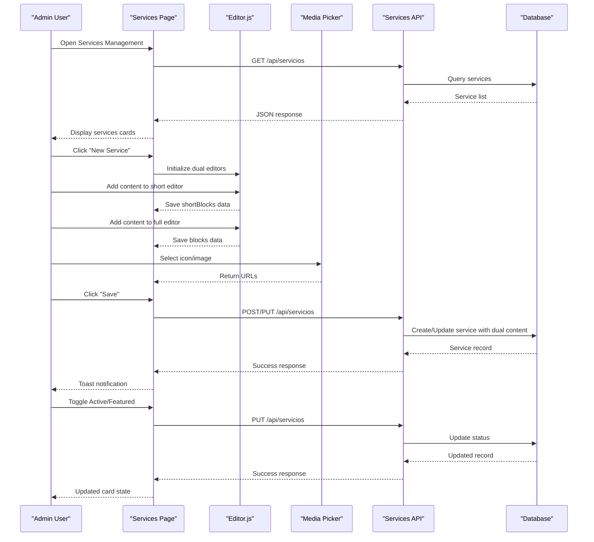

**Diagram sources**
- [page.tsx:135-200](file://src/app/admin/servicios/page.tsx#L135-L200)
- [route.ts:29-132](file://src/app/api/servicios/route.ts#L29-L132)

## Detailed Component Analysis

### Service CRUD Operations

#### Creation Workflow
**Updated** The service creation process now handles dual content editors:

```mermaid
flowchart TD
Start([User clicks "New Service"]) --> InitForm["Initialize Form State"]
InitForm --> LoadEditors["Load Dual Editor Instances"]
LoadEditors --> AddShortContent["Add Content to Short Editor"]
AddShortContent --> AddFullContent["Add Content to Full Editor"]
AddFullContent --> SelectIcon["Select Service Icon"]
SelectIcon --> UploadImage["Upload Service Image"]
UploadImage --> ValidateForm["Validate Form Fields"]
ValidateForm --> FormValid{"Form Valid?"}
FormValid --> |No| ShowError["Show Validation Error"]
FormValid --> |Yes| PrepareData["Prepare Request Data"]
PrepareData --> GenerateSlug["Generate Slug from Title"]
GenerateSlug --> SendRequest["Send POST Request with Dual Content"]
SendRequest --> Success["Show Success Toast"]
Success --> RefreshList["Refresh Services List"]
ShowError --> WaitAction["Wait for User Action"]
WaitAction --> InitForm
```

**Diagram sources**
- [page.tsx:135-200](file://src/app/admin/servicios/page.tsx#L135-L200)
- [route.ts:29-72](file://src/app/api/servicios/route.ts#L29-L72)

#### Update and Deletion Operations
Service updates and deletions now handle the enhanced data model:

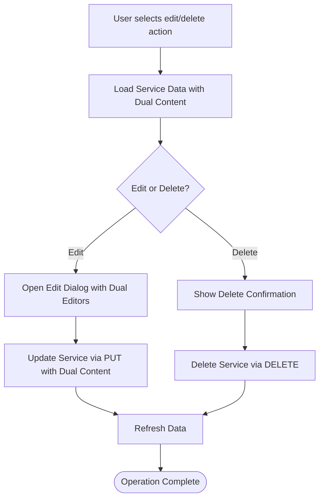

**Diagram sources**
- [page.tsx:265-303](file://src/app/admin/servicios/page.tsx#L265-L303)
- [route.ts:74-132](file://src/app/api/servicios/route.ts#L74-L132)

**Section sources**
- [page.tsx:135-303](file://src/app/admin/servicios/page.tsx#L135-L303)
- [route.ts:29-132](file://src/app/api/servicios/route.ts#L29-L132)

### Rich Text Editor Integration

#### Editor.js Configuration
**Updated** The Editor.js integration now supports dual content management:

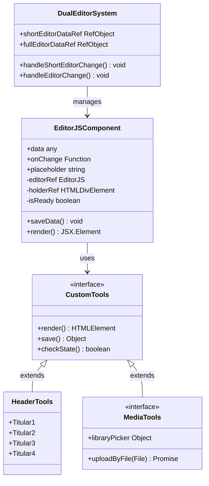

**Diagram sources**
- [editor-js.tsx:344-575](file://src/components/editor-js.tsx#L344-L575)
- [page.tsx:112-154](file://src/app/admin/servicios/page.tsx#L112-L154)
- [editor-js-header-tools.ts:14-211](file://src/components/editor-js-header-tools.ts#L14-L211)

#### Block-Based Content Structure
The editor supports structured content through block-based architecture with dual content handling:

| Block Type | Purpose | Configuration | Content Type |
|------------|---------|---------------|--------------|
| Paragraph | Standard text content | Inline formatting | Both Editors |
| Header | Hierarchical headings | Levels 1-4 | Both Editors |
| List | Ordered/unordered lists | Style customization | Both Editors |
| Quote | Blockquotes with citations | Caption support | Both Editors |
| Image | Embedded media with captions | Upload + library picker | Both Editors |
| Video | Local video embedding | Upload + library picker | Both Editors |
| Audio | Audio file embedding | Upload + library picker | Both Editors |
| Embed | External content embedding | Social media support | Both Editors |

**Section sources**
- [editor-js.tsx:400-525](file://src/components/editor-js.tsx#L400-L525)
- [editor-js-header-tools.ts:14-211](file://src/components/editor-js-header-tools.ts#L14-L211)

### Enhanced Slug Generation System

#### Manual Customization and Automatic Generation
**Updated** The slug generation system now provides flexible slug management:

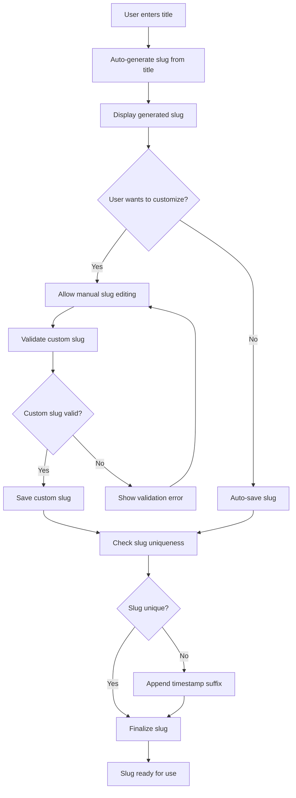

**Diagram sources**
- [page.tsx:58-65](file://src/app/admin/servicios/page.tsx#L58-L65)
- [page.tsx:508-529](file://src/app/admin/servicios/page.tsx#L508-L529)
- [page.tsx:488-498](file://src/app/admin/servicios/page.tsx#L488-L498)

#### Slug Generation Algorithm
The slug generation algorithm provides robust URL-friendly slugs:

| Step | Process | Example |
|------|---------|---------|
| Normalize | Convert to lowercase and remove accents | "Gestión de Residuos" → "gestion de residuos" |
| Clean | Remove special characters and normalize spaces | "gestion de residuos" → "gestion-de-residuos" |
| Trim | Remove leading/trailing hyphens | "-gestion-de-residuos-" → "gestion-de-residuos" |
| Validate | Ensure non-empty result | Empty input → fallback slug |

**Section sources**
- [page.tsx:58-65](file://src/app/admin/servicios/page.tsx#L58-L65)
- [route.ts:6-14](file://src/app/api/servicios/route.ts#L6-L14)

### Dual-Description Management System

#### Short Description Preview Logic
**Updated** The system now intelligently manages dual descriptions:

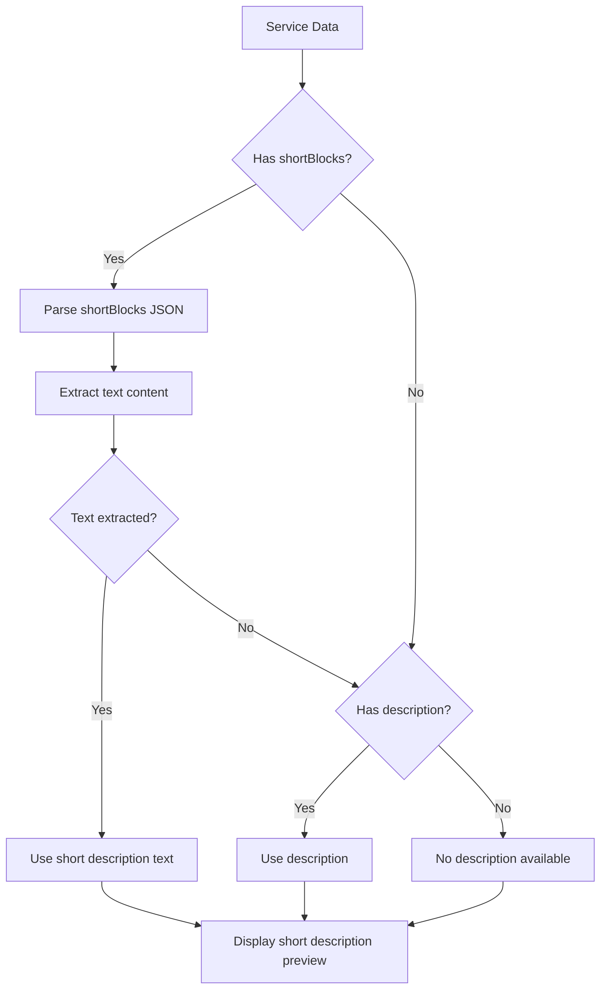

**Diagram sources**
- [page.tsx:77-89](file://src/app/admin/servicios/page.tsx#L77-L89)

#### Description Management Features
The dual-description system provides:

| Description Type | Field | Editor | Usage Context |
|------------------|-------|--------|---------------|
| Short Description | shortBlocks | EditorJS Component | Service cards, listing pages |
| Full Description | description | Text area | Service detail pages |
| Content Blocks | blocks | EditorJS Component | Service detail pages |

**Section sources**
- [page.tsx:77-89](file://src/app/admin/servicios/page.tsx#L77-L89)
- [page.tsx:540-556](file://src/app/admin/servicios/page.tsx#L540-L556)

### Icon Selection System

#### Categorized Icon Management
The icon system provides organized selection with category filtering:

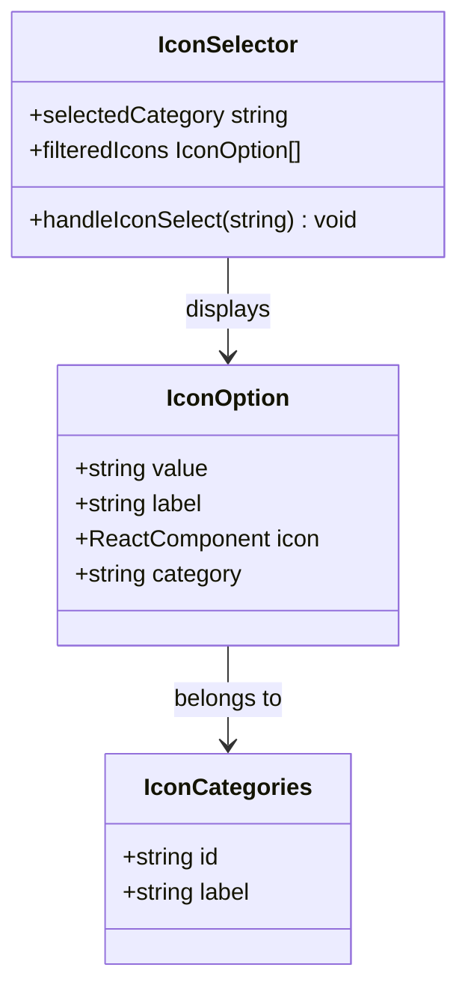

**Diagram sources**
- [page.tsx:29-56](file://src/app/admin/servicios/page.tsx#L29-L56)
- [page.tsx:310-313](file://src/app/admin/servicios/page.tsx#L310-L313)

#### Available Categories and Icons
The system provides five distinct categories with curated icon sets:

| Category | Icons | Purpose |
|----------|-------|---------|
| Nature | Leaf, TreePine, Sun, Mountain, Flower2, Bird, Bug | Environmental themes |
| Water | Droplets, CloudRain, Waves, Droplet | Aquatic resources |
| Air | Wind, CloudSun | Atmospheric conditions |
| Management | Recycle, Tractor | Waste and agricultural management |
| Infrastructure | Building2, Landmark, Factory | Urban and industrial facilities |

**Section sources**
- [page.tsx:29-56](file://src/app/admin/servicios/page.tsx#L29-L56)

### Media Upload Capabilities

#### Media Picker Architecture
The media picker provides a streamlined interface for content creators:

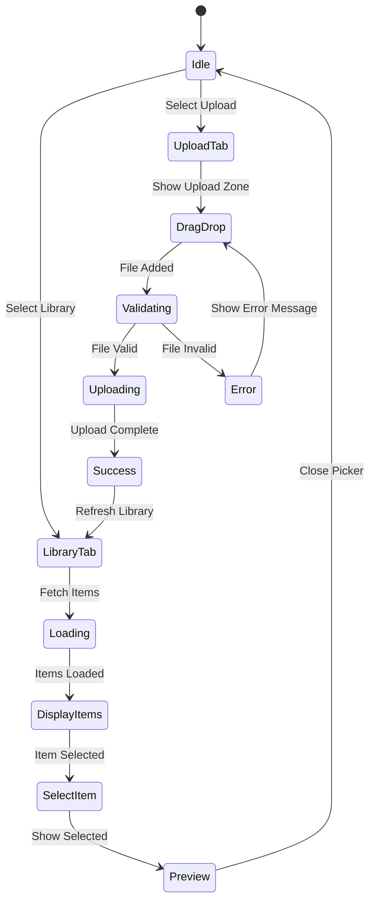

**Diagram sources**
- [media-picker-compact.tsx:122-170](file://src/components/media-picker-compact.tsx#L122-L170)
- [media-picker-compact.tsx:175-290](file://src/components/media-picker-compact.tsx#L175-L290)

#### Upload Validation and Processing
The media upload system implements comprehensive validation:

| Validation Step | Criteria | Limits |
|----------------|----------|--------|
| File Size | Individual file validation | 5MB default, configurable |
| File Type | MIME type checking | Image, video, audio support |
| Duplicate Detection | Similar file identification | Automatic suggestion system |
| Category Assignment | Automatic categorization | Based on file extension |
| Progress Tracking | Real-time upload feedback | Percentage completion |

**Section sources**
- [media-picker-compact.tsx:175-290](file://src/components/media-picker-compact.tsx#L175-L290)

### Service Status Management

#### Featured Services Toggle
The featured service system allows highlighting premium offerings:

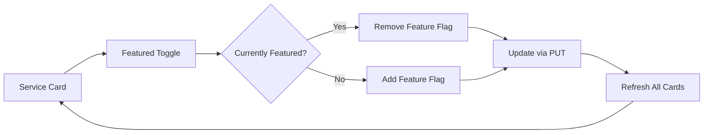

**Diagram sources**
- [page.tsx:232-243](file://src/app/admin/servicios/page.tsx#L232-L243)

#### Activation/Deactivation System
Service activation controls visibility and accessibility:

| Status | Visual Indicator | Impact |
|--------|------------------|---------|
| Active | Green check icon | Visible in listings |
| Inactive | Grayed out appearance | Hidden from public |
| Featured | Amber star badge | Premium positioning |

**Section sources**
- [page.tsx:219-243](file://src/app/admin/servicios/page.tsx#L219-L243)

### Responsive Card-Based Interface

#### Card Layout Design
**Updated** The interface employs a responsive card-based design optimized for admin workflows with dual content display:

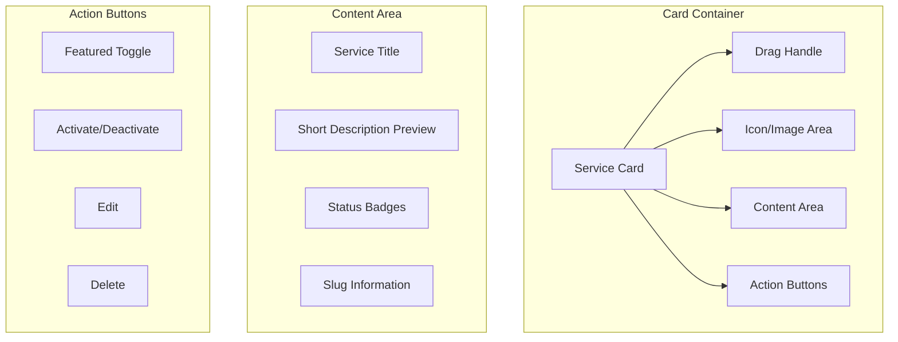

**Diagram sources**
- [page.tsx:374-452](file://src/app/admin/servicios/page.tsx#L374-L452)

#### Responsive Behavior
The interface adapts seamlessly across device sizes:
- Mobile: Stacked layout with touch-friendly controls
- Tablet: Two-column grid with reduced spacing
- Desktop: Multi-column grid with full feature set
- Large screens: Optimized for 4K displays with enhanced readability

**Section sources**
- [page.tsx:374-452](file://src/app/admin/servicios/page.tsx#L374-L452)

## Dependency Analysis

### Component Dependencies

```mermaid
graph TD
ServicesPage["Services Admin Page"] --> EditorJS["Editor.js Component"]
ServicesPage --> MediaPicker["Media Picker"]
ServicesPage --> APIRoute["Services API Route"]
EditorJS --> HeaderTools["Header Tools"]
EditorJS --> ImageTool["Image Tool"]
EditorJS --> VideoTool["Video Tool"]
EditorJS --> AudioTool["Audio Tool"]
EditorJS --> LinkTool["Link Tool"]
MediaPicker --> UploadAPI["Upload API"]
MediaPicker --> LibraryAPI["Library API"]
APIRoute --> Database["Prisma Database"]
APIRoute --> Auth["Authentication"]
subgraph "External Dependencies"
EditorJS --> "@editorjs/*"
MediaPicker --> "Cloudinary"
ServicesPage --> "Lucide Icons"
end
```

**Diagram sources**
- [page.tsx:1-26](file://src/app/admin/servicios/page.tsx#L1-L26)
- [editor-js.tsx:380-396](file://src/components/editor-js.tsx#L380-L396)

### Data Flow Dependencies
**Updated** The system maintains clear data flow boundaries with dual content handling:

1. **Presentation Layer**: React components manage UI state and user interactions
2. **Business Logic**: Service operations coordinate with API endpoints
3. **Data Access**: Prisma ORM handles database operations with enhanced schema
4. **Authentication**: Admin session validation for protected operations

**Section sources**
- [page.tsx:135-154](file://src/app/admin/servicios/page.tsx#L135-L154)
- [route.ts:30-34](file://src/app/api/servicios/route.ts#L30-L34)

## Performance Considerations

### Optimization Strategies
**Updated** The implementation incorporates several performance optimizations for the dual-editor system:

#### Lazy Loading
- Editor.js initialized only when needed
- Media picker components loaded on demand
- API calls debounced during rapid interactions

#### Memory Management
- Proper cleanup of Editor.js instances
- Unsubscribed event listeners
- Efficient state updates with React hooks
- Dual editor data references managed separately

#### Network Optimization
- Batch API requests where possible
- Efficient caching strategies
- Minimal payload sizes for service lists
- Optimized slug generation with client-side validation

### Scalability Factors
- Database indexing on frequently queried fields
- Pagination for large media libraries
- CDN integration for media assets
- Rate limiting for API endpoints
- **Enhanced database schema** with dual content fields

## Troubleshooting Guide

### Common Issues and Solutions

#### Editor.js Initialization Failures
**Symptoms**: Editor fails to load or throws initialization errors
**Causes**: Missing dependencies, script loading conflicts
**Solutions**: 
- Verify Editor.js and plugin installations
- Check for conflicting script loaders
- Ensure proper async/await patterns

#### Dual Editor Synchronization Issues
**Symptoms**: Short and full editors not synchronizing properly
**Causes**: State management conflicts, ref synchronization
**Solutions**:
- Verify editor data refs are properly initialized
- Check for concurrent state updates
- Ensure proper cleanup of editor instances

#### Slug Generation Conflicts
**Symptoms**: Slug conflicts or invalid characters
**Causes**: Non-unique slugs, invalid character input
**Solutions**:
- Implement proper slug validation
- Use timestamp suffixes for duplicates
- Ensure proper normalization of input

#### Media Upload Problems
**Symptoms**: Uploads fail or show timeout errors
**Causes**: Network issues, file size limits, browser compatibility
**Solutions**:
- Check network connectivity and CORS settings
- Verify file size and type restrictions
- Test with different browsers and file formats

#### Authentication Errors
**Symptoms**: API requests return unauthorized status
**Causes**: Session expiration, missing permissions
**Solutions**:
- Implement automatic session refresh
- Redirect to login on 401 responses
- Clear stale authentication tokens

**Section sources**
- [editor-js.tsx:540-543](file://src/components/editor-js.tsx#L540-L543)
- [media-picker-compact.tsx:277-290](file://src/components/media-picker-compact.tsx#L277-L290)
- [route.ts:30-34](file://src/app/api/servicios/route.ts#L30-L34)

## Conclusion
The Services Management Interface in GreenAxis provides a comprehensive solution for content administrators to manage service offerings effectively. **Updated** with enhanced dual-editor capabilities, improved slug generation, and dual-description management, the interface delivers a sophisticated content management experience.

Key strengths of the enhanced implementation include:
- Complete CRUD functionality with intuitive UI
- **Advanced dual-editor system** for short and full content management
- **Flexible slug generation** with manual customization and automatic generation
- **Intelligent dual-description system** for optimal content presentation
- Advanced content editing with block-based structure
- Comprehensive media handling with validation
- Responsive design optimized for admin workflows
- Secure authentication and authorization
- Performance optimizations for large datasets
- **Enhanced database schema** supporting dual content fields

The modular architecture supports future enhancements and maintains clean separation of concerns, making it maintainable and extensible for evolving requirements. The dual-editor system ensures content creators can efficiently manage both list-view and detail-page content, while the improved slug generation system provides flexibility and SEO optimization.