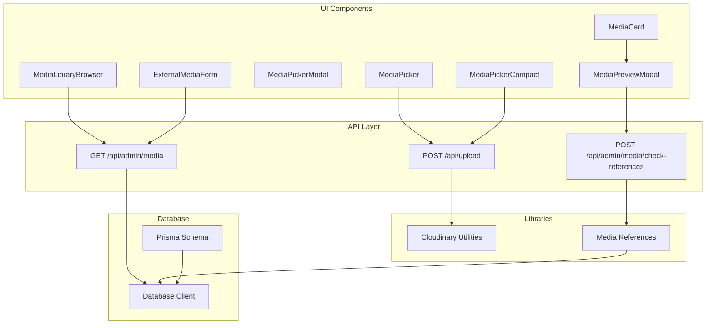
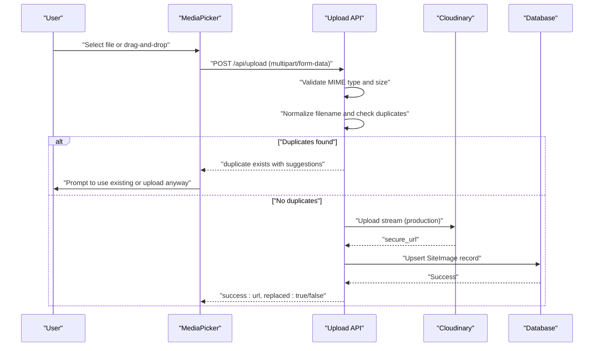
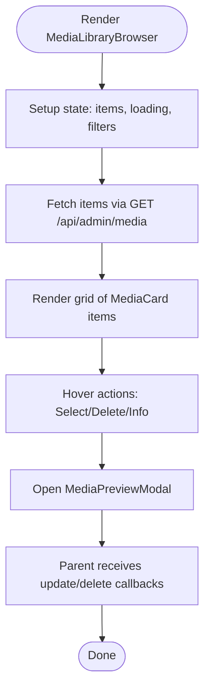
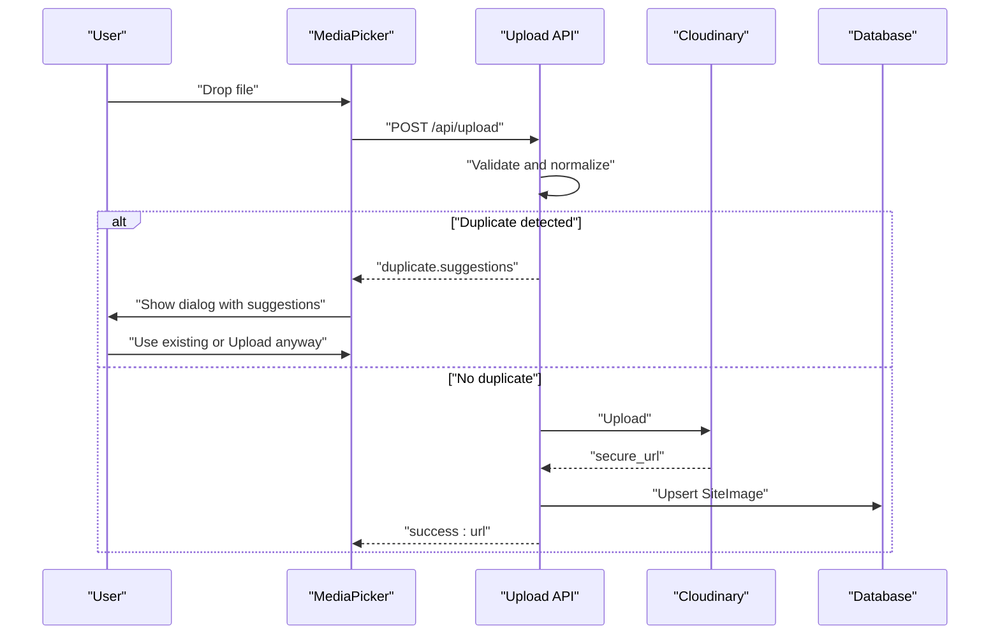
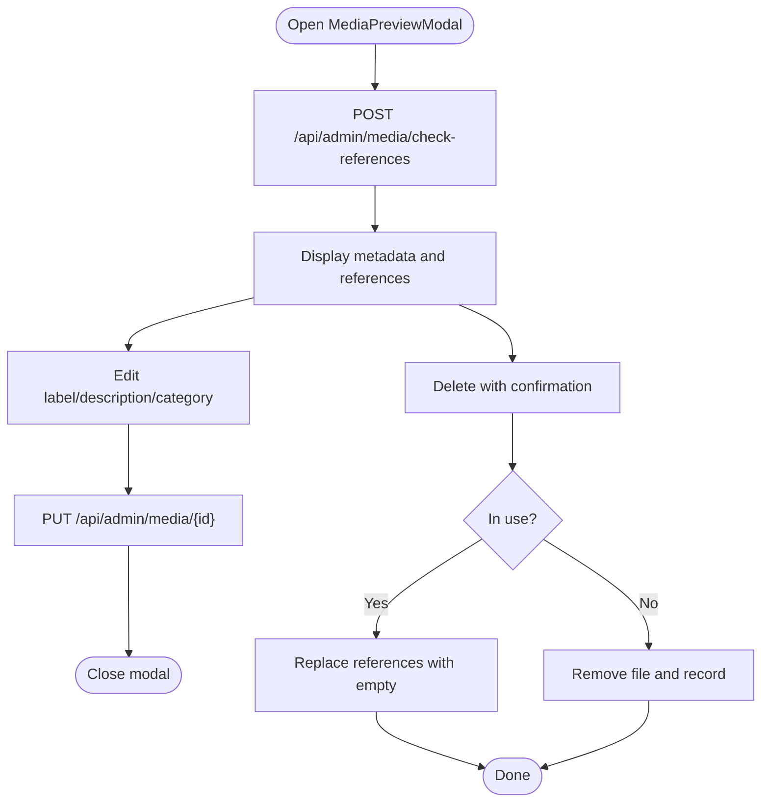
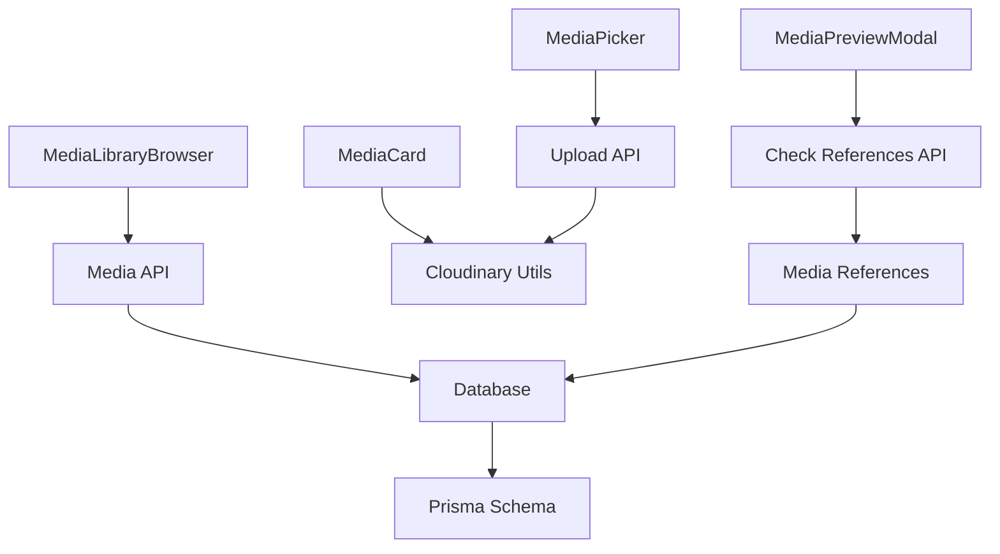

# Media Library Management

<cite>
**Referenced Files in This Document**
- [media-library-browser.tsx](file://src/components/media-library-browser.tsx)
- [media-picker.tsx](file://src/components/media-picker.tsx)
- [media-picker-modal.tsx](file://src/components/media-picker-modal.tsx)
- [media-picker-compact.tsx](file://src/components/media-picker-compact.tsx)
- [media-card.tsx](file://src/components/media-card.tsx)
- [media-preview-modal.tsx](file://src/components/media-preview-modal.tsx)
- [external-media-form.tsx](file://src/components/external-media-form.tsx)
- [cloudinary.ts](file://src/lib/cloudinary.ts)
- [media-references.ts](file://src/lib/media-references.ts)
- [route.ts](file://src/app/api/admin/media/route.ts)
- [route.ts](file://src/app/api/upload/route.ts)
- [route.ts](file://src/app/api/admin/media/check-references/route.ts)
- [page.tsx](file://src/app/admin/imagenes/page.tsx)
- [schema.prisma](file://prisma/schema.prisma)
- [db.ts](file://src/lib/db.ts)
</cite>

## Table of Contents
1. [Introduction](#introduction)
2. [Project Structure](#project-structure)
3. [Core Components](#core-components)
4. [Architecture Overview](#architecture-overview)
5. [Detailed Component Analysis](#detailed-component-analysis)
6. [Dependency Analysis](#dependency-analysis)
7. [Performance Considerations](#performance-considerations)
8. [Troubleshooting Guide](#troubleshooting-guide)
9. [Conclusion](#conclusion)

## Introduction
This document describes the media library management system, covering the media browser interface, upload functionality with Cloudinary integration, duplicate detection mechanisms, and reference tracking. It explains the media picker components, modal interfaces, and drag-and-drop upload capabilities. It also details media organization, filtering, search functionality, and bulk operations, along with Cloudinary CDN integration, file optimization, and media validation processes.

## Project Structure
The media library system is composed of:
- UI components for browsing, selecting, and previewing media
- Upload handlers for local development and production Cloudinary integration
- Reference tracking utilities for safe deletion and updates
- API endpoints for listing, validating, and managing media
- Database schema for storing media metadata

**Diagram sources**
- [media-library-browser.tsx:1-362](file://src/components/media-library-browser.tsx#L1-L362)
- [media-picker.tsx:1-754](file://src/components/media-picker.tsx#L1-L754)
- [media-picker-modal.tsx:1-70](file://src/components/media-picker-modal.tsx#L1-L70)
- [media-picker-compact.tsx:1-691](file://src/components/media-picker-compact.tsx#L1-L691)
- [media-card.tsx:1-295](file://src/components/media-card.tsx#L1-L295)
- [media-preview-modal.tsx:1-516](file://src/components/media-preview-modal.tsx#L1-L516)
- [external-media-form.tsx:1-302](file://src/components/external-media-form.tsx#L1-L302)
- [route.ts:1-150](file://src/app/api/admin/media/route.ts#L1-L150)
- [route.ts:1-452](file://src/app/api/upload/route.ts#L1-L452)
- [route.ts:1-86](file://src/app/api/admin/media/check-references/route.ts#L1-L86)
- [cloudinary.ts:1-119](file://src/lib/cloudinary.ts#L1-L119)
- [media-references.ts:1-334](file://src/lib/media-references.ts#L1-L334)
- [schema.prisma:120-135](file://prisma/schema.prisma#L120-L135)
- [db.ts:1-21](file://src/lib/db.ts#L1-L21)

**Section sources**
- [media-library-browser.tsx:1-362](file://src/components/media-library-browser.tsx#L1-L362)
- [media-picker.tsx:1-754](file://src/components/media-picker.tsx#L1-L754)
- [media-picker-modal.tsx:1-70](file://src/components/media-picker-modal.tsx#L1-L70)
- [media-picker-compact.tsx:1-691](file://src/components/media-picker-compact.tsx#L1-L691)
- [media-card.tsx:1-295](file://src/components/media-card.tsx#L1-L295)
- [media-preview-modal.tsx:1-516](file://src/components/media-preview-modal.tsx#L1-L516)
- [external-media-form.tsx:1-302](file://src/components/external-media-form.tsx#L1-L302)
- [route.ts:1-150](file://src/app/api/admin/media/route.ts#L1-L150)
- [route.ts:1-452](file://src/app/api/upload/route.ts#L1-L452)
- [route.ts:1-86](file://src/app/api/admin/media/check-references/route.ts#L1-L86)
- [cloudinary.ts:1-119](file://src/lib/cloudinary.ts#L1-L119)
- [media-references.ts:1-334](file://src/lib/media-references.ts#L1-L334)
- [schema.prisma:120-135](file://prisma/schema.prisma#L120-L135)
- [db.ts:1-21](file://src/lib/db.ts#L1-L21)

## Core Components
- MediaLibraryBrowser: Grid-based browser with search, category filtering, infinite scroll, and preview modal integration.
- MediaPicker: Unified picker supporting library browsing and upload with drag-and-drop, progress tracking, and duplicate detection.
- MediaPickerModal: Modal wrapper around MediaPicker for full-screen selection.
- MediaPickerCompact: Lightweight picker optimized for small panels with reduced item load.
- MediaCard: Reusable card with hover actions, usage badges, and lazy-loading support.
- MediaPreviewModal: Detailed preview with metadata, usage references, editing, and deletion workflow.
- ExternalMediaForm: Registers externally hosted media (e.g., Cloudinary) into the library.
- Cloudinary utilities: URL optimization helpers for automatic format, quality, and width transformations.
- Media references: Extraction and update utilities for tracking and safely removing media references.

**Section sources**
- [media-library-browser.tsx:19-362](file://src/components/media-library-browser.tsx#L19-L362)
- [media-picker.tsx:22-754](file://src/components/media-picker.tsx#L22-L754)
- [media-picker-modal.tsx:12-70](file://src/components/media-picker-modal.tsx#L12-L70)
- [media-picker-compact.tsx:94-691](file://src/components/media-picker-compact.tsx#L94-L691)
- [media-card.tsx:16-295](file://src/components/media-card.tsx#L16-L295)
- [media-preview-modal.tsx:29-516](file://src/components/media-preview-modal.tsx#L29-L516)
- [external-media-form.tsx:21-302](file://src/components/external-media-form.tsx#L21-L302)
- [cloudinary.ts:8-119](file://src/lib/cloudinary.ts#L8-L119)
- [media-references.ts:14-334](file://src/lib/media-references.ts#L14-L334)

## Architecture Overview
The system integrates UI components with API endpoints and a database-backed media catalog. Uploads leverage Cloudinary in production and local storage in development. Duplicate detection normalizes filenames and compares against existing entries. Reference tracking ensures safe deletion by scanning across relevant content tables.

**Diagram sources**
- [media-picker.tsx:198-316](file://src/components/media-picker.tsx#L198-L316)
- [route.ts:150-392](file://src/app/api/upload/route.ts#L150-L392)
- [cloudinary.ts:1-119](file://src/lib/cloudinary.ts#L1-L119)
- [schema.prisma:120-135](file://prisma/schema.prisma#L120-L135)

## Detailed Component Analysis

### MediaLibraryBrowser
- Provides a grid view of media items with lazy-loaded thumbnails.
- Implements search via debounced input and category filtering.
- Uses infinite scroll with an intersection observer and fallback pagination.
- Integrates with MediaPreviewModal for detailed editing and deletion.
- Supports external media registration via ExternalMediaForm.

**Diagram sources**
- [media-library-browser.tsx:69-362](file://src/components/media-library-browser.tsx#L69-L362)
- [media-card.tsx:103-295](file://src/components/media-card.tsx#L103-L295)
- [media-preview-modal.tsx:97-516](file://src/components/media-preview-modal.tsx#L97-L516)

**Section sources**
- [media-library-browser.tsx:19-362](file://src/components/media-library-browser.tsx#L19-L362)
- [media-card.tsx:16-295](file://src/components/media-card.tsx#L16-L295)
- [media-preview-modal.tsx:29-516](file://src/components/media-preview-modal.tsx#L29-L516)

### MediaPicker
- Unified component combining library browsing and upload.
- Drag-and-drop zone with visual feedback and progress bar.
- Duplicate detection prompts with suggestion previews.
- File validation by MIME type and size limits per environment.
- Integration with Cloudinary in production and local filesystem in development.

**Diagram sources**
- [media-picker.tsx:198-316](file://src/components/media-picker.tsx#L198-L316)
- [route.ts:150-392](file://src/app/api/upload/route.ts#L150-L392)

**Section sources**
- [media-picker.tsx:22-754](file://src/components/media-picker.tsx#L22-L754)
- [route.ts:150-392](file://src/app/api/upload/route.ts#L150-L392)

### MediaPickerModal
- Modal wrapper around MediaPicker with configurable sizing and title.
- Automatically closes after selection and invokes parent callback.

**Section sources**
- [media-picker-modal.tsx:12-70](file://src/components/media-picker-modal.tsx#L12-L70)

### MediaPickerCompact
- Optimized for small panels, loading only the 4 most recent items.
- Simplified drag-and-drop zone and duplicate warning dialog.
- Links to the full media library for comprehensive browsing.

**Section sources**
- [media-picker-compact.tsx:94-691](file://src/components/media-picker-compact.tsx#L94-L691)

### MediaCard
- Reusable card with hover actions, usage count badge, and lazy-loading.
- Displays file type indicator for non-image media.
- Integrates with Cloudinary optimization utilities for admin thumbnails.

**Section sources**
- [media-card.tsx:16-295](file://src/components/media-card.tsx#L16-L295)
- [cloudinary.ts:8-119](file://src/lib/cloudinary.ts#L8-L119)

### MediaPreviewModal
- Full preview with image/video/audio players.
- Displays metadata and usage references with edit links.
- Editable fields for label, description, and category.
- Safe deletion workflow with reference checks and confirmation dialogs.

**Diagram sources**
- [media-preview-modal.tsx:139-261](file://src/components/media-preview-modal.tsx#L139-L261)
- [route.ts:25-86](file://src/app/api/admin/media/check-references/route.ts#L25-L86)
- [media-references.ts:65-181](file://src/lib/media-references.ts#L65-L181)

**Section sources**
- [media-preview-modal.tsx:29-516](file://src/components/media-preview-modal.tsx#L29-L516)
- [route.ts:25-86](file://src/app/api/admin/media/check-references/route.ts#L25-L86)
- [media-references.ts:14-334](file://src/lib/media-references.ts#L14-L334)

### ExternalMediaForm
- Registers externally hosted media (e.g., Cloudinary) by URL.
- Auto-detects media type and suggests filename.
- Creates a unique key and persists metadata to the database.

**Section sources**
- [external-media-form.tsx:21-302](file://src/components/external-media-form.tsx#L21-L302)

### Cloudinary Integration and Optimization
- URL optimization utilities inject automatic format, quality, and width transformations.
- Helpers for hero, thumbnail, service, and admin thumbnail sizes.
- Production uploads stream to Cloudinary; development stores files locally.

**Section sources**
- [cloudinary.ts:8-119](file://src/lib/cloudinary.ts#L8-L119)
- [route.ts:272-324](file://src/app/api/upload/route.ts#L272-L324)

### Media References and Validation
- Extracts media URLs from EditorJS blocks for comprehensive reference tracking.
- Scans multiple content tables for references and generates edit links.
- Safely updates references when replacing or deleting media.

**Section sources**
- [media-references.ts:14-334](file://src/lib/media-references.ts#L14-L334)

## Dependency Analysis
The system exhibits clear separation of concerns:
- UI components depend on shared utilities and API endpoints.
- API endpoints depend on Cloudinary SDK and database client.
- Database schema defines SiteImage model for media metadata.

**Diagram sources**
- [media-picker.tsx:106-754](file://src/components/media-picker.tsx#L106-L754)
- [media-library-browser.tsx:69-136](file://src/components/media-library-browser.tsx#L69-L136)
- [media-preview-modal.tsx:139-261](file://src/components/media-preview-modal.tsx#L139-L261)
- [media-card.tsx:5-6](file://src/components/media-card.tsx#L5-L6)
- [route.ts:1-452](file://src/app/api/upload/route.ts#L1-L452)
- [route.ts:1-150](file://src/app/api/admin/media/route.ts#L1-L150)
- [route.ts:25-86](file://src/app/api/admin/media/check-references/route.ts#L25-L86)
- [cloudinary.ts:1-119](file://src/lib/cloudinary.ts#L1-L119)
- [media-references.ts:1-334](file://src/lib/media-references.ts#L1-L334)
- [schema.prisma:120-135](file://prisma/schema.prisma#L120-L135)
- [db.ts:1-21](file://src/lib/db.ts#L1-L21)

**Section sources**
- [media-picker.tsx:106-754](file://src/components/media-picker.tsx#L106-L754)
- [media-library-browser.tsx:69-136](file://src/components/media-library-browser.tsx#L69-L136)
- [media-preview-modal.tsx:139-261](file://src/components/media-preview-modal.tsx#L139-L261)
- [media-card.tsx:5-6](file://src/components/media-card.tsx#L5-L6)
- [route.ts:1-452](file://src/app/api/upload/route.ts#L1-L452)
- [route.ts:1-150](file://src/app/api/admin/media/route.ts#L1-L150)
- [route.ts:25-86](file://src/app/api/admin/media/check-references/route.ts#L25-L86)
- [cloudinary.ts:1-119](file://src/lib/cloudinary.ts#L1-L119)
- [media-references.ts:1-334](file://src/lib/media-references.ts#L1-L334)
- [schema.prisma:120-135](file://prisma/schema.prisma#L120-L135)
- [db.ts:1-21](file://src/lib/db.ts#L1-L21)

## Performance Considerations
- MediaLibraryBrowser and MediaPickerCompact implement infinite scroll and reduced item loads respectively to minimize initial payload.
- MediaCard uses lazy loading for images to reduce bandwidth and render cost.
- Cloudinary optimization utilities apply automatic format and quality transformations to reduce file sizes.
- API endpoints paginate results and filter by type to keep queries efficient.

## Troubleshooting Guide
Common issues and resolutions:
- Upload failures due to file size: Verify environment-specific size limits and consider using Cloudinary Console for large files.
- Duplicate detection prompts: Use the suggested existing file or explicitly choose to upload anyway.
- Reference conflicts during deletion: The system will show usage locations and allow forced replacement of references.
- Cloudinary configuration errors: Ensure proper environment variables are set for Cloudinary credentials.

**Section sources**
- [route.ts:176-200](file://src/app/api/upload/route.ts#L176-L200)
- [media-picker.tsx:274-286](file://src/components/media-picker.tsx#L274-L286)
- [media-preview-modal.tsx:221-261](file://src/components/media-preview-modal.tsx#L221-L261)
- [route.ts:9-28](file://src/app/api/upload/route.ts#L9-L28)

## Conclusion
The media library management system provides a robust, scalable solution for media browsing, uploading, and governance. Its modular UI components integrate seamlessly with Cloudinary-backed upload workflows, comprehensive duplicate detection, and reference tracking for safe media lifecycle management. The architecture supports both development and production environments while maintaining performance and usability.