# Core Features Implementation

<cite>
**Referenced Files in This Document**
- [README.md](file://README.md)
- [src/app/layout.tsx](file://src/app/layout.tsx)
- [src/components/public-layout.tsx](file://src/components/public-layout.tsx)
- [src/components/admin-layout.tsx](file://src/components/admin-layout.tsx)
- [src/middleware.ts](file://src/middleware.ts)
- [src/components/hero-carousel.tsx](file://src/components/hero-carousel.tsx)
- [src/components/services-section.tsx](file://src/components/services-section.tsx)
- [src/components/news-section.tsx](file://src/components/news-section.tsx)
- [src/components/contact-page-content.tsx](file://src/components/contact-page-content.tsx)
- [src/components/about-page-content.tsx](file://src/components/about-page-content.tsx)
- [src/components/editor-js.tsx](file://src/components/editor-js.tsx)
- [src/components/media-library-browser.tsx](file://src/components/media-library-browser.tsx)
- [src/components/media-picker.tsx](file://src/components/media-picker.tsx)
- [src/lib/cloudinary.ts](file://src/lib/cloudinary.ts)
- [src/lib/media-references.ts](file://src/lib/media-references.ts)
</cite>

## Table of Contents
1. [Introduction](#introduction)
2. [Project Structure](#project-structure)
3. [Core Components](#core-components)
4. [Architecture Overview](#architecture-overview)
5. [Detailed Component Analysis](#detailed-component-analysis)
6. [Dependency Analysis](#dependency-analysis)
7. [Performance Considerations](#performance-considerations)
8. [Troubleshooting Guide](#troubleshooting-guide)
9. [Conclusion](#conclusion)

## Introduction
This document explains the core features implementation of GreenAxis, covering both the public website and administrative CMS. It details the landing page hero carousel, services catalog with detailed pages, news/blog system with pagination, about us page content management, contact form functionality, and legal pages management. Administrative features include dashboard design, content management system, media library implementation, user management and permissions, and configuration settings. Rich text editing is powered by Editor.js with custom tools, media management integrates with Cloudinary, and drag-and-drop enables content reordering. The document outlines implementation patterns, component relationships, and user workflow optimization.

## Project Structure
GreenAxis follows a Next.js App Router architecture with a clear separation between public-facing pages and admin routes. The public site uses dynamic metadata generation and a shared public layout. The admin area is protected and provides centralized content management with a sidebar navigation and theme toggler.

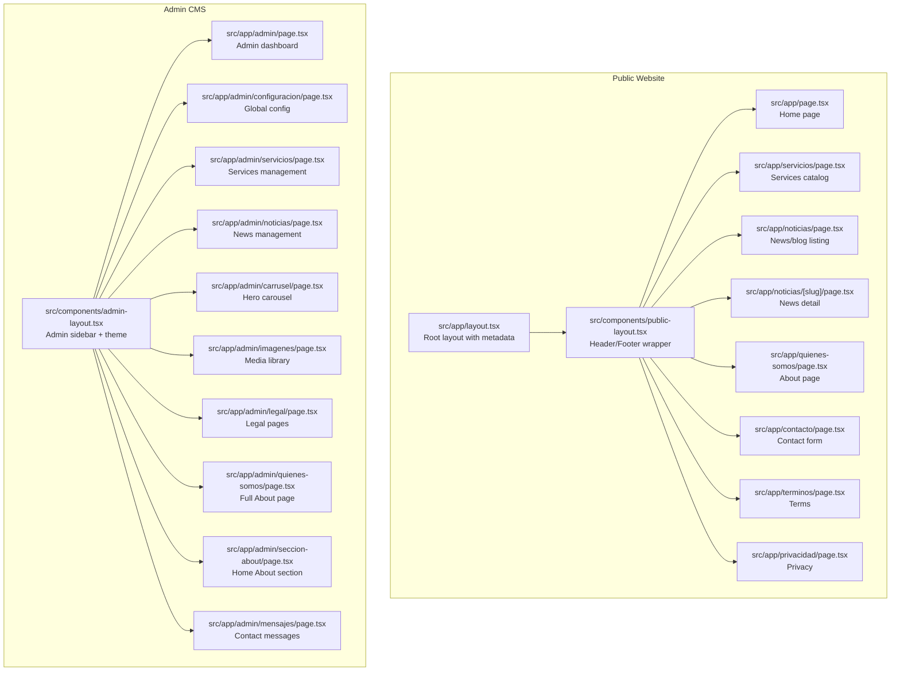

**Diagram sources**
- [src/app/layout.tsx:1-80](file://src/app/layout.tsx#L1-L80)
- [src/components/public-layout.tsx:1-55](file://src/components/public-layout.tsx#L1-L55)
- [src/components/admin-layout.tsx:1-384](file://src/components/admin-layout.tsx#L1-L384)

**Section sources**
- [README.md:152-216](file://README.md#L152-L216)
- [src/app/layout.tsx:1-80](file://src/app/layout.tsx#L1-L80)
- [src/components/public-layout.tsx:1-55](file://src/components/public-layout.tsx#L1-L55)
- [src/components/admin-layout.tsx:1-384](file://src/components/admin-layout.tsx#L1-L384)

## Core Components
This section highlights the primary building blocks powering GreenAxis:

- Hero Carousel: Full-width animated hero with gradient overlays, CTA buttons, and optional whole-slide links.
- Services Section: Grid of service cards with icons, images, and featured badges.
- News Section: Card-based listing with thumbnails, dates, and author metadata.
- Contact Page Content: Form with validation, rate limiting, and Google Maps integration.
- About Page Content: Comprehensive page with history, mission, vision, values, stats, team, certifications, location, and CTA.
- Editor.js Rich Text: Custom tools for images, videos, audio, links, colors, markers, and headings.
- Media Library Browser: Paginated, searchable, filterable media grid with preview and external media support.
- Media Picker: Unified component for library browsing and file upload with drag-and-drop and duplicate detection.
- Cloudinary Utilities: URL transformation helpers for responsive and optimized assets.
- Media References: Cross-table scanning and reference updates for safe media deletion.

**Section sources**
- [src/components/hero-carousel.tsx:1-305](file://src/components/hero-carousel.tsx#L1-L305)
- [src/components/services-section.tsx:1-182](file://src/components/services-section.tsx#L1-L182)
- [src/components/news-section.tsx:1-138](file://src/components/news-section.tsx#L1-L138)
- [src/components/contact-page-content.tsx:1-414](file://src/components/contact-page-content.tsx#L1-L414)
- [src/components/about-page-content.tsx:1-385](file://src/components/about-page-content.tsx#L1-L385)
- [src/components/editor-js.tsx:1-850](file://src/components/editor-js.tsx#L1-L850)
- [src/components/media-library-browser.tsx:1-362](file://src/components/media-library-browser.tsx#L1-L362)
- [src/components/media-picker.tsx:1-754](file://src/components/media-picker.tsx#L1-L754)
- [src/lib/cloudinary.ts:1-119](file://src/lib/cloudinary.ts#L1-L119)
- [src/lib/media-references.ts:1-334](file://src/lib/media-references.ts#L1-L334)

## Architecture Overview
GreenAxis uses Next.js App Router with a hybrid public/admin architecture. The public site generates metadata dynamically from the database and renders reusable components for layout and sections. The admin area is protected by middleware and provides CRUD interfaces for content, media, and configuration. Cloudinary handles media optimization and delivery, while Prisma manages data persistence.

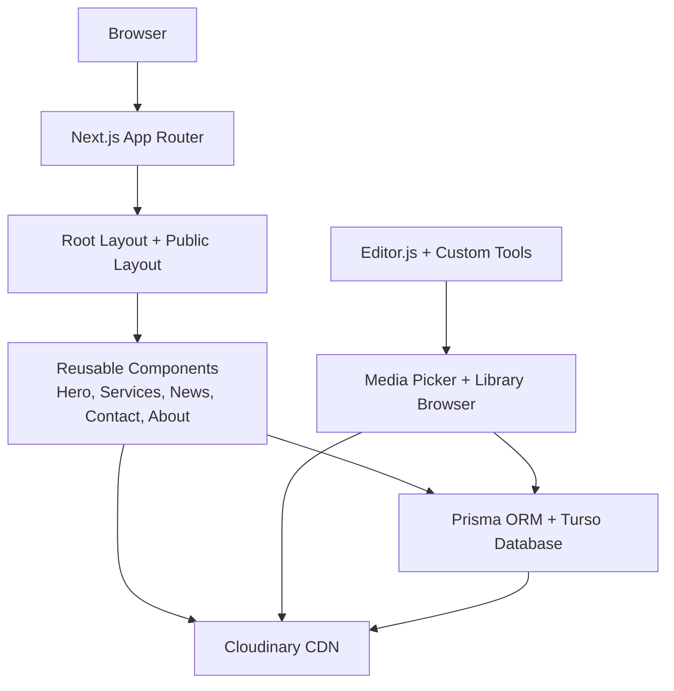

**Diagram sources**
- [src/app/layout.tsx:1-80](file://src/app/layout.tsx#L1-L80)
- [src/components/public-layout.tsx:1-55](file://src/components/public-layout.tsx#L1-L55)
- [src/components/editor-js.tsx:1-850](file://src/components/editor-js.tsx#L1-L850)
- [src/components/media-library-browser.tsx:1-362](file://src/components/media-library-browser.tsx#L1-L362)
- [src/components/media-picker.tsx:1-754](file://src/components/media-picker.tsx#L1-L754)
- [src/lib/cloudinary.ts:1-119](file://src/lib/cloudinary.ts#L1-L119)
- [README.md:67-108](file://README.md#L67-L108)

**Section sources**
- [README.md:67-108](file://README.md#L67-L108)
- [src/app/layout.tsx:1-80](file://src/app/layout.tsx#L1-L80)
- [src/components/public-layout.tsx:1-55](file://src/components/public-layout.tsx#L1-L55)

## Detailed Component Analysis

### Public Website Features

#### Hero Carousel
The hero carousel renders multiple slides with optional gradient overlays, animated zoom transitions, and navigation controls. It supports whole-slide links and integrates Cloudinary for responsive image optimization.

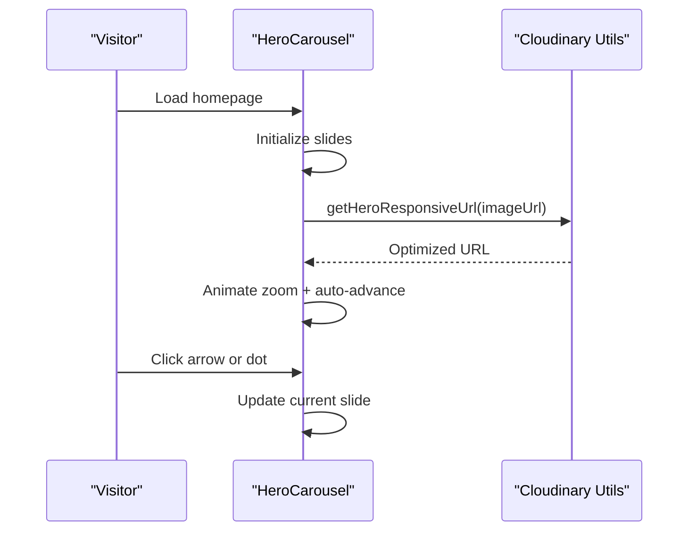

**Diagram sources**
- [src/components/hero-carousel.tsx:1-305](file://src/components/hero-carousel.tsx#L1-L305)
- [src/lib/cloudinary.ts:92-98](file://src/lib/cloudinary.ts#L92-L98)

**Section sources**
- [src/components/hero-carousel.tsx:1-305](file://src/components/hero-carousel.tsx#L1-L305)
- [src/lib/cloudinary.ts:92-98](file://src/lib/cloudinary.ts#L92-L98)

#### Services Catalog
The services section displays a grid of service cards, prioritizing featured services and linking to either slug-based or anchor-based detail pages.

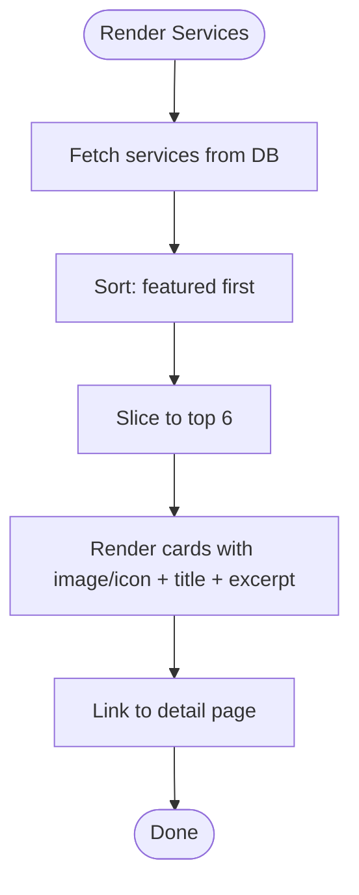

**Diagram sources**
- [src/components/services-section.tsx:1-182](file://src/components/services-section.tsx#L1-L182)

**Section sources**
- [src/components/services-section.tsx:1-182](file://src/components/services-section.tsx#L1-L182)

#### News/Blog System
The news section presents a responsive grid of articles with thumbnails, publication dates, and excerpts. Pagination is handled via infinite scroll with a 50-item page size.

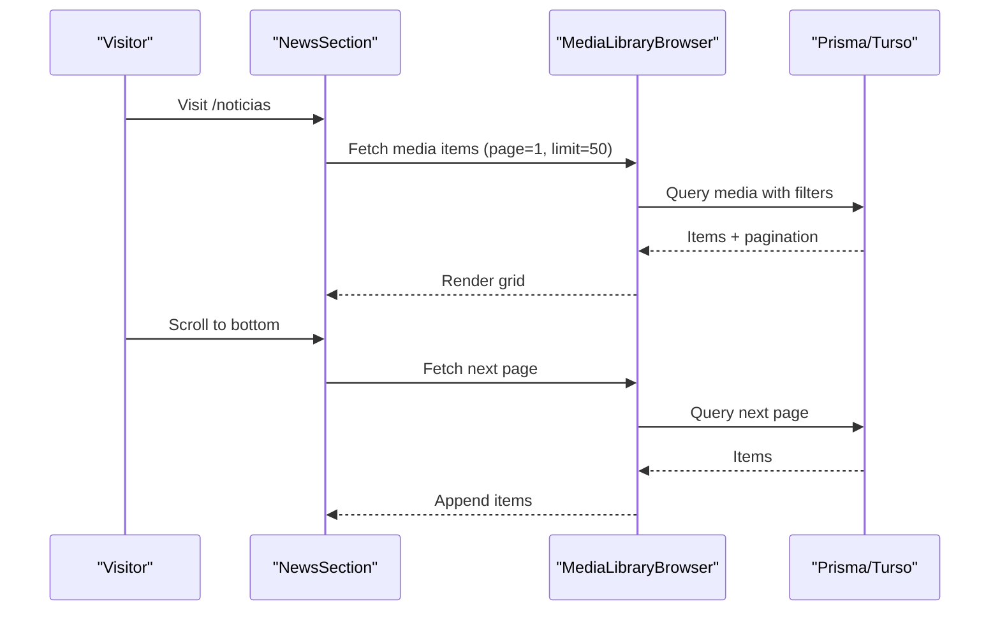

**Diagram sources**
- [src/components/news-section.tsx:1-138](file://src/components/news-section.tsx#L1-L138)
- [src/components/media-library-browser.tsx:1-362](file://src/components/media-library-browser.tsx#L1-L362)

**Section sources**
- [src/components/news-section.tsx:1-138](file://src/components/news-section.tsx#L1-L138)
- [src/components/media-library-browser.tsx:1-362](file://src/components/media-library-browser.tsx#L1-L362)

#### About Us Page
The about page content is highly structured with sections for history, mission, vision, values, statistics, team, certifications, location, and a final CTA. It parses JSON content fields and renders icons and images.

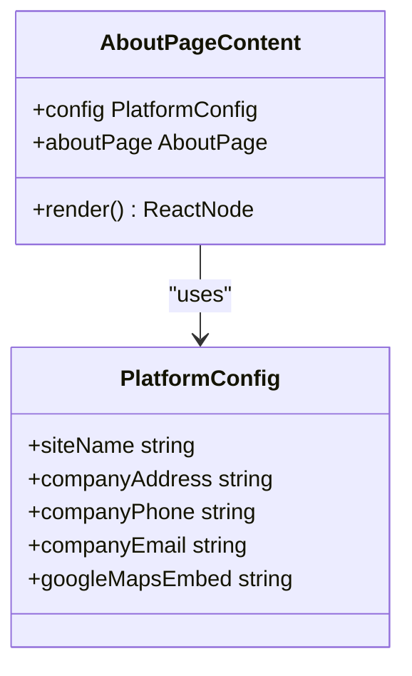

**Diagram sources**
- [src/components/about-page-content.tsx:1-385](file://src/components/about-page-content.tsx#L1-L385)

**Section sources**
- [src/components/about-page-content.tsx:1-385](file://src/components/about-page-content.tsx#L1-L385)

#### Contact Form
The contact form validates inputs, enforces privacy consent, and submits to a rate-limited endpoint. It integrates with Google Maps embed or external links.

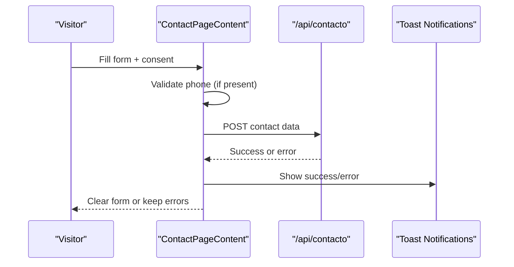

**Diagram sources**
- [src/components/contact-page-content.tsx:1-414](file://src/components/contact-page-content.tsx#L1-L414)
- [src/middleware.ts:1-58](file://src/middleware.ts#L1-L58)

**Section sources**
- [src/components/contact-page-content.tsx:1-414](file://src/components/contact-page-content.tsx#L1-L414)
- [src/middleware.ts:1-58](file://src/middleware.ts#L1-L58)

### Administrative Features

#### Dashboard and Layout
The admin layout provides a responsive sidebar, theme toggle, logout, and account deletion flow. It fetches platform configuration for branding and admin counts for permission checks.

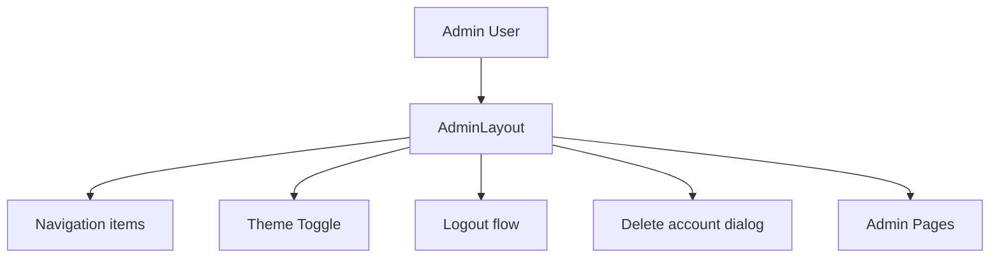

**Diagram sources**
- [src/components/admin-layout.tsx:1-384](file://src/components/admin-layout.tsx#L1-L384)

**Section sources**
- [src/components/admin-layout.tsx:1-384](file://src/components/admin-layout.tsx#L1-L384)

#### Rich Text Editing with Editor.js
Editor.js is configured with custom tools for headings, lists, quotes, links, colors, markers, and media. It integrates with the media picker and Cloudinary upload pipeline.

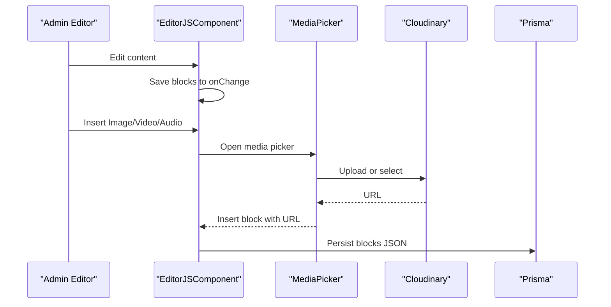

**Diagram sources**
- [src/components/editor-js.tsx:1-850](file://src/components/editor-js.tsx#L1-L850)
- [src/components/media-picker.tsx:1-754](file://src/components/media-picker.tsx#L1-L754)
- [src/lib/cloudinary.ts:1-119](file://src/lib/cloudinary.ts#L1-L119)

**Section sources**
- [src/components/editor-js.tsx:1-850](file://src/components/editor-js.tsx#L1-L850)
- [src/components/media-picker.tsx:1-754](file://src/components/media-picker.tsx#L1-L754)
- [src/lib/cloudinary.ts:1-119](file://src/lib/cloudinary.ts#L1-L119)

#### Media Library and Management
The media library supports infinite scroll pagination, search, category filtering, and preview modals. It integrates with Cloudinary and tracks media references across content tables.

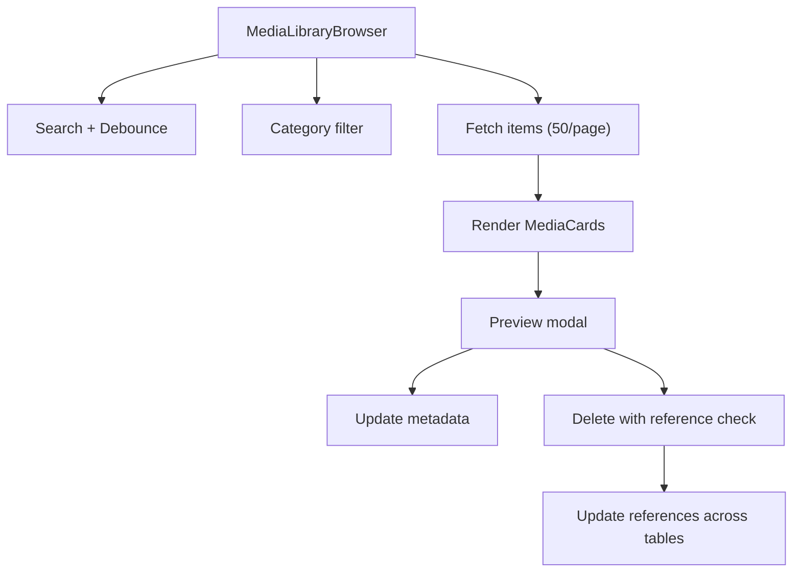

**Diagram sources**
- [src/components/media-library-browser.tsx:1-362](file://src/components/media-library-browser.tsx#L1-L362)
- [src/lib/media-references.ts:1-334](file://src/lib/media-references.ts#L1-L334)

**Section sources**
- [src/components/media-library-browser.tsx:1-362](file://src/components/media-library-browser.tsx#L1-L362)
- [src/lib/media-references.ts:1-334](file://src/lib/media-references.ts#L1-L334)

#### Drag-and-Drop Reordering
Drag-and-drop is used in admin areas to reorder carousel slides and services. The implementation leverages floss-based drag-and-drop libraries and persists order updates to the database.

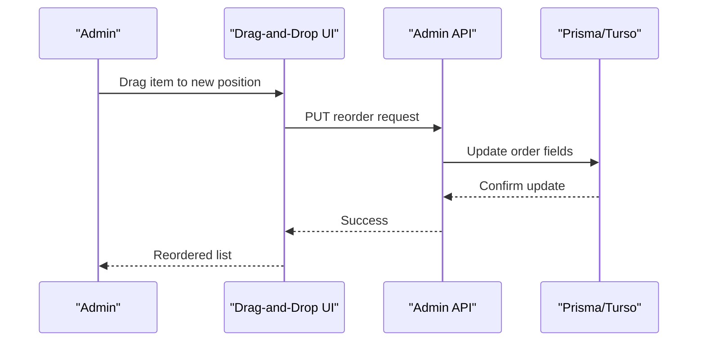

**Diagram sources**
- [README.md:37-37](file://README.md#L37-L37)

**Section sources**
- [README.md:37-37](file://README.md#L37-L37)

## Dependency Analysis
The system exhibits strong cohesion within feature groups and low coupling between public and admin concerns. Key dependencies include:

- Cloudinary utilities for URL transformation and responsive optimization.
- Media references module for cross-table scanning and safe deletion.
- Middleware for security headers and rate limiting.
- Prisma for database operations and Turso for distributed storage.

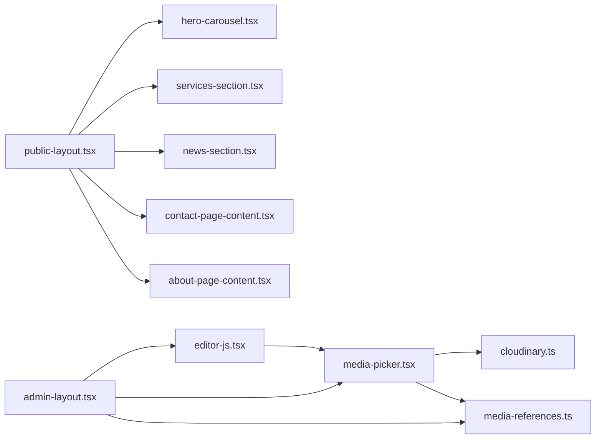

**Diagram sources**
- [src/components/public-layout.tsx:1-55](file://src/components/public-layout.tsx#L1-L55)
- [src/components/hero-carousel.tsx:1-305](file://src/components/hero-carousel.tsx#L1-L305)
- [src/components/services-section.tsx:1-182](file://src/components/services-section.tsx#L1-L182)
- [src/components/news-section.tsx:1-138](file://src/components/news-section.tsx#L1-L138)
- [src/components/contact-page-content.tsx:1-414](file://src/components/contact-page-content.tsx#L1-L414)
- [src/components/about-page-content.tsx:1-385](file://src/components/about-page-content.tsx#L1-L385)
- [src/components/editor-js.tsx:1-850](file://src/components/editor-js.tsx#L1-L850)
- [src/components/media-picker.tsx:1-754](file://src/components/media-picker.tsx#L1-L754)
- [src/lib/cloudinary.ts:1-119](file://src/lib/cloudinary.ts#L1-L119)
- [src/lib/media-references.ts:1-334](file://src/lib/media-references.ts#L1-L334)
- [src/components/admin-layout.tsx:1-384](file://src/components/admin-layout.tsx#L1-L384)

**Section sources**
- [src/components/public-layout.tsx:1-55](file://src/components/public-layout.tsx#L1-L55)
- [src/components/admin-layout.tsx:1-384](file://src/components/admin-layout.tsx#L1-L384)
- [src/lib/cloudinary.ts:1-119](file://src/lib/cloudinary.ts#L1-L119)
- [src/lib/media-references.ts:1-334](file://src/lib/media-references.ts#L1-L334)

## Performance Considerations
- Cloudinary optimization: Automatic format and quality adjustments reduce payload sizes and improve load times globally.
- Responsive images: Next.js Image with Cloudinary loader ensures appropriate sizing and srcset generation.
- Lazy loading: Images and iframes are lazy-loaded to minimize initial bundle weight.
- Infinite scroll: Efficient pagination reduces memory usage and improves perceived performance.
- CDN distribution: Cloudinary’s edge network accelerates asset delivery across regions.
- Bundle optimization: Next.js output standalone and tree shaking reduce client-side JavaScript.

[No sources needed since this section provides general guidance]

## Troubleshooting Guide
Common issues and resolutions:

- Media upload failures:
  - Symptom: Upload errors or 413 responses.
  - Cause: File exceeds size limits.
  - Resolution: Use Cloudinary Console for large files or compress locally.
  - Related code: [src/components/media-picker.tsx:200-316](file://src/components/media-picker.tsx#L200-L316)

- Duplicate media warnings:
  - Symptom: Warning dialog suggesting existing similar files.
  - Action: Choose “Use existing” or “Upload anyway.”
  - Related code: [src/components/media-picker.tsx:388-409](file://src/components/media-picker.tsx#L388-L409)

- Safe media deletion:
  - Symptom: Attempting to delete media used elsewhere.
  - Action: Use reference checker to locate usages; update references or remove media from content.
  - Related code: [src/lib/media-references.ts:65-181](file://src/lib/media-references.ts#L65-L181)

- Contact form rate limiting:
  - Symptom: Error “Too many requests.”
  - Cause: Rate limit exceeded for IP.
  - Resolution: Wait for reset window or reduce submission frequency.
  - Related code: [src/middleware.ts:586-592](file://src/middleware.ts#L586-L592)

**Section sources**
- [src/components/media-picker.tsx:200-316](file://src/components/media-picker.tsx#L200-L316)
- [src/components/media-picker.tsx:388-409](file://src/components/media-picker.tsx#L388-L409)
- [src/lib/media-references.ts:65-181](file://src/lib/media-references.ts#L65-L181)
- [src/middleware.ts:586-592](file://src/middleware.ts#L586-L592)

## Conclusion
GreenAxis delivers a robust, secure, and user-friendly web solution combining a performant public website with a powerful admin CMS. The implementation emphasizes responsive design, rich content authoring with Editor.js, professional media management via Cloudinary, and safe content operations through reference tracking. The architecture supports scalability and maintainability while ensuring optimal user experiences across devices and regions.