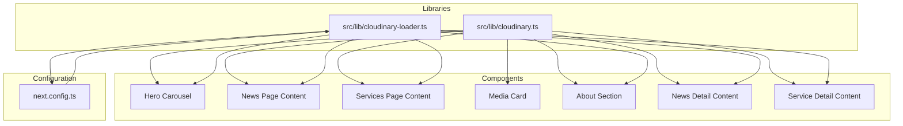
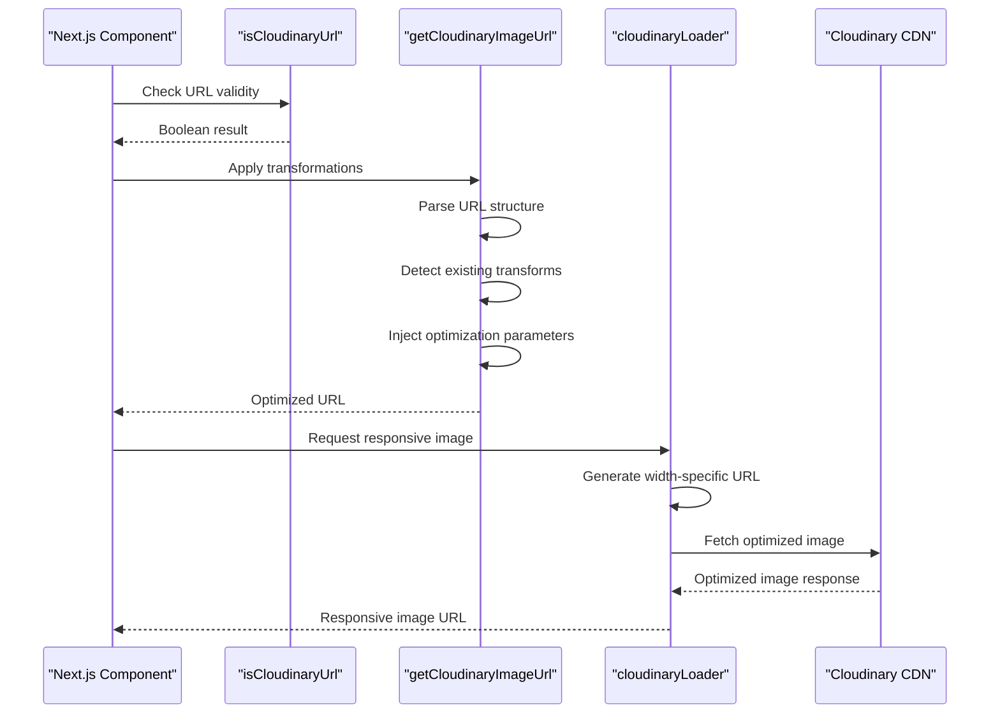
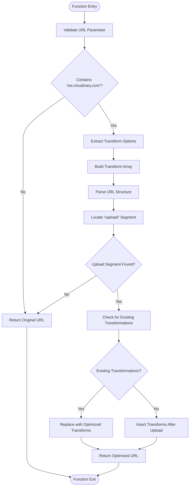
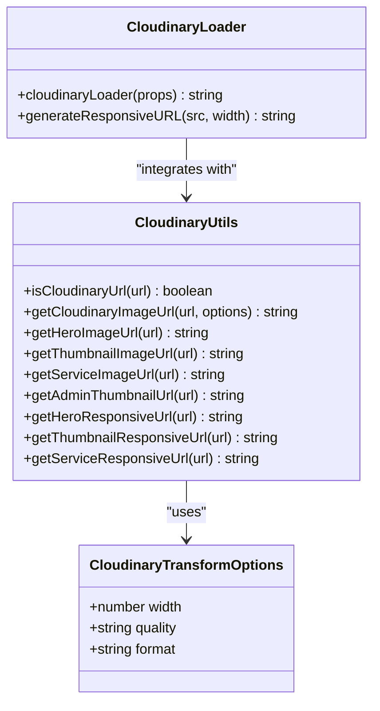
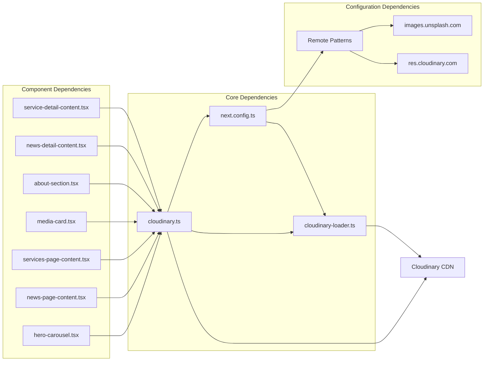

# Cloudinary Integration

<cite>
**Referenced Files in This Document**
- [cloudinary.ts](file://src/lib/cloudinary.ts)
- [cloudinary-loader.ts](file://src/lib/cloudinary-loader.ts)
- [next.config.ts](file://next.config.ts)
- [hero-carousel.tsx](file://src/components/hero-carousel.tsx)
- [news-page-content.tsx](file://src/components/news-page-content.tsx)
- [services-page-content.tsx](file://src/components/services-page-content.tsx)
- [media-card.tsx](file://src/components/media-card.tsx)
- [about-section.tsx](file://src/components/about-section.tsx)
- [news-detail-content.tsx](file://src/components/news-detail-content.tsx)
- [service-detail-content.tsx](file://src/components/service-detail-content.tsx)
</cite>

## Table of Contents
1. [Introduction](#introduction)
2. [Project Structure](#project-structure)
3. [Core Components](#core-components)
4. [Architecture Overview](#architecture-overview)
5. [Detailed Component Analysis](#detailed-component-analysis)
6. [Dependency Analysis](#dependency-analysis)
7. [Performance Considerations](#performance-considerations)
8. [Troubleshooting Guide](#troubleshooting-guide)
9. [Conclusion](#conclusion)

## Introduction
This document provides comprehensive documentation for the Cloudinary integration in the GreenAxis project. It covers URL optimization utilities, transformation parameter injection, preset helpers for different use cases, and responsive URL helpers for Next.js Image component integration. The implementation focuses on automatic format selection, quality optimization, and width-based transformations while maintaining backward compatibility with existing Cloudinary URLs.

## Project Structure
The Cloudinary integration is implemented through two primary modules and extensive usage across multiple components:

**Diagram sources**
- [cloudinary.ts:1-119](file://src/lib/cloudinary.ts#L1-L119)
- [cloudinary-loader.ts:1-59](file://src/lib/cloudinary-loader.ts#L1-L59)
- [next.config.ts:1-46](file://next.config.ts#L1-L46)

**Section sources**
- [cloudinary.ts:1-119](file://src/lib/cloudinary.ts#L1-L119)
- [cloudinary-loader.ts:1-59](file://src/lib/cloudinary-loader.ts#L1-L59)
- [next.config.ts:1-46](file://next.config.ts#L1-L46)

## Core Components

### URL Validation Utility
The `isCloudinaryUrl` function provides robust Cloudinary URL detection using substring matching against the Cloudinary domain pattern.

**Section sources**
- [cloudinary.ts:11-13](file://src/lib/cloudinary.ts#L11-L13)

### Transformation Engine
The `getCloudinaryImageUrl` function handles intelligent transformation parameter injection with support for:
- Automatic format detection (WebP/AVIF when supported)
- Quality optimization ('auto' by default)
- Width-based responsive scaling
- Existing transformation preservation

**Section sources**
- [cloudinary.ts:32-83](file://src/lib/cloudinary.ts#L32-L83)

### Preset Optimization Functions
Four preset functions provide optimized transformations for common use cases:
- **Hero Images**: 1920px width with automatic format/quality
- **Service Images**: 1000px width for medium-sized content
- **Thumbnail Images**: 800px width for grid layouts
- **Admin Thumbnails**: 400px width for dashboard interfaces

**Section sources**
- [cloudinary.ts:92-118](file://src/lib/cloudinary.ts#L92-L118)

### Responsive Image Loader
The custom Next.js image loader (`cloudinaryLoader`) integrates with the framework's responsive image optimization, automatically generating appropriate srcset attributes and width-specific transformations.

**Section sources**
- [cloudinary-loader.ts:10-58](file://src/lib/cloudinary-loader.ts#L10-L58)
- [next.config.ts:11-28](file://next.config.ts#L11-L28)

## Architecture Overview

**Diagram sources**
- [cloudinary.ts:11-83](file://src/lib/cloudinary.ts#L11-L83)
- [cloudinary-loader.ts:10-58](file://src/lib/cloudinary-loader.ts#L10-L58)

## Detailed Component Analysis

### URL Validation and Parsing Logic

**Diagram sources**
- [cloudinary.ts:32-83](file://src/lib/cloudinary.ts#L32-L83)

**Section sources**
- [cloudinary.ts:32-83](file://src/lib/cloudinary.ts#L32-L83)

### Transformation String Construction

The transformation engine builds optimization parameters using Cloudinary's standardized syntax:
- `f_auto`: Automatic format selection (WebP/AVIF when supported)
- `q_auto`: Intelligent quality compression
- `w_[width]`: Specific width dimension for responsive scaling

**Section sources**
- [cloudinary.ts:42-48](file://src/lib/cloudinary.ts#L42-L48)

### Responsive Image Implementation

**Diagram sources**
- [cloudinary.ts:15-118](file://src/lib/cloudinary.ts#L15-L118)
- [cloudinary-loader.ts:10-58](file://src/lib/cloudinary-loader.ts#L10-L58)

**Section sources**
- [cloudinary.ts:15-118](file://src/lib/cloudinary.ts#L15-L118)
- [cloudinary-loader.ts:10-58](file://src/lib/cloudinary-loader.ts#L10-L58)

### Component Integration Examples

#### Hero Image Implementation
The hero carousel demonstrates full-width hero image optimization with automatic format selection and quality optimization.

**Section sources**
- [hero-carousel.tsx:174-175](file://src/components/hero-carousel.tsx#L174-L175)
- [cloudinary.ts:92-98](file://src/lib/cloudinary.ts#L92-L98)

#### Thumbnail Grid Implementation
News and services pages utilize responsive thumbnails optimized for grid layouts with appropriate width scaling.

**Section sources**
- [news-page-content.tsx:73-78](file://src/components/news-page-content.tsx#L73-L78)
- [services-page-content.tsx:142-147](file://src/components/services-page-content.tsx#L142-L147)
- [cloudinary.ts:100-106](file://src/lib/cloudinary.ts#L100-L106)

#### Admin Interface Implementation
Media library components use compact thumbnails suitable for administrative interfaces with reduced bandwidth requirements.

**Section sources**
- [media-card.tsx:156-161](file://src/components/media-card.tsx#L156-L161)
- [cloudinary.ts:116-118](file://src/lib/cloudinary.ts#L116-L118)

## Dependency Analysis

**Diagram sources**
- [cloudinary.ts:1-119](file://src/lib/cloudinary.ts#L1-L119)
- [cloudinary-loader.ts:1-59](file://src/lib/cloudinary-loader.ts#L1-L59)
- [next.config.ts:11-28](file://next.config.ts#L11-L28)

**Section sources**
- [cloudinary.ts:1-119](file://src/lib/cloudinary.ts#L1-L119)
- [cloudinary-loader.ts:1-59](file://src/lib/cloudinary-loader.ts#L1-L59)
- [next.config.ts:11-28](file://next.config.ts#L11-L28)

## Performance Considerations

### Optimization Strategies
1. **Automatic Format Selection**: Uses WebP/AVIF when supported by the client's browser
2. **Intelligent Quality Compression**: Applies 'auto' quality to balance file size and visual fidelity
3. **Width-Based Scaling**: Generates appropriately sized images to prevent oversized downloads
4. **Transformation Preservation**: Maintains existing Cloudinary transformations when present

### Bandwidth Optimization
- Responsive image generation reduces unnecessary bandwidth consumption
- Format optimization leverages modern compression standards
- Width-specific transformations prevent over-fetching of large images

## Troubleshooting Guide

### Common Issues and Solutions

**Issue**: Images not loading from Cloudinary
- **Cause**: URL validation failing due to malformed URLs
- **Solution**: Verify URLs contain the Cloudinary domain pattern

**Issue**: Missing responsive optimization
- **Cause**: Using non-Cloudinary URLs with responsive functions
- **Solution**: Check URL validation before applying responsive transformations

**Issue**: Existing transformations being overridden
- **Cause**: New transformations replacing existing Cloudinary optimizations
- **Solution**: The system preserves existing transformations when detected

**Section sources**
- [cloudinary.ts:36-38](file://src/lib/cloudinary.ts#L36-L38)
- [cloudinary.ts:68-78](file://src/lib/cloudinary.ts#L68-L78)

## Conclusion

The Cloudinary integration provides a comprehensive solution for image optimization across the GreenAxis platform. Through intelligent URL validation, automated transformation injection, and responsive image generation, the system delivers optimal performance while maintaining flexibility for various use cases. The modular design allows for easy maintenance and extension of optimization strategies across different component types and screen sizes.