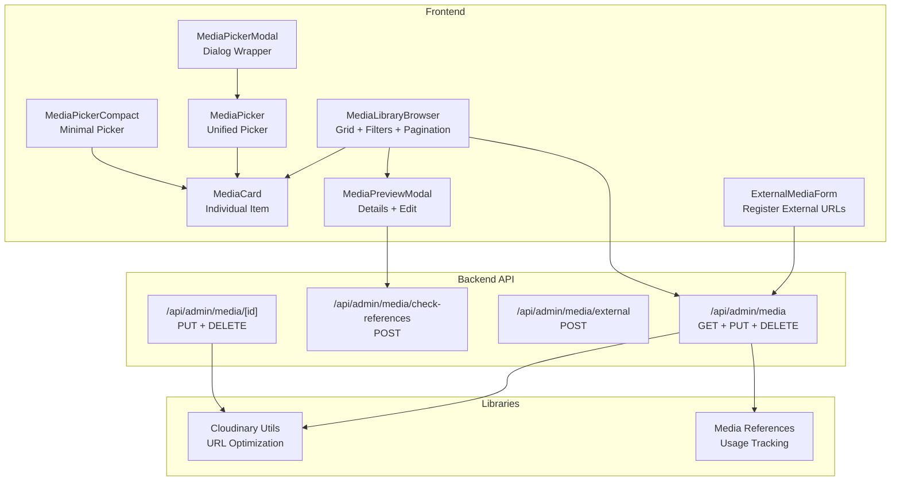
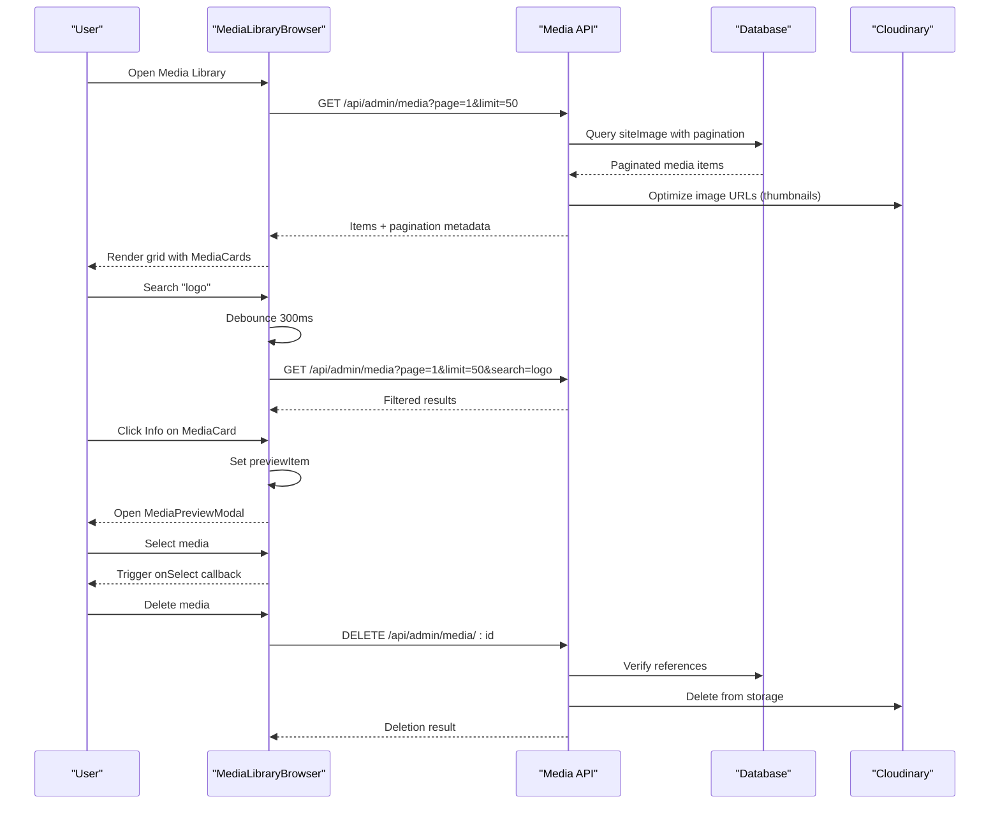
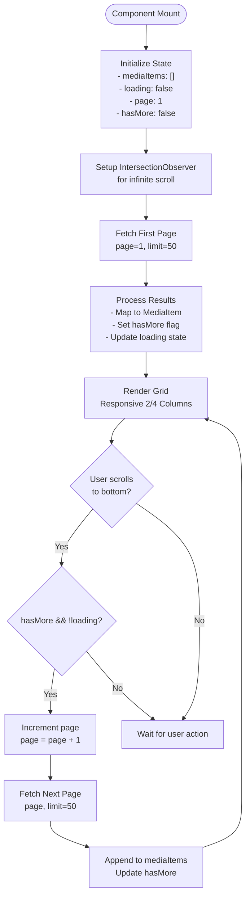
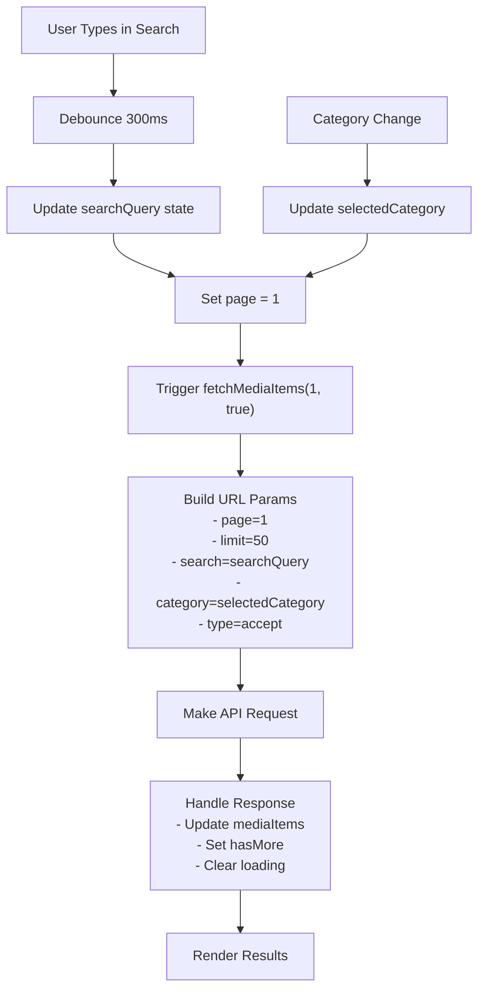
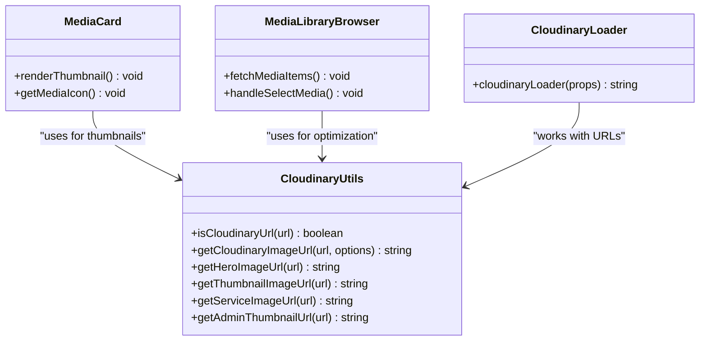
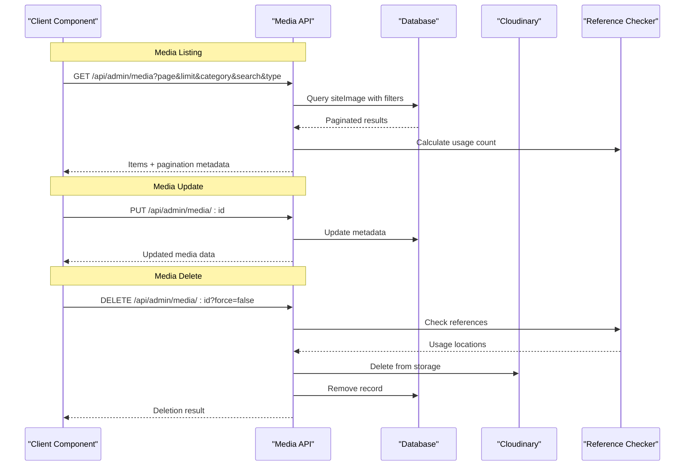
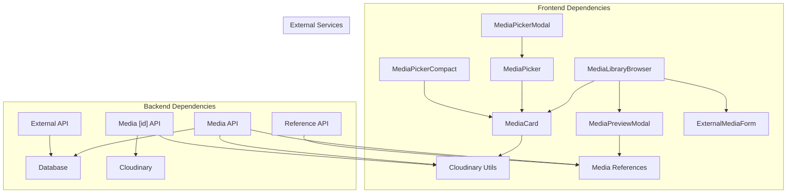

# Media Library Browser

<cite>
**Referenced Files in This Document**
- [media-library-browser.tsx](file://src/components/media-library-browser.tsx)
- [media-card.tsx](file://src/components/media-card.tsx)
- [media-preview-modal.tsx](file://src/components/media-preview-modal.tsx)
- [cloudinary.ts](file://src/lib/cloudinary.ts)
- [cloudinary-loader.ts](file://src/lib/cloudinary-loader.ts)
- [route.ts](file://src/app/api/admin/media/route.ts)
- [route.ts](file://src/app/api/admin/media/check-references/route.ts)
- [route.ts](file://src/app/api/admin/media/external/route.ts)
- [route.ts](file://src/app/api/admin/media/[id]/route.ts)
- [media-references.ts](file://src/lib/media-references.ts)
- [media-picker.tsx](file://src/components/media-picker.tsx)
- [media-picker-compact.tsx](file://src/components/media-picker-compact.tsx)
- [media-picker-modal.tsx](file://src/components/media-picker-modal.tsx)
- [external-media-form.tsx](file://src/components/external-media-form.tsx)
</cite>

## Table of Contents
1. [Introduction](#introduction)
2. [Project Structure](#project-structure)
3. [Core Components](#core-components)
4. [Architecture Overview](#architecture-overview)
5. [Detailed Component Analysis](#detailed-component-analysis)
6. [Dependency Analysis](#dependency-analysis)
7. [Performance Considerations](#performance-considerations)
8. [Troubleshooting Guide](#troubleshooting-guide)
9. [Conclusion](#conclusion)

## Introduction
This document provides comprehensive technical documentation for the media library browser component ecosystem. It covers the MediaLibraryBrowser for browsing and managing media assets, the MediaCard component for individual media item display, and the MediaPreviewModal for detailed inspection and editing. The documentation explains media loading strategies, pagination handling, search and filter mechanisms, drag-and-drop reordering, bulk selection capabilities, and integration with Cloudinary for media optimization. It also details metadata display, status indicators, and interaction patterns, along with the complete backend API integration for media management.

## Project Structure
The media library browser implementation consists of three primary frontend components and supporting libraries, plus a complete backend API layer:

- Frontend Components:
  - MediaLibraryBrowser: Main browser with search, filters, pagination, and grid layout
  - MediaCard: Individual media item card with preview, actions, and metadata
  - MediaPreviewModal: Detailed preview and editing modal for media items
  - Supporting pickers: MediaPicker, MediaPickerCompact, MediaPickerModal
  - External media registration: ExternalMediaForm

- Backend API:
  - Media listing, filtering, pagination
  - Reference checking and deletion with safety
  - External media registration
  - Cloudinary integration for optimization

**Diagram sources**
- [media-library-browser.tsx:69-362](file://src/components/media-library-browser.tsx#L69-L362)
- [media-card.tsx:103-295](file://src/components/media-card.tsx#L103-L295)
- [media-preview-modal.tsx:97-516](file://src/components/media-preview-modal.tsx#L97-L516)
- [media-picker.tsx:106-754](file://src/components/media-picker.tsx#L106-L754)
- [media-picker-compact.tsx:94-691](file://src/components/media-picker-compact.tsx#L94-L691)
- [media-picker-modal.tsx:27-70](file://src/components/media-picker-modal.tsx#L27-L70)
- [external-media-form.tsx:59-302](file://src/components/external-media-form.tsx#L59-L302)
- [route.ts:37-150](file://src/app/api/admin/media/route.ts#L37-L150)
- [route.ts:37-86](file://src/app/api/admin/media/check-references/route.ts#L37-L86)
- [route.ts:16-114](file://src/app/api/admin/media/external/route.ts#L16-L114)
- [route.ts:125-320](file://src/app/api/admin/media/[id]/route.ts#L125-L320)
- [cloudinary.ts:32-119](file://src/lib/cloudinary.ts#L32-L119)
- [media-references.ts:65-181](file://src/lib/media-references.ts#L65-L181)

**Section sources**
- [media-library-browser.tsx:1-362](file://src/components/media-library-browser.tsx#L1-L362)
- [media-card.tsx:1-295](file://src/components/media-card.tsx#L1-L295)
- [media-preview-modal.tsx:1-516](file://src/components/media-preview-modal.tsx#L1-L516)

## Core Components

### MediaLibraryBrowser Component
The MediaLibraryBrowser is the central component for browsing and managing the media library. It provides:
- Infinite scroll pagination (50 items per page)
- Debounced search by filename
- Category filtering (news, services, videos, audio, config, carousel, general)
- Responsive grid layout (2 columns on mobile, 4 on desktop)
- Lazy loading for images
- Visual indicators for media type and usage count
- Preview modal integration for detailed editing

Key features include:
- State management for media items, loading states, pagination, and filters
- Debounced search input with 300ms delay
- IntersectionObserver-based infinite scroll
- Integration with MediaCard for individual item rendering
- External media registration via ExternalMediaForm

**Section sources**
- [media-library-browser.tsx:69-362](file://src/components/media-library-browser.tsx#L69-L362)

### MediaCard Component
The MediaCard component renders individual media items with:
- Thumbnail previews for images (lazy loading)
- File type icons for videos and audio
- Usage count badges
- Hover overlays with action buttons (select, delete, info)
- Selected state indicators
- Tooltip-based metadata display
- Cloudinary URL optimization for thumbnails

Implementation highlights:
- Type-safe MediaItem interface with essential metadata
- Conditional rendering based on media type
- Integration with Cloudinary for optimized thumbnails
- Accessibility-focused hover states and keyboard navigation

**Section sources**
- [media-card.tsx:103-295](file://src/components/media-card.tsx#L103-L295)

### MediaPreviewModal Component
The MediaPreviewModal provides detailed inspection and editing capabilities:
- Full-size preview for images, videos, and audio
- Comprehensive metadata display (size, upload date, usage count)
- Editable fields for name, description, and category
- Usage location tracking with clickable links
- Safe deletion with reference verification
- Progress indicators and error handling

Key functionality:
- Dynamic media preview based on file type
- Reference checking via API endpoint
- Bulk update capabilities through PUT requests
- Force deletion option with reference cleanup

**Section sources**
- [media-preview-modal.tsx:97-516](file://src/components/media-preview-modal.tsx#L97-L516)

## Architecture Overview

**Diagram sources**
- [media-library-browser.tsx:97-173](file://src/components/media-library-browser.tsx#L97-L173)
- [route.ts:37-150](file://src/app/api/admin/media/route.ts#L37-L150)
- [route.ts:220-320](file://src/app/api/admin/media/[id]/route.ts#L220-L320)
- [cloudinary.ts:32-119](file://src/lib/cloudinary.ts#L32-L119)

## Detailed Component Analysis

### Media Loading and Pagination Strategy
The MediaLibraryBrowser implements efficient loading strategies:

**Diagram sources**
- [media-library-browser.tsx:151-173](file://src/components/media-library-browser.tsx#L151-L173)
- [media-library-browser.tsx:97-136](file://src/components/media-library-browser.tsx#L97-L136)

### Search and Filter Mechanisms
The search and filter system uses debounced input with immediate feedback:

**Diagram sources**
- [media-library-browser.tsx:87-145](file://src/components/media-library-browser.tsx#L87-L145)
- [media-library-browser.tsx:217-227](file://src/components/media-library-browser.tsx#L217-L227)

### Cloudinary Integration and Optimization
The system integrates with Cloudinary for media optimization:

**Diagram sources**
- [cloudinary.ts:32-119](file://src/lib/cloudinary.ts#L32-L119)
- [media-card.tsx:152-165](file://src/components/media-card.tsx#L152-L165)
- [cloudinary-loader.ts:10-59](file://src/lib/cloudinary-loader.ts#L10-L59)

### Media Management API Integration
The backend API provides comprehensive media management:

**Diagram sources**
- [route.ts:37-150](file://src/app/api/admin/media/route.ts#L37-L150)
- [route.ts:125-320](file://src/app/api/admin/media/[id]/route.ts#L125-L320)
- [media-references.ts:65-181](file://src/lib/media-references.ts#L65-L181)

**Section sources**
- [media-library-browser.tsx:97-173](file://src/components/media-library-browser.tsx#L97-L173)
- [media-card.tsx:152-165](file://src/components/media-card.tsx#L152-L165)
- [media-preview-modal.tsx:139-164](file://src/components/media-preview-modal.tsx#L139-L164)
- [cloudinary.ts:32-119](file://src/lib/cloudinary.ts#L32-L119)
- [route.ts:37-150](file://src/app/api/admin/media/route.ts#L37-L150)

## Dependency Analysis

**Diagram sources**
- [media-library-browser.tsx:1-362](file://src/components/media-library-browser.tsx#L1-L362)
- [media-card.tsx:1-295](file://src/components/media-card.tsx#L1-L295)
- [media-preview-modal.tsx:1-516](file://src/components/media-preview-modal.tsx#L1-L516)
- [route.ts:1-150](file://src/app/api/admin/media/route.ts#L1-L150)

**Section sources**
- [media-library-browser.tsx:1-362](file://src/components/media-library-browser.tsx#L1-L362)
- [media-card.tsx:1-295](file://src/components/media-card.tsx#L1-L295)
- [media-preview-modal.tsx:1-516](file://src/components/media-preview-modal.tsx#L1-L516)

## Performance Considerations
- **Lazy Loading**: Images use native lazy loading for improved initial load performance
- **Pagination**: Efficient 50-item pages with infinite scroll to minimize DOM nodes
- **Debounced Search**: 300ms debounce prevents excessive API calls during typing
- **IntersectionObserver**: Efficient infinite scroll detection without polling
- **Cloudinary Optimization**: Automatic format and quality optimization reduces bandwidth
- **Memory Management**: Proper cleanup of observers and event handlers
- **Conditional Rendering**: Only renders necessary UI elements based on state

## Troubleshooting Guide

### Common Issues and Solutions

**Media Not Loading**
- Verify Cloudinary URL format and accessibility
- Check network connectivity to Cloudinary CDN
- Ensure proper CORS configuration for external URLs

**Search Not Working**
- Confirm debounced search is properly configured
- Verify API endpoint accepts search parameters
- Check for special characters in search queries

**Pagination Problems**
- Ensure hasMore flag is correctly calculated
- Verify page parameter increments properly
- Check limit parameter matches backend expectations

**Deletion Failures**
- Review reference checking logic
- Verify Cloudinary deletion permissions
- Check database transaction rollback scenarios

**Section sources**
- [media-library-browser.tsx:131-136](file://src/components/media-library-browser.tsx#L131-L136)
- [media-preview-modal.tsx:221-261](file://src/components/media-preview-modal.tsx#L221-L261)
- [route.ts:252-280](file://src/app/api/admin/media/[id]/route.ts#L252-L280)

## Conclusion
The media library browser component system provides a comprehensive solution for media asset management with modern web development practices. The implementation demonstrates excellent separation of concerns, efficient data loading strategies, and robust integration with Cloudinary for optimal media delivery. The modular architecture allows for easy maintenance and extension while providing a smooth user experience through responsive design and intuitive interaction patterns.

The system successfully balances performance considerations with feature richness, offering both basic browsing capabilities and advanced management features like reference tracking, external media registration, and bulk operations. The clear API boundaries and well-defined component responsibilities ensure maintainability and scalability for future enhancements.