# Media Management System

<cite>
**Referenced Files in This Document**
- [cloudinary.ts](file://src/lib/cloudinary.ts)
- [cloudinary-loader.ts](file://src/lib/cloudinary-loader.ts)
- [media-card.tsx](file://src/components/media-card.tsx)
- [media-library-browser.tsx](file://src/components/media-library-browser.tsx)
- [media-picker.tsx](file://src/components/media-picker.tsx)
- [media-picker-modal.tsx](file://src/components/media-picker-modal.tsx)
- [media-preview-modal.tsx](file://src/components/media-preview-modal.tsx)
- [media-references.ts](file://src/lib/media-references.ts)
- [external-media-form.tsx](file://src/components/external-media-form.tsx)
- [media-picker-compact.tsx](file://src/components/media-picker-compact.tsx)
- [route.ts](file://src/app/api/admin/media/route.ts)
- [route.ts](file://src/app/api/upload/route.ts)
- [route.ts](file://src/app/api/admin/media/check-references/route.ts)
- [route.ts](file://src/app/api/admin/media/external/route.ts)
</cite>

## Table of Contents
1. [Introduction](#introduction)
2. [Project Structure](#project-structure)
3. [Core Components](#core-components)
4. [Architecture Overview](#architecture-overview)
5. [Detailed Component Analysis](#detailed-component-analysis)
6. [Dependency Analysis](#dependency-analysis)
7. [Performance Considerations](#performance-considerations)
8. [Troubleshooting Guide](#troubleshooting-guide)
9. [Conclusion](#conclusion)

## Introduction
This document describes the media management system built with Next.js and Cloudinary. It covers Cloudinary integration for optimization and CDN delivery, a media library browser with search and filtering, media picker components for content insertion, media card display, preview modal functionality, upload endpoint handling, and reference tracking mechanisms. It also explains duplicate detection algorithms, file validation, optimization settings, storage management, drag-and-drop upload, batch operations, and media metadata handling.

## Project Structure
The media management system is composed of:
- UI components for browsing, selecting, and previewing media
- API endpoints for listing, uploading, referencing, and external media registration
- Utility libraries for Cloudinary URL optimization and reference resolution
- Database-backed storage via Prisma ORM

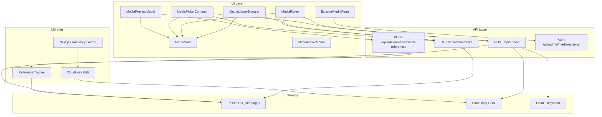

**Diagram sources**
- [media-library-browser.tsx:69-362](file://src/components/media-library-browser.tsx#L69-L362)
- [media-picker.tsx:106-754](file://src/components/media-picker.tsx#L106-L754)
- [media-picker-compact.tsx:94-691](file://src/components/media-picker-compact.tsx#L94-L691)
- [media-card.tsx:103-295](file://src/components/media-card.tsx#L103-L295)
- [media-preview-modal.tsx:97-516](file://src/components/media-preview-modal.tsx#L97-L516)
- [external-media-form.tsx:59-302](file://src/components/external-media-form.tsx#L59-L302)
- [route.ts:37-150](file://src/app/api/admin/media/route.ts#L37-L150)
- [route.ts:150-392](file://src/app/api/upload/route.ts#L150-L392)
- [route.ts:37-86](file://src/app/api/admin/media/check-references/route.ts#L37-L86)
- [route.ts:16-114](file://src/app/api/admin/media/external/route.ts#L16-L114)
- [cloudinary.ts:11-119](file://src/lib/cloudinary.ts#L11-L119)
- [cloudinary-loader.ts:10-59](file://src/lib/cloudinary-loader.ts#L10-L59)
- [media-references.ts:65-181](file://src/lib/media-references.ts#L65-L181)

**Section sources**
- [media-library-browser.tsx:1-362](file://src/components/media-library-browser.tsx#L1-L362)
- [media-picker.tsx:1-754](file://src/components/media-picker.tsx#L1-L754)
- [media-picker-compact.tsx:1-691](file://src/components/media-picker-compact.tsx#L1-L691)
- [media-card.tsx:1-295](file://src/components/media-card.tsx#L1-L295)
- [media-preview-modal.tsx:1-516](file://src/components/media-preview-modal.tsx#L1-L516)
- [external-media-form.tsx:1-302](file://src/components/external-media-form.tsx#L1-L302)
- [route.ts:1-150](file://src/app/api/admin/media/route.ts#L1-L150)
- [route.ts:1-452](file://src/app/api/upload/route.ts#L1-L452)
- [route.ts:1-86](file://src/app/api/admin/media/check-references/route.ts#L1-L86)
- [route.ts:1-114](file://src/app/api/admin/media/external/route.ts#L1-L114)
- [cloudinary.ts:1-119](file://src/lib/cloudinary.ts#L1-L119)
- [cloudinary-loader.ts:1-59](file://src/lib/cloudinary-loader.ts#L1-L59)
- [media-references.ts:1-334](file://src/lib/media-references.ts#L1-L334)

## Core Components
- Cloudinary utilities for URL transformation and presets
- Next.js Cloudinary loader for responsive image generation
- MediaCard for unified media display with actions
- MediaLibraryBrowser for grid browsing with search, filtering, and infinite scroll
- MediaPicker for library and upload tabs with drag-and-drop and duplicate detection
- MediaPickerCompact for lightweight inline selection
- MediaPreviewModal for metadata editing and reference inspection
- ExternalMediaForm for registering external URLs
- Reference tracker for detecting and updating usages across content

**Section sources**
- [cloudinary.ts:11-119](file://src/lib/cloudinary.ts#L11-L119)
- [cloudinary-loader.ts:10-59](file://src/lib/cloudinary-loader.ts#L10-L59)
- [media-card.tsx:32-295](file://src/components/media-card.tsx#L32-L295)
- [media-library-browser.tsx:37-362](file://src/components/media-library-browser.tsx#L37-L362)
- [media-picker.tsx:31-754](file://src/components/media-picker.tsx#L31-L754)
- [media-picker-compact.tsx:34-691](file://src/components/media-picker-compact.tsx#L34-L691)
- [media-preview-modal.tsx:55-516](file://src/components/media-preview-modal.tsx#L55-L516)
- [external-media-form.tsx:15-302](file://src/components/external-media-form.tsx#L15-L302)
- [media-references.ts:6-334](file://src/lib/media-references.ts#L6-L334)

## Architecture Overview
The system integrates UI components with API endpoints and Cloudinary. Uploads are processed through a dedicated endpoint that validates files, detects duplicates, stores records, and manages Cloudinary or local filesystem storage. The library endpoint provides paginated, searchable, and filterable media listings. Reference tracking ensures safe deletion and updates across content.

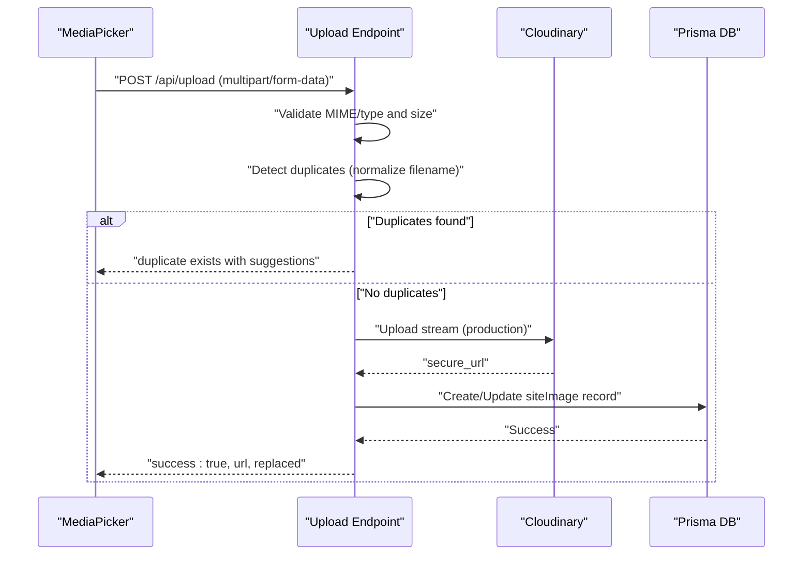

**Diagram sources**
- [media-picker.tsx:201-316](file://src/components/media-picker.tsx#L201-L316)
- [route.ts:150-392](file://src/app/api/upload/route.ts#L150-L392)

**Section sources**
- [media-picker.tsx:1-754](file://src/components/media-picker.tsx#L1-L754)
- [route.ts:1-452](file://src/app/api/upload/route.ts#L1-L452)

## Detailed Component Analysis

### Cloudinary Integration
Cloudinary utilities provide:
- URL validation for Cloudinary-hosted assets
- Transformation injection for format, quality, and width
- Preset helpers for hero, thumbnail, service, and admin thumbnail sizes
- Next.js loader integration for responsive srcset generation

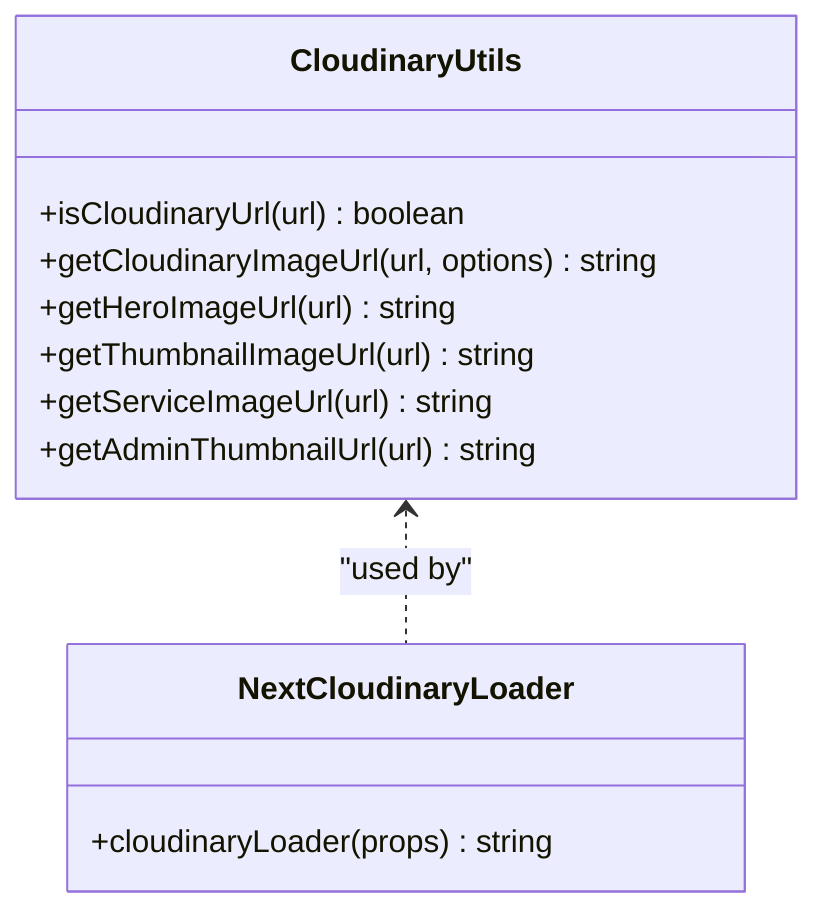

**Diagram sources**
- [cloudinary.ts:11-119](file://src/lib/cloudinary.ts#L11-L119)
- [cloudinary-loader.ts:10-59](file://src/lib/cloudinary-loader.ts#L10-L59)

**Section sources**
- [cloudinary.ts:1-119](file://src/lib/cloudinary.ts#L1-L119)
- [cloudinary-loader.ts:1-59](file://src/lib/cloudinary-loader.ts#L1-L59)

### Media Library Browser
Features:
- Infinite scroll pagination (50 items/page)
- Debounced search by label
- Category filter (news, services, videos, audio, config, carousel, general)
- Grid layout with MediaCard items
- Preview modal for detailed editing
- External media registration

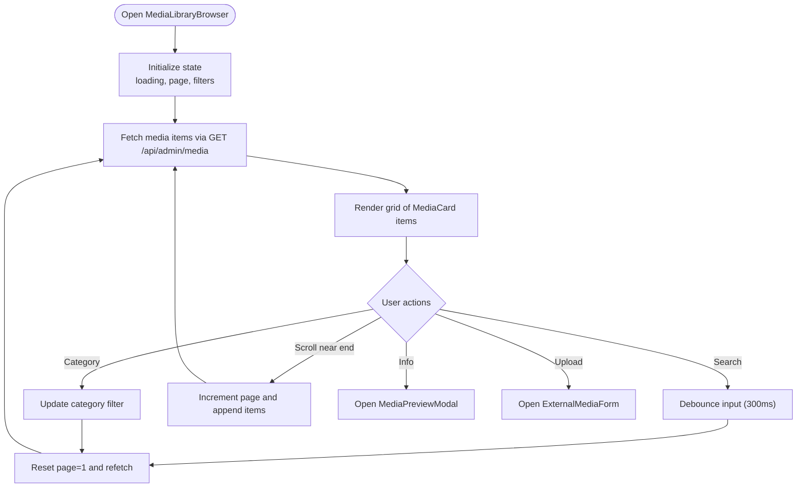

**Diagram sources**
- [media-library-browser.tsx:69-362](file://src/components/media-library-browser.tsx#L69-L362)
- [route.ts:37-150](file://src/app/api/admin/media/route.ts#L37-L150)

**Section sources**
- [media-library-browser.tsx:1-362](file://src/components/media-library-browser.tsx#L1-L362)
- [route.ts:1-150](file://src/app/api/admin/media/route.ts#L1-L150)

### Media Picker Components
Two variants:
- MediaPicker: Full-featured with tabs, progress, duplicate detection, drag-and-drop
- MediaPickerCompact: Lightweight inline picker optimized for small spaces

Key behaviors:
- Accept prop restricts MIME types
- maxSizeMB validation
- Duplicate detection via normalized filename comparison
- Drag-and-drop zone with visual feedback
- Duplicate suggestion dialog with quick-use option
- Upload progress tracking via XMLHttpRequest

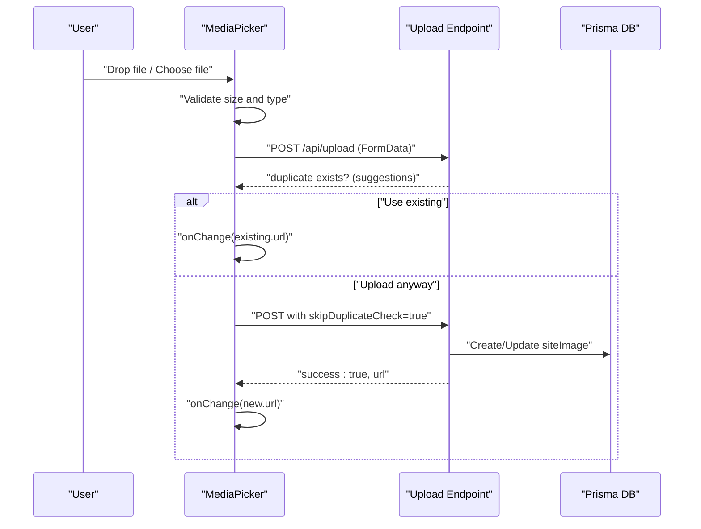

**Diagram sources**
- [media-picker.tsx:201-410](file://src/components/media-picker.tsx#L201-L410)
- [route.ts:150-392](file://src/app/api/upload/route.ts#L150-L392)

**Section sources**
- [media-picker.tsx:1-754](file://src/components/media-picker.tsx#L1-L754)
- [media-picker-compact.tsx:1-691](file://src/components/media-picker-compact.tsx#L1-L691)
- [route.ts:1-452](file://src/app/api/upload/route.ts#L1-L452)

### Media Card Display System
MediaCard renders:
- Thumbnail for images (optimized via Cloudinary utilities)
- Icons for video/audio
- Usage count badge
- Selection indicator
- Hover actions (select, delete, info)
- Tooltips with detailed metadata

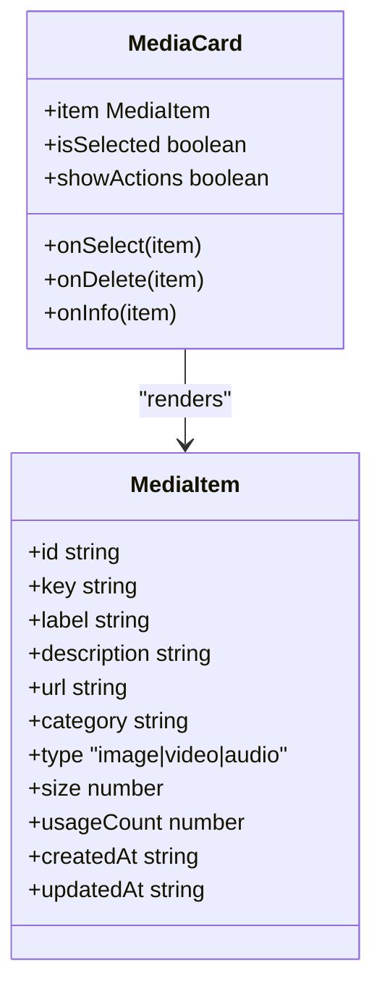

**Diagram sources**
- [media-card.tsx:32-295](file://src/components/media-card.tsx#L32-L295)

**Section sources**
- [media-card.tsx:1-295](file://src/components/media-card.tsx#L1-L295)

### Preview Modal Functionality
MediaPreviewModal enables:
- Full preview for images, videos, and audio
- Editable metadata (name, description, category)
- Reference inspection and usage locations
- Safe deletion with confirmation and in-use handling

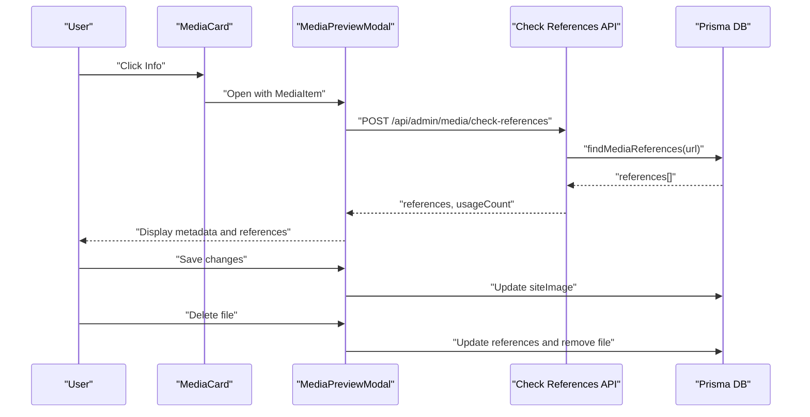

**Diagram sources**
- [media-preview-modal.tsx:97-516](file://src/components/media-preview-modal.tsx#L97-L516)
- [route.ts:37-86](file://src/app/api/admin/media/check-references/route.ts#L37-L86)
- [media-references.ts:65-181](file://src/lib/media-references.ts#L65-L181)

**Section sources**
- [media-preview-modal.tsx:1-516](file://src/components/media-preview-modal.tsx#L1-L516)
- [route.ts:1-86](file://src/app/api/admin/media/check-references/route.ts#L1-L86)
- [media-references.ts:1-334](file://src/lib/media-references.ts#L1-L334)

### Upload Endpoint Handling
The upload endpoint performs:
- Authentication check
- MIME type validation and size limits (environment-aware)
- File signature validation (magic bytes for images, flexible for videos/audio)
- Duplicate detection via normalized filename comparison
- Cloudinary production uploads with public ID reuse for replacements
- Local development file system storage
- Database record creation/update and cleanup of old files

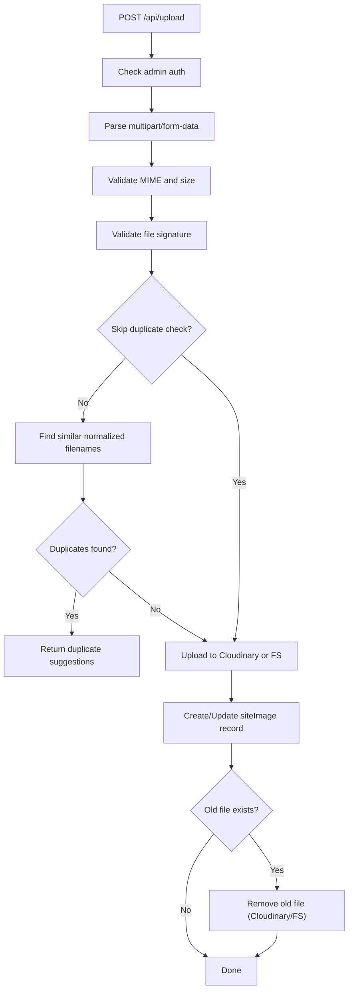

**Diagram sources**
- [route.ts:150-392](file://src/app/api/upload/route.ts#L150-L392)

**Section sources**
- [route.ts:1-452](file://src/app/api/upload/route.ts#L1-L452)

### Reference Tracking Mechanisms
Reference tracking scans platform configuration, news, carousel slides, legal pages, and about pages for media URLs. It supports:
- Extracting media from EditorJS blocks
- Finding all references to a given URL
- Updating references when replacing or deleting files
- Generating edit URLs for each reference

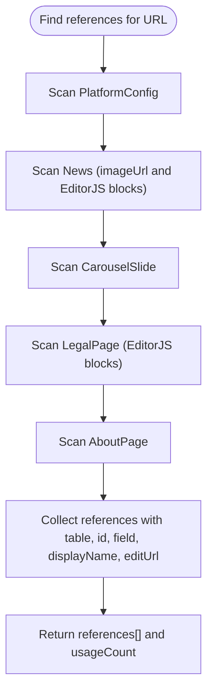

**Diagram sources**
- [media-references.ts:65-181](file://src/lib/media-references.ts#L65-L181)

**Section sources**
- [media-references.ts:1-334](file://src/lib/media-references.ts#L1-L334)

### External Media Registration
ExternalMediaForm allows registering external URLs:
- URL validation and type inference
- Automatic filename extraction
- Unique key generation
- Prevents duplicate keys and URLs
- Creates records with optional description and category

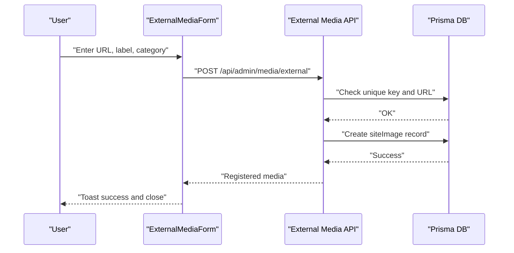

**Diagram sources**
- [external-media-form.tsx:59-302](file://src/components/external-media-form.tsx#L59-L302)
- [route.ts:16-114](file://src/app/api/admin/media/external/route.ts#L16-L114)

**Section sources**
- [external-media-form.tsx:1-302](file://src/components/external-media-form.tsx#L1-L302)
- [route.ts:1-114](file://src/app/api/admin/media/external/route.ts#L1-L114)

## Dependency Analysis
- UI components depend on:
  - MediaCard for rendering
  - MediaPreviewModal for editing and reference inspection
  - ExternalMediaForm for external URL registration
  - MediaPicker/MediaPickerCompact for selection
- API endpoints depend on:
  - Prisma ORM for database operations
  - Cloudinary SDK for production uploads
  - Environment variables for configuration
- Libraries depend on:
  - MediaReferences for cross-table reference resolution

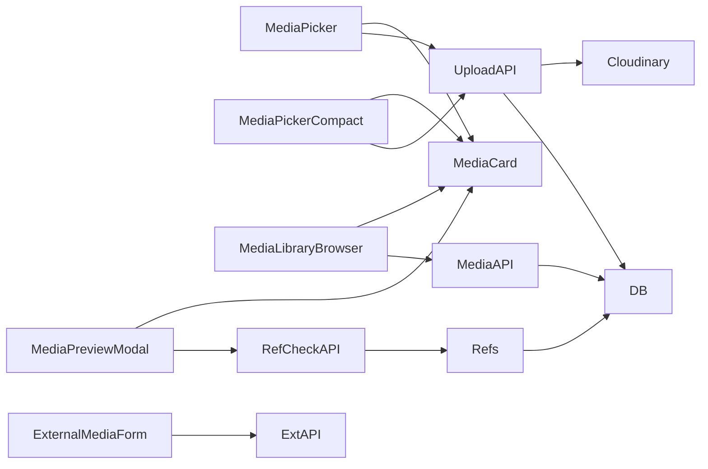

**Diagram sources**
- [media-picker.tsx:106-754](file://src/components/media-picker.tsx#L106-L754)
- [media-picker-compact.tsx:94-691](file://src/components/media-picker-compact.tsx#L94-L691)
- [media-library-browser.tsx:69-362](file://src/components/media-library-browser.tsx#L69-L362)
- [media-preview-modal.tsx:97-516](file://src/components/media-preview-modal.tsx#L97-L516)
- [external-media-form.tsx:59-302](file://src/components/external-media-form.tsx#L59-L302)
- [route.ts:150-392](file://src/app/api/upload/route.ts#L150-L392)
- [route.ts:37-150](file://src/app/api/admin/media/route.ts#L37-L150)
- [route.ts:37-86](file://src/app/api/admin/media/check-references/route.ts#L37-L86)
- [route.ts:16-114](file://src/app/api/admin/media/external/route.ts#L16-L114)
- [media-references.ts:65-181](file://src/lib/media-references.ts#L65-L181)

**Section sources**
- [media-picker.tsx:1-754](file://src/components/media-picker.tsx#L1-L754)
- [media-picker-compact.tsx:1-691](file://src/components/media-picker-compact.tsx#L1-L691)
- [media-library-browser.tsx:1-362](file://src/components/media-library-browser.tsx#L1-L362)
- [media-preview-modal.tsx:1-516](file://src/components/media-preview-modal.tsx#L1-L516)
- [external-media-form.tsx:1-302](file://src/components/external-media-form.tsx#L1-L302)
- [route.ts:1-452](file://src/app/api/upload/route.ts#L1-L452)
- [route.ts:1-150](file://src/app/api/admin/media/route.ts#L1-L150)
- [route.ts:1-86](file://src/app/api/admin/media/check-references/route.ts#L1-L86)
- [route.ts:1-114](file://src/app/api/admin/media/external/route.ts#L1-L114)
- [media-references.ts:1-334](file://src/lib/media-references.ts#L1-L334)

## Performance Considerations
- MediaLibraryBrowser uses infinite scroll with 50 items per page to reduce initial load.
- MediaPickerCompact optimizes by loading only the 4 most recent items for compact displays.
- Cloudinary transformations are injected efficiently to avoid redundant segments.
- Next.js Cloudinary loader generates responsive srcsets automatically.
- Duplicate detection uses normalized filenames to minimize database scans.

[No sources needed since this section provides general guidance]

## Troubleshooting Guide
Common issues and resolutions:
- Upload size exceeded: Adjust maxSizeMB or use Cloudinary Console for large files.
- Invalid file type: Ensure MIME type matches allowed categories.
- Duplicate detected: Use existing file or bypass duplicate check.
- Cloudinary upload failures: Verify credentials and network connectivity.
- Reference conflicts on delete: Review usage locations and update content accordingly.

**Section sources**
- [media-picker.tsx:201-316](file://src/components/media-picker.tsx#L201-L316)
- [route.ts:170-211](file://src/app/api/upload/route.ts#L170-L211)
- [media-preview-modal.tsx:221-261](file://src/components/media-preview-modal.tsx#L221-L261)
- [route.ts:37-86](file://src/app/api/admin/media/check-references/route.ts#L37-L86)

## Conclusion
The media management system provides a robust, scalable solution for media browsing, selection, upload, and administration. It leverages Cloudinary for optimization and CDN delivery, implements intelligent duplicate detection and reference tracking, and offers flexible UI components for diverse use cases. The architecture balances performance and usability while maintaining strong data integrity and admin controls.