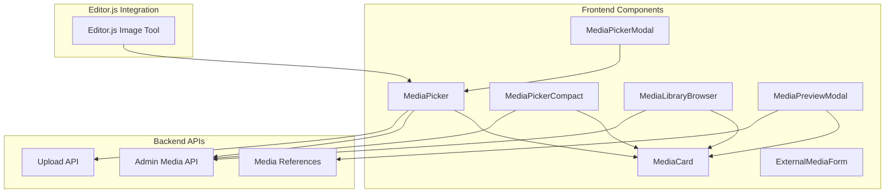
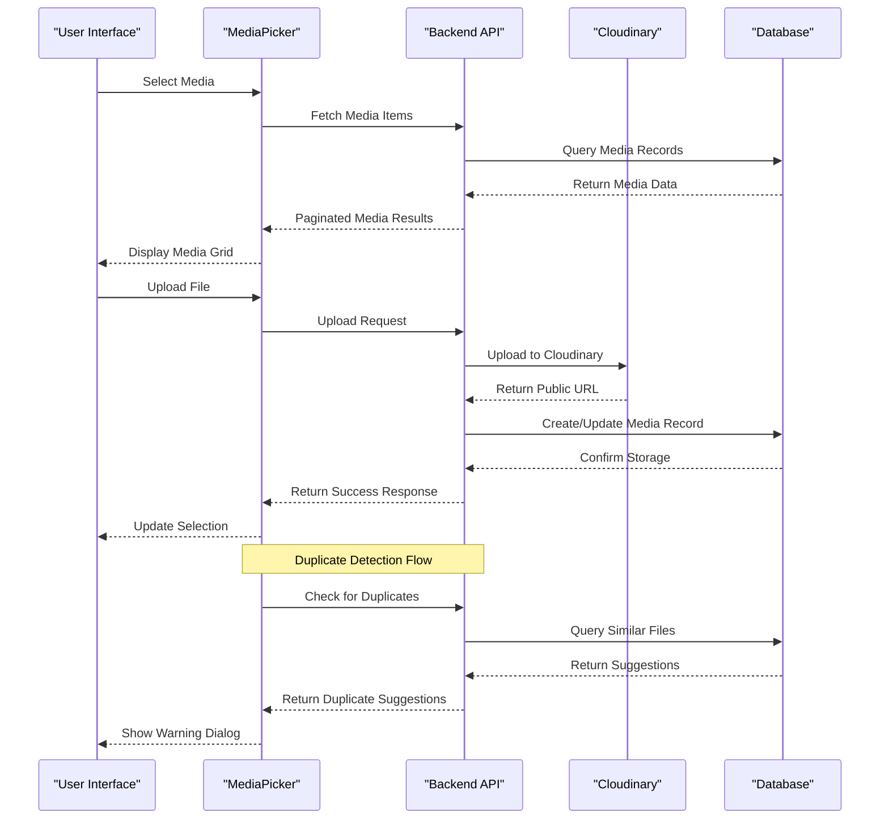
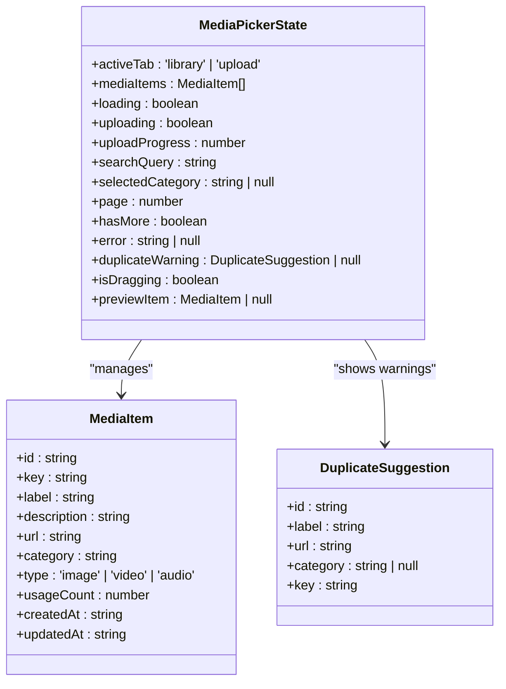
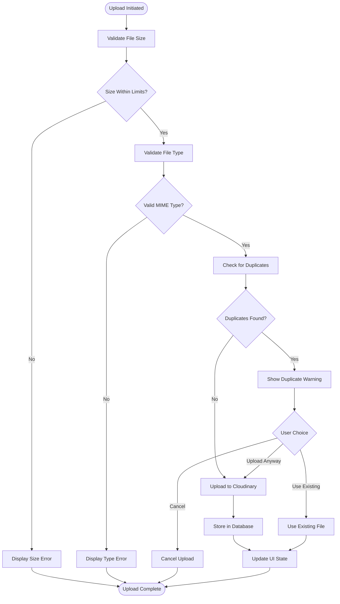
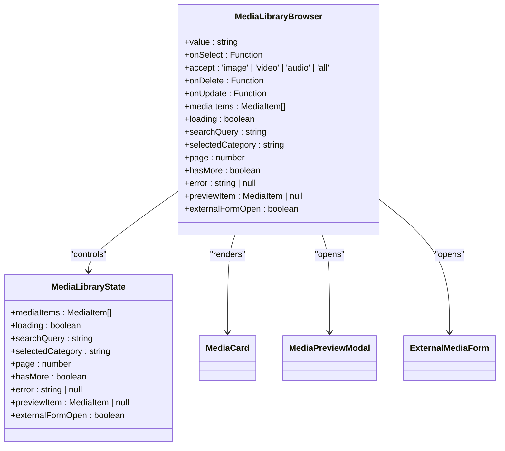
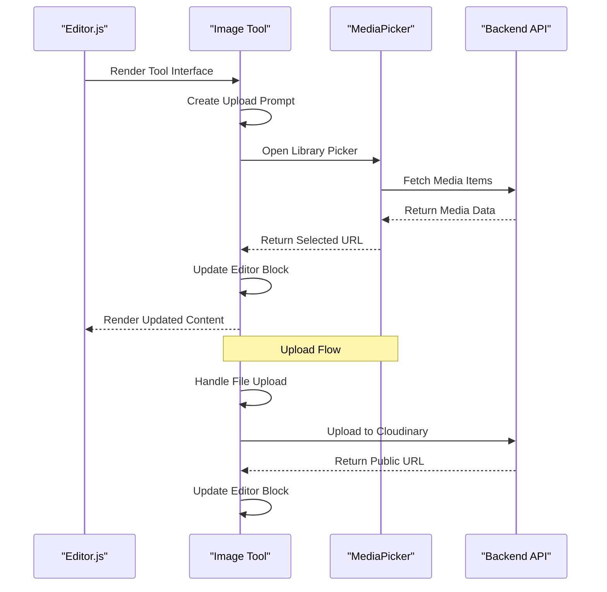
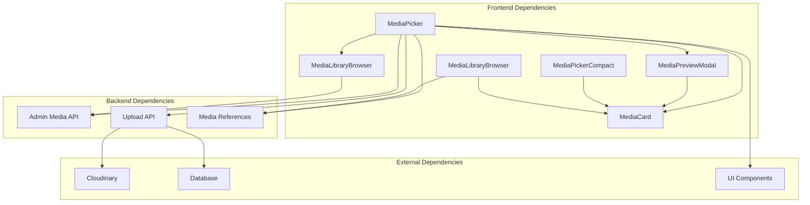

# Media Picker Components

<cite>
**Referenced Files in This Document**
- [media-picker.tsx](file://src/components/media-picker.tsx)
- [media-picker-modal.tsx](file://src/components/media-picker-modal.tsx)
- [media-picker-compact.tsx](file://src/components/media-picker-compact.tsx)
- [media-library-browser.tsx](file://src/components/media-library-browser.tsx)
- [media-card.tsx](file://src/components/media-card.tsx)
- [media-preview-modal.tsx](file://src/components/media-preview-modal.tsx)
- [external-media-form.tsx](file://src/components/external-media-form.tsx)
- [editor-js-image-tool.ts](file://src/components/editor-js-image-tool.ts)
- [route.ts](file://src/app/api/admin/media/route.ts)
- [route.ts](file://src/app/api/upload/route.ts)
- [media-references.ts](file://src/lib/media-references.ts)
</cite>

## Table of Contents
1. [Introduction](#introduction)
2. [Project Structure](#project-structure)
3. [Core Components](#core-components)
4. [Architecture Overview](#architecture-overview)
5. [Detailed Component Analysis](#detailed-component-analysis)
6. [Dependency Analysis](#dependency-analysis)
7. [Performance Considerations](#performance-considerations)
8. [Troubleshooting Guide](#troubleshooting-guide)
9. [Conclusion](#conclusion)

## Introduction

The GreenAxis project includes a comprehensive media picker system designed for rich text editing and content management. This system consists of three primary components: MediaPicker for rich text editing integration, MediaPickerModal for standalone selection in dialogs, and MediaPickerCompact for space-constrained interfaces. These components work together with the media library browser and Editor.js tools to provide a seamless media selection experience.

The media picker system handles multiple media types (images, videos, audio), integrates with Cloudinary for production deployments, manages duplicate detection and prevention, and provides robust error handling and validation. It supports both modal-based selection interfaces and compact inline selection for different UI contexts.

## Project Structure

The media picker components are organized within the components directory and integrate with several backend APIs:

**Diagram sources**
- [media-picker.tsx:106-754](file://src/components/media-picker.tsx#L106-L754)
- [media-picker-modal.tsx:27-70](file://src/components/media-picker-modal.tsx#L27-L70)
- [media-picker-compact.tsx:94-691](file://src/components/media-picker-compact.tsx#L94-L691)
- [media-library-browser.tsx:69-362](file://src/components/media-library-browser.tsx#L69-L362)

**Section sources**
- [media-picker.tsx:1-754](file://src/components/media-picker.tsx#L1-L754)
- [media-picker-modal.tsx:1-70](file://src/components/media-picker-modal.tsx#L1-L70)
- [media-picker-compact.tsx:1-691](file://src/components/media-picker-compact.tsx#L1-L691)

## Core Components

### MediaPicker Component

The MediaPicker serves as the unified component for selecting media from library or uploading new files. It supports images, videos, and audio files with comprehensive validation and error handling.

**Key Features:**
- Dual-tab interface (Library and Upload)
- Drag-and-drop file upload
- Duplicate detection with user-friendly warnings
- Progress tracking during uploads
- Integration with Cloudinary for production
- Support for multiple media types with automatic type detection

**State Management:**
The component maintains extensive state for managing the picker workflow, including active tab selection, media item loading, upload progress, search functionality, and error handling.

**Section sources**
- [media-picker.tsx:106-754](file://src/components/media-picker.tsx#L106-L754)

### MediaPickerModal Component

A modal wrapper that provides a dialog-based interface for media selection. This component integrates the MediaPicker into a dialog system with proper state management for open/close functionality.

**Key Features:**
- Dialog-based interface for standalone selection
- Pass-through props to MediaPicker for consistent behavior
- Automatic closing after successful selection
- Customizable title and sizing

**Section sources**
- [media-picker-modal.tsx:27-70](file://src/components/media-picker-modal.tsx#L27-L70)

### MediaPickerCompact Component

An optimized version designed for space-constrained interfaces. This component loads only a limited number of recent items to improve performance while maintaining essential functionality.

**Key Features:**
- Optimized for small panel environments
- Loads only 4 most recent items (compared to 50 in standard version)
- Simplified interface with reduced visual elements
- Link to full media library for comprehensive browsing
- Maintains full upload and selection capabilities

**Section sources**
- [media-picker-compact.tsx:94-691](file://src/components/media-picker-compact.tsx#L94-L691)

## Architecture Overview

The media picker system follows a modular architecture with clear separation of concerns between presentation, state management, and backend integration:

**Diagram sources**
- [media-picker.tsx:149-196](file://src/components/media-picker.tsx#L149-L196)
- [route.ts:214-243](file://src/app/api/upload/route.ts#L214-L243)
- [route.ts:37-149](file://src/app/api/admin/media/route.ts#L37-L149)

## Detailed Component Analysis

### MediaPicker State Management

The MediaPicker component implements sophisticated state management for handling complex media selection workflows:

**Diagram sources**
- [media-picker.tsx:55-72](file://src/components/media-picker.tsx#L55-L72)
- [media-card.tsx:32-44](file://src/components/media-card.tsx#L32-L44)

**Section sources**
- [media-picker.tsx:55-134](file://src/components/media-picker.tsx#L55-L134)

### Upload Workflow Implementation

The upload system implements a comprehensive file handling pipeline with validation, duplicate detection, and Cloudinary integration:

**Diagram sources**
- [media-picker.tsx:201-316](file://src/components/media-picker.tsx#L201-L316)
- [route.ts:150-392](file://src/app/api/upload/route.ts#L150-L392)

**Section sources**
- [media-picker.tsx:201-316](file://src/components/media-picker.tsx#L201-L316)
- [route.ts:150-392](file://src/app/api/upload/route.ts#L150-L392)

### Media Library Browser Integration

The MediaLibraryBrowser provides comprehensive media management with advanced filtering and pagination:

**Diagram sources**
- [media-library-browser.tsx:69-86](file://src/components/media-library-browser.tsx#L69-L86)
- [media-library-browser.tsx:132-136](file://src/components/media-library-browser.tsx#L132-L136)

**Section sources**
- [media-library-browser.tsx:69-136](file://src/components/media-library-browser.tsx#L69-L136)

### Editor.js Integration

The media picker integrates seamlessly with Editor.js through custom tool implementations:

**Diagram sources**
- [editor-js-image-tool.ts:21-346](file://src/components/editor-js-image-tool.ts#L21-L346)
- [media-picker.tsx:414-416](file://src/components/media-picker.tsx#L414-L416)

**Section sources**
- [editor-js-image-tool.ts:21-346](file://src/components/editor-js-image-tool.ts#L21-L346)

## Dependency Analysis

The media picker system has well-defined dependencies between components and backend services:

**Diagram sources**
- [media-picker.tsx:18-20](file://src/components/media-picker.tsx#L18-L20)
- [media-library-browser.tsx:15-17](file://src/components/media-library-browser.tsx#L15-L17)
- [media-preview-modal.tsx:27](file://src/components/media-preview-modal.tsx#L27)

**Section sources**
- [media-picker.tsx:18-20](file://src/components/media-picker.tsx#L18-L20)
- [media-library-browser.tsx:15-17](file://src/components/media-library-browser.tsx#L15-L17)

## Performance Considerations

The media picker system implements several performance optimizations:

### Loading Strategies
- **Standard MediaPicker**: Loads 50 items per page with infinite scroll
- **MediaPickerCompact**: Loads only 4 most recent items for improved performance
- **Lazy Loading**: Images use lazy loading for better initial load times
- **Debounced Search**: Search queries are debounced to reduce API calls

### Memory Management
- **State Cleanup**: Proper cleanup of event listeners and observers
- **Conditional Rendering**: Components only render when needed
- **Pagination**: Efficient pagination prevents memory overload

### Network Optimization
- **Progress Tracking**: Real-time upload progress reduces perceived latency
- **Error Handling**: Graceful degradation when network requests fail
- **Duplicate Prevention**: Reduces unnecessary uploads and storage usage

## Troubleshooting Guide

### Common Issues and Solutions

**Upload Failures**
- Verify Cloudinary configuration in environment variables
- Check file size limits based on environment (development vs production)
- Ensure proper MIME type detection for uploaded files

**Duplicate Detection Issues**
- Review normalization logic for filename comparison
- Check database records for similar filenames
- Verify duplicate suggestion logic in upload API

**Media Library Loading Problems**
- Verify pagination parameters (page, limit)
- Check database connection and query performance
- Ensure proper error handling for API failures

**Editor.js Integration Issues**
- Verify tool configuration and initialization
- Check Cloudinary URL generation
- Ensure proper event handling for file uploads

**Section sources**
- [route.ts:150-392](file://src/app/api/upload/route.ts#L150-L392)
- [media-picker.tsx:201-316](file://src/components/media-picker.tsx#L201-L316)

## Conclusion

The GreenAxis media picker system provides a comprehensive solution for media selection across different UI contexts. The modular architecture allows for flexible integration with various interfaces while maintaining consistent functionality and user experience.

Key strengths of the system include:
- **Flexible Integration**: Works across modal, inline, and Editor.js contexts
- **Robust Validation**: Comprehensive file type and size validation
- **Smart Duplicate Handling**: Prevents redundant storage and improves organization
- **Performance Optimization**: Efficient loading strategies for different use cases
- **Production Ready**: Cloudinary integration with proper error handling

The system successfully balances functionality with performance, providing an excellent foundation for content management workflows in the GreenAxis platform.