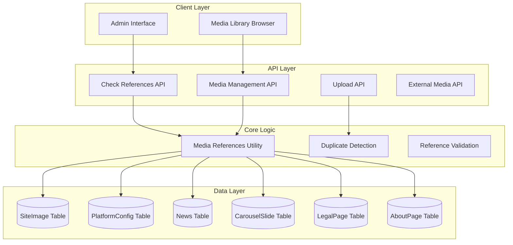
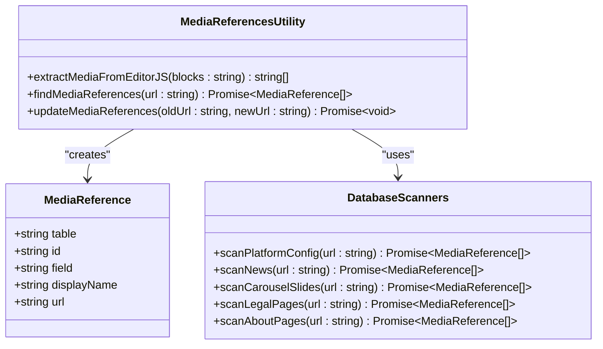
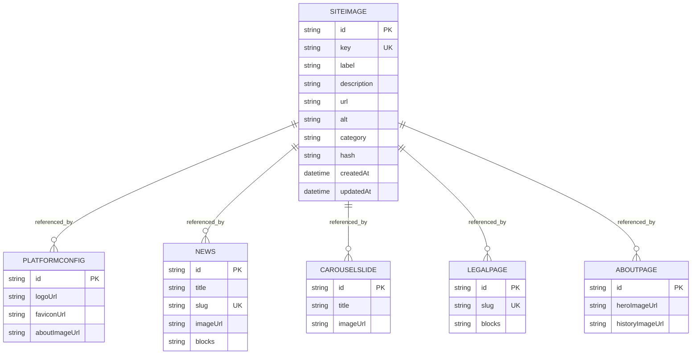
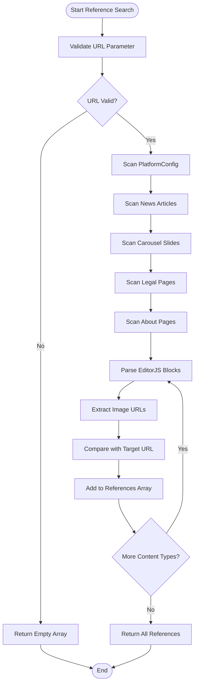
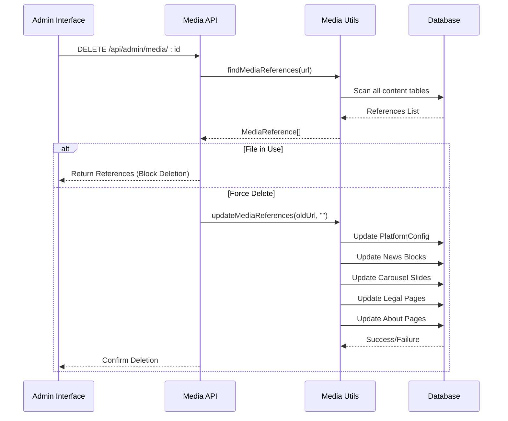
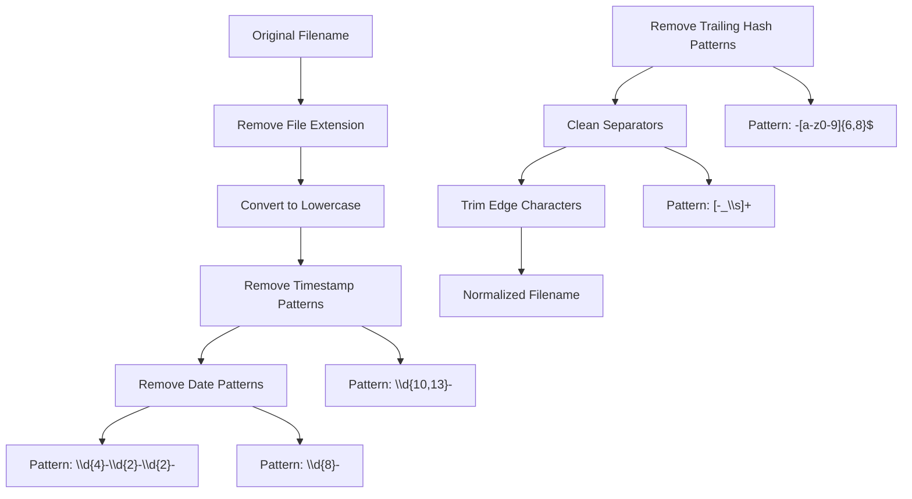
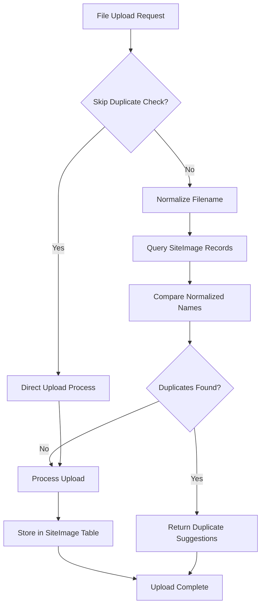
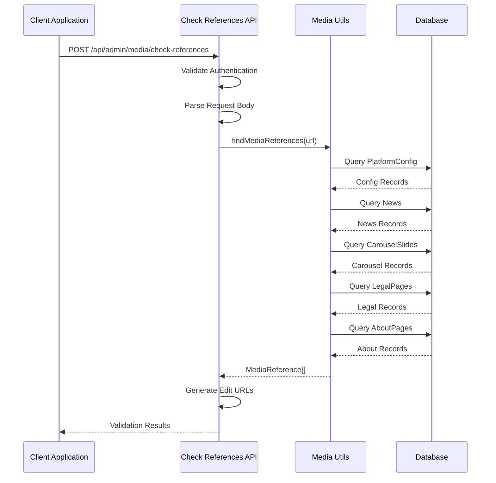
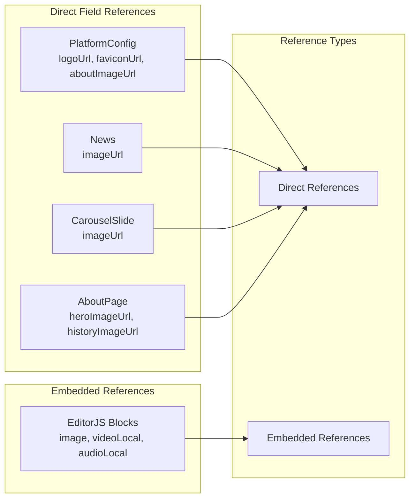

# Reference Tracking System

<cite>
**Referenced Files in This Document**
- [media-references.ts](file://src/lib/media-references.ts)
- [check-references/route.ts](file://src/app/api/admin/media/check-references/route.ts)
- [media/route.ts](file://src/app/api/admin/media/route.ts)
- [media/[id]/route.ts](file://src/app/api/admin/media/[id]/route.ts)
- [upload/route.ts](file://src/app/api/upload/route.ts)
- [external/route.ts](file://src/app/api/admin/media/external/route.ts)
- [schema.prisma](file://prisma/schema.prisma)
- [media-library-browser.tsx](file://src/components/media-library-browser.tsx)
- [test-check-references.js](file://test-check-references.js)
- [test-duplicate-detection.js](file://test-duplicate-detection.js)
</cite>

## Table of Contents
1. [Introduction](#introduction)
2. [System Architecture](#system-architecture)
3. [Core Components](#core-components)
4. [Media Reference Management](#media-reference-management)
5. [Duplicate Detection System](#duplicate-detection-system)
6. [Reference Validation and Cleanup](#reference-validation-and-cleanup)
7. [API Endpoints](#api-endpoints)
8. [Usage Tracking Across Content Types](#usage-tracking-across-content-types)
9. [Performance Considerations](#performance-considerations)
10. [Troubleshooting Guide](#troubleshooting-guide)
11. [Conclusion](#conclusion)

## Introduction

The Reference Tracking System is a comprehensive media management solution designed to track and manage references to media files across various content types in the Green Axis platform. This system ensures media integrity by preventing orphaned references, detecting duplicate usage, and maintaining accurate reference counts for all media assets.

The system operates through three primary mechanisms: reference tracking, duplicate detection, and lifecycle management. It integrates seamlessly with the content management system to automatically detect media usage in news articles, services, carousel slides, legal pages, and platform configurations.

## System Architecture

The Reference Tracking System follows a modular architecture with clear separation of concerns:



**Diagram sources**
- [media-references.ts:1-334](file://src/lib/media-references.ts#L1-L334)
- [check-references/route.ts:1-86](file://src/app/api/admin/media/check-references/route.ts#L1-L86)
- [media/route.ts:1-150](file://src/app/api/admin/media/route.ts#L1-L150)

## Core Components

### Media References Utility

The core of the reference tracking system is the `media-references.ts` utility module, which provides essential functions for media reference management.



**Diagram sources**
- [media-references.ts:6-181](file://src/lib/media-references.ts#L6-L181)

The utility provides three primary functions:

1. **MediaReference Interface**: Defines the structure for tracking media references across different content types
2. **Reference Extraction**: Parses EditorJS blocks to identify embedded media URLs
3. **Reference Management**: Handles both discovery and updates of media references

**Section sources**
- [media-references.ts:1-334](file://src/lib/media-references.ts#L1-L334)

### Database Schema Integration

The system integrates with the Prisma schema through the SiteImage model, which serves as the central repository for all media assets:



**Diagram sources**
- [schema.prisma:121-135](file://prisma/schema.prisma#L121-L135)
- [schema.prisma:16-78](file://prisma/schema.prisma#L16-L78)
- [schema.prisma:99-118](file://prisma/schema.prisma#L99-L118)
- [schema.prisma:138-158](file://prisma/schema.prisma#L138-L158)
- [schema.prisma:161-170](file://prisma/schema.prisma#L161-L170)
- [schema.prisma:225-276](file://prisma/schema.prisma#L225-L276)

**Section sources**
- [schema.prisma:1-277](file://prisma/schema.prisma#L1-L277)

## Media Reference Management

### Reference Discovery Algorithm

The system employs a comprehensive scanning algorithm to discover media references across all supported content types:



**Diagram sources**
- [media-references.ts:65-181](file://src/lib/media-references.ts#L65-L181)

The algorithm systematically scans each content type, extracting media URLs from both direct field references and embedded EditorJS blocks. This ensures comprehensive coverage of all media usage scenarios.

**Section sources**
- [media-references.ts:58-181](file://src/lib/media-references.ts#L58-L181)

### Reference Update Mechanism

When media files are deleted or replaced, the system provides automatic reference updating capabilities:



**Diagram sources**
- [media/[id]/route.ts:220-L320](file://src/app/api/admin/media/[id]/route.ts#L220-L320)
- [media-references.ts:190-333](file://src/lib/media-references.ts#L190-L333)

**Section sources**
- [media/[id]/route.ts:1-L320](file://src/app/api/admin/media/[id]/route.ts#L1-L320)
- [media-references.ts:183-333](file://src/lib/media-references.ts#L183-L333)

## Duplicate Detection System

### Filename Normalization Algorithm

The duplicate detection system implements sophisticated filename normalization to identify similar media files:



**Diagram sources**
- [upload/route.ts:128-148](file://src/app/api/upload/route.ts#L128-L148)

The normalization process removes common timestamp patterns, date prefixes, and random hash suffixes while preserving meaningful filename components.

**Section sources**
- [upload/route.ts:127-243](file://src/app/api/upload/route.ts#L127-L243)
- [test-duplicate-detection.js:8-26](file://test-duplicate-detection.js#L8-L26)

### Duplicate Detection Workflow

The system implements a two-tier duplicate detection approach:

1. **Pre-upload Detection**: Analyzes filenames before allowing uploads
2. **Post-upload Validation**: Cross-references with existing database records



**Diagram sources**
- [upload/route.ts:214-243](file://src/app/api/upload/route.ts#L214-L243)

**Section sources**
- [upload/route.ts:150-392](file://src/app/api/upload/route.ts#L150-L392)
- [test-duplicate-detection.js:53-79](file://test-duplicate-detection.js#L53-L79)

## Reference Validation and Cleanup

### Reference Validation Process

The system implements comprehensive validation to ensure media integrity:



**Diagram sources**
- [check-references/route.ts:37-86](file://src/app/api/admin/media/check-references/route.ts#L37-L86)
- [media-references.ts:65-181](file://src/lib/media-references.ts#L65-L181)

### Orphaned Media Cleanup

The system provides mechanisms for identifying and cleaning up orphaned media references:

1. **Usage Count Calculation**: Tracks total references across all content types
2. **Reference Mapping**: Creates human-readable edit URLs for each reference
3. **Safety Checks**: Prevents accidental deletion of referenced media

**Section sources**
- [check-references/route.ts:25-86](file://src/app/api/admin/media/check-references/route.ts#L25-L86)
- [media-references.ts:58-181](file://src/lib/media-references.ts#L58-L181)

## API Endpoints

### Media Reference Checking Endpoint

The `/api/admin/media/check-references` endpoint provides comprehensive media reference validation:

**Endpoint**: `POST /api/admin/media/check-references`

**Request Body**:
```json
{
  "url": "string (required)"
}
```

**Response Structure**:
```json
{
  "inUse": "boolean",
  "references": [
    {
      "table": "string",
      "id": "string",
      "field": "string",
      "displayName": "string",
      "editUrl": "string"
    }
  ],
  "usageCount": "number"
}
```

**Section sources**
- [check-references/route.ts:25-86](file://src/app/api/admin/media/check-references/route.ts#L25-L86)

### Media Management Endpoint

The `/api/admin/media` endpoint provides comprehensive media library management with reference tracking:

**Endpoint**: `GET /api/admin/media`

**Query Parameters**:
- `page`: Page number (default: 1)
- `limit`: Items per page (default: 50, max: 100)
- `category`: Filter by category
- `search`: Search by label
- `type`: Filter by type (image/video/audio)

**Response Structure**:
```json
{
  "items": [
    {
      "id": "string",
      "key": "string",
      "label": "string",
      "description": "string",
      "url": "string",
      "category": "string",
      "type": "string",
      "usageCount": "number",
      "createdAt": "string (ISO)",
      "updatedAt": "string (ISO)"
    }
  ],
  "pagination": {
    "page": "number",
    "limit": "number",
    "total": "number",
    "totalPages": "number",
    "hasMore": "boolean"
  }
}
```

**Section sources**
- [media/route.ts:27-150](file://src/app/api/admin/media/route.ts#L27-L150)

### Media Deletion Endpoint

The `/api/admin/media/[id]` endpoint handles media deletion with comprehensive reference validation:

**Endpoint**: `DELETE /api/admin/media/:id?force=false`

**Query Parameters**:
- `force`: Force delete even if media is in use

**Behavior**:
- Non-force mode: Returns references if media is in use
- Force mode: Deletes media and clears all references

**Section sources**
- [media/[id]/route.ts:214-L320](file://src/app/api/admin/media/[id]/route.ts#L214-L320)

## Usage Tracking Across Content Types

### Supported Content Types

The system tracks media references across five primary content types:

1. **Platform Configuration**: Logo, favicon, and about images
2. **News Articles**: Cover images and embedded media in EditorJS blocks
3. **Carousel Slides**: Hero images for promotional content
4. **Legal Pages**: Content images in EditorJS formatted pages
5. **About Pages**: Hero and history images

### Content Type Specific Tracking



**Diagram sources**
- [media-references.ts:74-174](file://src/lib/media-references.ts#L74-L174)

**Section sources**
- [media-references.ts:58-181](file://src/lib/media-references.ts#L58-L181)

## Performance Considerations

### Optimization Strategies

The system implements several performance optimizations:

1. **Lazy Loading**: Media library browser uses infinite scroll with 50-item batches
2. **Efficient Queries**: Database queries are optimized for reference scanning
3. **Caching**: Usage counts are calculated on-demand with minimal overhead
4. **Batch Operations**: Reference updates are performed in bulk operations

### Scalability Factors

- **Database Indexing**: SiteImage table benefits from unique key indexing
- **Query Optimization**: Reference scanning uses targeted queries per content type
- **Memory Management**: Large content parsing is handled efficiently
- **Network Efficiency**: API responses are optimized for client consumption

## Troubleshooting Guide

### Common Issues and Solutions

**Issue**: Reference checking fails with timeout
- **Cause**: Large database with many content types
- **Solution**: Implement pagination and optimize database queries

**Issue**: Duplicate detection not working properly
- **Cause**: Filename normalization conflicts
- **Solution**: Review normalization patterns and adjust as needed

**Issue**: Media deletion blocked unexpectedly
- **Cause**: Active references detected
- **Solution**: Review returned references and update content accordingly

**Section sources**
- [test-check-references.js:1-162](file://test-check-references.js#L1-L162)
- [media-references.ts:177-180](file://src/lib/media-references.ts#L177-L180)

### Testing and Validation

The system includes comprehensive test coverage:

- **Manual Testing Script**: Validates check-references endpoint functionality
- **Duplicate Detection Tests**: Validates filename normalization logic
- **Integration Testing**: Ensures proper coordination between components

**Section sources**
- [test-check-references.js:1-162](file://test-check-references.js#L1-L162)
- [test-duplicate-detection.js:1-79](file://test-duplicate-detection.js#L1-L79)

## Conclusion

The Reference Tracking System provides a robust foundation for media asset management in the Green Axis platform. Through comprehensive reference tracking, intelligent duplicate detection, and automated cleanup mechanisms, the system ensures media integrity while maintaining optimal performance.

Key strengths of the system include:

- **Comprehensive Coverage**: Tracks media usage across all supported content types
- **Intelligent Detection**: Uses sophisticated algorithms for duplicate identification
- **Safety Mechanisms**: Prevents accidental deletion of referenced media
- **Performance Optimization**: Implements efficient querying and caching strategies
- **Developer-Friendly**: Provides clear APIs and comprehensive error handling

The system's modular architecture allows for easy maintenance and future enhancements while ensuring reliable operation across all supported environments.