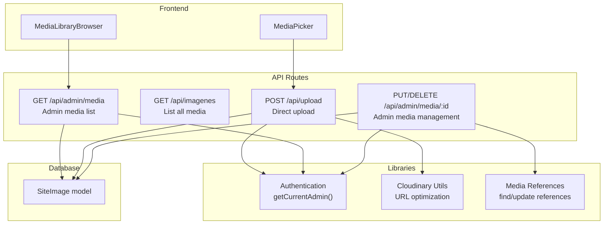
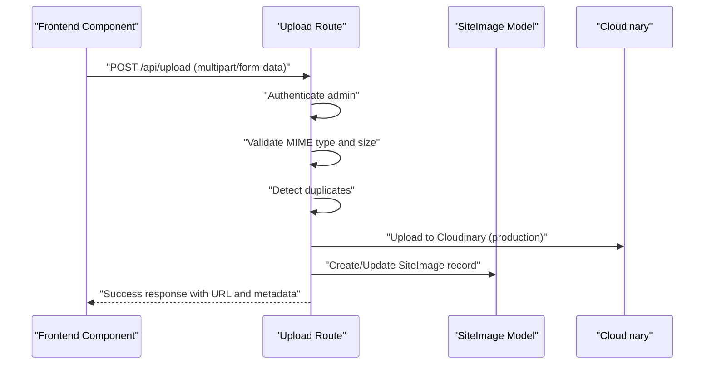
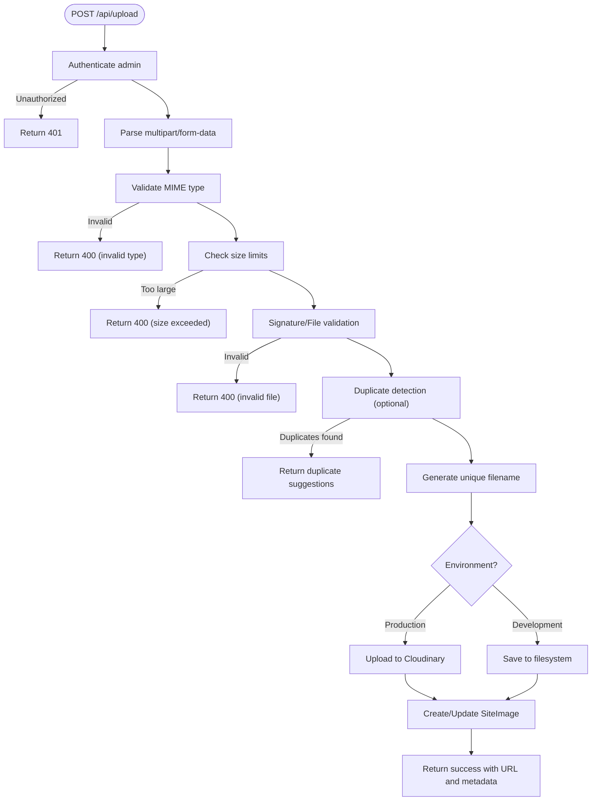
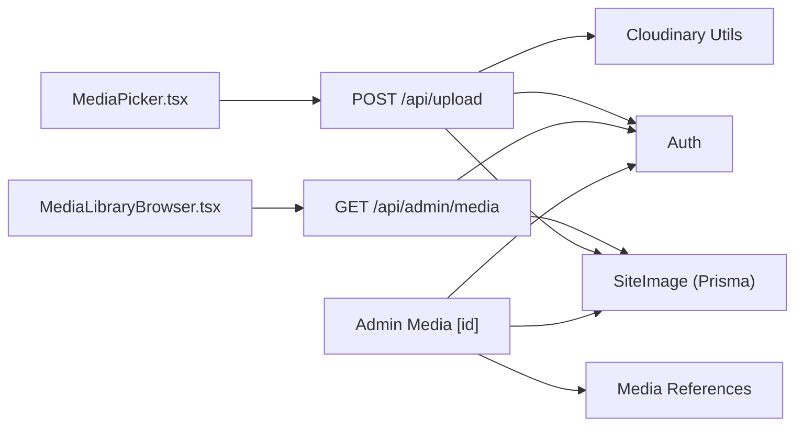

# Upload Endpoints

<cite>
**Referenced Files in This Document**
- [upload/route.ts](file://src/app/api/upload/route.ts)
- [imagenes/route.ts](file://src/app/api/imagenes/route.ts)
- [admin/media/route.ts](file://src/app/api/admin/media/route.ts)
- [admin/media/[id]/route.ts](file://src/app/api/admin/media/[id]/route.ts)
- [cloudinary.ts](file://src/lib/cloudinary.ts)
- [auth.ts](file://src/lib/auth.ts)
- [media-references.ts](file://src/lib/media-references.ts)
- [schema.prisma](file://prisma/schema.prisma)
- [media-picker.tsx](file://src/components/media-picker.tsx)
- [media-library-browser.tsx](file://src/components/media-library-browser.tsx)
</cite>

## Table of Contents
1. [Introduction](#introduction)
2. [Project Structure](#project-structure)
3. [Core Components](#core-components)
4. [Architecture Overview](#architecture-overview)
5. [Detailed Component Analysis](#detailed-component-analysis)
6. [Dependency Analysis](#dependency-analysis)
7. [Performance Considerations](#performance-considerations)
8. [Troubleshooting Guide](#troubleshooting-guide)
9. [Conclusion](#conclusion)

## Introduction
This document provides comprehensive API documentation for the media upload system, covering:
- Direct file upload via POST /api/upload
- Media management via GET /api/imagenes and administrative endpoints under /api/admin/media
- File validation rules, multipart/form-data handling, type restrictions, size limits, and Cloudinary integration
- Authentication requirements, error handling strategies, and response formats
- The complete upload pipeline from file reception through Cloudinary processing to database storage
- Security considerations, validation errors, and upload progress handling

## Project Structure
The media upload system spans API routes, database models, authentication utilities, and Cloudinary integration utilities. The frontend components integrate with these APIs to provide a seamless upload and management experience.

**Diagram sources**
- [upload/route.ts:150-392](file://src/app/api/upload/route.ts#L150-L392)
- [imagenes/route.ts:1-15](file://src/app/api/imagenes/route.ts#L1-L15)
- [admin/media/route.ts:37-149](file://src/app/api/admin/media/route.ts#L37-L149)
- [admin/media/[id]/route.ts](file://src/app/api/admin/media/[id]/route.ts#L125-L319)
- [cloudinary.ts:1-119](file://src/lib/cloudinary.ts#L1-L119)
- [auth.ts:156-170](file://src/lib/auth.ts#L156-L170)
- [media-references.ts:65-181](file://src/lib/media-references.ts#L65-L181)
- [schema.prisma:120-135](file://prisma/schema.prisma#L120-L135)
- [media-picker.tsx:201-316](file://src/components/media-picker.tsx#L201-L316)
- [media-library-browser.tsx:97-136](file://src/components/media-library-browser.tsx#L97-L136)

**Section sources**
- [upload/route.ts:1-452](file://src/app/api/upload/route.ts#L1-L452)
- [admin/media/route.ts:1-150](file://src/app/api/admin/media/route.ts#L1-L150)
- [admin/media/[id]/route.ts](file://src/app/api/admin/media/[id]/route.ts#L1-L320)
- [cloudinary.ts:1-119](file://src/lib/cloudinary.ts#L1-L119)
- [auth.ts:1-170](file://src/lib/auth.ts#L1-L170)
- [media-references.ts:1-334](file://src/lib/media-references.ts#L1-L334)
- [schema.prisma:120-135](file://prisma/schema.prisma#L120-L135)
- [media-picker.tsx:1-754](file://src/components/media-picker.tsx#L1-L754)
- [media-library-browser.tsx:1-362](file://src/components/media-library-browser.tsx#L1-L362)

## Core Components
- Authentication: Admin session verification via cookies using `getCurrentAdmin()`. All upload and admin endpoints require authentication.
- Upload Pipeline: POST /api/upload validates file type and size, performs duplicate detection, uploads to Cloudinary in production or filesystem in development, updates SiteImage records, and returns structured responses.
- Media Management: GET /api/admin/media lists media with pagination, filtering, and usage count calculation. PUT/DELETE /api/admin/media/:id updates metadata and deletes files with reference checks.
- Cloudinary Integration: Automatic resource type detection, secure uploads, and URL optimization utilities for performance.
- Frontend Integration: MediaPicker and MediaLibraryBrowser components consume these APIs for upload progress, duplicate warnings, and media browsing.

**Section sources**
- [auth.ts:156-170](file://src/lib/auth.ts#L156-L170)
- [upload/route.ts:150-392](file://src/app/api/upload/route.ts#L150-L392)
- [admin/media/route.ts:37-149](file://src/app/api/admin/media/route.ts#L37-L149)
- [admin/media/[id]/route.ts](file://src/app/api/admin/media/[id]/route.ts#L125-L319)
- [cloudinary.ts:1-119](file://src/lib/cloudinary.ts#L1-L119)
- [media-picker.tsx:201-316](file://src/components/media-picker.tsx#L201-L316)
- [media-library-browser.tsx:97-136](file://src/components/media-library-browser.tsx#L97-L136)

## Architecture Overview
The upload architecture integrates frontend components, API routes, database storage, and Cloudinary. It enforces authentication, validates files, manages duplicates, and ensures safe deletion with reference checks.

**Diagram sources**
- [upload/route.ts:150-392](file://src/app/api/upload/route.ts#L150-L392)
- [schema.prisma:120-135](file://prisma/schema.prisma#L120-L135)
- [cloudinary.ts:1-119](file://src/lib/cloudinary.ts#L1-L119)

## Detailed Component Analysis

### POST /api/upload
- Purpose: Accept direct file uploads with validation, duplicate detection, Cloudinary integration, and database persistence.
- Authentication: Requires admin session via `getCurrentAdmin()`.
- Request Method: POST
- Content-Type: multipart/form-data
- Required Fields:
  - file: File object (binary)
- Optional Fields:
  - key: Unique identifier for replacement logic
  - fixedKey: Override key for replacement
  - label: Display name
  - category: Media category
  - skipDuplicateCheck: Boolean to bypass duplicate detection
- Validation Rules:
  - Allowed MIME types: Images (JPEG, PNG, WebP, GIF, SVG), Videos (MP4, WebM, QuickTime, AVI), Audio (MP3, WAV, OGG, M4A)
  - Size Limits:
    - Development: Images ≤ 5MB, Videos ≤ 50MB, Audio ≤ 20MB
    - Production (Vercel): Images ≤ 5MB, Videos ≤ 25MB, Audio ≤ 15MB
  - File Signature Validation: Magic bytes for images; flexible validation for videos/audio/SVG
- Processing Workflow:
  1. Authenticate admin
  2. Parse multipart/form-data
  3. Validate MIME type and size
  4. Optional duplicate detection using normalized filenames
  5. Generate unique filename with safe extension
  6. Upload to Cloudinary in production or save to filesystem in development
  7. Update or create SiteImage record
  8. Return success with URL, filename, key, and replacement flag
- Error Handling:
  - 400: Missing file, invalid type, size exceeded, invalid file
  - 401: Unauthorized
  - 500: Internal errors with optional details in development
- Response Schema (success):
  - success: Boolean
  - url: String (Cloudinary URL or local path)
  - fileName: String
  - key: String
  - replaced: Boolean
- Response Schema (duplicate warning):
  - success: Boolean (false)
  - duplicate: Object
    - exists: Boolean
    - suggestions: Array of objects with id, label, url, category, key
  - message: String

**Diagram sources**
- [upload/route.ts:150-392](file://src/app/api/upload/route.ts#L150-L392)

**Section sources**
- [upload/route.ts:150-392](file://src/app/api/upload/route.ts#L150-L392)

### DELETE /api/upload
- Purpose: Delete uploaded files by key or URL, with environment-aware storage handling.
- Authentication: Requires admin session.
- Query Parameters:
  - key: SiteImage key
  - url: File URL (alternative to key)
- Behavior:
  - If key provided: Find SiteImage, delete file from Cloudinary or filesystem, then delete record
  - If url provided: Delete file only (no DB removal)
- Response:
  - 200: Success
  - 400: Missing key or url
  - 401: Unauthorized
  - 500: Internal error

**Section sources**
- [upload/route.ts:394-451](file://src/app/api/upload/route.ts#L394-L451)

### GET /api/imagenes
- Purpose: Retrieve all media entries ordered by creation date.
- Authentication: None (public listing)
- Response: Array of SiteImage objects

**Section sources**
- [imagenes/route.ts:1-15](file://src/app/api/imagenes/route.ts#L1-L15)
- [schema.prisma:120-135](file://prisma/schema.prisma#L120-L135)

### GET /api/admin/media
- Purpose: Admin-only media listing with pagination, filtering, and usage count.
- Authentication: Requires admin session.
- Query Parameters:
  - page: Number (default: 1)
  - limit: Number (default: 50, max: 100)
  - category: String (filter by category)
  - search: String (search by label)
  - type: String (image/video/audio)
- Response Schema:
  - items: Array of media objects with type and usageCount
  - pagination: Object with page, limit, total, totalPages, hasMore

**Section sources**
- [admin/media/route.ts:37-149](file://src/app/api/admin/media/route.ts#L37-L149)
- [media-references.ts:65-181](file://src/lib/media-references.ts#L65-L181)

### PUT /api/admin/media/:id
- Purpose: Update media metadata (label, description, category, alt).
- Authentication: Requires admin session.
- Request Body:
  - label: String (optional)
  - description: String (optional)
  - category: String (optional)
  - alt: String (optional)
- Validation:
  - At least one field must be provided
- Response:
  - success: Boolean
  - media: Updated SiteImage object

**Section sources**
- [admin/media/[id]/route.ts](file://src/app/api/admin/media/[id]/route.ts#L125-L211)

### DELETE /api/admin/media/:id
- Purpose: Delete media with reference checks and environment-aware cleanup.
- Authentication: Requires admin session.
- Query Parameters:
  - force: Boolean (default: false)
- Behavior:
  - Without force: Check references; if in use, return references without deleting
  - With force: Delete file from storage and clear references across the database
- Response:
  - Success: success=true, deleted=true, message
  - Not Found: success=false, message
  - In Use: success=false, deleted=false, message, references
  - Error: success=false, message, error code

**Section sources**
- [admin/media/[id]/route.ts](file://src/app/api/admin/media/[id]/route.ts#L220-L319)
- [media-references.ts:190-333](file://src/lib/media-references.ts#L190-L333)

### Cloudinary Integration
- Configuration: Supports both CLOUDINARY_URL and individual environment variables.
- Resource Type Detection: Auto-detects image/video/audio during upload.
- URL Optimization Utilities:
  - getCloudinaryImageUrl: Injects f_auto, q_auto, w_ transforms
  - Preset helpers: Hero, Thumbnail, Service, Admin Thumbnail
- Production Handling: Uses Cloudinary uploader; development saves to /public/uploads.

**Section sources**
- [upload/route.ts:9-28](file://src/app/api/upload/route.ts#L9-L28)
- [cloudinary.ts:1-119](file://src/lib/cloudinary.ts#L1-L119)

### Frontend Integration
- MediaPicker:
  - Drag-and-drop and file input
  - Progress tracking via XMLHttpRequest
  - Duplicate detection with suggestion modal
  - Accept attribute matches allowed MIME types
- MediaLibraryBrowser:
  - Infinite scroll pagination (50 per page)
  - Search and category filters
  - Usage count badges via admin media endpoint

**Section sources**
- [media-picker.tsx:201-316](file://src/components/media-picker.tsx#L201-L316)
- [media-library-browser.tsx:97-136](file://src/components/media-library-browser.tsx#L97-L136)

## Dependency Analysis
The upload system exhibits clear separation of concerns:
- API routes depend on authentication utilities and database models
- Upload route depends on Cloudinary SDK and file system utilities
- Admin media endpoints depend on media reference utilities for safety
- Frontend components depend on API routes for data and upload progress

**Diagram sources**
- [media-picker.tsx:201-316](file://src/components/media-picker.tsx#L201-L316)
- [media-library-browser.tsx:97-136](file://src/components/media-library-browser.tsx#L97-L136)
- [upload/route.ts:150-392](file://src/app/api/upload/route.ts#L150-L392)
- [admin/media/route.ts:37-149](file://src/app/api/admin/media/route.ts#L37-L149)
- [admin/media/[id]/route.ts](file://src/app/api/admin/media/[id]/route.ts#L125-L319)
- [cloudinary.ts:1-119](file://src/lib/cloudinary.ts#L1-L119)
- [media-references.ts:65-181](file://src/lib/media-references.ts#L65-L181)
- [auth.ts:156-170](file://src/lib/auth.ts#L156-L170)
- [schema.prisma:120-135](file://prisma/schema.prisma#L120-L135)

**Section sources**
- [upload/route.ts:1-452](file://src/app/api/upload/route.ts#L1-L452)
- [admin/media/route.ts:1-150](file://src/app/api/admin/media/route.ts#L1-L150)
- [admin/media/[id]/route.ts](file://src/app/api/admin/media/[id]/route.ts#L1-L320)
- [media-references.ts:1-334](file://src/lib/media-references.ts#L1-L334)
- [cloudinary.ts:1-119](file://src/lib/cloudinary.ts#L1-L119)
- [auth.ts:1-170](file://src/lib/auth.ts#L1-L170)
- [schema.prisma:120-135](file://prisma/schema.prisma#L120-L135)
- [media-picker.tsx:1-754](file://src/components/media-picker.tsx#L1-L754)
- [media-library-browser.tsx:1-362](file://src/components/media-library-browser.tsx#L1-L362)

## Performance Considerations
- Production vs Development:
  - Production (Vercel): Cloudinary uploads with optimized resource types and strict size limits
  - Development: Local filesystem saves for simplicity
- Pagination: Admin media endpoint caps limit at 100 per page to prevent excessive loads
- Reference Checking: Deletion checks references to avoid breaking content; consider caching reference counts for improved performance
- Frontend Progress: XMLHttpRequest-based progress tracking reduces overhead compared to streaming uploads

[No sources needed since this section provides general guidance]

## Troubleshooting Guide
Common Issues and Resolutions:
- Unauthorized Access:
  - Symptom: 401 responses from all protected endpoints
  - Resolution: Ensure admin session cookie is present and valid
- Invalid File Type:
  - Symptom: 400 error mentioning allowed types
  - Resolution: Verify MIME type matches allowed list
- File Too Large:
  - Symptom: 400 error with size limit message
  - Resolution: Compress or choose smaller files; use Cloudinary Console for large files in production
- Duplicate File Warning:
  - Symptom: Response includes duplicate suggestions
  - Resolution: Choose existing file or bypass with skipDuplicateCheck
- Cloudinary Upload Failure:
  - Symptom: 500 error with Cloudinary-related message
  - Resolution: Check Cloudinary configuration and network connectivity
- File Deletion Fails:
  - Symptom: 500 error on DELETE /api/admin/media/:id
  - Resolution: Verify file exists in storage; use force=true cautiously to clear references

**Section sources**
- [upload/route.ts:170-211](file://src/app/api/upload/route.ts#L170-L211)
- [upload/route.ts:357-391](file://src/app/api/upload/route.ts#L357-L391)
- [admin/media/[id]/route.ts](file://src/app/api/admin/media/[id]/route.ts#L251-L280)
- [media-picker.tsx:244-267](file://src/components/media-picker.tsx#L244-L267)

## Conclusion
The media upload system provides a robust, secure, and scalable solution for managing images, videos, and audio across the application. It enforces strict validation, supports both production Cloudinary integration and development filesystem storage, and offers comprehensive admin controls with reference safety. Frontend components deliver a smooth user experience with progress tracking and duplicate detection, while the backend ensures data integrity and efficient retrieval.