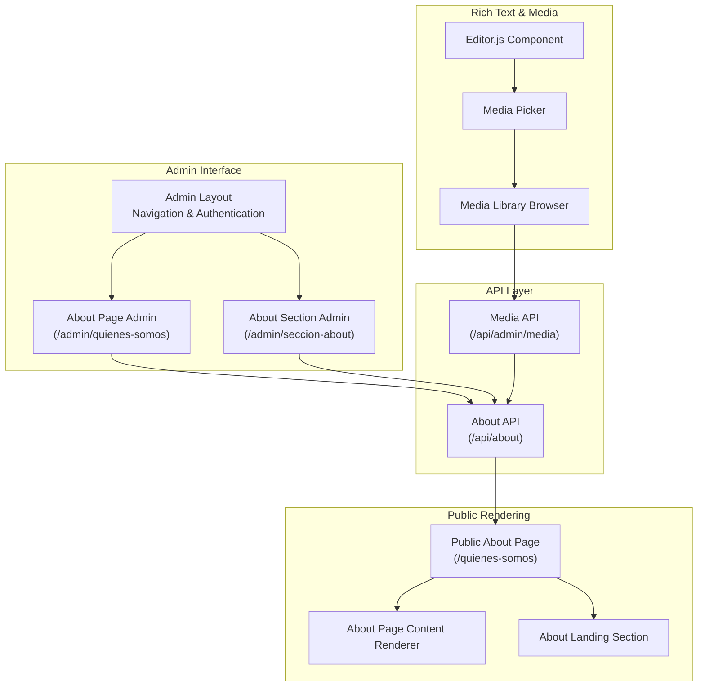
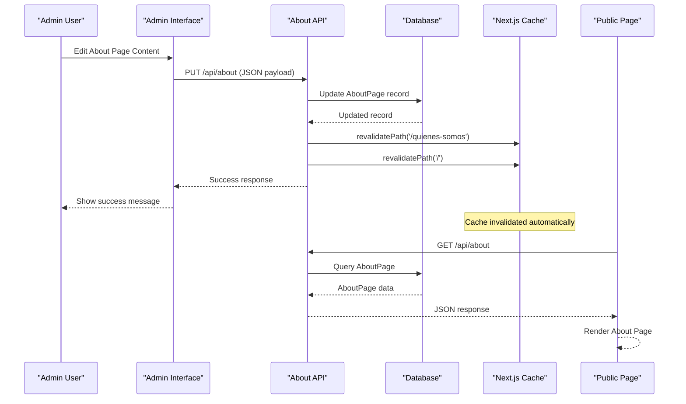
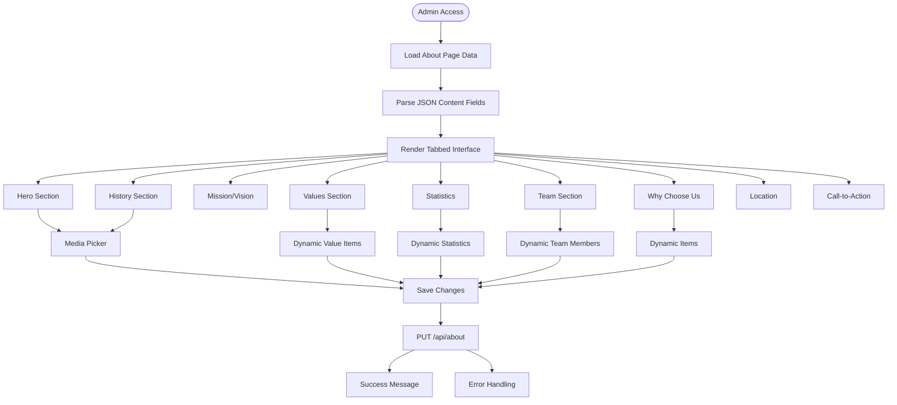
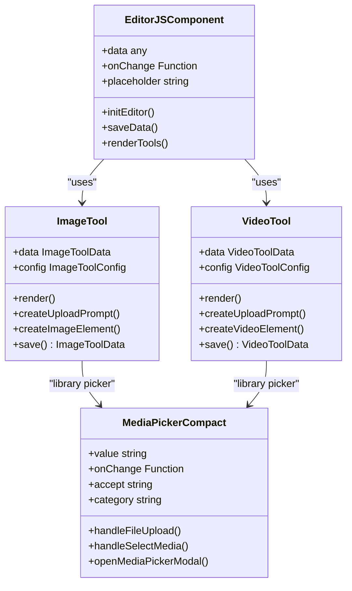
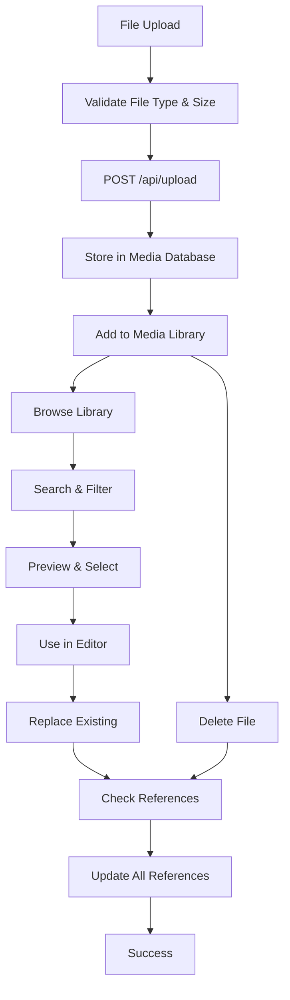
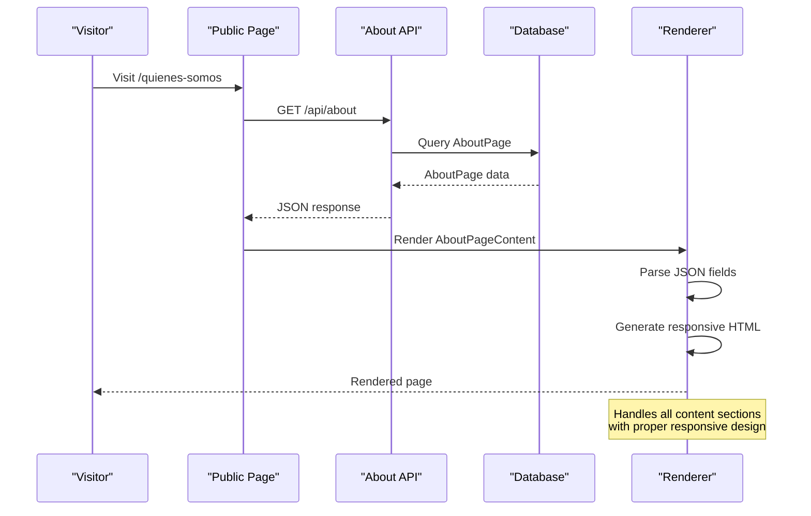
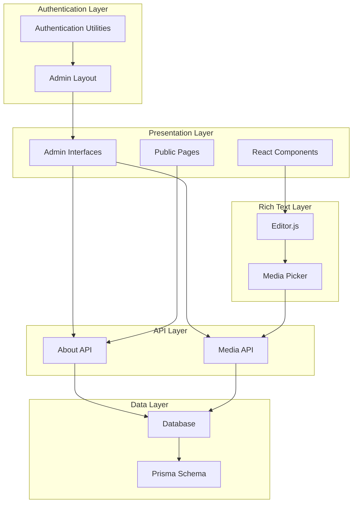

# About Us Content Management

<cite>
**Referenced Files in This Document**
- [src/app/admin/quienes-somos/page.tsx](file://src/app/admin/quienes-somos/page.tsx)
- [src/app/admin/seccion-about/page.tsx](file://src/app/admin/seccion-about/page.tsx)
- [src/components/about-page-content.tsx](file://src/components/about-page-content.tsx)
- [src/components/about-section.tsx](file://src/components/about-section.tsx)
- [src/app/api/about/route.ts](file://src/app/api/about/route.ts)
- [src/app/quienes-somos/page.tsx](file://src/app/quienes-somos/page.tsx)
- [src/components/media-picker-compact.tsx](file://src/components/media-picker-compact.tsx)
- [src/components/editor-js.tsx](file://src/components/editor-js.tsx)
- [src/components/editor-js-image-tool.ts](file://src/components/editor-js-image-tool.ts)
- [src/components/editor-js-video-tool.ts](file://src/components/editor-js-video-tool.ts)
- [src/app/api/admin/media/route.ts](file://src/app/api/admin/media/route.ts)
- [src/lib/media-references.ts](file://src/lib/media-references.ts)
- [src/lib/auth.ts](file://src/lib/auth.ts)
- [src/components/admin-layout.tsx](file://src/components/admin-layout.tsx)
- [prisma/schema.prisma](file://prisma/schema.prisma)
</cite>

## Table of Contents
1. [Introduction](#introduction)
2. [Project Structure](#project-structure)
3. [Core Components](#core-components)
4. [Architecture Overview](#architecture-overview)
5. [Detailed Component Analysis](#detailed-component-analysis)
6. [Dependency Analysis](#dependency-analysis)
7. [Performance Considerations](#performance-considerations)
8. [Troubleshooting Guide](#troubleshooting-guide)
9. [Conclusion](#conclusion)

## Introduction
This document describes the About Us Content Management System implemented in the GreenAxis project. It covers the complete about page implementation, content editing workflows, rich text content management through Editor.js, page structure and content sections organization, media integration capabilities, responsive design considerations, content validation, preview functionality, publishing workflows, API endpoints for about page data, content versioning, and the administrative interface for content updates.

## Project Structure
The About Us system spans three main areas:
- Administrative interface for content editing
- Public-facing about page rendering
- Rich text editing and media management infrastructure

**Diagram sources**
- [src/app/admin/layout.tsx:1-18](file://src/app/admin/layout.tsx#L1-L18)
- [src/app/admin/quienes-somos/page.tsx:1-536](file://src/app/admin/quienes-somos/page.tsx#L1-L536)
- [src/app/admin/seccion-about/page.tsx:1-447](file://src/app/admin/seccion-about/page.tsx#L1-L447)
- [src/app/api/about/route.ts:1-148](file://src/app/api/about/route.ts#L1-L148)
- [src/app/api/admin/media/route.ts:1-150](file://src/app/api/admin/media/route.ts#L1-L150)
- [src/app/quienes-somos/page.tsx:1-39](file://src/app/quienes-somos/page.tsx#L1-L39)
- [src/components/about-page-content.tsx:1-385](file://src/components/about-page-content.tsx#L1-L385)
- [src/components/about-section.tsx:1-169](file://src/components/about-section.tsx#L1-L169)
- [src/components/editor-js.tsx:1-850](file://src/components/editor-js.tsx#L1-L850)
- [src/components/media-picker-compact.tsx:1-691](file://src/components/media-picker-compact.tsx#L1-L691)

**Section sources**
- [src/app/admin/layout.tsx:1-18](file://src/app/admin/layout.tsx#L1-L18)
- [src/app/admin/quienes-somos/page.tsx:1-536](file://src/app/admin/quienes-somos/page.tsx#L1-L536)
- [src/app/admin/seccion-about/page.tsx:1-447](file://src/app/admin/seccion-about/page.tsx#L1-L447)
- [src/app/api/about/route.ts:1-148](file://src/app/api/about/route.ts#L1-L148)
- [src/app/api/admin/media/route.ts:1-150](file://src/app/api/admin/media/route.ts#L1-L150)
- [src/app/quienes-somos/page.tsx:1-39](file://src/app/quienes-somos/page.tsx#L1-L39)
- [src/components/about-page-content.tsx:1-385](file://src/components/about-page-content.tsx#L1-L385)
- [src/components/about-section.tsx:1-169](file://src/components/about-section.tsx#L1-L169)
- [src/components/editor-js.tsx:1-850](file://src/components/editor-js.tsx#L1-L850)
- [src/components/media-picker-compact.tsx:1-691](file://src/components/media-picker-compact.tsx#L1-L691)

## Core Components
The system consists of several interconnected components:

### Data Model
The AboutPage model defines the complete content structure with JSON fields for complex content sections:
- Hero section (title, subtitle, image)
- History section (title, content, image)
- Mission/Vision sections
- Values section (JSON array with title/description/icon)
- Team section (enable/disable, members JSON)
- Why choose us section (JSON array)
- Statistics section (enable/disable, JSON array)
- Certifications section (enable/disable, JSON array)
- Call-to-action section
- Location section visibility

### Administrative Interface
Two admin pages provide comprehensive editing capabilities:
- **About Page Admin** (`/admin/quienes-somos`): Full-page editing with tabbed sections for all content areas
- **About Section Admin** (`/admin/seccion-about`): Landing page section configuration

### Public Rendering
- **Public About Page** (`/quienes-somos`): Renders the complete about page using the AboutPageContent component
- **About Landing Section**: Separate component for the main landing page about section

### Rich Text Editing
- **Editor.js Integration**: Custom component with localized tools and media upload capabilities
- **Custom Tools**: Image, video, and audio tools with library picker integration
- **Media Management**: Integrated media picker with upload, library browsing, and duplicate detection

**Section sources**
- [prisma/schema.prisma:224-276](file://prisma/schema.prisma#L224-L276)
- [src/app/admin/quienes-somos/page.tsx:15-68](file://src/app/admin/quienes-somos/page.tsx#L15-L68)
- [src/app/admin/seccion-about/page.tsx:15-28](file://src/app/admin/seccion-about/page.tsx#L15-L28)
- [src/components/about-page-content.tsx:19-46](file://src/components/about-page-content.tsx#L19-L46)
- [src/components/editor-js.tsx:344-575](file://src/components/editor-js.tsx#L344-L575)

## Architecture Overview
The system follows a layered architecture with clear separation between admin interface, API layer, and public rendering.

**Diagram sources**
- [src/app/api/about/route.ts:62-146](file://src/app/api/about/route.ts#L62-L146)
- [src/app/admin/quienes-somos/page.tsx:124-158](file://src/app/admin/quienes-somos/page.tsx#L124-L158)
- [src/app/quienes-somos/page.tsx:6-17](file://src/app/quienes-somos/page.tsx#L6-L17)

The architecture ensures:
- **Content Versioning**: Automatic cache revalidation on updates
- **Authentication**: Admin-only access to editing endpoints
- **Data Consistency**: Single source of truth in the database
- **Performance**: Efficient caching and minimal API calls

## Detailed Component Analysis

### About Page Admin Interface
The admin interface provides comprehensive editing capabilities through a tabbed interface:

**Diagram sources**
- [src/app/admin/quienes-somos/page.tsx:83-535](file://src/app/admin/quienes-somos/page.tsx#L83-L535)

Key features:
- **Tabbed Organization**: Logical grouping of content sections
- **Dynamic Lists**: Add/remove values, statistics, team members, and why-choose items
- **Media Integration**: Built-in media picker for all image fields
- **Real-time Validation**: JSON parsing with fallback to defaults
- **Bulk Operations**: Complete section enable/disable toggles

**Section sources**
- [src/app/admin/quienes-somos/page.tsx:83-535](file://src/app/admin/quienes-somos/page.tsx#L83-L535)

### Rich Text Content Management with Editor.js
The system integrates Editor.js for rich text editing with custom tools and media management:

**Diagram sources**
- [src/components/editor-js.tsx:344-575](file://src/components/editor-js.tsx#L344-L575)
- [src/components/editor-js-image-tool.ts:21-345](file://src/components/editor-js-image-tool.ts#L21-L345)
- [src/components/editor-js-video-tool.ts:19-319](file://src/components/editor-js-video-tool.ts#L19-L319)
- [src/components/media-picker-compact.tsx:94-691](file://src/components/media-picker-compact.tsx#L94-L691)

Advanced features:
- **Custom Tools**: Specialized tools for images, videos, and audio with upload capabilities
- **Library Integration**: Seamless integration with the media library browser
- **Duplicate Detection**: Intelligent duplicate detection during uploads
- **Progress Tracking**: Real-time upload progress with visual feedback
- **Responsive Design**: Mobile-optimized editing interface

**Section sources**
- [src/components/editor-js.tsx:344-850](file://src/components/editor-js.tsx#L344-L850)
- [src/components/editor-js-image-tool.ts:1-346](file://src/components/editor-js-image-tool.ts#L1-L346)
- [src/components/editor-js-video-tool.ts:1-319](file://src/components/editor-js-video-tool.ts#L1-L319)

### Media Management System
The media management system provides comprehensive file handling and organization:

**Diagram sources**
- [src/components/media-picker-compact.tsx:175-290](file://src/components/media-picker-compact.tsx#L175-L290)
- [src/app/api/admin/media/route.ts:37-149](file://src/app/api/admin/media/route.ts#L37-L149)
- [src/lib/media-references.ts:65-181](file://src/lib/media-references.ts#L65-L181)

Key capabilities:
- **File Validation**: Type and size validation with user-friendly error messages
- **Duplicate Detection**: Intelligent duplicate detection with suggestion system
- **Usage Tracking**: Automatic reference tracking across all content types
- **Batch Operations**: Bulk updates when replacing files
- **External Media Support**: Direct URL integration for external resources

**Section sources**
- [src/components/media-picker-compact.tsx:175-691](file://src/components/media-picker-compact.tsx#L175-L691)
- [src/app/api/admin/media/route.ts:1-150](file://src/app/api/admin/media/route.ts#L1-L150)
- [src/lib/media-references.ts:1-334](file://src/lib/media-references.ts#L1-L334)

### Public Rendering Pipeline
The public rendering system transforms stored content into optimized HTML:

**Diagram sources**
- [src/app/quienes-somos/page.tsx:6-17](file://src/app/quienes-somos/page.tsx#L6-L17)
- [src/app/api/about/route.ts:6-59](file://src/app/api/about/route.ts#L6-L59)
- [src/components/about-page-content.tsx:58-384](file://src/components/about-page-content.tsx#L58-L384)

**Section sources**
- [src/app/quienes-somos/page.tsx:1-39](file://src/app/quienes-somos/page.tsx#L1-L39)
- [src/components/about-page-content.tsx:1-385](file://src/components/about-page-content.tsx#L1-L385)

## Dependency Analysis
The system exhibits strong modularity with clear dependency boundaries:

**Diagram sources**
- [src/lib/auth.ts:1-170](file://src/lib/auth.ts#L1-L170)
- [src/components/admin-layout.tsx:61-383](file://src/components/admin-layout.tsx#L61-L383)
- [prisma/schema.prisma:224-276](file://prisma/schema.prisma#L224-L276)
- [src/app/api/about/route.ts:1-148](file://src/app/api/about/route.ts#L1-L148)
- [src/app/api/admin/media/route.ts:1-150](file://src/app/api/admin/media/route.ts#L1-L150)
- [src/components/editor-js.tsx:344-575](file://src/components/editor-js.tsx#L344-L575)

Key dependency characteristics:
- **Low Coupling**: Clear separation between admin and public interfaces
- **High Cohesion**: Related functionality grouped within components
- **Database Abstraction**: Prisma provides consistent data access
- **Authentication Enforcement**: Centralized admin authentication
- **Media Independence**: Media system decoupled from content editing

**Section sources**
- [src/lib/auth.ts:1-170](file://src/lib/auth.ts#L1-L170)
- [src/components/admin-layout.tsx:1-384](file://src/components/admin-layout.tsx#L1-L384)
- [prisma/schema.prisma:1-277](file://prisma/schema.prisma#L1-L277)

## Performance Considerations
The system implements several performance optimizations:

### Caching Strategy
- **Automatic Cache Revalidation**: API updates trigger automatic cache invalidation
- **Selective Revalidation**: Only affected routes are cleared (about page and home page)
- **Database-Level Defaults**: Automatic creation of default content prevents query overhead

### Media Optimization
- **Lazy Loading**: Images use native lazy loading for improved performance
- **Responsive Sizing**: Proper image sizing attributes for optimal loading
- **Thumbnail Generation**: Media library displays thumbnails for efficient browsing
- **Pagination**: Media library uses pagination to limit initial load

### Rendering Optimizations
- **Component Splitting**: Separate components for different content sections
- **Conditional Rendering**: Sections only render when data is available
- **Efficient JSON Parsing**: Minimal parsing overhead with fallback mechanisms

## Troubleshooting Guide

### Common Issues and Solutions

#### Authentication Problems
**Issue**: Admin login failing or redirect loops
**Solution**: Verify session cookie settings and admin account existence
- Check authentication middleware in admin layout
- Verify admin credentials in database
- Review session expiration settings

#### Content Loading Failures
**Issue**: About page content not loading in admin
**Solution**: Check database connectivity and default content creation
- Verify AboutPage model exists in schema
- Ensure database migration has been applied
- Check network connectivity to database

#### Media Upload Issues
**Issue**: File uploads failing or timing out
**Solution**: Validate file size limits and network connectivity
- Check file size validation (default 50MB limit)
- Verify upload endpoint accessibility
- Review browser console for CORS errors

#### Rich Text Editor Problems
**Issue**: Editor.js not initializing or losing content
**Solution**: Check script loading and JSON serialization
- Verify Editor.js library loading
- Ensure JSON data structure compliance
- Check for JavaScript errors in console

**Section sources**
- [src/lib/auth.ts:50-77](file://src/lib/auth.ts#L50-L77)
- [src/app/admin/layout.tsx:10-16](file://src/app/admin/layout.tsx#L10-L16)
- [src/app/api/about/route.ts:8-59](file://src/app/api/about/route.ts#L8-L59)
- [src/components/media-picker-compact.tsx:175-290](file://src/components/media-picker-compact.tsx#L175-L290)

## Conclusion
The About Us Content Management System provides a comprehensive solution for managing corporate storytelling content. Its modular architecture, rich text editing capabilities, and integrated media management create a powerful platform for content creators while maintaining strong security and performance characteristics.

Key strengths include:
- **Complete Content Control**: Full-page editing with granular section management
- **Rich Text Flexibility**: Professional-grade editing with media integration
- **Media Intelligence**: Smart media handling with duplicate detection and reference tracking
- **Security Focus**: Admin-only editing with robust authentication
- **Performance Optimization**: Efficient caching and rendering strategies
- **Developer Experience**: Clean APIs and well-structured components

The system successfully balances flexibility for content editors with reliability for end users, providing a foundation for evolving content needs while maintaining high standards for security and performance.