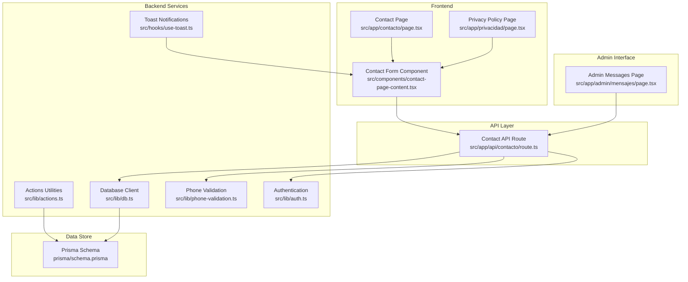
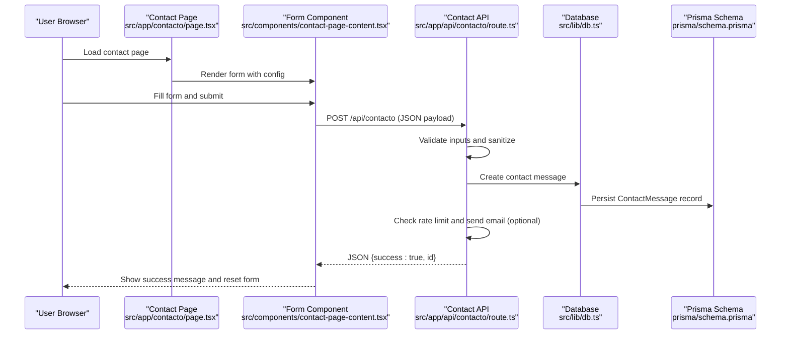
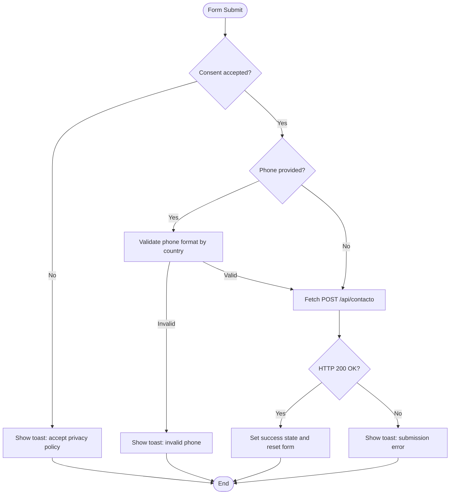
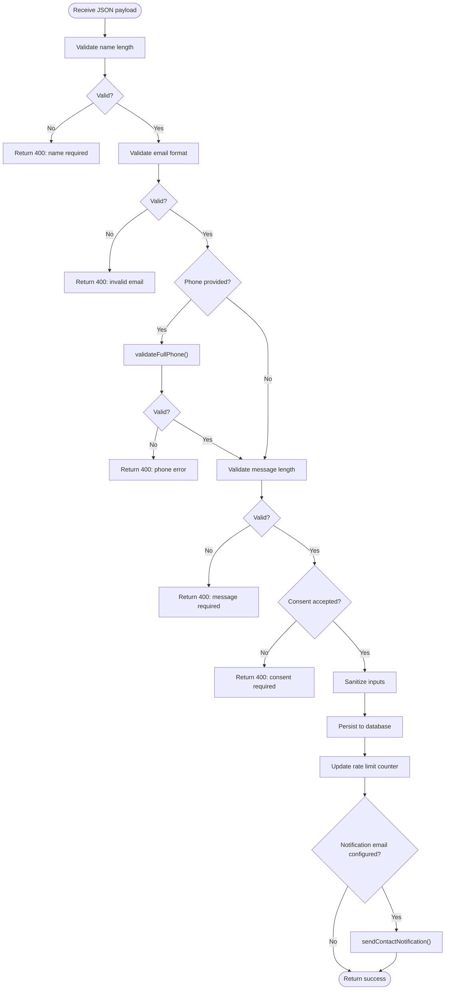
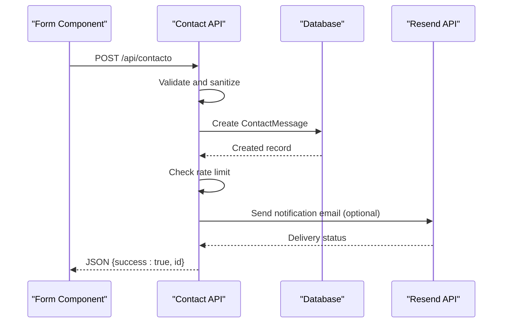
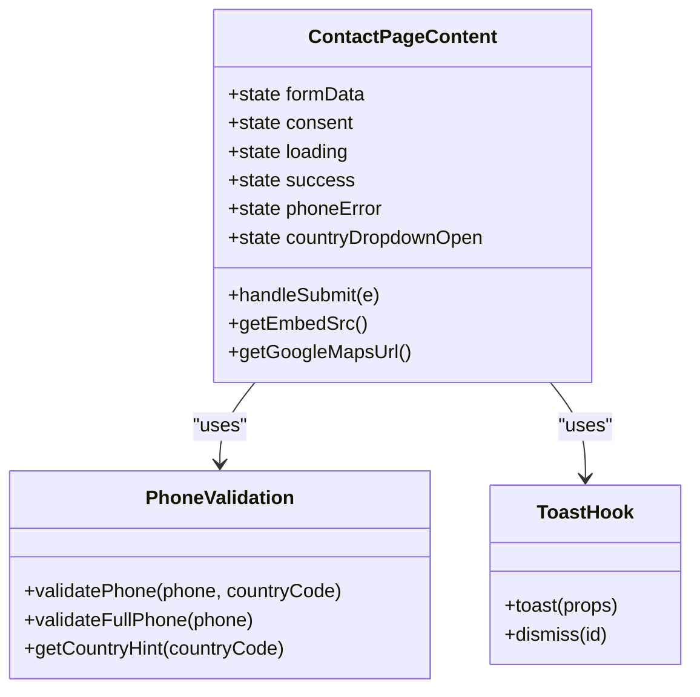
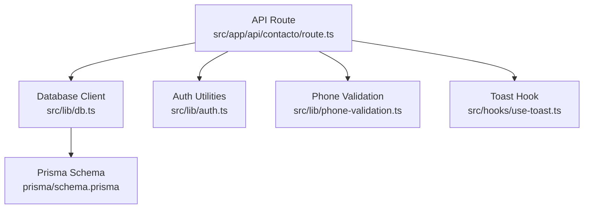

# Contact Form Functionality

<cite>
**Referenced Files in This Document**
- [page.tsx](file://src/app/contacto/page.tsx)
- [route.ts](file://src/app/api/contacto/route.ts)
- [contact-page-content.tsx](file://src/components/contact-page-content.tsx)
- [actions.ts](file://src/lib/actions.ts)
- [phone-validation.ts](file://src/lib/phone-validation.ts)
- [db.ts](file://src/lib/db.ts)
- [schema.prisma](file://prisma/schema.prisma)
- [auth.ts](file://src/lib/auth.ts)
- [use-toast.ts](file://src/hooks/use-toast.ts)
- [page.tsx](file://src/app/admin/mensajes/page.tsx)
- [page.tsx](file://src/app/privacidad/page.tsx)
</cite>

## Table of Contents
1. [Introduction](#introduction)
2. [Project Structure](#project-structure)
3. [Core Components](#core-components)
4. [Architecture Overview](#architecture-overview)
5. [Detailed Component Analysis](#detailed-component-analysis)
6. [Dependency Analysis](#dependency-analysis)
7. [Performance Considerations](#performance-considerations)
8. [Troubleshooting Guide](#troubleshooting-guide)
9. [Conclusion](#conclusion)

## Introduction
This document provides comprehensive documentation for the contact form functionality implemented in the Next.js application. It covers the contact page implementation, form validation mechanisms, user input handling, submission processing workflows, and administrative management of messages. The system integrates with Resend for email notifications, implements rate limiting to prevent abuse, and ensures compliance with data privacy requirements through explicit consent and secure storage.

## Project Structure
The contact form functionality spans several key areas:
- Frontend page and form component for user interaction
- API route for form submission, validation, persistence, and email notifications
- Database schema for storing contact messages
- Administrative interface for managing received messages
- Privacy policy page detailing data protection practices
- Supporting utilities for phone validation and toast notifications

**Diagram sources**
- [page.tsx:1-20](file://src/app/contacto/page.tsx#L1-L20)
- [contact-page-content.tsx:1-414](file://src/components/contact-page-content.tsx#L1-L414)
- [route.ts:1-302](file://src/app/api/contacto/route.ts#L1-L302)
- [db.ts:1-21](file://src/lib/db.ts#L1-L21)
- [actions.ts:1-136](file://src/lib/actions.ts#L1-L136)
- [phone-validation.ts:1-113](file://src/lib/phone-validation.ts#L1-L113)
- [auth.ts:1-170](file://src/lib/auth.ts#L1-L170)
- [use-toast.ts:1-194](file://src/hooks/use-toast.ts#L1-L194)
- [schema.prisma:172-185](file://prisma/schema.prisma#L172-L185)
- [page.tsx:1-299](file://src/app/admin/mensajes/page.tsx#L1-L299)
- [page.tsx:1-70](file://src/app/privacidad/page.tsx#L1-L70)

**Section sources**
- [page.tsx:1-20](file://src/app/contacto/page.tsx#L1-L20)
- [contact-page-content.tsx:1-414](file://src/components/contact-page-content.tsx#L1-L414)
- [route.ts:1-302](file://src/app/api/contacto/route.ts#L1-L302)
- [schema.prisma:172-185](file://prisma/schema.prisma#L172-L185)

## Core Components
- Contact Page: Renders the public contact page and passes platform configuration to the form component.
- Contact Form Component: Manages user input, client-side validation, submission flow, and success/error feedback.
- Contact API Route: Handles form submissions, server-side validation, sanitization, persistence, rate limiting, and email notifications via Resend.
- Database Model: Defines the ContactMessage entity and its fields for storing submitted data.
- Admin Messages Page: Provides administrative access to view, mark as read, and delete messages.
- Privacy Policy: Documents data protection practices and consent requirements.
- Supporting Utilities: Phone validation helpers and toast notification system.

**Section sources**
- [page.tsx:5-19](file://src/app/contacto/page.tsx#L5-L19)
- [contact-page-content.tsx:26-414](file://src/components/contact-page-content.tsx#L26-L414)
- [route.ts:137-302](file://src/app/api/contacto/route.ts#L137-L302)
- [schema.prisma:172-185](file://prisma/schema.prisma#L172-L185)
- [page.tsx:31-299](file://src/app/admin/mensajes/page.tsx#L31-L299)
- [page.tsx:5-69](file://src/app/privacidad/page.tsx#L5-L69)
- [phone-validation.ts:48-113](file://src/lib/phone-validation.ts#L48-L113)
- [use-toast.ts:145-194](file://src/hooks/use-toast.ts#L145-L194)

## Architecture Overview
The contact form follows a layered architecture:
- Presentation Layer: Next.js app routes and components render the contact page and form.
- API Layer: Next.js API route handles requests, performs validation, and orchestrates persistence and notifications.
- Persistence Layer: Prisma ORM manages SQLite/Turso-backed storage for contact messages and platform configuration.
- Security Layer: Authentication checks for admin endpoints, rate limiting for submissions, and consent validation.
- Notification Layer: Resend integration sends HTML emails to configured notification addresses.

**Diagram sources**
- [page.tsx:5-19](file://src/app/contacto/page.tsx#L5-L19)
- [contact-page-content.tsx:73-147](file://src/components/contact-page-content.tsx#L73-L147)
- [route.ts:137-229](file://src/app/api/contacto/route.ts#L137-L229)
- [db.ts:14-21](file://src/lib/db.ts#L14-L21)
- [schema.prisma:172-185](file://prisma/schema.prisma#L172-L185)

## Detailed Component Analysis

### Contact Page Implementation
The contact page serves as the entry point for the contact form. It fetches platform configuration and renders the contact form component with contact details such as address, phone, email, and embedded Google Maps.

Key responsibilities:
- Fetch platform configuration asynchronously
- Pass configuration props to the form component
- Wrap content in a public layout

**Section sources**
- [page.tsx:5-19](file://src/app/contacto/page.tsx#L5-L19)
- [actions.ts:6-22](file://src/lib/actions.ts#L6-L22)

### Contact Form Component
The form component manages user input, client-side validation, submission flow, and feedback. It supports international phone numbers with country code selection and displays success states after submission.

Key features:
- State management for form fields, consent, loading, success, and phone errors
- Country code dropdown with hints for phone formatting
- Client-side validation for consent and phone number format
- Submission via fetch to the API endpoint
- Success feedback and form reset
- Toast notifications for errors and warnings

**Diagram sources**
- [contact-page-content.tsx:73-147](file://src/components/contact-page-content.tsx#L73-L147)
- [phone-validation.ts:48-73](file://src/lib/phone-validation.ts#L48-L73)

**Section sources**
- [contact-page-content.tsx:26-414](file://src/components/contact-page-content.tsx#L26-L414)
- [phone-validation.ts:48-73](file://src/lib/phone-validation.ts#L48-L73)
- [use-toast.ts:145-194](file://src/hooks/use-toast.ts#L145-L194)

### Form Validation Mechanisms
Server-side validation ensures data integrity and prevents abuse:
- Required fields: name (min length), email (valid format), message (min length)
- Optional fields: phone (validated against selected country code), company, subject
- Consent requirement: explicit acceptance of privacy policy
- Sanitization: trimming and length limits for all inputs
- Rate limiting: per-IP tracking with configurable thresholds and lockout duration

**Diagram sources**
- [route.ts:166-224](file://src/app/api/contacto/route.ts#L166-L224)
- [phone-validation.ts:75-113](file://src/lib/phone-validation.ts#L75-L113)

**Section sources**
- [route.ts:166-224](file://src/app/api/contacto/route.ts#L166-L224)
- [phone-validation.ts:75-113](file://src/lib/phone-validation.ts#L75-L113)

### User Input Handling and Success Feedback
The form component handles user interactions and provides immediate feedback:
- Controlled inputs for all fields
- Real-time phone validation with country-specific hints
- Consent checkbox with link to privacy policy
- Loading state during submission
- Success screen with option to submit another message
- Toast notifications for errors and warnings

**Section sources**
- [contact-page-content.tsx:27-147](file://src/components/contact-page-content.tsx#L27-L147)
- [use-toast.ts:145-194](file://src/hooks/use-toast.ts#L145-L194)

### Submission Processing Workflows
Submission processing involves multiple steps:
- Client-side preparation: assemble payload, append country code to phone
- Network request: POST to API endpoint
- Server-side processing: validation, sanitization, persistence, optional email notification
- Response handling: success JSON or error details
- Client-side rendering: success state or error toast

**Diagram sources**
- [contact-page-content.tsx:103-115](file://src/components/contact-page-content.tsx#L103-L115)
- [route.ts:200-224](file://src/app/api/contacto/route.ts#L200-L224)

**Section sources**
- [contact-page-content.tsx:103-115](file://src/components/contact-page-content.tsx#L103-L115)
- [route.ts:200-224](file://src/app/api/contacto/route.ts#L200-L224)

### Form Component Architecture
The form component is a client-side React component with internal state and lifecycle:
- State: form data, consent, loading, success, phone error, country dropdown visibility
- Handlers: input change, phone validation, form submission
- Rendering: conditional success view, form fields, consent checkbox, submit button
- Integrations: toast notifications, phone validation utilities

**Diagram sources**
- [contact-page-content.tsx:26-414](file://src/components/contact-page-content.tsx#L26-L414)
- [phone-validation.ts:48-113](file://src/lib/phone-validation.ts#L48-L113)
- [use-toast.ts:145-194](file://src/hooks/use-toast.ts#L145-L194)

**Section sources**
- [contact-page-content.tsx:26-414](file://src/components/contact-page-content.tsx#L26-L414)
- [phone-validation.ts:48-113](file://src/lib/phone-validation.ts#L48-L113)
- [use-toast.ts:145-194](file://src/hooks/use-toast.ts#L145-L194)

### API Endpoint for Form Submissions
The API endpoint implements:
- POST: Accepts form submissions, validates, sanitizes, persists, updates rate limit, optionally sends email
- GET: Returns all contact messages (admin-only)
- PUT: Updates message read status (admin-only)
- DELETE: Removes a message (admin-only)

Security and access control:
- Admin-only endpoints require authentication via session verification
- Rate limiting uses an in-memory Map keyed by client IP

**Section sources**
- [route.ts:137-302](file://src/app/api/contacto/route.ts#L137-L302)
- [auth.ts:156-169](file://src/lib/auth.ts#L156-L169)

### Email Notification Integration Through Resend
The system sends HTML emails to the configured notification address:
- Uses environment variables for API key and sender email
- Constructs an HTML template with styled sections for each field
- Includes reply-to header set to the submitter's email
- Sends only when a notification email is configured in platform settings

**Section sources**
- [route.ts:6-14](file://src/app/api/contacto/route.ts#L6-L14)
- [route.ts:22-130](file://src/app/api/contacto/route.ts#L22-L130)
- [route.ts:215-222](file://src/app/api/contacto/route.ts#L215-L222)

### Spam Prevention Measures
Implemented protections:
- Rate limiting: tracks attempts per IP with maximum threshold and lockout window
- Input sanitization: trims and caps lengths for all fields
- Required consent: explicit acceptance of privacy policy
- Server-side validation: comprehensive checks for required fields and formats

**Section sources**
- [route.ts:132-160](file://src/app/api/contacto/route.ts#L132-L160)
- [route.ts:166-188](file://src/app/api/contacto/route.ts#L166-L188)
- [route.ts:190-198](file://src/app/api/contacto/route.ts#L190-L198)

### Data Privacy Considerations
Privacy safeguards:
- Explicit consent requirement before submission
- Privacy policy page detailing data collection and rights
- Data retention governed by platform configuration
- Secure storage with Prisma ORM and database constraints

**Section sources**
- [contact-page-content.tsx:375-388](file://src/components/contact-page-content.tsx#L375-L388)
- [page.tsx:5-69](file://src/app/privacidad/page.tsx#L5-L69)
- [schema.prisma:172-185](file://prisma/schema.prisma#L172-L185)

### Administrative Management
Administrators can manage messages:
- View all messages ordered by creation date
- Mark messages as read/unread
- Delete messages with confirmation
- Access through dedicated admin route

Access control:
- Requires authenticated admin session
- Uses session verification and admin model

**Section sources**
- [page.tsx:31-299](file://src/app/admin/mensajes/page.tsx#L31-L299)
- [route.ts:232-275](file://src/app/api/contacto/route.ts#L232-L275)
- [auth.ts:156-169](file://src/lib/auth.ts#L156-L169)

## Dependency Analysis
The contact form functionality depends on several modules and services:
- Database: Prisma schema defines ContactMessage model and platform configuration
- Authentication: Admin session verification for protected endpoints
- Utilities: Phone validation and toast notification hooks
- External services: Resend for email delivery

**Diagram sources**
- [route.ts:1-302](file://src/app/api/contacto/route.ts#L1-L302)
- [db.ts:1-21](file://src/lib/db.ts#L1-L21)
- [schema.prisma:172-185](file://prisma/schema.prisma#L172-L185)
- [auth.ts:1-170](file://src/lib/auth.ts#L1-L170)
- [phone-validation.ts:1-113](file://src/lib/phone-validation.ts#L1-L113)
- [use-toast.ts:1-194](file://src/hooks/use-toast.ts#L1-L194)

**Section sources**
- [route.ts:1-302](file://src/app/api/contacto/route.ts#L1-L302)
- [db.ts:1-21](file://src/lib/db.ts#L1-L21)
- [schema.prisma:172-185](file://prisma/schema.prisma#L172-L185)
- [auth.ts:1-170](file://src/lib/auth.ts#L1-L170)
- [phone-validation.ts:1-113](file://src/lib/phone-validation.ts#L1-L113)
- [use-toast.ts:1-194](file://src/hooks/use-toast.ts#L1-L194)

## Performance Considerations
- Rate limiting uses an in-memory Map, which is suitable for single-instance deployments but may need persistence for multi-instance setups.
- Database operations are straightforward; ensure proper indexing on frequently queried fields if message volume grows.
- Email sending is asynchronous and optional; failures are logged and do not block submission.
- Client-side validation reduces unnecessary network requests and improves user experience.

## Troubleshooting Guide
Common issues and resolutions:
- Submission fails with validation errors: Verify required fields meet minimum length requirements and email format is valid.
- Phone validation errors: Ensure the phone number matches the selected country code digit range and format.
- Rate limit exceeded: Wait for the lockout period to expire before resubmitting from the same IP.
- Email notifications not sent: Confirm Resend API key and sender email are configured and the platform notification email is set.
- Admin access denied: Ensure a valid admin session exists and credentials are correct.
- Database connectivity issues: Verify database URL and authentication token environment variables are properly set.

**Section sources**
- [route.ts:144-160](file://src/app/api/contacto/route.ts#L144-L160)
- [route.ts:166-188](file://src/app/api/contacto/route.ts#L166-L188)
- [route.ts:215-222](file://src/app/api/contacto/route.ts#L215-L222)
- [auth.ts:50-71](file://src/lib/auth.ts#L50-L71)
- [db.ts:5-8](file://src/lib/db.ts#L5-L8)

## Conclusion
The contact form functionality provides a robust, privacy-compliant solution for collecting user inquiries. It combines client-side usability with server-side validation, rate limiting, and secure persistence. The integration with Resend enables timely notifications, while the administrative interface streamlines message management. Adhering to the documented validation rules, privacy policies, and troubleshooting steps ensures reliable operation across environments.