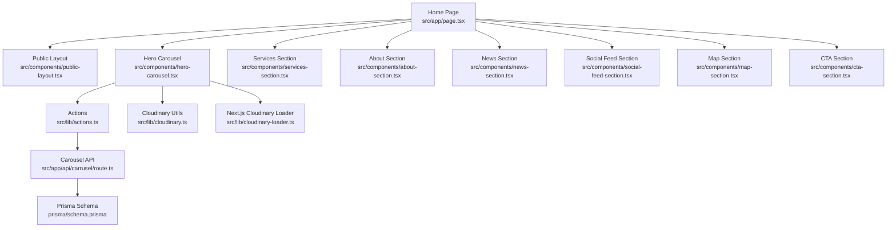
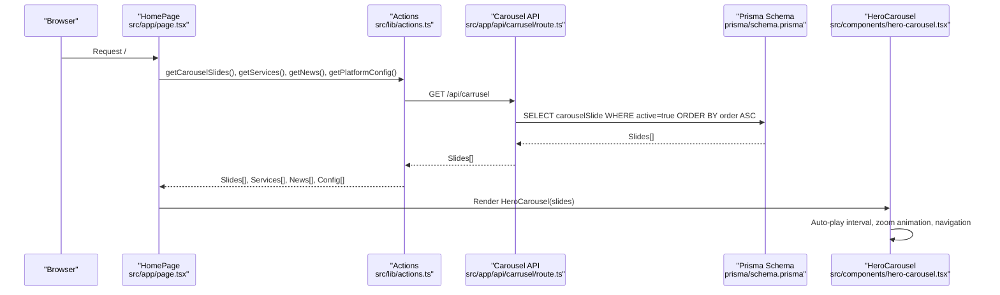
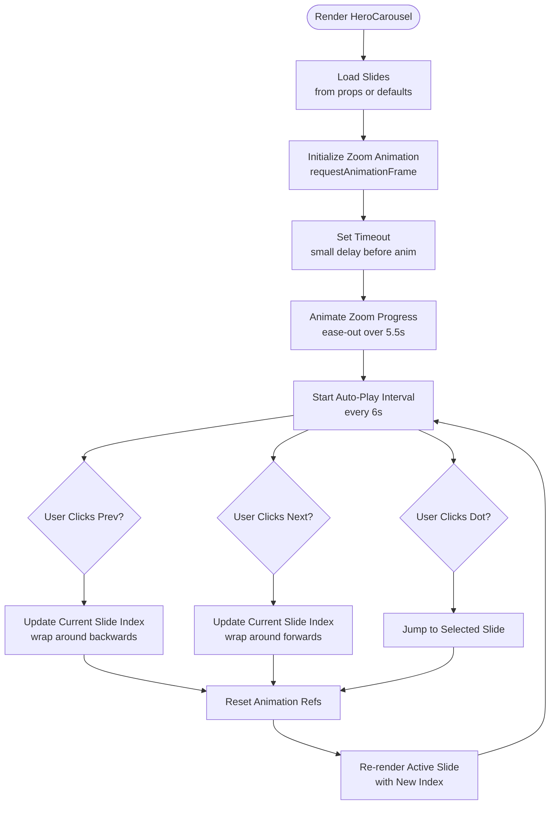
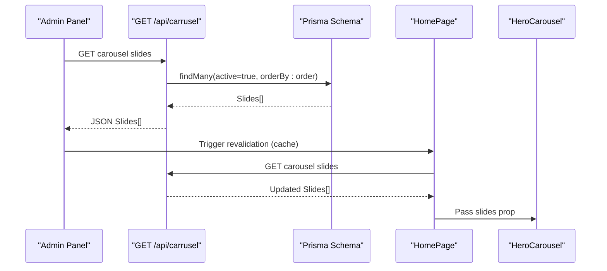
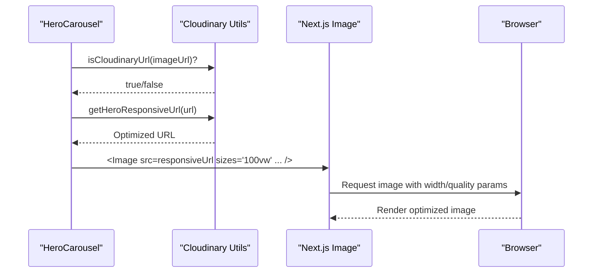
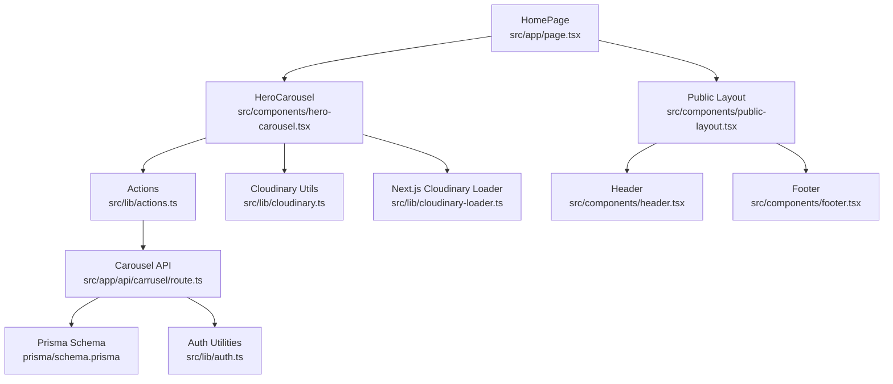

# Landing Page & Hero Carousel

<cite>
**Referenced Files in This Document**
- [hero-carousel.tsx](file://src/components/hero-carousel.tsx)
- [page.tsx](file://src/app/page.tsx)
- [layout.tsx](file://src/app/layout.tsx)
- [cloudinary.ts](file://src/lib/cloudinary.ts)
- [cloudinary-loader.ts](file://src/lib/cloudinary-loader.ts)
- [route.ts](file://src/app/api/carrusel/route.ts)
- [actions.ts](file://src/lib/actions.ts)
- [schema.prisma](file://prisma/schema.prisma)
- [public-layout.tsx](file://src/components/public-layout.tsx)
- [header.tsx](file://src/components/header.tsx)
- [footer.tsx](file://src/components/footer.tsx)
- [db.ts](file://src/lib/db.ts)
- [auth.ts](file://src/lib/auth.ts)
</cite>

## Table of Contents
1. [Introduction](#introduction)
2. [Project Structure](#project-structure)
3. [Core Components](#core-components)
4. [Architecture Overview](#architecture-overview)
5. [Detailed Component Analysis](#detailed-component-analysis)
6. [Dependency Analysis](#dependency-analysis)
7. [Performance Considerations](#performance-considerations)
8. [Troubleshooting Guide](#troubleshooting-guide)
9. [Conclusion](#conclusion)

## Introduction
This document explains the landing page and hero carousel implementation. It covers the main page layout structure, the hero carousel component functionality (image display, navigation controls, auto-play, and responsive behavior), the carousel data management system, API integration for carousel content, and dynamic image loading from Cloudinary. It also documents component state management, user interactions, accessibility features, performance optimizations, configuration examples, content update workflows, and troubleshooting guidance.

## Project Structure
The landing page is composed of:
- A server-side home page that fetches carousel slides and other content
- A public layout wrapper that injects shared UI (header, footer, WhatsApp bubble)
- The hero carousel component that renders the hero area with auto-play and navigation
- Supporting libraries for Cloudinary image optimization and Next.js Image loader
- An API route to manage carousel slides (CRUD operations)
- Prisma schema defining the CarouselSlide model and related tables
- Authentication utilities for admin endpoints

**Diagram sources**
- [page.tsx:11-50](file://src/app/page.tsx#L11-L50)
- [public-layout.tsx:10-54](file://src/components/public-layout.tsx#L10-L54)
- [hero-carousel.tsx:30-304](file://src/components/hero-carousel.tsx#L30-L304)
- [actions.ts:95-108](file://src/lib/actions.ts#L95-L108)
- [route.ts:6-16](file://src/app/api/carrusel/route.ts#L6-L16)
- [cloudinary.ts:93-98](file://src/lib/cloudinary.ts#L93-L98)
- [cloudinary-loader.ts:10-58](file://src/lib/cloudinary-loader.ts#L10-L58)
- [schema.prisma:137-158](file://prisma/schema.prisma#L137-L158)

**Section sources**
- [page.tsx:11-50](file://src/app/page.tsx#L11-L50)
- [layout.tsx:56-79](file://src/app/layout.tsx#L56-L79)

## Core Components
- HeroCarousel: Renders the hero area with slides, navigation arrows, dots, gradient overlays, and optional link wrapping. Implements auto-play, zoom animation, and responsive image handling.
- HomePage: Orchestrates data fetching and composes the page sections.
- PublicLayout: Provides shared header, footer, and WhatsApp bubble across public pages.
- Carousel API: Manages CRUD operations for carousel slides with revalidation and admin authentication checks.
- Cloudinary utilities: Provide responsive URLs and Next.js Image loader integration for optimal image delivery.

Key responsibilities:
- State management: Tracks current slide index, zoom progress, and animation lifecycle.
- Auto-play: Uses intervals to advance slides at a fixed cadence.
- Accessibility: Provides aria-labels for navigation controls.
- Responsive behavior: Uses Next.js Image with sizes and responsive Cloudinary URLs.
- Dynamic content: Fetches slides from the database via server actions and exposes them to the client.

**Section sources**
- [hero-carousel.tsx:30-304](file://src/components/hero-carousel.tsx#L30-L304)
- [page.tsx:11-50](file://src/app/page.tsx#L11-L50)
- [public-layout.tsx:10-54](file://src/components/public-layout.tsx#L10-L54)
- [route.ts:6-122](file://src/app/api/carrusel/route.ts#L6-L122)
- [cloudinary.ts:93-98](file://src/lib/cloudinary.ts#L93-L98)

## Architecture Overview
The landing page follows a server-rendered composition pattern:
- The home page is an async component that preloads carousel slides, services, news, and platform configuration.
- The public layout wraps the content and injects shared UI elements.
- The hero carousel receives the slides array and renders the hero area.
- Cloudinary utilities ensure images are optimized and responsive.
- The carousel API exposes endpoints for managing slides with admin authentication and cache revalidation.

**Diagram sources**
- [page.tsx:11-17](file://src/app/page.tsx#L11-L17)
- [actions.ts:95-108](file://src/lib/actions.ts#L95-L108)
- [route.ts:6-16](file://src/app/api/carrusel/route.ts#L6-L16)
- [schema.prisma:137-158](file://prisma/schema.prisma#L137-L158)
- [hero-carousel.tsx:141-153](file://src/components/hero-carousel.tsx#L141-L153)

## Detailed Component Analysis

### Hero Carousel Component
The hero carousel is a self-contained client component responsible for:
- Rendering multiple slides with background images, optional gradient overlays, and content blocks
- Managing auto-play transitions and user-triggered navigation
- Applying smooth zoom animations during slide transitions
- Providing navigation arrows and dot indicators
- Wrapping slide content in links when configured
- Integrating Cloudinary for responsive image optimization

Implementation highlights:
- State management: Tracks current slide index, zoom progress, and animation lifecycle refs
- Auto-play: Interval advances to the next slide at a fixed cadence
- Animation: requestAnimationFrame-based easing for a polished zoom effect
- Responsive images: Uses Next.js Image with Cloudinary transformations and sizes
- Accessibility: Buttons include aria-label attributes for screen readers
- Conditional rendering: Supports gradient toggles, custom gradient colors, and optional link wrapping

**Diagram sources**
- [hero-carousel.tsx:88-139](file://src/components/hero-carousel.tsx#L88-L139)
- [hero-carousel.tsx:141-153](file://src/components/hero-carousel.tsx#L141-L153)
- [hero-carousel.tsx:266-301](file://src/components/hero-carousel.tsx#L266-L301)

**Section sources**
- [hero-carousel.tsx:30-304](file://src/components/hero-carousel.tsx#L30-L304)

### Carousel Data Management and API Integration
The carousel content is managed via a dedicated API route:
- GET endpoint retrieves active slides ordered by position
- POST endpoint creates new slides with configurable options (gradient, animation, ordering, activation)
- PUT endpoint updates existing slides
- DELETE endpoint removes slides
- Admin authentication is enforced; cache is revalidated after mutations

**Diagram sources**
- [route.ts:6-16](file://src/app/api/carrusel/route.ts#L6-L16)
- [actions.ts:95-108](file://src/lib/actions.ts#L95-L108)
- [page.tsx:11-17](file://src/app/page.tsx#L11-L17)

**Section sources**
- [route.ts:6-122](file://src/app/api/carrusel/route.ts#L6-L122)
- [actions.ts:95-108](file://src/lib/actions.ts#L95-L108)
- [schema.prisma:137-158](file://prisma/schema.prisma#L137-L158)

### Dynamic Image Loading from Cloudinary
The system integrates Cloudinary for optimized image delivery:
- Utility functions generate responsive URLs for hero images and thumbnails
- Next.js Image loader injects width and quality parameters dynamically
- isCloudinaryUrl detects Cloudinary-hosted URLs to apply transformations
- Hero carousel uses getHeroResponsiveUrl for responsive hero images

**Diagram sources**
- [hero-carousel.tsx:174-184](file://src/components/hero-carousel.tsx#L174-L184)
- [cloudinary.ts:93-98](file://src/lib/cloudinary.ts#L93-L98)
- [cloudinary-loader.ts:10-58](file://src/lib/cloudinary-loader.ts#L10-L58)

**Section sources**
- [cloudinary.ts:93-98](file://src/lib/cloudinary.ts#L93-L98)
- [cloudinary-loader.ts:10-58](file://src/lib/cloudinary-loader.ts#L10-L58)
- [hero-carousel.tsx:174-184](file://src/components/hero-carousel.tsx#L174-L184)

### Accessibility and User Interactions
Accessibility features implemented:
- Navigation buttons include aria-label attributes for screen readers
- Dot indicators provide accessible labels for slide selection
- Keyboard-friendly focus management in the header and navigation
- Semantic markup with headings and paragraphs for content hierarchy

User interactions:
- Auto-play cycles through slides at a fixed interval
- Navigation arrows allow manual progression
- Dot indicators enable direct slide jumping
- Optional link wrapping allows clicking the entire slide to navigate

**Section sources**
- [hero-carousel.tsx:266-301](file://src/components/hero-carousel.tsx#L266-L301)
- [header.tsx:122-138](file://src/components/header.tsx#L122-L138)

### Responsive Behavior
Responsive characteristics:
- Hero height adapts across breakpoints (md, lg)
- Next.js Image uses sizes="100vw" for fluid layouts
- Cloudinary loader generates appropriate widths per breakpoint
- Content areas adjust padding and typography scales

**Section sources**
- [hero-carousel.tsx:156-157](file://src/components/hero-carousel.tsx#L156-L157)
- [hero-carousel.tsx:179-184](file://src/components/hero-carousel.tsx#L179-L184)
- [cloudinary-loader.ts:21-26](file://src/lib/cloudinary-loader.ts#L21-L26)

### Configuration Examples
Common configurations for carousel slides:
- Enable/disable gradient overlay per slide
- Set custom gradient color (hex without #)
- Toggle zoom animation per slide
- Define button text and URL for call-to-action
- Assign order and active flags for presentation
- Optional linkUrl to wrap the entire slide content

These are stored in the CarouselSlide model and exposed via the API.

**Section sources**
- [schema.prisma:137-158](file://prisma/schema.prisma#L137-L158)
- [route.ts:27-42](file://src/app/api/carrusel/route.ts#L27-L42)

### Content Updates and Administration
Admin workflow:
- Admin authenticates and performs CRUD operations against the carousel API
- After each mutation, cache is revalidated to refresh the homepage
- The home page fetches updated slides and passes them to the hero carousel

Security and validation:
- Admin authentication is verified on each endpoint
- Required fields are validated (e.g., ID for updates)
- Errors are returned with appropriate HTTP status codes

**Section sources**
- [route.ts:18-52](file://src/app/api/carrusel/route.ts#L18-L52)
- [route.ts:54-93](file://src/app/api/carrusel/route.ts#L54-L93)
- [route.ts:95-121](file://src/app/api/carrusel/route.ts#L95-L121)
- [auth.ts:155-169](file://src/lib/auth.ts#L155-L169)

## Dependency Analysis
The hero carousel depends on:
- Server actions for fetching slides
- Cloudinary utilities for responsive image URLs
- Next.js Image for optimized rendering
- UI primitives for buttons and layout

The API route depends on:
- Prisma schema for data modeling
- Authentication utilities for admin checks
- Cache revalidation to keep the UI fresh

**Diagram sources**
- [hero-carousel.tsx:30-304](file://src/components/hero-carousel.tsx#L30-L304)
- [actions.ts:95-108](file://src/lib/actions.ts#L95-L108)
- [cloudinary.ts:93-98](file://src/lib/cloudinary.ts#L93-L98)
- [cloudinary-loader.ts:10-58](file://src/lib/cloudinary-loader.ts#L10-L58)
- [route.ts:6-16](file://src/app/api/carrusel/route.ts#L6-L16)
- [schema.prisma:137-158](file://prisma/schema.prisma#L137-L158)
- [auth.ts:155-169](file://src/lib/auth.ts#L155-L169)
- [page.tsx:11-50](file://src/app/page.tsx#L11-L50)
- [public-layout.tsx:10-54](file://src/components/public-layout.tsx#L10-L54)
- [header.tsx:21-189](file://src/components/header.tsx#L21-L189)
- [footer.tsx:42-224](file://src/components/footer.tsx#L42-L224)

**Section sources**
- [hero-carousel.tsx:30-304](file://src/components/hero-carousel.tsx#L30-L304)
- [route.ts:6-16](file://src/app/api/carrusel/route.ts#L6-L16)
- [schema.prisma:137-158](file://prisma/schema.prisma#L137-L158)

## Performance Considerations
- Image optimization: Cloudinary transformations and Next.js Image with responsive srcset reduce bandwidth and improve loading performance.
- Auto-play cadence: 6-second intervals balance engagement with performance; adjust based on content volume.
- Animation efficiency: requestAnimationFrame-based zoom avoids layout thrashing; animation is canceled and restarted appropriately.
- Lazy loading: Next.js Image handles lazy loading; priority is set for the first slide to improve perceived performance.
- Cache revalidation: After admin edits, cache revalidation ensures fresh content without full page reloads.
- Minimal state updates: Local refs track animation state to prevent unnecessary re-renders.

[No sources needed since this section provides general guidance]

## Troubleshooting Guide
Common issues and resolutions:
- Slides not appearing: Verify that slides are marked active and ordered correctly in the database; confirm the GET endpoint returns results.
- Images not loading: Ensure Cloudinary URLs are valid and include the Cloudinary domain; confirm isCloudinaryUrl detection works as expected.
- Auto-play not working: Check that the interval is initialized and not cleared prematurely; verify currentSlide updates correctly.
- Animation glitches: Confirm animation refs are reset on slide change; ensure cancelAnimationFrame is called before starting a new animation.
- Navigation controls not accessible: Verify aria-labels are present on buttons; test keyboard navigation in the header.
- Cache stale content: After admin edits, ensure revalidation is triggered so the home page fetches updated slides.

**Section sources**
- [route.ts:6-16](file://src/app/api/carrusel/route.ts#L6-L16)
- [actions.ts:95-108](file://src/lib/actions.ts#L95-L108)
- [hero-carousel.tsx:88-139](file://src/components/hero-carousel.tsx#L88-L139)
- [hero-carousel.tsx:266-301](file://src/components/hero-carousel.tsx#L266-L301)

## Conclusion
The landing page and hero carousel implementation combine server-side data fetching, client-side interactivity, and Cloudinary-powered image optimization to deliver a responsive, accessible, and performant hero experience. The modular design enables easy administration of carousel content, while the API ensures secure and efficient content management. By following the configuration examples and troubleshooting steps outlined above, administrators can maintain a dynamic and engaging hero section tailored to the brand’s needs.