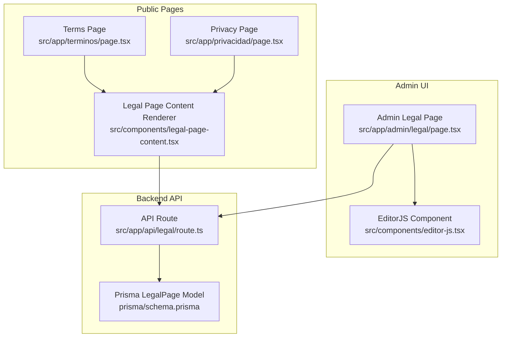
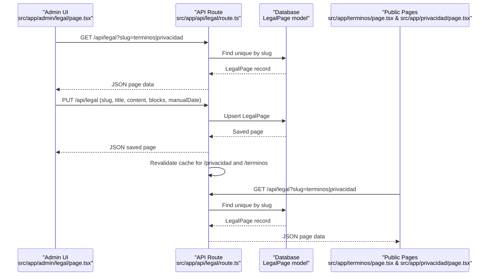
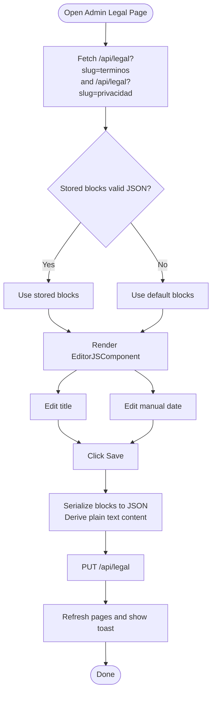
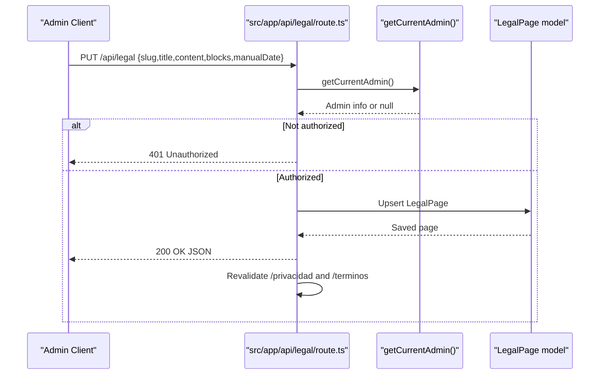
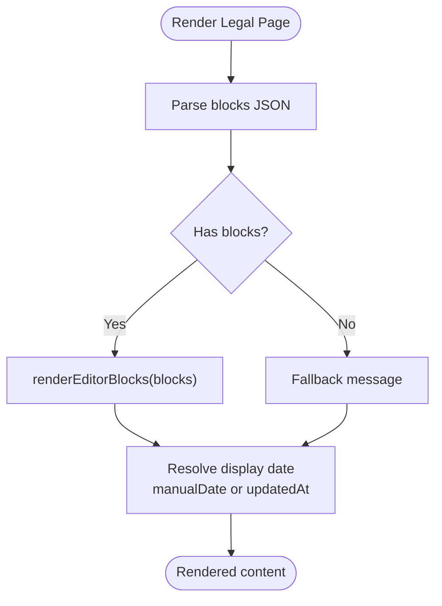
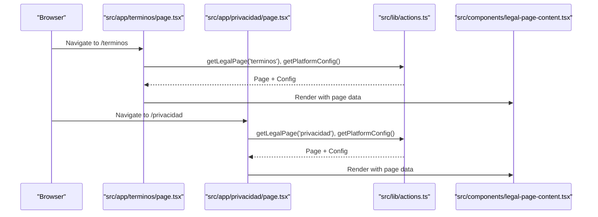
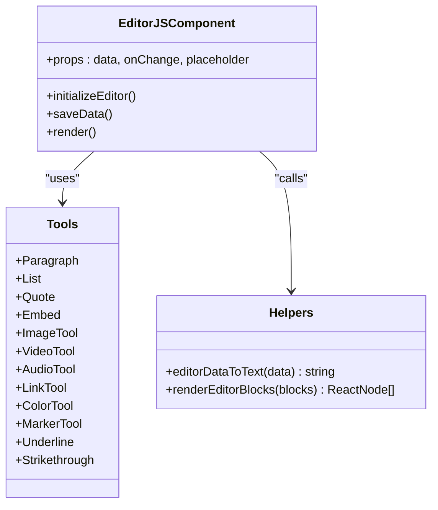
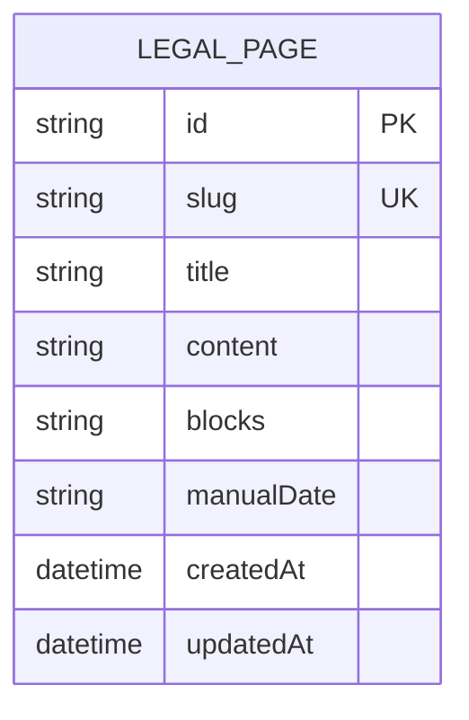
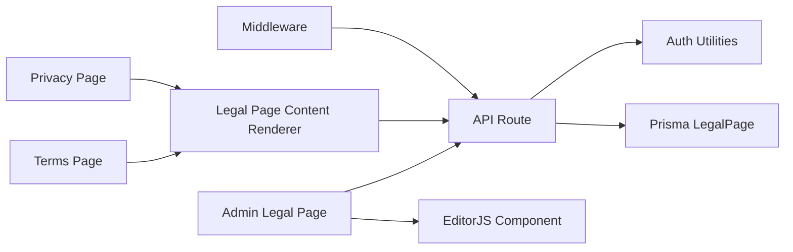

# Legal Pages Management

<cite>
**Referenced Files in This Document**
- [page.tsx](file://src/app/admin/legal/page.tsx)
- [route.ts](file://src/app/api/legal/route.ts)
- [legal-page-content.tsx](file://src/components/legal-page-content.tsx)
- [page.tsx](file://src/app/terminos/page.tsx)
- [page.tsx](file://src/app/privacidad/page.tsx)
- [editor-js.tsx](file://src/components/editor-js.tsx)
- [auth.ts](file://src/lib/auth.ts)
- [actions.ts](file://src/lib/actions.ts)
- [schema.prisma](file://prisma/schema.prisma)
- [layout.tsx](file://src/app/layout.tsx)
- [middleware.ts](file://src/middleware.ts)
</cite>

## Table of Contents
1. [Introduction](#introduction)
2. [Project Structure](#project-structure)
3. [Core Components](#core-components)
4. [Architecture Overview](#architecture-overview)
5. [Detailed Component Analysis](#detailed-component-analysis)
6. [Dependency Analysis](#dependency-analysis)
7. [Performance Considerations](#performance-considerations)
8. [Troubleshooting Guide](#troubleshooting-guide)
9. [Conclusion](#conclusion)

## Introduction
This document describes the legal pages management system responsible for maintaining Terms and Conditions and Privacy Policy pages. It covers the administrative interface for editing legal content using Editor.js, the backend API for persistence and cache revalidation, content rendering for public pages, SEO considerations, content validation, administrative access controls, and compliance aspects for legal content management.

## Project Structure
The legal pages system spans three main areas:
- Administrative UI: a dedicated admin page for editing legal content
- Backend API: endpoints for retrieving and updating legal pages
- Public pages: rendered pages for Terms and Privacy Policy

**Diagram sources**
- [page.tsx:1-310](file://src/app/admin/legal/page.tsx#L1-L310)
- [editor-js.tsx:344-575](file://src/components/editor-js.tsx#L344-L575)
- [route.ts:1-89](file://src/app/api/legal/route.ts#L1-L89)
- [schema.prisma:160-170](file://prisma/schema.prisma#L160-L170)
- [page.tsx:1-22](file://src/app/terminos/page.tsx#L1-L22)
- [page.tsx:1-70](file://src/app/privacidad/page.tsx#L1-L70)
- [legal-page-content.tsx:1-89](file://src/components/legal-page-content.tsx#L1-L89)

**Section sources**
- [page.tsx:1-310](file://src/app/admin/legal/page.tsx#L1-L310)
- [route.ts:1-89](file://src/app/api/legal/route.ts#L1-L89)
- [legal-page-content.tsx:1-89](file://src/components/legal-page-content.tsx#L1-L89)
- [page.tsx:1-22](file://src/app/terminos/page.tsx#L1-L22)
- [page.tsx:1-70](file://src/app/privacidad/page.tsx#L1-L70)
- [schema.prisma:160-170](file://prisma/schema.prisma#L160-L170)

## Core Components
- Admin Legal Page: Fetches existing legal pages, renders Editor.js content, and saves updates via PUT to the API.
- API Route: Handles GET to retrieve legal pages and PUT to upsert content with cache revalidation.
- Legal Page Content Renderer: Parses stored Editor.js blocks and renders them on public pages.
- Public Pages: Terms and Privacy pages that fetch current content and configuration.
- Editor.js Component: Provides a rich-text editor with specialized tools and media integration.
- Authentication and Access Control: Session-based admin authentication and authorization checks in API routes.
- Database Schema: LegalPage model with slug, title, markdown fallback content, Editor.js blocks, and optional manual date.

Key responsibilities:
- Content editing: Admin UI with Editor.js and media picker
- Persistence: Upsert legal page records with blocks and derived markdown
- Rendering: Public pages render either Editor.js blocks or fallback markdown
- Cache: Automatic revalidation after updates
- Access control: Admin-only write operations
- Compliance: Optional manual date field for legal transparency

**Section sources**
- [page.tsx:79-193](file://src/app/admin/legal/page.tsx#L79-L193)
- [route.ts:6-88](file://src/app/api/legal/route.ts#L6-L88)
- [legal-page-content.tsx:27-88](file://src/components/legal-page-content.tsx#L27-L88)
- [page.tsx:5-21](file://src/app/terminos/page.tsx#L5-L21)
- [page.tsx:5-69](file://src/app/privacidad/page.tsx#L5-L69)
- [editor-js.tsx:344-608](file://src/components/editor-js.tsx#L344-L608)
- [auth.ts:49-71](file://src/lib/auth.ts#L49-L71)
- [schema.prisma:160-170](file://prisma/schema.prisma#L160-L170)

## Architecture Overview
The system follows a client-server pattern:
- Admin UI (Next.js App Router) communicates with a server-side API route
- The API route validates admin sessions and persists data to the database
- Public pages fetch current legal content and render it using the renderer component

**Diagram sources**
- [page.tsx:102-155](file://src/app/admin/legal/page.tsx#L102-L155)
- [route.ts:6-88](file://src/app/api/legal/route.ts#L6-L88)
- [schema.prisma:160-170](file://prisma/schema.prisma#L160-L170)
- [page.tsx:6-9](file://src/app/terminos/page.tsx#L6-L9)
- [page.tsx:6-9](file://src/app/privacidad/page.tsx#L6-L9)

## Detailed Component Analysis

### Admin Legal Page
Responsibilities:
- Fetch legal pages for both Terms and Privacy
- Initialize Editor.js with default blocks if no stored blocks
- Allow editing title and optional manual date
- Serialize Editor.js blocks to JSON and derive plain text content
- Save via PUT endpoint and refresh data

**Diagram sources**
- [page.tsx:98-193](file://src/app/admin/legal/page.tsx#L98-L193)

**Section sources**
- [page.tsx:79-193](file://src/app/admin/legal/page.tsx#L79-L193)

### API Route for Legal Pages
Endpoints:
- GET /api/legal?slug=terminos|privacidad: returns the requested page or all pages
- PUT /api/legal: upserts page data and revalidates public paths

Validation and behavior:
- Requires admin session for PUT
- Slug and title are required for PUT
- Upsert creates if slug does not exist, otherwise updates
- Revalidates cache for both public legal pages after successful update

**Diagram sources**
- [route.ts:47-88](file://src/app/api/legal/route.ts#L47-L88)
- [auth.ts:156-169](file://src/lib/auth.ts#L156-L169)

**Section sources**
- [route.ts:6-88](file://src/app/api/legal/route.ts#L6-L88)
- [auth.ts:49-71](file://src/lib/auth.ts#L49-L71)

### Legal Page Content Renderer
Responsibilities:
- Parse stored blocks safely from JSON
- Determine display date from manualDate or updatedAt
- Render blocks using Editor.js block renderer or fallback message

**Diagram sources**
- [legal-page-content.tsx:27-88](file://src/components/legal-page-content.tsx#L27-L88)

**Section sources**
- [legal-page-content.tsx:27-88](file://src/components/legal-page-content.tsx#L27-L88)

### Public Pages (Terms and Privacy)
Responsibilities:
- Fetch current legal page and platform configuration
- Pass data to the shared renderer component

**Diagram sources**
- [page.tsx:5-21](file://src/app/terminos/page.tsx#L5-L21)
- [page.tsx:5-69](file://src/app/privacidad/page.tsx#L5-L69)
- [actions.ts:110-120](file://src/lib/actions.ts#L110-L120)
- [legal-page-content.tsx:27-88](file://src/components/legal-page-content.tsx#L27-L88)

**Section sources**
- [page.tsx:5-21](file://src/app/terminos/page.tsx#L5-L21)
- [page.tsx:5-69](file://src/app/privacidad/page.tsx#L5-L69)
- [actions.ts:110-120](file://src/lib/actions.ts#L110-L120)

### Editor.js Integration
Capabilities:
- Rich-text editing with specialized tools (headings, lists, quotes, links, markers, colors)
- Media integration (images, videos, audio) with upload and library picker
- Block serialization to JSON and conversion to plain text for SEO-friendly content
- Rendering blocks to HTML for public consumption

**Diagram sources**
- [editor-js.tsx:344-575](file://src/components/editor-js.tsx#L344-L575)
- [editor-js.tsx:577-608](file://src/components/editor-js.tsx#L577-L608)
- [editor-js.tsx:610-800](file://src/components/editor-js.tsx#L610-L800)

**Section sources**
- [editor-js.tsx:344-608](file://src/components/editor-js.tsx#L344-L608)
- [editor-js.tsx:610-800](file://src/components/editor-js.tsx#L610-L800)

### Database Model: LegalPage
Fields:
- id: unique identifier
- slug: unique page identifier (e.g., "terminos", "privacidad")
- title: page title
- content: markdown fallback content
- blocks: serialized Editor.js blocks
- manualDate: optional formatted date string for transparency
- timestamps: createdAt, updatedAt

**Diagram sources**
- [schema.prisma:160-170](file://prisma/schema.prisma#L160-L170)

**Section sources**
- [schema.prisma:160-170](file://prisma/schema.prisma#L160-L170)

## Dependency Analysis
- Admin UI depends on Editor.js component and the API route
- API route depends on authentication utilities and database access
- Public pages depend on shared renderer and action utilities
- Renderer depends on Editor.js block rendering helpers
- Middleware applies security headers globally

**Diagram sources**
- [page.tsx:10-11](file://src/app/admin/legal/page.tsx#L10-L11)
- [route.ts:4-4](file://src/app/api/legal/route.ts#L4-L4)
- [auth.ts:1-4](file://src/lib/auth.ts#L1-L4)
- [schema.prisma:160-170](file://prisma/schema.prisma#L160-L170)
- [page.tsx:1-3](file://src/app/terminos/page.tsx#L1-L3)
- [page.tsx:1-3](file://src/app/privacidad/page.tsx#L1-L3)
- [legal-page-content.tsx:4-4](file://src/components/legal-page-content.tsx#L4-L4)
- [middleware.ts:1-44](file://src/middleware.ts#L1-L44)

**Section sources**
- [page.tsx:1-12](file://src/app/admin/legal/page.tsx#L1-L12)
- [route.ts:1-4](file://src/app/api/legal/route.ts#L1-L4)
- [auth.ts:1-4](file://src/lib/auth.ts#L1-L4)
- [schema.prisma:160-170](file://prisma/schema.prisma#L160-L170)
- [page.tsx:1-3](file://src/app/terminos/page.tsx#L1-L3)
- [page.tsx:1-3](file://src/app/privacidad/page.tsx#L1-L3)
- [legal-page-content.tsx:1-4](file://src/components/legal-page-content.tsx#L1-L4)
- [middleware.ts:1-44](file://src/middleware.ts#L1-L44)

## Performance Considerations
- Editor.js initialization is lazy-loaded and destroyed on unmount to minimize memory footprint.
- Public pages rely on server-side rendering with database reads; consider caching strategies for frequently accessed legal pages.
- PUT requests trigger cache revalidation for both public legal pages to ensure fresh content delivery.
- Media uploads use Cloudinary integration; ensure appropriate file size limits and CDN caching headers.

[No sources needed since this section provides general guidance]

## Troubleshooting Guide
Common issues and resolutions:
- Unauthorized PUT requests: Ensure admin session exists and is valid; verify authentication utilities and cookie configuration.
- Invalid JSON blocks: The admin page and renderer parse blocks safely; if parsing fails, defaults or fallback messages are shown.
- Cache not updating: Confirm cache revalidation is triggered after PUT; verify revalidatePath calls for both public pages.
- Missing content: If blocks are empty, public pages show a fallback message; populate content via admin UI.

**Section sources**
- [auth.ts:49-71](file://src/lib/auth.ts#L49-L71)
- [page.tsx:114-138](file://src/app/admin/legal/page.tsx#L114-L138)
- [legal-page-content.tsx:30-36](file://src/components/legal-page-content.tsx#L30-L36)
- [route.ts:79-81](file://src/app/api/legal/route.ts#L79-L81)

## Conclusion
The legal pages management system provides a robust, secure, and user-friendly solution for maintaining Terms and Conditions and Privacy Policy content. It leverages Editor.js for flexible content creation, ensures admin-only write access, and delivers consistent, SEO-aware content to public pages. The architecture supports safe content rendering, cache revalidation, and compliance-friendly features such as manual dates.