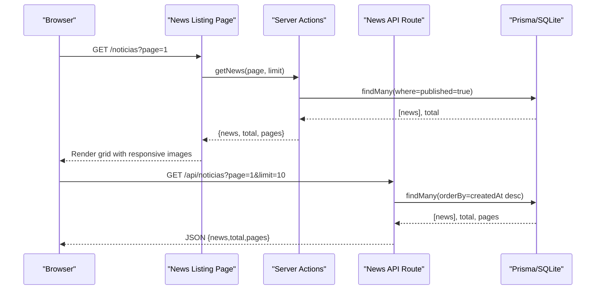
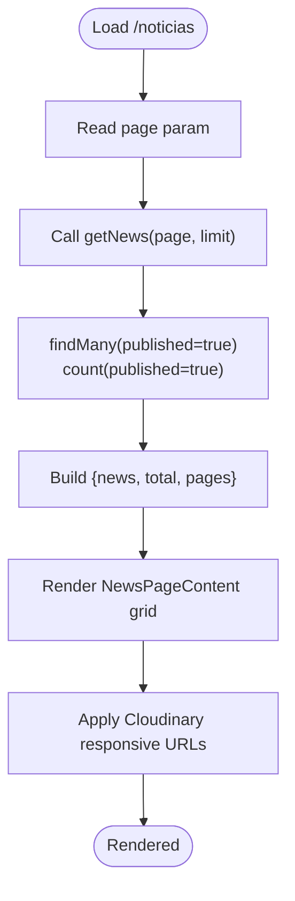
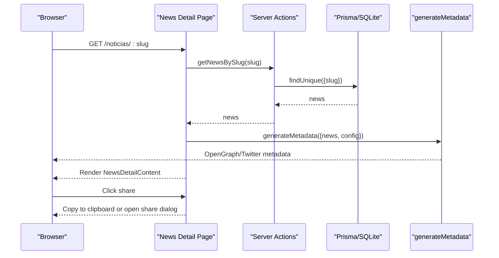
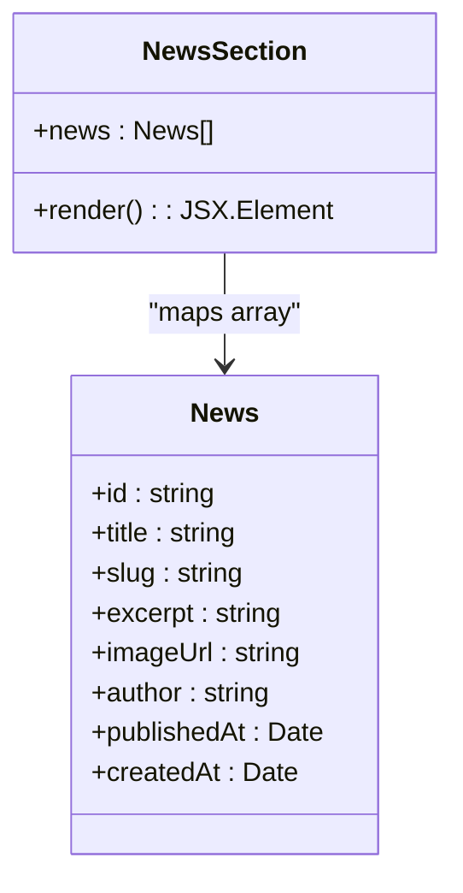
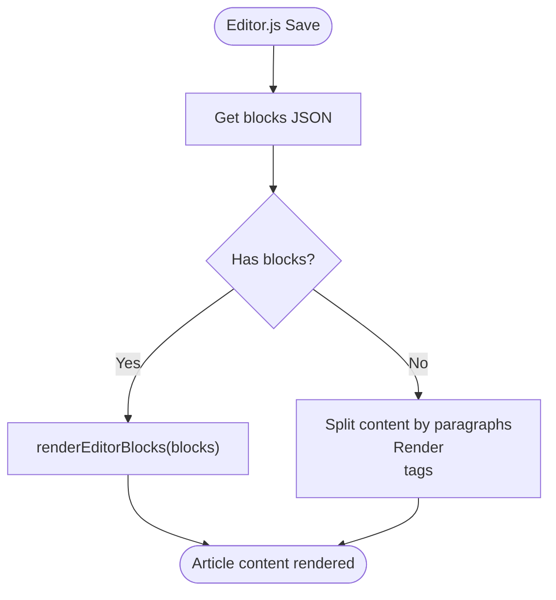
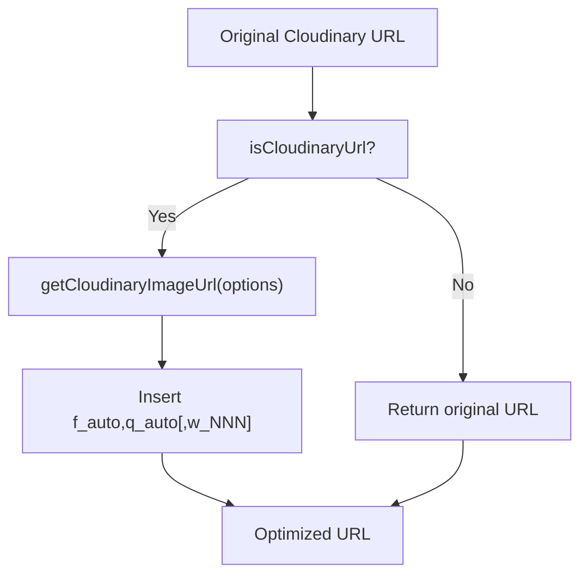
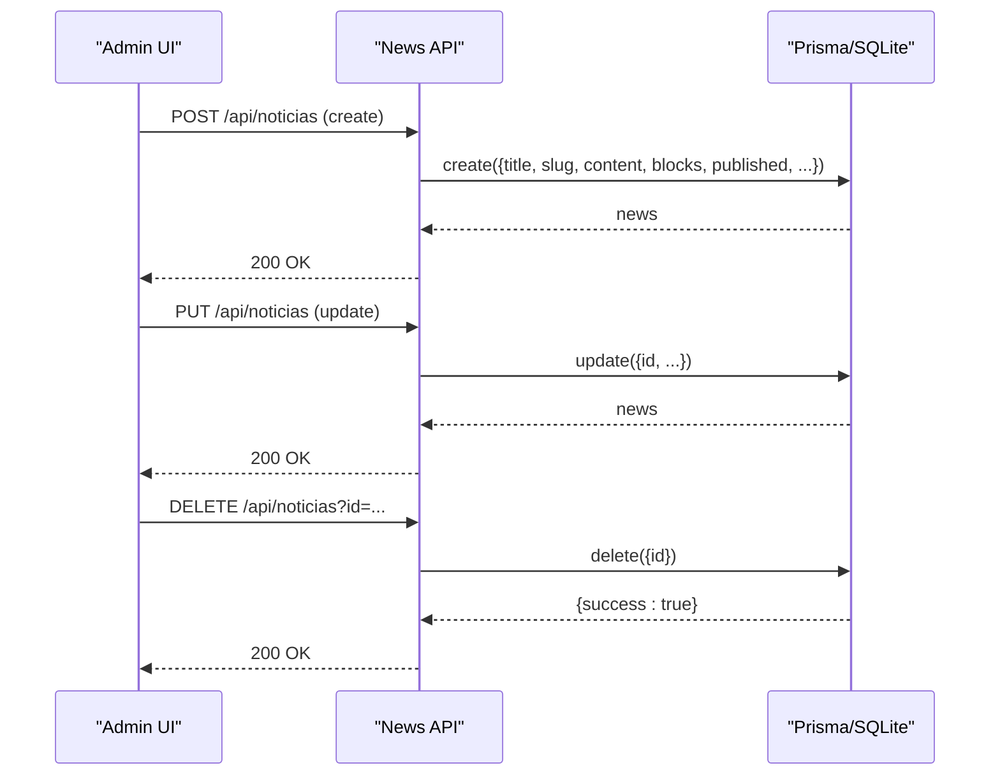
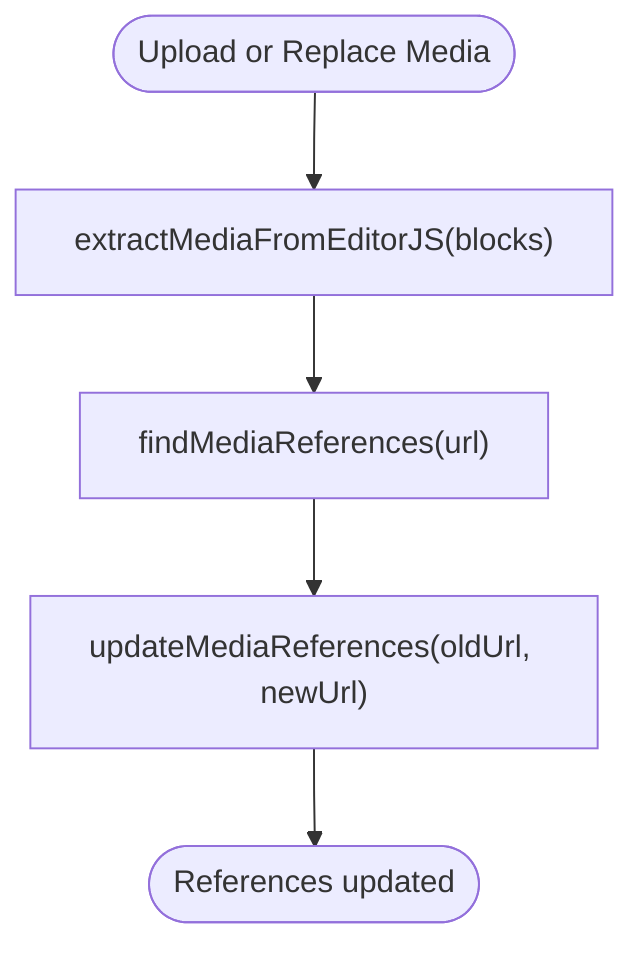
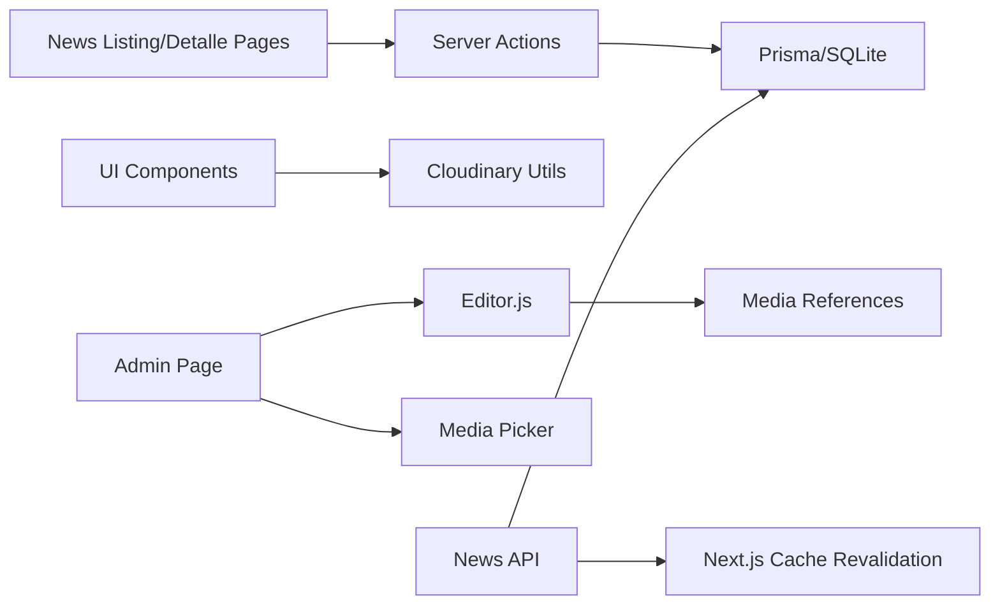

# News & Blog System

<cite>
**Referenced Files in This Document**
- [src/app/noticias/page.tsx](file://src/app/noticias/page.tsx)
- [src/app/noticias/[slug]/page.tsx](file://src/app/noticias/[slug]/page.tsx)
- [src/components/news-section.tsx](file://src/components/news-section.tsx)
- [src/components/news-page-content.tsx](file://src/components/news-page-content.tsx)
- [src/components/news-detail-content.tsx](file://src/components/news-detail-content.tsx)
- [src/lib/cloudinary.ts](file://src/lib/cloudinary.ts)
- [src/lib/cloudinary-loader.ts](file://src/lib/cloudinary-loader.ts)
- [src/app/api/noticias/route.ts](file://src/app/api/noticias/route.ts)
- [src/lib/actions.ts](file://src/lib/actions.ts)
- [prisma/schema.prisma](file://prisma/schema.prisma)
- [src/components/editor-js.tsx](file://src/components/editor-js.tsx)
- [src/app/admin/noticias/page.tsx](file://src/app/admin/noticias/page.tsx)
- [src/components/media-picker-compact.tsx](file://src/components/media-picker-compact.tsx)
- [src/lib/media-references.ts](file://src/lib/media-references.ts)
</cite>

## Table of Contents
1. [Introduction](#introduction)
2. [Project Structure](#project-structure)
3. [Core Components](#core-components)
4. [Architecture Overview](#architecture-overview)
5. [Detailed Component Analysis](#detailed-component-analysis)
6. [Dependency Analysis](#dependency-analysis)
7. [Performance Considerations](#performance-considerations)
8. [Troubleshooting Guide](#troubleshooting-guide)
9. [Conclusion](#conclusion)

## Introduction
This document explains the news and blog system implementation, covering:
- News listing with pagination
- Individual news detail pages with slug-based routing
- Rich text content rendering powered by Editor.js
- Image optimization through Cloudinary
- SEO best practices for blog posts
- Content management workflows for administrators
- Responsive design patterns and performance optimizations for content-heavy pages

## Project Structure
The system is organized around three main areas:
- Public pages: news listing and detail routes
- Components: reusable UI for news grids, detail views, and editors
- APIs and data: Prisma-backed CRUD endpoints and server actions

```mermaid
graph TB
subgraph "Public Routes"
L["/noticias (page.tsx)"]
D["/noticias/[slug] (page.tsx)"]
end
subgraph "Components"
NS["NewsSection"]
NPC["NewsPageContent"]
NDC["NewsDetailContent"]
EJ["EditorJSComponent"]
end
subgraph "Libraries"
CL["Cloudinary Utils"]
CLD["Cloudinary Loader"]
ACT["Server Actions"]
MR["Media References"]
end
subgraph "API"
API["/api/noticias (route.ts)"]
end
subgraph "Data Model"
PRISMA["Prisma Schema (News model)"]
end
L --> NPC
D --> NDC
NPC --> NS
NDC --> EJ
NPC --> CL
NDC --> CL
CLD --> |"Next.js Image"| CL
L --> ACT
D --> ACT
ACT --> PRISMA
API --> PRISMA
EJ --> MR
```

**Diagram sources**
- [src/app/noticias/page.tsx:1-25](file://src/app/noticias/page.tsx#L1-L25)
- [src/app/noticias/[slug]/page.tsx](file://src/app/noticias/[slug]/page.tsx#L1-L101)
- [src/components/news-section.tsx:1-138](file://src/components/news-section.tsx#L1-L138)
- [src/components/news-page-content.tsx:1-185](file://src/components/news-page-content.tsx#L1-L185)
- [src/components/news-detail-content.tsx:1-280](file://src/components/news-detail-content.tsx#L1-L280)
- [src/lib/cloudinary.ts:1-119](file://src/lib/cloudinary.ts#L1-L119)
- [src/lib/cloudinary-loader.ts:1-59](file://src/lib/cloudinary-loader.ts#L1-L59)
- [src/lib/actions.ts:1-136](file://src/lib/actions.ts#L1-L136)
- [src/app/api/noticias/route.ts:1-229](file://src/app/api/noticias/route.ts#L1-L229)
- [prisma/schema.prisma:98-118](file://prisma/schema.prisma#L98-L118)
- [src/components/editor-js.tsx:1-850](file://src/components/editor-js.tsx#L1-L850)
- [src/lib/media-references.ts:1-334](file://src/lib/media-references.ts#L1-L334)

**Section sources**
- [src/app/noticias/page.tsx:1-25](file://src/app/noticias/page.tsx#L1-L25)
- [src/app/noticias/[slug]/page.tsx](file://src/app/noticias/[slug]/page.tsx#L1-L101)
- [src/components/news-section.tsx:1-138](file://src/components/news-section.tsx#L1-L138)
- [src/components/news-page-content.tsx:1-185](file://src/components/news-page-content.tsx#L1-L185)
- [src/components/news-detail-content.tsx:1-280](file://src/components/news-detail-content.tsx#L1-L280)
- [src/lib/cloudinary.ts:1-119](file://src/lib/cloudinary.ts#L1-L119)
- [src/lib/cloudinary-loader.ts:1-59](file://src/lib/cloudinary-loader.ts#L1-L59)
- [src/app/api/noticias/route.ts:1-229](file://src/app/api/noticias/route.ts#L1-L229)
- [src/lib/actions.ts:1-136](file://src/lib/actions.ts#L1-L136)
- [prisma/schema.prisma:98-118](file://prisma/schema.prisma#L98-L118)
- [src/components/editor-js.tsx:1-850](file://src/components/editor-js.tsx#L1-L850)
- [src/lib/media-references.ts:1-334](file://src/lib/media-references.ts#L1-L334)

## Core Components
- News listing page: renders a paginated grid of published news with responsive image optimization and metadata generation.
- News detail page: displays full article content, rich text rendering, social sharing, and SEO metadata.
- News section component: reusable grid for homepage/blog previews.
- Cloudinary utilities: URL transformation and Next.js image loader for responsive optimization.
- Admin news page: CRUD interface with Editor.js, media picker, and pagination.
- Media references: detects and updates references to media across content.

**Section sources**
- [src/components/news-page-content.tsx:31-185](file://src/components/news-page-content.tsx#L31-L185)
- [src/components/news-detail-content.tsx:52-280](file://src/components/news-detail-content.tsx#L52-L280)
- [src/components/news-section.tsx:23-138](file://src/components/news-section.tsx#L23-L138)
- [src/lib/cloudinary.ts:11-119](file://src/lib/cloudinary.ts#L11-L119)
- [src/lib/cloudinary-loader.ts:10-59](file://src/lib/cloudinary-loader.ts#L10-L59)
- [src/app/admin/noticias/page.tsx:38-487](file://src/app/admin/noticias/page.tsx#L38-L487)
- [src/lib/media-references.ts:65-181](file://src/lib/media-references.ts#L65-L181)

## Architecture Overview
The system follows a layered architecture:
- Presentation layer: Next.js app router pages and client components
- Domain layer: Server actions and API routes
- Persistence layer: Prisma schema and SQLite database
- Media layer: Cloudinary utilities and Next.js image loader



**Diagram sources**
- [src/app/noticias/page.tsx:5-24](file://src/app/noticias/page.tsx#L5-L24)
- [src/lib/actions.ts:46-65](file://src/lib/actions.ts#L46-L65)
- [src/app/api/noticias/route.ts:16-52](file://src/app/api/noticias/route.ts#L16-L52)

## Detailed Component Analysis

### News Listing Page
- Accepts page query parameter, defaults to 1
- Uses server actions to fetch published news and total count
- Renders a responsive grid with Cloudinary-optimized thumbnails
- Provides pagination controls with previous/next links



**Diagram sources**
- [src/app/noticias/page.tsx:5-24](file://src/app/noticias/page.tsx#L5-L24)
- [src/lib/actions.ts:46-65](file://src/lib/actions.ts#L46-L65)
- [src/components/news-page-content.tsx:31-185](file://src/components/news-page-content.tsx#L31-L185)
- [src/lib/cloudinary.ts:100-106](file://src/lib/cloudinary.ts#L100-L106)

**Section sources**
- [src/app/noticias/page.tsx:5-24](file://src/app/noticias/page.tsx#L5-L24)
- [src/lib/actions.ts:46-65](file://src/lib/actions.ts#L46-L65)
- [src/components/news-page-content.tsx:67-132](file://src/components/news-page-content.tsx#L67-L132)
- [src/lib/cloudinary.ts:100-106](file://src/lib/cloudinary.ts#L100-L106)

### News Detail Page
- Slug-based dynamic route with metadata generation
- Validates publication status and redirects to 404 if not published
- Serializes content for client-side rendering
- Renders rich text via Editor.js blocks or fallback markdown paragraphs
- Provides social sharing buttons with copy-to-clipboard fallback for Instagram



**Diagram sources**
- [src/app/noticias/[slug]/page.tsx](file://src/app/noticias/[slug]/page.tsx#L56-L101)
- [src/lib/actions.ts:74-79](file://src/lib/actions.ts#L74-L79)
- [src/components/news-detail-content.tsx:52-280](file://src/components/news-detail-content.tsx#L52-L280)

**Section sources**
- [src/app/noticias/[slug]/page.tsx](file://src/app/noticias/[slug]/page.tsx#L8-L54)
- [src/app/noticias/[slug]/page.tsx](file://src/app/noticias/[slug]/page.tsx#L56-L101)
- [src/components/news-detail-content.tsx:110-121](file://src/components/news-detail-content.tsx#L110-L121)
- [src/components/news-detail-content.tsx:227-271](file://src/components/news-detail-content.tsx#L227-L271)

### News Section Component
- Reusable grid for displaying news previews
- Uses Cloudinary responsive URLs for thumbnails
- Includes author and publish date metadata
- Links to detail pages via slug



**Diagram sources**
- [src/components/news-section.tsx:8-21](file://src/components/news-section.tsx#L8-L21)
- [src/components/news-section.tsx:23-138](file://src/components/news-section.tsx#L23-L138)

**Section sources**
- [src/components/news-section.tsx:23-138](file://src/components/news-section.tsx#L23-L138)

### Rich Text Rendering and Editor Integration
- Editor.js blocks are stored as JSON and rendered on the frontend
- Fallback rendering for plain markdown content
- Media picker integration for images/videos/audio with duplicate detection and Cloudinary uploads



**Diagram sources**
- [src/components/editor-js.tsx:611-800](file://src/components/editor-js.tsx#L611-L800)
- [src/components/news-detail-content.tsx:110-121](file://src/components/news-detail-content.tsx#L110-L121)

**Section sources**
- [src/components/editor-js.tsx:611-800](file://src/components/editor-js.tsx#L611-L800)
- [src/components/news-detail-content.tsx:199-217](file://src/components/news-detail-content.tsx#L199-L217)

### Image Optimization with Cloudinary
- Utility functions transform Cloudinary URLs with automatic format, quality, and width
- Next.js image loader injects width and quality parameters for responsive srcsets
- Separate helpers for hero and thumbnail sizes



**Diagram sources**
- [src/lib/cloudinary.ts:11-83](file://src/lib/cloudinary.ts#L11-L83)
- [src/lib/cloudinary.ts:92-114](file://src/lib/cloudinary.ts#L92-L114)
- [src/lib/cloudinary-loader.ts:10-58](file://src/lib/cloudinary-loader.ts#L10-L58)

**Section sources**
- [src/lib/cloudinary.ts:11-119](file://src/lib/cloudinary.ts#L11-L119)
- [src/lib/cloudinary-loader.ts:10-59](file://src/lib/cloudinary-loader.ts#L10-L59)

### Content Management Workflows
- Admin page lists news with pagination and editing capabilities
- Uses Editor.js for rich content creation with media picker
- CRUD endpoints handle creation, updates (including slug regeneration), and deletion
- Automatic cache revalidation on changes



**Diagram sources**
- [src/app/admin/noticias/page.tsx:87-139](file://src/app/admin/noticias/page.tsx#L87-L139)
- [src/app/api/noticias/route.ts:54-228](file://src/app/api/noticias/route.ts#L54-L228)

**Section sources**
- [src/app/admin/noticias/page.tsx:38-487](file://src/app/admin/noticias/page.tsx#L38-L487)
- [src/app/api/noticias/route.ts:54-228](file://src/app/api/noticias/route.ts#L54-L228)

### Media References and Duplicate Detection
- Extracts media URLs from Editor.js blocks
- Scans across multiple content tables for references
- Updates references when media is replaced or deleted



**Diagram sources**
- [src/lib/media-references.ts:21-56](file://src/lib/media-references.ts#L21-L56)
- [src/lib/media-references.ts:65-181](file://src/lib/media-references.ts#L65-L181)
- [src/lib/media-references.ts:190-333](file://src/lib/media-references.ts#L190-L333)

**Section sources**
- [src/lib/media-references.ts:21-56](file://src/lib/media-references.ts#L21-L56)
- [src/lib/media-references.ts:65-181](file://src/lib/media-references.ts#L65-L181)
- [src/lib/media-references.ts:190-333](file://src/lib/media-references.ts#L190-L333)

## Dependency Analysis
- Pages depend on server actions for data fetching
- Components depend on Cloudinary utilities for image optimization
- Admin UI depends on Editor.js and media picker for content creation
- API routes depend on Prisma for persistence and Next.js cache revalidation



**Diagram sources**
- [src/app/noticias/page.tsx:1-25](file://src/app/noticias/page.tsx#L1-L25)
- [src/lib/actions.ts:1-136](file://src/lib/actions.ts#L1-L136)
- [src/lib/cloudinary.ts:1-119](file://src/lib/cloudinary.ts#L1-L119)
- [src/app/admin/noticias/page.tsx:1-487](file://src/app/admin/noticias/page.tsx#L1-L487)
- [src/components/editor-js.tsx:1-850](file://src/components/editor-js.tsx#L1-L850)
- [src/lib/media-references.ts:1-334](file://src/lib/media-references.ts#L1-L334)
- [src/app/api/noticias/route.ts:1-229](file://src/app/api/noticias/route.ts#L1-L229)

**Section sources**
- [src/app/noticias/page.tsx:1-25](file://src/app/noticias/page.tsx#L1-L25)
- [src/lib/actions.ts:1-136](file://src/lib/actions.ts#L1-L136)
- [src/lib/cloudinary.ts:1-119](file://src/lib/cloudinary.ts#L1-L119)
- [src/app/admin/noticias/page.tsx:1-487](file://src/app/admin/noticias/page.tsx#L1-L487)
- [src/components/editor-js.tsx:1-850](file://src/components/editor-js.tsx#L1-L850)
- [src/lib/media-references.ts:1-334](file://src/lib/media-references.ts#L1-L334)
- [src/app/api/noticias/route.ts:1-229](file://src/app/api/noticias/route.ts#L1-L229)

## Performance Considerations
- Responsive images: Cloudinary transformations and Next.js image loader reduce bandwidth and improve loading times.
- Pagination: Server-side pagination limits payload size on listing pages.
- Lazy loading: Editor.js content is rendered client-side to keep server-rendered pages lightweight.
- Cache revalidation: API endpoints trigger cache invalidation on create/update/delete to balance freshness and performance.
- Media picker optimization: Loads only a subset of recent media items for quick selection.

[No sources needed since this section provides general guidance]

## Troubleshooting Guide
- 404 on detail page: Ensure the news record exists and is published; otherwise the page returns not found.
- Missing images: Verify Cloudinary URLs and that the image loader is applied for Next.js Image components.
- Slug conflicts: On updates, the system regenerates slugs and appends a timestamp if duplicates exist.
- Media not replacing: Use media reference utilities to scan and update references across content tables.

**Section sources**
- [src/app/noticias/[slug]/page.tsx](file://src/app/noticias/[slug]/page.tsx#L64-L66)
- [src/app/api/noticias/route.ts:136-153](file://src/app/api/noticias/route.ts#L136-L153)
- [src/lib/media-references.ts:190-333](file://src/lib/media-references.ts#L190-L333)

## Conclusion
The news and blog system combines efficient server actions, responsive image optimization, rich content editing, and robust admin workflows. It delivers scalable, SEO-friendly content while maintaining a clean separation of concerns across presentation, domain, and persistence layers.