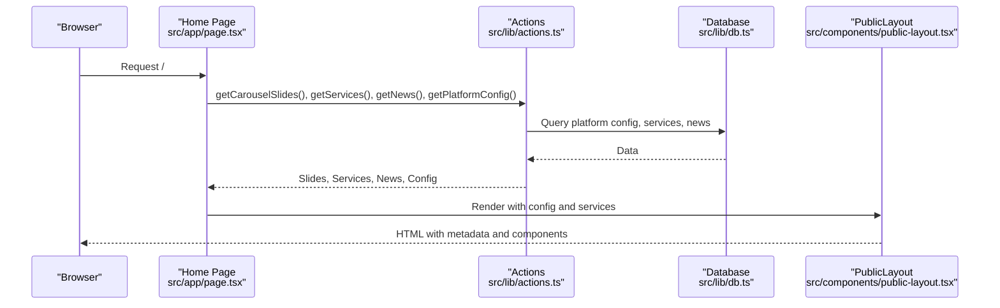
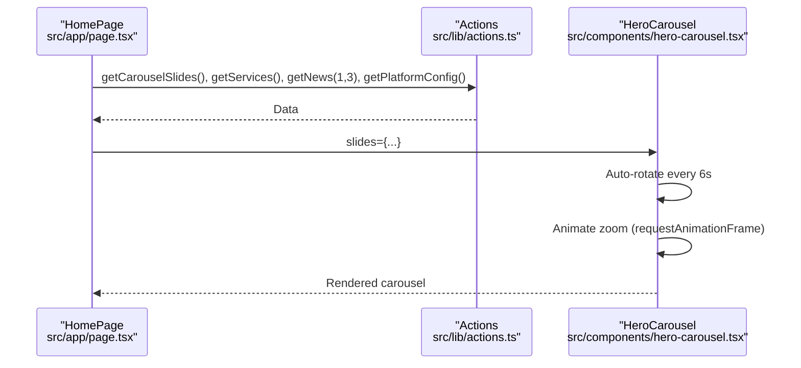
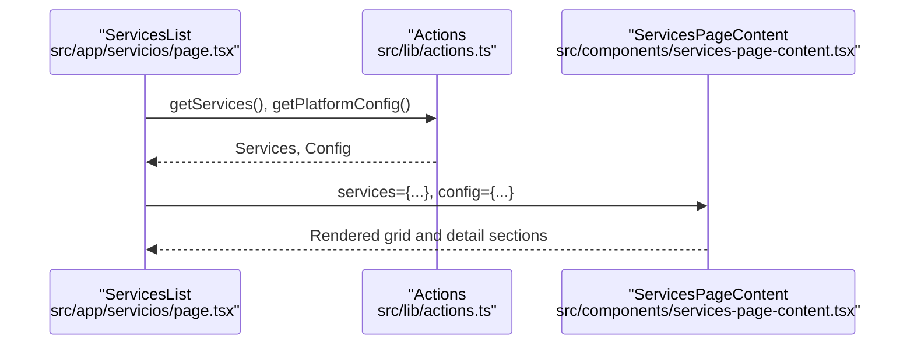
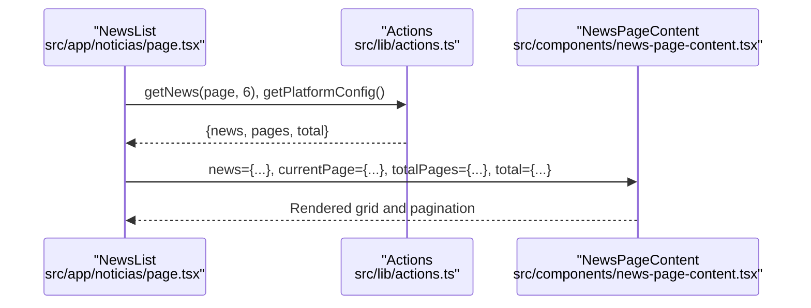
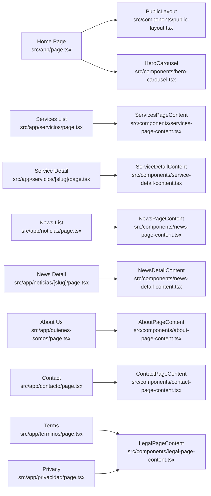

# Public Website Features

<cite>
**Referenced Files in This Document**
- [layout.tsx](file://src/app/layout.tsx)
- [page.tsx](file://src/app/page.tsx)
- [public-layout.tsx](file://src/components/public-layout.tsx)
- [hero-carousel.tsx](file://src/components/hero-carousel.tsx)
- [services-page-content.tsx](file://src/components/services-page-content.tsx)
- [service-detail-content.tsx](file://src/components/service-detail-content.tsx)
- [news-page-content.tsx](file://src/components/news-page-content.tsx)
- [news-detail-content.tsx](file://src/components/news-detail-content.tsx)
- [servicios/page.tsx](file://src/app/servicios/page.tsx)
- [servicios/[slug]/page.tsx](file://src/app/servicios/[slug]/page.tsx)
- [noticias/page.tsx](file://src/app/noticias/page.tsx)
- [noticias/[slug]/page.tsx](file://src/app/noticias/[slug]/page.tsx)
- [quienes-somos/page.tsx](file://src/app/quienes-somos/page.tsx)
- [contacto/page.tsx](file://src/app/contacto/page.tsx)
- [terminos/page.tsx](file://src/app/terminos/page.tsx)
- [privacidad/page.tsx](file://src/app/privacidad/page.tsx)
</cite>

## Table of Contents
1. [Introduction](#introduction)
2. [Project Structure](#project-structure)
3. [Core Components](#core-components)
4. [Architecture Overview](#architecture-overview)
5. [Detailed Component Analysis](#detailed-component-analysis)
6. [Dependency Analysis](#dependency-analysis)
7. [Performance Considerations](#performance-considerations)
8. [Troubleshooting Guide](#troubleshooting-guide)
9. [Conclusion](#conclusion)

## Introduction
This document describes the public website features of GreenAxis, focusing on the landing page with hero carousel, services catalog (listing and detail pages), news/blog system (with pagination and sharing), about us page, contact page, and legal pages (terms and privacy). It explains the component architecture, routing patterns, data fetching strategies, and user experience optimizations, including responsive design, SEO optimization, and performance considerations.

## Project Structure
The public website is built with Next.js App Router. Pages under `src/app/*` define routes, while reusable UI is encapsulated in `src/components/*`. Shared metadata generation and global layout are centralized in the root layout. Data fetching utilities are located in `src/lib/actions.ts` and database access in `src/lib/db.ts`.

```mermaid
graph TB
subgraph "App Router"
Home["Home Page<br/>src/app/page.tsx"]
ServicesList["Services List<br/>src/app/servicios/page.tsx"]
ServiceDetail["Service Detail<br/>src/app/servicios/[slug]/page.tsx"]
NewsList["News List<br/>src/app/noticias/page.tsx"]
NewsDetail["News Detail<br/>src/app/noticias/[slug]/page.tsx"]
About["About Us<br/>src/app/quienes-somos/page.tsx"]
Contact["Contact<br/>src/app/contacto/page.tsx"]
Terms["Terms<br/>src/app/terminos/page.tsx"]
Privacy["Privacy<br/>src/app/privacidad/page.tsx"]
end
subgraph "Components"
PublicLayout["PublicLayout<br/>src/components/public-layout.tsx"]
Hero["HeroCarousel<br/>src/components/hero-carousel.tsx"]
ServicesContent["ServicesPageContent<br/>src/components/services-page-content.tsx"]
ServiceDetailContent["ServiceDetailContent<br/>src/components/service-detail-content.tsx"]
NewsContent["NewsPageContent<br/>src/components/news-page-content.tsx"]
NewsDetailContent["NewsDetailContent<br/>src/components/news-detail-content.tsx"]
end
Layout["Root Layout<br/>src/app/layout.tsx"]
Layout --> PublicLayout
Home --> PublicLayout
ServicesList --> PublicLayout
ServiceDetail --> PublicLayout
NewsList --> PublicLayout
NewsDetail --> PublicLayout
About --> PublicLayout
Contact --> PublicLayout
Terms --> PublicLayout
Privacy --> PublicLayout
Home --> Hero
ServicesList --> ServicesContent
ServiceDetail --> ServiceDetailContent
NewsList --> NewsContent
NewsDetail --> NewsDetailContent
```

**Diagram sources**
- [layout.tsx:1-80](file://src/app/layout.tsx#L1-L80)
- [page.tsx:1-52](file://src/app/page.tsx#L1-L52)
- [public-layout.tsx:1-55](file://src/components/public-layout.tsx#L1-L55)
- [hero-carousel.tsx:1-305](file://src/components/hero-carousel.tsx#L1-L305)
- [services-page-content.tsx:1-358](file://src/components/services-page-content.tsx#L1-L358)
- [service-detail-content.tsx:1-186](file://src/components/service-detail-content.tsx#L1-L186)
- [news-page-content.tsx:1-185](file://src/components/news-page-content.tsx#L1-L185)
- [news-detail-content.tsx:1-280](file://src/components/news-detail-content.tsx#L1-L280)
- [servicios/page.tsx:1-17](file://src/app/servicios/page.tsx#L1-L17)
- [servicios/[slug]/page.tsx](file://src/app/servicios/[slug]/page.tsx#L1-L81)
- [noticias/page.tsx:1-25](file://src/app/noticias/page.tsx#L1-L25)
- [noticias/[slug]/page.tsx](file://src/app/noticias/[slug]/page.tsx#L1-L101)
- [quienes-somos/page.tsx:1-39](file://src/app/quienes-somos/page.tsx#L1-L39)
- [contacto/page.tsx:1-20](file://src/app/contacto/page.tsx#L1-L20)
- [terminos/page.tsx:1-22](file://src/app/terminos/page.tsx#L1-L22)
- [privacidad/page.tsx:1-70](file://src/app/privacidad/page.tsx#L1-L70)

**Section sources**
- [layout.tsx:1-80](file://src/app/layout.tsx#L1-L80)
- [page.tsx:1-52](file://src/app/page.tsx#L1-L52)
- [public-layout.tsx:1-55](file://src/components/public-layout.tsx#L1-L55)

## Core Components
- Root Layout: Generates dynamic metadata from platform configuration and wraps all pages with theme provider, analytics loader, and toast notifications.
- Public Layout: Provides shared header, footer, and WhatsApp bubble, preloading platform configuration and services for consistent navigation.
- Hero Carousel: Implements auto-rotating slides with smooth zoom animation, gradient overlays, and optional click-through links.
- Services Catalog: Renders featured and full service lists with responsive images and icons, plus individual service detail rendering.
- News/Blog: Lists articles with pagination, and renders detailed articles with rich content support and social sharing.
- About Us: Loads or seeds about page content from the database and renders structured content.
- Contact: Displays contact information and embedded map based on platform configuration.
- Legal Pages: Renders terms and privacy pages with configurable content and defaults.

**Section sources**
- [layout.tsx:19-54](file://src/app/layout.tsx#L19-L54)
- [public-layout.tsx:10-54](file://src/components/public-layout.tsx#L10-L54)
- [hero-carousel.tsx:30-305](file://src/components/hero-carousel.tsx#L30-L305)
- [services-page-content.tsx:51-358](file://src/components/services-page-content.tsx#L51-L358)
- [service-detail-content.tsx:38-186](file://src/components/service-detail-content.tsx#L38-L186)
- [news-page-content.tsx:31-185](file://src/components/news-page-content.tsx#L31-L185)
- [news-detail-content.tsx:52-280](file://src/components/news-detail-content.tsx#L52-L280)
- [quienes-somos/page.tsx:6-39](file://src/app/quienes-somos/page.tsx#L6-L39)
- [contacto/page.tsx:5-19](file://src/app/contacto/page.tsx#L5-L19)
- [terminos/page.tsx:5-21](file://src/app/terminos/page.tsx#L5-L21)
- [privacidad/page.tsx:5-69](file://src/app/privacidad/page.tsx#L5-L69)

## Architecture Overview
The public website follows a layered architecture:
- Routing Layer: App Router pages define routes and fetch data concurrently.
- Presentation Layer: Reusable components encapsulate UI and content rendering.
- Data Access Layer: Actions fetch platform configuration, services, news, and legal content; database seeding occurs when content is missing.
- Utility Layer: Cloudinary helpers optimize image URLs; analytics and theme providers enhance UX.

**Diagram sources**
- [page.tsx:9-17](file://src/app/page.tsx#L9-L17)
- [public-layout.tsx:10-14](file://src/components/public-layout.tsx#L10-L14)

**Section sources**
- [page.tsx:9-17](file://src/app/page.tsx#L9-L17)
- [public-layout.tsx:10-14](file://src/components/public-layout.tsx#L10-L14)

## Detailed Component Analysis

### Landing Page with Hero Carousel
- Data Fetching: Home page concurrently loads carousel slides, services, recent news, and platform configuration.
- Hero Carousel:
  - Auto-rotation every 6 seconds with smooth zoom animation using requestAnimationFrame.
  - Gradient overlays and optional custom gradient per slide.
  - Responsive image loading via Cloudinary helper.
  - Optional slide link wrapping and navigation controls.
- Sections below: Services, About, News, Social feed, Map, and Call-to-Action integrate platform configuration for branding and contact info.

**Diagram sources**
- [page.tsx:11-17](file://src/app/page.tsx#L11-L17)
- [hero-carousel.tsx:88-139](file://src/components/hero-carousel.tsx#L88-L139)

**Section sources**
- [page.tsx:9-50](file://src/app/page.tsx#L9-L50)
- [hero-carousel.tsx:30-305](file://src/components/hero-carousel.tsx#L30-L305)

### Services Catalog System
- Services Listing:
  - Loads all services and separates featured ones.
  - Renders cards with responsive images/icons and links to detail pages.
  - Includes a prominent CTA and a scroll-mapped anchor for direct navigation.
- Service Detail:
  - Parses EditorJS blocks or falls back to markdown-like formatting.
  - Displays hero image with icon placeholder fallback.
  - Provides contact CTA and contact info from platform configuration.

**Diagram sources**
- [servicios/page.tsx:5-16](file://src/app/servicios/page.tsx#L5-L16)
- [services-page-content.tsx:51-358](file://src/components/services-page-content.tsx#L51-L358)

**Section sources**
- [servicios/page.tsx:1-17](file://src/app/servicios/page.tsx#L1-L17)
- [services-page-content.tsx:51-358](file://src/components/services-page-content.tsx#L51-L358)
- [servicios/[slug]/page.tsx](file://src/app/servicios/[slug]/page.tsx#L53-L80)
- [service-detail-content.tsx:38-186](file://src/components/service-detail-content.tsx#L38-L186)

### News/Blog System
- News Listing:
  - Paginated with configurable page size; generates previous/next navigation.
  - Displays thumbnails with Cloudinary optimization and metadata (date, author).
- News Detail:
  - Dynamic metadata generation with canonical URL and Open Graph/Twitter cards.
  - Supports EditorJS blocks or fallback markdown rendering.
  - Social sharing buttons for Facebook, X (Twitter), WhatsApp, Instagram, and LinkedIn with clipboard fallback for Instagram.

**Diagram sources**
- [noticias/page.tsx:5-11](file://src/app/noticias/page.tsx#L5-L11)
- [news-page-content.tsx:31-185](file://src/components/news-page-content.tsx#L31-L185)

**Section sources**
- [noticias/page.tsx:1-25](file://src/app/noticias/page.tsx#L1-L25)
- [news-page-content.tsx:31-185](file://src/components/news-page-content.tsx#L31-L185)
- [noticias/[slug]/page.tsx](file://src/app/noticias/[slug]/page.tsx#L8-L54)
- [news-detail-content.tsx:52-280](file://src/components/news-detail-content.tsx#L52-L280)

### About Us Page
- Loads platform configuration and ensures about page content exists in the database, seeding defaults if absent.
- Renders structured content for hero, history, mission, and vision sections.

**Section sources**
- [quienes-somos/page.tsx:6-39](file://src/app/quienes-somos/page.tsx#L6-L39)

### Contact Form Functionality
- Displays contact information and embedded Google Maps based on platform configuration.
- Integrates a floating WhatsApp bubble with configurable number, message, and visibility.

**Section sources**
- [contacto/page.tsx:5-19](file://src/app/contacto/page.tsx#L5-L19)
- [public-layout.tsx:47-51](file://src/components/public-layout.tsx#L47-L51)

### Legal Pages Management
- Terms and Privacy pages load legal content via actions and render with platform configuration.
- Privacy page includes a default policy content with dynamic last update date.

**Section sources**
- [terminos/page.tsx:5-21](file://src/app/terminos/page.tsx#L5-L21)
- [privacidad/page.tsx:5-69](file://src/app/privacidad/page.tsx#L5-L69)

## Dependency Analysis
- Data Fetching Dependencies:
  - Pages depend on actions for platform configuration, services, news, and legal content.
  - Actions depend on database queries; seeding occurs when content is missing (e.g., about page).
- Component Dependencies:
  - PublicLayout depends on actions to preload configuration and services for header/footer consistency.
  - HeroCarousel is client-side and depends on Cloudinary helpers for responsive URLs.
  - News and Services components depend on Cloudinary helpers for optimized images.
- Routing Dependencies:
  - Dynamic routes for services (`[slug]`) and news (`[slug]`) resolve content by slug and enforce visibility rules (active/published).

**Diagram sources**
- [page.tsx:1-52](file://src/app/page.tsx#L1-L52)
- [public-layout.tsx:1-55](file://src/components/public-layout.tsx#L1-L55)
- [hero-carousel.tsx:1-305](file://src/components/hero-carousel.tsx#L1-L305)
- [servicios/page.tsx:1-17](file://src/app/servicios/page.tsx#L1-L17)
- [services-page-content.tsx:1-358](file://src/components/services-page-content.tsx#L1-L358)
- [servicios/[slug]/page.tsx](file://src/app/servicios/[slug]/page.tsx#L1-L81)
- [service-detail-content.tsx:1-186](file://src/components/service-detail-content.tsx#L1-L186)
- [noticias/page.tsx:1-25](file://src/app/noticias/page.tsx#L1-L25)
- [news-page-content.tsx:1-185](file://src/components/news-page-content.tsx#L1-L185)
- [noticias/[slug]/page.tsx](file://src/app/noticias/[slug]/page.tsx#L1-L101)
- [news-detail-content.tsx:1-280](file://src/components/news-detail-content.tsx#L1-L280)
- [quienes-somos/page.tsx:1-39](file://src/app/quienes-somos/page.tsx#L1-L39)
- [contacto/page.tsx:1-20](file://src/app/contacto/page.tsx#L1-L20)
- [terminos/page.tsx:1-22](file://src/app/terminos/page.tsx#L1-L22)
- [privacidad/page.tsx:1-70](file://src/app/privacidad/page.tsx#L1-L70)

**Section sources**
- [page.tsx:9-17](file://src/app/page.tsx#L9-L17)
- [public-layout.tsx:10-14](file://src/components/public-layout.tsx#L10-L14)
- [hero-carousel.tsx:30-305](file://src/components/hero-carousel.tsx#L30-L305)
- [services-page-content.tsx:51-358](file://src/components/services-page-content.tsx#L51-L358)
- [service-detail-content.tsx:38-186](file://src/components/service-detail-content.tsx#L38-L186)
- [news-page-content.tsx:31-185](file://src/components/news-page-content.tsx#L31-L185)
- [news-detail-content.tsx:52-280](file://src/components/news-detail-content.tsx#L52-L280)
- [servicios/[slug]/page.tsx](file://src/app/servicios/[slug]/page.tsx#L53-L80)
- [noticias/[slug]/page.tsx](file://src/app/noticias/[slug]/page.tsx#L56-L100)

## Performance Considerations
- Concurrent Data Fetching: Pages use Promise.all to minimize TTFB by fetching multiple datasets in parallel.
- Image Optimization: Cloudinary helpers generate responsive URLs and appropriate sizes for hero, thumbnail, and service images.
- Client-Side Rendering: Hero carousel and news detail content are client components to enable animations and interactive sharing.
- Lazy Loading: Images use Next.js lazy loading with fill and sizes attributes for optimal loading behavior.
- Animation Efficiency: requestAnimationFrame-based zoom animation runs only when visible and cancels previous frames to prevent jank.
- Pagination: News listing limits items per page to reduce payload size and improve initial load performance.

[No sources needed since this section provides general guidance]

## Troubleshooting Guide
- Service/News Not Found:
  - Service detail and news detail pages check active/published status and call notFound() if content is unavailable.
- Metadata Issues:
  - Root layout dynamically generates metadata from platform configuration; ensure platform config is present and valid.
- Image Loading Problems:
  - Verify Cloudinary URLs and fallbacks; ensure images are accessible and properly sized.
- WhatsApp Sharing:
  - Ensure platform configuration includes a valid phone number and message; floating bubble respects visibility flag.
- Clipboard Permissions:
  - News detail content handles clipboard permission errors gracefully with user feedback via toast notifications.

**Section sources**
- [servicios/[slug]/page.tsx](file://src/app/servicios/[slug]/page.tsx#L60-L62)
- [noticias/[slug]/page.tsx](file://src/app/noticias/[slug]/page.tsx#L64-L66)
- [layout.tsx:19-54](file://src/app/layout.tsx#L19-L54)
- [news-detail-content.tsx:65-108](file://src/components/news-detail-content.tsx#L65-L108)
- [public-layout.tsx:47-51](file://src/components/public-layout.tsx#L47-L51)

## Conclusion
GreenAxis’s public website leverages Next.js App Router for structured routing, concurrent data fetching for performance, and reusable components for consistent UX. The hero carousel, services catalog, news/blog system, about us, contact, and legal pages are designed with responsive images, SEO metadata, and user-friendly interactions. The architecture supports scalability and maintainability through clear separation of concerns and utility-driven optimizations.