# Services Catalog System

<cite>
**Referenced Files in This Document**
- [src/app/servicios/page.tsx](file://src/app/servicios/page.tsx)
- [src/app/servicios/[slug]/page.tsx](file://src/app/servicios/[slug]/page.tsx)
- [src/components/services-page-content.tsx](file://src/components/services-page-content.tsx)
- [src/components/service-detail-content.tsx](file://src/components/service-detail-content.tsx)
- [src/components/services-section.tsx](file://src/components/services-section.tsx)
- [src/lib/cloudinary.ts](file://src/lib/cloudinary.ts)
- [src/lib/actions.ts](file://src/lib/actions.ts)
- [src/app/api/servicios/route.ts](file://src/app/api/servicios/route.ts)
- [prisma/schema.prisma](file://prisma/schema.prisma)
- [src/components/editor-js.tsx](file://src/components/editor-js.tsx)
- [src/app/admin/servicios/page.tsx](file://src/app/admin/servicios/page.tsx)
- [src/components/media-picker.tsx](file://src/components/media-picker.tsx)
- [src/components/media-library-browser.tsx](file://src/components/media-library-browser.tsx)
- [src/app/layout.tsx](file://src/app/layout.tsx)
- [src/components/public-layout.tsx](file://src/components/public-layout.tsx)
- [scripts/seed-services.ts](file://scripts/seed-services.ts)
</cite>

## Table of Contents
1. [Introduction](#introduction)
2. [Project Structure](#project-structure)
3. [Core Components](#core-components)
4. [Architecture Overview](#architecture-overview)
5. [Detailed Component Analysis](#detailed-component-analysis)
6. [Dependency Analysis](#dependency-analysis)
7. [Performance Considerations](#performance-considerations)
8. [Troubleshooting Guide](#troubleshooting-guide)
9. [Conclusion](#conclusion)

## Introduction
This document describes the Services Catalog System, a comprehensive solution for displaying, managing, and optimizing service offerings on the Green Axis website. It covers the services listing page, individual service detail pages with slug-based routing, data models, content management integration, component architecture, dynamic content rendering, SEO optimization, categorization and filtering, image handling via Cloudinary, responsive design patterns, API endpoints, content editing workflows, and performance considerations.

## Project Structure
The services catalog spans frontend pages, backend APIs, shared components, and database models:

- Pages: Services listing and detail pages under `src/app/servicios/`
- Components: Shared UI components for service listings and detail views
- Backend: API routes for CRUD operations on services
- Data: Prisma schema defining the Service model and related entities
- Utilities: Cloudinary helpers for image optimization and responsive URLs
- Admin: Full-service management interface with content editing and media handling

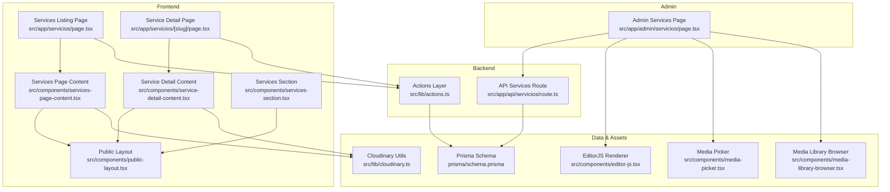

**Diagram sources**
- [src/app/servicios/page.tsx:1-17](file://src/app/servicios/page.tsx#L1-L17)
- [src/app/servicios/[slug]/page.tsx](file://src/app/servicios/[slug]/page.tsx#L1-L81)
- [src/components/services-page-content.tsx:1-358](file://src/components/services-page-content.tsx#L1-L358)
- [src/components/service-detail-content.tsx:1-186](file://src/components/service-detail-content.tsx#L1-L186)
- [src/components/services-section.tsx:1-182](file://src/components/services-section.tsx#L1-L182)
- [src/components/public-layout.tsx:1-55](file://src/components/public-layout.tsx#L1-L55)
- [src/app/api/servicios/route.ts:1-161](file://src/app/api/servicios/route.ts#L1-L161)
- [src/lib/actions.ts:1-136](file://src/lib/actions.ts#L1-L136)
- [prisma/schema.prisma:80-96](file://prisma/schema.prisma#L80-L96)
- [src/lib/cloudinary.ts:1-119](file://src/lib/cloudinary.ts#L1-L119)
- [src/components/editor-js.tsx:610-800](file://src/components/editor-js.tsx#L610-L800)
- [src/app/admin/servicios/page.tsx:1-627](file://src/app/admin/servicios/page.tsx#L1-L627)
- [src/components/media-picker.tsx:1-754](file://src/components/media-picker.tsx#L1-L754)
- [src/components/media-library-browser.tsx:1-362](file://src/components/media-library-browser.tsx#L1-L362)

**Section sources**
- [src/app/servicios/page.tsx:1-17](file://src/app/servicios/page.tsx#L1-L17)
- [src/app/servicios/[slug]/page.tsx](file://src/app/servicios/[slug]/page.tsx#L1-L81)
- [src/components/services-page-content.tsx:1-358](file://src/components/services-page-content.tsx#L1-L358)
- [src/components/service-detail-content.tsx:1-186](file://src/components/service-detail-content.tsx#L1-L186)
- [src/components/services-section.tsx:1-182](file://src/components/services-section.tsx#L1-L182)
- [src/components/public-layout.tsx:1-55](file://src/components/public-layout.tsx#L1-L55)
- [src/app/api/servicios/route.ts:1-161](file://src/app/api/servicios/route.ts#L1-L161)
- [src/lib/actions.ts:1-136](file://src/lib/actions.ts#L1-L136)
- [prisma/schema.prisma:80-96](file://prisma/schema.prisma#L80-L96)
- [src/lib/cloudinary.ts:1-119](file://src/lib/cloudinary.ts#L1-L119)
- [src/components/editor-js.tsx:610-800](file://src/components/editor-js.tsx#L610-L800)
- [src/app/admin/servicios/page.tsx:1-627](file://src/app/admin/servicios/page.tsx#L1-L627)
- [src/components/media-picker.tsx:1-754](file://src/components/media-picker.tsx#L1-L754)
- [src/components/media-library-browser.tsx:1-362](file://src/components/media-library-browser.tsx#L1-L362)

## Core Components
This section outlines the primary building blocks of the services catalog:

- Services Listing Page (`src/app/servicios/page.tsx`): Orchestrates fetching services and platform configuration, then renders the ServicesPageContent component within PublicLayout.
- Services Detail Page (`src/app/servicios/[slug]/page.tsx`): Implements slug-based routing, generates SEO metadata dynamically, validates service existence, and renders ServiceDetailContent.
- Services Page Content (`src/components/services-page-content.tsx`): Renders a hero section, featured services, and a complete service grid with responsive image handling and content formatting.
- Service Detail Content (`src/components/service-detail-content.tsx`): Displays a hero image or icon, service title/description, and either EditorJS blocks or markdown content with a call-to-action.
- Services Section (`src/components/services-section.tsx`): A reusable component for embedding a subset of services in other contexts, with sorting and responsive layouts.
- Cloudinary Utilities (`src/lib/cloudinary.ts`): Provides helpers to optimize and generate responsive Cloudinary URLs for different use cases.
- Actions Layer (`src/lib/actions.ts`): Encapsulates database queries for services and platform configuration.
- API Services Route (`src/app/api/servicios/route.ts`): Exposes REST endpoints for listing, creating, updating, and deleting services with authentication checks and cache revalidation.
- Prisma Schema (`prisma/schema.prisma`): Defines the Service model with fields for title, slug, description, content, blocks, icon, image URL, ordering, activation, and feature flag.
- EditorJS Integration (`src/components/editor-js.tsx`): Provides a renderer for EditorJS blocks and a client-side editor component used in admin workflows.
- Admin Services Page (`src/app/admin/servicios/page.tsx`): Full CRUD interface for services with content editing, icon selection, media picker integration, and real-time cache invalidation.
- Media Components (`src/components/media-picker.tsx`, `src/components/media-library-browser.tsx`): Comprehensive media selection and upload utilities supporting images, videos, and audio with duplicate detection and library browsing.

**Section sources**
- [src/app/servicios/page.tsx:1-17](file://src/app/servicios/page.tsx#L1-L17)
- [src/app/servicios/[slug]/page.tsx](file://src/app/servicios/[slug]/page.tsx#L1-L81)
- [src/components/services-page-content.tsx:1-358](file://src/components/services-page-content.tsx#L1-L358)
- [src/components/service-detail-content.tsx:1-186](file://src/components/service-detail-content.tsx#L1-L186)
- [src/components/services-section.tsx:1-182](file://src/components/services-section.tsx#L1-L182)
- [src/lib/cloudinary.ts:1-119](file://src/lib/cloudinary.ts#L1-L119)
- [src/lib/actions.ts:1-136](file://src/lib/actions.ts#L1-L136)
- [src/app/api/servicios/route.ts:1-161](file://src/app/api/servicios/route.ts#L1-L161)
- [prisma/schema.prisma:80-96](file://prisma/schema.prisma#L80-L96)
- [src/components/editor-js.tsx:610-800](file://src/components/editor-js.tsx#L610-L800)
- [src/app/admin/servicios/page.tsx:1-627](file://src/app/admin/servicios/page.tsx#L1-L627)
- [src/components/media-picker.tsx:1-754](file://src/components/media-picker.tsx#L1-L754)
- [src/components/media-library-browser.tsx:1-362](file://src/components/media-library-browser.tsx#L1-L362)

## Architecture Overview
The system follows a layered architecture:
- Presentation Layer: Next.js app router pages and shared components
- Business Logic: Action functions encapsulate data access
- Persistence: Prisma ORM with SQLite
- Asset Management: Cloudinary integration for optimized images
- Content Editing: EditorJS blocks with admin UI and media picker
- API Layer: REST endpoints with authentication and cache revalidation

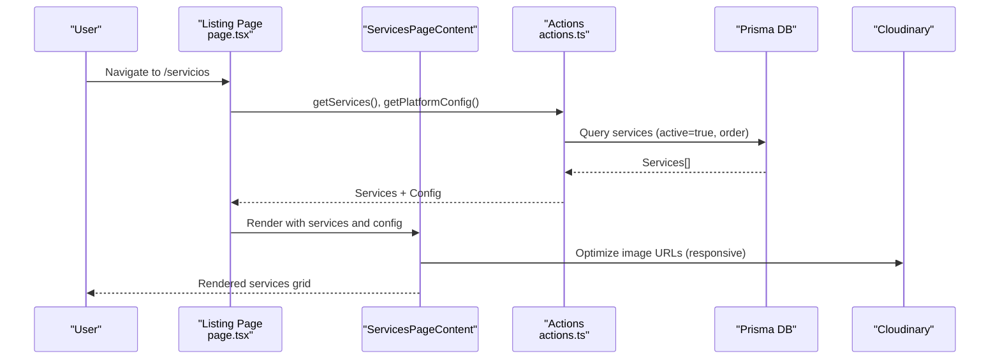

**Diagram sources**
- [src/app/servicios/page.tsx:1-17](file://src/app/servicios/page.tsx#L1-L17)
- [src/components/services-page-content.tsx:1-358](file://src/components/services-page-content.tsx#L1-L358)
- [src/lib/actions.ts:24-30](file://src/lib/actions.ts#L24-L30)
- [src/lib/cloudinary.ts:92-114](file://src/lib/cloudinary.ts#L92-L114)
- [prisma/schema.prisma:80-96](file://prisma/schema.prisma#L80-L96)

**Section sources**
- [src/app/servicios/page.tsx:1-17](file://src/app/servicios/page.tsx#L1-L17)
- [src/components/services-page-content.tsx:1-358](file://src/components/services-page-content.tsx#L1-L358)
- [src/lib/actions.ts:24-30](file://src/lib/actions.ts#L24-L30)
- [src/lib/cloudinary.ts:92-114](file://src/lib/cloudinary.ts#L92-L114)
- [prisma/schema.prisma:80-96](file://prisma/schema.prisma#L80-L96)

## Detailed Component Analysis

### Services Listing Page Implementation
The listing page orchestrates data fetching and layout rendering:
- Concurrently fetches services and platform configuration
- Passes data to ServicesPageContent for rendering
- Uses PublicLayout for consistent header, footer, and WhatsApp integration

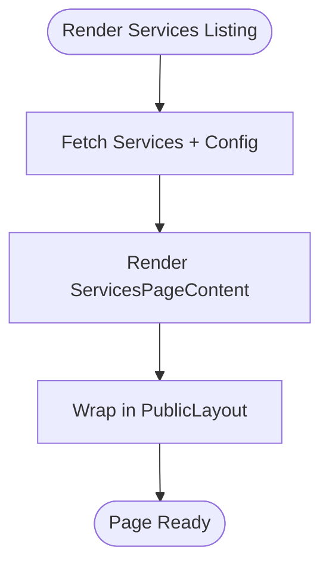

**Diagram sources**
- [src/app/servicios/page.tsx:5-16](file://src/app/servicios/page.tsx#L5-L16)
- [src/components/public-layout.tsx:10-54](file://src/components/public-layout.tsx#L10-L54)

**Section sources**
- [src/app/servicios/page.tsx:1-17](file://src/app/servicios/page.tsx#L1-L17)
- [src/components/public-layout.tsx:1-55](file://src/components/public-layout.tsx#L1-L55)

### Individual Service Detail Pages with Slug-Based Routing
Detail pages implement:
- Dynamic route parameters for slug-based URLs
- Concurrent fetching of service and platform configuration
- SEO metadata generation with Open Graph and Twitter cards
- Canonical URL and fallback handling for inactive services

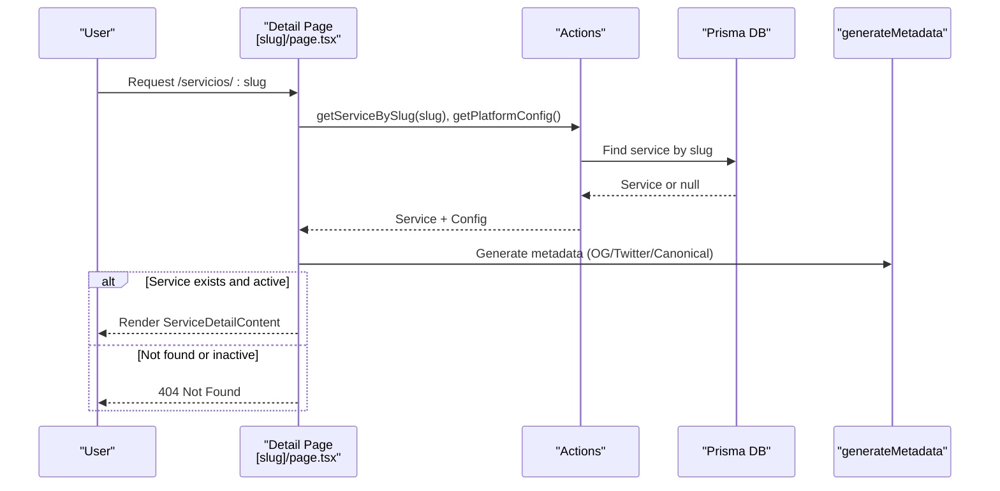

**Diagram sources**
- [src/app/servicios/[slug]/page.tsx](file://src/app/servicios/[slug]/page.tsx#L53-L80)
- [src/lib/actions.ts:39-44](file://src/lib/actions.ts#L39-L44)
- [src/app/servicios/[slug]/page.tsx](file://src/app/servicios/[slug]/page.tsx#L7-L51)

**Section sources**
- [src/app/servicios/[slug]/page.tsx](file://src/app/servicios/[slug]/page.tsx#L1-L81)
- [src/lib/actions.ts:39-44](file://src/lib/actions.ts#L39-L44)

### Service Data Models and Content Management Integration
The Service model defines the core data structure:
- Unique slug for SEO-friendly URLs
- Optional content in markdown or EditorJS blocks
- Icon and image URL fields
- Ordering, activation, and feature flags
- Automatic timestamps

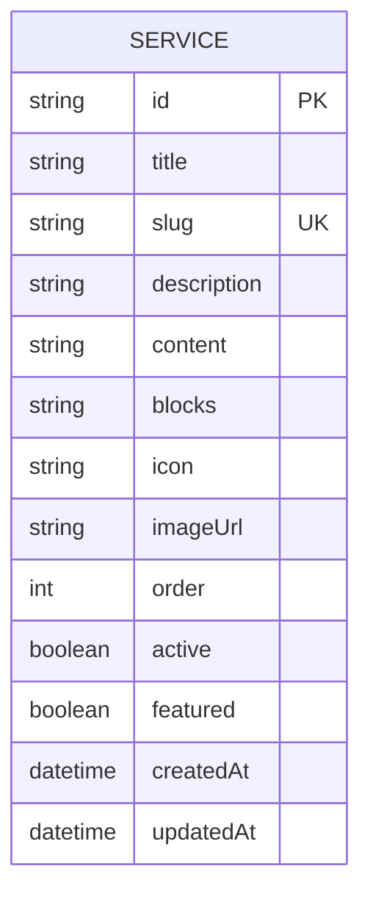

**Diagram sources**
- [prisma/schema.prisma:80-96](file://prisma/schema.prisma#L80-L96)

**Section sources**
- [prisma/schema.prisma:80-96](file://prisma/schema.prisma#L80-L96)

### Services Section Component Architecture
The ServicesSection component:
- Sorts services to show featured items first
- Limits display to six services
- Renders cards with responsive images and icons
- Uses Cloudinary utilities for responsive image URLs

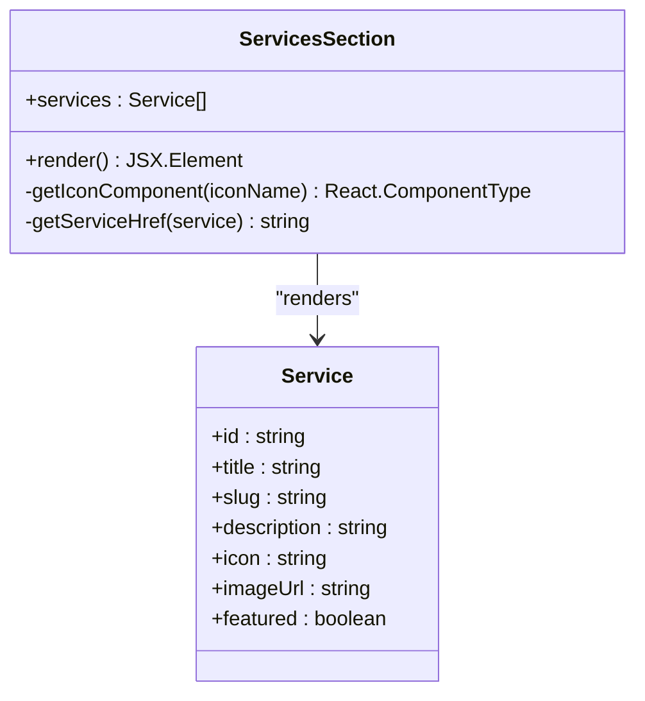

**Diagram sources**
- [src/components/services-section.tsx:43-181](file://src/components/services-section.tsx#L43-L181)
- [src/lib/cloudinary.ts:112-114](file://src/lib/cloudinary.ts#L112-L114)

**Section sources**
- [src/components/services-section.tsx:1-182](file://src/components/services-section.tsx#L1-L182)
- [src/lib/cloudinary.ts:1-119](file://src/lib/cloudinary.ts#L1-L119)

### Dynamic Content Rendering and EditorJS Integration
Dynamic rendering supports two content formats:
- EditorJS blocks: Serialized JSON parsed and rendered with dedicated components
- Markdown fallback: Line-by-line parsing with simple formatting rules

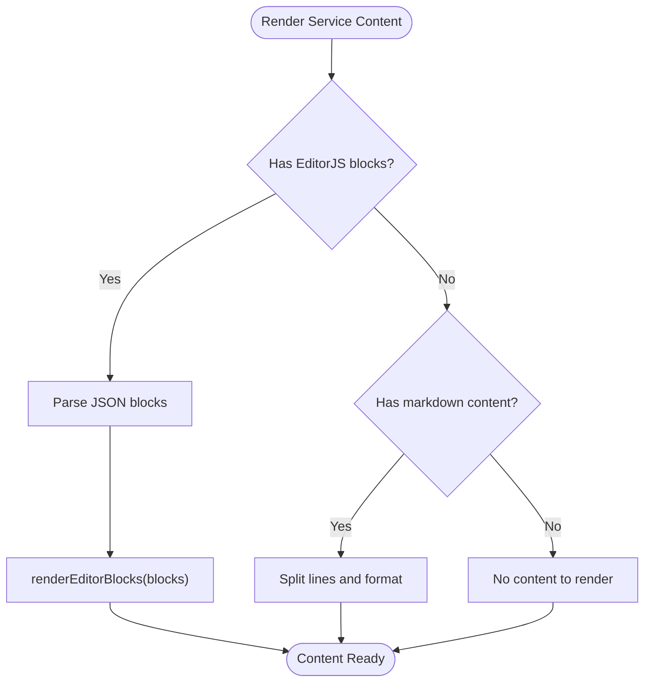

**Diagram sources**
- [src/components/service-detail-content.tsx:41-50](file://src/components/service-detail-content.tsx#L41-L50)
- [src/components/editor-js.tsx:610-800](file://src/components/editor-js.tsx#L610-L800)

**Section sources**
- [src/components/service-detail-content.tsx:1-186](file://src/components/service-detail-content.tsx#L1-L186)
- [src/components/editor-js.tsx:610-800](file://src/components/editor-js.tsx#L610-L800)

### SEO Optimization for Service Pages
SEO is handled at runtime:
- Dynamic metadata generation using service title, description, and image
- Open Graph and Twitter card configuration
- Canonical URL construction
- Fallbacks for missing data using platform configuration

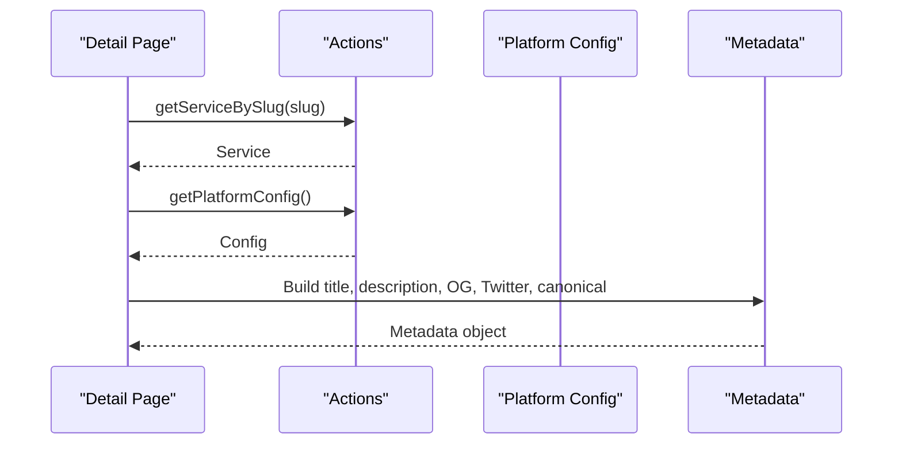

**Diagram sources**
- [src/app/servicios/[slug]/page.tsx](file://src/app/servicios/[slug]/page.tsx#L7-L51)
- [src/lib/actions.ts:6-22](file://src/lib/actions.ts#L6-L22)

**Section sources**
- [src/app/servicios/[slug]/page.tsx](file://src/app/servicios/[slug]/page.tsx#L7-L51)
- [src/lib/actions.ts:6-22](file://src/lib/actions.ts#L6-L22)

### Service Categorization, Filtering, and Ordering
- Ordering: Services are ordered by the `order` field ascending
- Activation: Only active services are returned to clients
- Feature flagging: Distinct treatment for featured services
- Filtering: Admin interface allows toggling active and featured flags

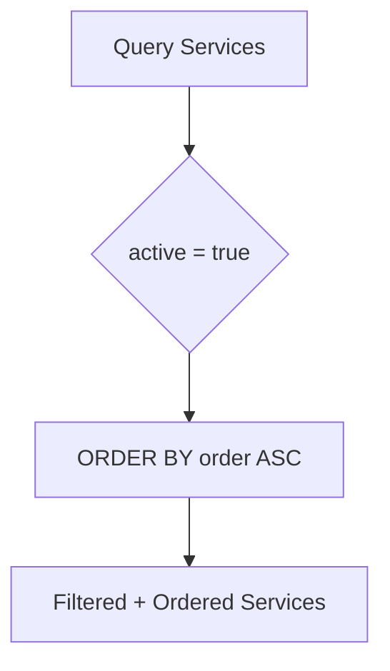

**Diagram sources**
- [src/lib/actions.ts:24-30](file://src/lib/actions.ts#L24-L30)
- [prisma/schema.prisma:90-92](file://prisma/schema.prisma#L90-L92)

**Section sources**
- [src/lib/actions.ts:24-30](file://src/lib/actions.ts#L24-L30)
- [prisma/schema.prisma:90-92](file://prisma/schema.prisma#L90-L92)

### Image Handling Through Cloudinary
Cloudinary utilities provide:
- URL validation for Cloudinary-hosted assets
- Transformation injection for format, quality, and width
- Preset helpers for hero, thumbnail, service, and admin thumbnail sizes
- Responsive URL generation for Next.js Image component

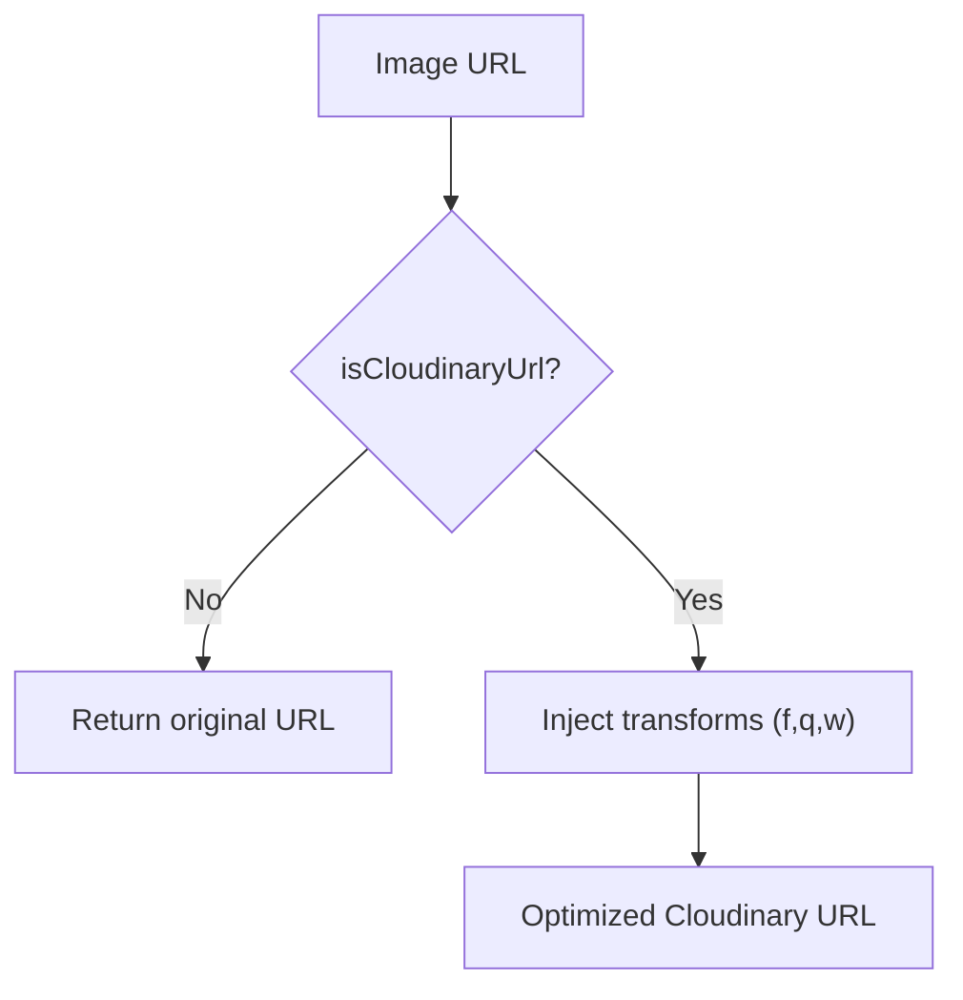

**Diagram sources**
- [src/lib/cloudinary.ts:11-83](file://src/lib/cloudinary.ts#L11-L83)
- [src/lib/cloudinary.ts:92-114](file://src/lib/cloudinary.ts#L92-L114)

**Section sources**
- [src/lib/cloudinary.ts:1-119](file://src/lib/cloudinary.ts#L1-L119)

### Responsive Design Patterns
Responsive patterns implemented across components:
- Next.js Image with appropriate sizes and responsive URLs
- Tailwind classes for grid layouts (1–3 columns on larger screens)
- Aspect ratios and overflow handling for cards and heroes
- Dark mode support via theme classes

**Section sources**
- [src/components/services-page-content.tsx:142-148](file://src/components/services-page-content.tsx#L142-L148)
- [src/components/service-detail-content.tsx:58-66](file://src/components/service-detail-content.tsx#L58-L66)
- [src/components/services-section.tsx:109-115](file://src/components/services-section.tsx#L109-L115)

### API Endpoints for Services Data
REST endpoints expose CRUD operations:
- GET `/api/servicios`: List all services ordered by `order`
- POST `/api/servicios`: Create a new service with slug generation and uniqueness handling
- PUT `/api/servicios`: Update service with slug regeneration option and cache revalidation
- DELETE `/api/servicios?id=...`: Delete service with cache revalidation

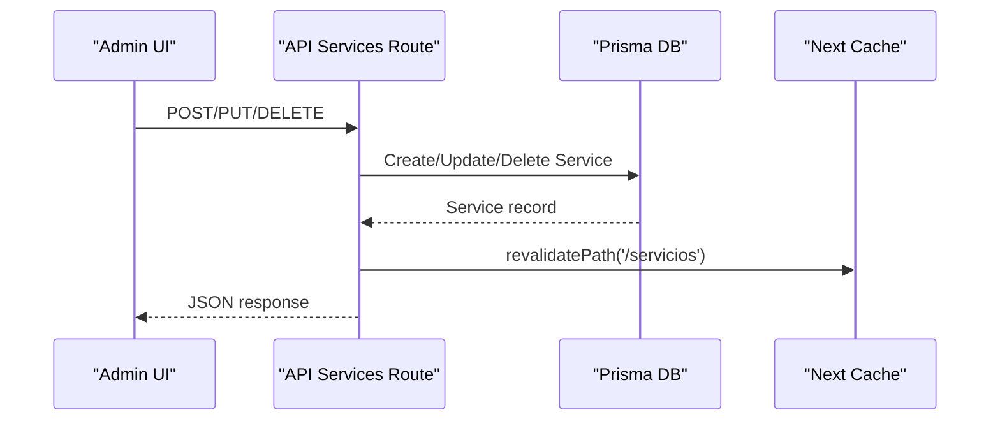

**Diagram sources**
- [src/app/api/servicios/route.ts:16-27](file://src/app/api/servicios/route.ts#L16-L27)
- [src/app/api/servicios/route.ts:29-71](file://src/app/api/servicios/route.ts#L29-L71)
- [src/app/api/servicios/route.ts:73-130](file://src/app/api/servicios/route.ts#L73-L130)
- [src/app/api/servicios/route.ts:132-160](file://src/app/api/servicios/route.ts#L132-L160)

**Section sources**
- [src/app/api/servicios/route.ts:1-161](file://src/app/api/servicios/route.ts#L1-L161)

### Content Editing Workflows
Admin workflow integrates:
- EditorJS component for rich content editing
- Media picker for selecting images from library or uploading new files
- Icon selector with categorized icons
- Real-time cache invalidation after edits
- Duplicate detection during uploads

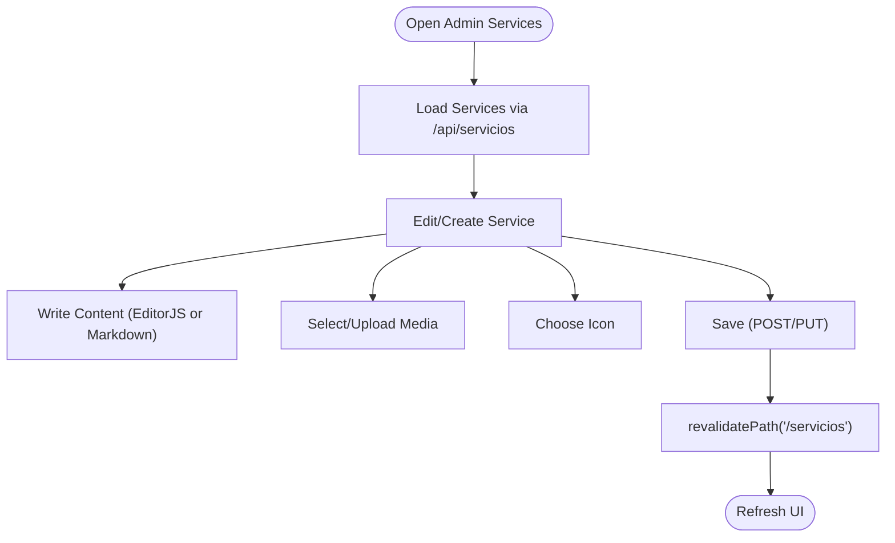

**Diagram sources**
- [src/app/admin/servicios/page.tsx:117-128](file://src/app/admin/servicios/page.tsx#L117-L128)
- [src/app/admin/servicios/page.tsx:134-176](file://src/app/admin/servicios/page.tsx#L134-L176)
- [src/components/media-picker.tsx:201-316](file://src/components/media-picker.tsx#L201-L316)

**Section sources**
- [src/app/admin/servicios/page.tsx:1-627](file://src/app/admin/servicios/page.tsx#L1-L627)
- [src/components/media-picker.tsx:1-754](file://src/components/media-picker.tsx#L1-L754)

## Dependency Analysis
The system exhibits clear separation of concerns:
- Pages depend on Actions for data access
- Components depend on utilities for image optimization
- Admin depends on API endpoints and EditorJS/media components
- API endpoints depend on Prisma for persistence

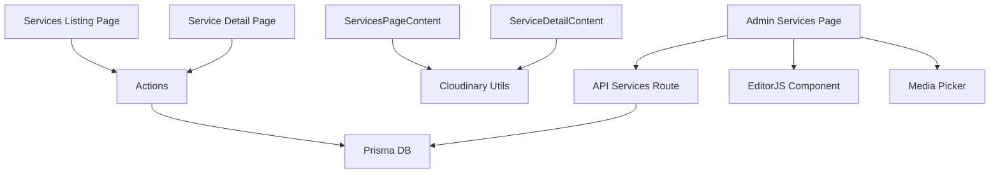

**Diagram sources**
- [src/app/servicios/page.tsx:1-17](file://src/app/servicios/page.tsx#L1-L17)
- [src/app/servicios/[slug]/page.tsx](file://src/app/servicios/[slug]/page.tsx#L1-L81)
- [src/lib/actions.ts:1-136](file://src/lib/actions.ts#L1-L136)
- [src/lib/cloudinary.ts:1-119](file://src/lib/cloudinary.ts#L1-L119)
- [src/app/admin/servicios/page.tsx:1-627](file://src/app/admin/servicios/page.tsx#L1-L627)
- [src/app/api/servicios/route.ts:1-161](file://src/app/api/servicios/route.ts#L1-L161)
- [src/components/editor-js.tsx:1-800](file://src/components/editor-js.tsx#L1-L800)
- [src/components/media-picker.tsx:1-754](file://src/components/media-picker.tsx#L1-L754)

**Section sources**
- [src/app/servicios/page.tsx:1-17](file://src/app/servicios/page.tsx#L1-L17)
- [src/app/servicios/[slug]/page.tsx](file://src/app/servicios/[slug]/page.tsx#L1-L81)
- [src/lib/actions.ts:1-136](file://src/lib/actions.ts#L1-L136)
- [src/lib/cloudinary.ts:1-119](file://src/lib/cloudinary.ts#L1-L119)
- [src/app/admin/servicios/page.tsx:1-627](file://src/app/admin/servicios/page.tsx#L1-L627)
- [src/app/api/servicios/route.ts:1-161](file://src/app/api/servicios/route.ts#L1-L161)
- [src/components/editor-js.tsx:1-800](file://src/components/editor-js.tsx#L1-L800)
- [src/components/media-picker.tsx:1-754](file://src/components/media-picker.tsx#L1-L754)

## Performance Considerations
- Concurrent data fetching: Pages use Promise.all to minimize load time
- Image optimization: Cloudinary transformations reduce bandwidth and improve loading speed
- Responsive images: Next.js Image with sizes and responsive URLs prevent oversized assets
- Cache revalidation: API endpoints invalidate caches after mutations to keep content fresh
- Pagination and lazy loading: Media library components support infinite scroll and pagination
- Minimal client-side hydration: EditorJS is initialized on the client to avoid SSR overhead

[No sources needed since this section provides general guidance]

## Troubleshooting Guide
Common issues and resolutions:
- Service not found: Detail pages redirect to 404 when service is null or inactive
- Slug conflicts: API ensures unique slugs by appending timestamp when duplicates occur
- Missing images: Components fall back to icons or gradient backgrounds when imageUrl is unavailable
- Media upload errors: Media picker displays user-friendly error messages and suggests alternatives
- Cache inconsistencies: API revalidation ensures pages reflect recent changes immediately

**Section sources**
- [src/app/servicios/[slug]/page.tsx](file://src/app/servicios/[slug]/page.tsx#L60-L62)
- [src/app/api/servicios/route.ts:41-45](file://src/app/api/servicios/route.ts#L41-L45)
- [src/components/media-picker.tsx:204-213](file://src/components/media-picker.tsx#L204-L213)

## Conclusion
The Services Catalog System provides a robust, SEO-friendly, and maintainable solution for managing and presenting service offerings. It leverages Next.js app router pages, a clean component architecture, Prisma-backed data models, Cloudinary-powered image optimization, and a comprehensive admin interface with EditorJS content editing. The system balances performance with flexibility, enabling efficient content updates and scalable growth.