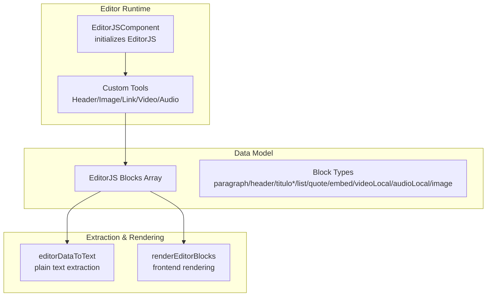
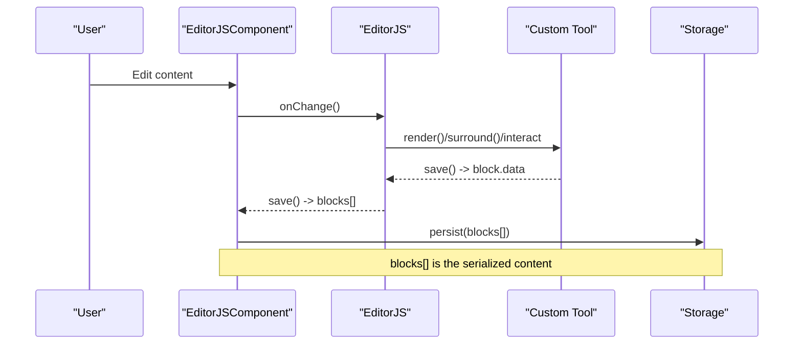
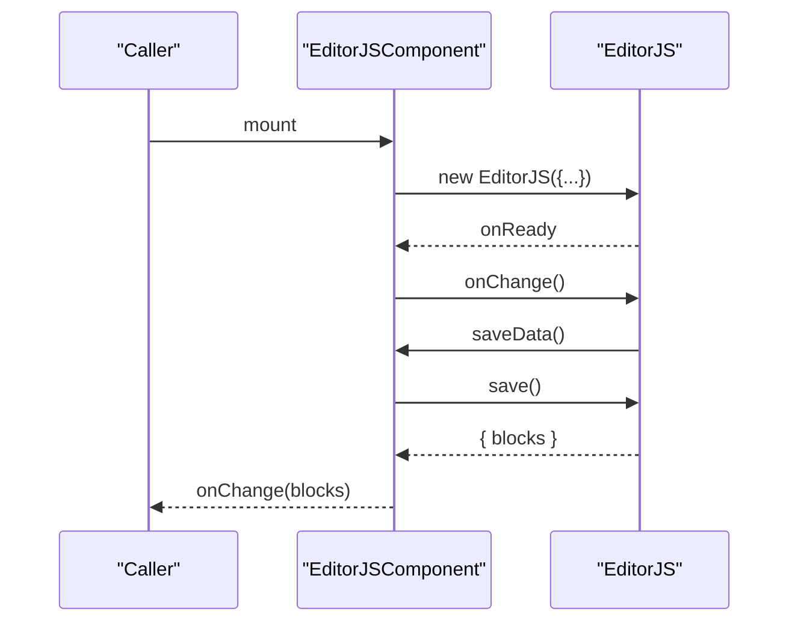
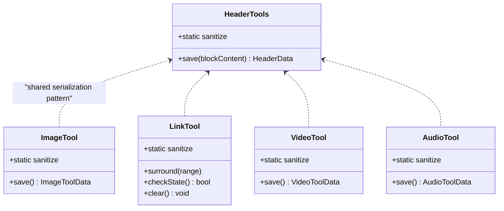
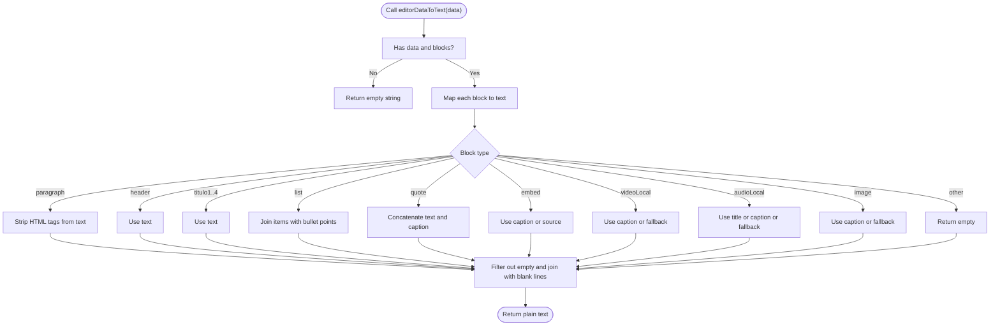
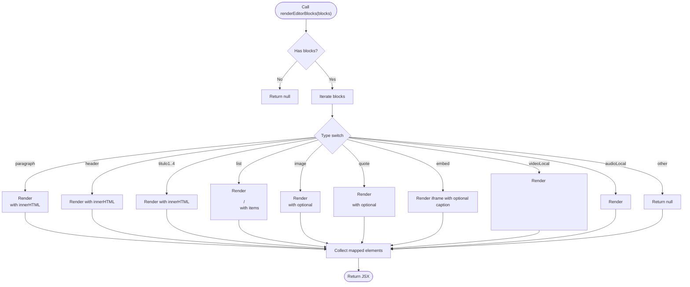
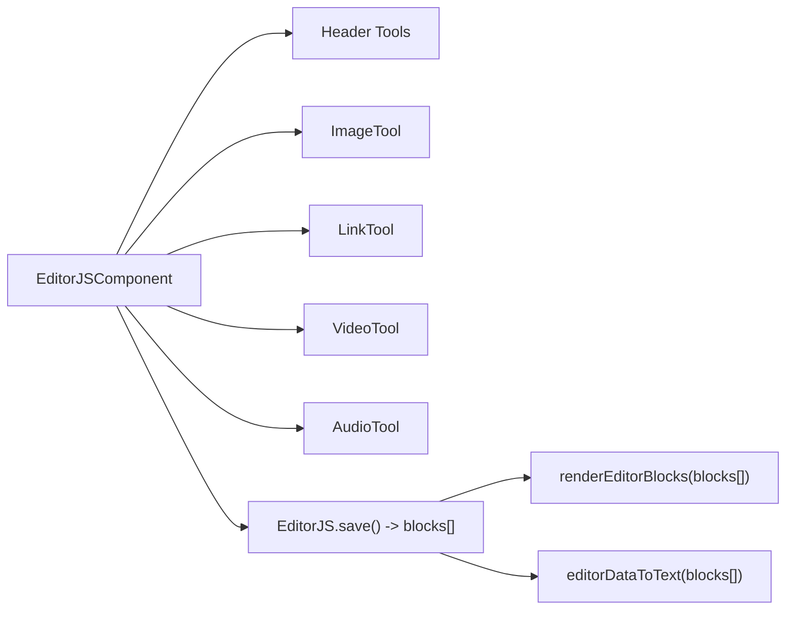

# Content Serialization & Storage

<cite>
**Referenced Files in This Document**
- [editor-js.tsx](file://src/components/editor-js.tsx)
- [editor-js-header-tools.ts](file://src/components/editor-js-header-tools.ts)
- [editor-js-image-tool.ts](file://src/components/editor-js-image-tool.ts)
- [editor-js-link-tool.ts](file://src/components/editor-js-link-tool.ts)
- [editor-js-video-tool.ts](file://src/components/editor-js-video-tool.ts)
- [editor-js-audio-tool.ts](file://src/components/editor-js-audio-tool.ts)
</cite>

## Table of Contents
1. [Introduction](#introduction)
2. [Project Structure](#project-structure)
3. [Core Components](#core-components)
4. [Architecture Overview](#architecture-overview)
5. [Detailed Component Analysis](#detailed-component-analysis)
6. [Dependency Analysis](#dependency-analysis)
7. [Performance Considerations](#performance-considerations)
8. [Troubleshooting Guide](#troubleshooting-guide)
9. [Conclusion](#conclusion)

## Introduction
This document explains the content serialization and storage mechanisms used by the rich text editing system. It focuses on the EditorJS data format, validation and sanitization strategies, and rendering/persistence patterns. It also documents the editorDataToText helper for extracting plain text, content extraction methods, and data integrity validation across different environments. Examples demonstrate serializing complex content structures, handling nested blocks, and maintaining consistency.

## Project Structure
The rich text editing system centers around a React component that initializes EditorJS and registers custom tools. The EditorJS data model is a blocks array where each block has a type and a data payload. Rendering helpers transform EditorJS blocks into frontend markup, and a dedicated helper extracts plain text for indexing/search or summaries.

**Diagram sources**
- [editor-js.tsx:344-575](file://src/components/editor-js.tsx#L344-L575)
- [editor-js.tsx:577-608](file://src/components/editor-js.tsx#L577-L608)
- [editor-js.tsx:610-849](file://src/components/editor-js.tsx#L610-L849)

**Section sources**
- [editor-js.tsx:344-575](file://src/components/editor-js.tsx#L344-L575)
- [editor-js.tsx:577-608](file://src/components/editor-js.tsx#L577-L608)
- [editor-js.tsx:610-849](file://src/components/editor-js.tsx#L610-L849)

## Core Components
- EditorJSComponent: Initializes EditorJS, registers tools, handles saveOnChange, and exposes a saveData callback via the EditorJS save() method.
- Custom Tools: Provide block-level serialization and sanitization for headers, images, links, videos, and audio.
- Rendering Helpers: renderEditorBlocks converts EditorJS blocks into React components for the frontend.
- Plain Text Extraction: editorDataToText transforms EditorJS data into a normalized plain text representation.

Key responsibilities:
- Serialization: Each tool’s save() returns a structured data object suitable for persistence.
- Validation/Sanitization: Tools define sanitize rules to control allowed HTML attributes/values.
- Persistence: The EditorJS save() method returns the canonical blocks array for storage.
- Extraction: Plain text conversion supports summaries, search indexing, and cross-environment compatibility.

**Section sources**
- [editor-js.tsx:344-575](file://src/components/editor-js.tsx#L344-L575)
- [editor-js.tsx:577-608](file://src/components/editor-js.tsx#L577-L608)
- [editor-js.tsx:610-849](file://src/components/editor-js.tsx#L610-L849)
- [editor-js-header-tools.ts:30-47](file://src/components/editor-js-header-tools.ts#L30-L47)
- [editor-js-image-tool.ts:38-47](file://src/components/editor-js-image-tool.ts#L38-L47)
- [editor-js-link-tool.ts:22-30](file://src/components/editor-js-link-tool.ts#L22-L30)
- [editor-js-video-tool.ts:36-43](file://src/components/editor-js-video-tool.ts#L36-L43)
- [editor-js-audio-tool.ts:36-43](file://src/components/editor-js-audio-tool.ts#L36-L43)

## Architecture Overview
The system follows a modular pattern:
- EditorJSComponent orchestrates initialization, tool registration, and change handling.
- Each custom tool encapsulates rendering, user interaction, and serialization.
- The blocks array produced by EditorJS serves as the single source of truth for content.
- Two complementary helpers operate on the blocks array: one for rendering and one for plain text extraction.

**Diagram sources**
- [editor-js.tsx:364-373](file://src/components/editor-js.tsx#L364-L373)
- [editor-js.tsx:400-531](file://src/components/editor-js.tsx#L400-L531)
- [editor-js-header-tools.ts:55-60](file://src/components/editor-js-header-tools.ts#L55-L60)
- [editor-js-image-tool.ts:336-344](file://src/components/editor-js-image-tool.ts#L336-L344)
- [editor-js-link-tool.ts:325-328](file://src/components/editor-js-link-tool.ts#L325-L328)
- [editor-js-video-tool.ts:311-317](file://src/components/editor-js-video-tool.ts#L311-L317)
- [editor-js-audio-tool.ts:342-348](file://src/components/editor-js-audio-tool.ts#L342-L348)

## Detailed Component Analysis

### EditorJSComponent and Save Flow
- Initializes EditorJS with tools and i18n configuration.
- Registers onChange handler that invokes saveData.
- saveData calls EditorJS.save(), which returns the blocks array.
- The onChange prop receives the serialized blocks for upstream persistence.

**Diagram sources**
- [editor-js.tsx:364-373](file://src/components/editor-js.tsx#L364-L373)
- [editor-js.tsx:400-531](file://src/components/editor-js.tsx#L400-L531)

**Section sources**
- [editor-js.tsx:344-575](file://src/components/editor-js.tsx#L344-L575)
- [editor-js.tsx:364-373](file://src/components/editor-js.tsx#L364-L373)

### Custom Tools: Serialization and Sanitization
Each tool defines:
- Static sanitize rules to control allowed attributes/values.
- A save() method that returns a structured data object for persistence.
- Optional inline/toolbox behavior and configuration.

**Diagram sources**
- [editor-js-header-tools.ts:30-47](file://src/components/editor-js-header-tools.ts#L30-L47)
- [editor-js-image-tool.ts:38-47](file://src/components/editor-js-image-tool.ts#L38-L47)
- [editor-js-link-tool.ts:22-30](file://src/components/editor-js-link-tool.ts#L22-L30)
- [editor-js-video-tool.ts:36-43](file://src/components/editor-js-video-tool.ts#L36-L43)
- [editor-js-audio-tool.ts:36-43](file://src/components/editor-js-audio-tool.ts#L36-L43)

**Section sources**
- [editor-js-header-tools.ts:30-47](file://src/components/editor-js-header-tools.ts#L30-L47)
- [editor-js-image-tool.ts:38-47](file://src/components/editor-js-image-tool.ts#L38-L47)
- [editor-js-link-tool.ts:22-30](file://src/components/editor-js-link-tool.ts#L22-L30)
- [editor-js-video-tool.ts:36-43](file://src/components/editor-js-video-tool.ts#L36-L43)
- [editor-js-audio-tool.ts:36-43](file://src/components/editor-js-audio-tool.ts#L36-L43)

### Plain Text Extraction: editorDataToText
Purpose:
- Convert EditorJS blocks into a normalized plain text representation.
- Useful for summaries, search indexing, and cross-environment compatibility.

Behavior highlights:
- Iterates blocks and maps each type to a text representation.
- Applies minimal sanitization (e.g., stripping HTML tags from paragraph text).
- Joins blocks with blank lines to preserve logical separation.

**Diagram sources**
- [editor-js.tsx:577-608](file://src/components/editor-js.tsx#L577-L608)

**Section sources**
- [editor-js.tsx:577-608](file://src/components/editor-js.tsx#L577-L608)

### Rendering Blocks: renderEditorBlocks
Purpose:
- Transform EditorJS blocks into React components for frontend display.
- Handles typography, lists, images, quotes, embedded players, and media blocks.

Highlights:
- Uses dangerouslySetInnerHTML for HTML content inside paragraphs and list items.
- Applies semantic HTML and responsive styling.
- Supports captions and fallbacks for media blocks.

**Diagram sources**
- [editor-js.tsx:610-849](file://src/components/editor-js.tsx#L610-L849)

**Section sources**
- [editor-js.tsx:610-849](file://src/components/editor-js.tsx#L610-L849)

### Data Integrity and Validation
- Sanitization rules per tool ensure only safe attributes/values are persisted.
- The save() method of each tool returns a deterministic data shape aligned with the block type.
- Plain text extraction normalizes content for downstream consumers.

Recommendations:
- Validate block.type and required fields before persistence.
- Normalize text content (e.g., strip HTML tags for plain text).
- Enforce size limits and allowed MIME types for media uploads.

**Section sources**
- [editor-js-header-tools.ts:30-47](file://src/components/editor-js-header-tools.ts#L30-L47)
- [editor-js-image-tool.ts:38-47](file://src/components/editor-js-image-tool.ts#L38-L47)
- [editor-js-link-tool.ts:22-30](file://src/components/editor-js-link-tool.ts#L22-L30)
- [editor-js-video-tool.ts:36-43](file://src/components/editor-js-video-tool.ts#L36-L43)
- [editor-js-audio-tool.ts:36-43](file://src/components/editor-js-audio-tool.ts#L36-L43)
- [editor-js.tsx:577-608](file://src/components/editor-js.tsx#L577-L608)

## Dependency Analysis
- EditorJSComponent depends on:
  - Custom tools for block-level capabilities.
  - i18n configuration for localized UI.
  - onChange callback for serialization and persistence.
- Custom tools depend on:
  - EditorJS APIs for rendering and saving.
  - Sanitization rules for data safety.
- Rendering and extraction helpers depend on:
  - The EditorJS blocks array structure.

**Diagram sources**
- [editor-js.tsx:344-575](file://src/components/editor-js.tsx#L344-L575)
- [editor-js.tsx:577-608](file://src/components/editor-js.tsx#L577-L608)
- [editor-js.tsx:610-849](file://src/components/editor-js.tsx#L610-L849)

**Section sources**
- [editor-js.tsx:344-575](file://src/components/editor-js.tsx#L344-L575)
- [editor-js.tsx:577-608](file://src/components/editor-js.tsx#L577-L608)
- [editor-js.tsx:610-849](file://src/components/editor-js.tsx#L610-L849)

## Performance Considerations
- Prefer incremental saves: The onChange-driven saveData minimizes unnecessary writes.
- Avoid heavy DOM operations in onChange; rely on EditorJS save() output.
- For plain text extraction, avoid expensive regex operations; keep transformations lightweight.
- When rendering large documents, consider virtualization or pagination of blocks.

## Troubleshooting Guide
Common issues and resolutions:
- Empty or missing blocks:
  - Ensure data prop is initialized with a blocks array; fallback occurs in initialization.
- Media upload failures:
  - Verify file size limits and allowed MIME types; errors are surfaced via alerts and console logs.
- Rendering anomalies:
  - Confirm block.type and required fields exist; renderEditorBlocks returns null for invalid inputs.
- Plain text extraction inconsistencies:
  - Validate that HTML tags are stripped appropriately; adjust sanitization rules if needed.

**Section sources**
- [editor-js.tsx:375-575](file://src/components/editor-js.tsx#L375-L575)
- [editor-js.tsx:577-608](file://src/components/editor-js.tsx#L577-L608)
- [editor-js.tsx:610-849](file://src/components/editor-js.tsx#L610-L849)
- [editor-js-image-tool.ts:206-232](file://src/components/editor-js-image-tool.ts#L206-L232)
- [editor-js-video-tool.ts:189-215](file://src/components/editor-js-video-tool.ts#L189-L215)
- [editor-js-audio-tool.ts:186-213](file://src/components/editor-js-audio-tool.ts#L186-L213)

## Conclusion
The rich text editing system leverages EditorJS with custom tools to produce a robust, serializable content model. The blocks array serves as the canonical representation, enabling flexible rendering and plain text extraction. Sanitization rules and structured save() outputs ensure data integrity across environments. By following the outlined patterns, teams can maintain consistency, optimize performance, and troubleshoot reliably.