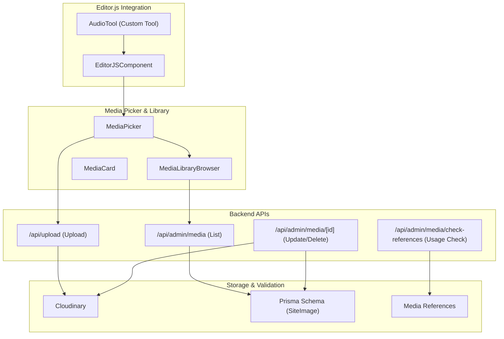
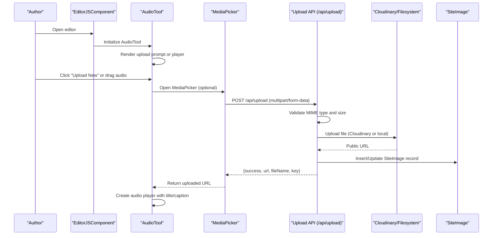
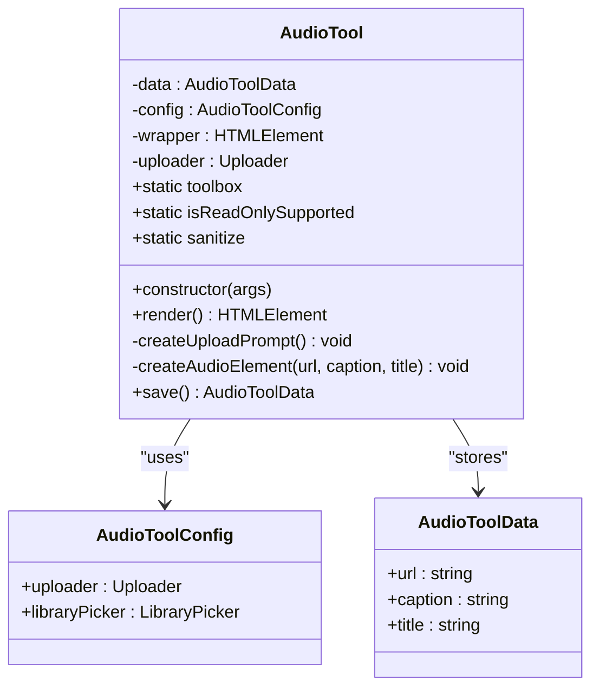
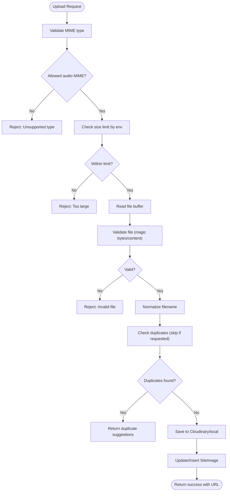
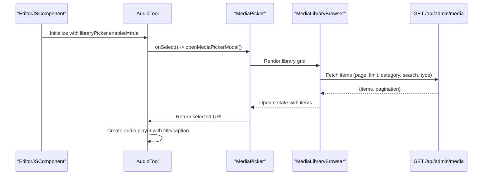
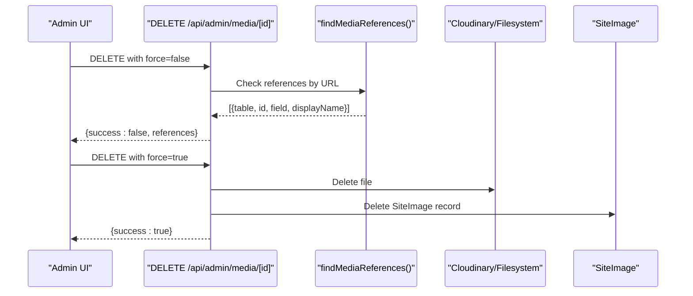
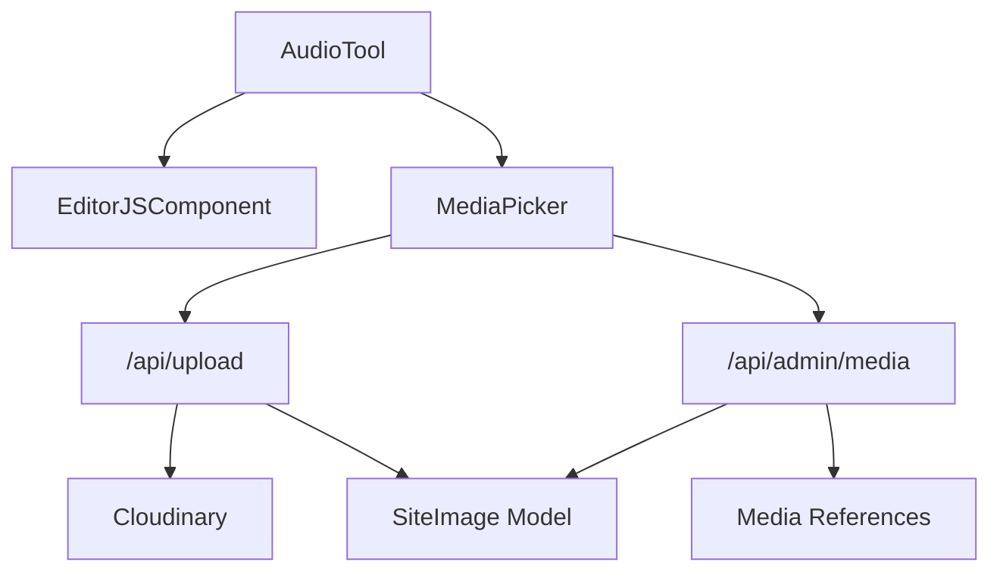

# Audio Tool Implementation

<cite>
**Referenced Files in This Document**
- [editor-js-audio-tool.ts](file://src/components/editor-js-audio-tool.ts)
- [editor-js.tsx](file://src/components/editor-js.tsx)
- [route.ts](file://src/app/api/upload/route.ts)
- [route.ts](file://src/app/api/admin/media/[id]/route.ts)
- [route.ts](file://src/app/api/admin/media/check-references/route.ts)
- [route.ts](file://src/app/api/admin/media/route.ts)
- [media-library-browser.tsx](file://src/components/media-library-browser.tsx)
- [media-picker.tsx](file://src/components/media-picker.tsx)
- [media-card.tsx](file://src/components/media-card.tsx)
- [cloudinary.ts](file://src/lib/cloudinary.ts)
- [media-references.ts](file://src/lib/media-references.ts)
- [schema.prisma](file://prisma/schema.prisma)
</cite>

## Table of Contents
1. [Introduction](#introduction)
2. [Project Structure](#project-structure)
3. [Core Components](#core-components)
4. [Architecture Overview](#architecture-overview)
5. [Detailed Component Analysis](#detailed-component-analysis)
6. [Dependency Analysis](#dependency-analysis)
7. [Performance Considerations](#performance-considerations)
8. [Troubleshooting Guide](#troubleshooting-guide)
9. [Conclusion](#conclusion)

## Introduction
This document provides comprehensive technical documentation for the Editor.js Audio Tool implementation. It covers audio file upload handling, format validation, integration with the media library, tool configuration, player interface, metadata extraction, and responsive rendering. The Audio Tool enables authors to embed playable audio clips with title and caption metadata, supporting both direct uploads and media library selection.

## Project Structure
The Audio Tool is implemented as a custom Editor.js tool and integrates with backend upload and media management APIs. Key components include:
- Frontend tool implementation for Editor.js
- Media picker and library browser for selecting existing audio
- Backend upload endpoint with validation and Cloudinary integration
- Media management APIs for listing, updating, and deleting media entries
- Reference tracking to prevent accidental deletion of in-use media

**Diagram sources**
- [editor-js-audio-tool.ts:19-349](file://src/components/editor-js-audio-tool.ts#L19-L349)
- [editor-js.tsx:485-496](file://src/components/editor-js.tsx#L485-L496)
- [media-picker.tsx:106-118](file://src/components/media-picker.tsx#L106-L118)
- [media-library-browser.tsx:69-75](file://src/components/media-library-browser.tsx#L69-L75)
- [route.ts:150-392](file://src/app/api/upload/route.ts#L150-L392)
- [route.ts:37-149](file://src/app/api/admin/media/route.ts#L37-L149)
- [route.ts:125-211](file://src/app/api/admin/media/[id]/route.ts#L125-L211)
- [route.ts:37-85](file://src/app/api/admin/media/check-references/route.ts#L37-L85)
- [schema.prisma:121-135](file://prisma/schema.prisma#L121-L135)
- [media-references.ts:65-181](file://src/lib/media-references.ts#L65-L181)

**Section sources**
- [editor-js-audio-tool.ts:19-349](file://src/components/editor-js-audio-tool.ts#L19-L349)
- [editor-js.tsx:485-496](file://src/components/editor-js.tsx#L485-L496)
- [media-picker.tsx:106-118](file://src/components/media-picker.tsx#L106-L118)
- [media-library-browser.tsx:69-75](file://src/components/media-library-browser.tsx#L69-L75)

## Core Components
- AudioTool: Custom Editor.js tool implementing upload prompt, drag-and-drop, file selection, and audio player rendering with title and caption inputs.
- EditorJSComponent: Initializes Editor.js with AudioTool configured alongside other tools, providing uploader and library picker integration.
- MediaPicker: Unified component for selecting media from library or uploading new files, with progress tracking and duplicate detection.
- MediaLibraryBrowser: Grid-based browsing of media with search, category filtering, and infinite scroll pagination.
- Upload API: Validates file types and sizes, performs duplicate checks, stores files via Cloudinary or filesystem, and updates database records.
- Media Management APIs: CRUD operations for media entries, including reference checking before deletion.

**Section sources**
- [editor-js-audio-tool.ts:19-349](file://src/components/editor-js-audio-tool.ts#L19-L349)
- [editor-js.tsx:485-496](file://src/components/editor-js.tsx#L485-L496)
- [media-picker.tsx:106-118](file://src/components/media-picker.tsx#L106-L118)
- [media-library-browser.tsx:69-75](file://src/components/media-library-browser.tsx#L69-L75)
- [route.ts:150-392](file://src/app/api/upload/route.ts#L150-L392)
- [route.ts:37-149](file://src/app/api/admin/media/route.ts#L37-L149)

## Architecture Overview
The Audio Tool follows a modular architecture:
- Frontend: AudioTool renders an upload prompt or audio player, delegates uploads to the configured uploader, and optionally opens the MediaPicker for library selection.
- Backend: The upload endpoint validates file types and sizes, checks for duplicates, and persists files to Cloudinary or local filesystem while updating the SiteImage record.
- Media Library: The MediaPicker and MediaLibraryBrowser provide browsing and selection capabilities, integrating with the media listing API and reference checker.

**Diagram sources**
- [editor-js.tsx:485-496](file://src/components/editor-js.tsx#L485-L496)
- [editor-js-audio-tool.ts:167-213](file://src/components/editor-js-audio-tool.ts#L167-L213)
- [media-picker.tsx:201-316](file://src/components/media-picker.tsx#L201-L316)
- [route.ts:150-392](file://src/app/api/upload/route.ts#L150-L392)

## Detailed Component Analysis

### AudioTool Implementation
The AudioTool is a custom Editor.js tool that manages audio embedding with the following capabilities:
- Upload prompt with styled UI, drag-and-drop support, and file input.
- Library picker integration enabling selection from the media library.
- Audio player rendering with title and caption inputs.
- Data sanitization and persistence via the save method.

Key implementation aspects:
- Configuration interface defines uploader and libraryPicker callbacks.
- Rendering logic switches between upload prompt and audio player based on existing data.
- File validation includes MIME type filtering and size checks.
- Title and caption inputs update internal data state.
- Player creation sets preload metadata for efficient loading.

**Diagram sources**
- [editor-js-audio-tool.ts:3-17](file://src/components/editor-js-audio-tool.ts#L3-L17)
- [editor-js-audio-tool.ts:19-53](file://src/components/editor-js-audio-tool.ts#L19-L53)
- [editor-js-audio-tool.ts:55-66](file://src/components/editor-js-audio-tool.ts#L55-L66)
- [editor-js-audio-tool.ts:263-340](file://src/components/editor-js-audio-tool.ts#L263-L340)

**Section sources**
- [editor-js-audio-tool.ts:3-17](file://src/components/editor-js-audio-tool.ts#L3-L17)
- [editor-js-audio-tool.ts:19-53](file://src/components/editor-js-audio-tool.ts#L19-L53)
- [editor-js-audio-tool.ts:55-66](file://src/components/editor-js-audio-tool.ts#L55-L66)
- [editor-js-audio-tool.ts:68-261](file://src/components/editor-js-audio-tool.ts#L68-L261)
- [editor-js-audio-tool.ts:263-340](file://src/components/editor-js-audio-tool.ts#L263-L340)

### Upload and Validation Pipeline
The backend upload pipeline ensures robust audio handling:
- Supported audio MIME types include MP3, WAV, OGG, M4A.
- Environment-aware size limits: stricter in production (15MB for audio) versus development (20MB).
- File validation uses magic bytes for non-image types and content checks for SVG.
- Duplicate detection compares normalized filenames; returns suggestions if duplicates are found.
- Cloudinary integration for production; local filesystem for development.
- Database updates via SiteImage model with key-based replacement logic.

**Diagram sources**
- [route.ts:50-78](file://src/app/api/upload/route.ts#L50-L78)
- [route.ts:176-200](file://src/app/api/upload/route.ts#L176-L200)
- [route.ts:213-243](file://src/app/api/upload/route.ts#L213-L243)
- [route.ts:272-324](file://src/app/api/upload/route.ts#L272-L324)
- [route.ts:326-356](file://src/app/api/upload/route.ts#L326-L356)

**Section sources**
- [route.ts:50-78](file://src/app/api/upload/route.ts#L50-L78)
- [route.ts:176-200](file://src/app/api/upload/route.ts#L176-L200)
- [route.ts:213-243](file://src/app/api/upload/route.ts#L213-L243)
- [route.ts:272-324](file://src/app/api/upload/route.ts#L272-L324)
- [route.ts:326-356](file://src/app/api/upload/route.ts#L326-L356)

### Media Library Integration
The MediaPicker and MediaLibraryBrowser enable seamless selection of existing audio assets:
- MediaPicker supports tabs for library browsing and direct upload.
- MediaLibraryBrowser provides infinite scroll, search, and category filtering.
- MediaCard displays thumbnails/icons, usage badges, and hover actions.
- Integration with EditorJSComponent uses a unified accept type for audio.

**Diagram sources**
- [editor-js.tsx:485-496](file://src/components/editor-js.tsx#L485-L496)
- [editor-js-audio-tool.ts:104-143](file://src/components/editor-js-audio-tool.ts#L104-L143)
- [media-picker.tsx:106-118](file://src/components/media-picker.tsx#L106-L118)
- [media-library-browser.tsx:69-75](file://src/components/media-library-browser.tsx#L69-L75)
- [route.ts:37-149](file://src/app/api/admin/media/route.ts#L37-L149)

**Section sources**
- [editor-js.tsx:485-496](file://src/components/editor-js.tsx#L485-L496)
- [editor-js-audio-tool.ts:104-143](file://src/components/editor-js-audio-tool.ts#L104-L143)
- [media-picker.tsx:106-118](file://src/components/media-picker.tsx#L106-L118)
- [media-library-browser.tsx:69-75](file://src/components/media-library-browser.tsx#L69-L75)
- [route.ts:37-149](file://src/app/api/admin/media/route.ts#L37-L149)

### Media Management and Deletion Safety
The media management APIs ensure safe deletion by checking references before removal:
- PUT /api/admin/media/[id]: Update metadata (label, description, category, alt).
- DELETE /api/admin/media/[id]: Check references unless force=true, then delete from storage and DB.
- POST /api/admin/media/check-references: Return usage locations for a given URL.

**Diagram sources**
- [route.ts:220-318](file://src/app/api/admin/media/[id]/route.ts#L220-L318)
- [route.ts:37-85](file://src/app/api/admin/media/check-references/route.ts#L37-L85)
- [media-references.ts:65-181](file://src/lib/media-references.ts#L65-L181)

**Section sources**
- [route.ts:220-318](file://src/app/api/admin/media/[id]/route.ts#L220-L318)
- [route.ts:37-85](file://src/app/api/admin/media/check-references/route.ts#L37-L85)
- [media-references.ts:65-181](file://src/lib/media-references.ts#L65-L181)

## Dependency Analysis
The Audio Tool depends on:
- EditorJSComponent for initialization and configuration.
- MediaPicker for library selection and upload workflows.
- Upload API for file validation, storage, and database updates.
- Media APIs for listing and managing media entries.
- Cloudinary utilities for URL optimization and responsive delivery.

**Diagram sources**
- [editor-js-audio-tool.ts:19-53](file://src/components/editor-js-audio-tool.ts#L19-L53)
- [editor-js.tsx:485-496](file://src/components/editor-js.tsx#L485-L496)
- [media-picker.tsx:106-118](file://src/components/media-picker.tsx#L106-L118)
- [route.ts:150-392](file://src/app/api/upload/route.ts#L150-L392)
- [route.ts:37-149](file://src/app/api/admin/media/route.ts#L37-L149)
- [schema.prisma:121-135](file://prisma/schema.prisma#L121-L135)
- [media-references.ts:65-181](file://src/lib/media-references.ts#L65-L181)

**Section sources**
- [editor-js-audio-tool.ts:19-53](file://src/components/editor-js-audio-tool.ts#L19-L53)
- [editor-js.tsx:485-496](file://src/components/editor-js.tsx#L485-L496)
- [media-picker.tsx:106-118](file://src/components/media-picker.tsx#L106-L118)
- [route.ts:150-392](file://src/app/api/upload/route.ts#L150-L392)
- [route.ts:37-149](file://src/app/api/admin/media/route.ts#L37-L149)
- [schema.prisma:121-135](file://prisma/schema.prisma#L121-L135)
- [media-references.ts:65-181](file://src/lib/media-references.ts#L65-L181)

## Performance Considerations
- Preload metadata: Audio players use preload metadata to optimize initial load times.
- Lazy loading: Media thumbnails leverage lazy loading for improved perceived performance.
- Cloudinary optimization: Responsive URL helpers adjust format and quality for optimal delivery.
- Pagination: Media library uses infinite scroll with controlled page sizes to reduce memory usage.
- File size limits: Enforced at upload time to prevent oversized requests and improve reliability.

[No sources needed since this section provides general guidance]

## Troubleshooting Guide
Common issues and resolutions:
- Unsupported audio format: Ensure files match allowed MIME types (MP3, WAV, OGG, M4A).
- File too large: Reduce file size or upload directly to Cloudinary Console and paste the URL.
- Duplicate audio detected: Use the suggested existing file or confirm upload anyway.
- Media deletion blocked: Check usage references and either remove references or force deletion.
- Upload failures: Verify Cloudinary credentials and network connectivity; review error details returned by the upload endpoint.

**Section sources**
- [route.ts:170-174](file://src/app/api/upload/route.ts#L170-L174)
- [route.ts:190-200](file://src/app/api/upload/route.ts#L190-L200)
- [media-picker.tsx:274-286](file://src/components/media-picker.tsx#L274-L286)
- [route.ts:251-279](file://src/app/api/admin/media/[id]/route.ts#L251-L279)
- [route.ts:291-300](file://src/app/api/admin/media/[id]/route.ts#L291-L300)

## Conclusion
The Audio Tool provides a robust, user-friendly solution for embedding playable audio in Editor.js. It combines intuitive upload and library selection with strong backend validation, duplication detection, and safe deletion safeguards. The implementation emphasizes performance, accessibility, and maintainability through modular components and clear separation of concerns.