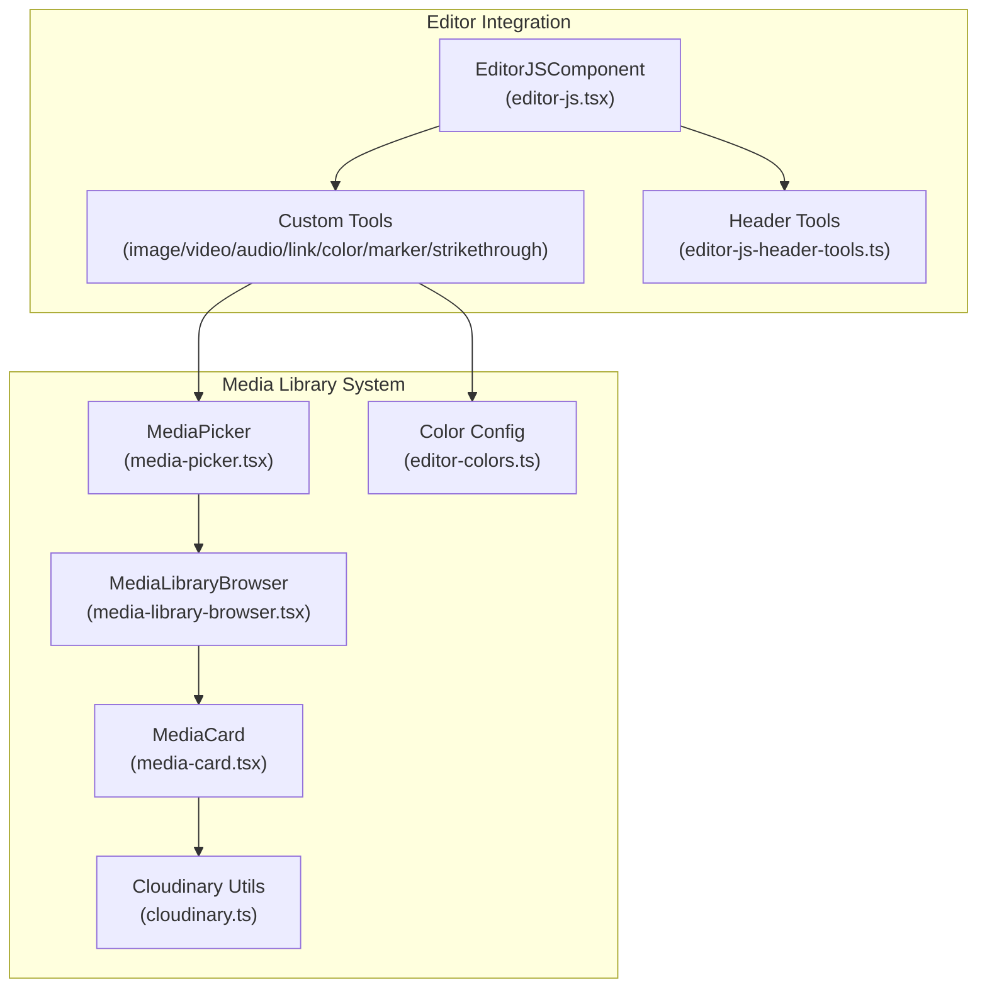
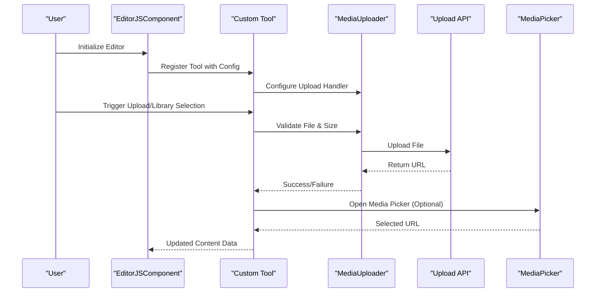
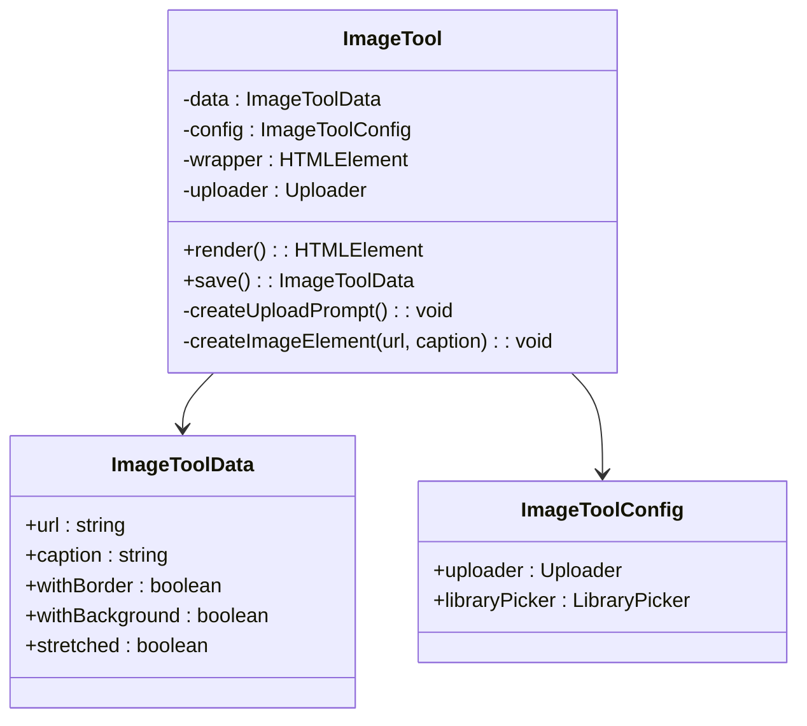
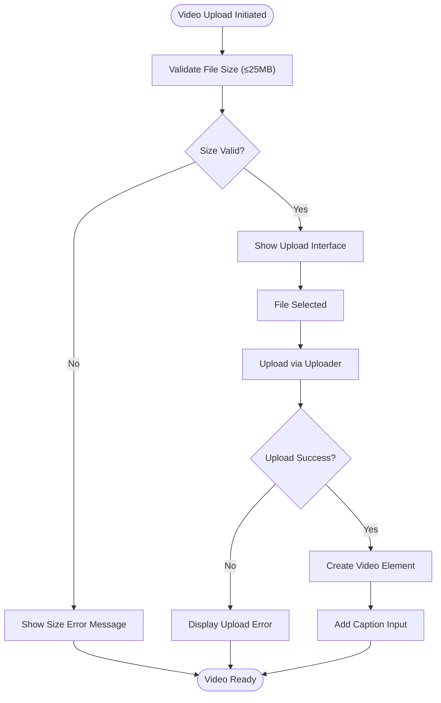
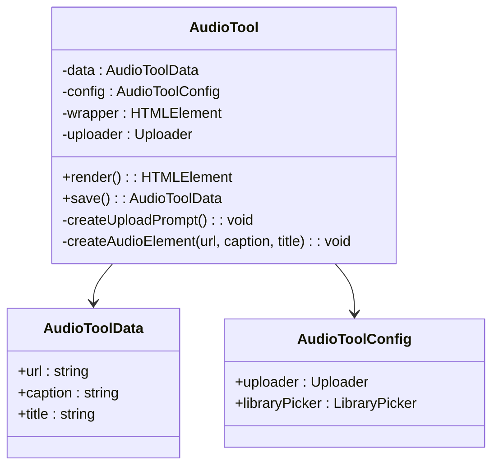
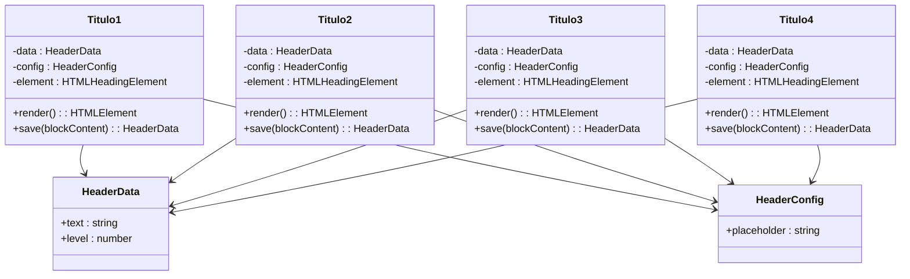
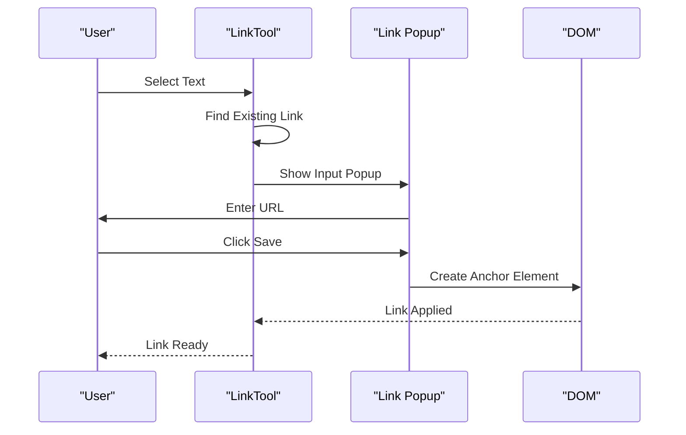
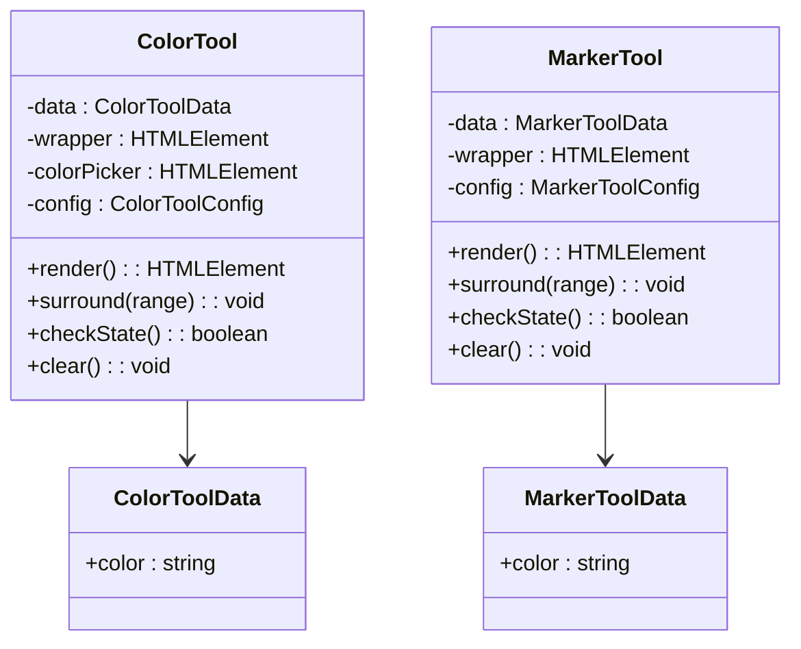
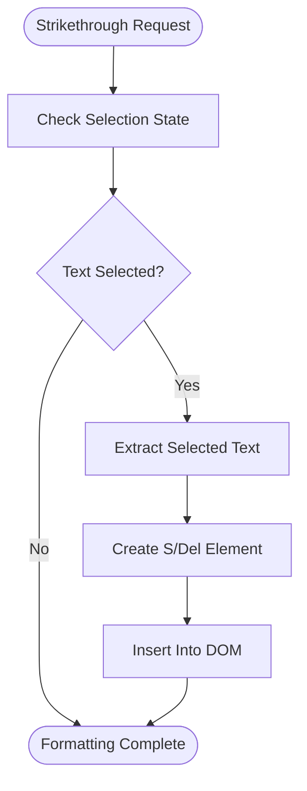
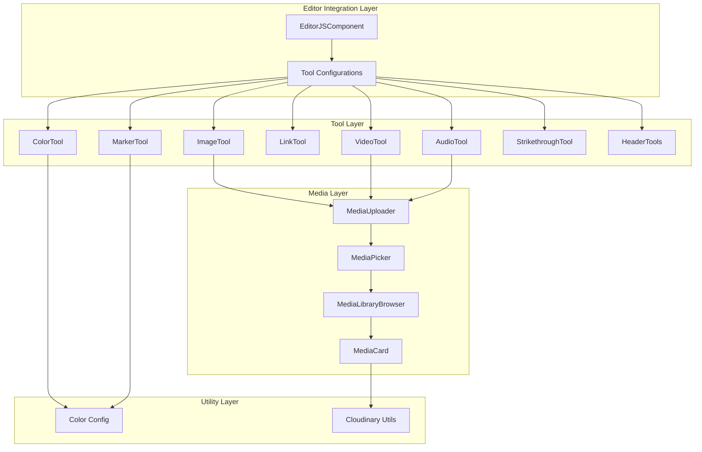

# Custom Tools Implementation

<cite>
**Referenced Files in This Document**
- [editor-js-image-tool.ts](file://src/components/editor-js-image-tool.ts)
- [editor-js-video-tool.ts](file://src/components/editor-js-video-tool.ts)
- [editor-js-audio-tool.ts](file://src/components/editor-js-audio-tool.ts)
- [editor-js-header-tools.ts](file://src/components/editor-js-header-tools.ts)
- [editor-js-link-tool.ts](file://src/components/editor-js-link-tool.ts)
- [editor-js-color-tool.ts](file://src/components/editor-js-color-tool.ts)
- [editor-js-marker-tool.ts](file://src/components/editor-js-marker-tool.ts)
- [editor-js-strikethrough-tool.ts](file://src/components/editor-js-strikethrough-tool.ts)
- [editor-js.tsx](file://src/components/editor-js.tsx)
- [media-library-browser.tsx](file://src/components/media-library-browser.tsx)
- [media-picker.tsx](file://src/components/media-picker.tsx)
- [media-card.tsx](file://src/components/media-card.tsx)
- [editor-colors.ts](file://src/components/editor-colors.ts)
- [cloudinary.ts](file://src/lib/cloudinary.ts)
</cite>

## Table of Contents
1. [Introduction](#introduction)
2. [Project Structure](#project-structure)
3. [Core Components](#core-components)
4. [Architecture Overview](#architecture-overview)
5. [Detailed Component Analysis](#detailed-component-analysis)
6. [Dependency Analysis](#dependency-analysis)
7. [Performance Considerations](#performance-considerations)
8. [Troubleshooting Guide](#troubleshooting-guide)
9. [Conclusion](#conclusion)

## Introduction
This document provides comprehensive technical documentation for the custom Editor.js tools implemented in the project. It covers the architecture, configuration patterns, upload handlers, and integration with the media library system. The focus areas include specialized tools for images, videos, audio, headers, links, color, marker, and strikethrough, along with the custom tool development process, plugin registration, and tool-specific features such as file validation, size limits, and media picker integration.

## Project Structure
The custom Editor.js tools are implemented as standalone TypeScript/React components and integrated into the main EditorJS component. The media library system is built around reusable UI components that support browsing, filtering, uploading, and selecting media assets.

**Diagram sources**
- [editor-js.tsx:344-575](file://src/components/editor-js.tsx#L344-L575)
- [media-picker.tsx:106-754](file://src/components/media-picker.tsx#L106-L754)
- [media-library-browser.tsx:69-362](file://src/components/media-library-browser.tsx#L69-L362)
- [media-card.tsx:103-295](file://src/components/media-card.tsx#L103-L295)
- [editor-colors.ts:1-50](file://src/components/editor-colors.ts#L1-L50)
- [cloudinary.ts:1-119](file://src/lib/cloudinary.ts#L1-L119)

**Section sources**
- [editor-js.tsx:344-575](file://src/components/editor-js.tsx#L344-L575)
- [media-picker.tsx:106-754](file://src/components/media-picker.tsx#L106-L754)
- [media-library-browser.tsx:69-362](file://src/components/media-library-browser.tsx#L69-L362)
- [media-card.tsx:103-295](file://src/components/media-card.tsx#L103-L295)
- [editor-colors.ts:1-50](file://src/components/editor-colors.ts#L1-L50)
- [cloudinary.ts:1-119](file://src/lib/cloudinary.ts#L1-L119)

## Core Components
This section outlines the primary custom tools and their roles within the content management workflow.

- **Image Tool**: Provides local image upload with drag-and-drop support, library picker integration, and caption management with size validation (10MB limit).
- **Video Tool**: Supports local video uploads with validation (25MB limit), library picker, and caption/mute controls.
- **Audio Tool**: Handles audio file uploads with validation (15MB limit), library picker, and title/caption fields.
- **Header Tools**: Standalone tools for H1-H4 headers with placeholder customization and sanitization.
- **Link Tool**: Inline link creation with popup interface, URL validation, and removal capabilities.
- **Color Tool**: Text color selection with predefined palette and inline formatting.
- **Marker Tool**: Highlight color selection with multiple color options and inline formatting.
- **Strikethrough Tool**: Inline strikethrough formatting with sanitization support.

**Section sources**
- [editor-js-image-tool.ts:21-346](file://src/components/editor-js-image-tool.ts#L21-L346)
- [editor-js-video-tool.ts:19-319](file://src/components/editor-js-video-tool.ts#L19-L319)
- [editor-js-audio-tool.ts:19-350](file://src/components/editor-js-audio-tool.ts#L19-L350)
- [editor-js-header-tools.ts:14-212](file://src/components/editor-js-header-tools.ts#L14-L212)
- [editor-js-link-tool.ts:7-329](file://src/components/editor-js-link-tool.ts#L7-L329)
- [editor-js-color-tool.ts:13-178](file://src/components/editor-js-color-tool.ts#L13-L178)
- [editor-js-marker-tool.ts:13-183](file://src/components/editor-js-marker-tool.ts#L13-L183)
- [editor-js-strikethrough-tool.ts:4-64](file://src/components/editor-js-strikethrough-tool.ts#L4-L64)

## Architecture Overview
The custom tools integrate with Editor.js through a modular architecture that separates concerns between tool logic, UI rendering, and media handling.

**Diagram sources**
- [editor-js.tsx:380-531](file://src/components/editor-js.tsx#L380-L531)
- [editor-js-image-tool.ts:49-232](file://src/components/editor-js-image-tool.ts#L49-L232)
- [editor-js-video-tool.ts:45-215](file://src/components/editor-js-video-tool.ts#L45-L215)
- [editor-js-audio-tool.ts:45-213](file://src/components/editor-js-audio-tool.ts#L45-L213)

The architecture follows these key patterns:
- **Plugin Registration**: Tools are dynamically imported and registered with Editor.js during initialization.
- **Configuration Pattern**: Each tool accepts a configuration object with uploader and libraryPicker options.
- **Media Picker Integration**: Tools can trigger a modal-based media picker that integrates with the media library backend.
- **Upload Handler Abstraction**: A shared upload handler manages file validation, size limits, and API communication.

**Section sources**
- [editor-js.tsx:380-531](file://src/components/editor-js.tsx#L380-L531)
- [editor-js.tsx:185-227](file://src/components/editor-js.tsx#L185-L227)
- [editor-js.tsx:233-342](file://src/components/editor-js.tsx#L233-L342)

## Detailed Component Analysis

### Image Tool Analysis
The Image Tool provides comprehensive image handling with both upload and library picker capabilities.

**Diagram sources**
- [editor-js-image-tool.ts:21-59](file://src/components/editor-js-image-tool.ts#L21-L59)

Key features:
- **File Validation**: Supports PNG, JPEG, GIF, WebP, SVG with 10MB size limit
- **Drag-and-Drop**: Visual feedback during drag operations
- **Library Integration**: Optional library picker with modal interface
- **Caption Management**: Dynamic caption input with real-time updates
- **Sanitization**: Controlled HTML output for safe content rendering

**Section sources**
- [editor-js-image-tool.ts:21-346](file://src/components/editor-js-image-tool.ts#L21-L346)

### Video Tool Analysis
The Video Tool extends image tool capabilities to video content with appropriate validations.

**Diagram sources**
- [editor-js-video-tool.ts:68-215](file://src/components/editor-js-video-tool.ts#L68-L215)

Implementation highlights:
- **Format Support**: MP4, WebM, MOV with 25MB production limit
- **Library Picker**: Integrated media picker for existing videos
- **Caption Input**: Dedicated field for video descriptions
- **Muted Control**: Optional mute functionality for embedded players

**Section sources**
- [editor-js-video-tool.ts:19-319](file://src/components/editor-js-video-tool.ts#L19-L319)

### Audio Tool Analysis
The Audio Tool provides robust audio file handling with metadata extraction.

**Diagram sources**
- [editor-js-audio-tool.ts:19-53](file://src/components/editor-js-audio-tool.ts#L19-L53)

Notable features:
- **Metadata Extraction**: Automatic title generation from filename
- **Format Support**: MP3, WAV, OGG, M4A with 15MB limit
- **Library Integration**: Seamless integration with media picker
- **Dual Input Fields**: Separate title and caption inputs for audio content

**Section sources**
- [editor-js-audio-tool.ts:19-350](file://src/components/editor-js-audio-tool.ts#L19-L350)

### Header Tools Analysis
The Header Tools provide standalone H1-H4 header blocks with consistent behavior.

**Diagram sources**
- [editor-js-header-tools.ts:14-61](file://src/components/editor-js-header-tools.ts#L14-L61)
- [editor-js-header-tools.ts:64-111](file://src/components/editor-js-header-tools.ts#L64-L111)
- [editor-js-header-tools.ts:114-161](file://src/components/editor-js-header-tools.ts#L114-L161)
- [editor-js-header-tools.ts:164-211](file://src/components/editor-js-header-tools.ts#L164-L211)

**Section sources**
- [editor-js-header-tools.ts:14-212](file://src/components/editor-js-header-tools.ts#L14-L212)

### Link Tool Analysis
The Link Tool implements an elegant inline link creation interface.

**Diagram sources**
- [editor-js-link-tool.ts:45-215](file://src/components/editor-js-link-tool.ts#L45-L215)

Key capabilities:
- **Inline Toolbar Integration**: Works seamlessly with Editor.js inline toolbar
- **Popup Interface**: Clean, focused interface for URL entry
- **Existing Link Detection**: Automatically detects and removes existing links
- **URL Normalization**: Adds protocol if missing and applies proper attributes

**Section sources**
- [editor-js-link-tool.ts:7-329](file://src/components/editor-js-link-tool.ts#L7-L329)

### Color and Marker Tools Analysis
Both tools provide inline formatting capabilities with customizable color palettes.

**Diagram sources**
- [editor-js-color-tool.ts:13-34](file://src/components/editor-js-color-tool.ts#L13-L34)
- [editor-js-marker-tool.ts:13-33](file://src/components/editor-js-marker-tool.ts#L13-L33)

Shared characteristics:
- **Inline Formatting**: Both tools operate on selected text ranges
- **Color Palette**: Configurable color arrays with predefined defaults
- **State Management**: Track current selection state for toolbar highlighting
- **Double-click Support**: Remove formatting by double-clicking formatted text

**Section sources**
- [editor-js-color-tool.ts:13-178](file://src/components/editor-js-color-tool.ts#L13-L178)
- [editor-js-marker-tool.ts:13-183](file://src/components/editor-js-marker-tool.ts#L13-L183)
- [editor-colors.ts:6-28](file://src/components/editor-colors.ts#L6-L28)

### Strikethrough Tool Analysis
The Strikethrough Tool provides simple inline text formatting.

**Diagram sources**
- [editor-js-strikethrough-tool.ts:28-37](file://src/components/editor-js-strikethrough-tool.ts#L28-L37)

Implementation details:
- **Simple Implementation**: Minimal code footprint with essential functionality
- **Sanitization Support**: Properly configured for safe content rendering
- **Inline Toolbar**: Integrates with Editor.js inline toolbar system

**Section sources**
- [editor-js-strikethrough-tool.ts:4-64](file://src/components/editor-js-strikethrough-tool.ts#L4-L64)

## Dependency Analysis
The custom tools exhibit a well-structured dependency hierarchy with clear separation of concerns.

**Diagram sources**
- [editor-js.tsx:406-522](file://src/components/editor-js.tsx#L406-L522)
- [editor-js.tsx:185-227](file://src/components/editor-js.tsx#L185-L227)
- [media-picker.tsx:106-196](file://src/components/media-picker.tsx#L106-L196)
- [media-library-browser.tsx:69-136](file://src/components/media-library-browser.tsx#L69-L136)
- [editor-colors.ts:1-50](file://src/components/editor-colors.ts#L1-L50)
- [cloudinary.ts:1-119](file://src/lib/cloudinary.ts#L1-L119)

Key dependency patterns:
- **Configuration Injection**: Tools receive configuration objects with uploader and libraryPicker callbacks
- **Shared Utilities**: MediaUploader provides consistent upload behavior across tools
- **UI Component Composition**: MediaPicker and MediaLibraryBrowser are composed from smaller components
- **Centralized Color Management**: Color configurations are managed in a single location

**Section sources**
- [editor-js.tsx:406-522](file://src/components/editor-js.tsx#L406-L522)
- [editor-js.tsx:185-227](file://src/components/editor-js.tsx#L185-L227)
- [media-picker.tsx:106-196](file://src/components/media-picker.tsx#L106-L196)
- [media-library-browser.tsx:69-136](file://src/components/media-library-browser.tsx#L69-L136)

## Performance Considerations
The implementation incorporates several performance optimizations:

- **Lazy Loading**: Media cards use lazy loading for images to improve initial load times
- **Infinite Scrolling**: Media library implements virtualized loading with configurable page sizes
- **File Validation**: Client-side validation prevents unnecessary upload attempts
- **Cloudinary Optimization**: Automatic image format and quality optimization for Cloudinary URLs
- **Memory Management**: Proper cleanup of event listeners and DOM elements in tool lifecycle
- **Debounced Search**: Media library search uses debounced input to reduce API calls

Recommendations:
- Implement progressive enhancement for older browsers
- Consider implementing caching strategies for frequently accessed media
- Monitor upload performance and implement retry mechanisms for failed uploads
- Optimize Cloudinary transformations for different device pixel ratios

## Troubleshooting Guide
Common issues and their solutions:

**Upload Failures**
- Verify file size limits match the configured constraints
- Check network connectivity and API endpoint availability
- Review browser console for detailed error messages
- Ensure proper MIME type validation for file uploads

**Media Picker Issues**
- Confirm modal positioning and z-index conflicts
- Verify theme switching functionality for dark/light modes
- Check infinite scroll observer for proper cleanup
- Validate category filtering and search functionality

**Tool Integration Problems**
- Ensure proper tool registration in Editor.js configuration
- Verify sanitizer configurations for each tool
- Check inline toolbar integration for inline tools
- Validate data serialization and deserialization

**Performance Issues**
- Monitor memory usage in long editing sessions
- Implement proper cleanup of event listeners
- Consider implementing debouncing for frequent operations
- Optimize Cloudinary transformations for production environments

**Section sources**
- [editor-js.tsx:364-373](file://src/components/editor-js.tsx#L364-L373)
- [media-picker.tsx:201-316](file://src/components/media-picker.tsx#L201-L316)
- [media-library-browser.tsx:151-173](file://src/components/media-library-browser.tsx#L151-L173)

## Conclusion
The custom Editor.js tools implementation demonstrates a sophisticated approach to content management with specialized media handling, comprehensive validation, and seamless integration with the media library system. The modular architecture enables easy maintenance and extension while providing a robust foundation for content creation workflows. The tools balance functionality with performance considerations and offer a consistent user experience across different media types and content formats.

The implementation showcases best practices in:
- Separation of concerns through modular tool architecture
- Consistent configuration patterns across different tool types
- Comprehensive error handling and user feedback
- Integration with modern media management systems
- Performance optimization through lazy loading and efficient data structures

This foundation provides a solid platform for extending content management capabilities and adapting to evolving content creation requirements.