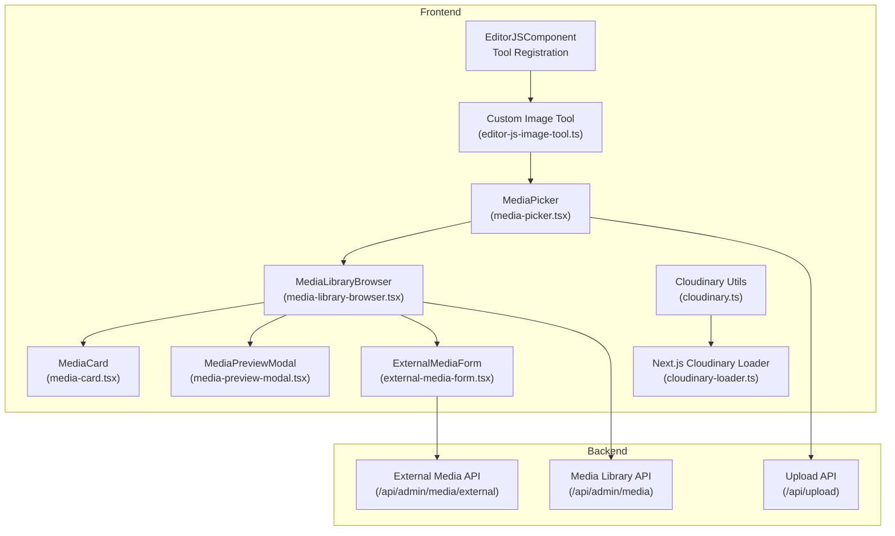
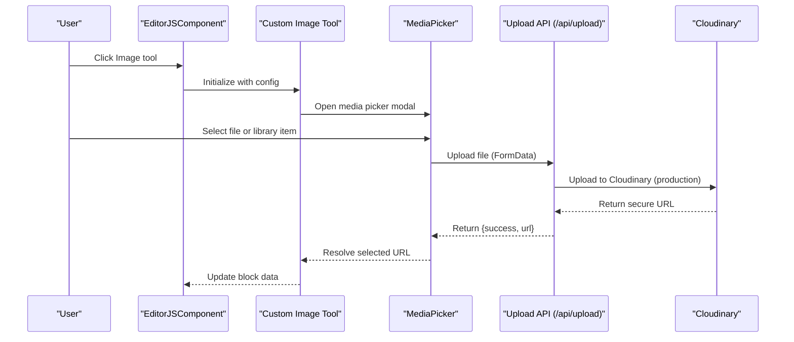
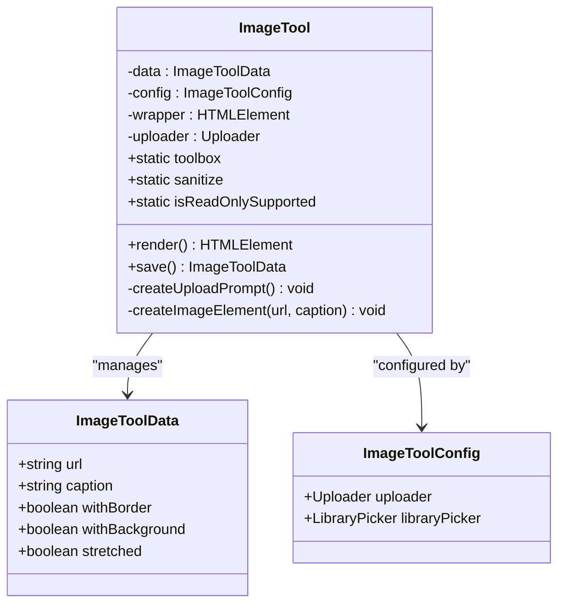
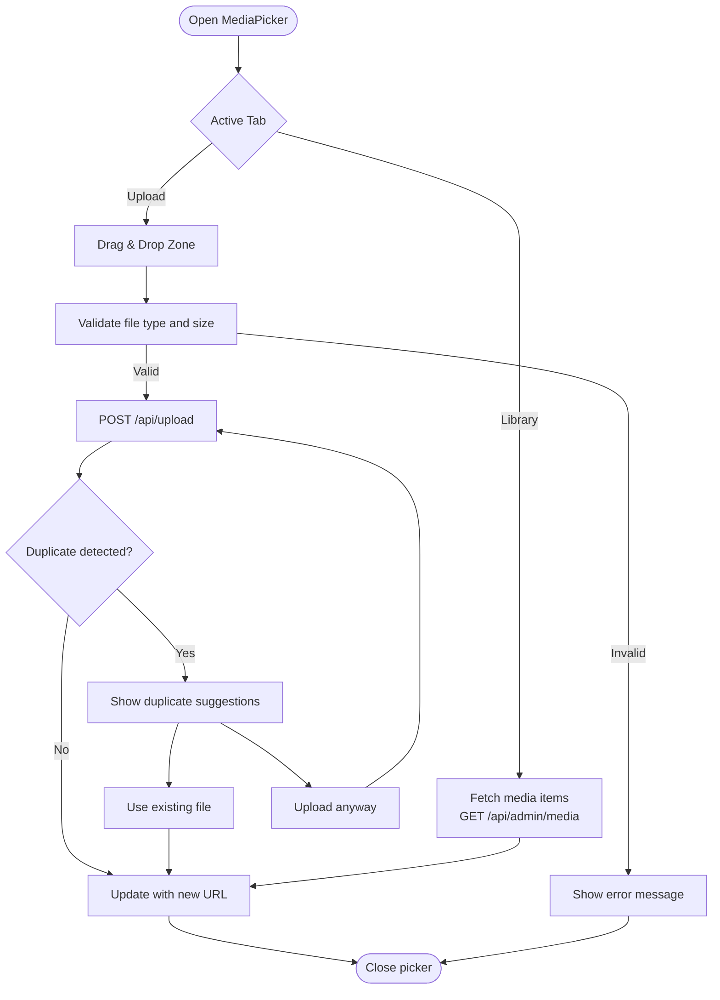
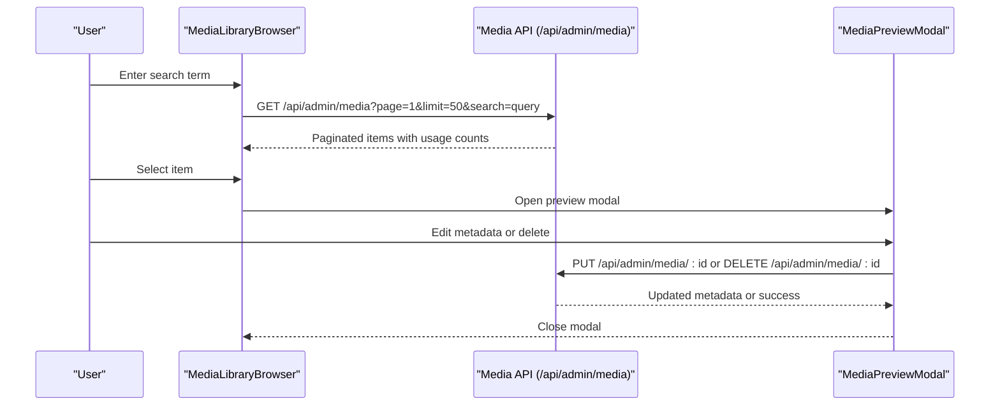
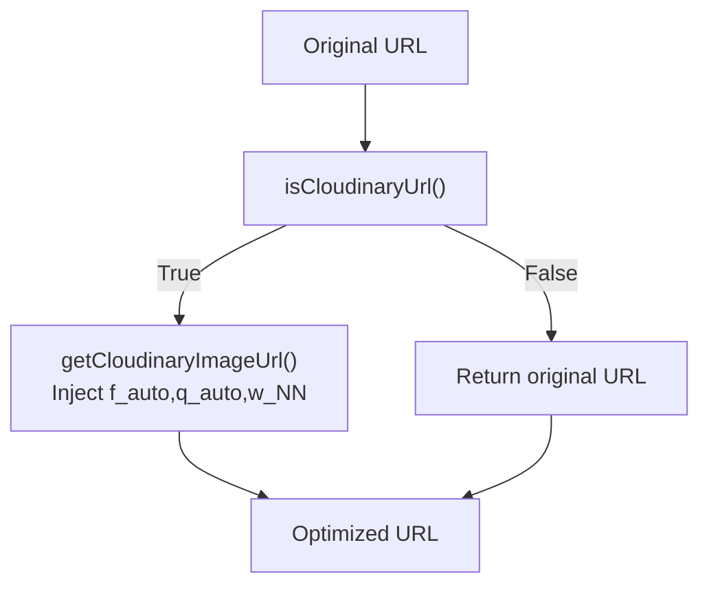
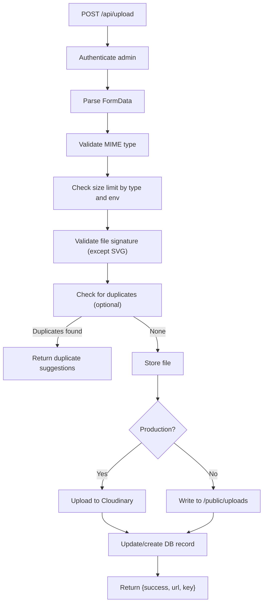
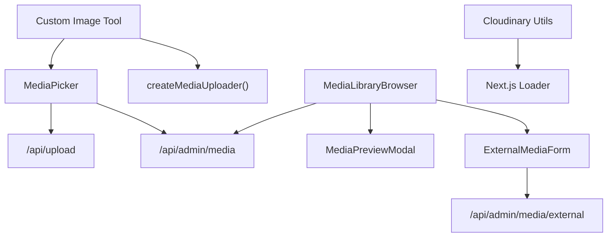

# Image Tool Implementation

<cite>
**Referenced Files in This Document**
- [editor-js-image-tool.ts](file://src/components/editor-js-image-tool.ts)
- [cloudinary.ts](file://src/lib/cloudinary.ts)
- [cloudinary-loader.ts](file://src/lib/cloudinary-loader.ts)
- [media-picker.tsx](file://src/components/media-picker.tsx)
- [media-library-browser.tsx](file://src/components/media-library-browser.tsx)
- [media-card.tsx](file://src/components/media-card.tsx)
- [media-preview-modal.tsx](file://src/components/media-preview-modal.tsx)
- [external-media-form.tsx](file://src/components/external-media-form.tsx)
- [upload/route.ts](file://src/app/api/upload/route.ts)
- [media/route.ts](file://src/app/api/admin/media/route.ts)
- [media-external/route.ts](file://src/app/api/admin/media/external/route.ts)
- [editor-js.tsx](file://src/components/editor-js.tsx)
</cite>

## Table of Contents
1. [Introduction](#introduction)
2. [Project Structure](#project-structure)
3. [Core Components](#core-components)
4. [Architecture Overview](#architecture-overview)
5. [Detailed Component Analysis](#detailed-component-analysis)
6. [Dependency Analysis](#dependency-analysis)
7. [Performance Considerations](#performance-considerations)
8. [Troubleshooting Guide](#troubleshooting-guide)
9. [Conclusion](#conclusion)

## Introduction
This document provides comprehensive technical documentation for the Editor.js Image Tool implementation within the GreenAxis project. It covers the custom image tool architecture, upload handler integration, media picker functionality, configuration options, validation rules, supported formats, size limitations, Cloudinary optimization integration, and the media library browser for existing asset selection. It also explains drag-and-drop functionality, alt text handling, responsive image display, and provides practical examples for tool registration, configuration patterns, and custom event handling.

## Project Structure
The Image Tool implementation spans several React components and Next.js API routes:
- Frontend tool implementation: Custom Editor.js Image Tool
- Media picker and library browser: Unified media selection UI
- Cloudinary utilities: URL optimization and Next.js loader
- Backend upload handlers: File validation, storage, and metadata management
- Editor.js integration: Tool registration and configuration

**Diagram sources**
- [editor-js.tsx:438-449](file://src/components/editor-js.tsx#L438-L449)
- [editor-js-image-tool.ts:21-59](file://src/components/editor-js-image-tool.ts#L21-L59)
- [media-picker.tsx:106-118](file://src/components/media-picker.tsx#L106-L118)
- [media-library-browser.tsx:69-75](file://src/components/media-library-browser.tsx#L69-L75)
- [media-card.tsx:103-110](file://src/components/media-card.tsx#L103-L110)
- [media-preview-modal.tsx:97-103](file://src/components/media-preview-modal.tsx#L97-L103)
- [external-media-form.tsx:59-66](file://src/components/external-media-form.tsx#L59-L66)
- [cloudinary.ts:32-83](file://src/lib/cloudinary.ts#L32-L83)
- [cloudinary-loader.ts:10-58](file://src/lib/cloudinary-loader.ts#L10-L58)
- [upload/route.ts:150-392](file://src/app/api/upload/route.ts#L150-L392)
- [media/route.ts:37-149](file://src/app/api/admin/media/route.ts#L37-L149)
- [media-external/route.ts:16-114](file://src/app/api/admin/media/external/route.ts#L16-L114)

**Section sources**
- [editor-js.tsx:438-449](file://src/components/editor-js.tsx#L438-L449)
- [editor-js-image-tool.ts:21-59](file://src/components/editor-js-image-tool.ts#L21-L59)
- [media-picker.tsx:106-118](file://src/components/media-picker.tsx#L106-L118)
- [media-library-browser.tsx:69-75](file://src/components/media-library-browser.tsx#L69-L75)
- [media-card.tsx:103-110](file://src/components/media-card.tsx#L103-L110)
- [media-preview-modal.tsx:97-103](file://src/components/media-preview-modal.tsx#L97-L103)
- [external-media-form.tsx:59-66](file://src/components/external-media-form.tsx#L59-L66)
- [cloudinary.ts:32-83](file://src/lib/cloudinary.ts#L32-L83)
- [cloudinary-loader.ts:10-58](file://src/lib/cloudinary-loader.ts#L10-L58)
- [upload/route.ts:150-392](file://src/app/api/upload/route.ts#L150-L392)
- [media/route.ts:37-149](file://src/app/api/admin/media/route.ts#L37-L149)
- [media-external/route.ts:16-114](file://src/app/api/admin/media/external/route.ts#L16-L114)

## Core Components
This section outlines the primary components involved in the Image Tool implementation and their roles.

- Custom Image Tool (editor-js-image-tool.ts)
  - Provides a custom Editor.js tool for images with upload prompt, drag-and-drop, and library picker integration.
  - Manages data persistence via the save() method and sanitization rules.
  - Supports dark mode styling and responsive image rendering.

- Media Picker (media-picker.tsx)
  - Unified component for selecting media from library or uploading new files.
  - Supports images, videos, and audio with drag-and-drop upload, progress tracking, and duplicate detection.
  - Integrates with the backend upload endpoint and media library API.

- Media Library Browser (media-library-browser.tsx)
  - Displays and manages the media library with search, filtering, pagination, and preview capabilities.
  - Implements infinite scroll and category filtering for efficient browsing.

- Media Card (media-card.tsx)
  - Reusable card component for displaying media items with hover actions, usage badges, and lazy loading.

- Media Preview Modal (media-preview-modal.tsx)
  - Modal for previewing and editing media details, including metadata, usage locations, and deletion.

- External Media Form (external-media-form.tsx)
  - Allows registering external media URLs into the library with validation and categorization.

- Cloudinary Utilities (cloudinary.ts, cloudinary-loader.ts)
  - Provides URL transformation helpers and Next.js loader for automatic optimization.

- Upload API (upload/route.ts)
  - Validates file types and sizes, handles production vs development storage, and integrates with Cloudinary.

- Media Library API (media/route.ts)
  - Lists media with pagination, filtering, and usage count calculation.

- External Media API (media-external/route.ts)
  - Registers external URLs into the media library.

**Section sources**
- [editor-js-image-tool.ts:21-59](file://src/components/editor-js-image-tool.ts#L21-L59)
- [media-picker.tsx:106-118](file://src/components/media-picker.tsx#L106-L118)
- [media-library-browser.tsx:69-75](file://src/components/media-library-browser.tsx#L69-L75)
- [media-card.tsx:103-110](file://src/components/media-card.tsx#L103-L110)
- [media-preview-modal.tsx:97-103](file://src/components/media-preview-modal.tsx#L97-L103)
- [external-media-form.tsx:59-66](file://src/components/external-media-form.tsx#L59-L66)
- [cloudinary.ts:32-83](file://src/lib/cloudinary.ts#L32-L83)
- [cloudinary-loader.ts:10-58](file://src/lib/cloudinary-loader.ts#L10-L58)
- [upload/route.ts:150-392](file://src/app/api/upload/route.ts#L150-L392)
- [media/route.ts:37-149](file://src/app/api/admin/media/route.ts#L37-L149)
- [media-external/route.ts:16-114](file://src/app/api/admin/media/external/route.ts#L16-L114)

## Architecture Overview
The Image Tool integrates with the Editor.js framework and leverages a media picker for uploads and library selection. The backend handles file validation, storage, and metadata management, while Cloudinary optimizes image delivery.

**Diagram sources**
- [editor-js.tsx:438-449](file://src/components/editor-js.tsx#L438-L449)
- [editor-js-image-tool.ts:21-59](file://src/components/editor-js-image-tool.ts#L21-L59)
- [media-picker.tsx:201-316](file://src/components/media-picker.tsx#L201-L316)
- [upload/route.ts:150-392](file://src/app/api/upload/route.ts#L150-L392)

**Section sources**
- [editor-js.tsx:438-449](file://src/components/editor-js.tsx#L438-L449)
- [editor-js-image-tool.ts:21-59](file://src/components/editor-js-image-tool.ts#L21-L59)
- [media-picker.tsx:201-316](file://src/components/media-picker.tsx#L201-L316)
- [upload/route.ts:150-392](file://src/app/api/upload/route.ts#L150-L392)

## Detailed Component Analysis

### Custom Image Tool (editor-js-image-tool.ts)
The custom Image Tool extends Editor.js with:
- Toolbox configuration with icon and title
- Sanitization rules for safe data persistence
- Render method with upload prompt and image display
- Drag-and-drop support with visual feedback
- Library picker integration for existing assets
- Alt text handling via caption input bound to img.alt

Key behaviors:
- Accepts image formats: PNG, JPEG, WebP, GIF, SVG
- Enforces 10MB file size limit for uploads
- Uses uploader.uploadByFile(file) for backend integration
- Supports dark mode styling for all interactive elements
- Responsive image display with max-width constraints

**Diagram sources**
- [editor-js-image-tool.ts:13-19](file://src/components/editor-js-image-tool.ts#L13-L19)
- [editor-js-image-tool.ts:3-11](file://src/components/editor-js-image-tool.ts#L3-L11)
- [editor-js-image-tool.ts:21-59](file://src/components/editor-js-image-tool.ts#L21-L59)

**Section sources**
- [editor-js-image-tool.ts:21-59](file://src/components/editor-js-image-tool.ts#L21-L59)
- [editor-js-image-tool.ts:61-344](file://src/components/editor-js-image-tool.ts#L61-L344)

### Media Picker (media-picker.tsx)
The Media Picker provides:
- Tabbed interface for library browsing and new uploads
- Drag-and-drop zone with visual feedback
- Progress tracking during uploads
- Duplicate detection with suggestion dialog
- Accept attribute generation based on type ('image' | 'video' | 'audio' | 'all')
- Size limits per type and environment (development vs production)

**Diagram sources**
- [media-picker.tsx:149-196](file://src/components/media-picker.tsx#L149-L196)
- [media-picker.tsx:201-316](file://src/components/media-picker.tsx#L201-L316)
- [media-picker.tsx:334-384](file://src/components/media-picker.tsx#L334-L384)
- [media/route.ts:37-149](file://src/app/api/admin/media/route.ts#L37-L149)
- [upload/route.ts:150-392](file://src/app/api/upload/route.ts#L150-L392)

**Section sources**
- [media-picker.tsx:106-118](file://src/components/media-picker.tsx#L106-L118)
- [media-picker.tsx:149-196](file://src/components/media-picker.tsx#L149-L196)
- [media-picker.tsx:201-316](file://src/components/media-picker.tsx#L201-L316)
- [media-picker.tsx:334-384](file://src/components/media-picker.tsx#L334-L384)

### Media Library Browser (media-library-browser.tsx)
The Media Library Browser offers:
- Infinite scroll pagination (50 items per page)
- Debounced search by label
- Category filtering with predefined categories
- Grid layout with responsive columns
- Lazy loading for images
- Preview modal for detailed editing
- External media registration

**Diagram sources**
- [media-library-browser.tsx:97-136](file://src/components/media-library-browser.tsx#L97-L136)
- [media-library-browser.tsx:151-173](file://src/components/media-library-browser.tsx#L151-L173)
- [media-library-browser.tsx:209-211](file://src/components/media-library-browser.tsx#L209-L211)
- [media/route.ts:37-149](file://src/app/api/admin/media/route.ts#L37-L149)
- [media-preview-modal.tsx:177-215](file://src/components/media-preview-modal.tsx#L177-L215)

**Section sources**
- [media-library-browser.tsx:69-75](file://src/components/media-library-browser.tsx#L69-L75)
- [media-library-browser.tsx:97-136](file://src/components/media-library-browser.tsx#L97-L136)
- [media-library-browser.tsx:151-173](file://src/components/media-library-browser.tsx#L151-L173)
- [media-library-browser.tsx:209-211](file://src/components/media-library-browser.tsx#L209-L211)

### Cloudinary Integration
Cloudinary utilities provide:
- URL validation for Cloudinary-hosted resources
- Transformation injection for automatic optimization (format, quality, width)
- Preset helpers for common use cases (hero, thumbnail, service, admin thumbnail)
- Next.js loader integration for responsive images

**Diagram sources**
- [cloudinary.ts:11-13](file://src/lib/cloudinary.ts#L11-L13)
- [cloudinary.ts:32-83](file://src/lib/cloudinary.ts#L32-L83)
- [cloudinary-loader.ts:10-58](file://src/lib/cloudinary-loader.ts#L10-L58)

**Section sources**
- [cloudinary.ts:11-13](file://src/lib/cloudinary.ts#L11-L13)
- [cloudinary.ts:32-83](file://src/lib/cloudinary.ts#L32-L83)
- [cloudinary.ts:92-119](file://src/lib/cloudinary.ts#L92-L119)
- [cloudinary-loader.ts:10-58](file://src/lib/cloudinary-loader.ts#L10-L58)

### Upload Handler Integration
The upload handler validates files, determines appropriate size limits based on environment and type, and stores files either to Cloudinary (production) or the local filesystem (development). It also handles duplicate detection and metadata updates.

**Diagram sources**
- [upload/route.ts:150-392](file://src/app/api/upload/route.ts#L150-L392)

**Section sources**
- [upload/route.ts:150-392](file://src/app/api/upload/route.ts#L150-L392)

## Dependency Analysis
The Image Tool relies on several interconnected components and APIs. The following diagram illustrates key dependencies:

**Diagram sources**
- [editor-js.tsx:185-227](file://src/components/editor-js.tsx#L185-L227)
- [media-picker.tsx:201-316](file://src/components/media-picker.tsx#L201-L316)
- [media-library-browser.tsx:97-136](file://src/components/media-library-browser.tsx#L97-L136)
- [media-preview-modal.tsx:177-215](file://src/components/media-preview-modal.tsx#L177-L215)
- [external-media-form.tsx:111-156](file://src/components/external-media-form.tsx#L111-L156)
- [cloudinary.ts:32-83](file://src/lib/cloudinary.ts#L32-L83)
- [cloudinary-loader.ts:10-58](file://src/lib/cloudinary-loader.ts#L10-L58)

**Section sources**
- [editor-js.tsx:185-227](file://src/components/editor-js.tsx#L185-L227)
- [media-picker.tsx:201-316](file://src/components/media-picker.tsx#L201-L316)
- [media-library-browser.tsx:97-136](file://src/components/media-library-browser.tsx#L97-L136)
- [media-preview-modal.tsx:177-215](file://src/components/media-preview-modal.tsx#L177-L215)
- [external-media-form.tsx:111-156](file://src/components/external-media-form.tsx#L111-L156)
- [cloudinary.ts:32-83](file://src/lib/cloudinary.ts#L32-L83)
- [cloudinary-loader.ts:10-58](file://src/lib/cloudinary-loader.ts#L10-L58)

## Performance Considerations
- Cloudinary optimization: Automatic format, quality, and width transformations reduce payload sizes and improve loading performance.
- Next.js loader: Generates responsive srcsets for optimal image delivery across devices.
- Infinite scroll: Media library uses intersection observer for efficient loading of large collections.
- Lazy loading: Images in media cards use native lazy loading to minimize initial page weight.
- Environment-specific limits: Production enforces stricter size limits to maintain performance and cost control.

[No sources needed since this section provides general guidance]

## Troubleshooting Guide
Common issues and resolutions:
- File type not allowed: Ensure the file MIME type matches allowed types (images: JPEG, PNG, WebP, GIF, SVG; videos: MP4, WebM, MOV; audio: MP3, WAV, OGG, M4A).
- File too large: Check environment-specific size limits and consider uploading directly to Cloudinary for large files.
- Duplicate detection: Use the suggested existing files or bypass with the "upload anyway" option.
- Cloudinary upload failures: Verify Cloudinary credentials and network connectivity.
- Media library not loading: Confirm API endpoints are reachable and authentication is valid.

**Section sources**
- [upload/route.ts:170-200](file://src/app/api/upload/route.ts#L170-L200)
- [media-picker.tsx:201-316](file://src/components/media-picker.tsx#L201-L316)
- [media/route.ts:37-149](file://src/app/api/admin/media/route.ts#L37-L149)

## Conclusion
The Editor.js Image Tool implementation provides a robust, user-friendly solution for image management within the GreenAxis CMS. It combines a custom tool with a comprehensive media picker, library browser, and backend upload handlers, all integrated with Cloudinary for optimal performance. The system supports drag-and-drop uploads, library selection, responsive image display, and extensive customization through configuration options and event handling.