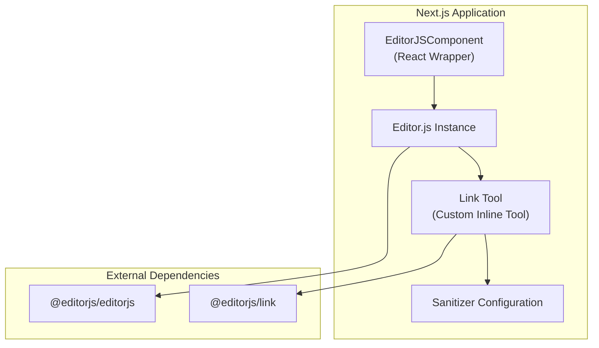
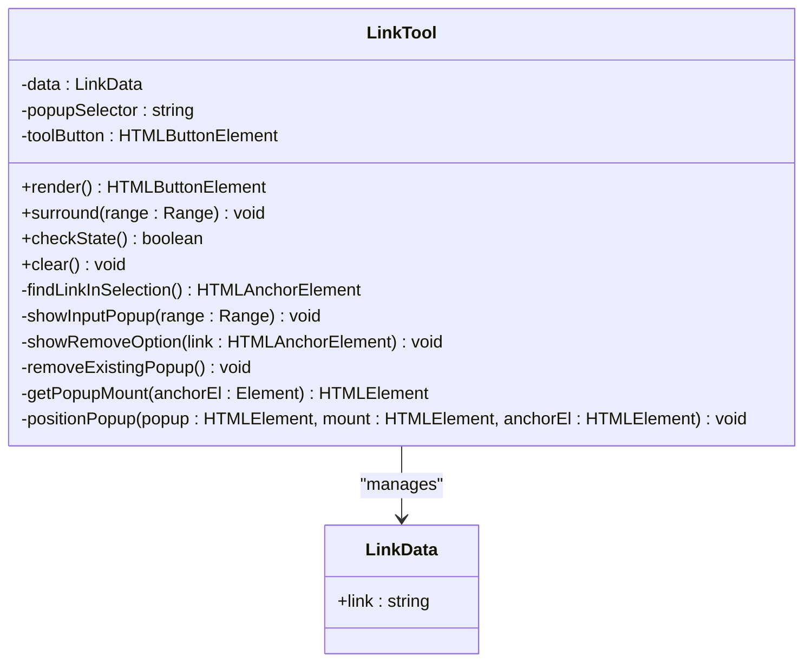
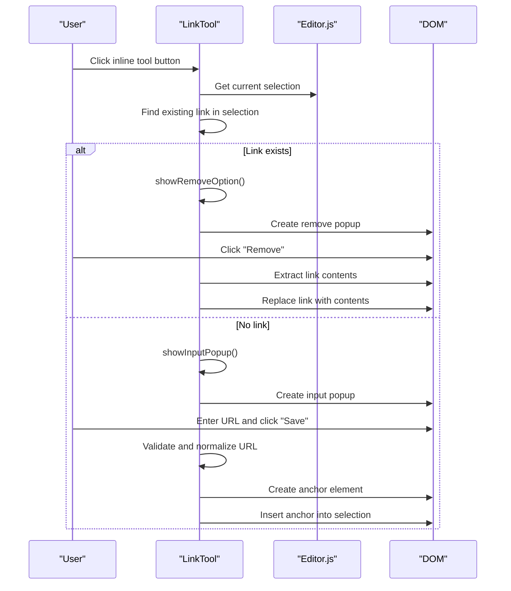
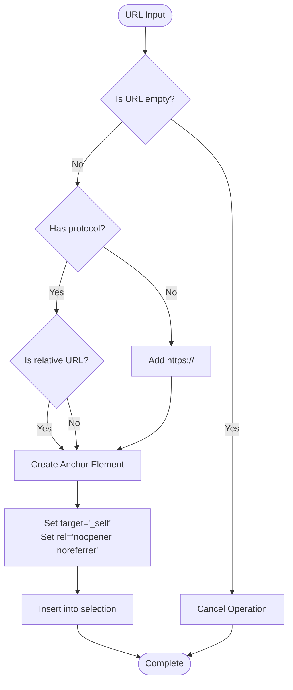
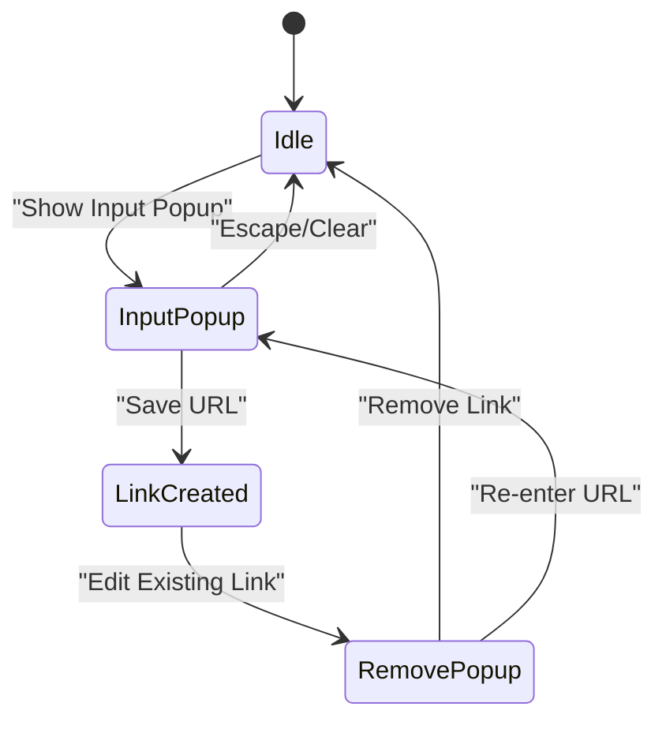
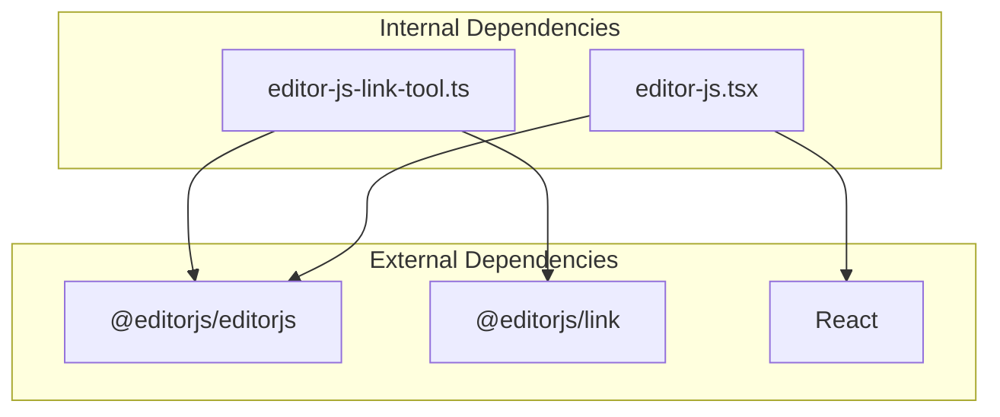

# Link Tool Implementation

<cite>
**Referenced Files in This Document**
- [editor-js-link-tool.ts](file://src/components/editor-js-link-tool.ts)
- [editor-js.tsx](file://src/components/editor-js.tsx)
- [editorjs-i18n.json](file://editorjs-i18n.json)
</cite>

## Table of Contents
1. [Introduction](#introduction)
2. [Project Structure](#project-structure)
3. [Core Components](#core-components)
4. [Architecture Overview](#architecture-overview)
5. [Detailed Component Analysis](#detailed-component-analysis)
6. [Dependency Analysis](#dependency-analysis)
7. [Performance Considerations](#performance-considerations)
8. [Troubleshooting Guide](#troubleshooting-guide)
9. [Conclusion](#conclusion)

## Introduction
This document provides comprehensive technical documentation for the Editor.js Link Tool implementation used in the content management system. The Link Tool enables users to create, edit, and remove hyperlinks within the Editor.js rich text editor. It includes functionality for URL validation, target attribute configuration, integration with internal routing, external link handling, and anchor navigation. The implementation also covers link preview capabilities, title customization, and accessibility features such as proper semantic markup and keyboard navigation.

## Project Structure
The Link Tool is implemented as a custom inline tool for Editor.js and integrates with the Next.js application through a dedicated React component wrapper. The tool is registered within the Editor.js configuration and leverages Editor.js's inline toolbar and sanitization APIs.

**Diagram sources**
- [editor-js.tsx:389-390](file://src/components/editor-js.tsx#L389-L390)
- [editor-js.tsx:512-515](file://src/components/editor-js.tsx#L512-L515)

**Section sources**
- [editor-js.tsx:344-575](file://src/components/editor-js.tsx#L344-L575)

## Core Components
The Link Tool implementation consists of a single TypeScript class that adheres to Editor.js's inline tool interface. It manages the creation and editing of links through a custom popup UI, handles URL normalization, applies security attributes, and integrates with Editor.js's selection and DOM manipulation APIs.

Key responsibilities:
- Render the inline tool button in the Editor.js toolbar
- Display a contextual popup for URL input when text is selected
- Validate and normalize URLs (adding protocol if missing)
- Insert anchor elements with appropriate security attributes
- Support removal of existing links
- Integrate with Editor.js sanitization configuration

**Section sources**
- [editor-js-link-tool.ts:7-402](file://src/components/editor-js-link-tool.ts#L7-L402)

## Architecture Overview
The Link Tool follows Editor.js's inline tool pattern, implementing required lifecycle methods and leveraging the editor's selection and DOM APIs. The tool maintains its own state for link data and manages a custom popup overlay positioned relative to the inline toolbar.

**Diagram sources**
- [editor-js-link-tool.ts:3-36](file://src/components/editor-js-link-tool.ts#L3-L36)
- [editor-js-link-tool.ts:7-402](file://src/components/editor-js-link-tool.ts#L7-L402)

**Section sources**
- [editor-js-link-tool.ts:7-402](file://src/components/editor-js-link-tool.ts#L7-L402)

## Detailed Component Analysis

### Link Tool Class Implementation
The Link Tool class implements Editor.js's inline tool interface with the following key methods:

#### Static Properties
- `isInline`: Indicates this is an inline tool
- `title`: Tool name displayed in tooltips
- `icon`: SVG icon for the toolbar button
- `sanitize`: Defines allowed attributes for anchor elements

#### Instance Methods
- `render()`: Creates and returns the toolbar button element
- `surround(range)`: Handles user interaction when text is selected
- `checkState()`: Determines if the current selection contains a link
- `clear()`: Resets internal state

#### Popup Management
The tool creates two types of popup overlays:
1. **Input Popup**: For creating new links with URL input
2. **Remove Popup**: For editing/removing existing links

**Diagram sources**
- [editor-js-link-tool.ts:48-282](file://src/components/editor-js-link-tool.ts#L48-L282)
- [editor-js-link-tool.ts:284-390](file://src/components/editor-js-link-tool.ts#L284-L390)

**Section sources**
- [editor-js-link-tool.ts:38-402](file://src/components/editor-js-link-tool.ts#L38-L402)

### URL Validation and Normalization
The Link Tool implements robust URL validation and normalization:

#### URL Detection Logic
- Accepts absolute URLs (with protocols)
- Accepts relative URLs (starting with "/")
- Automatically prepends "https://" to URLs without protocols
- Validates non-empty input before processing

#### Security Attributes
All created links receive:
- `target="_self"` for internal navigation
- `rel="noopener noreferrer"` for security compliance
- Custom styling for visual consistency

**Diagram sources**
- [editor-js-link-tool.ts:196-230](file://src/components/editor-js-link-tool.ts#L196-L230)

**Section sources**
- [editor-js-link-tool.ts:196-230](file://src/components/editor-js-link-tool.ts#L196-L230)

### Popup UI and User Interaction
The Link Tool provides two distinct popup interfaces:

#### Input Popup Features
- URL input field with placeholder text
- Save button with hover effects
- Keyboard shortcuts (Enter to save, Escape to cancel)
- Automatic focus management
- Dark mode theme support

#### Remove Popup Features
- Displays current link URL (truncated if long)
- Remove button with hover effects
- Immediate link removal functionality

**Diagram sources**
- [editor-js-link-tool.ts:105-282](file://src/components/editor-js-link-tool.ts#L105-L282)
- [editor-js-link-tool.ts:284-390](file://src/components/editor-js-link-tool.ts#L284-L390)

**Section sources**
- [editor-js-link-tool.ts:105-282](file://src/components/editor-js-link-tool.ts#L105-L282)
- [editor-js-link-tool.ts:284-390](file://src/components/editor-js-link-tool.ts#L284-L390)

### Integration with Editor.js Configuration
The Link Tool is integrated into the Editor.js instance through the React wrapper component:

#### Registration Process
- Dynamically imports the Link Tool module
- Registers the tool in the Editor.js tools configuration
- Enables inline toolbar for the Link Tool
- Provides internationalization support

#### Configuration Options
- Inline toolbar activation
- Tool name and icon configuration
- Sanitization rules definition
- Event handling for save operations

**Section sources**
- [editor-js.tsx:389-390](file://src/components/editor-js.tsx#L389-L390)
- [editor-js.tsx:512-515](file://src/components/editor-js.tsx#L512-L515)

### Accessibility and Internationalization
The Link Tool implementation includes several accessibility and internationalization features:

#### Accessibility Features
- Proper semantic HTML structure
- Keyboard navigation support
- Focus management for popup elements
- Screen reader friendly labels
- Color contrast compliance for dark/light modes

#### Internationalization Support
- Spanish language UI text
- Configurable tool names and messages
- RTL language support
- Dynamic theme adaptation

**Section sources**
- [editor-js.tsx:16-167](file://src/components/editor-js.tsx#L16-L167)
- [editorjs-i18n.json:1-31](file://editorjs-i18n.json#L1-L31)

## Dependency Analysis
The Link Tool has minimal external dependencies and integrates cleanly with the Editor.js ecosystem:

**Diagram sources**
- [editor-js.tsx:382-390](file://src/components/editor-js.tsx#L382-L390)

**Section sources**
- [editor-js.tsx:382-390](file://src/components/editor-js.tsx#L382-L390)

## Performance Considerations
The Link Tool implementation is designed for optimal performance:

- **Minimal DOM Manipulation**: Uses efficient DOM APIs for selection and insertion
- **Event Delegation**: Leverages event bubbling to minimize listener overhead
- **Lazy Loading**: Tool is dynamically imported only when needed
- **Memory Management**: Proper cleanup of event listeners and DOM elements
- **Theme Adaptation**: Efficient CSS class switching for dark/light mode

## Troubleshooting Guide

### Common Issues and Solutions

#### Link Creation Problems
- **Issue**: Links not being created properly
- **Solution**: Verify URL format and ensure non-empty input
- **Debug**: Check console for any JavaScript errors during popup creation

#### Popup Positioning Issues
- **Issue**: Popup appears in incorrect location
- **Solution**: Ensure proper mounting element and scroll container detection
- **Debug**: Verify `getPopupMount()` and `positionPopup()` methods

#### Security Attribute Problems
- **Issue**: Links missing security attributes
- **Solution**: Confirm sanitizer configuration includes required attributes
- **Debug**: Check `sanitize` property definition

#### Theme Compatibility
- **Issue**: Popup styling conflicts with dark mode
- **Solution**: Verify theme class detection and CSS variable usage
- **Debug**: Check `document.documentElement.classList.contains('dark')` logic

**Section sources**
- [editor-js-link-tool.ts:60-90](file://src/components/editor-js-link-tool.ts#L60-L90)
- [editor-js-link-tool.ts:249-282](file://src/components/editor-js-link-tool.ts#L249-L282)

## Conclusion
The Editor.js Link Tool implementation provides a robust, accessible, and user-friendly solution for hyperlink management within the content management system. Its clean architecture, comprehensive validation logic, and seamless integration with Editor.js make it a reliable component for content creators. The tool's emphasis on security, internationalization, and performance ensures it meets modern web standards while maintaining ease of use.

Key strengths of the implementation include:
- Secure URL handling with automatic protocol normalization
- Comprehensive popup UI with keyboard navigation support
- Dark/light mode compatibility
- Clean separation of concerns and maintainable code structure
- Extensive internationalization support
- Proper accessibility compliance

The Link Tool serves as an excellent foundation for further enhancements, such as link preview functionality, custom validation rules, and integration with the CMS's URL structure.