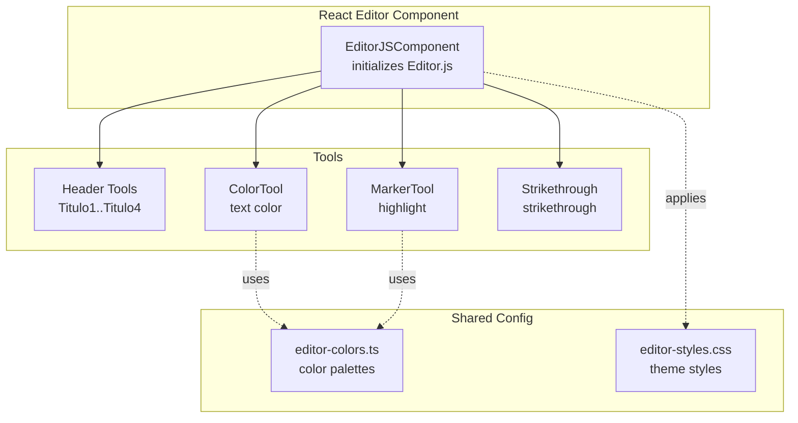
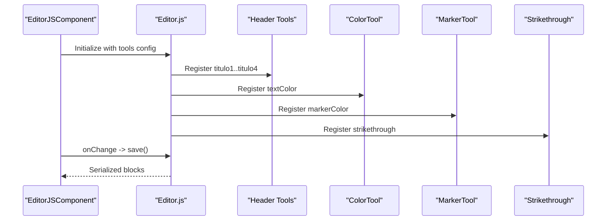
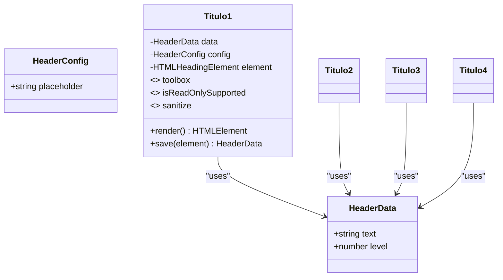
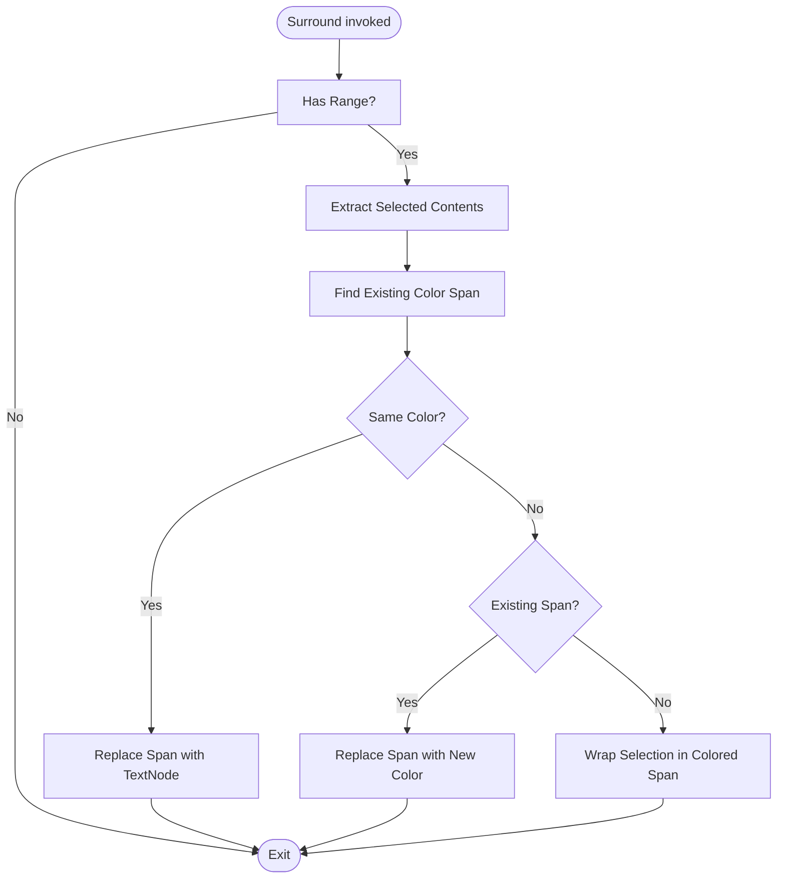
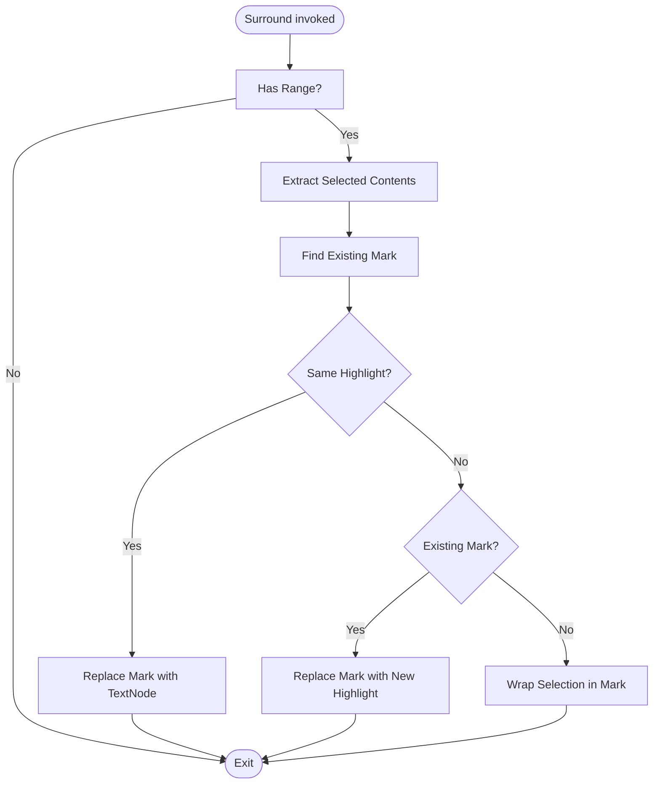
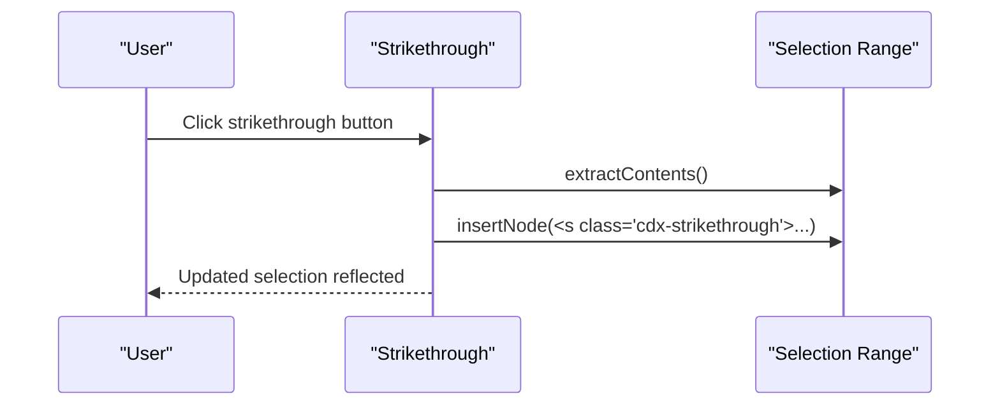
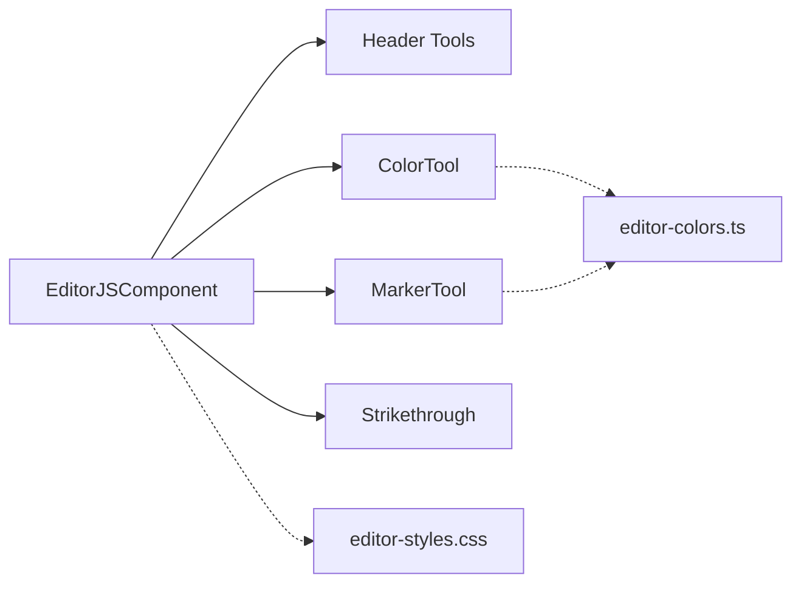

# Text Formatting Tools

<cite>
**Referenced Files in This Document**
- [editor-js-header-tools.ts](file://src/components/editor-js-header-tools.ts)
- [editor-js-color-tool.ts](file://src/components/editor-js-color-tool.ts)
- [editor-js-marker-tool.ts](file://src/components/editor-js-marker-tool.ts)
- [editor-js-strikethrough-tool.ts](file://src/components/editor-js-strikethrough-tool.ts)
- [editor-colors.ts](file://src/components/editor-colors.ts)
- [editor-js.tsx](file://src/components/editor-js.tsx)
- [editor-styles.css](file://src/app/editor-styles.css)
- [package.json](file://package.json)
</cite>

## Table of Contents
1. [Introduction](#introduction)
2. [Project Structure](#project-structure)
3. [Core Components](#core-components)
4. [Architecture Overview](#architecture-overview)
5. [Detailed Component Analysis](#detailed-component-analysis)
6. [Dependency Analysis](#dependency-analysis)
7. [Performance Considerations](#performance-considerations)
8. [Troubleshooting Guide](#troubleshooting-guide)
9. [Conclusion](#conclusion)
10. [Appendices](#appendices)

## Introduction
This document explains the text formatting tools integrated into the Editor.js-based rich text editor. It covers:
- Header tools (level-based formatting)
- Color tool (text highlighting)
- Marker tool (inline annotation highlights)
- Strikethrough tool (text deletion formatting)

It details the tool architecture, configuration patterns, integration with the Editor.js core, customization options, styling approaches, and serialization behavior. It also provides examples of tool registration and advanced formatting workflows.

## Project Structure
The formatting tools are implemented as standalone Editor.js tools and integrated into a React component that initializes Editor.js with a curated set of tools. Styles are centralized in a dedicated stylesheet.

**Diagram sources**
- [editor-js.tsx:344-575](file://src/components/editor-js.tsx#L344-L575)
- [editor-js-header-tools.ts:1-212](file://src/components/editor-js-header-tools.ts#L1-L212)
- [editor-js-color-tool.ts:1-178](file://src/components/editor-js-color-tool.ts#L1-L178)
- [editor-js-marker-tool.ts:1-183](file://src/components/editor-js-marker-tool.ts#L1-L183)
- [editor-js-strikethrough-tool.ts:1-64](file://src/components/editor-js-strikethrough-tool.ts#L1-L64)
- [editor-colors.ts:1-50](file://src/components/editor-colors.ts#L1-L50)
- [editor-styles.css:1-250](file://src/app/editor-styles.css#L1-L250)

**Section sources**
- [editor-js.tsx:344-575](file://src/components/editor-js.tsx#L344-L575)
- [editor-styles.css:1-250](file://src/app/editor-styles.css#L1-L250)

## Core Components
- Header Tools: Four separate classes (Titulo1..Titulo4) each rendering a distinct heading level with shared configuration and sanitization rules.
- Color Tool: Inline tool that applies text color via a span with a dedicated CSS class and supports removing format on double-click.
- Marker Tool: Inline tool that applies highlight via a mark element with a dedicated CSS class and supports removing format on double-click.
- Strikethrough Tool: Inline tool that wraps selected text with an s element and checks current state based on selection context.

Each tool adheres to Editor.js conventions:
- Static metadata (title, icon, sanitize)
- Methods: render, surround, checkState, clear
- Inline tools define isInline = true

**Section sources**
- [editor-js-header-tools.ts:4-212](file://src/components/editor-js-header-tools.ts#L4-L212)
- [editor-js-color-tool.ts:13-178](file://src/components/editor-js-color-tool.ts#L13-L178)
- [editor-js-marker-tool.ts:13-183](file://src/components/editor-js-marker-tool.ts#L13-L183)
- [editor-js-strikethrough-tool.ts:4-64](file://src/components/editor-js-strikethrough-tool.ts#L4-L64)

## Architecture Overview
The Editor.js component dynamically imports tools and registers them with Editor.js. Tools are configured with optional color palettes and inline toolbar support where applicable. Serialization is handled by Editor.js; tools provide sanitization rules and DOM manipulation via surround.

**Diagram sources**
- [editor-js.tsx:380-531](file://src/components/editor-js.tsx#L380-L531)

**Section sources**
- [editor-js.tsx:380-531](file://src/components/editor-js.tsx#L380-L531)

## Detailed Component Analysis

### Header Tools (Level-Based Formatting)
- Purpose: Provide four distinct header blocks (H1–H4) with placeholder-driven editing and content sanitization.
- Implementation highlights:
  - Each class defines toolbox metadata, sanitize rules, and a render method that creates a heading element with a contenteditable area and placeholder attribute.
  - save returns the inner HTML and the level constant.
  - Placeholder defaults are localized and configurable per tool instance.
- Integration:
  - Registered individually under keys "titulo1" through "titulo4" with inlineToolbar enabled.
- Serialization:
  - Editor.js saves blocks with type "titulo1".."titulo4" and a data object containing text and level.

**Diagram sources**
- [editor-js-header-tools.ts:4-212](file://src/components/editor-js-header-tools.ts#L4-L212)

**Section sources**
- [editor-js-header-tools.ts:14-212](file://src/components/editor-js-header-tools.ts#L14-L212)
- [editor-js.tsx:406-422](file://src/components/editor-js.tsx#L406-L422)

### Color Tool (Text Highlighting)
- Purpose: Allow users to select a predefined color palette and apply it to selected text via a span with a dedicated CSS class.
- Implementation highlights:
  - Renders a grid of color swatches; clicking a swatch updates internal data and dispatches a custom event.
  - surround extracts the selected contents, checks for existing colored spans, replaces or removes formatting as needed.
  - handleDblClick removes existing color formatting when double-clicking a colored selection.
  - checkState determines if the current selection is wrapped in the color class.
- Configuration:
  - Accepts colors and defaultColor via config; defaults to a curated palette.
  - Uses a centralized color list from editor-colors.ts.
- Serialization:
  - sanitize allows span with the tool’s CSS class and style attributes.

**Diagram sources**
- [editor-js-color-tool.ts:102-144](file://src/components/editor-js-color-tool.ts#L102-L144)

**Section sources**
- [editor-js-color-tool.ts:13-178](file://src/components/editor-js-color-tool.ts#L13-L178)
- [editor-colors.ts:17-28](file://src/components/editor-colors.ts#L17-L28)
- [editor-js.tsx:506-511](file://src/components/editor-js.tsx#L506-L511)

### Marker Tool (Inline Annotations)
- Purpose: Provide highlight colors for selected text via a mark element with a dedicated CSS class.
- Implementation highlights:
  - Renders a grid of semi-transparent highlight swatches; clicking selects a highlight color and dispatches a custom event.
  - surround manages replacing or toggling highlight formatting on the selection.
  - handleDblClick removes existing highlight formatting.
  - checkState verifies if the selection is wrapped in the highlight class.
- Configuration:
  - Accepts colors and defaultColor via config; defaults to a curated palette.
  - Uses a centralized color list from editor-colors.ts.
- Serialization:
  - sanitize allows mark with the tool’s CSS class and style attributes.

**Diagram sources**
- [editor-js-marker-tool.ts:102-149](file://src/components/editor-js-marker-tool.ts#L102-L149)

**Section sources**
- [editor-js-marker-tool.ts:13-183](file://src/components/editor-js-marker-tool.ts#L13-L183)
- [editor-colors.ts:6-15](file://src/components/editor-colors.ts#L6-L15)
- [editor-js.tsx:500-505](file://src/components/editor-js.tsx#L500-L505)

### Strikethrough Tool
- Purpose: Apply strikethrough formatting to selected text using an s element.
- Implementation highlights:
  - render creates a button with an icon and applies inline tool styling.
  - surround wraps the selection in an s element with a dedicated CSS class.
  - checkState inspects the selection parent to detect s, del, or the tool’s CSS class.
- Serialization:
  - sanitize permits s, del, and span with the tool’s CSS class and style.

**Diagram sources**
- [editor-js-strikethrough-tool.ts:28-37](file://src/components/editor-js-strikethrough-tool.ts#L28-L37)

**Section sources**
- [editor-js-strikethrough-tool.ts:4-64](file://src/components/editor-js-strikethrough-tool.ts#L4-L64)
- [editor-js.tsx:519-521](file://src/components/editor-js.tsx#L519-L521)

## Dependency Analysis
- Tool registration and initialization:
  - EditorJSComponent dynamically imports tools and registers them in the tools config.
  - Header tools are registered separately under "titulo1".."titulo4".
  - ColorTool and MarkerTool are registered under "textColor" and "markerColor", respectively.
  - Strikethrough is registered under "strikethrough".
- External dependencies:
  - The project includes editorjs-strikethrough via package.json, indicating a third-party strikethrough tool is available; however, the implementation here uses a custom tool.
- Shared resources:
  - editor-colors.ts centralizes color palettes used by both ColorTool and MarkerTool.
  - editor-styles.css provides theme-aware styles for inline toolbar, conversion toolbar, and other Editor.js UI elements.

**Diagram sources**
- [editor-js.tsx:380-531](file://src/components/editor-js.tsx#L380-L531)
- [editor-colors.ts:1-50](file://src/components/editor-colors.ts#L1-L50)
- [editor-styles.css:1-250](file://src/app/editor-styles.css#L1-L250)

**Section sources**
- [editor-js.tsx:380-531](file://src/components/editor-js.tsx#L380-L531)
- [package.json:74-74](file://package.json#L74-L74)

## Performance Considerations
- Lazy loading: Tools are imported asynchronously during Editor.js initialization, reducing initial bundle size.
- Minimal DOM manipulation: Tools operate on Range and DOM nodes directly, avoiding heavy reflows when possible.
- CSS-based theming: Styles are centralized and scoped to Editor.js selectors, minimizing cascade overhead.
- Recommendations:
  - Keep color palettes concise to reduce render cost in the color pickers.
  - Prefer centralized color definitions to avoid duplication and simplify maintenance.

[No sources needed since this section provides general guidance]

## Troubleshooting Guide
- Strikethrough not applying:
  - Ensure the selection is not collapsed; checkState requires a non-empty selection.
  - Verify sanitize rules allow s and span with the tool’s CSS class.
- Color or marker formatting not toggling:
  - Confirm that surround detects existing wrappers and replaces them correctly.
  - Check double-click handlers to ensure they target the correct element class.
- Serialization issues:
  - Confirm that save methods return the expected data shape for each tool.
  - For header tools, ensure the level is preserved in saved data.
- Styling inconsistencies:
  - Verify that editor-styles.css is loaded and theme classes are applied (e.g., dark mode).
  - Ensure custom CSS classes used by tools (e.g., cdx-strikethrough, cdx-marker-custom, cdx-color-text) are present.

**Section sources**
- [editor-js-strikethrough-tool.ts:39-50](file://src/components/editor-js-strikethrough-tool.ts#L39-L50)
- [editor-js-color-tool.ts:161-172](file://src/components/editor-js-color-tool.ts#L161-L172)
- [editor-js-marker-tool.ts:166-177](file://src/components/editor-js-marker-tool.ts#L166-L177)
- [editor-styles.css:178-203](file://src/app/editor-styles.css#L178-L203)

## Conclusion
The text formatting tools integrate seamlessly with Editor.js through a consistent tool interface. They provide level-based headers, text color selection, highlight markers, and strikethrough formatting, each with clear configuration, sanitization, and serialization behavior. Centralized color definitions and styles enable easy customization and theme alignment.

[No sources needed since this section summarizes without analyzing specific files]

## Appendices

### Tool Registration Examples
- Header tools registration:
  - Keys: "titulo1", "titulo2", "titulo3", "titulo4"
  - Inline toolbar enabled
- Color tool registration:
  - Key: "textColor"
  - Configurable colors via config.colors
- Marker tool registration:
  - Key: "markerColor"
  - Configurable colors via config.colors
- Strikethrough registration:
  - Key: "strikethrough"

**Section sources**
- [editor-js.tsx:406-422](file://src/components/editor-js.tsx#L406-L422)
- [editor-js.tsx:500-511](file://src/components/editor-js.tsx#L500-L511)
- [editor-js.tsx:519-521](file://src/components/editor-js.tsx#L519-L521)

### Customization Options
- Colors:
  - Define custom palettes in editor-colors.ts and pass them to tools via config.colors.
- Styling:
  - Extend editor-styles.css to adjust inline toolbar, conversion toolbar, and highlight/background styles.
- Tool behavior:
  - Modify sanitize rules to allow/disallow specific attributes or elements.
  - Adjust placeholders and default colors per tool instance.

**Section sources**
- [editor-colors.ts:1-50](file://src/components/editor-colors.ts#L1-L50)
- [editor-styles.css:52-94](file://src/app/editor-styles.css#L52-L94)

### Keyboard Shortcuts
- No explicit keyboard shortcuts are defined in the analyzed files. Users rely on the inline toolbar buttons and Editor.js default behaviors.

[No sources needed since this section doesn't analyze specific files]