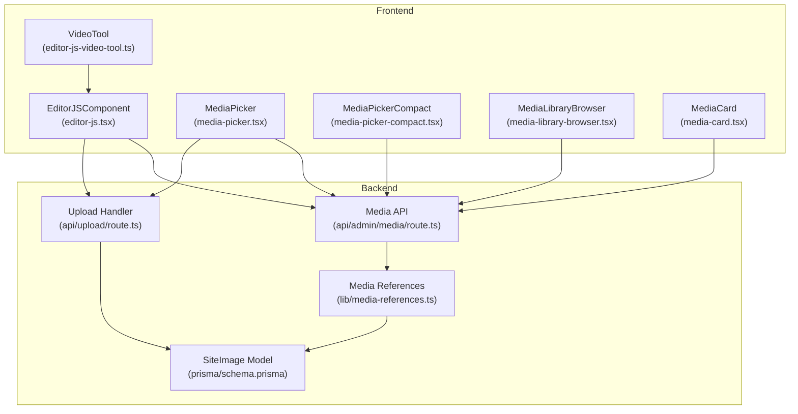
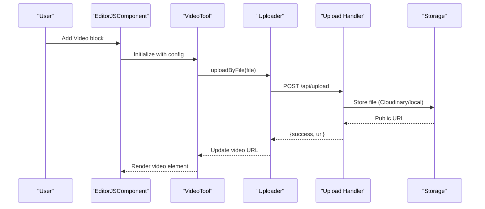
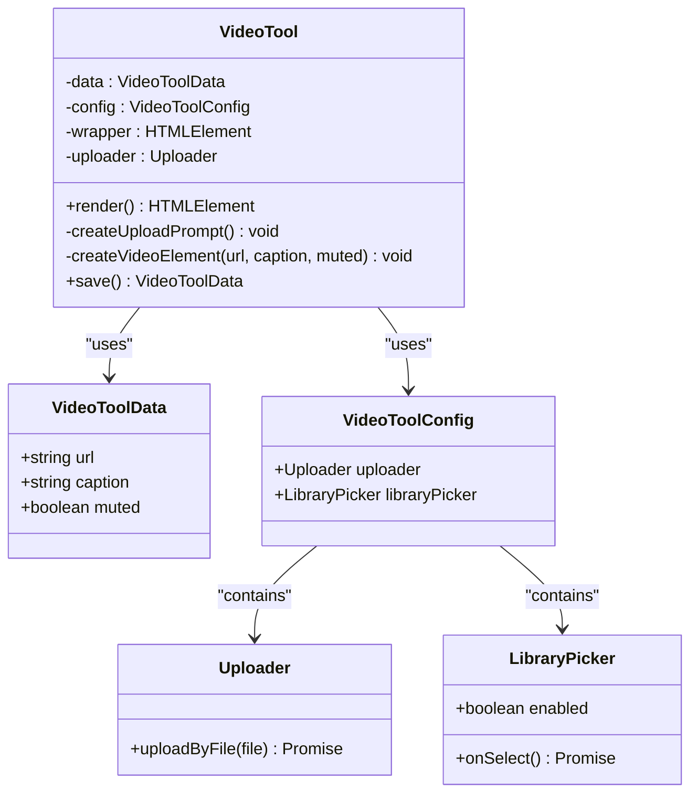
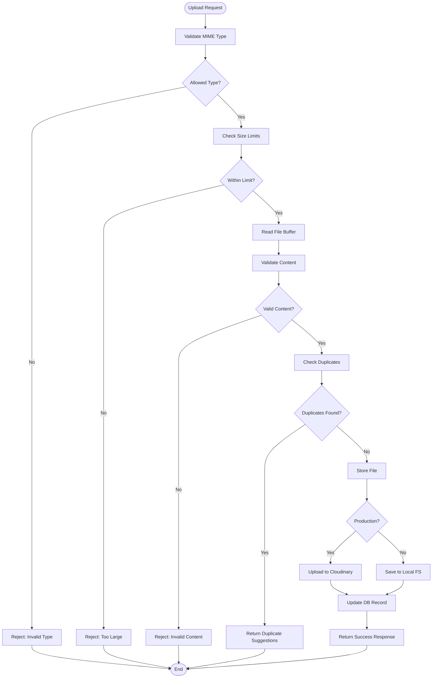
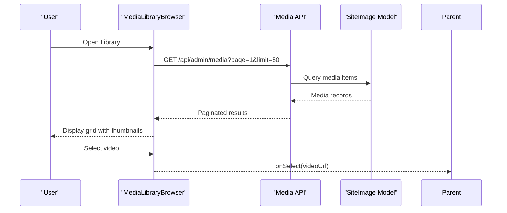
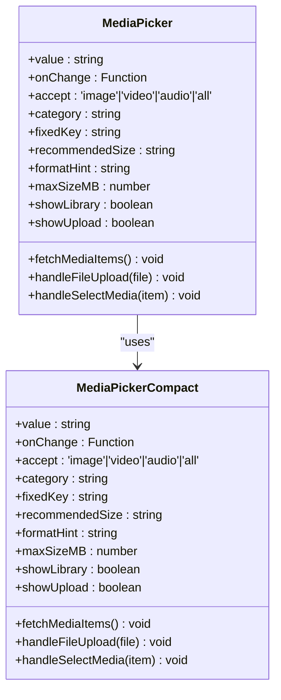
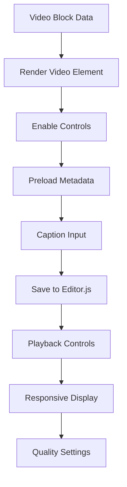
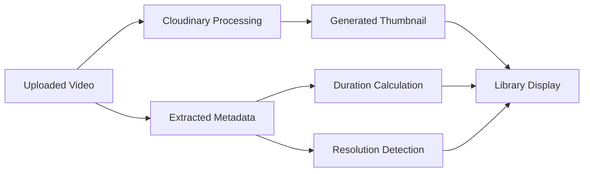
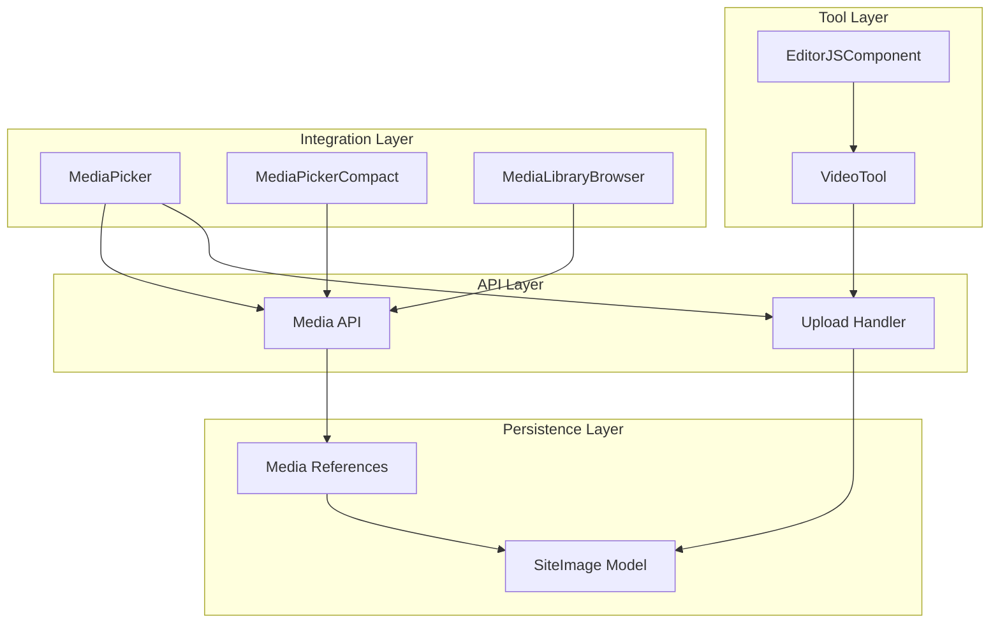

# Video Tool Implementation

<cite>
**Referenced Files in This Document**
- [editor-js-video-tool.ts](file://src/components/editor-js-video-tool.ts)
- [editor-js.tsx](file://src/components/editor-js.tsx)
- [route.ts](file://src/app/api/upload/route.ts)
- [route.ts](file://src/app/api/admin/media/route.ts)
- [media-references.ts](file://src/lib/media-references.ts)
- [media-library-browser.tsx](file://src/components/media-library-browser.tsx)
- [media-picker.tsx](file://src/components/media-picker.tsx)
- [media-picker-compact.tsx](file://src/components/media-picker-compact.tsx)
- [media-card.tsx](file://src/components/media-card.tsx)
- [schema.prisma](file://prisma/schema.prisma)
</cite>

## Table of Contents
1. [Introduction](#introduction)
2. [Project Structure](#project-structure)
3. [Core Components](#core-components)
4. [Architecture Overview](#architecture-overview)
5. [Detailed Component Analysis](#detailed-component-analysis)
6. [Dependency Analysis](#dependency-analysis)
7. [Performance Considerations](#performance-considerations)
8. [Troubleshooting Guide](#troubleshooting-guide)
9. [Conclusion](#conclusion)

## Introduction
This document provides comprehensive technical documentation for the Editor.js Video Tool implementation. It covers the video upload handler, file validation for video formats, integration with the media library system, tool configuration options, supported video codecs, size limits, quality settings, video player integration, thumbnail generation, playback controls, metadata handling, duration calculation, and responsive video display. It also includes practical examples for tool registration, custom configuration, and integration with the content management workflow.

## Project Structure
The video tool implementation spans several components:
- Frontend tool definition and rendering logic
- Editor.js integration and tool registration
- Backend upload endpoint with validation and storage
- Media library API and reference management
- Media picker components for library browsing and uploads

**Diagram sources**
- [editor-js-video-tool.ts:1-319](file://src/components/editor-js-video-tool.ts#L1-L319)
- [editor-js.tsx:344-575](file://src/components/editor-js.tsx#L344-L575)
- [media-picker.tsx:106-754](file://src/components/media-picker.tsx#L106-L754)
- [media-picker-compact.tsx:94-691](file://src/components/media-picker-compact.tsx#L94-L691)
- [media-library-browser.tsx:69-362](file://src/components/media-library-browser.tsx#L69-L362)
- [media-card.tsx:103-295](file://src/components/media-card.tsx#L103-L295)
- [route.ts:150-392](file://src/app/api/upload/route.ts#L150-L392)
- [route.ts:37-149](file://src/app/api/admin/media/route.ts#L37-L149)
- [media-references.ts:21-334](file://src/lib/media-references.ts#L21-L334)
- [schema.prisma:122-136](file://prisma/schema.prisma#L122-L136)

**Section sources**
- [editor-js-video-tool.ts:1-319](file://src/components/editor-js-video-tool.ts#L1-L319)
- [editor-js.tsx:344-575](file://src/components/editor-js.tsx#L344-L575)
- [route.ts:150-392](file://src/app/api/upload/route.ts#L150-L392)
- [route.ts:37-149](file://src/app/api/admin/media/route.ts#L37-L149)
- [media-references.ts:21-334](file://src/lib/media-references.ts#L21-L334)
- [schema.prisma:122-136](file://prisma/schema.prisma#L122-L136)

## Core Components
This section outlines the primary components involved in the video tool implementation and their responsibilities.

- VideoTool (Custom Editor.js Tool)
  - Handles video block rendering and user interactions
  - Manages upload prompts, drag-and-drop, and file selection
  - Integrates with uploader and library picker configurations
  - Saves video data (URL, caption, muted state) for Editor.js serialization

- EditorJSComponent
  - Initializes Editor.js with registered tools
  - Configures the videoLocal tool with uploader and library picker
  - Provides internationalization and tool-specific settings

- Upload Handler
  - Validates file types and sizes
  - Performs content validation via magic bytes and MIME type checks
  - Stores files to Cloudinary in production or local filesystem in development
  - Handles duplicate detection and replacement logic
  - Returns structured responses for success or error scenarios

- Media Library API
  - Lists media items with pagination and filtering
  - Calculates usage counts for each media item
  - Supports type-based filtering and search queries

- Media References
  - Extracts media URLs from Editor.js blocks
  - Finds all references to a media URL across the database
  - Updates references when media is replaced or deleted

- Media Picker Components
  - Unified interface for selecting media from library or uploading new files
  - Supports images, videos, and audio with appropriate accept attributes
  - Provides duplicate detection warnings and progress tracking

**Section sources**
- [editor-js-video-tool.ts:19-318](file://src/components/editor-js-video-tool.ts#L19-L318)
- [editor-js.tsx:473-483](file://src/components/editor-js.tsx#L473-L483)
- [route.ts:150-392](file://src/app/api/upload/route.ts#L150-L392)
- [route.ts:37-149](file://src/app/api/admin/media/route.ts#L37-L149)
- [media-references.ts:21-181](file://src/lib/media-references.ts#L21-L181)
- [media-picker.tsx:106-754](file://src/components/media-picker.tsx#L106-L754)

## Architecture Overview
The video tool follows a layered architecture:
- Presentation Layer: VideoTool renders the UI and manages user interactions
- Integration Layer: EditorJSComponent registers the tool and provides uploader/library picker
- Data Layer: Upload handler validates and stores media, Media API exposes library data
- Persistence Layer: SiteImage model stores metadata and references

**Diagram sources**
- [editor-js.tsx:473-483](file://src/components/editor-js.tsx#L473-L483)
- [editor-js-video-tool.ts:200-215](file://src/components/editor-js-video-tool.ts#L200-L215)
- [route.ts:150-392](file://src/app/api/upload/route.ts#L150-L392)

## Detailed Component Analysis

### VideoTool Component
The VideoTool is a custom Editor.js tool that enables local video uploads and library selection.

**Diagram sources**
- [editor-js-video-tool.ts:19-53](file://src/components/editor-js-video-tool.ts#L19-L53)
- [editor-js-video-tool.ts:13-17](file://src/components/editor-js-video-tool.ts#L13-L17)
- [editor-js-video-tool.ts:3-11](file://src/components/editor-js-video-tool.ts#L3-L11)

Key implementation details:
- Tool registration with toolbox metadata and sanitization rules
- Dynamic rendering of upload prompt or video element based on data presence
- Support for drag-and-drop file uploads with validation
- Integration with library picker for selecting existing videos
- Responsive video rendering with controls and caption input

**Section sources**
- [editor-js-video-tool.ts:25-43](file://src/components/editor-js-video-tool.ts#L25-L43)
- [editor-js-video-tool.ts:55-66](file://src/components/editor-js-video-tool.ts#L55-L66)
- [editor-js-video-tool.ts:68-262](file://src/components/editor-js-video-tool.ts#L68-L262)
- [editor-js-video-tool.ts:264-309](file://src/components/editor-js-video-tool.ts#L264-L309)
- [editor-js-video-tool.ts:311-318](file://src/components/editor-js-video-tool.ts#L311-L318)

### Upload Handler Implementation
The upload handler provides robust validation and storage capabilities for video files.

**Diagram sources**
- [route.ts:150-392](file://src/app/api/upload/route.ts#L150-L392)

Validation and storage characteristics:
- Supported video types: MP4, WebM, QuickTime (MOV), AVI
- Environment-aware size limits (development vs production)
- Magic byte validation for file integrity
- Duplicate detection with suggestion mechanism
- Automatic cleanup of replaced files in production

**Section sources**
- [route.ts:42-48](file://src/app/api/upload/route.ts#L42-L48)
- [route.ts:80-111](file://src/app/api/upload/route.ts#L80-L111)
- [route.ts:176-200](file://src/app/api/upload/route.ts#L176-L200)
- [route.ts:213-243](file://src/app/api/upload/route.ts#L213-L243)
- [route.ts:272-324](file://src/app/api/upload/route.ts#L272-L324)

### Media Library Integration
The media library system provides centralized management and browsing capabilities.

**Diagram sources**
- [media-library-browser.tsx:97-136](file://src/components/media-library-browser.tsx#L97-L136)
- [route.ts:37-149](file://src/app/api/admin/media/route.ts#L37-L149)
- [schema.prisma:122-136](file://prisma/schema.prisma#L122-L136)

Library features:
- Infinite scroll pagination (50 items per page)
- Search by filename with debounced input
- Category filtering and type-based filtering
- Usage count badges for each media item
- Lazy loading for improved performance

**Section sources**
- [media-library-browser.tsx:69-362](file://src/components/media-library-browser.tsx#L69-L362)
- [route.ts:37-149](file://src/app/api/admin/media/route.ts#L37-L149)
- [media-card.tsx:103-295](file://src/components/media-card.tsx#L103-L295)

### Media Picker Components
The media picker provides unified interfaces for selecting and uploading media.

**Diagram sources**
- [media-picker.tsx:31-43](file://src/components/media-picker.tsx#L31-L43)
- [media-picker-compact.tsx:34-57](file://src/components/media-picker-compact.tsx#L34-L57)

Picker features:
- Tabbed interface for library browsing and direct upload
- Drag-and-drop support with visual feedback
- Progress tracking during uploads
- Duplicate detection with suggestion dialog
- Accept attribute configuration for file type filtering

**Section sources**
- [media-picker.tsx:106-754](file://src/components/media-picker.tsx#L106-L754)
- [media-picker-compact.tsx:94-691](file://src/components/media-picker-compact.tsx#L94-L691)

### Video Player Integration
The video player integration provides responsive playback with metadata handling.

**Diagram sources**
- [editor-js.tsx:786-809](file://src/components/editor-js.tsx#L786-L809)

Player characteristics:
- HTML5 video element with native controls
- Preload metadata for faster initialization
- Responsive design with max-width constraints
- Caption input field for accessibility and context
- Muted state management for autoplay compliance

**Section sources**
- [editor-js-video-tool.ts:264-309](file://src/components/editor-js-video-tool.ts#L264-L309)
- [editor-js.tsx:786-809](file://src/components/editor-js.tsx#L786-L809)

### Thumbnail Generation and Metadata Handling
The system handles thumbnail generation and metadata extraction for optimal media management.

**Diagram sources**
- [media-card.tsx:156-161](file://src/components/media-card.tsx#L156-L161)

Metadata and thumbnail features:
- Cloudinary thumbnail generation for video files
- Lazy loading implementation for performance
- Usage count calculation across content
- File type detection from URL extensions
- Comprehensive tooltip with file details

**Section sources**
- [media-card.tsx:156-161](file://src/components/media-card.tsx#L156-L161)
- [route.ts:8-24](file://src/app/api/admin/media/route.ts#L8-L24)
- [media-references.ts:65-181](file://src/lib/media-references.ts#L65-L181)

## Dependency Analysis
The video tool implementation exhibits well-structured dependencies across layers.

**Diagram sources**
- [editor-js-video-tool.ts:19-318](file://src/components/editor-js-video-tool.ts#L19-L318)
- [editor-js.tsx:473-483](file://src/components/editor-js.tsx#L473-L483)
- [media-picker.tsx:106-754](file://src/components/media-picker.tsx#L106-L754)
- [media-library-browser.tsx:69-362](file://src/components/media-library-browser.tsx#L69-L362)
- [route.ts:150-392](file://src/app/api/upload/route.ts#L150-L392)
- [route.ts:37-149](file://src/app/api/admin/media/route.ts#L37-L149)
- [media-references.ts:21-334](file://src/lib/media-references.ts#L21-L334)
- [schema.prisma:122-136](file://prisma/schema.prisma#L122-L136)

Key dependency characteristics:
- Loose coupling between tool and uploader through configuration interfaces
- Centralized media management through shared API endpoints
- Database abstraction via Prisma ORM with strong typing
- Clear separation of concerns across presentation, integration, and persistence layers

**Section sources**
- [editor-js.tsx:473-483](file://src/components/editor-js.tsx#L473-L483)
- [media-references.ts:21-334](file://src/lib/media-references.ts#L21-L334)
- [schema.prisma:122-136](file://prisma/schema.prisma#L122-L136)

## Performance Considerations
The implementation incorporates several performance optimizations:

- Lazy Loading: Images use lazy loading to reduce initial page weight
- Infinite Scroll: Media library employs infinite scroll to minimize memory usage
- Thumbnail Generation: Cloudinary handles optimized thumbnails for video files
- Efficient Validation: Magic byte checking minimizes false positives
- Pagination: API responses use pagination to prevent large payload transfers
- Component Optimization: Compact media picker loads only recent items for quick access

Environment-specific optimizations:
- Development: Larger file size limits for easier testing
- Production: Strict size limits and Cloudinary integration for scalability
- Caching: Cloudinary CDN reduces bandwidth and improves delivery speed

## Troubleshooting Guide
Common issues and resolutions:

### Upload Failures
- Invalid File Type: Ensure file MIME type matches allowed types (MP4, WebM, MOV, AVI)
- Size Exceeded: Check environment-specific limits (development: 50MB, production: 25MB for videos)
- Content Validation: Verify file integrity using magic byte detection
- Network Issues: Monitor upload progress and retry failed requests

### Library Access Problems
- Authentication: Verify admin authentication for media API access
- Pagination Issues: Check page and limit parameters in API requests
- Filtering Problems: Ensure proper category and search parameter formatting
- CORS Errors: Configure appropriate CORS policies for cross-origin requests

### Video Playback Issues
- Browser Compatibility: Test with supported browsers and HTML5 video support
- Autoplay Restrictions: Use muted state for autoplay compliance
- Network Problems: Verify video URL accessibility and CDN configuration
- Metadata Loading: Ensure preload="metadata" for efficient loading

**Section sources**
- [route.ts:176-200](file://src/app/api/upload/route.ts#L176-L200)
- [media-library-browser.tsx:120-136](file://src/components/media-library-browser.tsx#L120-L136)
- [editor-js-video-tool.ts:270-275](file://src/components/editor-js-video-tool.ts#L270-L275)

## Conclusion
The Editor.js Video Tool implementation provides a comprehensive solution for video content management within the CMS. It combines robust backend validation with intuitive frontend interactions, enabling efficient video uploads, library management, and seamless integration into content workflows. The modular architecture supports future enhancements while maintaining performance and reliability across different environments.

The implementation demonstrates best practices in:
- Secure file handling with validation and size limits
- Scalable storage solutions with Cloudinary integration
- User-friendly interfaces with drag-and-drop support
- Centralized media management with reference tracking
- Responsive design principles for optimal user experience