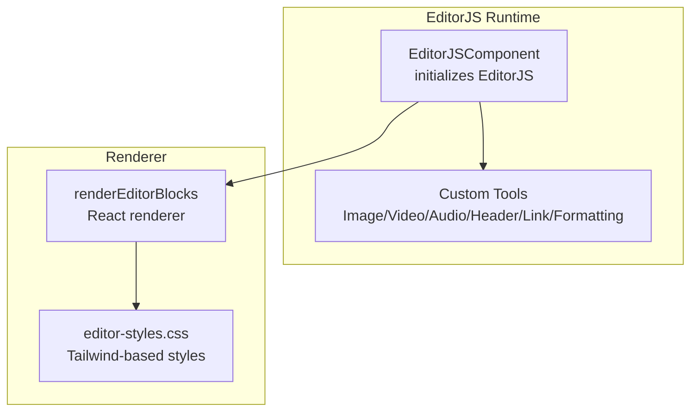
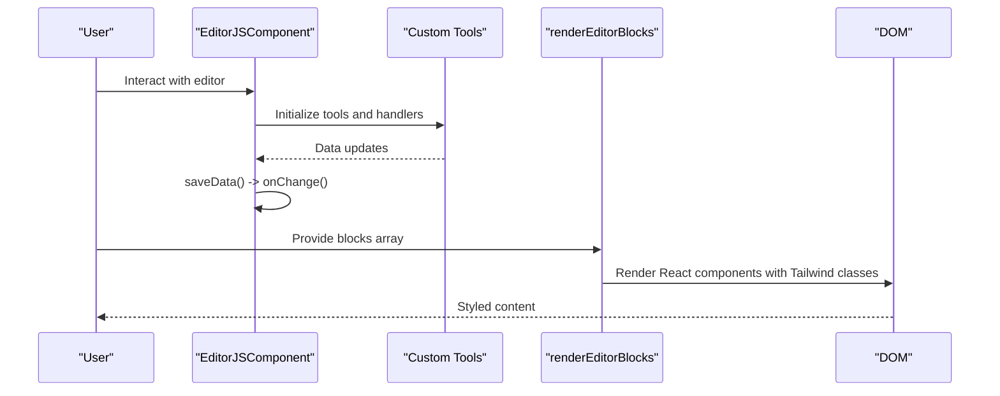
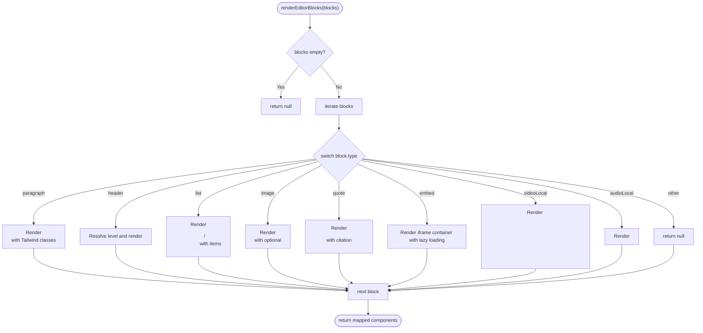
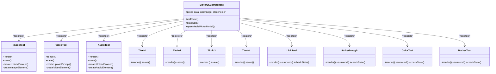
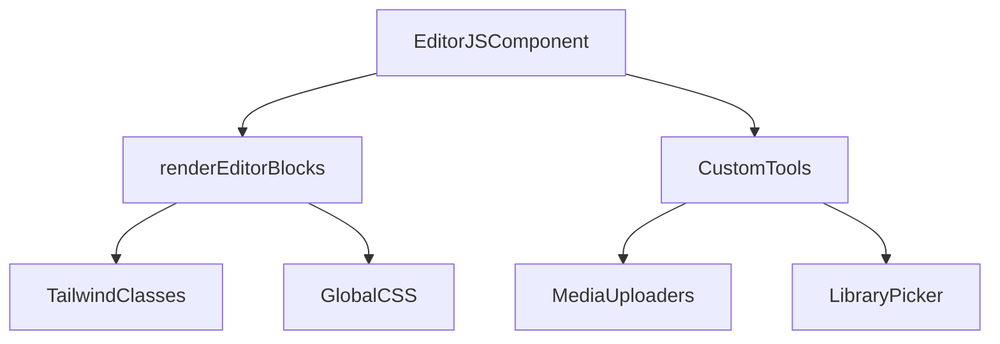

# Frontend Rendering System

<cite>
**Referenced Files in This Document**
- [editor-js.tsx](file://src/components/editor-js.tsx)
- [editor-styles.css](file://src/app/editor-styles.css)
- [editor-js-image-tool.ts](file://src/components/editor-js-image-tool.ts)
- [editor-js-video-tool.ts](file://src/components/editor-js-video-tool.ts)
- [editor-js-audio-tool.ts](file://src/components/editor-js-audio-tool.ts)
- [editor-js-header-tools.ts](file://src/components/editor-js-header-tools.ts)
- [editor-js-link-tool.ts](file://src/components/editor-js-link-tool.ts)
- [editor-js-strikethrough-tool.ts](file://src/components/editor-js-strikethrough-tool.ts)
- [editor-js-color-tool.ts](file://src/components/editor-js-color-tool.ts)
- [editor-js-marker-tool.ts](file://src/components/editor-js-marker-tool.ts)
- [editor-colors.ts](file://src/components/editor-colors.ts)
</cite>

## Table of Contents
1. [Introduction](#introduction)
2. [Project Structure](#project-structure)
3. [Core Components](#core-components)
4. [Architecture Overview](#architecture-overview)
5. [Detailed Component Analysis](#detailed-component-analysis)
6. [Dependency Analysis](#dependency-analysis)
7. [Performance Considerations](#performance-considerations)
8. [Troubleshooting Guide](#troubleshooting-guide)
9. [Conclusion](#conclusion)

## Introduction
This document describes the frontend rendering system responsible for displaying EditorJS content in the application. It focuses on the renderEditorBlocks function, block type handling, and React component generation for different content types. The system integrates EditorJS with custom tools and Tailwind CSS-based styling, ensuring responsive design and accessibility. It also covers the rendering pipeline for paragraphs, headings, lists, images, quotes, embeds, videos, and audio content, along with styling patterns and customization examples.

## Project Structure
The rendering system is centered around a single React component that initializes EditorJS and provides a dedicated renderer for frontend display. Supporting components implement custom EditorJS tools for media and inline formatting. Global styles ensure consistent presentation across content types.

**Diagram sources**
- [editor-js.tsx:344-575](file://src/components/editor-js.tsx#L344-L575)
- [editor-styles.css:1-250](file://src/app/editor-styles.css#L1-L250)

**Section sources**
- [editor-js.tsx:344-575](file://src/components/editor-js.tsx#L344-L575)
- [editor-styles.css:1-250](file://src/app/editor-styles.css#L1-L250)

## Core Components
- EditorJSComponent: Initializes EditorJS with custom tools, handles saving data, and renders the editor UI.
- renderEditorBlocks: Converts EditorJS block arrays into React components for frontend display.
- Custom Tools: Specialized EditorJS tools for images, videos, audio, headers, links, strikethrough, text color, and highlight color.
- Global Styles: Tailwind-based CSS for consistent editor and rendered content styling.

Key responsibilities:
- Editor initialization and tool registration
- Saving and restoring content
- Rendering blocks to React with Tailwind classes
- Applying responsive and dark-mode-aware styles
- Providing media upload and library picker integrations

**Section sources**
- [editor-js.tsx:344-575](file://src/components/editor-js.tsx#L344-L575)
- [editor-js.tsx:610-849](file://src/components/editor-js.tsx#L610-L849)
- [editor-styles.css:1-250](file://src/app/editor-styles.css#L1-L250)

## Architecture Overview
The system combines EditorJS runtime with a custom renderer. The EditorJSComponent sets up the editor and its tools, while renderEditorBlocks produces React elements for display. Styles are applied via Tailwind classes and global CSS rules.

**Diagram sources**
- [editor-js.tsx:344-575](file://src/components/editor-js.tsx#L344-L575)
- [editor-js.tsx:610-849](file://src/components/editor-js.tsx#L610-L849)

## Detailed Component Analysis

### renderEditorBlocks Function
The renderEditorBlocks function transforms EditorJS blocks into React components. It supports:
- Paragraphs: Justified text with Tailwind typography classes
- Headings: Levels 1–6 with appropriate sizing and spacing
- Lists: Ordered and unordered lists with nested items
- Images: Responsive images with optional captions
- Quotes: Blockquotes with citations
- Embeds: Responsive iframe containers with lazy loading
- Videos: HTML5 video with controls and optional captions
- Audio: HTML5 audio with title and caption inputs

Rendering logic:
- Uses a switch on block.type to select the appropriate JSX output
- Applies Tailwind utility classes for spacing, typography, and responsiveness
- Uses dangerouslySetInnerHTML for content that includes formatted text
- Handles optional fields like captions, URLs, and dimensions

**Diagram sources**
- [editor-js.tsx:610-849](file://src/components/editor-js.tsx#L610-L849)

**Section sources**
- [editor-js.tsx:610-849](file://src/components/editor-js.tsx#L610-L849)

### Block Type Handling and Rendering Pipeline
- Paragraphs: Rendered as 
 with justified alignment and readable line height.
- Headings: Rendered as <h1>–<h6> with appropriate margins and font weights.
- Lists: Rendered as <ol> or <ul> depending on style; items are plain <li>.
- Images: Rendered as  inside a <figure> with optional <figcaption>.
- Quotes: Rendered as <blockquote> with optional citation <cite>.
- Embeds: Rendered as a responsive container with an iframe; supports lazy loading.
- Videos: Rendered as <video> with controls and optional muted attribute.
- Audio: Rendered as <audio> with title and caption inputs.

Styling integration:
- Tailwind classes define typography, spacing, and responsive behavior.
- Global CSS ensures consistent editor and rendered content styles.
- Dark mode compatibility is handled via theme-aware styles.

Accessibility features:
- Proper semantic markup (<h1>–<h6>, <blockquote>, <figure>, <figcaption>)
- Alt text for images
- Controls for media players
- Focus states and keyboard-friendly interactions in tools

**Section sources**
- [editor-js.tsx:610-849](file://src/components/editor-js.tsx#L610-L849)
- [editor-styles.css:209-250](file://src/app/editor-styles.css#L209-L250)

### Custom Tools and React Component Generation
The EditorJSComponent dynamically imports and registers custom tools. Each tool defines:
- Toolbox metadata (title, icon)
- Rendering behavior (upload prompts, inputs, previews)
- Data sanitization and persistence
- Integration with media uploaders and library pickers

Examples:
- ImageTool: Uploads or selects images, manages captions, and applies responsive styles.
- VideoTool: Uploads or selects videos, manages captions and muted state.
- AudioTool: Uploads or selects audio, manages title and caption.
- Header tools: Separate tools for H1–H4 with distinct placeholders and levels.
- LinkTool: Inline link creation with a beautiful popup UI.
- Formatting tools: Strikethrough, text color, and highlight color with color grids.

**Diagram sources**
- [editor-js.tsx:344-575](file://src/components/editor-js.tsx#L344-L575)
- [editor-js-image-tool.ts:21-346](file://src/components/editor-js-image-tool.ts#L21-L346)
- [editor-js-video-tool.ts:19-319](file://src/components/editor-js-video-tool.ts#L19-L319)
- [editor-js-audio-tool.ts:19-350](file://src/components/editor-js-audio-tool.ts#L19-L350)
- [editor-js-header-tools.ts:14-212](file://src/components/editor-js-header-tools.ts#L14-L212)
- [editor-js-link-tool.ts:7-398](file://src/components/editor-js-link-tool.ts#L7-L398)
- [editor-js-strikethrough-tool.ts:4-64](file://src/components/editor-js-strikethrough-tool.ts#L4-L64)
- [editor-js-color-tool.ts:13-178](file://src/components/editor-js-color-tool.ts#L13-L178)
- [editor-js-marker-tool.ts:13-183](file://src/components/editor-js-marker-tool.ts#L13-L183)

**Section sources**
- [editor-js.tsx:344-575](file://src/components/editor-js.tsx#L344-L575)
- [editor-js-image-tool.ts:21-346](file://src/components/editor-js-image-tool.ts#L21-L346)
- [editor-js-video-tool.ts:19-319](file://src/components/editor-js-video-tool.ts#L19-L319)
- [editor-js-audio-tool.ts:19-350](file://src/components/editor-js-audio-tool.ts#L19-L350)
- [editor-js-header-tools.ts:14-212](file://src/components/editor-js-header-tools.ts#L14-L212)
- [editor-js-link-tool.ts:7-398](file://src/components/editor-js-link-tool.ts#L7-L398)
- [editor-js-strikethrough-tool.ts:4-64](file://src/components/editor-js-strikethrough-tool.ts#L4-L64)
- [editor-js-color-tool.ts:13-178](file://src/components/editor-js-color-tool.ts#L13-L178)
- [editor-js-marker-tool.ts:13-183](file://src/components/editor-js-marker-tool.ts#L13-L183)

### Styling Integration with Tailwind CSS and Responsive Design
- Typography: Paragraphs use justified alignment and readable line heights; headings scale appropriately.
- Spacing: Consistent margins and padding for block-level elements.
- Responsiveness: Max-width constraints and padding adjustments for smaller screens.
- Media: Images, videos, and audio are responsive; embeds maintain aspect ratios.
- Dark mode: Theme-aware styles for editor UI and rendered content.

Global CSS rules:
- Editor content width limits and padding adjustments
- Inline toolbar and popover styling
- Quote and code highlighting styles
- Media responsiveness and hover effects
- Dark mode overrides for editor UI

**Section sources**
- [editor-styles.css:1-250](file://src/app/editor-styles.css#L1-L250)

### Accessibility Features
- Semantic HTML: Proper heading hierarchy, blockquotes, figures, and captions.
- Media controls: Visible controls for video and audio elements.
- Keyboard navigation: Tools and popups support keyboard interactions.
- Focus states: Clear focus indicators for interactive elements.
- Alt text: Images include alt attributes derived from captions.

**Section sources**
- [editor-js.tsx:729-849](file://src/components/editor-js.tsx#L729-L849)
- [editor-js-image-tool.ts:283-346](file://src/components/editor-js-image-tool.ts#L283-L346)
- [editor-js-video-tool.ts:264-319](file://src/components/editor-js-video-tool.ts#L264-L319)
- [editor-js-audio-tool.ts:263-350](file://src/components/editor-js-audio-tool.ts#L263-L350)

## Dependency Analysis
The rendering system depends on:
- EditorJS runtime and registered tools
- Tailwind utility classes for styling
- Global CSS for editor and content presentation
- Media uploaders and library pickers for media blocks

**Diagram sources**
- [editor-js.tsx:344-575](file://src/components/editor-js.tsx#L344-L575)
- [editor-js.tsx:610-849](file://src/components/editor-js.tsx#L610-L849)

**Section sources**
- [editor-js.tsx:344-575](file://src/components/editor-js.tsx#L344-L575)
- [editor-js.tsx:610-849](file://src/components/editor-js.tsx#L610-L849)

## Performance Considerations
- Lazy loading: Embeds and media use lazy loading to reduce initial load.
- Minimal DOM: Rendering uses lightweight elements with Tailwind classes.
- Efficient updates: Editor saves data on change; avoid unnecessary re-renders.
- Media constraints: Uploaders enforce size limits to prevent large payloads.
- CSS specificity: Global styles minimize style conflicts and repaints.

## Troubleshooting Guide
Common issues and resolutions:
- Empty or missing blocks: renderEditorBlocks returns null when blocks are empty.
- Unsafe HTML: Content is injected via dangerouslySetInnerHTML; sanitize inputs to prevent XSS.
- Media errors: Video/audio components log errors and URLs for debugging.
- Styling inconsistencies: Verify Tailwind classes and global CSS are loaded.
- Dark mode mismatches: Ensure theme classes are applied to the document root.

**Section sources**
- [editor-js.tsx:610-849](file://src/components/editor-js.tsx#L610-L849)
- [editor-js.tsx:825-832](file://src/components/editor-js.tsx#L825-L832)

## Conclusion
The frontend rendering system provides a robust, accessible, and responsive way to display EditorJS content. The renderEditorBlocks function offers a clean pipeline for converting EditorJS blocks into styled React components, while custom tools and global styles ensure consistent presentation across devices and themes. The system balances flexibility with performance and adheres to accessibility best practices.