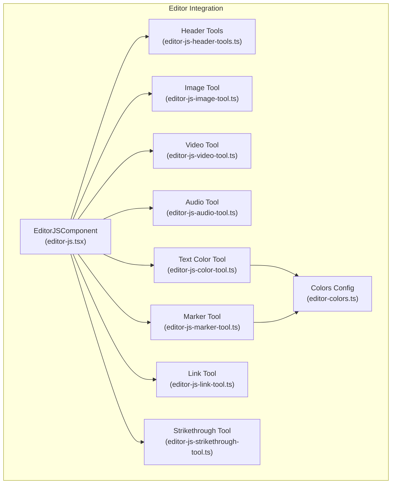
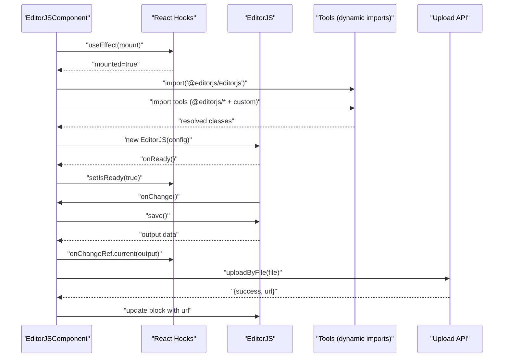
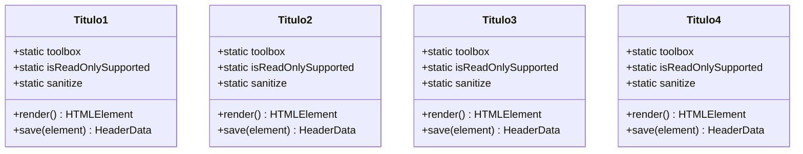
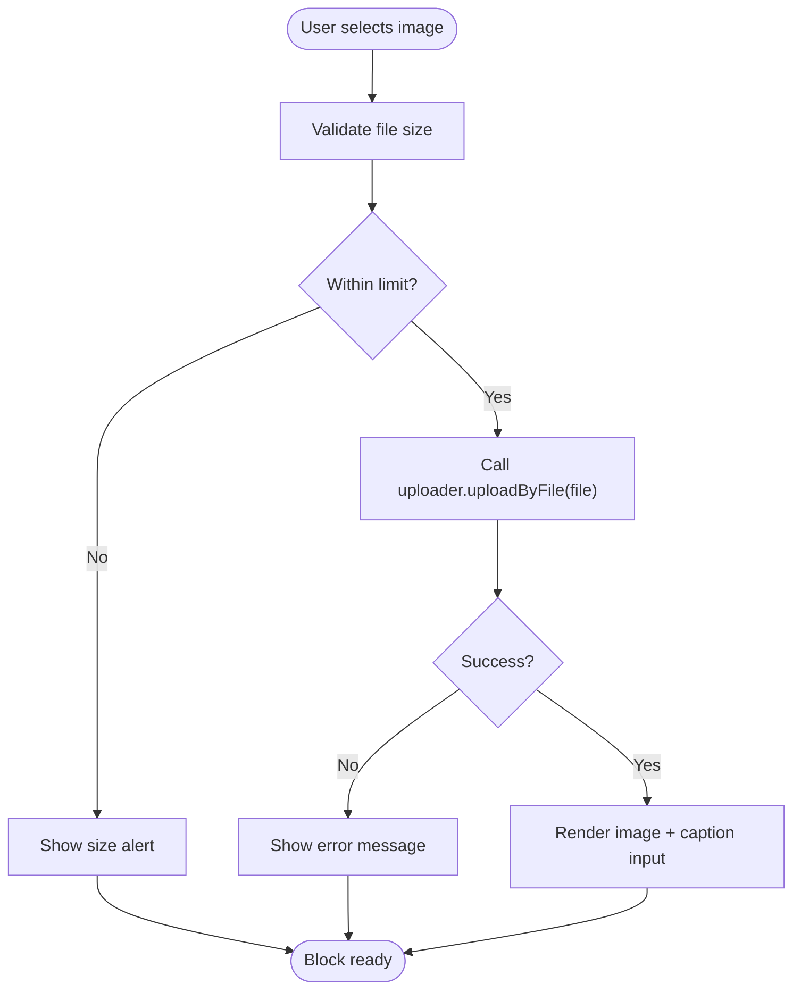
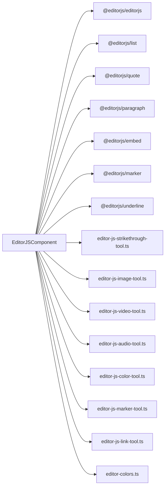

# Main Editor Component

<cite>
**Referenced Files in This Document**
- [editor-js.tsx](file://src/components/editor-js.tsx)
- [editor-js-header-tools.ts](file://src/components/editor-js-header-tools.ts)
- [editor-js-image-tool.ts](file://src/components/editor-js-image-tool.ts)
- [editor-js-video-tool.ts](file://src/components/editor-js-video-tool.ts)
- [editor-js-audio-tool.ts](file://src/components/editor-js-audio-tool.ts)
- [editor-js-color-tool.ts](file://src/components/editor-js-color-tool.ts)
- [editor-js-marker-tool.ts](file://src/components/editor-js-marker-tool.ts)
- [editor-js-link-tool.ts](file://src/components/editor-js-link-tool.ts)
- [editor-js-strikethrough-tool.ts](file://src/components/editor-js-strikethrough-tool.ts)
- [editor-colors.ts](file://src/components/editor-colors.ts)
- [noticias/page.tsx](file://src/app/admin/noticias/page.tsx)
</cite>

## Table of Contents
1. [Introduction](#introduction)
2. [Project Structure](#project-structure)
3. [Core Components](#core-components)
4. [Architecture Overview](#architecture-overview)
5. [Detailed Component Analysis](#detailed-component-analysis)
6. [Dependency Analysis](#dependency-analysis)
7. [Performance Considerations](#performance-considerations)
8. [Troubleshooting Guide](#troubleshooting-guide)
9. [Conclusion](#conclusion)

## Introduction
This document explains the main EditorJS component implementation used across the application. It focuses on the EditorJSComponent wrapper that initializes the Editor.js instance, dynamically imports third-party and custom tools, manages the editor lifecycle, and provides internationalization support. It also covers the component’s props interface, state management, lazy-loading patterns, React useEffect hooks integration, initialization process, tool registration, configuration options, event handling, data persistence, and error handling strategies.

## Project Structure
The EditorJS integration is centered around a single React component that lazily loads EditorJS and its plugins, and wires them into a cohesive rich-text editing experience. Supporting tools and utilities are organized per-feature to keep responsibilities modular.

**Diagram sources**
- [editor-js.tsx:344-575](file://src/components/editor-js.tsx#L344-L575)
- [editor-js-header-tools.ts:14-211](file://src/components/editor-js-header-tools.ts#L14-L211)
- [editor-js-image-tool.ts:21-345](file://src/components/editor-js-image-tool.ts#L21-L345)
- [editor-js-video-tool.ts:19-318](file://src/components/editor-js-video-tool.ts#L19-L318)
- [editor-js-audio-tool.ts:19-349](file://src/components/editor-js-audio-tool.ts#L19-L349)
- [editor-js-color-tool.ts:13-177](file://src/components/editor-js-color-tool.ts#L13-L177)
- [editor-js-marker-tool.ts:13-182](file://src/components/editor-js-marker-tool.ts#L13-L182)
- [editor-js-link-tool.ts:7-319](file://src/components/editor-js-link-tool.ts#L7-L319)
- [editor-js-strikethrough-tool.ts:4-63](file://src/components/editor-js-strikethrough-tool.ts#L4-L63)
- [editor-colors.ts:6-49](file://src/components/editor-colors.ts#L6-L49)

**Section sources**
- [editor-js.tsx:1-850](file://src/components/editor-js.tsx#L1-L850)
- [editor-js-header-tools.ts:1-212](file://src/components/editor-js-header-tools.ts#L1-L212)
- [editor-js-image-tool.ts:1-346](file://src/components/editor-js-image-tool.ts#L1-L346)
- [editor-js-video-tool.ts:1-319](file://src/components/editor-js-video-tool.ts#L1-L319)
- [editor-js-audio-tool.ts:1-350](file://src/components/editor-js-audio-tool.ts#L1-L350)
- [editor-js-color-tool.ts:1-178](file://src/components/editor-js-color-tool.ts#L1-L178)
- [editor-js-marker-tool.ts:1-183](file://src/components/editor-js-marker-tool.ts#L1-L183)
- [editor-js-link-tool.ts:1-320](file://src/components/editor-js-link-tool.ts#L1-L320)
- [editor-js-strikethrough-tool.ts:1-64](file://src/components/editor-js-strikethrough-tool.ts#L1-L64)
- [editor-colors.ts:1-50](file://src/components/editor-colors.ts#L1-L50)

## Core Components
- EditorJSComponent: The main React component that initializes EditorJS, registers tools, sets up i18n, and manages lifecycle via React hooks.
- Header Tools: Four standalone tools for H1–H4 headings, each with a dedicated class and toolbar metadata.
- Media Tools: Custom tools for images, videos, and audio with upload and library picker capabilities.
- Inline Formatting Tools: Text color, marker/highlight, link, and strikethrough tools.
- Color Configurations: Centralized color arrays and dark/light theme styles for tools.

Key responsibilities:
- Lazy-load EditorJS and tools to reduce initial bundle size.
- Register tools with EditorJS and configure their behavior.
- Persist editor content via onChange callbacks.
- Provide i18n for Spanish language UI and tool labels.
- Manage theme-aware rendering and modals.

**Section sources**
- [editor-js.tsx:9-167](file://src/components/editor-js.tsx#L9-L167)
- [editor-js-header-tools.ts:14-211](file://src/components/editor-js-header-tools.ts#L14-L211)
- [editor-js-image-tool.ts:21-345](file://src/components/editor-js-image-tool.ts#L21-L345)
- [editor-js-video-tool.ts:19-318](file://src/components/editor-js-video-tool.ts#L19-L318)
- [editor-js-audio-tool.ts:19-349](file://src/components/editor-js-audio-tool.ts#L19-L349)
- [editor-js-color-tool.ts:13-177](file://src/components/editor-js-color-tool.ts#L13-L177)
- [editor-js-marker-tool.ts:13-182](file://src/components/editor-js-marker-tool.ts#L13-L182)
- [editor-js-link-tool.ts:7-319](file://src/components/editor-js-link-tool.ts#L7-L319)
- [editor-js-strikethrough-tool.ts:4-63](file://src/components/editor-js-strikethrough-tool.ts#L4-L63)
- [editor-colors.ts:6-49](file://src/components/editor-colors.ts#L6-L49)

## Architecture Overview
The EditorJSComponent orchestrates initialization, tool registration, and event handling. It uses React refs and hooks to manage DOM, state, and lifecycle. Dynamic imports ensure only necessary modules are loaded when the editor mounts.

**Diagram sources**
- [editor-js.tsx:352-557](file://src/components/editor-js.tsx#L352-L557)

**Section sources**
- [editor-js.tsx:344-575](file://src/components/editor-js.tsx#L344-L575)

## Detailed Component Analysis

### EditorJSComponent
Responsibilities:
- Initialize EditorJS with holder, data, placeholder, i18n, tools, and callbacks.
- Dynamically import EditorJS and tools to optimize load performance.
- Persist content via save() and propagate changes via onChange.
- Clean up on unmount by destroying the EditorJS instance.
- Provide helpers to convert EditorJS data to plain text and render blocks in the frontend.

Props interface:
- data: optional initial EditorJS JSON data.
- onChange: callback invoked with saved EditorJS output.
- placeholder: optional placeholder text.

State and refs:
- editorRef: stores the EditorJS instance.
- holderRef: DOM reference for the editor container.
- onChangeRef: memoized ref to the latest onChange callback.
- isReady: indicates when EditorJS has finished initializing.
- mounted: tracks mount lifecycle to avoid SSR issues.
- dataRef: memoized ref to the latest data prop.

Lifecycle:
- On mount, sets mounted flag.
- On first render with mounted=true and no existing editor, performs dynamic imports and creates EditorJS instance.
- Registers tools, sets i18n, and configures onChange and onReady handlers.
- Unmount destroys the editor instance safely.

Internationalization:
- Uses a Spanish i18n configuration covering UI labels, tool names, and tool-specific messages.

Error handling:
- Catches initialization errors and logs them.
- Wraps save() calls in try/catch and logs errors.
- Handles upload failures gracefully and informs the user.

Data persistence:
- Calls editor.save() on change and invokes onChange with the serialized output.
- Uses refs to ensure callbacks reflect the latest props.

Lazy loading:
- Uses dynamic import for EditorJS and each tool to minimize initial payload.

Integration with React hooks:
- Uses refs to track onChange/data callbacks and current data.
- Uses mounted flag to guard against SSR and race conditions.
- Uses isReady to coordinate UI updates after initialization.

**Section sources**
- [editor-js.tsx:9-167](file://src/components/editor-js.tsx#L9-L167)
- [editor-js.tsx:344-575](file://src/components/editor-js.tsx#L344-L575)
- [editor-js.tsx:577-608](file://src/components/editor-js.tsx#L577-L608)
- [editor-js.tsx:610-850](file://src/components/editor-js.tsx#L610-L850)

### Header Tools (H1–H4)
Each header tool is a separate class implementing the EditorJS tool contract:
- Provides toolbox metadata (title/icon).
- Implements render() to create the heading element.
- Implements save() to serialize text and level.
- Supports read-only mode and sanitization.

**Diagram sources**
- [editor-js-header-tools.ts:14-211](file://src/components/editor-js-header-tools.ts#L14-L211)

**Section sources**
- [editor-js-header-tools.ts:14-211](file://src/components/editor-js-header-tools.ts#L14-L211)

### Image Tool
Features:
- Uploads images via a configurable uploader.
- Integrates with a media library picker modal.
- Supports drag-and-drop and file selection.
- Renders image with optional caption and theme-aware UI.

**Diagram sources**
- [editor-js-image-tool.ts:206-232](file://src/components/editor-js-image-tool.ts#L206-L232)

**Section sources**
- [editor-js-image-tool.ts:21-345](file://src/components/editor-js-image-tool.ts#L21-L345)

### Video Tool
Features:
- Uploads videos with size limits and library picker.
- Renders a video player with caption input.
- Theme-aware styling and responsive layout.

**Section sources**
- [editor-js-video-tool.ts:19-318](file://src/components/editor-js-video-tool.ts#L19-L318)

### Audio Tool
Features:
- Uploads audio with size limits and library picker.
- Renders an audio player with title and caption inputs.
- Extracts filename for default title and applies theme styles.

**Section sources**
- [editor-js-audio-tool.ts:19-349](file://src/components/editor-js-audio-tool.ts#L19-L349)

### Text Color Tool
Features:
- Inline tool to pick text colors from a predefined palette.
- Surrounds selected text with a styled span.
- Removes formatting on double-click.

**Section sources**
- [editor-js-color-tool.ts:13-177](file://src/components/editor-js-color-tool.ts#L13-L177)

### Marker (Highlight) Tool
Features:
- Inline tool to highlight text with multiple colors.
- Surrounds selected text with a styled mark element.
- Removes formatting on double-click.

**Section sources**
- [editor-js-marker-tool.ts:13-182](file://src/components/editor-js-marker-tool.ts#L13-L182)

### Link Tool
Features:
- Inline tool to add links with a popup input.
- Detects existing links and offers removal option.
- Normalizes URLs and applies safe attributes.

**Section sources**
- [editor-js-link-tool.ts:7-319](file://src/components/editor-js-link-tool.ts#L7-L319)

### Strikethrough Tool
Features:
- Inline tool to apply strikethrough formatting.
- Checks current selection state and toggles formatting.

**Section sources**
- [editor-js-strikethrough-tool.ts:4-63](file://src/components/editor-js-strikethrough-tool.ts#L4-L63)

### Color Configurations
Centralizes:
- Marker color palette with localized names.
- Text color palette.
- Dark/light theme styles for modals and components.

**Section sources**
- [editor-colors.ts:6-49](file://src/components/editor-colors.ts#L6-L49)

### Integration Example: Admin News Page
The EditorJSComponent is integrated into the admin news page to edit article content. It receives initial data, persists changes via onChange, and displays helpful tips to editors.

Usage highlights:
- Passes editor data via a ref to maintain state across renders.
- Calls onChange to persist content changes.
- Provides a placeholder tailored to the use case.

**Section sources**
- [noticias/page.tsx:414-418](file://src/app/admin/noticias/page.tsx#L414-L418)

## Dependency Analysis
The EditorJSComponent depends on:
- EditorJS core and official community tools.
- Custom tools implemented in dedicated files.
- Utility modules for color definitions and dark mode styles.
- A media picker modal for library-based selections.

**Diagram sources**
- [editor-js.tsx:382-396](file://src/components/editor-js.tsx#L382-L396)

**Section sources**
- [editor-js.tsx:382-396](file://src/components/editor-js.tsx#L382-L396)

## Performance Considerations
- Lazy loading: Tools and EditorJS are imported only when the component mounts, reducing initial bundle size.
- Conditional initialization: Initialization runs once and guards against race conditions using a subscription flag and mounted state.
- Efficient saves: onChange triggers a single save operation per change, minimizing unnecessary writes.
- Theme-aware rendering: Styles are applied conditionally to avoid redundant computations.

## Troubleshooting Guide
Common issues and strategies:
- Editor fails to initialize:
  - Verify dynamic imports resolve and network allows loading packages.
  - Check console for initialization errors and ensure holderRef is attached.
- Uploads fail:
  - Confirm the upload endpoint responds and respects file size limits.
  - Inspect alerts and error logs for user-friendly feedback.
- Content not persisting:
  - Ensure onChange is wired correctly and dataRef reflects the latest props.
  - Confirm save() is being called and returned data is handled upstream.
- Tool not appearing:
  - Verify tool registration under the expected key and that imports resolve.
- Theme inconsistencies:
  - Confirm dark mode class is present on the document root and styles are applied.

**Section sources**
- [editor-js.tsx:364-373](file://src/components/editor-js.tsx#L364-L373)
- [editor-js.tsx:540-542](file://src/components/editor-js.tsx#L540-L542)
- [editor-js-image-tool.ts:217-231](file://src/components/editor-js-image-tool.ts#L217-L231)
- [editor-js-video-tool.ts:200-214](file://src/components/editor-js-video-tool.ts#L200-L214)
- [editor-js-audio-tool.ts:197-212](file://src/components/editor-js-audio-tool.ts#L197-L212)

## Conclusion
The EditorJSComponent provides a robust, extensible, and performant rich-text editing experience. By leveraging dynamic imports, centralized tool implementations, and React hooks, it balances flexibility with maintainability. The component supports internationalization, theme-aware UI, and seamless integration with backend upload APIs, making it suitable for content-heavy applications.