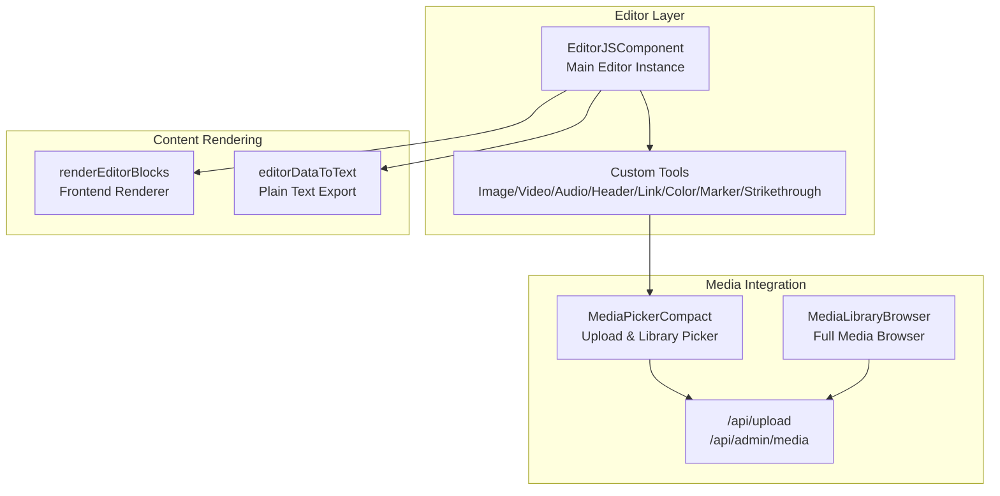
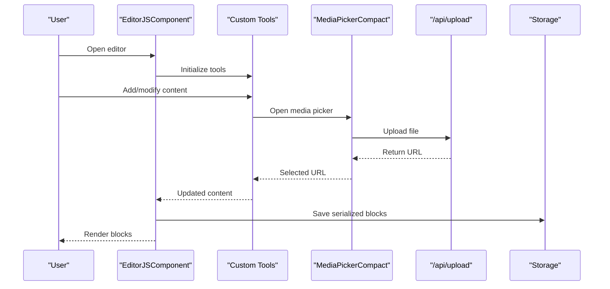
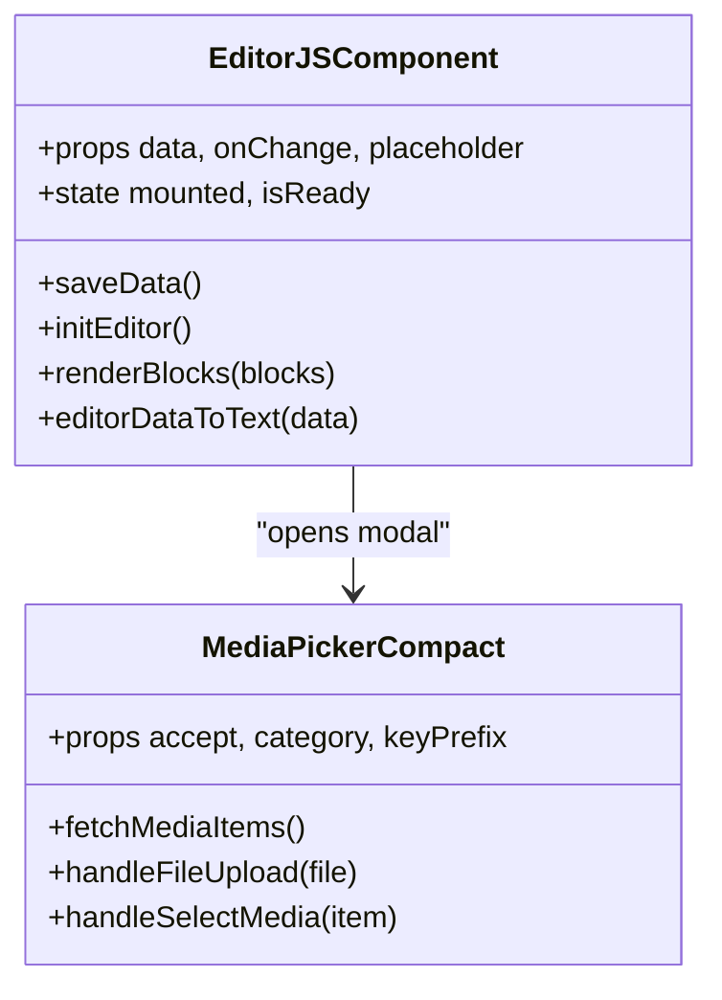
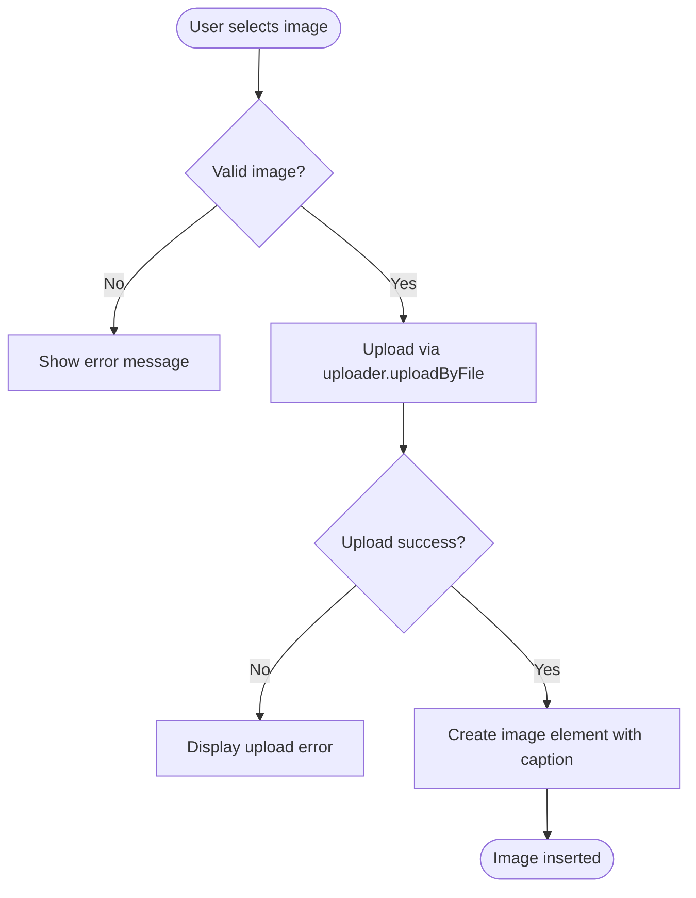
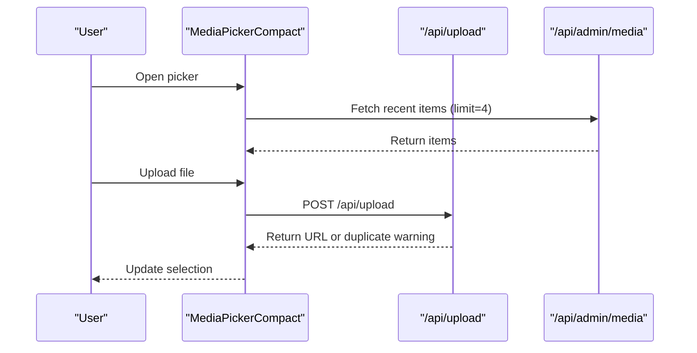
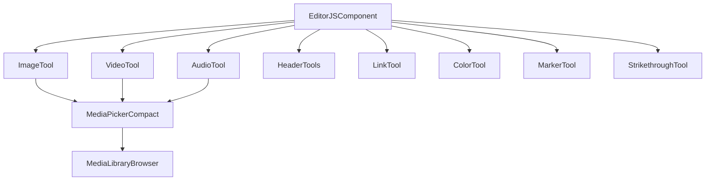

# Rich Text Editing System

<cite>
**Referenced Files in This Document**
- [editor-js.tsx](file://src/components/editor-js.tsx)
- [editor-js-image-tool.ts](file://src/components/editor-js-image-tool.ts)
- [editor-js-video-tool.ts](file://src/components/editor-js-video-tool.ts)
- [editor-js-audio-tool.ts](file://src/components/editor-js-audio-tool.ts)
- [editor-js-header-tools.ts](file://src/components/editor-js-header-tools.ts)
- [editor-js-link-tool.ts](file://src/components/editor-js-link-tool.ts)
- [editor-js-color-tool.ts](file://src/components/editor-js-color-tool.ts)
- [editor-js-marker-tool.ts](file://src/components/editor-js-marker-tool.ts)
- [editor-js-strikethrough-tool.ts](file://src/components/editor-js-strikethrough-tool.ts)
- [editor-colors.ts](file://src/components/editor-colors.ts)
- [media-picker-compact.tsx](file://src/components/media-picker-compact.tsx)
- [media-library-browser.tsx](file://src/components/media-library-browser.tsx)
- [noticias-admin-page.tsx](file://src/app/admin/noticias/page.tsx)
- [servicios-admin-page.tsx](file://src/app/admin/servicios/page.tsx)
</cite>

## Table of Contents
1. [Introduction](#introduction)
2. [Project Structure](#project-structure)
3. [Core Components](#core-components)
4. [Architecture Overview](#architecture-overview)
5. [Detailed Component Analysis](#detailed-component-analysis)
6. [Dependency Analysis](#dependency-analysis)
7. [Performance Considerations](#performance-considerations)
8. [Troubleshooting Guide](#troubleshooting-guide)
9. [Conclusion](#conclusion)

## Introduction
This document describes the rich text editing system built with Editor.js, covering the main editor component, custom tools, content serialization/storage, and frontend rendering. It explains the tool architecture, plugin system, content validation, and integration with the media library. Implementation details include content formatting, undo/redo functionality, and cross-browser compatibility considerations.

## Project Structure
The rich text editing system is organized around a central Editor.js component that dynamically loads tools and integrates with a media library for uploads and selection. The structure supports both inline and block-level tools, with specialized handlers for images, videos, audio, headers, links, colors, markers, and strikethrough formatting.

**Diagram sources**
- [editor-js.tsx:344-575](file://src/components/editor-js.tsx#L344-L575)
- [media-picker-compact.tsx:94-106](file://src/components/media-picker-compact.tsx#L94-L106)
- [media-library-browser.tsx:69-75](file://src/components/media-library-browser.tsx#L69-L75)

**Section sources**
- [editor-js.tsx:344-575](file://src/components/editor-js.tsx#L344-L575)
- [media-picker-compact.tsx:94-106](file://src/components/media-picker-compact.tsx#L94-L106)
- [media-library-browser.tsx:69-75](file://src/components/media-library-browser.tsx#L69-L75)

## Core Components
- Main Editor Component: Initializes Editor.js, loads tools, handles onChange/save cycles, and renders blocks for frontend display.
- Custom Tools: Specialized Editor.js tools for media, headers, links, colors, markers, and strikethrough with validation and UI.
- Media Integration: Compact media picker and full media library browser for uploads and selection.
- Content Serialization: Methods to export Editor.js data to plain text and render blocks for frontend consumption.

Key responsibilities:
- Tool lifecycle: initialization, rendering, saving, and sanitization.
- Media handling: upload via API, library selection, and duplicate detection.
- Content rendering: converting Editor.js blocks to semantic HTML for frontend display.

**Section sources**
- [editor-js.tsx:344-575](file://src/components/editor-js.tsx#L344-L575)
- [editor-js.tsx:577-850](file://src/components/editor-js.tsx#L577-L850)
- [media-picker-compact.tsx:175-290](file://src/components/media-picker-compact.tsx#L175-L290)

## Architecture Overview
The system follows a modular architecture:
- EditorJSComponent orchestrates Editor.js initialization and tool configuration.
- Tools encapsulate UI and behavior for specific content types.
- MediaPickerCompact integrates with the backend API for uploads and library browsing.
- Frontend rendering converts Editor.js blocks to styled HTML for display.

**Diagram sources**
- [editor-js.tsx:380-543](file://src/components/editor-js.tsx#L380-L543)
- [media-picker-compact.tsx:175-290](file://src/components/media-picker-compact.tsx#L175-L290)

**Section sources**
- [editor-js.tsx:380-543](file://src/components/editor-js.tsx#L380-L543)
- [media-picker-compact.tsx:175-290](file://src/components/media-picker-compact.tsx#L175-L290)

## Detailed Component Analysis

### Main Editor Component
The main editor component initializes Editor.js, configures tools, manages state, and exposes helpers for content serialization and rendering.

Key features:
- Dynamic tool loading with lazy imports for performance.
- onChange callback to persist content incrementally.
- i18n configuration for Spanish UI.
- Theme-aware styling and modal rendering for media selection.
- Helpers for plain text extraction and frontend block rendering.

**Diagram sources**
- [editor-js.tsx:344-575](file://src/components/editor-js.tsx#L344-L575)
- [media-picker-compact.tsx:94-106](file://src/components/media-picker-compact.tsx#L94-L106)

**Section sources**
- [editor-js.tsx:344-575](file://src/components/editor-js.tsx#L344-L575)
- [editor-js.tsx:577-850](file://src/components/editor-js.tsx#L577-L850)

### Custom Tools

#### Image Tool
Provides local image upload and library selection with caption support and drag-and-drop handling.

Implementation highlights:
- Upload validation and error handling.
- Library picker integration via modal.
- Sanitization configuration for captions.
- Dark mode styling adaptation.

**Diagram sources**
- [editor-js-image-tool.ts:21-345](file://src/components/editor-js-image-tool.ts#L21-L345)

**Section sources**
- [editor-js-image-tool.ts:21-345](file://src/components/editor-js-image-tool.ts#L21-L345)

#### Video Tool
Supports local video upload with library selection, caption, and mute option.

Key aspects:
- File type and size validation.
- Drag-and-drop upload flow.
- Library picker integration.
- Sanitization for captions and mute state.

**Section sources**
- [editor-js-video-tool.ts:19-319](file://src/components/editor-js-video-tool.ts#L19-L319)

#### Audio Tool
Handles local audio upload with automatic title extraction and library selection.

Highlights:
- Automatic filename-to-title conversion.
- Size and type validation.
- Library picker integration.
- Sanitization for titles and captions.

**Section sources**
- [editor-js-audio-tool.ts:19-350](file://src/components/editor-js-audio-tool.ts#L19-L350)

#### Header Tools (H1-H4)
Standalone header tools for H1 through H4, each with dedicated icon and placeholder.

Features:
- Content-editable headers with placeholders.
- Sanitization for text and level.
- Read-only support.

**Section sources**
- [editor-js-header-tools.ts:14-212](file://src/components/editor-js-header-tools.ts#L14-L212)

#### Link Tool
Inline link tool with popup for URL input and removal option.

Capabilities:
- Popup positioning and focus management.
- URL normalization (adds protocol if missing).
- Inline link creation and removal.
- Sanitization for anchor tags.

**Section sources**
- [editor-js-link-tool.ts:7-320](file://src/components/editor-js-link-tool.ts#L7-L320)

#### Color Tool
Inline text color selection with a configurable palette.

Features:
- Color grid with hover effects.
- Double-click to remove formatting.
- Sanitization for colored spans.

**Section sources**
- [editor-js-color-tool.ts:13-178](file://src/components/editor-js-color-tool.ts#L13-L178)

#### Marker Tool
Inline highlight tool with multiple color options.

Highlights:
- Grid of highlight colors.
- Double-click to remove highlighting.
- Sanitization for marked elements.

**Section sources**
- [editor-js-marker-tool.ts:13-183](file://src/components/editor-js-marker-tool.ts#L13-L183)

#### Strikethrough Tool
Inline strikethrough formatting with toggle support.

Features:
- Toggle formatting on selection.
- Sanitization for s/del/span elements.

**Section sources**
- [editor-js-strikethrough-tool.ts:4-64](file://src/components/editor-js-strikethrough-tool.ts#L4-L64)

### Media Library Integration
The media picker and library browser provide seamless integration with the backend API for uploads and browsing.

#### MediaPickerCompact
- Compact interface with library and upload tabs.
- Drag-and-drop upload with progress tracking.
- Duplicate detection with suggestion dialog.
- Optimized loading of recent items (4 items).

**Diagram sources**
- [media-picker-compact.tsx:132-170](file://src/components/media-picker-compact.tsx#L132-L170)
- [media-picker-compact.tsx:175-290](file://src/components/media-picker-compact.tsx#L175-L290)

**Section sources**
- [media-picker-compact.tsx:132-170](file://src/components/media-picker-compact.tsx#L132-L170)
- [media-picker-compact.tsx:175-290](file://src/components/media-picker-compact.tsx#L175-L290)

#### MediaLibraryBrowser
- Infinite scroll pagination (50 items per page).
- Search with debounced query and category filtering.
- Grid layout with lazy loading and usage counts.
- Preview modal and external media registration.

**Section sources**
- [media-library-browser.tsx:69-362](file://src/components/media-library-browser.tsx#L69-L362)

### Content Serialization and Storage
The editor serializes content as Editor.js blocks and stores them as JSON. Plain text extraction is available for summaries and SEO metadata.

Serialization helpers:
- editorDataToText: Converts blocks to plain text for excerpts and indexing.
- renderEditorBlocks: Renders blocks to semantic HTML for frontend display.

Storage pattern:
- Frontend pages (news/services) serialize Editor.js data to JSON and send to backend APIs for persistence.

**Section sources**
- [editor-js.tsx:577-608](file://src/components/editor-js.tsx#L577-L608)
- [editor-js.tsx:611-850](file://src/components/editor-js.tsx#L611-L850)
- [noticias-admin-page.tsx:83-139](file://src/app/admin/noticias/page.tsx#L83-L139)
- [servicios-admin-page.tsx:130-176](file://src/app/admin/servicios/page.tsx#L130-L176)

### Frontend Rendering
The frontend renderer converts Editor.js blocks into styled HTML components for display. It supports paragraphs, headers, lists, images, quotes, embedded content, videos, and audios.

Rendering logic:
- Block type dispatch to appropriate component.
- Semantic HTML generation with Tailwind classes.
- Safe HTML insertion with dangerouslySetInnerHTML for formatted text.

**Section sources**
- [editor-js.tsx:611-850](file://src/components/editor-js.tsx#L611-L850)

## Dependency Analysis
The system exhibits low coupling between components, with clear separation of concerns:
- EditorJSComponent depends on custom tools and media pickers.
- Tools depend on uploader configuration and library picker callbacks.
- Media components depend on backend APIs for uploads and browsing.
- Pages depend on EditorJSComponent for content editing.

**Diagram sources**
- [editor-js.tsx:406-522](file://src/components/editor-js.tsx#L406-L522)
- [media-picker-compact.tsx:94-106](file://src/components/media-picker-compact.tsx#L94-L106)

**Section sources**
- [editor-js.tsx:406-522](file://src/components/editor-js.tsx#L406-L522)
- [media-picker-compact.tsx:94-106](file://src/components/media-picker-compact.tsx#L94-L106)

## Performance Considerations
- Lazy loading of tools reduces initial bundle size.
- Media library optimized to load only 4 recent items in compact mode.
- Infinite scroll pagination prevents memory issues for large libraries.
- Debounced search minimizes API calls during typing.
- Efficient block rendering avoids unnecessary re-renders.

## Troubleshooting Guide
Common issues and resolutions:
- Upload errors: Check file size limits and type validation; verify API endpoint availability.
- Media picker modal not closing: Ensure proper event handling and modal cleanup.
- Content not saving: Verify onChange callback and serialization to JSON before sending to backend.
- Formatting not applied: Confirm tool sanitization and inline tool configuration.
- Cross-browser compatibility: Test drag-and-drop and media playback across browsers; polyfill where necessary.

**Section sources**
- [media-picker-compact.tsx:175-290](file://src/components/media-picker-compact.tsx#L175-L290)
- [editor-js.tsx:364-373](file://src/components/editor-js.tsx#L364-L373)
- [editor-js-image-tool.ts:206-232](file://src/components/editor-js-image-tool.ts#L206-L232)

## Conclusion
The rich text editing system leverages Editor.js with a robust set of custom tools and seamless media integration. It provides flexible content creation, reliable serialization, and efficient frontend rendering while maintaining good performance and usability across browsers. The modular architecture supports easy maintenance and future enhancements.