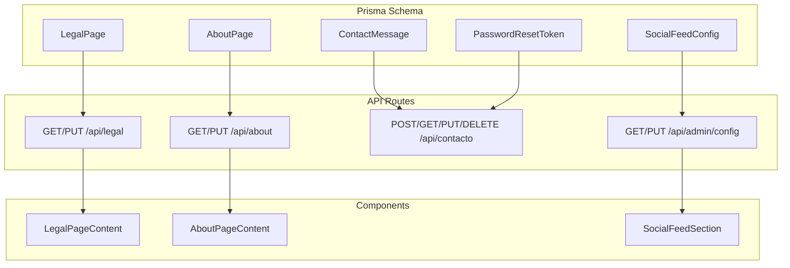
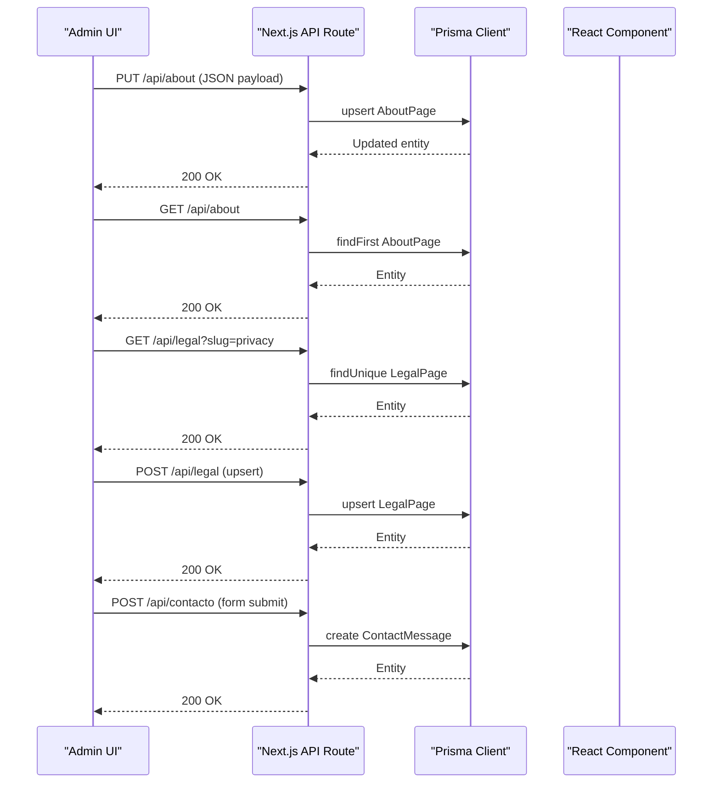
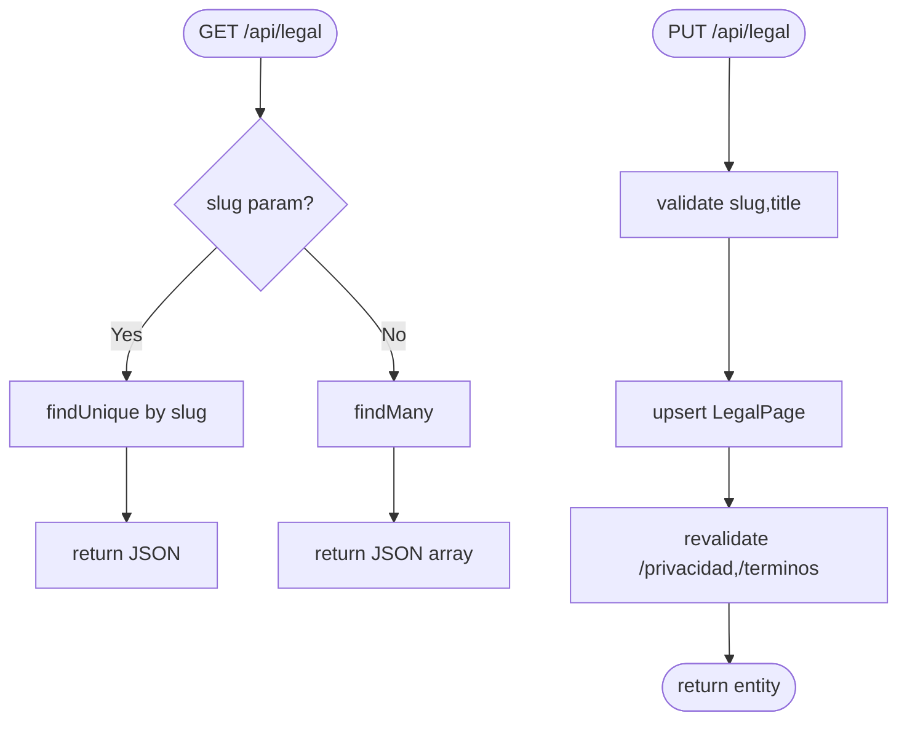
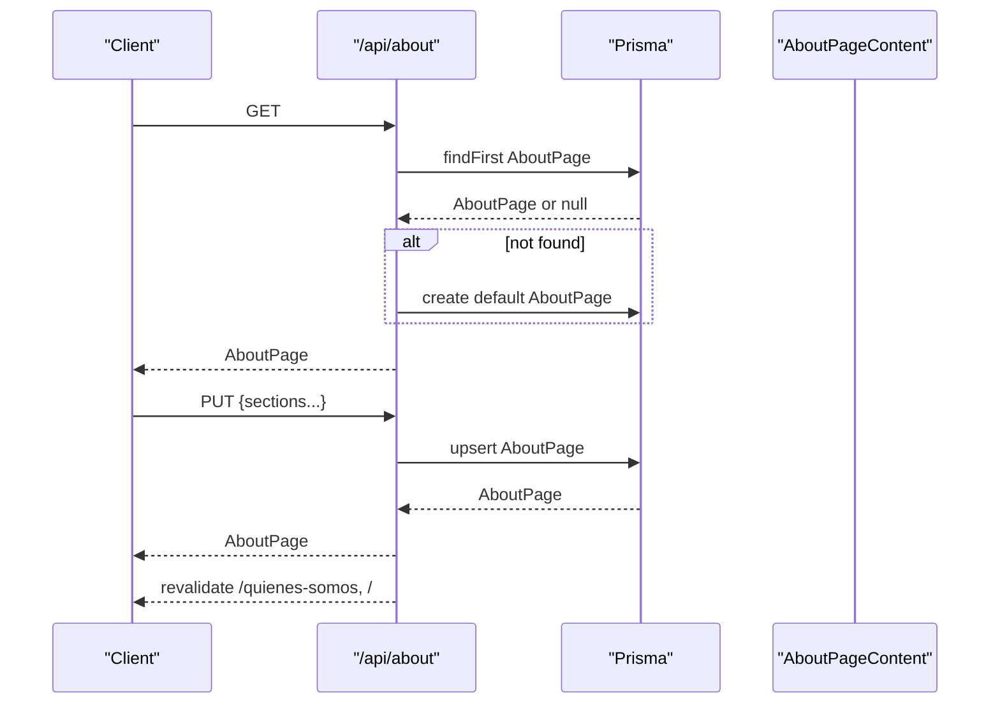
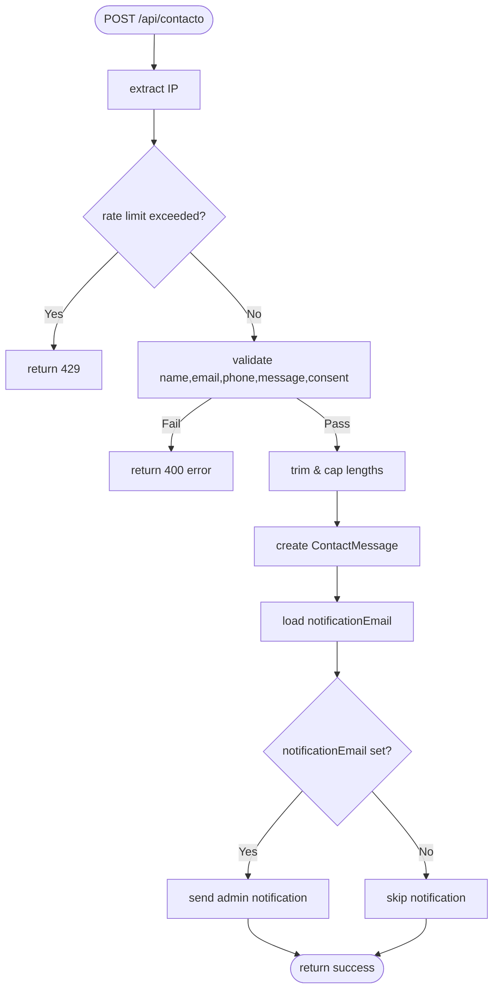
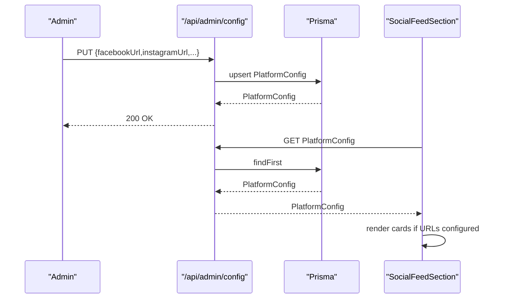
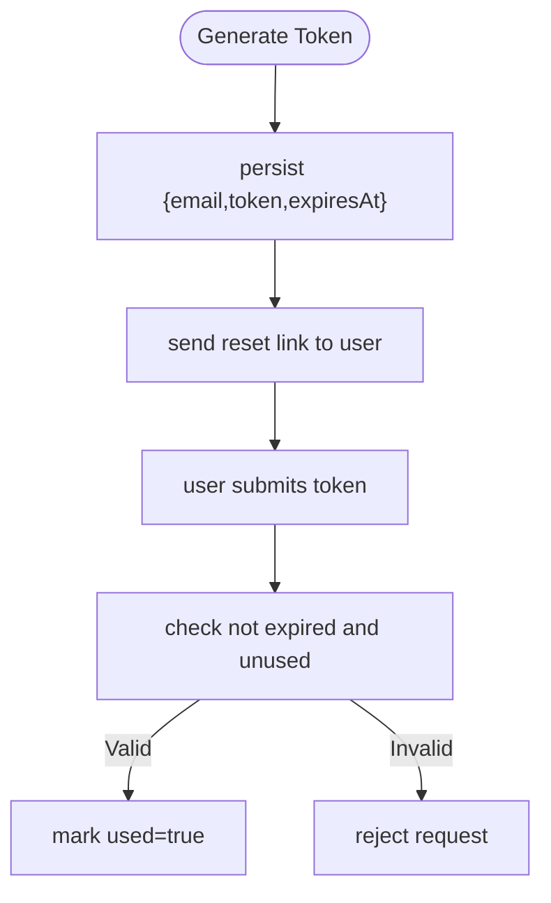
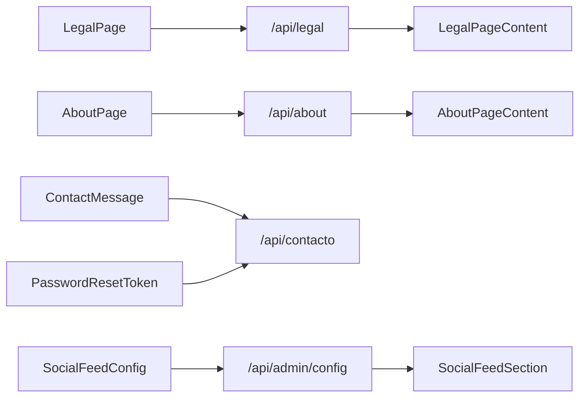

# Content Management Entities

<cite>
**Referenced Files in This Document**
- [schema.prisma](file://prisma/schema.prisma)
- [route.ts](file://src/app/api/legal/route.ts)
- [legal-page-content.tsx](file://src/components/legal-page-content.tsx)
- [route.ts](file://src/app/api/about/route.ts)
- [about-page-content.tsx](file://src/components/about-page-content.tsx)
- [route.ts](file://src/app/api/contacto/route.ts)
- [route.ts](file://src/app/api/admin/config/route.ts)
- [social-feed-section.tsx](file://src/components/social-feed-section.tsx)
- [actions.ts](file://src/lib/actions.ts)
</cite>

## Table of Contents
1. [Introduction](#introduction)
2. [Project Structure](#project-structure)
3. [Core Components](#core-components)
4. [Architecture Overview](#architecture-overview)
5. [Detailed Component Analysis](#detailed-component-analysis)
6. [Dependency Analysis](#dependency-analysis)
7. [Performance Considerations](#performance-considerations)
8. [Troubleshooting Guide](#troubleshooting-guide)
9. [Conclusion](#conclusion)

## Introduction
This document describes the content management database entities used to power the platform’s editable content system. It focuses on:
- LegalPage: Terms and Privacy policy management with markdown fallback and Editor.js block support
- AboutPage: Fully editable corporate page covering hero, history, mission/vision, values, team, statistics, and certifications
- ContactMessage: Form submission tracking with consent and read status
- SocialFeedConfig: Social media integration configuration
- PasswordResetToken: Secure password recovery tokens with expiration handling
It also documents content serialization patterns, JSON field usage, and validation strategies for each entity.

## Project Structure
The content models are defined in the Prisma schema and surfaced through Next.js App Router API routes and React components. The main entities are:
- LegalPage: markdown content with optional Editor.js blocks
- AboutPage: structured JSON fields for multiple sections
- ContactMessage: form submissions with consent and read tracking
- SocialFeedConfig: platform-specific social integrations
- PasswordResetToken: secure recovery tokens with expiration

**Diagram sources**
- [schema.prisma:160-170](file://prisma/schema.prisma#L160-L170)
- [schema.prisma:224-276](file://prisma/schema.prisma#L224-L276)
- [schema.prisma:172-186](file://prisma/schema.prisma#L172-L186)
- [schema.prisma:187-198](file://prisma/schema.prisma#L187-L198)
- [schema.prisma:213-222](file://prisma/schema.prisma#L213-L222)
- [route.ts:6-45](file://src/app/api/legal/route.ts#L6-L45)
- [route.ts:6-59](file://src/app/api/about/route.ts#L6-L59)
- [route.ts:137-229](file://src/app/api/contacto/route.ts#L137-L229)
- [route.ts:12-39](file://src/app/api/admin/config/route.ts#L12-L39)
- [legal-page-content.tsx:27-88](file://src/components/legal-page-content.tsx#L27-L88)
- [about-page-content.tsx:58-384](file://src/components/about-page-content.tsx#L58-L384)
- [social-feed-section.tsx:16-106](file://src/components/social-feed-section.tsx#L16-L106)

**Section sources**
- [schema.prisma:160-170](file://prisma/schema.prisma#L160-L170)
- [schema.prisma:224-276](file://prisma/schema.prisma#L224-L276)
- [schema.prisma:172-186](file://prisma/schema.prisma#L172-L186)
- [schema.prisma:187-198](file://prisma/schema.prisma#L187-L198)
- [schema.prisma:213-222](file://prisma/schema.prisma#L213-L222)

## Core Components
- LegalPage
  - Purpose: Store and serve terms and privacy pages with dual content modes
  - Fields: slug, title, content (markdown fallback), blocks (Editor.js JSON), manualDate, timestamps
  - API: GET single or list; PUT upsert with revalidation
  - Rendering: Editor.js blocks if present, otherwise fallback markdown; date from manualDate or updatedAt
- AboutPage
  - Purpose: Fully editable “About Us” page with multiple sections
  - Fields: Hero, History, Mission/Vision, Values, Team, Why Choose Us, CTA, Stats, Certifications, Location toggle
  - API: GET with auto-create; PUT updates all sections; cache revalidated on update
  - Rendering: JSON fields parsed per section; icons mapped by name; location via embedded map or address
- ContactMessage
  - Purpose: Track inbound form submissions with consent and read status
  - Fields: name, email, phone, company, subject, message, consent, read
  - API: POST with validations and rate limiting; GET/PUT/DELETE for admin
  - Notifications: Optional email sent to configured notification address
- SocialFeedConfig
  - Purpose: Configure social media integration (platform, embed code, tokens)
  - Fields: platform, embedCode, accessToken, pageId, active
  - API: Admin config endpoint; rendered by SocialFeedSection component
- PasswordResetToken
  - Purpose: Secure password recovery with expiration
  - Fields: email, token (unique), expiresAt, used
  - Implementation note: Model exists in schema; password reset endpoints are not shown in the provided context

**Section sources**
- [schema.prisma:160-170](file://prisma/schema.prisma#L160-L170)
- [route.ts:6-45](file://src/app/api/legal/route.ts#L6-L45)
- [legal-page-content.tsx:27-88](file://src/components/legal-page-content.tsx#L27-L88)
- [schema.prisma:224-276](file://prisma/schema.prisma#L224-L276)
- [route.ts:6-59](file://src/app/api/about/route.ts#L6-L59)
- [about-page-content.tsx:58-384](file://src/components/about-page-content.tsx#L58-L384)
- [schema.prisma:172-186](file://prisma/schema.prisma#L172-L186)
- [route.ts:137-229](file://src/app/api/contacto/route.ts#L137-L229)
- [schema.prisma:187-198](file://prisma/schema.prisma#L187-L198)
- [route.ts:12-39](file://src/app/api/admin/config/route.ts#L12-L39)
- [social-feed-section.tsx:16-106](file://src/components/social-feed-section.tsx#L16-L106)
- [schema.prisma:213-222](file://prisma/schema.prisma#L213-L222)

## Architecture Overview
The content pipeline integrates Prisma models, API routes, and React components. Admins update content via PUT endpoints; clients fetch via GET endpoints. Components parse JSON fields and render either Editor.js blocks or structured markdown.

**Diagram sources**
- [route.ts:61-147](file://src/app/api/about/route.ts#L61-L147)
- [route.ts:47-88](file://src/app/api/legal/route.ts#L47-L88)
- [route.ts:137-229](file://src/app/api/contacto/route.ts#L137-L229)
- [schema.prisma:224-276](file://prisma/schema.prisma#L224-L276)
- [schema.prisma:160-170](file://prisma/schema.prisma#L160-L170)
- [schema.prisma:172-186](file://prisma/schema.prisma#L172-L186)

## Detailed Component Analysis

### LegalPage Model
- Data model
  - Unique slug, title, markdown content, optional Editor.js blocks JSON, manualDate override, timestamps
- Serialization pattern
  - blocks stored as JSON string; parsed safely in the component; fallback to content if blocks missing
  - manualDate takes precedence over updatedAt for display
- Validation and safety
  - API requires slug and title for upsert
  - Component parses blocks with try/catch; renders placeholder if invalid
- API behavior
  - GET supports single or list; returns selected fields
  - PUT upserts LegalPage and revalidates privacy/terms pages

**Diagram sources**
- [route.ts:6-45](file://src/app/api/legal/route.ts#L6-L45)
- [route.ts:47-88](file://src/app/api/legal/route.ts#L47-L88)
- [schema.prisma:160-170](file://prisma/schema.prisma#L160-L170)

**Section sources**
- [schema.prisma:160-170](file://prisma/schema.prisma#L160-L170)
- [route.ts:6-45](file://src/app/api/legal/route.ts#L6-L45)
- [route.ts:47-88](file://src/app/api/legal/route.ts#L47-L88)
- [legal-page-content.tsx:27-88](file://src/components/legal-page-content.tsx#L27-L88)

### AboutPage Model
- Data model
  - Hero, History, Mission/Vision, Values, Team, Why Choose Us, CTA, Stats, Certifications, Location toggle
  - Values, Why Choose Us, Stats, Team, and Certifications stored as JSON strings
- Serialization pattern
  - JSON fields parsed per section; icon names mapped to Lucide components
  - Stats and values enable/disable toggles control rendering
- API behavior
  - GET returns existing record or auto-creates defaults
  - PUT updates all fields; cache revalidated on update
- Rendering logic
  - Markdown paragraphs split for history content
  - Location section renders embedded map from config or generates fallback URL

**Diagram sources**
- [route.ts:6-59](file://src/app/api/about/route.ts#L6-L59)
- [route.ts:61-147](file://src/app/api/about/route.ts#L61-L147)
- [about-page-content.tsx:58-384](file://src/components/about-page-content.tsx#L58-L384)
- [schema.prisma:224-276](file://prisma/schema.prisma#L224-L276)

**Section sources**
- [schema.prisma:224-276](file://prisma/schema.prisma#L224-L276)
- [route.ts:6-59](file://src/app/api/about/route.ts#L6-L59)
- [route.ts:61-147](file://src/app/api/about/route.ts#L61-L147)
- [about-page-content.tsx:58-384](file://src/components/about-page-content.tsx#L58-L384)

### ContactMessage Model
- Data model
  - Name, email, phone, company, subject, message, consent flag, read flag
- Validation and sanitization
  - Name length minimum, email regex, phone optional but validated, message minimum length
  - Consent required; basic input trimming and length limits
- Security and rate limiting
  - In-memory rate limiter per IP: max requests per hour window
- Persistence and notifications
  - Creates ContactMessage; optionally sends admin notification via external API using configured email

**Diagram sources**
- [route.ts:137-229](file://src/app/api/contacto/route.ts#L137-L229)
- [route.ts:22-130](file://src/app/api/contacto/route.ts#L22-L130)
- [schema.prisma:172-186](file://prisma/schema.prisma#L172-L186)

**Section sources**
- [schema.prisma:172-186](file://prisma/schema.prisma#L172-L186)
- [route.ts:137-229](file://src/app/api/contacto/route.ts#L137-L229)
- [route.ts:22-130](file://src/app/api/contacto/route.ts#L22-L130)

### SocialFeedConfig Model
- Data model
  - platform (e.g., facebook, instagram), embedCode, accessToken, pageId, active
- Integration
  - Admin config endpoint persists platform settings
  - SocialFeedSection renders cards conditionally when URLs are configured
- Rendering logic
  - Only platforms with configured URLs are shown; otherwise section is hidden

**Diagram sources**
- [route.ts:41-119](file://src/app/api/admin/config/route.ts#L41-L119)
- [social-feed-section.tsx:16-106](file://src/components/social-feed-section.tsx#L16-L106)
- [schema.prisma:187-198](file://prisma/schema.prisma#L187-L198)

**Section sources**
- [schema.prisma:187-198](file://prisma/schema.prisma#L187-L198)
- [route.ts:41-119](file://src/app/api/admin/config/route.ts#L41-L119)
- [social-feed-section.tsx:16-106](file://src/components/social-feed-section.tsx#L16-L106)

### PasswordResetToken Model
- Data model
  - email, unique token, expiresAt (1-hour TTL), used flag
- Implementation note
  - Model exists in schema; password reset endpoints are not present in the provided context
  - Typical usage: generate unique token, persist with expiry, validate on use, mark used, enforce TTL

**Diagram sources**
- [schema.prisma:213-222](file://prisma/schema.prisma#L213-L222)

**Section sources**
- [schema.prisma:213-222](file://prisma/schema.prisma#L213-L222)

## Dependency Analysis
- LegalPage
  - API depends on Prisma LegalPage model
  - Component depends on Editor.js renderer and platform config for display date
- AboutPage
  - API depends on Prisma AboutPage model
  - Component depends on icon mapping and platform config for location
- ContactMessage
  - API depends on Prisma ContactMessage model
  - API depends on platform config for notification email
- SocialFeedConfig
  - API depends on Prisma SocialFeedConfig model
  - Component depends on platform config for social links
- PasswordResetToken
  - Model defined; endpoints not shown in context

**Diagram sources**
- [schema.prisma:160-170](file://prisma/schema.prisma#L160-L170)
- [schema.prisma:224-276](file://prisma/schema.prisma#L224-L276)
- [schema.prisma:172-186](file://prisma/schema.prisma#L172-L186)
- [schema.prisma:187-198](file://prisma/schema.prisma#L187-L198)
- [schema.prisma:213-222](file://prisma/schema.prisma#L213-L222)
- [route.ts:6-45](file://src/app/api/legal/route.ts#L6-L45)
- [route.ts:6-59](file://src/app/api/about/route.ts#L6-L59)
- [route.ts:137-229](file://src/app/api/contacto/route.ts#L137-L229)
- [route.ts:12-39](file://src/app/api/admin/config/route.ts#L12-L39)
- [legal-page-content.tsx:27-88](file://src/components/legal-page-content.tsx#L27-L88)
- [about-page-content.tsx:58-384](file://src/components/about-page-content.tsx#L58-L384)
- [social-feed-section.tsx:16-106](file://src/components/social-feed-section.tsx#L16-L106)

**Section sources**
- [schema.prisma:160-170](file://prisma/schema.prisma#L160-L170)
- [schema.prisma:224-276](file://prisma/schema.prisma#L224-L276)
- [schema.prisma:172-186](file://prisma/schema.prisma#L172-L186)
- [schema.prisma:187-198](file://prisma/schema.prisma#L187-L198)
- [schema.prisma:213-222](file://prisma/schema.prisma#L213-L222)

## Performance Considerations
- JSON parsing overhead
  - LegalPage blocks and AboutPage JSON fields are parsed in components; ensure minimal unnecessary re-renders
- Cache revalidation
  - Legal and About endpoints trigger revalidation; batch updates to reduce cache churn
- Rate limiting
  - ContactMessage endpoint uses in-memory tracking; consider Redis for production scale
- Database queries
  - Prefer selective field selection in API routes to minimize payload size
  - Batch reads/writes where feasible (e.g., AboutPage single record updates)

## Troubleshooting Guide
- LegalPage blocks not rendering
  - Verify blocks field contains valid JSON; component falls back gracefully if parsing fails
  - Confirm revalidation after updates to privacy/terms pages
- AboutPage sections not showing
  - Ensure JSON fields are valid arrays/objects; check enabled flags (e.g., statsEnabled, teamEnabled)
  - Confirm platform config has required fields for location rendering
- ContactMessage validation errors
  - Check name/email/phone/message constraints; ensure consent is true
  - Review rate limiting window if receiving 429 responses
- SocialFeedSection not appearing
  - Confirm platform URLs are configured in admin config; section hides when no URLs are set
- Password reset token issues
  - Ensure token is not expired and not marked used; verify unique token constraint

**Section sources**
- [legal-page-content.tsx:27-88](file://src/components/legal-page-content.tsx#L27-L88)
- [about-page-content.tsx:58-384](file://src/components/about-page-content.tsx#L58-L384)
- [route.ts:137-229](file://src/app/api/contacto/route.ts#L137-L229)
- [social-feed-section.tsx:16-106](file://src/components/social-feed-section.tsx#L16-L106)
- [schema.prisma:213-222](file://prisma/schema.prisma#L213-L222)

## Conclusion
The content management entities provide a robust, editable foundation for legal pages, corporate storytelling, contact intake, social integration, and secure password recovery. Their design balances flexibility (JSON fields and Editor.js blocks) with safety (validation, sanitization, and controlled access) while maintaining straightforward API and component integrations.