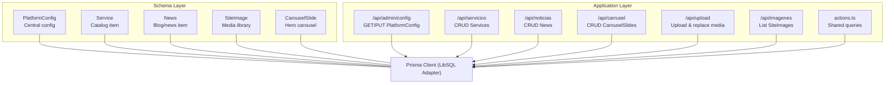
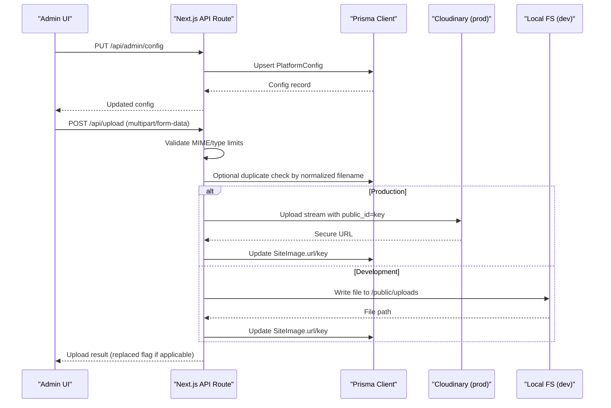
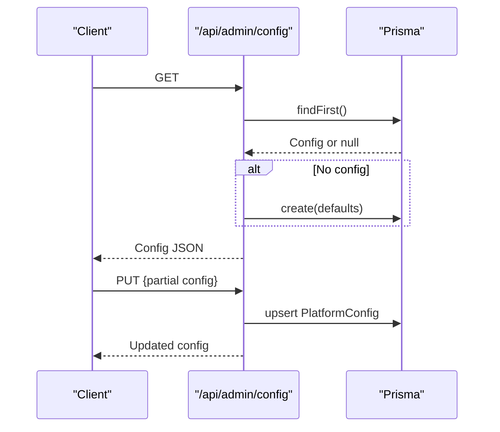
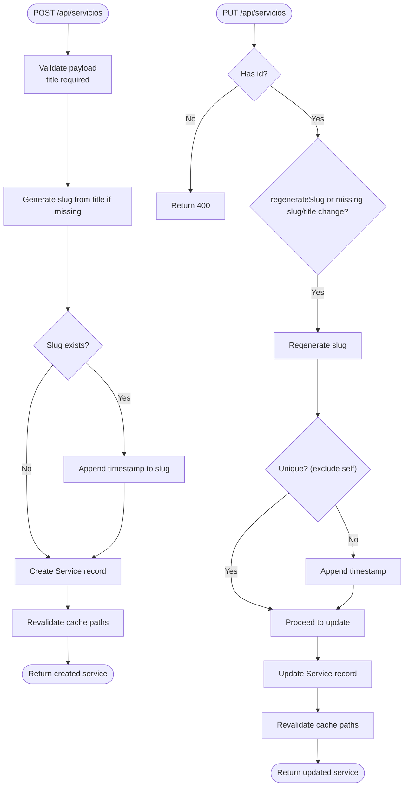
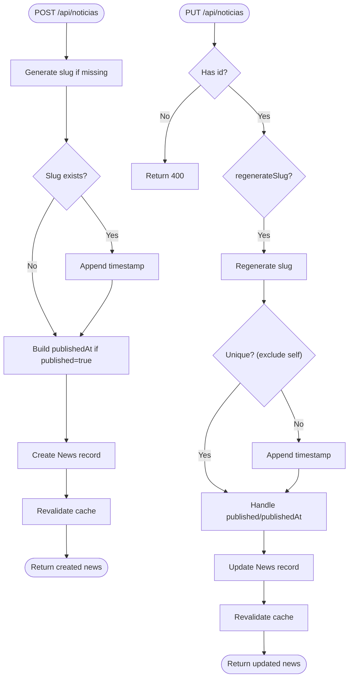
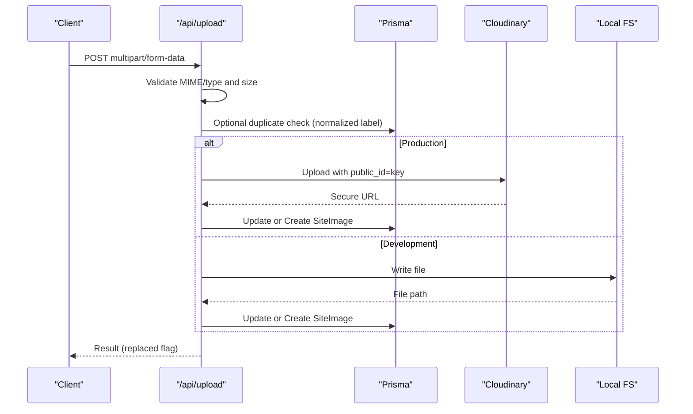
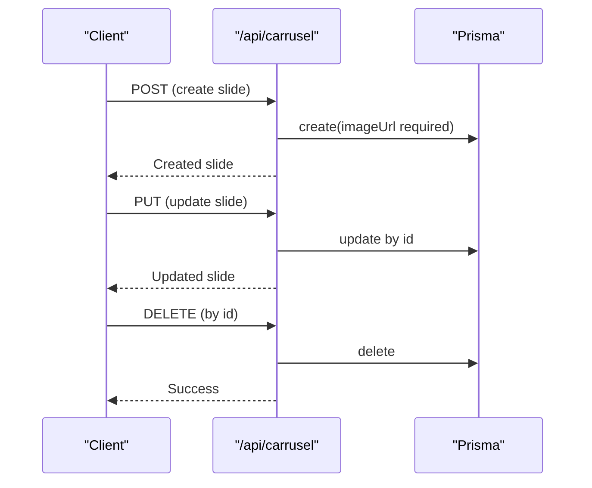
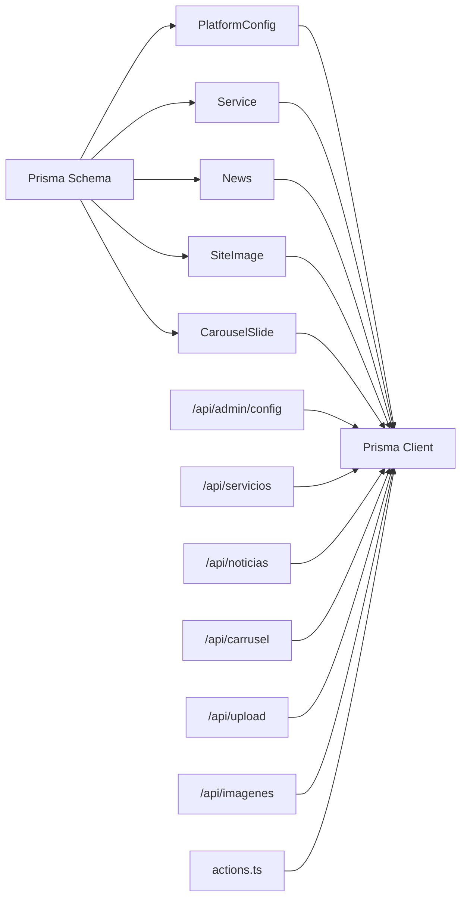

# Core Entities

<cite>
**Referenced Files in This Document**
- [schema.prisma](file://prisma/schema.prisma)
- [db.ts](file://src/lib/db.ts)
- [actions.ts](file://src/lib/actions.ts)
- [route.ts](file://src/app/api/admin/config/route.ts)
- [route.ts](file://src/app/api/servicios/route.ts)
- [route.ts](file://src/app/api/noticias/route.ts)
- [route.ts](file://src/app/api/carrusel/route.ts)
- [route.ts](file://src/app/api/upload/route.ts)
- [route.ts](file://src/app/api/imagenes/route.ts)
- [media-references.ts](file://src/lib/media-references.ts)
</cite>

## Table of Contents
1. [Introduction](#introduction)
2. [Project Structure](#project-structure)
3. [Core Components](#core-components)
4. [Architecture Overview](#architecture-overview)
5. [Detailed Component Analysis](#detailed-component-analysis)
6. [Dependency Analysis](#dependency-analysis)
7. [Performance Considerations](#performance-considerations)
8. [Troubleshooting Guide](#troubleshooting-guide)
9. [Conclusion](#conclusion)

## Introduction
This document describes the core database entities in GreenAxis and their associated business logic. It focuses on:
- PlatformConfig: central configuration hub for site settings, contact info, social links, SEO, and theme
- Service: services catalog with slug generation, ordering, and featured content
- News: blog/news items with markdown content, Editor.js blocks, publishing workflow, and featured content
- SiteImage: media management with duplicate detection and replacement logic
- CarouselSlide: hero carousel entries with customization options

Each entity's fields, defaults, validations, and operational constraints are documented alongside the APIs that manage them.

## Project Structure
The database schema is defined with Prisma and consumed by Next.js API routes and shared utilities. The database client is configured to use LibSQL/Turso adapters.

**Diagram sources**
- [schema.prisma:16-158](file://prisma/schema.prisma#L16-L158)
- [db.ts:1-21](file://src/lib/db.ts#L1-L21)
- [route.ts:1-120](file://src/app/api/admin/config/route.ts#L1-L120)
- [route.ts:1-161](file://src/app/api/servicios/route.ts#L1-L161)
- [route.ts:1-229](file://src/app/api/noticias/route.ts#L1-L229)
- [route.ts:1-122](file://src/app/api/carrusel/route.ts#L1-L122)
- [route.ts:1-452](file://src/app/api/upload/route.ts#L1-L452)
- [route.ts:1-15](file://src/app/api/imagenes/route.ts#L1-L15)
- [actions.ts:1-136](file://src/lib/actions.ts#L1-L136)

**Section sources**
- [schema.prisma:1-277](file://prisma/schema.prisma#L1-L277)
- [db.ts:1-21](file://src/lib/db.ts#L1-L21)

## Core Components

### PlatformConfig
Central configuration hub for the site. Covers branding, contact info, social links, SEO, theme, and feature toggles.

- Identity and timestamps
  - id: String (primary key, cuid)
  - createdAt: DateTime (default now)
  - updatedAt: DateTime (updatedAt)

- Branding and presentation
  - siteName: String (default "Green Axis S.A.S.")
  - siteUrl: String? (public site URL)
  - siteSlogan: String?
  - siteDescription: String? (SEO description)
  - logoUrl: String?
  - faviconUrl: String?

- Contact information
  - companyName: String?
  - companyAddress: String?
  - companyPhone: String?
  - companyEmail: String?
  - notificationEmail: String? (where contact messages are sent)

- Social networks
  - facebookUrl: String?
  - instagramUrl: String?
  - twitterUrl: String?
  - linkedinUrl: String?
  - tiktokUrl: String?
  - youtubeUrl: String?

- Footer and CTAs
  - footerText: String?
  - socialText: String? (default "Síguenos en nuestras redes")

- WhatsApp integration
  - whatsappNumber: String?
  - whatsappMessage: String? (default message)
  - whatsappShowBubble: Boolean (default true)

- About section (editable)
  - aboutImageUrl: String?
  - aboutTitle: String? (default "Comprometidos con el futuro del planeta")
  - aboutDescription: String?
  - aboutYearsExperience: String? (default "15"; stored as string to support variants)
  - aboutYearsText: String? (default "Años protegiendo el medio ambiente")
  - aboutStats: String? (JSON array of stats)
  - aboutFeatures: String? (JSON array of features)
  - aboutSectionEnabled: Boolean (default true)
  - aboutBadge: String? (default "Sobre Nosotros")
  - aboutBadgeColor: String? (default "#6BBE45")

- Map section visibility
  - showMapSection: Boolean (default true)

- SEO and analytics
  - metaKeywords: String?
  - googleAnalytics: String?
  - googleMapsEmbed: String? (Google Maps iframe)

- Theme customization
  - primaryColor: String? (default "#6BBE45")

- Business logic and defaults
  - Defaults are defined in the schema; GET endpoints initialize missing records with sensible defaults.
  - PUT endpoint accepts partial updates and converts empty strings to null for optional fields.

**Section sources**
- [schema.prisma:16-78](file://prisma/schema.prisma#L16-L78)
- [route.ts:12-119](file://src/app/api/admin/config/route.ts#L12-L119)
- [actions.ts:6-22](file://src/lib/actions.ts#L6-L22)

### Service
Services catalog with SEO-friendly slugs, ordering, activation, and featured content.

- Identity and timestamps
  - id: String (primary key, cuid)
  - createdAt: DateTime (default now)
  - updatedAt: DateTime (updatedAt)

- Content fields
  - title: String
  - slug: String? (unique; auto-generated from title if absent)
  - description: String?
  - content: String? (markdown fallback)
  - blocks: String? (Editor.js JSON blocks)

- Presentation
  - icon: String? (Lucide icon name)
  - imageUrl: String?

- Ordering and visibility
  - order: Int (default 0)
  - active: Boolean (default true)
  - featured: Boolean (default false)

- Slug generation and uniqueness
  - On creation: if slug is not provided, it is generated from title and normalized; if duplicate exists, suffix with timestamp.
  - On update: regenerate slug when requested or when title changes; ensure uniqueness excluding current record.

- Validation and constraints
  - title is required.
  - slug must be unique; enforced by database constraint.
  - order controls display order; ascending sort is used in listings.

**Section sources**
- [schema.prisma:81-96](file://prisma/schema.prisma#L81-L96)
- [route.ts:7-14](file://src/app/api/servicios/route.ts#L7-L14)
- [route.ts:39-60](file://src/app/api/servicios/route.ts#L39-L60)
- [route.ts:87-100](file://src/app/api/servicios/route.ts#L87-L100)
- [route.ts:102-125](file://src/app/api/servicios/route.ts#L102-L125)
- [actions.ts:24-37](file://src/lib/actions.ts#L24-L37)

### News
Blog/news items supporting markdown content and Editor.js blocks, with publishing workflow and featured content.

- Identity and timestamps
  - id: String (primary key, cuid)
  - createdAt: DateTime (default now)
  - updatedAt: DateTime (updatedAt)

- Content fields
  - title: String
  - slug: String (unique; auto-generated from title if absent)
  - excerpt: String? (short summary)
  - content: String (markdown)
  - blocks: String? (Editor.js JSON blocks)
  - imageUrl: String?
  - imageCaption: String?
  - showCoverInContent: Boolean (default true)

- Authoring and lifecycle
  - author: String?
  - published: Boolean (default false)
  - publishedAt: DateTime? (set when published; cleared when unpublished)

- Featured content
  - featured: Boolean (default false)

- Slug generation and uniqueness
  - On creation/update: if slug is not provided, it is generated from title; if duplicate exists, suffix with timestamp.

- Publishing workflow
  - When published=true and publishedAt is provided, store the provided date at UTC noon; if published=true but no date provided, set to current time; if published=false, clear publishedAt.

- Validation and constraints
  - title and slug are required; slug must be unique.
  - content defaults to empty string when omitted during creation.

**Section sources**
- [schema.prisma:99-118](file://prisma/schema.prisma#L99-L118)
- [route.ts:7-14](file://src/app/api/noticias/route.ts#L7-L14)
- [route.ts:64-73](file://src/app/api/noticias/route.ts#L64-L73)
- [route.ts:75-84](file://src/app/api/noticias/route.ts#L75-L84)
- [route.ts:136-153](file://src/app/api/noticias/route.ts#L136-L153)
- [route.ts:155-170](file://src/app/api/noticias/route.ts#L155-L170)
- [actions.ts:46-79](file://src/lib/actions.ts#L46-L79)

### SiteImage
Media management with duplicate detection and replacement logic.

- Identity and metadata
  - id: String (primary key, cuid)
  - key: String? (unique identifier; optional in schema; used for replacements)
  - label: String (descriptive name)
  - description: String? (optional)
  - url: String (public URL)
  - alt: String? (alternative text)
  - category: String? (hero, services, news, gallery, general, config, carousel)

- Duplicate detection
  - The schema defines a hash field for SHA-256 (commented in schema), but the current upload logic performs duplicate detection by normalizing filenames and comparing labels across the library.
  - Normalization removes extensions, timestamps, and patterns to detect near-duplicates.

- Replacement behavior
  - Upload supports replacing an existing key; old file is removed (Cloudinary in production, filesystem in development) and DB record is updated.
  - Duplicate detection can return suggestions when similar filenames are detected.

- Validation and constraints
  - key is unique; url is required; category inferred from MIME type if not provided.

**Section sources**
- [schema.prisma:121-135](file://prisma/schema.prisma#L121-L135)
- [route.ts:127-148](file://src/app/api/upload/route.ts#L127-L148)
- [route.ts:213-243](file://src/app/api/upload/route.ts#L213-L243)
- [route.ts:263-270](file://src/app/api/upload/route.ts#L263-L270)
- [route.ts:326-347](file://src/app/api/upload/route.ts#L326-L347)
- [route.ts:4-14](file://src/app/api/imagenes/route.ts#L4-L14)

### CarouselSlide
Hero carousel entries with customization options.

- Identity and timestamps
  - id: String (primary key, cuid)
  - createdAt: DateTime (default now)
  - updatedAt: DateTime (updatedAt)

- Content
  - title: String?
  - subtitle: String?
  - description: String?
  - imageUrl: String (required)
  - buttonText: String?
  - buttonUrl: String?
  - linkUrl: String? (full slide clickable link)

- Customization per slide
  - gradientEnabled: Boolean (default true)
  - animationEnabled: Boolean (default true)
  - gradientColor: String? (hex without leading #)

- Ordering and visibility
  - order: Int (default 0)
  - active: Boolean (default true)

- Validation and constraints
  - imageUrl is required; order controls display order; active filters out inactive slides.

**Section sources**
- [schema.prisma:138-158](file://prisma/schema.prisma#L138-L158)
- [route.ts:27-42](file://src/app/api/carrusel/route.ts#L27-L42)
- [route.ts:67-83](file://src/app/api/carrusel/route.ts#L67-L83)
- [actions.ts:95-108](file://src/lib/actions.ts#L95-L108)

## Architecture Overview

**Diagram sources**
- [route.ts:41-119](file://src/app/api/admin/config/route.ts#L41-L119)
- [route.ts:150-392](file://src/app/api/upload/route.ts#L150-L392)
- [db.ts:1-21](file://src/lib/db.ts#L1-L21)

## Detailed Component Analysis

### PlatformConfig API Flow

**Diagram sources**
- [route.ts:12-119](file://src/app/api/admin/config/route.ts#L12-L119)

**Section sources**
- [route.ts:12-119](file://src/app/api/admin/config/route.ts#L12-L119)
- [actions.ts:6-22](file://src/lib/actions.ts#L6-L22)

### Service CRUD and Slug Management

**Diagram sources**
- [route.ts:29-130](file://src/app/api/servicios/route.ts#L29-L130)

**Section sources**
- [route.ts:7-14](file://src/app/api/servicios/route.ts#L7-L14)
- [route.ts:39-60](file://src/app/api/servicios/route.ts#L39-L60)
- [route.ts:87-125](file://src/app/api/servicios/route.ts#L87-L125)
- [actions.ts:24-37](file://src/lib/actions.ts#L24-L37)

### News CRUD and Publishing Workflow

**Diagram sources**
- [route.ts:54-197](file://src/app/api/noticias/route.ts#L54-L197)

**Section sources**
- [route.ts:7-14](file://src/app/api/noticias/route.ts#L7-L14)
- [route.ts:64-100](file://src/app/api/noticias/route.ts#L64-L100)
- [route.ts:136-191](file://src/app/api/noticias/route.ts#L136-L191)
- [actions.ts:46-79](file://src/lib/actions.ts#L46-L79)

### SiteImage Upload and Replacement

**Diagram sources**
- [route.ts:150-392](file://src/app/api/upload/route.ts#L150-L392)

**Section sources**
- [route.ts:127-148](file://src/app/api/upload/route.ts#L127-L148)
- [route.ts:213-243](file://src/app/api/upload/route.ts#L213-L243)
- [route.ts:263-347](file://src/app/api/upload/route.ts#L263-L347)
- [route.ts:4-14](file://src/app/api/imagenes/route.ts#L4-L14)

### CarouselSlide CRUD

**Diagram sources**
- [route.ts:18-121](file://src/app/api/carrusel/route.ts#L18-L121)

**Section sources**
- [route.ts:6-16](file://src/app/api/carrusel/route.ts#L6-L16)
- [route.ts:27-42](file://src/app/api/carrusel/route.ts#L27-L42)
- [route.ts:67-83](file://src/app/api/carrusel/route.ts#L67-L83)
- [route.ts:109-116](file://src/app/api/carrusel/route.ts#L109-L116)
- [actions.ts:95-108](file://src/lib/actions.ts#L95-L108)

## Dependency Analysis

**Diagram sources**
- [schema.prisma:16-158](file://prisma/schema.prisma#L16-L158)
- [db.ts:1-21](file://src/lib/db.ts#L1-L21)
- [route.ts:1-120](file://src/app/api/admin/config/route.ts#L1-L120)
- [route.ts:1-161](file://src/app/api/servicios/route.ts#L1-L161)
- [route.ts:1-229](file://src/app/api/noticias/route.ts#L1-L229)
- [route.ts:1-122](file://src/app/api/carrusel/route.ts#L1-L122)
- [route.ts:1-452](file://src/app/api/upload/route.ts#L1-L452)
- [route.ts:1-15](file://src/app/api/imagenes/route.ts#L1-L15)
- [actions.ts:1-136](file://src/lib/actions.ts#L1-L136)

**Section sources**
- [schema.prisma:1-277](file://prisma/schema.prisma#L1-L277)
- [db.ts:1-21](file://src/lib/db.ts#L1-L21)

## Performance Considerations
- Indexes and uniqueness
  - Unique constraints on slug fields (Service, News, LegalPage) prevent duplicate URLs and enable efficient lookups.
- Sorting and pagination
  - Services and News are sorted by order or creation date; consider adding composite indexes for frequent queries (e.g., published + createdAt for News).
- Media storage
  - Production uses Cloudinary for scalable storage; development writes to local filesystem. For high traffic, prefer Cloudinary consistently.
- Caching
  - API routes trigger cache revalidation after mutations; ensure CDN/cache policies align with revalidation strategy.

## Troubleshooting Guide
- Authentication failures
  - Admin-only endpoints return 401 when not authenticated. Verify session and admin role checks.
- Slug conflicts
  - When creating/updating Service or News, duplicates are suffixed with a timestamp. If slug remains duplicated, adjust title or slug manually.
- File uploads
  - Allowed MIME types and sizes vary by environment. Large files in production should be uploaded directly to Cloudinary.
  - Duplicate detection compares normalized filenames; if false positives occur, adjust labels or disable duplicate check intentionally.
- Media replacement
  - Replacements update SiteImage records and remove old files. If old files persist, verify Cloudinary or filesystem cleanup succeeded.
- Reference updates
  - Use media reference utilities to locate and update references when replacing or deleting media across PlatformConfig, News, CarouselSlide, LegalPage, and AboutPage.

**Section sources**
- [route.ts:13-17](file://src/app/api/admin/config/route.ts#L13-L17)
- [route.ts:30-34](file://src/app/api/servicios/route.ts#L30-L34)
- [route.ts:55-58](file://src/app/api/noticias/route.ts#L55-L58)
- [route.ts:170-200](file://src/app/api/upload/route.ts#L170-L200)
- [route.ts:213-243](file://src/app/api/upload/route.ts#L213-L243)
- [media-references.ts:65-181](file://src/lib/media-references.ts#L65-L181)

## Conclusion
The core entities in GreenAxis are designed around practical CMS needs: centralized configuration, structured content (services and news), robust media management with duplication safeguards, and customizable hero carousel entries. The schema enforces uniqueness and defaults, while API routes implement slug generation, publishing workflows, and replacement logic. Following the documented constraints and validation rules ensures consistent behavior across the platform.