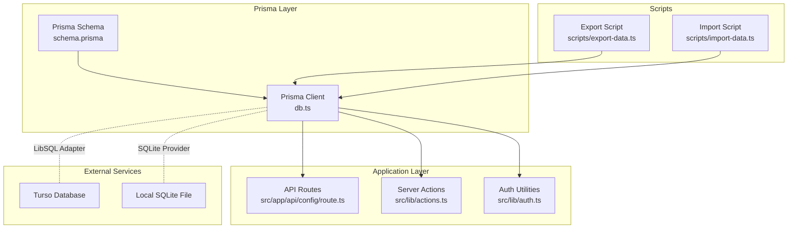
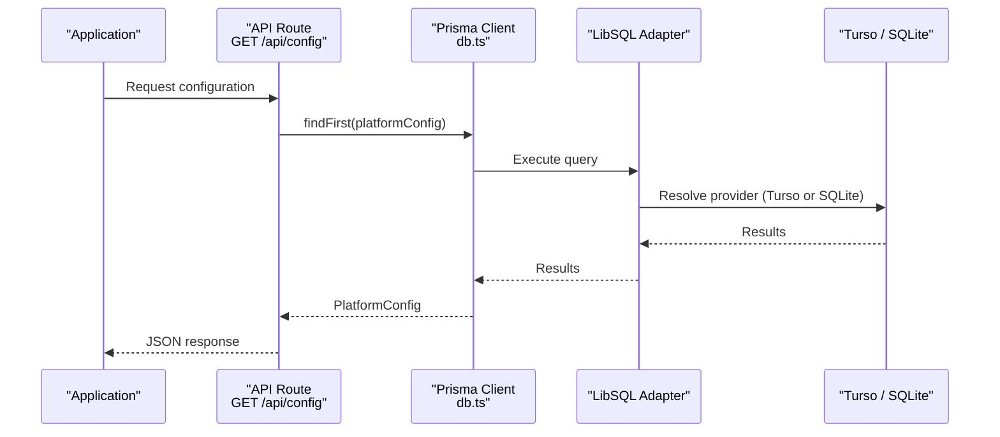
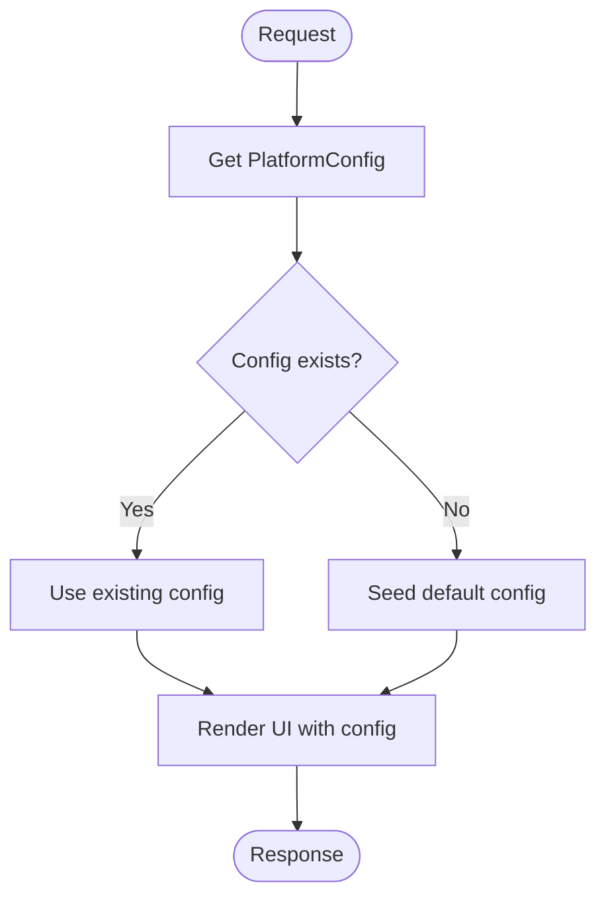
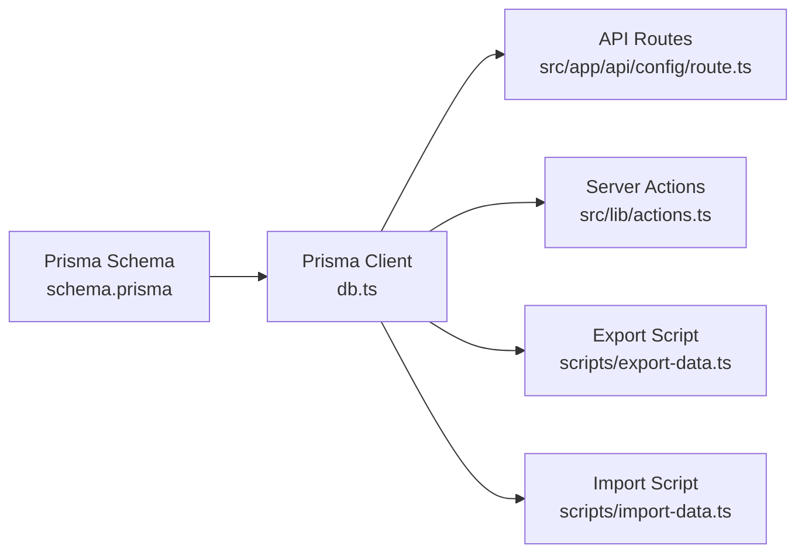

# Data Model Overview

<cite>
**Referenced Files in This Document**
- [schema.prisma](file://prisma/schema.prisma)
- [db.ts](file://src/lib/db.ts)
- [actions.ts](file://src/lib/actions.ts)
- [route.ts](file://src/app/api/config/route.ts)
- [export-data.ts](file://scripts/export-data.ts)
- [import-data.ts](file://scripts/import-data.ts)
- [package.json](file://package.json)
- [auth.ts](file://src/lib/auth.ts)
- [middleware.ts](file://src/middleware.ts)
</cite>

## Table of Contents
1. [Introduction](#introduction)
2. [Project Structure](#project-structure)
3. [Core Components](#core-components)
4. [Architecture Overview](#architecture-overview)
5. [Detailed Component Analysis](#detailed-component-analysis)
6. [Dependency Analysis](#dependency-analysis)
7. [Performance Considerations](#performance-considerations)
8. [Troubleshooting Guide](#troubleshooting-guide)
9. [Conclusion](#conclusion)

## Introduction
This document presents a comprehensive data model overview for the GreenAxis application. It explains the database architecture, Prisma ORM configuration with the LibSQL adapter, and Turso distributed database integration. It documents the centralized PlatformConfig model as the main configuration hub and how it relates to all other entities. It also covers database provider setup, connection management, migration strategies, Prisma client initialization, transaction handling, error management patterns, and the relationship between the SQLite provider and the LibSQL adapter for distributed database capabilities.

## Project Structure
The data model is defined in the Prisma schema and consumed by the application via a shared Prisma client initialized with the LibSQL adapter. Scripts support export/import operations and demonstrate connection logic for Turso and local SQLite. The application’s API routes and server actions interact with the database through this client.

**Diagram sources**
- [schema.prisma:1-277](file://prisma/schema.prisma#L1-L277)
- [db.ts:1-21](file://src/lib/db.ts#L1-L21)
- [route.ts:1-60](file://src/app/api/config/route.ts#L1-L60)
- [actions.ts:1-136](file://src/lib/actions.ts#L1-L136)
- [export-data.ts:1-62](file://scripts/export-data.ts#L1-L62)
- [import-data.ts:1-82](file://scripts/import-data.ts#L1-L82)

**Section sources**
- [schema.prisma:1-277](file://prisma/schema.prisma#L1-L277)
- [db.ts:1-21](file://src/lib/db.ts#L1-L21)
- [package.json:1-116](file://package.json#L1-L116)

## Core Components
- Centralized configuration model: PlatformConfig serves as the single source of truth for branding, contact info, social links, SEO/analytics, theming, and feature toggles.
- Prisma schema: Defines all domain models (Service, News, SiteImage, CarouselSlide, LegalPage, ContactMessage, SocialFeedConfig, Admin, PasswordResetToken, AboutPage) and their relations.
- Prisma client with LibSQL adapter: Initializes the client with Turso credentials or falls back to a local SQLite file.
- Application integration: API routes and server actions query and mutate data through the shared client.
- Migration and maintenance: Package scripts and dedicated scripts support generation, migrations, and data export/import.

Key implementation references:
- Centralized configuration retrieval and seeding: [getPlatformConfig:6-22](file://src/lib/actions.ts#L6-L22)
- Turso vs local fallback connection: [createPrismaClient:9-22](file://scripts/export-data.ts#L9-L22)
- Prisma client initialization with LibSQL adapter: [db.ts:14-19](file://src/lib/db.ts#L14-L19)

**Section sources**
- [schema.prisma:16-78](file://prisma/schema.prisma#L16-L78)
- [actions.ts:6-22](file://src/lib/actions.ts#L6-L22)
- [export-data.ts:9-22](file://scripts/export-data.ts#L9-L22)
- [db.ts:14-19](file://src/lib/db.ts#L14-L19)

## Architecture Overview
The database architecture centers on a single-file SQLite provider configured in Prisma, but executed through the LibSQL adapter to enable Turso connectivity. The LibSQL adapter allows the same Prisma schema and client to target either:
- Turso (online distributed database) when Turso environment variables are present, or
- Local SQLite file when Turso variables are absent.

**Diagram sources**
- [route.ts:7-28](file://src/app/api/config/route.ts#L7-L28)
- [db.ts:14-19](file://src/lib/db.ts#L14-L19)
- [export-data.ts:9-22](file://scripts/export-data.ts#L9-L22)

**Section sources**
- [schema.prisma:9-13](file://prisma/schema.prisma#L9-L13)
- [db.ts:5-8](file://src/lib/db.ts#L5-L8)
- [export-data.ts:9-22](file://scripts/export-data.ts#L9-L22)

## Detailed Component Analysis

### Prisma ORM and Database Provider Setup
- Provider: sqlite configured in Prisma schema.
- Driver adapters: enabled via preview feature to use LibSQL adapter.
- Connection resolution: Turso URL and auth token determine whether to connect to Turso or fall back to a local file path.

Implementation references:
- Provider and adapter configuration: [schema.prisma:4-13](file://prisma/schema.prisma#L4-L13)
- LibSQL adapter instantiation and client creation: [db.ts:5-19](file://src/lib/db.ts#L5-L19)
- Turso vs local selection logic: [export-data.ts:9-22](file://scripts/export-data.ts#L9-L22)

**Section sources**
- [schema.prisma:4-13](file://prisma/schema.prisma#L4-L13)
- [db.ts:5-19](file://src/lib/db.ts#L5-L19)
- [export-data.ts:9-22](file://scripts/export-data.ts#L9-L22)

### Turso Distributed Database Integration
- Environment-driven connectivity: When Turso variables are set, the LibSQL adapter connects to Turso; otherwise, it uses a local SQLite file.
- Export/import scripts demonstrate this dual-mode behavior and confirm compatibility with LibSQL semantics.

References:
- Turso connection in export script: [export-data.ts:10-21](file://scripts/export-data.ts#L10-L21)
- Turso connection in import script: [import-data.ts:5-10](file://scripts/import-data.ts#L5-L10)

**Section sources**
- [export-data.ts:10-21](file://scripts/export-data.ts#L10-L21)
- [import-data.ts:5-10](file://scripts/import-data.ts#L5-L10)

### Centralized PlatformConfig Model
- Purpose: Single configuration entity encompassing branding, contact info, social links, SEO/analytics, theming, and feature flags.
- Access patterns: API routes and server actions retrieve and update PlatformConfig; missing records are seeded automatically.

References:
- Model definition: [schema.prisma:16-78](file://prisma/schema.prisma#L16-L78)
- Retrieval and seeding: [getPlatformConfig:6-22](file://src/lib/actions.ts#L6-L22)
- API endpoint for config: [route.ts:7-28](file://src/app/api/config/route.ts#L7-L28)

**Section sources**
- [schema.prisma:16-78](file://prisma/schema.prisma#L16-L78)
- [actions.ts:6-22](file://src/lib/actions.ts#L6-L22)
- [route.ts:7-28](file://src/app/api/config/route.ts#L7-L28)

### Related Entities and Their Roles
- Service: Company offerings with SEO-friendly slugs and Editor.js content.
- News: Blog/news items with optional Editor.js blocks and publication controls.
- SiteImage: Media library entries with categorization and deduplication hash.
- CarouselSlide: Hero carousel entries with customization options.
- LegalPage: Static legal content pages (terms, privacy).
- ContactMessage: Lead/contact submissions with consent tracking.
- SocialFeedConfig: Social media feed embedding configuration.
- Admin and PasswordResetToken: Authentication and session management for administrators.
- AboutPage: Extended “About Us” content and statistics.

References:
- Entity definitions: [schema.prisma:80-276](file://prisma/schema.prisma#L80-L276)

**Section sources**
- [schema.prisma:80-276](file://prisma/schema.prisma#L80-L276)

### Prisma Client Initialization and Connection Management
- Singleton pattern: A global object holds the Prisma client instance to avoid multiple clients.
- Logging: Queries are logged during development.
- Adapter wiring: The LibSQL adapter is passed to the Prisma client constructor.

References:
- Client initialization and adapter: [db.ts:14-19](file://src/lib/db.ts#L14-L19)

**Section sources**
- [db.ts:14-19](file://src/lib/db.ts#L14-L19)

### Transaction Handling and Error Management Patterns
- Transactions: No explicit transaction blocks are used in the reviewed code; operations are executed individually.
- Error handling: API routes wrap database operations in try/catch and return structured error responses with appropriate HTTP status codes.
- Middleware: Security headers are applied globally to HTTP responses.

References:
- API error handling: [route.ts:24-27](file://src/app/api/config/route.ts#L24-L27)
- Middleware security headers: [middleware.ts:8-43](file://src/middleware.ts#L8-L43)

**Section sources**
- [route.ts:24-27](file://src/app/api/config/route.ts#L24-L27)
- [middleware.ts:8-43](file://src/middleware.ts#L8-L43)

### Migration Strategies
- Prisma CLI scripts: The project defines scripts for generating clients, pushing schema, creating migrations, resetting databases, and exporting/importing data.
- Migration commands: db:generate, db:migrate, db:reset are available in package.json scripts.

References:
- Scripts section: [package.json:5-15](file://package.json#L5-L15)

**Section sources**
- [package.json:5-15](file://package.json#L5-L15)

### Data Flow Between PlatformConfig and Other Entities

**Diagram sources**
- [actions.ts:6-22](file://src/lib/actions.ts#L6-L22)
- [route.ts:7-28](file://src/app/api/config/route.ts#L7-L28)

## Dependency Analysis
The application depends on Prisma for schema and client generation, and on the LibSQL adapter to target Turso or local SQLite. Scripts depend on the same adapter logic to export/import data consistently.

**Diagram sources**
- [schema.prisma:1-277](file://prisma/schema.prisma#L1-L277)
- [db.ts:1-21](file://src/lib/db.ts#L1-L21)
- [route.ts:1-60](file://src/app/api/config/route.ts#L1-L60)
- [actions.ts:1-136](file://src/lib/actions.ts#L1-L136)
- [export-data.ts:1-62](file://scripts/export-data.ts#L1-L62)
- [import-data.ts:1-82](file://scripts/import-data.ts#L1-L82)

**Section sources**
- [schema.prisma:1-277](file://prisma/schema.prisma#L1-L277)
- [db.ts:1-21](file://src/lib/db.ts#L1-L21)
- [route.ts:1-60](file://src/app/api/config/route.ts#L1-L60)
- [actions.ts:1-136](file://src/lib/actions.ts#L1-L136)
- [export-data.ts:1-62](file://scripts/export-data.ts#L1-L62)
- [import-data.ts:1-82](file://scripts/import-data.ts#L1-L82)

## Performance Considerations
- Client lifecycle: The singleton client avoids repeated initialization overhead.
- Logging: Query logging is enabled in development; disable or reduce in production to minimize overhead.
- Batch operations: Consider using createMany or updateMany for bulk inserts/updates when applicable.
- Indexes: Add database-level indexes for frequently queried fields (e.g., unique slugs) as needed.
- Connection pooling: For production workloads, evaluate connection pooling and adapter-specific tuning.

[No sources needed since this section provides general guidance]

## Troubleshooting Guide
Common issues and resolutions:
- Turso connectivity errors: Verify TURSO_DATABASE_URL and TURSO_AUTH_TOKEN environment variables are set and correct.
- Local fallback behavior: If Turso variables are missing, the client falls back to a local file path; ensure DATABASE_URL points to a valid SQLite file.
- Migration failures: Use db:migrate and db:reset scripts to reconcile schema changes.
- Export/import mismatches: Confirm both scripts use the LibSQL adapter and that Turso credentials are present for import/export operations.
- API errors: Inspect route error handling for 500 responses and logs.

References:
- Turso environment checks: [export-data.ts:10-16](file://scripts/export-data.ts#L10-L16)
- Client initialization: [db.ts:14-19](file://src/lib/db.ts#L14-L19)
- Migration scripts: [package.json:10-13](file://package.json#L10-L13)
- API error handling: [route.ts:24-27](file://src/app/api/config/route.ts#L24-L27)

**Section sources**
- [export-data.ts:10-16](file://scripts/export-data.ts#L10-L16)
- [db.ts:14-19](file://src/lib/db.ts#L14-L19)
- [package.json:10-13](file://package.json#L10-L13)
- [route.ts:24-27](file://src/app/api/config/route.ts#L24-L27)

## Conclusion
GreenAxis employs a clean, centralized configuration model via PlatformConfig and a flexible database layer powered by Prisma with the LibSQL adapter. This design enables seamless operation against Turso for distributed scalability or local SQLite for development and lightweight deployments. The schema encompasses all major content and administrative entities, while scripts and API routes provide robust operational workflows for configuration, content management, and data portability.