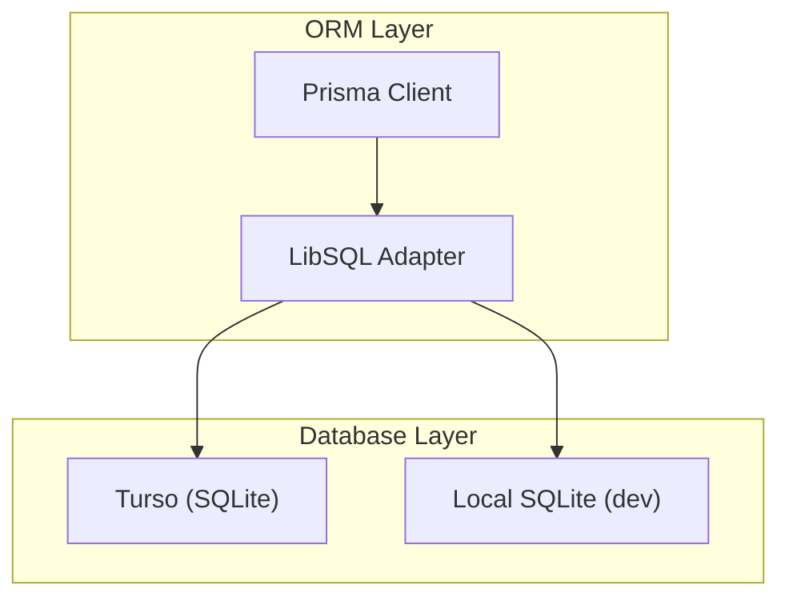
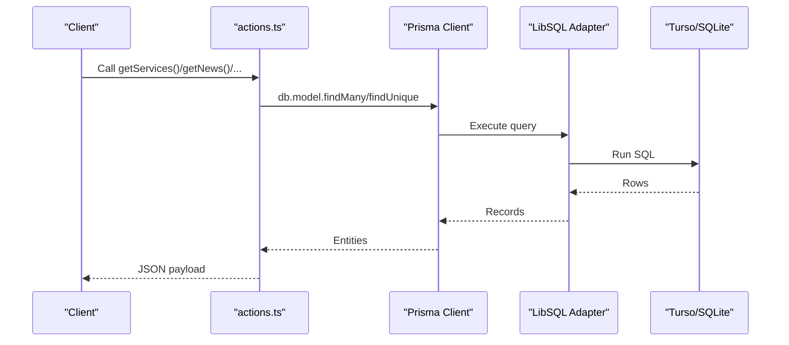
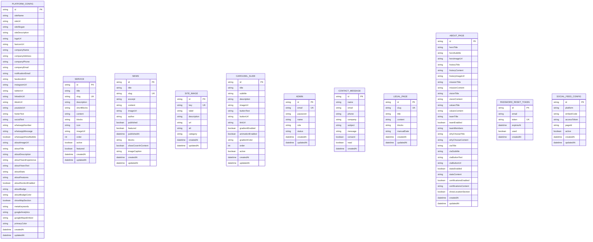
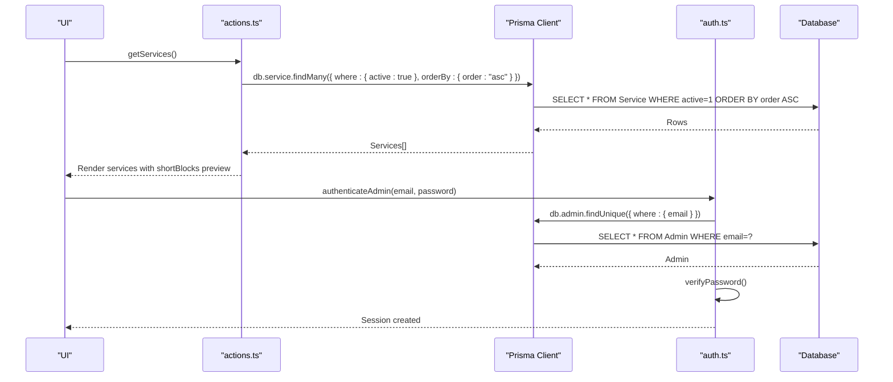
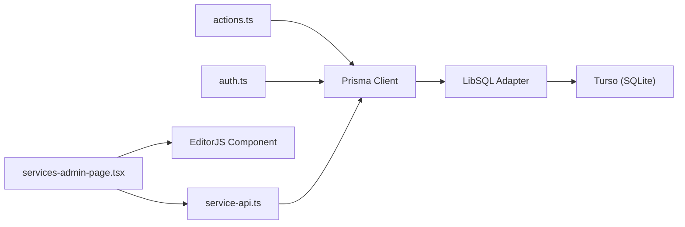

# Database Design & Data Model

<cite>
**Referenced Files in This Document**
- [schema.prisma](file://prisma/schema.prisma)
- [db.ts](file://src/lib/db.ts)
- [custom.db.sql](file://db/custom.db.sql)
- [custom1.db.sql](file://db/custom1.db.sql)
- [actions.ts](file://src/lib/actions.ts)
- [auth.ts](file://src/lib/auth.ts)
- [route.ts](file://src/app/api/servicios/route.ts)
- [ensure-service-columns.ts](file://scripts/ensure-service-columns.ts)
- [services-section.tsx](file://src/components/services-section.tsx)
- [service-detail-content.tsx](file://src/components/service-detail-content.tsx)
- [page.tsx](file://src/app/admin/servicios/page.tsx)
</cite>

## Update Summary
**Changes Made**
- Updated Service entity documentation to include the new `shortBlocks` column
- Added content management enhancement details for separate preview and detailed content representations
- Updated data access patterns to reflect the new column handling
- Enhanced service management interface documentation
- Updated data validation rules to include the new content field

## Table of Contents
1. [Introduction](#introduction)
2. [Project Structure](#project-structure)
3. [Core Components](#core-components)
4. [Architecture Overview](#architecture-overview)
5. [Detailed Component Analysis](#detailed-component-analysis)
6. [Dependency Analysis](#dependency-analysis)
7. [Performance Considerations](#performance-considerations)
8. [Troubleshooting Guide](#troubleshooting-guide)
9. [Conclusion](#conclusion)
10. [Appendices](#appendices)

## Introduction
This document describes the GreenAxis database schema and data model, focusing on the entities PlatformConfig, Service, News, CarouselSlide, SiteImage, Admin, ContactMessage, LegalPage, AboutPage, PasswordResetToken, and SocialFeedConfig. It documents primary/foreign keys, indexes, constraints, validation rules, business logic, ORM access patterns, caching strategies, performance considerations, data lifecycle, retention, archival rules, migration paths, and security/privacy/access control mechanisms.

**Updated** Enhanced with documentation for the new `shortBlocks` column in the services table, providing separate preview and detailed content representations for improved content management.

## Project Structure
The database schema is defined via Prisma and backed by SQLite/Turso. The Prisma client is configured to use a LibSQL adapter for production-like environments. The schema file defines all models, field types, defaults, and relations. Two SQL dump files define the initial database structure and indexes.

**Diagram sources**
- [db.ts:1-21](file://src/lib/db.ts#L1-L21)
- [schema.prisma:1-277](file://prisma/schema.prisma#L1-L277)

**Section sources**
- [db.ts:1-21](file://src/lib/db.ts#L1-L21)
- [schema.prisma:1-277](file://prisma/schema.prisma#L1-L277)

## Core Components
This section documents each entity's schema, constraints, and business rules.

- PlatformConfig
  - Purpose: Global site configuration (branding, contact, social links, SEO, analytics, theme).
  - Primary key: id (String, cuid).
  - Defaults: Many string fields have sensible defaults for branding and messaging.
  - Indexes: None declared in Prisma; no explicit indexes in SQL dumps.
  - Constraints: Non-null defaults for core branding fields; optional contact and social URLs; JSON-like fields stored as strings (e.g., stats, features).
  - Validation/business logic: Defaults ensure minimal configuration exists out-of-the-box; JSON fields should be validated by application logic before persistence.
  - Access patterns: Retrieved via a singleton query; created with defaults if missing.

- Service
  - Purpose: Services offered by the company with rich content support.
  - Primary key: id (String, cuid).
  - Unique index: slug.
  - Fields: title, slug, description, **shortBlocks**, content, blocks (EditorJS JSON), icon, imageUrl, order, active, featured.
  - Defaults: order=0, active=true, featured=false.
  - Validation/business logic: active controls visibility; featured highlights; slug uniqueness ensures SEO-friendly URLs.
  - **Enhanced** The new `shortBlocks` column provides separate preview content representation for service listings, while `content` serves as fallback markdown and `blocks` contains full EditorJS JSON for detail pages.

- News
  - Purpose: Blog/news articles with rich content and publishing workflow.
  - Primary key: id (String, cuid).
  - Unique index: slug.
  - Fields: title, slug, excerpt, content (markdown), imageUrl, author, published, featured, publishedAt, blocks (EditorJS JSON), showCoverInContent, imageCaption.
  - Defaults: published=false, featured=false, showCoverInContent=true.
  - Validation/business logic: published flag controls listing; publishedAt tracks publication timestamp; blocks/content provide fallback rendering.

- SiteImage
  - Purpose: Media library entries with categorization and metadata.
  - Primary key: id (String, cuid).
  - Unique index: key.
  - Fields: key (optional now), label, description, url, alt, category, hash (SHA-256), createdAt/updatedAt.
  - Defaults: None; note that SQL dump still declares key NOT NULL, while Prisma allows key to be nullable.
  - Validation/business logic: hash supports duplicate detection; category enables filtering; key uniqueness prevents collisions.

- CarouselSlide
  - Purpose: Hero carousel slides with customization options.
  - Primary key: id (String, cuid).
  - Fields: title, subtitle, description, imageUrl, buttonText, buttonUrl, linkUrl, gradientEnabled, animationEnabled, gradientColor, order, active, createdAt/updatedAt.
  - Defaults: gradientEnabled=true, animationEnabled=true, order=0, active=true.
  - Validation/business logic: active=true filters to visible slides; order controls presentation sequence.

- Admin
  - Purpose: System administrators with roles and status.
  - Primary key: id (String, cuid).
  - Unique index: email.
  - Fields: email, password (hashed), name, role (default "admin"), status (default "pendiente").
  - Defaults: role="admin", status="pendiente".
  - Validation/business logic: role/status govern access and approval flow; password stored hashed.

- ContactMessage
  - Purpose: Lead/contact submissions with consent/read tracking.
  - Primary key: id (String, cuid).
  - Fields: name, email, phone, company, subject, message, consent (default false), read (default false).
  - Defaults: consent=false, read=false.
  - Validation/business logic: consent required by policy; read flag helps triage.

- LegalPage
  - Purpose: Static legal pages (Terms, Privacy).
  - Primary key: id (String, cuid).
  - Unique index: slug.
  - Fields: slug, title, content (markdown), blocks (EditorJS JSON), manualDate, createdAt/updatedAt.
  - Defaults: None.
  - Validation/business logic: slug uniqueness; manualDate allows manual update timestamps.

- AboutPage
  - Purpose: Comprehensive "About Us" content with multiple sections.
  - Primary key: id (String, cuid).
  - Fields: Hero, History, Mission/Vision, Values, Team, Why Choose Us, CTA, Stats, Certifications, Location toggles and content (JSON/text).
  - Defaults: Many sections enabled/disabled by default; JSON fields for structured content.
  - Validation/business logic: JSON fields should be validated; team/stats/certifications are optional.

- PasswordResetToken
  - Purpose: Secure password reset tokens with expiry.
  - Primary key: id (String, cuid).
  - Unique index: token.
  - Fields: email, token, expiresAt, used (default false).
  - Defaults: used=false.
  - Validation/business logic: expiresAt enforces 1-hour lifetime; used flag prevents reuse.

- SocialFeedConfig
  - Purpose: Social media feed embedding/configuration.
  - Primary key: id (String, cuid).
  - Fields: platform, embedCode, accessToken, pageId, active (default true).
  - Defaults: active=true.
  - Validation/business logic: active=true filters enabled configs; platform identifies provider.

**Section sources**
- [schema.prisma:16-78](file://prisma/schema.prisma#L16-L78)
- [schema.prisma:81-96](file://prisma/schema.prisma#L81-L96)
- [schema.prisma:99-118](file://prisma/schema.prisma#L99-L118)
- [schema.prisma:121-135](file://prisma/schema.prisma#L121-L135)
- [schema.prisma:138-158](file://prisma/schema.prisma#L138-L158)
- [schema.prisma:201-211](file://prisma/schema.prisma#L201-L211)
- [schema.prisma:173-185](file://prisma/schema.prisma#L173-L185)
- [schema.prisma:161-170](file://prisma/schema.prisma#L161-L170)
- [schema.prisma:225-276](file://prisma/schema.prisma#L225-L276)
- [schema.prisma:214-222](file://prisma/schema.prisma#L214-L222)
- [schema.prisma:188-198](file://prisma/schema.prisma#L188-L198)
- [custom.db.sql:114-156](file://db/custom.db.sql#L114-L156)
- [custom.db.sql:157-170](file://db/custom.db.sql#L157-L170)
- [custom.db.sql:87-104](file://db/custom.db.sql#L87-L104)
- [custom.db.sql:171-183](file://db/custom.db.sql#L171-L183)
- [custom.db.sql:45-62](file://db/custom.db.sql#L45-L62)
- [custom.db.sql:34-44](file://db/custom.db.sql#L34-L44)
- [custom.db.sql:63-75](file://db/custom.db.sql#L63-L75)
- [custom.db.sql:76-86](file://db/custom.db.sql#L76-L86)
- [custom.db.sql:184-194](file://db/custom.db.sql#L184-L194)
- [custom.db.sql:105-113](file://db/custom.db.sql#L105-L113)
- [custom.db.sql:195-209](file://db/custom.db.sql#L195-L209)

## Architecture Overview
The data access layer uses Prisma with a LibSQL adapter. Production uses Turso; development uses a local SQLite file. Application logic retrieves and mutates data via action functions.

**Diagram sources**
- [actions.ts:1-136](file://src/lib/actions.ts#L1-L136)
- [db.ts:1-21](file://src/lib/db.ts#L1-L21)
- [schema.prisma:1-277](file://prisma/schema.prisma#L1-L277)

## Detailed Component Analysis

### Data Model ER Diagram

**Diagram sources**
- [schema.prisma:16-78](file://prisma/schema.prisma#L16-L78)
- [schema.prisma:81-96](file://prisma/schema.prisma#L81-L96)
- [schema.prisma:99-118](file://prisma/schema.prisma#L99-L118)
- [schema.prisma:121-135](file://prisma/schema.prisma#L121-L135)
- [schema.prisma:138-158](file://prisma/schema.prisma#L138-L158)
- [schema.prisma:201-211](file://prisma/schema.prisma#L201-L211)
- [schema.prisma:173-185](file://prisma/schema.prisma#L173-L185)
- [schema.prisma:161-170](file://prisma/schema.prisma#L161-L170)
- [schema.prisma:225-276](file://prisma/schema.prisma#L225-L276)
- [schema.prisma:214-222](file://prisma/schema.prisma#L214-L222)
- [schema.prisma:188-198](file://prisma/schema.prisma#L188-L198)

### Data Access Patterns Using Prisma ORM
- Singleton retrieval with defaults:
  - PlatformConfig is fetched first; if absent, created with safe defaults.
- Filtering and ordering:
  - Services: filter by active=true and order by order asc.
  - News: filter by published=true, order by createdAt desc; paginated via skip/take.
  - CarouselSlides: filter by active=true, order by order asc.
  - Legal pages: fetch by slug; admin views all.
  - Site images: ordered by createdAt desc; lookup by key.
- Upserts and updates:
  - Application logic handles creation/update of PlatformConfig and other entities; Prisma provides create/update methods.
  - **Enhanced** Service management now supports separate content handling through `shortBlocks` for preview and `blocks`/`content` for detailed views.
- Authentication and sessions:
  - Admin authentication hashes passwords, verifies credentials, creates signed session cookies, and enforces expiration.

**Diagram sources**
- [actions.ts:25-37](file://src/lib/actions.ts#L25-L37)
- [actions.ts:47-65](file://src/lib/actions.ts#L47-L65)
- [actions.ts:95-108](file://src/lib/actions.ts#L95-L108)
- [actions.ts:110-120](file://src/lib/actions.ts#L110-L120)
- [auth.ts:137-153](file://src/lib/auth.ts#L137-L153)

**Section sources**
- [actions.ts:1-136](file://src/lib/actions.ts#L1-L136)
- [auth.ts:1-170](file://src/lib/auth.ts#L1-L170)

### Data Validation Rules and Business Logic Constraints
- Uniqueness:
  - slug is unique for Service and News.
  - token is unique for PasswordResetToken.
  - email is unique for Admin.
  - key is unique for SiteImage.
- Defaults:
  - Many fields have sensible defaults to minimize configuration overhead.
- Visibility and ordering:
  - active flags control visibility; order fields control presentation sequence.
- Publishing workflow:
  - News requires published=true to appear in listings; publishedAt tracks publish time.
- **Enhanced** Content management:
  - Service entities now support dual content representation: `shortBlocks` for preview lists, `blocks` for detailed EditorJS content, and `content` as markdown fallback.
  - `shortBlocks` enables separate preview content that can be optimized for list displays.
- Security:
  - Admin passwords are hashed; session cookies are HttpOnly, Secure (prod), SameSite strict, and expire after 7 days.
  - Maximum admin accounts enforced via environment variable.

**Section sources**
- [schema.prisma:84](file://prisma/schema.prisma#L84)
- [schema.prisma:102](file://prisma/schema.prisma#L102)
- [schema.prisma:217](file://prisma/schema.prisma#L217)
- [schema.prisma:203](file://prisma/schema.prisma#L203)
- [schema.prisma:123](file://prisma/schema.prisma#L123)
- [custom.db.sql:195-209](file://db/custom.db.sql#L195-L209)
- [auth.ts:90-100](file://src/lib/auth.ts#L90-L100)

### Sample Data Structures
Representative rows for key entities (descriptive only):
- PlatformConfig: branding, contact, social, analytics, theme fields with defaults.
- Service: title, slug, description/shortBlocks, content/blocks, icon, imageUrl, order, active, featured.
- News: title, slug, excerpt, content, imageUrl, author, published, featured, publishedAt, blocks, showCoverInContent, imageCaption.
- SiteImage: key, label, url, alt, category, createdAt/updatedAt.
- CarouselSlide: title/subtitle/description, imageUrl, buttons/links, gradient/animation options, order, active.
- Admin: email, hashed password, role, status.
- ContactMessage: name, email, phone, company, subject, message, consent, read.
- LegalPage: slug, title, content/blocks, manualDate.
- AboutPage: hero/history/mission/vision/values/team/stats/certifications/location sections with defaults.
- PasswordResetToken: email, token, expiresAt, used.
- SocialFeedConfig: platform, embedCode, accessToken, pageId, active.

**Section sources**
- [schema.prisma:16-78](file://prisma/schema.prisma#L16-L78)
- [schema.prisma:81-96](file://prisma/schema.prisma#L81-L96)
- [schema.prisma:99-118](file://prisma/schema.prisma#L99-L118)
- [schema.prisma:121-135](file://prisma/schema.prisma#L121-L135)
- [schema.prisma:138-158](file://prisma/schema.prisma#L138-L158)
- [schema.prisma:201-211](file://prisma/schema.prisma#L201-L211)
- [schema.prisma:173-185](file://prisma/schema.prisma#L173-L185)
- [schema.prisma:161-170](file://prisma/schema.prisma#L161-L170)
- [schema.prisma:225-276](file://prisma/schema.prisma#L225-L276)
- [schema.prisma:214-222](file://prisma/schema.prisma#L214-L222)
- [schema.prisma:188-198](file://prisma/schema.prisma#L188-L198)

### Content Management Enhancement
**New** The Service entity now supports enhanced content management through the `shortBlocks` column:

- **shortBlocks**: Separate EditorJS JSON content specifically designed for service preview lists and summary displays. This allows administrators to create optimized preview content that differs from the full service detail content.
- **Content Hierarchy**: 
  - `shortBlocks` → Preview content for service cards and listings
  - `blocks` → Full EditorJS content for detailed service pages
  - `content` → Markdown fallback for backward compatibility
- **Frontend Integration**: 
  - Services section uses `shortBlocks` for preview text extraction
  - Service detail pages prioritize `blocks` content, falling back to `content` if needed
- **Administrative Interface**: Dedicated EditorJS component for managing preview content alongside the main content editor

**Section sources**
- [schema.prisma:86](file://prisma/schema.prisma#L86)
- [route.ts:51-52](file://src/app/api/servicios/route.ts#L51-L52)
- [route.ts:108-109](file://src/app/api/servicios/route.ts#L108-L109)
- [ensure-service-columns.ts:64-65](file://scripts/ensure-service-columns.ts#L64-L65)
- [services-section.tsx:12-16](file://src/components/services-section.tsx#L12-L16)
- [service-detail-content.tsx:21](file://src/components/service-detail-content.tsx#L21)
- [page.tsx:77-89](file://src/app/admin/servicios/page.tsx#L77-L89)

## Dependency Analysis
- Prisma client depends on LibSQL adapter for Turso connectivity.
- Application actions depend on Prisma models for CRUD operations.
- Authentication module depends on Admin model and cookie store.
- **Enhanced** Service management now depends on both EditorJS content processing and dual content field handling.
- No explicit foreign keys are defined in the schema; referential integrity is enforced at application level.

**Diagram sources**
- [actions.ts:1-136](file://src/lib/actions.ts#L1-L136)
- [auth.ts:1-170](file://src/lib/auth.ts#L1-L170)
- [db.ts:1-21](file://src/lib/db.ts#L1-L21)
- [page.tsx:106-104](file://src/app/admin/servicios/page.tsx#L106-L104)

**Section sources**
- [db.ts:1-21](file://src/lib/db.ts#L1-L21)
- [schema.prisma:1-277](file://prisma/schema.prisma#L1-L277)

## Performance Considerations
- Indexes:
  - Unique indexes on slug (Service, News), token (PasswordResetToken), email (Admin), and key (SiteImage) improve lookup performance.
  - Consider adding composite indexes for frequent queries (e.g., published + createdAt for News).
  - **Enhanced** Service queries should consider indexing for active/featured combinations for improved listing performance.
- Pagination:
  - News uses skip/take for pagination; ensure proper indexing on published and createdAt.
  - **Enhanced** Service listings benefit from active/featured ordering optimization.
- Caching:
  - PlatformConfig and AboutPage are likely static or infrequently changing; cache in memory or CDN for reduced DB load.
  - CarouselSlides and SiteImages can be cached with short TTLs.
  - **Enhanced** Service preview content (`shortBlocks`) can be cached separately from detailed content for improved list performance.
- ORM:
  - Use select projections to avoid loading unnecessary fields.
  - Batch reads/writes where possible.
  - **Enhanced** Consider selective field loading for service entities to optimize list vs detail page performance.
- Storage:
  - Store media URLs and keep SiteImage minimal; compute thumbnails externally.
  - **Enhanced** Separate content storage allows for different optimization strategies for preview vs detailed content.

## Troubleshooting Guide
- Missing PlatformConfig:
  - On first run, the system creates a default PlatformConfig; if absent, verify database initialization and migrations.
- Slug conflicts:
  - Ensure slug generation is unique per entity; handle duplicates gracefully in UI/API.
- Excessive admin accounts:
  - Enforced by environment variable; verify MAX_ADMIN_ACCOUNTS setting.
- Expired password reset tokens:
  - Tokens expire in 1 hour; ensure clients handle expiration and prompt re-request.
- Session issues:
  - Verify cookie attributes (HttpOnly, Secure, SameSite) and expiration; clear stale cookies on logout.
- **New** Service content issues:
  - Verify `shortBlocks` EditorJS JSON validity; ensure proper parsing before display.
  - Check content fallback chain: `shortBlocks` → `description` → empty string for preview text.
  - Validate that service detail pages properly handle missing `blocks` content by falling back to `content`.

**Section sources**
- [actions.ts:6-22](file://src/lib/actions.ts#L6-L22)
- [auth.ts:90-100](file://src/lib/auth.ts#L90-L100)
- [auth.ts:20-47](file://src/lib/auth.ts#L20-L47)
- [schema.prisma:217](file://prisma/schema.prisma#L217)

## Conclusion
The GreenAxis data model centers on a small set of cohesive entities supporting content management, media, administration, and marketing. Prisma provides straightforward ORM access with LibSQL adapter connectivity. Strong defaults and unique constraints simplify onboarding and reduce data inconsistencies. Application-level logic enforces business rules, security, and session management.

**Enhanced** The addition of the `shortBlocks` column in the Service entity significantly improves content management capabilities by enabling separate preview and detailed content representations. This enhancement supports better user experience in service listings while maintaining flexible content authoring workflows.

Future enhancements should focus on targeted indexing, caching strategies for dual content types, robust migration/versioning strategies, and continued optimization of content delivery patterns.

## Appendices

### Database Schema Initialization and Indexes
- Initial schema and indexes are defined in SQL dump files. These establish unique constraints and basic table structures aligned with the Prisma schema.
- **Enhanced** Service table now includes the `shortBlocks` column for improved content management.

**Section sources**
- [custom.db.sql:195-209](file://db/custom.db.sql#L195-L209)
- [custom1.db.sql:195-209](file://db/custom1.db.sql#L195-L209)

### Data Lifecycle, Retention, and Archival
- Lifecycle:
  - Content entities (Service, News, LegalPage, AboutPage) evolve via admin edits; media (SiteImage) persists with metadata.
  - ContactMessage is ephemeral; archive processed messages if needed.
  - PasswordResetToken is short-lived (1 hour) and marked used after consumption.
  - **Enhanced** Service content now includes separate lifecycle management for preview (`shortBlocks`) and detailed (`blocks`) content.
- Retention:
  - Define retention for ContactMessage and PasswordResetToken based on compliance needs.
  - **Enhanced** Consider retention policies for service content versions and EditorJS block data.
- Archival:
  - Consider archiving old News posts or moving inactive SiteImage records to cold storage.
  - **Enhanced** Archive unused service content variants and maintain content versioning for audit trails.

### Migration Paths and Version Management
- Use Prisma Migrate for schema changes; maintain a single source of truth in schema.prisma.
- For Turso, ensure migrations are applied consistently across replicas.
- Back up schema.prisma and migration files; track breaking changes carefully.
- **Enhanced** Service content migration strategy should handle `shortBlocks` column addition and content conversion from existing preview text.

### Security, Privacy, and Access Control
- Authentication:
  - Admin passwords are hashed; sessions are stored in signed cookies with expiration.
- Authorization:
  - Role-based access control (role field) can gate admin routes; enforce at API boundaries.
- Privacy:
  - Consent flag on ContactMessage aligns with privacy requirements; ensure data minimization and lawful basis for processing.
  - **Enhanced** Service content management should respect privacy considerations for preview content.
- Transport and storage:
  - Use HTTPS in production; secure Turso connection with auth token.
- **Enhanced** Content validation and sanitization should be applied to both `shortBlocks` and `blocks` EditorJS content to prevent XSS attacks.

**Section sources**
- [auth.ts:11-18](file://src/lib/auth.ts#L11-L18)
- [auth.ts:137-153](file://src/lib/auth.ts#L137-L153)
- [auth.ts:26-47](file://src/lib/auth.ts#L26-L47)
- [schema.prisma:206](file://prisma/schema.prisma#L206)
- [schema.prisma:179](file://prisma/schema.prisma#L179)